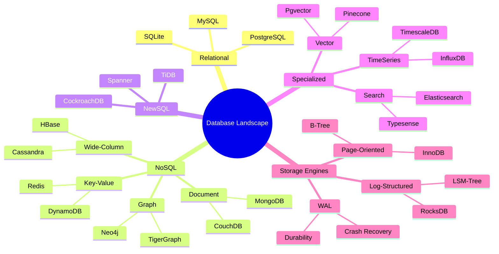
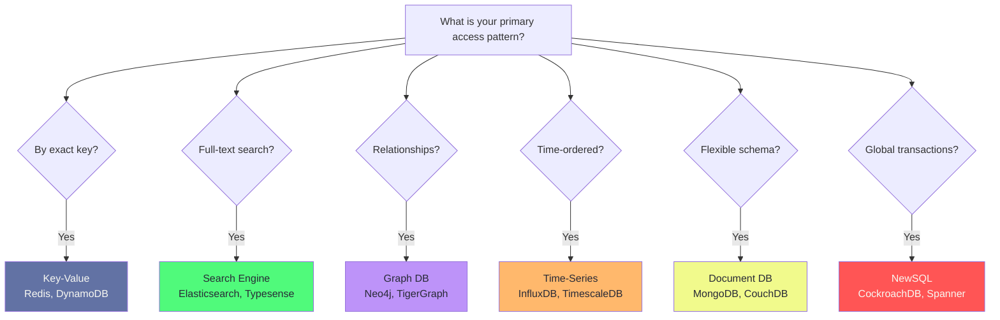
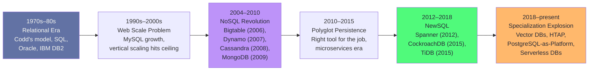
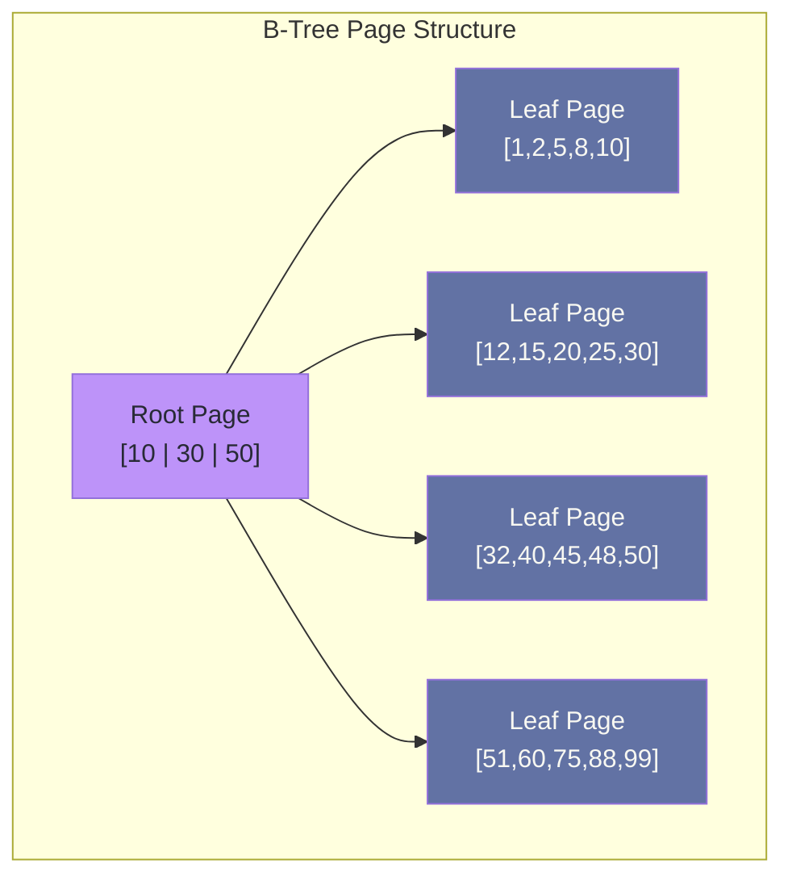
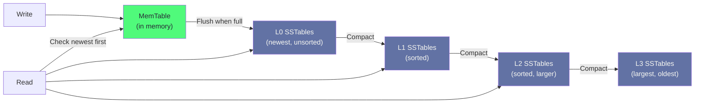
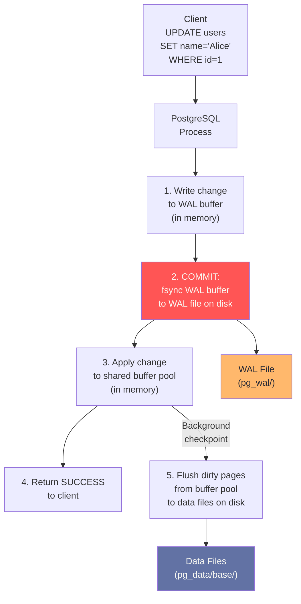
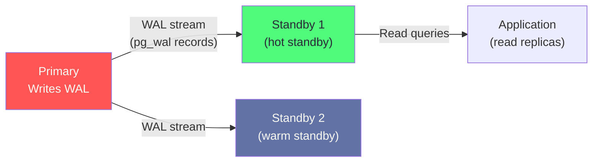

# Chapter 1: The Database Landscape

> "Choosing a database without understanding the landscape is like choosing a route without a map."

## Mind Map



## Overview

Every database in production today was designed around a specific set of trade-offs made decades ago. PostgreSQL was designed in 1986 to maximize correctness. Cassandra was designed in 2007 to maximize write throughput across data centers. Redis was designed in 2009 to maximize speed by keeping everything in memory. Understanding *why* each system made its original trade-offs is the prerequisite for choosing the right one for your workload.

This chapter maps the landscape: nine categories of databases, the two dominant storage engine architectures, how the Write-Ahead Log makes durability possible, and why PostgreSQL is quietly becoming the platform of choice for workloads it was never originally designed for.

---

## Database Categories

Nine categories cover almost every workload you will encounter in production.

| Category | Model | Query Language | Consistency | Best For |
|----------|-------|---------------|-------------|---------|
| **RDBMS** | Tables + rows | SQL | Strong (ACID) | General-purpose structured data |
| **Document** | JSON documents | MongoDB Query / SQL | Eventual or strong | Hierarchical data, variable schema |
| **Key-Value** | Hash map | GET/SET/DEL | Eventual | Caching, sessions, counters |
| **Wide-Column** | Column families | CQL / HQL | Tunable | Time-series, write-heavy, sparse data |
| **Graph** | Nodes + edges | Cypher / Gremlin | Strong | Relationships, recommendations, fraud |
| **Time-Series** | Tagged measurements | InfluxQL / SQL | Strong | Metrics, IoT, events |
| **Search** | Inverted index | Lucene / DSL | Near real-time | Full-text search, faceted navigation |
| **NewSQL** | Tables + rows | SQL | Distributed ACID | Global transactions at scale |
| **Vector** | Embeddings | ANN queries | Eventual | Semantic search, ML retrieval |

### RDBMS: Still the Default

Relational databases remain the default for most applications because they handle the widest variety of queries correctly. An RDBMS stores data in tables (relations), enforces referential integrity with foreign keys, and executes any ad-hoc SQL query the application sends — including JOINs across multiple tables that were not anticipated when the schema was designed.

The cost is predictability. RDBMSes scale vertically easily but horizontal scaling (sharding, distributed transactions) requires significant engineering. The classic RDBMS ceiling is around 10–50K write QPS on a single primary — after that, you are sharding or considering alternatives.

### NoSQL: Designed for Specific Access Patterns

NoSQL databases traded SQL expressiveness for specific performance guarantees. Key-value stores sacrifice queryability for O(1) reads. Wide-column stores sacrifice joins for write throughput. Document stores sacrifice normalization for schema flexibility. These are not inferior choices — they are better choices for the specific workloads they were designed for.



### NewSQL: Distributed SQL

NewSQL databases attempt to combine the SQL interface and ACID guarantees of traditional RDBMSes with the horizontal scalability of NoSQL systems. CockroachDB and Google Spanner achieve this through distributed consensus (Raft/Paxos) and multi-version concurrency control. The cost: higher latency on single-row operations compared to a local PostgreSQL query, and substantially higher operational complexity.

Use NewSQL when you need: SQL, ACID transactions, and geographic distribution. Do not use it as a drop-in PostgreSQL replacement — the latency characteristics are different enough to surprise you.

---

## Evolution Timeline



The NoSQL revolution was not a rejection of relational theory — it was a pragmatic response to scaling limits that SQL databases had not yet solved. Today, PostgreSQL has absorbed many lessons from that era (native JSON columns, LISTEN/NOTIFY for streaming, logical replication for CDC) while maintaining its correctness guarantees.

---

## Storage Engine Fundamentals

Every database sits atop one of two fundamental storage architectures. Understanding these shapes everything else: read/write performance characteristics, crash recovery behavior, compaction overhead, and index design.

### Page-Oriented Storage (B-Tree Based)

Page-oriented engines divide disk into fixed-size pages (typically 8KB in PostgreSQL, 16KB in MySQL). Data is organized as a B-tree where each node is one page. An update modifies the page in-place after writing to the WAL.



**Strengths:** Excellent read performance, predictable O(log n) lookups, in-place updates minimize write amplification for single-row updates.

**Weaknesses:** Page splits under write load cause fragmentation; random writes are slower than sequential; vacuum/bloat management required (PostgreSQL-specific).

### Log-Structured Merge-Tree (LSM)

LSM engines never update data in-place. Every write appends to an in-memory buffer (memtable), which is periodically flushed to immutable sorted files on disk (SSTables). A background compaction process merges SSTables to remove deleted entries and maintain read performance.



**Strengths:** Sequential writes make LSM extremely fast for write-heavy workloads; used by Cassandra, RocksDB, LevelDB; excellent for time-series and append-only data.

**Weaknesses:** Read amplification (must check multiple levels), compaction I/O overhead (write amplification factor of 10–30×), higher space amplification during compaction.

### Choosing Between Them

| Workload | Recommended Engine | Reason |
|----------|-------------------|--------|
| OLTP (many small reads and writes) | B-Tree (PostgreSQL, MySQL) | Low read latency, in-place updates |
| Write-heavy, high-cardinality | LSM (Cassandra, RocksDB) | Sequential writes, no locking |
| Analytics (large scans) | Column-oriented (Parquet, ClickHouse) | Compression, vectorized execution |
| Mixed OLTP + analytics | HTAP (TiDB, SingleStore) | Separate row + column stores |

---

## WAL Mechanics

The Write-Ahead Log is the mechanism that makes database durability possible without sacrificing performance. The rule is simple but profound: **before any data page is modified, the change must first be written to the WAL and fsync'd to disk**.

### The Write Path



### Why WAL Makes Durability Possible

The key insight: sequential writes to the WAL are orders of magnitude faster than random writes to data files. PostgreSQL commits a transaction the moment the WAL entry is fsynced — the actual data file update can happen later (during checkpoint) because the WAL contains enough information to replay the change.

If the server crashes between step 3 and step 5, PostgreSQL replays the WAL on restart to bring data files back to a consistent state. This is crash recovery.

### WAL and Replication

The WAL is also the mechanism for streaming replication. PostgreSQL primary servers stream WAL records to standbys, which replay them to stay in sync. This is the same WAL used for crash recovery — replication is just crash recovery applied to a different machine in real-time.



:::tip WAL Level Controls What Gets Logged
`wal_level = minimal` — crash recovery only.
`wal_level = replica` — crash recovery + streaming replication.
`wal_level = logical` — full change data capture (CDC), required for logical replication and tools like Debezium.
:::

---

## The PostgreSQL-as-Platform Trend

PostgreSQL's extension system has matured to the point where a single PostgreSQL cluster can replace multiple specialized databases in your stack. This is not theory — Instagram, Notion, Stripe, and Shopify all run PostgreSQL as the core of their data platform.

| Extension | Adds to PostgreSQL | Replaces |
|-----------|--------------------|---------|
| **pgvector** | Vector similarity search, ANN indexes | Pinecone, Weaviate |
| **TimescaleDB** | Time-series hypertables, compression, continuous aggregates | InfluxDB, TimescaleDB standalone |
| **PostGIS** | Geospatial types, spatial indexes, geographic queries | Specialized geo DBs |
| **pg_partman** | Automated table partitioning management | Manual partition scripts |
| **Citus** | Horizontal sharding, distributed queries | Standalone sharding middleware |
| **pg_cron** | Database-side job scheduling | External cron + application logic |
| **pglogical** | Logical replication, selective table sync | External CDC tools |

### When to Use PostgreSQL-as-Platform

The strategy works well when:
- Your team already operates PostgreSQL (one less system to learn)
- Workload volumes are moderate (vector search under 10M embeddings, time-series under 50GB/day)
- You want ACID consistency across multiple data types in one transaction

The strategy breaks down when:
- You need sub-millisecond vector ANN at scale (dedicated vector DB wins)
- You need petabyte-scale time-series ingest (dedicated TSDB with LSM wins)
- You need deep Elasticsearch-style relevance scoring and faceting (dedicated search wins)

:::warning Do Not Over-Consolidate
PostgreSQL-as-Platform reduces operational overhead but can create resource contention. A heavy vector search workload on the same instance as your OLTP transactions degrades both. Use `pg_bouncer` connection pooling, read replicas for analytics, and connection limits per workload type.
:::

---

## Database Categories Deep Dive

### Wide-Column Stores (Cassandra, HBase)

Wide-column stores are often misunderstood. The name refers to the data model, not column-oriented storage (which is something different used in analytics). A Cassandra table has:
- A **partition key** that determines which node stores the row
- A **clustering key** that determines the sort order within a partition
- **Columns** that can vary per row (hence "wide")

The critical design rule: **all queries must filter by partition key**. Cassandra does not have JOINs, secondary indexes are expensive, and ALLOW FILTERING is a full table scan. You design your Cassandra schema entirely around the queries you need to run — one table per query pattern.

### Graph Databases (Neo4j, TigerGraph)

Graph databases store nodes and relationships as first-class citizens. A `MATCH (u:User)-[:FOLLOWS]->(v:User) WHERE u.id = 1 RETURN v` query in Cypher traverses the graph by pointer chasing — no JOINs, no index lookups. This is dramatically faster than the equivalent SQL self-join for deep traversals (6+ hops).

Graph databases are the right choice when your data is inherently a network: social graphs, knowledge graphs, fraud detection (linked accounts), recommendation engines (collaborative filtering).

### Vector Databases (pgvector, Pinecone)

Vector databases store dense floating-point embeddings (typically 768–1536 dimensions for language models) and answer approximate nearest neighbor (ANN) queries: "find the 10 documents whose embedding is closest to this query embedding." This powers semantic search, retrieval-augmented generation (RAG), and image similarity.

```sql
-- pgvector example: find 10 most similar product descriptions
SELECT id, description, embedding <-> '[0.1, 0.3, ...]'::vector AS distance
FROM products
ORDER BY distance
LIMIT 10;
```

The `<->` operator computes L2 distance. `<#>` computes inner product (for normalized vectors). `<=>` computes cosine distance.

---

## Case Study: Shopify's Database Strategy

Shopify processes $75+ billion in annual merchant sales and serves millions of concurrent storefronts. Their database architecture illustrates the trade-offs of the current landscape.

**Core transactional layer:** MySQL (InnoDB) sharded via **Vitess**. Shopify chose MySQL in 2004 when PostgreSQL's replication story was immature. They stayed on MySQL because Vitess — originally built by YouTube — provides transparent horizontal sharding over MySQL with minimal application changes. As of 2023, Shopify runs hundreds of MySQL shards behind Vitess.

**Analytics layer:** **ClickHouse** for real-time merchant analytics dashboards. ClickHouse is a column-oriented OLAP database that can scan billions of rows per second on modest hardware. Shopify routes all analytical queries — "show me my sales by day over the last 90 days" — to ClickHouse rather than MySQL to avoid analytics traffic competing with transactional traffic.

**Caching layer:** **Redis** for sessions, rate limiting, inventory locks, and hot product data. Redis handles ~1M operations/second per Shopify shard at sub-millisecond latency.

**Search:** **Elasticsearch** for merchant product catalog search. Full-text search with fuzzy matching, faceting, and relevance ranking.

**Key Decisions:**
- Vitess enables horizontal MySQL scaling without rewriting the application
- ClickHouse handles analytic queries at a cost 100× lower than running analytics on MySQL
- Redis absorbs the hot read path — most product page views never reach MySQL
- Separate search engine avoids full-text indexing overhead on the transactional database

**The lesson:** At Shopify's scale, polyglot persistence is not optional — it is the only architecture that works. Each system does exactly one thing at maximum efficiency.

---

## Related Chapters

| Chapter | Relevance |
|---------|-----------|
| [Ch02 — Data Modeling for Scale](/database/part-1-foundations/ch02-data-modeling-for-scale) | How to design schemas for your chosen database category |
| [Ch03 — Indexing Strategies](/database/part-1-foundations/ch03-indexing-strategies) | Index types for B-tree and specialized storage engines |
| [Ch05 — PostgreSQL in Production](/database/part-2-engines/ch05-postgresql-in-production) | Deep dive into PostgreSQL internals and tuning |
| [System Design Ch09](/system-design/part-2-building-blocks/ch09-databases-sql) | SQL database selection from a system design perspective |
| [System Design Ch10](/system-design/part-2-building-blocks/ch10-databases-nosql) | NoSQL selection and CAP theorem application |

---

## Practice Questions

### Beginner

1. **Storage Engine Choice:** A startup is building a task management application where each task has a flexible set of custom fields (different for each organization). They expect 100K reads/day and 10K writes/day. Should they use PostgreSQL with JSONB columns, MongoDB, or a key-value store? Justify your answer with reference to the access patterns.

   <details>
   <summary>Hint</summary>
   Consider: do they need ACID transactions across tasks? Do they need to query by custom field values? What is the write/read ratio? JSONB in PostgreSQL handles schema flexibility while keeping SQL expressiveness — a good default unless you have a specific reason for a document store.
   </details>

2. **WAL Recovery:** A PostgreSQL server crashes immediately after a transaction commits. When the server restarts, how does PostgreSQL ensure the committed data is not lost? What role does the WAL play, and why is it sufficient even if the data page was not yet written to the main data file?

   <details>
   <summary>Hint</summary>
   The WAL is fsync'd before the commit returns. On restart, PostgreSQL replays all WAL records since the last checkpoint. A committed transaction's WAL record contains all the information needed to reconstruct the data page change.
   </details>

### Intermediate

3. **Database Selection:** An e-commerce company wants to add three features: (a) "customers who bought this also bought" recommendations, (b) product inventory tracking with sub-millisecond reads, (c) full-text product search with faceting. For each feature, choose a database category and justify. Can any two features share a database?

   <details>
   <summary>Hint</summary>
   (a) Graph DB or collaborative filtering in Redis. (b) Redis for the hot path, backed by PostgreSQL for durability. (c) Elasticsearch or PostgreSQL with tsvector for moderate scale. Redis + PostgreSQL could share infrastructure for (a) and (b).
   </details>

4. **LSM vs B-Tree:** A metrics collection service ingests 500K events per second from IoT sensors, retains data for 30 days, and answers range queries like "average temperature for sensor X over the last 24 hours." Would you use a B-tree based PostgreSQL or an LSM-based time-series database? What are the specific technical reasons?

   <details>
   <summary>Hint</summary>
   LSM wins: 500K writes/sec would cause severe B-tree page split contention and WAL pressure. LSM's sequential append model handles write-heavy workloads much better. TimescaleDB (PostgreSQL extension) uses chunk-based partitioning to give PostgreSQL LSM-like write characteristics for time-series.
   </details>

### Advanced

5. **PostgreSQL-as-Platform Analysis:** A team is considering consolidating their current stack (PostgreSQL + Redis + Elasticsearch + Pinecone) onto a single PostgreSQL instance with pgvector, full-text search, and pg_cron. They process 50K transactions/day, 5M vector searches/day, and 2M full-text searches/day. Analyze the trade-offs of consolidation vs. separation. What would you recommend and why?

   <details>
   <summary>Hint</summary>
   5M vector searches/day is ~58/sec, and 2M full-text searches/day is ~23/sec. At this scale, consolidation is feasible with proper connection pooling and read replicas. The risk is resource contention between OLTP (CPU + I/O for row fetches) and vector search (CPU-intensive ANN computation). A read replica dedicated to search + vector workloads solves this. Pinecone is only necessary above ~50M embeddings at sub-100ms p99 — below that, pgvector with an HNSW index is comparable.
   </details>

---

## References & Further Reading

- [The PostgreSQL Documentation — Storage Architecture](https://www.postgresql.org/docs/current/storage.html)
- [Bigtable: A Distributed Storage System for Structured Data](https://research.google/pubs/pub27898/) — Chang et al., Google (2006)
- [Dynamo: Amazon's Highly Available Key-Value Store](https://www.allthingsdistributed.com/files/amazon-dynamo-sosp2007.pdf) — DeCandia et al. (2007)
- [The Log-Structured Merge-Tree](https://www.cs.umb.edu/~poneil/lsmtree.pdf) — O'Neil et al. (1996)
- [Vitess: Scaling MySQL at YouTube](https://vitess.io/docs/overview/history/) — Sougou et al.
- ["Designing Data-Intensive Applications"](https://dataintensive.net/) — Martin Kleppmann, Chapters 2–3
- [pgvector: Open-Source Vector Similarity Search for Postgres](https://github.com/pgvector/pgvector)
