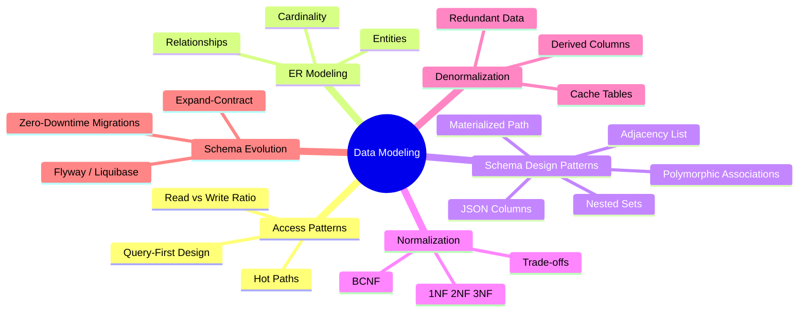
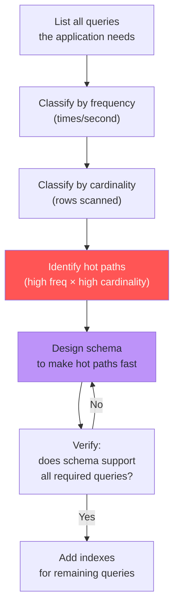
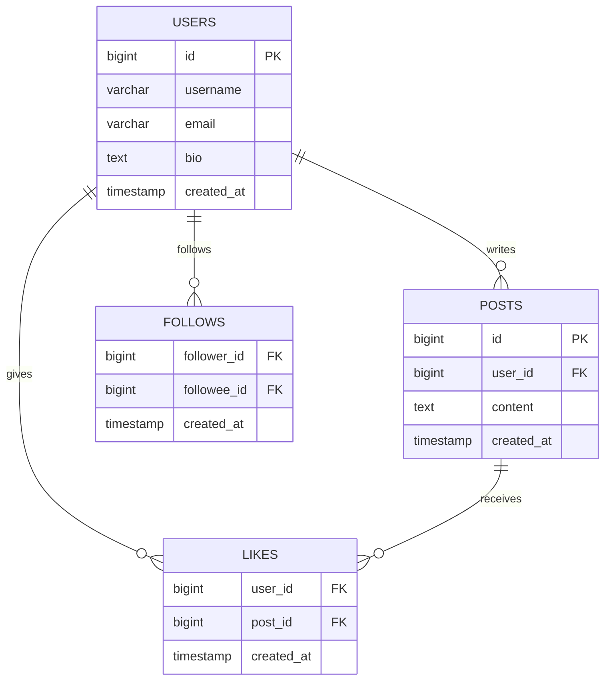
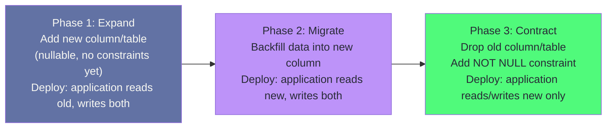

# Chapter 2: Data Modeling for Scale

> "The data model you choose will be the most important decision you make. It will outlast every framework, library, and engineer on the team."

## Mind Map



## Overview

Most engineers design schemas by mapping their application's domain objects to tables: `User` becomes `users`, `Order` becomes `orders`. This is a reasonable starting point for small applications, but it fails at scale because it optimizes for the data shape, not the data access pattern.

At scale, the question is not "what does a User look like?" It is "what queries will run against users ten thousand times per second, and does the schema make those queries fast?" This chapter teaches the discipline of access-pattern-driven design — starting from queries, not entities.

---

## Access-Pattern-Driven Design

### Start with Queries, Not Entities

The canonical mistake in schema design: sketch the domain model first, then figure out how to query it. This produces schemas that are correct but slow.

The right approach:

1. List every query the application will run
2. For each query: identify the access key, the filter conditions, the sort order, and the projected columns
3. Design the schema to make the high-frequency, high-cardinality queries fast
4. Accept that low-frequency queries may be slow



### Read/Write Ratio Shapes Everything

The read/write ratio of a workload determines whether to prioritize query speed (optimize for reads, accept denormalization) or write speed (normalize, accept query complexity).

| Ratio | Typical Workload | Schema Strategy |
|-------|----------------|----------------|
| 100:1+ reads | Product catalog, static content | Aggressively denormalize, precompute |
| 10:1 reads | Social feeds, dashboards | Moderate denormalization, materialized views |
| 1:1 balanced | Chat, collaborative editing | Normalize with careful indexing |
| 1:10 writes | Logging, event ingest, IoT | Append-only, partition by time, LSM-friendly |

---

## Worked Example: Social Media Schema

### Step 1: Define the Access Patterns

For a simplified social media application, the critical access patterns are:

| Query | Frequency | Key | Sort |
|-------|-----------|-----|------|
| Get user profile | Very high | `user_id` | — |
| Get posts by user | High | `user_id` | `created_at DESC` |
| Get home feed (posts from follows) | Very high | `user_id` | `created_at DESC` |
| Get post with like count | High | `post_id` | — |
| Check if user A follows user B | High | `(follower_id, followee_id)` | — |
| Get follower count | Medium | `user_id` | — |

### Step 2: Naive ER Diagram



### Step 3: Physical Schema with Optimizations

```sql
-- Users: primary key lookup is the hot path
CREATE TABLE users (
    id          BIGINT GENERATED ALWAYS AS IDENTITY PRIMARY KEY,
    username    VARCHAR(50) NOT NULL UNIQUE,
    email       VARCHAR(255) NOT NULL UNIQUE,
    bio         TEXT,
    -- Denormalized: precomputed counts avoid expensive COUNT() queries
    post_count      INT NOT NULL DEFAULT 0,
    follower_count  INT NOT NULL DEFAULT 0,
    following_count INT NOT NULL DEFAULT 0,
    created_at  TIMESTAMPTZ NOT NULL DEFAULT NOW()
);

-- Posts: most common query is user_id + created_at range scan
CREATE TABLE posts (
    id          BIGINT GENERATED ALWAYS AS IDENTITY PRIMARY KEY,
    user_id     BIGINT NOT NULL REFERENCES users(id) ON DELETE CASCADE,
    content     TEXT NOT NULL,
    -- Denormalized: precomputed to avoid JOIN on every post render
    like_count  INT NOT NULL DEFAULT 0,
    created_at  TIMESTAMPTZ NOT NULL DEFAULT NOW()
);

-- Critical index: covering index for the "posts by user, sorted by date" query
CREATE INDEX idx_posts_user_created
    ON posts (user_id, created_at DESC)
    INCLUDE (content, like_count);

-- Follows: composite primary key = O(1) "does A follow B?" lookup
CREATE TABLE follows (
    follower_id BIGINT NOT NULL REFERENCES users(id) ON DELETE CASCADE,
    followee_id BIGINT NOT NULL REFERENCES users(id) ON DELETE CASCADE,
    created_at  TIMESTAMPTZ NOT NULL DEFAULT NOW(),
    PRIMARY KEY (follower_id, followee_id)
);

-- Additional index for "who follows user X" query direction
CREATE INDEX idx_follows_followee ON follows (followee_id, follower_id);

-- Likes: composite primary key prevents duplicate likes
CREATE TABLE likes (
    user_id     BIGINT NOT NULL REFERENCES users(id) ON DELETE CASCADE,
    post_id     BIGINT NOT NULL REFERENCES posts(id) ON DELETE CASCADE,
    created_at  TIMESTAMPTZ NOT NULL DEFAULT NOW(),
    PRIMARY KEY (user_id, post_id)
);

CREATE INDEX idx_likes_post ON likes (post_id);
```

### Step 4: The Home Feed Problem

The home feed ("show me recent posts from people I follow") is the hardest query to make fast because it requires knowing who the user follows, then fetching posts from all of them, sorted by time.

```sql
-- Naive approach: expensive at scale
SELECT p.*
FROM posts p
JOIN follows f ON p.user_id = f.followee_id
WHERE f.follower_id = $1
ORDER BY p.created_at DESC
LIMIT 20;
```

At 10K followers and millions of posts, this query scans the `follows` table for the user (10K rows), then does a nested loop into `posts` for each followee. At scale, this is too slow.

**Solutions at scale:**
1. **Fan-out on write (push model):** When user A posts, write to a feed table for each of their followers immediately. Fast reads, expensive writes.
2. **Fan-out on read with caching (pull model):** At read time, fetch following list from cache, batch fetch recent posts per followee from cache, merge. Expensive reads, cheap writes.
3. **Hybrid:** Use push for users with <1000 followers, pull for high-follower accounts (celebrities).

Instagram uses the hybrid model. Twitter famously struggled with the push model for accounts with millions of followers (the "celebrity problem").

---

## Denormalization Decision Framework

Denormalization trades storage and write complexity for read speed. It is not always the right choice.

### Cost Model for a Derived Column

Before adding a denormalized `like_count` column to `posts`:

| Factor | Normalized (`COUNT(*)`) | Denormalized (`like_count`) |
|--------|------------------------|---------------------------|
| **Read cost** | Full `likes` table scan for post | Single column read, O(1) |
| **Write cost** | No overhead | `UPDATE posts SET like_count = like_count + 1` on every like |
| **Consistency** | Always correct | Eventual (can drift under concurrent updates) |
| **Storage** | No overhead | 4 bytes per row |
| **Complexity** | Simple | Requires trigger or application logic |

**Decision rule:** Denormalize if the read frequency × read cost exceeds the write frequency × write cost by 10× or more. For `like_count`, a post is liked ~10× per day but displayed ~1000× per day — denormalization clearly wins.

:::warning Denormalized Counts Drift Under Concurrency
Without proper locking, concurrent `like_count` updates cause lost updates:
```sql
-- WRONG: race condition
UPDATE posts SET like_count = like_count + 1 WHERE id = $1;
```
This single SQL statement is safe in PostgreSQL — the row-level lock is acquired and released within the statement. However, under extreme contention (thousands of concurrent likes on the same viral post), lock contention itself becomes the bottleneck: each `UPDATE` must wait for the previous one to release the row lock, serializing all writes. At that scale, buffer the counter in Redis (`INCR`) and periodically flush to PostgreSQL. The truly dangerous pattern is read-modify-write in application code:
```python
# WRONG: read then write in application
post = db.query("SELECT like_count FROM posts WHERE id = $1")
db.execute("UPDATE posts SET like_count = $1 WHERE id = $2", post.like_count + 1, post_id)
```
:::

---

## Schema Design Patterns

### Adjacency List (Hierarchical Data)

The simplest pattern for trees: each row references its parent.

```sql
CREATE TABLE categories (
    id        BIGINT PRIMARY KEY,
    name      VARCHAR(100) NOT NULL,
    parent_id BIGINT REFERENCES categories(id)
);

-- Find all subcategories of 'Electronics' (recursive CTE)
WITH RECURSIVE subtree AS (
    SELECT id, name, parent_id FROM categories WHERE name = 'Electronics'
    UNION ALL
    SELECT c.id, c.name, c.parent_id
    FROM categories c
    JOIN subtree s ON c.parent_id = s.id
)
SELECT * FROM subtree;
```

**Pros:** Simple schema, efficient single-row operations.
**Cons:** Arbitrary-depth traversal requires recursive CTEs; expensive for deep trees.

### Materialized Path

Store the full path from root to node as a string.

```sql
CREATE TABLE categories (
    id   BIGINT PRIMARY KEY,
    name VARCHAR(100),
    path LTREE  -- PostgreSQL ltree extension: 'Electronics.Computers.Laptops'
);

-- Find all descendants of 'Electronics' — index-supported
SELECT * FROM categories WHERE path <@ 'Electronics';

-- Find all ancestors of 'Laptops'
SELECT * FROM categories WHERE path @> 'Electronics.Computers.Laptops';
```

**Pros:** Subtree queries are fast with GiST index on `path`.
**Cons:** Moving a subtree requires updating all descendant paths; path length is bounded.

### Polymorphic Associations

When a table relates to multiple other tables (e.g., comments can belong to posts or videos):

```sql
-- Option A: Nullable foreign keys (simple but allows inconsistency)
CREATE TABLE comments (
    id         BIGINT PRIMARY KEY,
    content    TEXT,
    post_id    BIGINT REFERENCES posts(id),
    video_id   BIGINT REFERENCES videos(id),
    -- Only one should be non-null
    CHECK (
        (post_id IS NOT NULL AND video_id IS NULL) OR
        (post_id IS NULL AND video_id IS NOT NULL)
    )
);

-- Option B: Separate join tables (cleaner, more verbose)
CREATE TABLE post_comments  (comment_id BIGINT, post_id  BIGINT, PRIMARY KEY (comment_id, post_id));
CREATE TABLE video_comments (comment_id BIGINT, video_id BIGINT, PRIMARY KEY (comment_id, video_id));
```

Option B is recommended for new schemas. Option A is common in Rails applications using `commentable_type` / `commentable_id` but prevents foreign key enforcement.

### JSON Columns for Flexible Attributes

PostgreSQL's JSONB type stores JSON as binary, supports indexing, and allows querying into nested structures.

```sql
CREATE TABLE products (
    id         BIGINT PRIMARY KEY,
    name       VARCHAR(255),
    category   VARCHAR(100),
    -- Flexible attributes differ by category
    attributes JSONB NOT NULL DEFAULT '{}'
);

-- Index a specific JSONB key (for frequent queries on brand)
CREATE INDEX idx_products_brand
    ON products ((attributes->>'brand'));

-- GIN index for arbitrary key lookups
CREATE INDEX idx_products_attrs_gin
    ON products USING GIN (attributes);

-- Query products by brand (uses idx_products_brand)
SELECT * FROM products WHERE attributes->>'brand' = 'Apple';

-- Query products where attributes contain specific key-value
SELECT * FROM products WHERE attributes @> '{"color": "red"}';
```

:::tip JSONB vs JSON
Always use `JSONB` (binary JSON), never `JSON` (text JSON). `JSONB` is stored in a decomposed binary format that supports indexing and key access without re-parsing. `JSON` is stored as text and re-parses on every access.
:::

---

## Schema Evolution

Production schemas never stay fixed. New features require new columns; business requirements change; data types need widening. Zero-downtime schema evolution is one of the hardest problems in database engineering.

### The Expand-Contract Pattern

The safest approach for zero-downtime schema changes in PostgreSQL:



**Example: Rename `users.name` to `users.full_name`**

```sql
-- Phase 1: Add new column (nullable, instant in PostgreSQL)
ALTER TABLE users ADD COLUMN full_name VARCHAR(255);

-- Phase 2: Backfill (can run in batches without locking)
UPDATE users SET full_name = name WHERE full_name IS NULL;

-- Phase 3: Add NOT NULL constraint AFTER backfill
ALTER TABLE users ALTER COLUMN full_name SET NOT NULL;
-- Drop old column after all application code has switched
ALTER TABLE users DROP COLUMN name;
```

### Adding NOT NULL Without a Table Rewrite

In PostgreSQL 11+, you can add a `NOT NULL` column with a default without rewriting the table (the default is stored in catalog, not on each row):

```sql
-- PostgreSQL 11+: instant, no table rewrite
ALTER TABLE orders ADD COLUMN status VARCHAR(20) NOT NULL DEFAULT 'pending';
```

In PostgreSQL 10 and below, this rewrites the entire table and locks it. Always check your PostgreSQL version before running schema changes.

### Tools: Flyway and Atlas

**Flyway:** SQL-based migration tool. Migrations are versioned SQL files (`V1__init.sql`, `V2__add_index.sql`). Simple, widely adopted, supports rollback via separate `U` scripts.

```
db/migrations/
  V1__create_users.sql
  V2__add_follower_count.sql
  V3__create_posts.sql
```

**Atlas:** Newer declarative schema tool. Define the desired schema state; Atlas computes the migration. Better for teams that prefer "desired state" over "sequence of changes."

:::info Locking in PostgreSQL Schema Changes
- `ADD COLUMN` (nullable): instant, no lock
- `ADD COLUMN` (NOT NULL, no default): rewrites table, AccessExclusiveLock
- `CREATE INDEX`: `ACCESS SHARE` lock (concurrent reads OK, writes blocked)
- `CREATE INDEX CONCURRENTLY`: no write lock, takes longer, can fail
- `ADD FOREIGN KEY`: full table scan + ShareRowExclusiveLock
- `DROP COLUMN`: instant (marks column as dropped, no physical removal)
:::

---

## Case Study: Stripe's Payment Schema Design

Stripe processes hundreds of billions of dollars annually. Their data model reveals how a payments company thinks about correctness, immutability, and auditability.

**Core insight: payment data is never deleted and rarely updated.** The events in a payment's lifecycle are append-only. This shapes the entire schema philosophy.

**Key design decisions:**

**1. Immutable event log as source of truth**

```sql
-- Stripe's conceptual model (simplified)
CREATE TABLE payment_intents (
    id          VARCHAR(30) PRIMARY KEY,  -- 'pi_3N...'
    amount      BIGINT NOT NULL,           -- in cents, always integer
    currency    CHAR(3) NOT NULL,          -- ISO 4217: 'usd', 'eur'
    status      VARCHAR(30) NOT NULL,      -- 'requires_payment_method', 'succeeded', etc.
    created_at  TIMESTAMPTZ NOT NULL,
    updated_at  TIMESTAMPTZ NOT NULL
);

-- Every state transition is recorded — nothing is deleted
CREATE TABLE payment_intent_events (
    id                  VARCHAR(30) PRIMARY KEY,
    payment_intent_id   VARCHAR(30) NOT NULL REFERENCES payment_intents(id),
    event_type          VARCHAR(50) NOT NULL,  -- 'payment_intent.created', 'payment_intent.succeeded'
    data                JSONB NOT NULL,         -- full event payload
    created_at          TIMESTAMPTZ NOT NULL
);
```

**2. Integer amounts, never floats**

Every currency amount at Stripe is stored as an integer in the smallest currency unit (cents for USD, pence for GBP). `$99.99` is stored as `9999`. Floating-point arithmetic on money causes rounding errors that accumulate to real dollars at Stripe's transaction volume.

**3. Idempotency keys prevent double-charges**

```sql
CREATE TABLE idempotency_keys (
    key         VARCHAR(255) PRIMARY KEY,
    user_id     BIGINT NOT NULL,
    request_path VARCHAR(255) NOT NULL,
    response    JSONB,           -- stored response to replay
    locked_at   TIMESTAMPTZ,     -- set while request is in-flight
    created_at  TIMESTAMPTZ NOT NULL DEFAULT NOW(),
    -- Expire after 24 hours
    CONSTRAINT idempotency_keys_expiry CHECK (created_at > NOW() - INTERVAL '24 hours')
);
```

When a client retries a payment request with the same idempotency key, Stripe returns the stored response without re-processing. The `locked_at` column prevents concurrent duplicate processing.

**4. Soft deletes for audit trails**

Stripe never hard-deletes records. A deleted payment method has `deleted_at TIMESTAMPTZ` set but remains in the database forever for compliance, fraud investigation, and customer support.

**The lesson:** Payment systems are not CRUD. They are append-only event ledgers. Designing them as CRUD systems creates compliance risks, audit trail gaps, and difficult-to-debug charge discrepancies.

---

## Related Chapters

| Chapter | Relevance |
|---------|-----------|
| [Ch01 — The Database Landscape](/database/part-1-foundations/ch01-database-landscape) | Storage engine fundamentals that constrain schema choices |
| [Ch03 — Indexing Strategies](/database/part-1-foundations/ch03-indexing-strategies) | How to index the schemas designed in this chapter |
| [Ch04 — Transactions & Concurrency Control](/database/part-1-foundations/ch04-transactions-concurrency-control) | How MVCC and locking interact with schema design |

---

## Practice Questions

### Beginner

1. **Normalization vs Denormalization:** An e-commerce site displays a product listing page showing each product's name, price, category name, and average review score. Design a normalized schema first. Then identify which fields, if any, should be denormalized for a catalog with 5M products receiving 10K page views/second.

   <details>
   <summary>Model Answer</summary>
   The category name can be joined from a `categories` table (small table, fits in cache). The average review score requires a query over the `reviews` table — with 5M products and 10K QPS, a real-time AVG query is too expensive; denormalize `avg_score` and update it via trigger or scheduled job.
   </details>

2. **Access Pattern Analysis:** A blog platform needs to support: (a) display blog post with author name and comment count, (b) list all posts by author sorted by newest, (c) search posts by title keyword. List the indexes needed for each query and explain why.

   <details>
   <summary>Model Answer</summary>
   (a) `post_id` primary key + denormalized `author_name` and `comment_count` on posts. (b) Index on `(author_id, created_at DESC)`. (c) GIN index on `to_tsvector(title)` for full-text search, or `ILIKE` with a trigram index (`pg_trgm`).
   </details>

### Intermediate

3. **Hierarchical Data:** You need to store a company's organizational chart (employees with managers, up to 10 levels deep) and support: (a) find all direct reports of a manager, (b) find the full chain of command from an employee to the CEO, (c) find all employees in a department subtree. Compare the adjacency list, materialized path, and nested sets patterns for this use case.

   <details>
   <summary>Model Answer</summary>
   (a) Adjacency list is sufficient. (b) Recursive CTE on adjacency list, or O(1) string prefix on materialized path. (c) Subtree query — adjacency list requires recursive CTE (expensive for 10 levels), materialized path with `ltree` is O(log n) with GiST index. For read-heavy org charts, `ltree` wins.
   </details>

4. **Schema Migration:** A users table has a `name VARCHAR(255)` column. You need to split it into `first_name` and `last_name` on a live system serving 50K QPS without downtime. Walk through the exact expand-contract steps including the SQL DDL for each phase.

   <details>
   <summary>Model Answer</summary>
   Phase 1: ADD COLUMN first_name / last_name (nullable). Deploy app to write both old and new columns. Phase 2: Backfill in batches (UPDATE ... WHERE first_name IS NULL LIMIT 1000). Phase 3: After backfill, add NOT NULL constraints, deploy app to read only new columns, drop old name column.
   </details>

### Advanced

5. **Payment Schema Design:** Design a complete schema for a subscription billing system where: users have subscriptions, subscriptions have billing cycles, each cycle generates an invoice, invoices have line items, and payments can be partial (user pays $50 of a $100 invoice). Requirements: every state change must be auditable, partial payments must be tracked, the system must handle retries idempotently. Design the schema, including idempotency key handling.

   <details>
   <summary>Model Answer</summary>
   Key tables: `subscriptions`, `subscription_events` (audit log), `billing_cycles`, `invoices`, `invoice_line_items`, `payments`, `payment_events`, `idempotency_keys`. Store amounts as integers (cents). Use `invoice_payments` join table to handle partial payments. The idempotency key should hash the operation + user + timestamp window to prevent double-charges on retry.
   </details>

---

## References & Further Reading

- ["Designing Data-Intensive Applications"](https://dataintensive.net/) — Martin Kleppmann, Chapter 2: Data Models and Query Languages
- [The Postgres JSONB Type](https://www.postgresql.org/docs/current/datatype-json.html) — PostgreSQL Documentation
- [Stripe's Idempotency Deep Dive](https://stripe.com/blog/idempotency) — Stripe Engineering Blog
- [Using ltree for Hierarchical Data in PostgreSQL](https://www.postgresql.org/docs/current/ltree.html) — PostgreSQL Documentation
- [Flyway Database Migrations](https://flywaydb.org/documentation/) — Official Documentation
- [Atlas Schema Migration Tool](https://atlasgo.io/docs) — Official Documentation
- [Django's Expand-Contract Pattern](https://docs.djangoproject.com/en/stable/topics/migrations/) — useful reference regardless of framework
