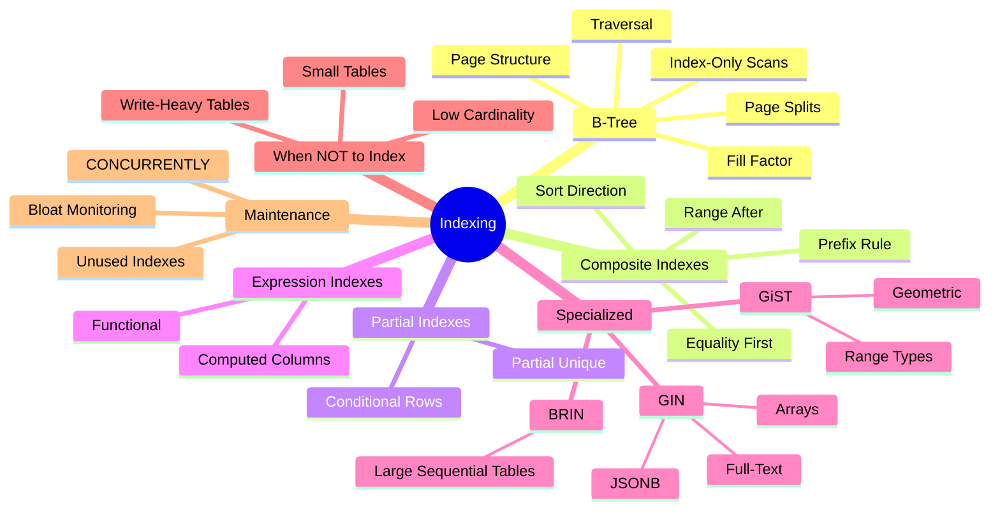
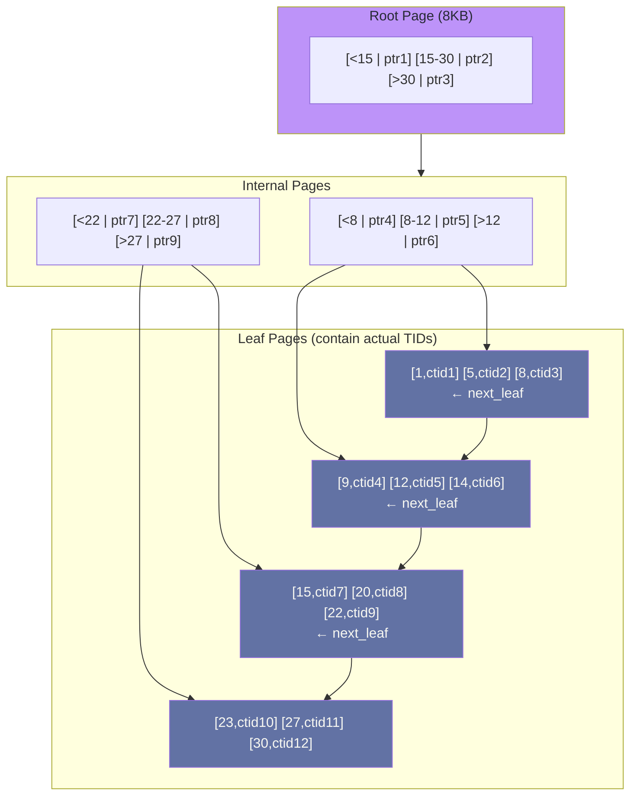
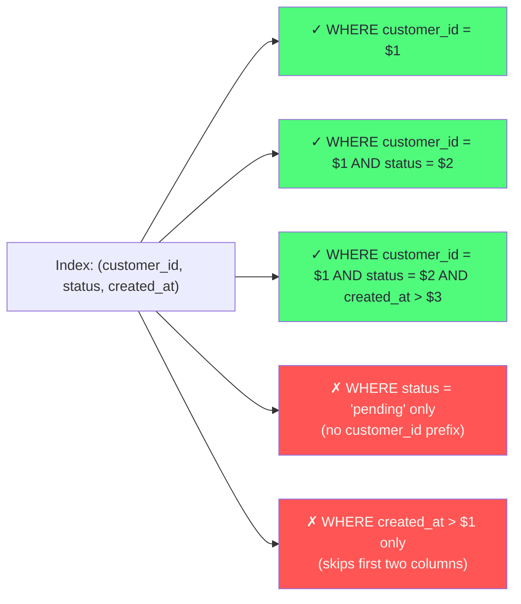

# Chapter 3: Indexing Strategies

> "An index is a bet that you will read the same data more often than you write it. Make that bet consciously."

## Mind Map



## Overview

Indexes are the single most impactful lever for query performance in relational databases. A query that takes 30 seconds without an index can take 3 milliseconds with the right one — a 10,000× improvement without changing a line of application code. But indexes are not free: every index doubles or triples the write amplification on the indexed table, consumes disk space, and must be maintained by autovacuum. This chapter teaches you to make every index decision deliberately.

---

## B-Tree Internals

PostgreSQL uses B-tree (balanced tree) indexes for all default index operations. Understanding the page structure is essential for understanding fill factor, page splits, and index bloat.

### Page Structure



**Key properties:**
- Leaf pages are linked in sorted order → range scans traverse linked list, not the tree
- Each leaf entry contains the indexed key value + a TID (tuple identifier = file block + offset)
- A lookup traverses root → internal → leaf: O(log n) where n = number of indexed rows
- For a table with 1 billion rows, a B-tree lookup traverses ~30 pages

### Fill Factor and Page Splits

Fill factor controls how full each B-tree page is when initially written (default: 90% for indexes in PostgreSQL).

When a page exceeds 100% fill:
1. PostgreSQL splits the page into two half-full pages
2. Entries are redistributed across both pages
3. The parent internal page is updated to reference both new pages

Page splits are expensive (two writes instead of one) and cause index bloat over time. For update-heavy tables (where index values change frequently), a lower fill factor (70–80%) leaves room for updates, reducing splits.

```sql
-- Index with fill factor 70 — good for columns that are frequently updated
CREATE INDEX idx_orders_status ON orders (status) WITH (fillfactor = 70);
```

### Index-Only Scans

When a query needs only columns that are stored in the index (the indexed column + any `INCLUDE`d columns), PostgreSQL can answer the query without touching the heap (table data pages at all).

```sql
-- Without INCLUDE: must fetch heap for name column
CREATE INDEX idx_users_email ON users (email);

-- With INCLUDE: can answer "SELECT name WHERE email = $1" without heap
CREATE INDEX idx_users_email_inc ON users (email) INCLUDE (name, created_at);

-- This query becomes an index-only scan
EXPLAIN SELECT name FROM users WHERE email = 'alice@example.com';
-- Index Only Scan using idx_users_email_inc on users
```

Index-only scans require the heap's visibility map to be current (updated by `VACUUM`). Tables with high churn may not benefit from index-only scans if the visibility map is stale.

---

## EXPLAIN ANALYZE Walkthrough

`EXPLAIN ANALYZE` executes the query and shows the actual execution plan with timing. Learn to read it before tuning anything.

```sql
EXPLAIN (ANALYZE, BUFFERS, FORMAT TEXT)
SELECT p.id, p.content, u.username
FROM posts p
JOIN users u ON p.user_id = u.id
WHERE p.user_id = 42
ORDER BY p.created_at DESC
LIMIT 10;
```

**Sample output (annotated):**

```
Limit  (cost=8.44..8.47 rows=10 width=72) (actual time=0.182..0.184 rows=10 loops=1)
  ->  Sort  (cost=8.44..8.50 rows=24 width=72) (actual time=0.180..0.181 rows=10 loops=1)
        Sort Key: p.created_at DESC
        Sort Method: top-N heapsort  Memory: 27kB
        ->  Nested Loop  (cost=0.57..7.90 rows=24 width=72) (actual time=0.049..0.164 rows=24 loops=1)
              ->  Index Scan using idx_posts_user_created on posts p
                  (cost=0.28..3.85 rows=24 width=64) (actual time=0.035..0.089 rows=24 loops=1)
                  Index Cond: (user_id = 42)
              ->  Index Scan using users_pkey on users u
                  (cost=0.29..0.17 rows=1 width=16) (actual time=0.003..0.003 rows=1 loops=24)
                  Index Cond: (id = p.user_id)
Planning Time: 0.421 ms
Execution Time: 0.217 ms
```

| Key field | What it means |
|-----------|--------------|
| `cost=X..Y` | Estimated cost in arbitrary units (X = startup, Y = total) |
| `actual time=X..Y` | Real time in ms (X = first row, Y = all rows) |
| `rows=N` | Estimated rows (planner) vs actual rows (analyzer) |
| `loops=N` | How many times this node was executed |
| `Buffers: hit=N read=N` | Cache hits vs disk reads (needs `BUFFERS` option) |

**Warning signs to look for:**
- `rows=1 actual rows=1M` — massive planner mis-estimate, stale statistics (run `ANALYZE`)
- `Seq Scan` on large table — missing index or planner chose full scan (check `enable_seqscan`)
- `Hash Join` with `batches=100` — hash spilled to disk, not enough `work_mem`
- `Sort Method: external merge` — sort spilled to disk, increase `work_mem`

---

## Composite Index Strategy

Composite indexes (indexes on multiple columns) are the most powerful and most misunderstood index type. The order of columns matters.

### The Equality-Range-Sort Rule

The columns in a composite index should be ordered as:
1. **Equality predicates first** (`WHERE status = 'active'`)
2. **Range predicates next** (`WHERE created_at > '2024-01-01'`)
3. **Sort columns last** (`ORDER BY created_at DESC`)

```sql
-- Query to optimize:
SELECT * FROM orders
WHERE customer_id = $1    -- equality
  AND status = 'pending'  -- equality
  AND created_at > $2     -- range
ORDER BY created_at DESC; -- sort

-- CORRECT index order: equality columns first, range/sort last
CREATE INDEX idx_orders_customer_status_created
    ON orders (customer_id, status, created_at DESC);

-- WRONG: range column before equality column
-- This index cannot use status or created_at predicates after the range
CREATE INDEX idx_orders_wrong
    ON orders (created_at, customer_id, status);
```

### The Prefix Rule

A composite index on `(a, b, c)` can be used for:
- Queries filtering on `a` only
- Queries filtering on `a, b`
- Queries filtering on `a, b, c`

It **cannot** be efficiently used for queries filtering on `b` only or `c` only (PostgreSQL would use a full index scan or skip to a sequential scan).



---

## Partial Indexes

A partial index indexes only the rows that satisfy a `WHERE` clause. It is smaller, faster to update, and more selective than a full index.

### Use Case: Active Records Only

```sql
-- A table with 10M orders, 9.5M completed, 500K pending
-- Queries almost always filter on pending orders

-- Full index: 10M entries, large, slow to update
CREATE INDEX idx_orders_status_full ON orders (status);

-- Partial index: only 500K entries, tiny, very fast
CREATE INDEX idx_orders_pending
    ON orders (customer_id, created_at DESC)
    WHERE status = 'pending';

-- This query uses the partial index (much faster)
SELECT * FROM orders
WHERE customer_id = $1 AND status = 'pending'
ORDER BY created_at DESC;
```

### Partial Unique Index

Partial indexes can enforce conditional uniqueness — a constraint that standard `UNIQUE` cannot express:

```sql
-- A user can have at most one active subscription
-- but unlimited historical (cancelled) subscriptions
CREATE UNIQUE INDEX idx_subscriptions_one_active
    ON subscriptions (user_id)
    WHERE status = 'active';
```

---

## Expression Indexes

Index the result of an expression rather than a raw column value.

```sql
-- Case-insensitive email lookups
CREATE INDEX idx_users_email_lower
    ON users (LOWER(email));

-- Query now uses the expression index
SELECT * FROM users WHERE LOWER(email) = LOWER($1);

-- Extracted JSON field (avoid full GIN for single-key lookups)
CREATE INDEX idx_events_user_id
    ON events ((payload->>'user_id'));

-- Date-only extraction from timestamp
CREATE INDEX idx_orders_date
    ON orders (DATE(created_at));
```

:::tip Match the Expression Exactly
The expression in the `WHERE` clause must match the expression in the index definition exactly. `LOWER(email)` in the index requires `LOWER(email)` in the query — not `LOWER(TRIM(email))`.
:::

---

## Specialized Index Types

### GIN — Generalized Inverted Index

GIN indexes are used for multi-valued column types where you want to index each value independently. Use cases: full-text search (`tsvector`), JSONB containment queries, arrays.

```sql
-- Full-text search on a tsvector column
CREATE INDEX idx_articles_fts
    ON articles USING GIN (to_tsvector('english', title || ' ' || body));

-- Query (uses GIN index)
SELECT * FROM articles
WHERE to_tsvector('english', title || ' ' || body) @@ to_tsquery('postgresql & index');

-- JSONB containment queries
CREATE INDEX idx_products_attrs
    ON products USING GIN (attributes);

-- Uses GIN index
SELECT * FROM products WHERE attributes @> '{"brand": "Apple", "color": "silver"}';

-- Array containment
CREATE INDEX idx_posts_tags
    ON posts USING GIN (tags);

SELECT * FROM posts WHERE tags @> ARRAY['postgresql', 'indexing'];
```

**GIN trade-off:** GIN indexes are slow to build and update (must decompose multi-valued columns), but blazing fast for containment queries. For write-heavy tables with JSONB, consider `CREATE INDEX ... WITH (fastupdate = true)` which batches GIN updates.

### GiST — Generalized Search Tree

GiST indexes support complex data types that require spatial or range queries.

```sql
-- Range type index (find overlapping date ranges)
CREATE INDEX idx_bookings_period
    ON bookings USING GIST (period);  -- period is tstzrange type

-- Find all bookings that overlap with [2024-01-15, 2024-01-20)
SELECT * FROM bookings
WHERE period && '[2024-01-15, 2024-01-20)'::tstzrange;

-- PostGIS geographic index
CREATE INDEX idx_restaurants_location
    ON restaurants USING GIST (location);  -- location is geometry type

-- Find restaurants within 5km of a point
SELECT name FROM restaurants
WHERE ST_DWithin(location, ST_Point(-122.4, 37.8)::geography, 5000);
```

### BRIN — Block Range INdex

BRIN indexes are tiny (a few pages regardless of table size) but only effective for data that is physically sorted by the indexed column — typically time-series data inserted in order.

```sql
-- BRIN on a timestamp column for append-only log table
-- Works well because rows are inserted in time order
CREATE INDEX idx_logs_created_brin
    ON application_logs USING BRIN (created_at);

-- Tiny index: only stores min/max per block range
-- Effective for "WHERE created_at > '2024-06-01'" on large log tables
```

BRIN indexes are 100–1000× smaller than B-tree indexes for the same column. The trade-off: BRIN can only skip block ranges, not pinpoint individual rows. Effective selectivity depends on data being physically ordered.

---

## When NOT to Index

Every index has a cost. Adding indexes without analysis is a common mistake.

### Do Not Index Low-Cardinality Columns

A `status` column with values `['pending', 'active', 'cancelled']` has low cardinality. An index on it is often not used because PostgreSQL's planner determines that a sequential scan is faster when more than ~5% of rows match the predicate.

```sql
-- Usually NOT useful: PostgreSQL will seq scan anyway for low-selectivity status
CREATE INDEX idx_orders_status ON orders (status);  -- avoid unless partial index

-- Useful: high-cardinality user_id filtered by low-cardinality status
CREATE INDEX idx_orders_user_status ON orders (user_id, status);
```

### Do Not Index Tiny Tables

PostgreSQL's planner will always choose a sequential scan for tables under ~8–10 pages (roughly 1,000–2,000 rows for typical row sizes). An index on a `lookup_codes` table with 50 rows wastes maintenance overhead.

### Limit Indexes on Write-Heavy Tables

A table receiving 50K writes/second that has 8 indexes will sustain 8 index updates per row insert. Each index update requires an I/O operation. At extreme write rates, index maintenance becomes the bottleneck.

For event/log ingest tables:
- Keep indexes to the minimum needed for operational queries
- Use partial indexes that only cover the recent time window
- Partition by time and drop old partitions (which drops old index pages instantly)

---

## Index Maintenance in Production

### CREATE INDEX CONCURRENTLY

Standard `CREATE INDEX` holds a `ShareLock` on the table — new writes are blocked for the duration of the index build. On large tables, this can mean minutes of downtime.

```sql
-- Blocks writes for the entire duration (dangerous on large tables)
CREATE INDEX idx_posts_user ON posts (user_id);

-- Takes longer but does NOT block writes
CREATE INDEX CONCURRENTLY idx_posts_user ON posts (user_id);
```

`CONCURRENTLY` performs two passes over the table, taking only brief locks. It takes roughly 2–3× longer but is safe to run on production tables. The downside: if it fails partway through, it leaves an `INVALID` index that must be dropped manually.

```sql
-- Check for invalid indexes
SELECT indexname, indexdef
FROM pg_indexes
WHERE schemaname = 'public'
  AND indexname IN (
    SELECT indexrelid::regclass::text
    FROM pg_index
    WHERE NOT indisvalid
  );
```

### Monitoring Unused Indexes

Every index costs writes. Unused indexes are pure overhead.

```sql
-- Find indexes with zero scans since last stats reset
SELECT
    schemaname,
    tablename,
    indexname,
    pg_size_pretty(pg_relation_size(indexrelid)) AS index_size,
    idx_scan AS scans_since_reset
FROM pg_stat_user_indexes
JOIN pg_index USING (indexrelid)
WHERE idx_scan = 0
  AND NOT indisprimary
  AND NOT indisunique
ORDER BY pg_relation_size(indexrelid) DESC;
```

:::warning Stats Reset Means Zero Evidence
`pg_stat_user_indexes` resets on `pg_stat_reset()` or server restart. An index with `idx_scan = 0` after two weeks of production traffic is a strong candidate for removal. Wait at least 30 days before dropping.
:::

### Index Bloat

B-tree indexes accumulate dead tuples (from updates and deletes) as bloat. PostgreSQL's `autovacuum` reclaims heap bloat automatically but does not shrink indexes. Over time, heavily updated indexes become 20–50% larger than necessary.

```sql
-- Estimate index bloat (requires pg_bloat extension or manual calculation)
SELECT
    tablename,
    indexname,
    pg_size_pretty(pg_relation_size(indexrelid)) AS index_size,
    -- Bloat estimate: compare actual size to expected size
    ROUND(100.0 * (pg_relation_size(indexrelid) - est_size) / pg_relation_size(indexrelid), 1) AS bloat_pct
FROM pg_stat_user_indexes
-- Join with bloat estimate query...
```

To reclaim bloat without downtime:

```sql
-- Rebuild index without downtime (PostgreSQL 12+)
REINDEX INDEX CONCURRENTLY idx_orders_customer_status_created;
```

---

## Case Study: How GitHub Indexes PostgreSQL

GitHub runs one of the largest open-source PostgreSQL deployments in the world — hundreds of millions of repositories, pull requests, issues, and comments.

**Core observation:** GitHub's most critical tables (repositories, pull requests, issues) have extremely high read traffic from millions of concurrent users, but write traffic is heavily concentrated on recently active records.

**Strategy 1: Covering indexes on hot read paths**

GitHub's repository page renders: repo metadata, recent commits, open pull request count, open issue count, star count. Rather than 5 separate queries, a single covering index allows one index scan:

```sql
-- Conceptual example of GitHub's approach
CREATE INDEX idx_repos_owner_hot
    ON repositories (owner_id, updated_at DESC)
    INCLUDE (name, description, stargazer_count, fork_count, open_issue_count, open_pr_count);
```

**Strategy 2: Partial indexes on open/active records**

Pull requests are almost always queried with `WHERE state = 'open'`. GitHub creates partial indexes scoped to open records:

```sql
CREATE INDEX idx_pull_requests_repo_open
    ON pull_requests (repository_id, updated_at DESC)
    WHERE state = 'open';
```

This index is dramatically smaller than a full index (most PRs are closed) and much faster because it only indexes the rows queries actually care about.

**Strategy 3: CONCURRENTLY for zero-downtime schema changes**

GitHub deploys hundreds of times per year. Their migration tooling (GitHub's `gh-ost` for MySQL, adapted patterns for PostgreSQL) always uses `CREATE INDEX CONCURRENTLY` and the expand-contract migration pattern to ensure zero downtime.

**Strategy 4: Index aging and pruning**

GitHub runs weekly jobs to identify indexes with `idx_scan < 10` over a 30-day window. These are scheduled for review and removal. As of their public engineering posts, removing unused indexes recovered 30–40% of write performance on some tables.

**The lesson:** Index strategy is not a one-time design decision — it is a continuous operational discipline. The best teams review index usage metrics as regularly as they review query performance metrics.

---

## Related Chapters

| Chapter | Relevance |
|---------|-----------|
| [Ch02 — Data Modeling for Scale](/database/part-1-foundations/ch02-data-modeling-for-scale) | Schema design decisions that determine which indexes are needed |
| [Ch04 — Transactions & Concurrency Control](/database/part-1-foundations/ch04-transactions-concurrency-control) | How MVCC and locking interact with index maintenance |
| [Ch11 — Query Optimization & Performance](/database/part-3-operations/ch11-query-optimization-performance) | Advanced EXPLAIN ANALYZE, planner hints, query rewriting |

---

## Practice Questions

### Beginner

1. **Index Selection:** An orders table has columns `(id, customer_id, status, total_amount, created_at)`. You run this query frequently: `SELECT * FROM orders WHERE customer_id = $1 AND status = 'pending'`. What index would you create? Would you change your answer if only 2% of orders are pending vs if 60% of orders are pending?

   <details>
   <summary>Model Answer</summary>
   With 2% pending: a partial index `ON orders (customer_id) WHERE status = 'pending'` is very selective and tiny. With 60% pending: the partial index loses value (too many rows match); a composite index `ON orders (customer_id, status)` is better since the status column filters effectively from the customer_id prefix.
   </details>

2. **EXPLAIN ANALYZE:** You run `EXPLAIN ANALYZE SELECT * FROM users WHERE email = 'test@example.com'` and see `Seq Scan on users (rows=1 actual rows=0)`. What does this mean and what would you do?

   <details>
   <summary>Model Answer</summary>
   A sequential scan means no usable index was found. `actual rows=0` means the query returned no results. Create `CREATE INDEX ON users (email)` or `CREATE UNIQUE INDEX ON users (email)` if emails are unique. Run `ANALYZE users` to update statistics. Then re-run EXPLAIN to verify it switches to Index Scan.
   </details>

### Intermediate

3. **Composite Index Design:** A search query filters on `(tenant_id = $1 AND category_id = $2 AND price BETWEEN $3 AND $4)` and sorts by `price ASC`. The table has 50M rows, 1000 tenants, 200 categories, and price ranging from $1–$10,000. Design the optimal composite index and explain the column ordering.

   <details>
   <summary>Model Answer</summary>
   Equality columns first: `tenant_id, category_id` (both equality predicates). Range column last: `price`. Sort direction matches: `ASC`. Final: `CREATE INDEX ON products (tenant_id, category_id, price ASC)`. This also satisfies the ORDER BY without a separate sort step.
   </details>

4. **GIN vs B-Tree:** A product catalog stores product attributes as JSONB. Two common queries: (a) `WHERE attributes->>'brand' = 'Apple'` run 10K times/day, (b) `WHERE attributes @> '{"brand":"Apple","color":"silver"}'` run 1K times/day. Would you create a GIN index on the entire `attributes` column, an expression index on `attributes->>'brand'`, or both? Justify.

   <details>
   <summary>Model Answer</summary>
   For (a) alone: expression index `ON products ((attributes->>'brand'))` is smaller and faster than GIN for single-key lookups. For (b) alone: GIN index on `attributes` is required for containment queries. With both query types at these volumes: add the expression index for (a)'s performance + GIN for (b)'s correctness. The expression index will be used for the exact key match, GIN for the containment query.
   </details>

### Advanced

5. **Index Maintenance Strategy:** A SaaS application has a `user_events` table receiving 200K inserts/minute. The table grows at 500GB/month. Operations team reports that `INSERT` latency has grown from 5ms to 85ms over 6 months. The table currently has 12 indexes. How would you diagnose the problem, and what index maintenance strategy would you implement? Include specific SQL.

   <details>
   <summary>Model Answer</summary>
   Diagnosis: (1) Query `pg_stat_user_indexes` for `idx_scan` counts — likely 3–4 indexes have zero or near-zero scans. (2) Check index bloat. (3) Check `pg_stat_user_tables.n_dead_tup` for autovacuum health. Strategy: (1) Drop unused indexes with `DROP INDEX CONCURRENTLY`. (2) Convert full indexes to partial indexes covering only the last 30 days of events. (3) Implement time-based partitioning so old partitions (and their indexes) can be dropped cheaply. Target: 4–6 indexes maximum.
   </details>

---

## References & Further Reading

- [PostgreSQL — Indexes](https://www.postgresql.org/docs/current/indexes.html) — Official Documentation
- [PostgreSQL — Using EXPLAIN](https://www.postgresql.org/docs/current/using-explain.html) — Official Documentation
- [Use the Index, Luke](https://use-the-index-luke.com/) — Markus Winand (comprehensive free resource)
- [pg_stat_user_indexes](https://www.postgresql.org/docs/current/monitoring-stats.html#MONITORING-PG-STAT-ALL-INDEXES-VIEW) — Statistics Reference
- [GitHub: Visualizing & Monitoring Postgres Indexes](https://github.blog/engineering/) — GitHub Engineering Blog
- ["Designing Data-Intensive Applications"](https://dataintensive.net/) — Chapter 3: Storage and Retrieval
- [REINDEX CONCURRENTLY Documentation](https://www.postgresql.org/docs/current/sql-reindex.html)
