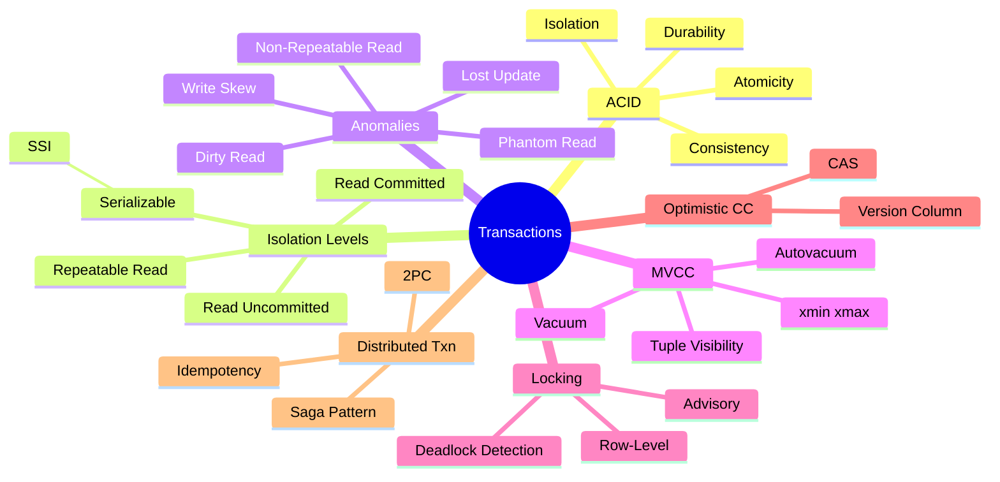
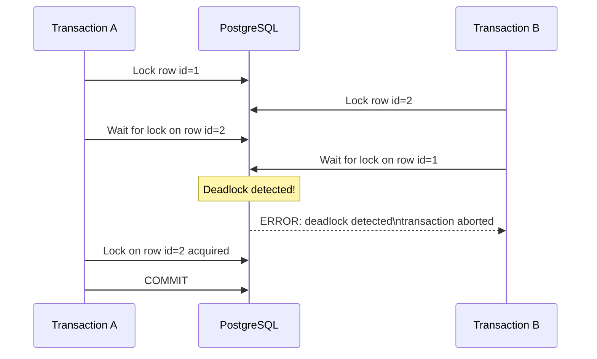
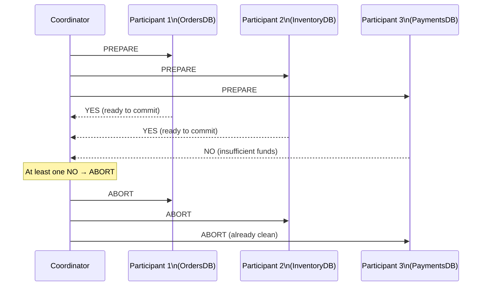
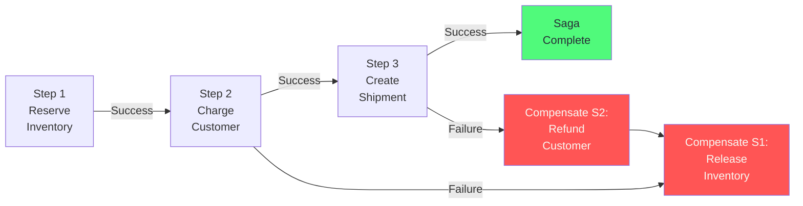
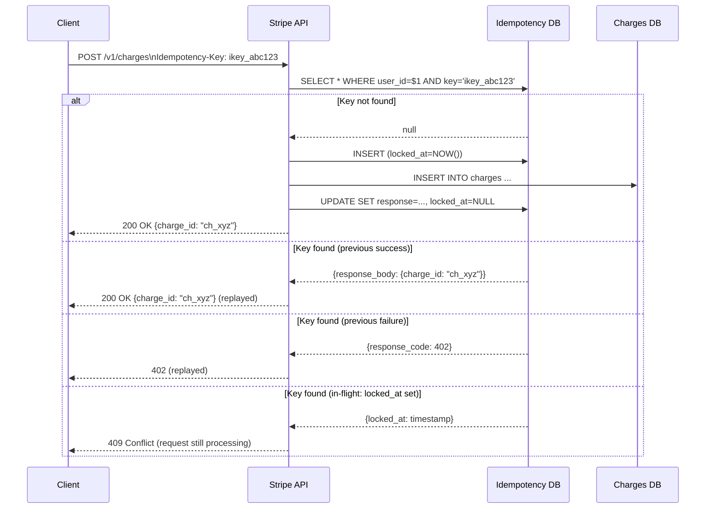

# Chapter 4: Transactions & Concurrency Control

> "A transaction is a promise that either everything happens or nothing happens. Keeping that promise under concurrent load is the hardest problem in database engineering."

## Mind Map



:::info Prerequisites
This chapter assumes you understand WAL mechanics ([Ch01](/database/part-1-foundations/ch01-database-landscape)) and the schema design patterns that drive concurrency requirements ([Ch02](/database/part-1-foundations/ch02-data-modeling-for-scale)). Review those first if needed.
:::

## Overview

Most application developers interact with transactions through a simple mental model: `BEGIN`, do some work, `COMMIT`. If something goes wrong, `ROLLBACK`. This model is correct for simple cases, but it breaks down when multiple transactions run concurrently — which is the normal state of any production database.

The core tension in concurrency control: **higher isolation guarantees fewer anomalies but costs throughput**. Every isolation level represents a deliberate trade-off. This chapter explains precisely what each level guarantees, what PostgreSQL's MVCC implementation does under the hood, and how to implement correct concurrency patterns in application code.

---

## ACID Properties

ACID is a set of properties that define what a "correct" transaction means.

| Property | Guarantee | Mechanism |
|----------|-----------|-----------|
| **Atomicity** | All operations in a transaction succeed, or none do | WAL + rollback log |
| **Consistency** | Transaction brings database from one valid state to another | Constraints, triggers, application logic |
| **Isolation** | Concurrent transactions appear to execute serially | MVCC + locking |
| **Durability** | Committed data survives crashes | WAL fsynced before COMMIT returns |

:::tip Consistency Is Not Guaranteed by the Database Alone
Atomicity, isolation, and durability are enforced by PostgreSQL. Consistency depends on correct application logic + proper constraint definitions. A transaction that atomically transfers $100 from an account with $50 balance violates consistency — but only if the application or database constraint catches it.
:::

---

## Isolation Levels Deep Dive

SQL defines four isolation levels. Each prevents a different set of concurrency anomalies.

### The Anomalies

Before covering the levels, understand what anomalies you are protecting against:

**Dirty Read:** Transaction A reads data written by Transaction B that has not yet committed. If B rolls back, A has read data that never existed.

**Non-Repeatable Read:** Transaction A reads a row. Transaction B updates and commits that row. Transaction A reads the row again — different value. The same SELECT returns different results within one transaction.

**Phantom Read:** Transaction A queries "all orders > $100." Transaction B inserts a new order > $100 and commits. Transaction A re-runs the same query — sees an extra row. New rows appeared mid-transaction.

**Write Skew:** Two transactions both read the same set of rows, both decide to write based on what they read, and their combined writes produce an invalid state that neither transaction alone would have caused.

**Lost Update:** Two transactions both read a row, both modify it, and both commit. The second commit overwrites the first — one update is silently lost.

### Isolation Level Guarantees

| Isolation Level | Dirty Read | Non-Repeatable Read | Phantom Read | Write Skew |
|----------------|-----------|---------------------|-------------|-----------|
| READ UNCOMMITTED | Possible | Possible | Possible | Possible |
| READ COMMITTED | Prevented | Possible | Possible | Possible |
| REPEATABLE READ | Prevented | Prevented | Possible* | Possible |
| SERIALIZABLE | Prevented | Prevented | Prevented | Prevented |

*PostgreSQL's REPEATABLE READ also prevents phantom reads due to MVCC snapshot semantics. Standard SQL allows phantoms at REPEATABLE READ.

### READ COMMITTED (PostgreSQL default)

Each statement in a transaction sees data committed immediately before the statement starts. A long-running transaction sees different snapshots per statement.

```sql
-- Transaction A (READ COMMITTED - default)
BEGIN;
SELECT balance FROM accounts WHERE id = 1;  -- sees $100
-- Transaction B commits: UPDATE accounts SET balance = 50 WHERE id = 1;
SELECT balance FROM accounts WHERE id = 1;  -- now sees $50 (non-repeatable read!)
COMMIT;
```

READ COMMITTED is the PostgreSQL default because it provides the best performance (minimal blocking) while preventing the most dangerous anomaly (dirty reads). Most web applications using simple request-scoped transactions work correctly at this level.

### REPEATABLE READ

Each transaction sees a snapshot of the database as of the first statement in the transaction. Subsequent reads of the same row always return the same value.

```sql
-- Transaction A (REPEATABLE READ)
BEGIN TRANSACTION ISOLATION LEVEL REPEATABLE READ;
SELECT balance FROM accounts WHERE id = 1;  -- sees $100
-- Transaction B commits: UPDATE accounts SET balance = 50 WHERE id = 1;
SELECT balance FROM accounts WHERE id = 1;  -- still sees $100 (snapshot from txn start)
COMMIT;
```

Use REPEATABLE READ for: generating consistent reports, analytics queries that span multiple statements, any operation that needs a stable view of the database.

### SERIALIZABLE with SSI

SERIALIZABLE guarantees that the outcome of concurrent transactions is equivalent to some serial (one-after-another) execution. PostgreSQL implements this via Serializable Snapshot Isolation (SSI), which tracks read/write dependencies between transactions and aborts transactions that would produce anomalous results.

```sql
-- Classic write skew example: on-call scheduling
-- Rule: at least one doctor must always be on call
-- doctor_1 is on call, doctor_2 is on call

-- Transaction A: doctor_1 removes herself (sees doctor_2 is on call)
BEGIN TRANSACTION ISOLATION LEVEL SERIALIZABLE;
SELECT COUNT(*) FROM on_call WHERE date = '2024-01-15';  -- returns 2
UPDATE on_call SET active = false WHERE doctor_id = 1 AND date = '2024-01-15';
COMMIT;  -- might be aborted by SSI

-- Transaction B (concurrent): doctor_2 removes herself (sees doctor_1 is on call)
BEGIN TRANSACTION ISOLATION LEVEL SERIALIZABLE;
SELECT COUNT(*) FROM on_call WHERE date = '2024-01-15';  -- also returns 2
UPDATE on_call SET active = false WHERE doctor_id = 2 AND date = '2024-01-15';
COMMIT;  -- SSI detects the conflict, aborts one transaction

-- Result: one doctor remains on call
```

SSI detects the conflict by tracking that both transactions read the on-call count (a "predicate read") and both wrote to on_call — a read-write conflict cycle. One is aborted with `ERROR: could not serialize access due to read/write dependencies among transactions`.

:::warning Handle Serialization Failures
Applications using SERIALIZABLE must handle `SQLSTATE 40001` (serialization failure) by retrying the transaction. This is not optional — SSI will abort transactions with detected conflicts. Libraries like `psycopg2` expose this as `TransactionRollbackError`.
:::

:::info Version Note
PostgreSQL examples verified against PostgreSQL 16/17. Autovacuum defaults and some `pg_stat_*` views changed in PostgreSQL 17 — check the [release notes](https://www.postgresql.org/docs/17/release-17.html) for your version.
:::

---

## MVCC Deep Dive

PostgreSQL implements isolation levels through Multi-Version Concurrency Control (MVCC). The key principle: **writers never block readers, and readers never block writers**. Each transaction sees its own consistent snapshot of the database.

### Tuple Versioning: xmin and xmax

Every row (tuple) in PostgreSQL has two hidden system columns:

- `xmin`: the transaction ID that inserted this tuple
- `xmax`: the transaction ID that deleted or updated this tuple (0 if still current)

```sql
-- See the hidden system columns
SELECT xmin, xmax, id, username, email
FROM users
WHERE id = 1;

-- xmin=245 xmax=0: row was inserted by txn 245, still live
-- xmin=245 xmax=301: row was inserted by txn 245, deleted/updated by txn 301
```

### Visibility Rules

When Transaction T reads a row, it applies this visibility check:

1. If `xmin` transaction committed **before** T's snapshot → the row was inserted and visible
2. If `xmax = 0` → the row has not been deleted → visible
3. If `xmax` transaction committed **before** T's snapshot → the row was deleted before T started → not visible
4. If `xmax` transaction is still in progress → T cannot see the deletion yet → visible

This means PostgreSQL stores multiple versions of the same logical row:

```
users table (physical):
xmin=100, xmax=0,   id=1, username='alice',    email='old@example.com'  ← current
xmin=200, xmax=250, id=1, username='alice',    email='alice@example.com' ← deleted by txn 250
xmin=250, xmax=0,   id=1, username='alice',    email='new@example.com'   ← newest version
```

Transaction 260 would see the row with `email='new@example.com'` (xmin=250, xmax=0, xmin committed before 260's snapshot).

### Vacuum: Reclaiming Dead Tuples

Old row versions (where `xmax` is set and the transaction committed) accumulate as "dead tuples." They waste disk space and slow down sequential scans. `VACUUM` removes them.

```sql
-- See dead tuples accumulating
SELECT relname, n_live_tup, n_dead_tup, last_autovacuum
FROM pg_stat_user_tables
ORDER BY n_dead_tup DESC;

-- Manual vacuum (autovacuum usually handles this)
VACUUM ANALYZE users;

-- VACUUM FULL: reclaims space fully but rewrites the table (use sparingly)
VACUUM FULL users;
```

### Autovacuum Tuning

Autovacuum runs automatically when `n_dead_tup > autovacuum_vacuum_threshold + autovacuum_vacuum_scale_factor * n_live_tup`.

For high-churn tables (like `sessions`, `events`, `rate_limit_counters`):

```sql
-- Per-table autovacuum tuning (overrides global settings)
ALTER TABLE sessions SET (
    autovacuum_vacuum_scale_factor = 0.01,   -- trigger at 1% dead tuples (default 20%)
    autovacuum_vacuum_threshold = 100,        -- trigger after 100 dead tuples (default 50)
    autovacuum_analyze_scale_factor = 0.005   -- analyze at 0.5% changes
);
```

:::warning Transaction ID Wraparound: The Hidden Danger
PostgreSQL's transaction IDs are 32-bit integers, so they wrap around after ~2 billion transactions. If a table's `xmin` values are not vacuumed before wraparound, PostgreSQL can lose data. `VACUUM` prevents this by "freezing" old tuples (setting xmin to a special value). Monitor `pg_database.datfrozenxid` — if it approaches `autovacuum_freeze_max_age` (default 200M), autovacuum will aggressively vacuum all tables. This can cause I/O spikes on large databases.
:::

---

## Locking in Practice

MVCC handles read/write conflicts. Locking handles write/write conflicts.

### Row-Level Locks

PostgreSQL acquires row-level locks automatically for `UPDATE`, `DELETE`, and `SELECT FOR UPDATE`.

```sql
-- SELECT FOR UPDATE: lock the row for subsequent update
-- Other transactions trying to UPDATE this row will wait
BEGIN;
SELECT * FROM inventory WHERE product_id = 42 FOR UPDATE;
-- Now safely update knowing no other transaction can modify this row
UPDATE inventory SET quantity = quantity - 1 WHERE product_id = 42;
COMMIT;

-- SELECT FOR UPDATE SKIP LOCKED: skip rows that are already locked
-- Useful for job queues: each worker picks a different job
SELECT * FROM jobs
WHERE status = 'pending'
ORDER BY priority DESC
LIMIT 1
FOR UPDATE SKIP LOCKED;
```

### Advisory Locks

Application-level locks that are not tied to any database object. PostgreSQL stores them in shared memory, not in tables.

```sql
-- Acquire an advisory lock by integer key
-- Useful for: preventing concurrent runs of the same cron job
SELECT pg_try_advisory_lock(12345);  -- returns true if acquired, false if already held

-- Release the lock
SELECT pg_advisory_unlock(12345);

-- Session-scoped advisory lock (auto-released on disconnect)
SELECT pg_advisory_lock(hashtext('daily_report_job'));
-- ... run daily report ...
SELECT pg_advisory_unlock(hashtext('daily_report_job'));
```

### Deadlock Detection

A deadlock occurs when two transactions each hold a lock the other needs. PostgreSQL detects deadlock cycles and aborts one transaction automatically.



**Prevention:** Always acquire locks in the same order. If your code updates both `accounts.balance` and `transactions.amount`, always update the account first, transaction second — never the reverse.

```sql
-- Deadlock-prone: different lock ordering in concurrent transactions
-- Transaction A: UPDATE accounts WHERE id=1, then UPDATE accounts WHERE id=2
-- Transaction B: UPDATE accounts WHERE id=2, then UPDATE accounts WHERE id=1

-- Safe: consistent ordering (always lower id first)
UPDATE accounts SET balance = balance - 100 WHERE id = LEAST($1, $2);
UPDATE accounts SET balance = balance + 100 WHERE id = GREATEST($1, $2);
```

---

## Optimistic Concurrency Control

Pessimistic locking (SELECT FOR UPDATE) works well when conflicts are frequent. When conflicts are rare, optimistic concurrency control (OCC) performs better by avoiding locks entirely and detecting conflicts only at commit time.

### Version Column Pattern

```sql
-- Add a version column to the table
ALTER TABLE products ADD COLUMN version INT NOT NULL DEFAULT 1;

-- Application code: read, then update with version check
BEGIN;
SELECT id, price, version FROM products WHERE id = $1;
-- ... application modifies price ...
UPDATE products
SET price = $new_price, version = version + 1
WHERE id = $1 AND version = $expected_version;

-- Check if any row was updated
-- If rowcount = 0: another transaction updated first → retry or report conflict
GET DIAGNOSTICS updated = ROW_COUNT;
IF updated = 0 THEN
    ROLLBACK;
    -- return conflict error to application
END IF;
COMMIT;
```

The `WHERE version = $expected_version` clause is the atomic compare-and-swap. If another transaction has incremented `version` since the read, the `UPDATE` matches zero rows, signaling the conflict.

### When to Use OCC vs PCC

| Approach | Best When | Downside |
|----------|-----------|---------|
| Pessimistic (SELECT FOR UPDATE) | Conflicts are frequent; can't afford retries | Locks held for transaction duration; deadlock risk |
| Optimistic (version column) | Conflicts are rare; retries are cheap | Retry logic required; wasted work on conflict |
| SERIALIZABLE | Complex business rules with write skew risk | Highest abort rate; requires retry logic |

---

## Distributed Transactions

When a transaction spans multiple databases (or services), the local transaction mechanisms above are insufficient. Two approaches dominate production systems.

### Two-Phase Commit (2PC)

2PC is a protocol that ensures all participants in a distributed transaction either all commit or all abort.



**2PC problems:**
- **Blocking:** If the coordinator crashes after PREPARE but before COMMIT/ABORT, all participants are blocked (holding locks) until coordinator recovers
- **Performance:** Two round-trips + fsync at each participant before commit
- **Availability:** Cannot commit if any participant is unavailable

PostgreSQL supports 2PC via `PREPARE TRANSACTION` / `COMMIT PREPARED` / `ROLLBACK PREPARED`, but it is rarely used directly in applications — distributed databases (CockroachDB, Spanner) implement it internally.

### The Saga Pattern

The Saga pattern replaces a distributed ACID transaction with a sequence of local transactions, each with a corresponding compensating transaction for rollback.



**Saga trade-offs:**
- **Eventually consistent:** Between steps, the system may be in a partial state visible to other transactions
- **No atomicity guarantee:** If a compensating transaction fails, manual intervention may be required
- **Simpler failure model:** No coordinator crash problem; each service recovers independently

Sagas are the dominant pattern for microservices transactions. Two implementation styles:
- **Choreography:** Each service publishes events that trigger the next step (no central coordinator)
- **Orchestration:** A dedicated saga orchestrator service tracks state and calls each step

---

## Case Study: Stripe's Payment Idempotency

Stripe processes millions of payments daily. Network failures and client timeouts mean any operation can be retried — but a payment must not be charged twice. Stripe's idempotency implementation is a canonical example of applying concurrency control to real-world distributed systems.

**The Problem:** Client sends `POST /v1/charges` to create a $100 charge. Network times out after 30 seconds. Client doesn't know if the charge succeeded. Client retries. Without idempotency, the customer gets charged $200.

**Stripe's Solution: Idempotency Keys**

```sql
CREATE TABLE idempotency_keys (
    idempotency_key VARCHAR(255)    NOT NULL,
    user_id         BIGINT          NOT NULL,
    request_method  VARCHAR(10)     NOT NULL,
    request_path    VARCHAR(255)    NOT NULL,
    request_params  JSONB           NOT NULL,
    response_code   INT,
    response_body   JSONB,
    -- Lock state during in-flight processing
    locked_at       TIMESTAMPTZ,
    -- Stored result for replay
    recovery_point  VARCHAR(50),
    created_at      TIMESTAMPTZ     NOT NULL DEFAULT NOW(),
    PRIMARY KEY (user_id, idempotency_key)
);
```

**The Flow:**



**Key details:**
- The `locked_at` column prevents two concurrent identical requests from both processing
- The entire operation (lookup + insert + lock) is wrapped in a transaction with `SELECT FOR UPDATE` on the idempotency key
- Stripe retains idempotency keys for 24 hours — after that, the same key creates a new charge

**MVCC interaction:** The `SELECT FOR UPDATE` on the idempotency key row ensures that even under READ COMMITTED isolation, concurrent requests with the same key serialize. One request wins the lock, completes, releases. The second request then reads the completed response and replays it.

**The lesson:** Production payment systems must be designed for failure from the start. Idempotency is not an optimization — it is a correctness requirement. The database mechanisms (transactions, row locks, MVCC) are the tools; the design pattern is the architecture.

---

## Related Chapters

| Chapter | Relevance |
|---------|-----------|
| [Ch01 — The Database Landscape](/database/part-1-foundations/ch01-database-landscape) | WAL mechanics that make durability possible |
| [Ch02 — Data Modeling for Scale](/database/part-1-foundations/ch02-data-modeling-for-scale) | Schema patterns for idempotency and event sourcing |
| [Ch03 — Indexing Strategies](/database/part-1-foundations/ch03-indexing-strategies) | How MVCC dead tuples interact with index maintenance |
| [Ch09 — Replication & High Availability](/database/part-3-operations/ch09-replication-high-availability) | How transaction isolation interacts with replication lag |
| [System Design Ch15 — Data Replication & Consistency](/system-design/part-3-architecture-patterns/ch15-data-replication-consistency) | CAP theorem and consistency models at the distributed level |

---

## Common Mistakes

| Mistake | Why It Happens | Impact | Fix |
|---------|---------------|--------|-----|
| Using SERIALIZABLE for all transactions | "Maximum safety = always correct" | Unnecessary abort rate; every transaction incurs SSI tracking overhead | Use READ COMMITTED (default) for most; upgrade to SERIALIZABLE only for complex business invariants with write skew risk |
| Holding locks during external API calls | Transaction wraps an HTTP call to payment provider | Lock held for seconds; timeouts cascade to deadlocks | Acquire data, close transaction, make external call, open new transaction to record result |
| Ignoring deadlock retry logic | "Deadlocks are rare" | Unhandled `SQLSTATE 40P01` crashes the request | Retry on `serialization_failure` (40001) and `deadlock_detected` (40P01) with exponential backoff |
| Using SELECT FOR UPDATE on high-contention rows without SKIP LOCKED | Unfamiliar with SKIP LOCKED | Job queue serializes — only one worker processes at a time | Use `FOR UPDATE SKIP LOCKED` for queue-style workloads |

---

## Practice Questions

### Beginner

1. **Isolation Level Selection:** A bank transfer system deducts $500 from account A and adds $500 to account B. Which isolation level should you use, and what anomaly are you specifically protecting against? Show the SQL with the correct isolation level.

   <details>
   <summary>Model Answer</summary>
   For a simple two-row update like a bank transfer, READ COMMITTED with `SELECT FOR UPDATE` on both rows is sufficient (prevents lost updates). SERIALIZABLE protects against more complex write skew scenarios. The SQL: `BEGIN; SELECT * FROM accounts WHERE id IN (A, B) FOR UPDATE; UPDATE accounts SET balance = balance - 500 WHERE id = A; UPDATE accounts SET balance = balance + 500 WHERE id = B; COMMIT;`
   </details>

2. **MVCC Basics:** A row has `xmin=100, xmax=0`. Transaction 200 runs a SELECT. What does it see? Now transaction 300 updates the row (xmax=300, a new tuple has xmin=300, xmax=0). Transaction 200 runs SELECT again. What does it see under REPEATABLE READ vs READ COMMITTED? Why?

   <details>
   <summary>Model Answer</summary>
   Under REPEATABLE READ: transaction 200 took a snapshot at its start (before txn 300 committed). It still sees the old version (xmin=100, xmax=0) — snapshot isolation prevents the non-repeatable read. Under READ COMMITTED: each SELECT takes a new snapshot; the second SELECT sees the new version (xmin=300, xmax=0) because txn 300 committed before the second SELECT ran.
   </details>

### Intermediate

3. **Write Skew:** A hospital application tracks which doctors are on call. The rule is: at least one doctor must be on call at all times. Two doctors both query "how many doctors are on call" (answer: 1) and both decide to go off call. Design a solution that prevents this using each of: (a) application-level locking, (b) optimistic concurrency control, (c) SERIALIZABLE isolation.

   <details>
   <summary>Model Answer</summary>
   (a) Advisory lock: `SELECT pg_advisory_lock(hashtext('on_call_update'))` before any read-modify-write on the on_call table. (b) OCC: add a version column on a `on_call_schedule` row; both doctors read version=5, first commit sets version=6, second commit sees version mismatch and retries with fresh count. (c) SERIALIZABLE: use `BEGIN TRANSACTION ISOLATION LEVEL SERIALIZABLE`; SSI detects the read-write dependency and aborts one transaction.
   </details>

4. **Deadlock Prevention:** An order processing system updates two tables in every transaction: `orders` and `line_items`. Occasionally, deadlocks occur. The code currently updates `line_items` first, then `orders`. What is causing the deadlocks and what is the fix?

   <details>
   <summary>Model Answer</summary>
   Deadlocks occur when two transactions acquire locks in different orders. If Transaction A updates order_id=1 line items then order_id=1 header, and Transaction B updates order_id=1 header then order_id=1 line items, they deadlock. Fix: always acquire locks in the same order — always update `orders` first, then `line_items`. Or: use `SELECT ... FOR UPDATE` on the `orders` row first to serialize all access at the beginning of the transaction.
   </details>

### Advanced

5. **Distributed Transaction Design:** An e-commerce checkout flow spans three services: (a) InventoryService decrements stock, (b) PaymentService charges the credit card, (c) OrderService creates the order record. Design a Saga implementation (choreography or orchestration) that handles: successful checkout, payment failure (must release inventory), order creation failure (must refund payment + release inventory). Include the compensating transactions and how you ensure each step is idempotent.

   <details>
   <summary>Model Answer</summary>
   Use orchestration (simpler failure tracking). Saga states: STARTED → INVENTORY_RESERVED → PAYMENT_CHARGED → ORDER_CREATED → COMPLETED. Compensating transactions: ORDER_FAILED → refund_payment → PAYMENT_REFUNDED → release_inventory → SAGA_FAILED. Idempotency: each step takes a saga_id as idempotency key; InventoryService checks if `saga_id` already has a reservation before decrementing. PaymentService checks if `saga_id` already has a charge. This ensures retries are safe.
   </details>

---

## References & Further Reading

- [PostgreSQL Documentation — Transaction Isolation](https://www.postgresql.org/docs/current/transaction-iso.html)
- [PostgreSQL Documentation — MVCC](https://www.postgresql.org/docs/current/mvcc.html)
- ["Designing Data-Intensive Applications"](https://dataintensive.net/) — Chapter 7: Transactions
- [Serializable Snapshot Isolation in PostgreSQL](https://drkp.net/papers/ssi-vldb12.pdf) — Dan R. K. Ports & Kevin Grittner (VLDB 2012)
- [Stripe: Designing Robust and Predictable APIs with Idempotency](https://stripe.com/blog/idempotency)
- [Saga Pattern for Microservices](https://microservices.io/patterns/data/saga.html) — Chris Richardson
- [Two-Phase Commit Protocol](https://www.postgresql.org/docs/current/two-phase.html) — PostgreSQL Documentation
- [A Critique of ANSI SQL Isolation Levels](https://www.microsoft.com/en-us/research/wp-content/uploads/2016/02/tr-95-51.pdf) — Berenson et al. (1995) — explains write skew
