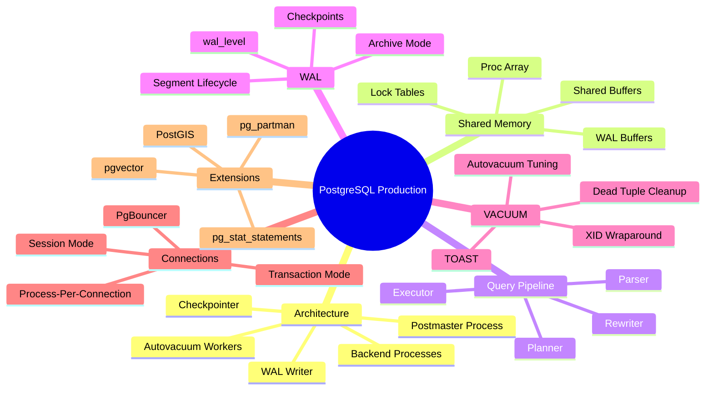
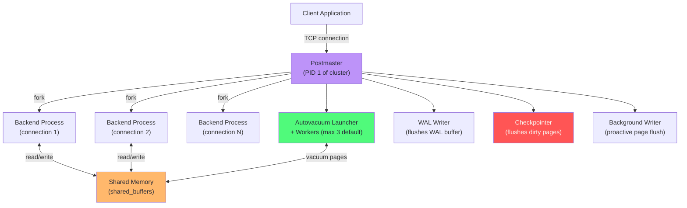
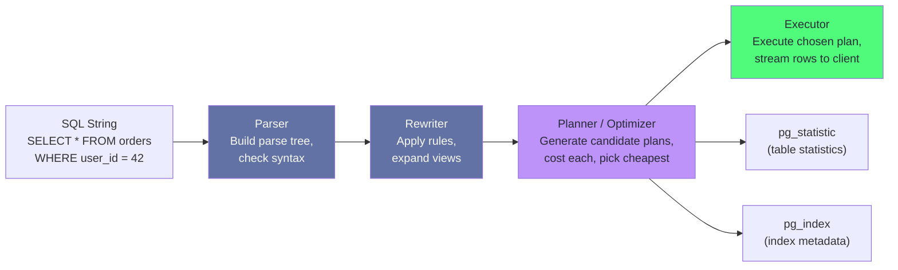
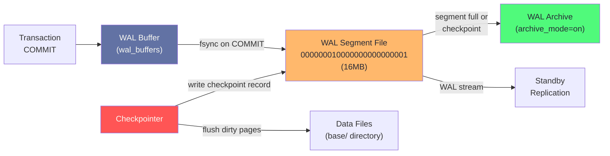
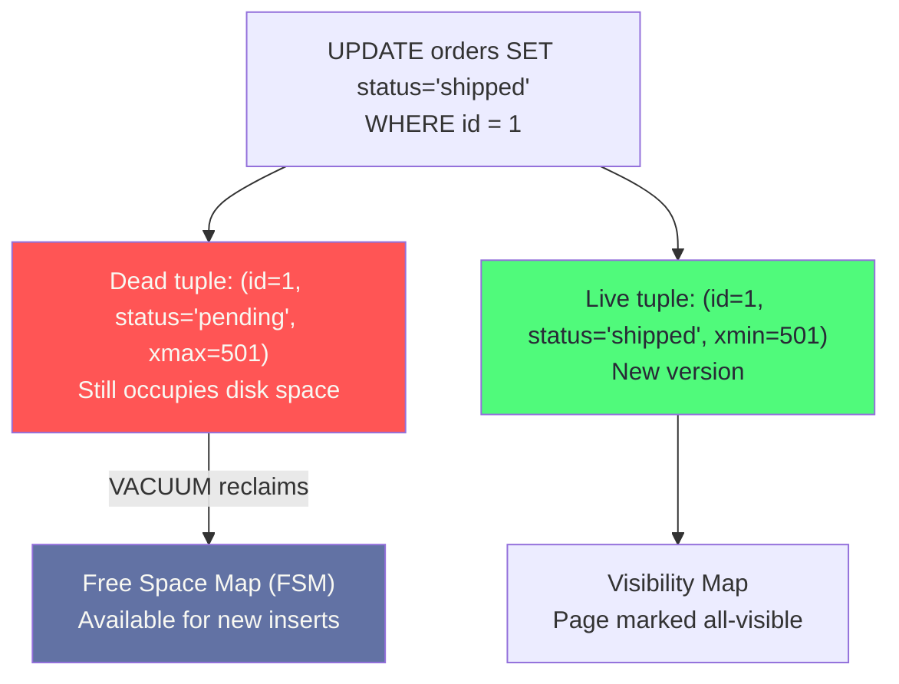
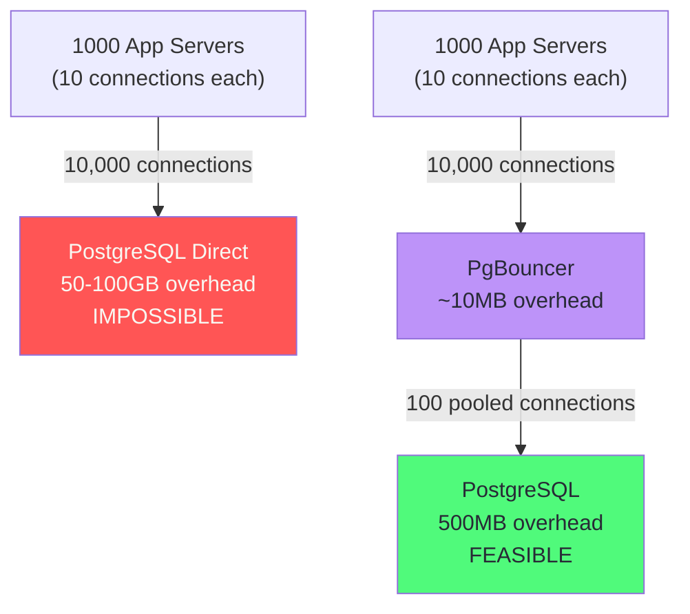

# Chapter 5: PostgreSQL in Production

> "PostgreSQL is not a database. It is a platform that happens to ship with a world-class relational engine."

## Mind Map



---

## Architecture Internals

### Process Model

PostgreSQL uses a **process-per-connection** model rather than threads. When a client connects, the postmaster forks a new backend process dedicated to that connection. This architecture provides strong isolation — a crashing backend cannot corrupt another backend's memory — but creates overhead at high connection counts.



### Shared Memory Layout

At startup, PostgreSQL allocates a single large shared memory segment that all backend processes read and write:

| Region | Purpose | Key Parameter |
|--------|---------|--------------|
| **Shared Buffers** | Page cache for data files | `shared_buffers` (25% of RAM typical) |
| **WAL Buffers** | In-memory WAL before fsync | `wal_buffers` (auto: 1/32 of shared_buffers) |
| **Lock Tables** | Tracks all held and awaited locks | `max_locks_per_transaction` |
| **Proc Array** | Running transactions, XIDs, snapshots | `max_connections` |
| **CLOG** | Transaction commit/abort status | Managed automatically |

:::tip Shared Buffers and the OS Page Cache
PostgreSQL operates a double-buffering system: data pages live in shared_buffers (PostgreSQL's own cache), and the same data also lives in the OS page cache. `effective_cache_size` tells the planner how much OS cache is available for index scans — it does not allocate memory, it only influences plan choices.
:::

---

## Query Execution Pipeline

Every SQL statement passes through four stages before returning results:



### The Planner's Cost Model

The planner estimates the cost of every candidate execution plan using row count estimates from statistics (`pg_statistic`) and cost constants (`seq_page_cost`, `random_page_cost`, `cpu_tuple_cost`). Stale statistics are the most common cause of bad query plans.

```sql
-- Force statistics update on a high-churn table
ANALYZE orders;

-- Check when statistics were last collected
SELECT schemaname, tablename, last_analyze, last_autoanalyze
FROM pg_stat_user_tables
WHERE tablename = 'orders';

-- Inspect the plan the planner chose
EXPLAIN (ANALYZE, BUFFERS, FORMAT TEXT)
SELECT * FROM orders
WHERE user_id = 42 AND created_at > NOW() - INTERVAL '30 days';
```

:::warning Stale Statistics Kill Plans
After a bulk load of millions of rows, run `ANALYZE` explicitly. Autovacuum's analyze threshold (`autovacuum_analyze_scale_factor = 0.2`) means it only triggers after 20% of the table changes — a 5M-row bulk insert into a 1M-row table will not trigger autoanalyze until 200K more changes occur.
:::

---

## WAL Deep Dive

### Segment Lifecycle

WAL is written as a stream of variable-length records into 16MB segment files under `pg_wal/`. Each record describes a single page-level change.



### WAL Levels

| Level | What Gets Logged | Use Case |
|-------|-----------------|---------|
| `minimal` | Minimum for crash recovery | Standalone server, no replicas |
| `replica` | + streaming replication data | Primary with hot standbys |
| `logical` | + full row images for decoding | CDC, Debezium, logical replication |

:::info WAL Level and Performance
`logical` WAL is roughly 20–40% larger than `replica` WAL for write-heavy workloads because it logs before-images of updated rows. Only set `wal_level = logical` if you need CDC or logical replication.
:::

### Checkpoint Tuning

A checkpoint flushes all dirty pages from shared_buffers to data files, creating a recovery point. Frequent checkpoints cause I/O spikes; infrequent checkpoints increase crash recovery time.

```ini
# postgresql.conf — checkpoint tuning
max_wal_size = 4GB                    # WAL accumulates up to this before forced checkpoint
min_wal_size = 1GB                    # Keep at least this much WAL pre-allocated
checkpoint_completion_target = 0.9   # Spread checkpoint I/O over 90% of checkpoint interval
checkpoint_timeout = 15min            # Maximum time between checkpoints
```

---

## VACUUM and Autovacuum

### Why VACUUM Exists

PostgreSQL's MVCC implementation never deletes rows in-place. An `UPDATE` inserts a new row version and marks the old one as dead. A `DELETE` only marks the row as dead. **VACUUM** physically reclaims space from dead tuples.



### Autovacuum Tuning

Default autovacuum is conservative. High-traffic tables need per-table overrides:

```sql
-- Per-table autovacuum tuning for a high-churn orders table
ALTER TABLE orders SET (
  autovacuum_vacuum_scale_factor = 0.01,   -- Trigger at 1% dead tuples (default 20%)
  autovacuum_analyze_scale_factor = 0.005, -- Analyze at 0.5% changes (default 20%)
  autovacuum_vacuum_cost_delay = 2,        -- Less throttling (default 20ms)
  autovacuum_vacuum_cost_limit = 800       -- More I/O budget (default 200)
);
```

| Parameter | Default | Impact |
|-----------|---------|--------|
| `autovacuum_vacuum_scale_factor` | 0.20 | Lower = more frequent vacuum |
| `autovacuum_max_workers` | 3 | More workers = more parallel vacuum |
| `autovacuum_vacuum_cost_delay` | 20ms | Lower = less throttling, more I/O |
| `autovacuum_vacuum_cost_limit` | 200 | Higher = larger I/O bursts |

### XID Wraparound: The Emergency

PostgreSQL's transaction ID (XID) is a 32-bit integer. After ~2.1 billion transactions, it wraps around — old rows become invisible to new transactions. PostgreSQL prevents this with anti-wraparound vacuum.

```sql
-- Check XID age for all databases — alert if age > 1.5 billion
SELECT datname,
       age(datfrozenxid) AS xid_age,
       pg_size_pretty(pg_database_size(datname)) AS db_size
FROM pg_database
ORDER BY xid_age DESC;

-- Check tables most at risk
SELECT schemaname, relname,
       age(relfrozenxid) AS table_xid_age,
       pg_size_pretty(pg_total_relation_size(oid)) AS table_size
FROM pg_class
WHERE relkind = 'r'
ORDER BY table_xid_age DESC
LIMIT 20;
```

:::warning XID Wraparound is a Hard Shutdown
If PostgreSQL detects XID age approaching the limit (`age(datfrozenxid) > 1.5B`), it will **refuse all write transactions** with: `database is not accepting commands to avoid wraparound data loss`. The fix is emergency `VACUUM FREEZE`. Monitor XID age continuously.
:::

### TOAST (The Oversized-Attribute Storage Technique)

TOAST handles column values larger than 2KB by compressing and storing them in a shadow table. Each user table with TOAST-able columns gets a corresponding `pg_toast.pg_toast_NNNN` table.

```sql
-- Find tables with large TOAST tables
SELECT c.relname AS main_table,
       t.relname AS toast_table,
       pg_size_pretty(pg_total_relation_size(t.oid)) AS toast_size
FROM pg_class c
JOIN pg_class t ON c.reltoastrelid = t.oid
WHERE c.relkind = 'r'
ORDER BY pg_total_relation_size(t.oid) DESC
LIMIT 10;
```

---

## Connection Management

### The Process-Per-Connection Problem

Each PostgreSQL backend uses 5–10MB of RAM for local state. At 500 connections, that is 2.5–5GB of RAM just for process overhead — before any query work.



### PgBouncer Modes

| Mode | Description | Supported Features | Best For |
|------|-------------|-------------------|---------|
| **Session** | One server conn per client session | All PostgreSQL features | Long-lived connections, prepared statements |
| **Transaction** | Server conn only during transaction | Most features; no `SET` persistence, no advisory locks across txns | OLTP APIs, short transactions |
| **Statement** | Server conn only per statement | Very limited; no multi-statement transactions | Read-only analytics queries |

```ini
# pgbouncer.ini — production configuration
[databases]
myapp = host=127.0.0.1 port=5432 dbname=myapp

[pgbouncer]
pool_mode = transaction
max_client_conn = 10000
default_pool_size = 100
min_pool_size = 10
reserve_pool_size = 20
reserve_pool_timeout = 5
server_idle_timeout = 600
client_idle_timeout = 0
log_connections = 0
log_disconnections = 0
```

### Pool Sizing Formula

```
pool_size = (max_connections_postgresql × 0.8) / number_of_pgbouncer_instances
```

For `max_connections = 200` with 2 PgBouncer instances:

```
pool_size = (200 × 0.8) / 2 = 80 connections per PgBouncer
```

Reserve 20% of `max_connections` for superuser, monitoring tools, and emergency DBA access.

:::warning Transaction Mode Breaks These Features
PgBouncer transaction mode is incompatible with: `LISTEN/NOTIFY`, `WITH HOLD cursors`, `advisory locks held across transactions`, `SET` statements that should persist per session, and `prepared statements` (unless `server_reset_query = DISCARD ALL`). Use session mode for these patterns.
:::

---

## Essential Extensions

| Extension | Function | Use Case | Overhead |
|-----------|---------|---------|---------|
| **pg_stat_statements** | Track query execution stats | Performance monitoring, slow query identification | ~5% query overhead |
| **pg_partman** | Automated partition management | Time-based partition creation/dropping | Negligible |
| **pgvector** | Vector similarity search, HNSW/IVFFlat | Semantic search, RAG, embeddings | ~10% for HNSW index maintenance |
| **PostGIS** | Geospatial types and operators | Location queries, geographic aggregations | +200MB binary, significant for spatial queries |
| **pg_cron** | Database-side cron jobs | Partition maintenance, cleanup, reporting | Negligible |
| **Citus** | Horizontal sharding | Multi-tenant SaaS, distributed aggregations | +15–30% coordinator overhead |
| **pglogical** | Logical replication | CDC, zero-downtime migrations | WAL size increase ~20–40% |

```sql
-- Enable essential monitoring extensions
CREATE EXTENSION IF NOT EXISTS pg_stat_statements;
CREATE EXTENSION IF NOT EXISTS pg_partman;
CREATE EXTENSION IF NOT EXISTS vector;

-- pgvector: table with embedding column
CREATE TABLE documents (
  id        BIGSERIAL PRIMARY KEY,
  content   TEXT,
  embedding vector(1536)  -- OpenAI ada-002 dimensions
);

-- HNSW index: better recall than IVFFlat, no training step required
CREATE INDEX ON documents USING hnsw (embedding vector_cosine_ops)
WITH (m = 16, ef_construction = 64);

-- Nearest-neighbor search
SELECT id, content,
       1 - (embedding <=> '[0.1,0.2,...]'::vector) AS similarity
FROM documents
ORDER BY embedding <=> '[0.1,0.2,...]'::vector
LIMIT 10;
```

---

## Production Configuration Template

Annotated `postgresql.conf` for a **64GB RAM / 16-core server** running OLTP:

```ini
# ============================================================
# MEMORY
# ============================================================
shared_buffers = 16GB                 # 25% of RAM — PostgreSQL's own page cache
effective_cache_size = 48GB           # 75% of RAM — hint to planner, does not allocate
work_mem = 64MB                       # Per-sort, per-hash-join. 16 cores × 10 conns × 64MB
                                      # = 10GB worst case — monitor for OOM
maintenance_work_mem = 2GB            # For VACUUM, CREATE INDEX, ALTER TABLE
huge_pages = try                      # 2MB huge pages if OS supports (reduces TLB misses)

# ============================================================
# WAL / CHECKPOINT
# ============================================================
wal_level = replica                   # Enable streaming replication
max_wal_size = 8GB                    # Allow 8GB WAL before forced checkpoint
min_wal_size = 2GB                    # Pre-allocate to avoid segment allocation latency
checkpoint_completion_target = 0.9   # Spread I/O over 90% of checkpoint interval
checkpoint_timeout = 15min            # Max 15 minutes between checkpoints
wal_compression = on                  # ~30% WAL size reduction on compressible data
wal_buffers = 64MB                    # Pre-allocated WAL buffer

# ============================================================
# CONNECTIONS
# ============================================================
max_connections = 200                 # Use PgBouncer in front; keep this low
superuser_reserved_connections = 5   # Emergency DBA access

# ============================================================
# PLANNER
# ============================================================
random_page_cost = 1.1               # SSDs: near seq_page_cost (1.0). HDDs: 4.0
effective_io_concurrency = 200       # SSD: high parallelism. HDD: 2
default_statistics_target = 500      # More histogram buckets = better estimates (default 100)

# ============================================================
# PARALLEL QUERY
# ============================================================
max_worker_processes = 16            # Match CPU count
max_parallel_workers_per_gather = 8  # Up to 8 workers per query
max_parallel_workers = 16            # Total parallel workers across all queries

# ============================================================
# AUTOVACUUM
# ============================================================
autovacuum_max_workers = 6           # More workers for 16-core server
autovacuum_vacuum_scale_factor = 0.05 # Trigger at 5% dead tuples (default 20%)
autovacuum_analyze_scale_factor = 0.025
autovacuum_vacuum_cost_delay = 5ms   # Less throttling on NVMe SSD
autovacuum_vacuum_cost_limit = 1000  # Higher I/O budget per worker

# ============================================================
# LOGGING
# ============================================================
log_min_duration_statement = 1000   # Log queries slower than 1 second
log_checkpoints = on
log_lock_waits = on
log_temp_files = 64MB               # Log when sort/hash spills to disk
log_autovacuum_min_duration = 250ms # Log slow autovacuums
track_io_timing = on                # I/O stats in pg_stat_statements
```

---

## Monitoring with pg_stat_statements

### Finding Slow Queries

```sql
-- Top 10 queries by total execution time
SELECT
  LEFT(query, 80) AS query_snippet,
  calls,
  ROUND(total_exec_time::numeric, 2) AS total_ms,
  ROUND(mean_exec_time::numeric, 2) AS avg_ms,
  ROUND(stddev_exec_time::numeric, 2) AS stddev_ms,
  ROUND((100 * total_exec_time /
    SUM(total_exec_time) OVER ())::numeric, 2) AS pct_total
FROM pg_stat_statements
ORDER BY total_exec_time DESC
LIMIT 10;

-- Queries with high I/O (shared blocks read from disk)
SELECT
  LEFT(query, 80) AS query_snippet,
  calls,
  ROUND(mean_exec_time::numeric, 2) AS avg_ms,
  shared_blks_read / NULLIF(calls, 0) AS blks_read_per_call
FROM pg_stat_statements
WHERE calls > 100
ORDER BY shared_blks_read DESC
LIMIT 20;
```

### Cache Hit Ratio

```sql
-- Buffer hit ratio — should be > 99% for OLTP
SELECT
  SUM(heap_blks_hit) AS heap_hits,
  SUM(heap_blks_read) AS heap_reads,
  ROUND(100.0 * SUM(heap_blks_hit) /
    NULLIF(SUM(heap_blks_hit) + SUM(heap_blks_read), 0), 2) AS hit_ratio_pct
FROM pg_statio_user_tables;

-- Index vs sequential scan ratio per table
SELECT
  relname,
  idx_scan,
  seq_scan,
  ROUND(100.0 * idx_scan / NULLIF(idx_scan + seq_scan, 0), 2) AS idx_hit_pct,
  n_live_tup
FROM pg_stat_user_tables
WHERE seq_scan > 0
ORDER BY seq_scan DESC
LIMIT 20;
```

### Alert Thresholds

| Metric | Warning | Critical | Source |
|--------|---------|---------|--------|
| Buffer hit ratio | < 99% | < 95% | `pg_statio_user_tables` |
| Longest running query | > 5 min | > 30 min | `pg_stat_activity` |
| Idle in transaction | > 2 min | > 10 min | `pg_stat_activity` |
| XID age | > 1B | > 1.5B | `pg_database.datfrozenxid` |
| Table bloat ratio | > 30% | > 60% | `pgstattuple` extension |
| Autovacuum lag | > 1 hr | > 6 hr | `pg_stat_user_tables` |
| Replication lag | > 100MB | > 1GB | `pg_stat_replication` |

```sql
-- Replication lag on primary
SELECT
  application_name,
  state,
  pg_size_pretty(pg_wal_lsn_diff(
    pg_current_wal_lsn(), sent_lsn)) AS send_lag,
  pg_size_pretty(pg_wal_lsn_diff(
    sent_lsn, flush_lsn)) AS flush_lag,
  pg_size_pretty(pg_wal_lsn_diff(
    flush_lsn, replay_lsn)) AS replay_lag
FROM pg_stat_replication;
```

---

## Case Study: Instagram's PostgreSQL Journey

*This is a brief operational summary. For the full deep dive into Instagram's sharding strategy, ID generation, and schema design, see [Ch13 — Instagram: PostgreSQL at Scale](/database/part-4-real-world/ch13-instagram-postgresql-at-scale).*

Instagram launched in 2010 with a single PostgreSQL instance on a single EC2 server — a pattern that worked until they hit 1M users in 12 weeks.

**Phase 1 — Single Primary (2010):** One PostgreSQL master, Django ORM, basic indexes. Handled 1M users before showing strain. Key optimization: aggressive `EXPLAIN ANALYZE` to eliminate sequential scans on the media and user tables.

**Phase 2 — Read Replicas (2011):** Added streaming replicas for read traffic. PostgreSQL's WAL-based streaming replication allowed synchronous standbys with near-zero read lag. Feed reads, profile reads, and explore queries moved to replicas. Instagram added database routing middleware to the Django ORM to direct reads to replicas and writes to the primary.

**Phase 3 — Functional Sharding (2012–2013):** Split the monolithic database by feature domain: users, media, relationships. Each domain got its own PostgreSQL cluster. Cross-domain joins moved to the application layer. This extended the architecture to 100M users.

**Phase 4 — Horizontal Sharding (2014+):** Built a custom sharding layer hashing user_id to 1024 logical shards mapped to physical PostgreSQL instances. Django ORM continued to work because all queries included user_id.

**Key Technical Lessons:**
- Django ORM's lazy loading caused severe N+1 queries at scale — fixed with `select_related()` and `prefetch_related()`
- Streaming replication handled read scaling longer than expected (to ~300M users)
- Per-table autovacuum tuning was essential for the high-churn media table (millions of uploads/day)
- Sharding key (user_id) was chosen before sharding was implemented — this made the migration feasible without an application rewrite

**2024 status:** Instagram runs thousands of PostgreSQL instances, custom connection pooling, and pgvector for ML-based Explore recommendations — all on PostgreSQL without migrating to a different database.

---

## Related Chapters

| Chapter | Relevance |
|---------|-----------|
| [Ch01 — Database Landscape](/database/part-1-foundations/ch01-database-landscape) | WAL mechanics and storage engine foundations |
| [Ch03 — Indexing Strategies](/database/part-1-foundations/ch03-indexing-strategies) | B-tree, GIN, and partial index types used in production |
| [Ch04 — Transactions & Concurrency](/database/part-1-foundations/ch04-transactions-concurrency-control) | MVCC driving the need for VACUUM |
| [Ch06 — MySQL & Distributed SQL](/database/part-2-engines/ch06-mysql-distributed-sql) | PostgreSQL vs MySQL production trade-offs |
| [System Design Ch09](/system-design/part-2-building-blocks/ch09-databases-sql) | SQL database selection in system design interviews |

---

## Practice Questions

### Beginner

1. **Shared Buffers Sizing:** A new 32GB RAM server will run PostgreSQL for a web application. What value would you set `shared_buffers` to, and why? What value would you set `effective_cache_size` to, and what does that parameter actually control?

   <details>
   <summary>Model Answer</summary>
   `shared_buffers = 8GB` (25% of 32GB). `effective_cache_size = 24GB` (75% of 32GB). The critical distinction: `shared_buffers` allocates real memory at startup. `effective_cache_size` is only a hint to the planner about total available cache (PostgreSQL + OS) — it does not allocate any memory.
   </details>

2. **VACUUM vs ANALYZE:** What is the difference between `VACUUM` and `ANALYZE` in PostgreSQL? Why would you run one without the other? Give a scenario where each is appropriate.

   <details>
   <summary>Model Answer</summary>
   `VACUUM` reclaims space from dead tuples and updates the free space map. `ANALYZE` collects statistics about column distributions for the planner. Run `VACUUM` alone after a large DELETE/UPDATE to reclaim bloat. Run `ANALYZE` alone after a bulk INSERT — there are no dead tuples but the data distribution has changed, so planner statistics need refreshing.
   </details>

### Intermediate

3. **PgBouncer Mode Selection:** Your application uses PostgreSQL advisory locks to prevent concurrent job execution, and `LISTEN/NOTIFY` for real-time push notifications. A colleague suggests deploying PgBouncer in transaction mode to reduce connection overhead. What problems would this cause?

   <details>
   <summary>Model Answer</summary>
   Advisory locks held across transactions break in transaction mode — the lock is released when the connection returns to the pool between transactions. `LISTEN/NOTIFY` breaks entirely because notifications are tied to server sessions, not transactions. Recommendation: session mode for these workloads, or separate PgBouncer pools (transaction mode for regular OLTP, session mode for workers using advisory locks/NOTIFY).
   </details>

4. **XID Wraparound Prevention:** Your DBA reports `age(datfrozenxid)` is at 1.2 billion for your main database. Autovacuum is enabled. Why is this still happening, and what steps would you take immediately?

   <details>
   <summary>Model Answer</summary>
   Most common cause: a long-running transaction blocking autovacuum from freezing tuples. Check `pg_stat_activity` for old transactions. Immediate actions: (1) Kill long-running idle transactions. (2) Run `VACUUM FREEZE ANALYZE` manually on the oldest tables from `pg_class`. (3) Check if autovacuum is being blocked by lock contention (`pg_locks` + `pg_stat_activity`). (4) Consider increasing `autovacuum_freeze_max_age` to give more runway.
   </details>

### Advanced

5. **Production Tuning:** A 64GB RAM / NVMe SSD server runs PostgreSQL for order processing (20K writes/second, 5K reads/second). Autovacuum consumes 60% of disk I/O blocking queries. Checkpoints fire every 2 minutes. `work_mem = 256MB` causing OOM errors. Design a tuning plan addressing all three problems.

   <details>
   <summary>Model Answer</summary>
   Autovacuum I/O: increase `autovacuum_vacuum_cost_delay = 10ms`, `autovacuum_vacuum_cost_limit = 400` (slows burst I/O). Alternatively, use per-table settings for the high-churn tables only. Frequent checkpoints: at 20K writes/sec × ~500 bytes each = 10MB/s WAL, a 2-min checkpoint accumulates only 1.2GB — increase `max_wal_size = 8GB` and `checkpoint_timeout = 15min`. OOM from work_mem: reduce to 16–32MB; with 16 cores × 200 connections × 256MB = 800GB potential allocation, even 32MB can be dangerous under heavy concurrent sorts. Accept occasional disk spills for rare complex queries rather than OOM risk.
   </details>

---

## References

- [PostgreSQL Documentation — Resource Consumption](https://www.postgresql.org/docs/current/runtime-config-resource.html)
- [PostgreSQL Documentation — WAL Configuration](https://www.postgresql.org/docs/current/wal-configuration.html)
- [PostgreSQL Documentation — Autovacuum](https://www.postgresql.org/docs/current/routine-vacuuming.html)
- [PgBouncer Documentation](https://www.pgbouncer.org/config.html)
- [pgvector GitHub](https://github.com/pgvector/pgvector)
- [Instagram Engineering — Sharding & IDs at Instagram](https://instagram-engineering.com/sharding-ids-at-instagram-1cf5a71e5a5c)
- [The Internals of PostgreSQL](https://www.interdb.jp/pg/) — Hironobu Suzuki (free online)
- ["Designing Data-Intensive Applications"](https://dataintensive.net/) — Kleppmann, Ch. 3
- [pg_stat_statements Documentation](https://www.postgresql.org/docs/current/pgstatstatements.html)
