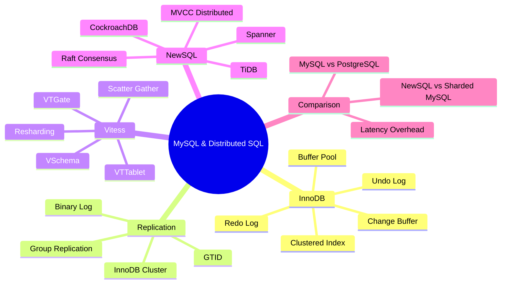
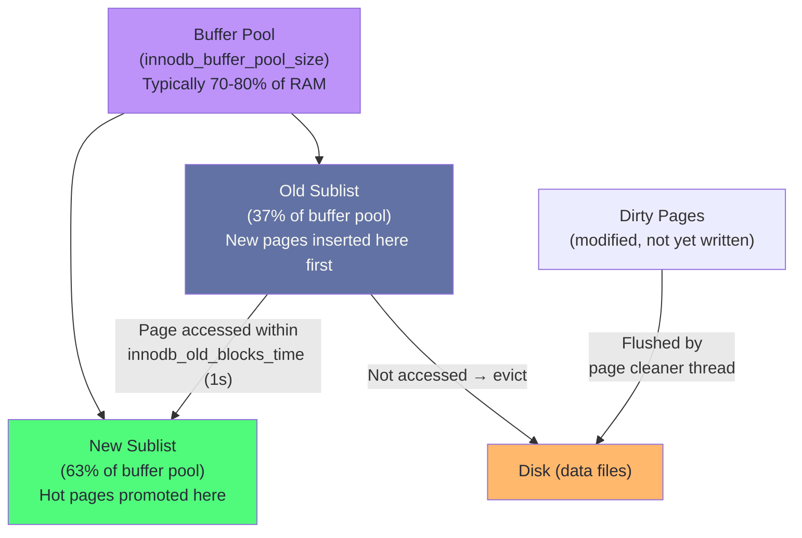
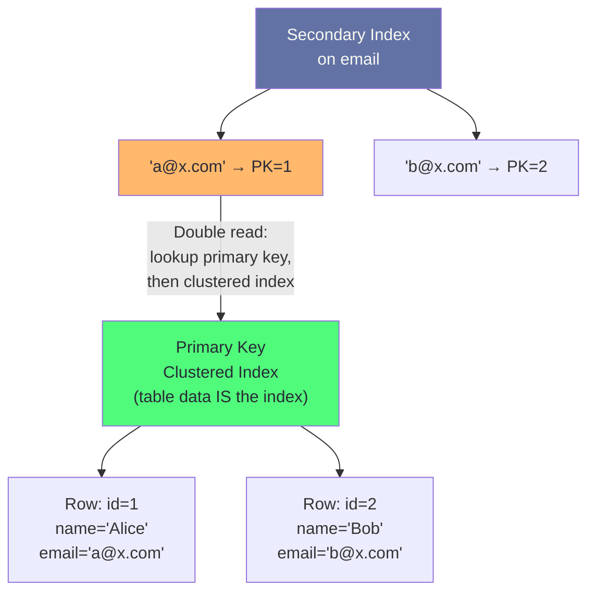
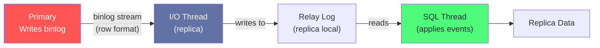
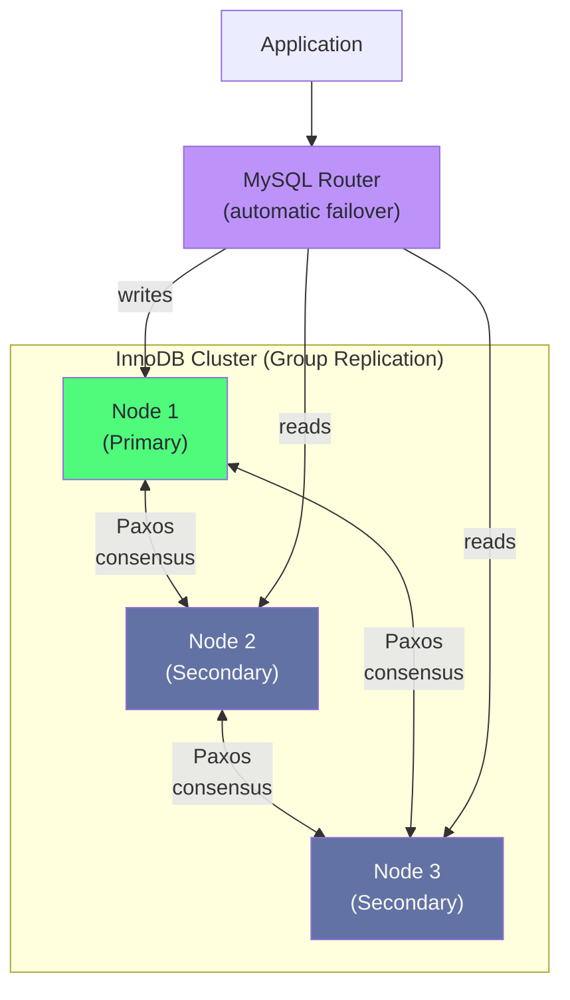
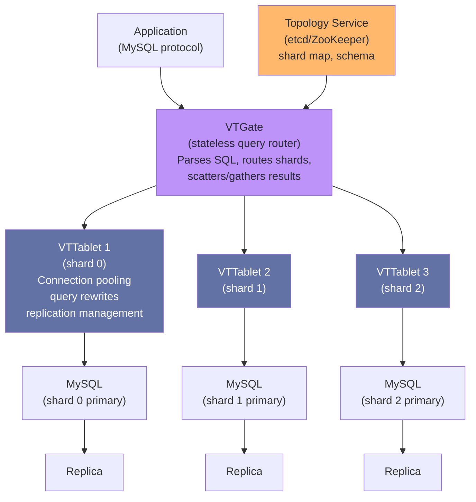
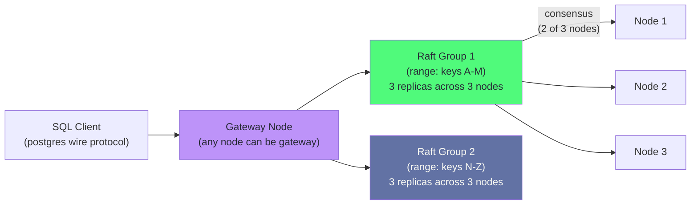
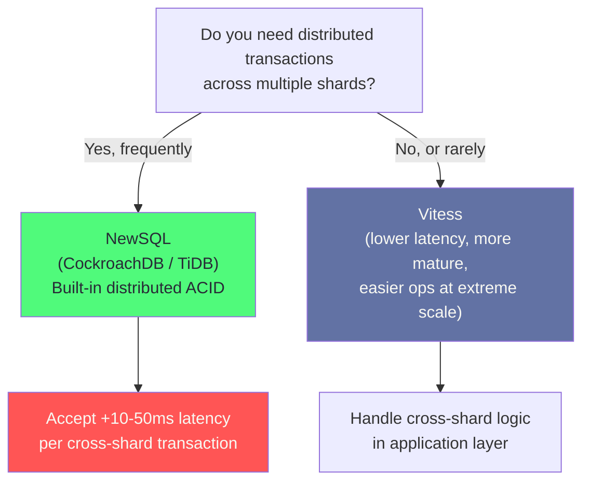

# Chapter 6: MySQL & Distributed SQL

> "MySQL won the web era. Vitess is MySQL's answer to the distributed era. NewSQL is the question after that."

## Mind Map



---

## InnoDB Internals

InnoDB is MySQL's default storage engine since 5.5 (2010). Understanding its internals is prerequisite for tuning and troubleshooting any MySQL production system.

### Buffer Pool

The buffer pool is InnoDB's equivalent of PostgreSQL's shared_buffers — an in-memory page cache that holds data pages and index pages. The critical difference: InnoDB manages its own LRU list with a "midpoint insertion strategy" to prevent full table scans from evicting hot OLTP pages.



```ini
# my.cnf — InnoDB buffer pool configuration
[mysqld]
innodb_buffer_pool_size = 48G        # 75% of 64GB RAM
innodb_buffer_pool_instances = 8     # One per ~6GB; reduces mutex contention
innodb_buffer_pool_chunk_size = 128M # Must divide evenly into pool size/instances
```

### Clustered Index and Secondary Index Architecture

InnoDB organizes every table as a B-tree indexed by the primary key — this is the **clustered index**. The table data is the index; there is no separate heap file. This is fundamentally different from PostgreSQL, where heap files and indexes are separate structures.



**The secondary index double-read problem:** Every secondary index lookup requires two B-tree traversals — once to find the primary key from the secondary index, then again on the clustered index to retrieve the full row. This is why `SELECT *` via a secondary index is expensive. Use **covering indexes** to avoid the second lookup:

```sql
-- Without covering index: two B-tree traversals
SELECT name, email FROM users WHERE email = 'a@x.com';

-- With covering index: one traversal, data in index leaf
CREATE INDEX idx_users_email_name ON users (email, name);
-- Now (email, name) are both in the index — no clustered index lookup needed
```

### Undo Log and Redo Log

InnoDB uses two separate log structures:

| Log | Purpose | Location | Behavior |
|-----|---------|---------|---------|
| **Redo Log** | Crash recovery — replays committed changes | `ib_logfile0`, `ib_logfile1` | Sequential writes, fixed size (ring buffer) |
| **Undo Log** | MVCC — provides old row versions for snapshots | System tablespace or undo tablespaces | Grows with long transactions |

```ini
# Redo log tuning — larger = fewer checkpoints, longer recovery time
innodb_log_file_size = 2G            # Each file; total = 4GB
innodb_log_files_in_group = 2        # Standard is 2
innodb_log_buffer_size = 64M         # In-memory buffer before fsync

# Undo tablespace tuning
innodb_undo_tablespaces = 4          # Separate undo files (MySQL 8.0+)
innodb_max_undo_log_size = 1G        # Trigger undo truncation above this
```

:::warning Long Transactions Bloat the Undo Log
A transaction left open (even idle) forces InnoDB to retain all row versions modified since that transaction started. A 6-hour-old read transaction on a high-write table can cause the undo log to grow by gigabytes. Monitor `INFORMATION_SCHEMA.INNODB_TRX` and kill idle transactions.
:::

---

## MySQL Replication

### Binary Log and GTID

MySQL replication is statement-based or row-based, controlled by the **binary log** (binlog). Unlike PostgreSQL's WAL-based replication, MySQL replicas replay SQL statements or row events from the binlog.



**GTID (Global Transaction Identifier):** Each transaction gets a globally unique ID (`server_uuid:sequence_number`). GTIDs make failover deterministic — a replica knows exactly which transactions it has applied, enabling automatic primary election without manual binlog position tracking.

```sql
-- Enable GTID replication (MySQL 5.6+)
-- my.cnf:
-- gtid_mode = ON
-- enforce_gtid_consistency = ON

-- Check GTID status
SHOW MASTER STATUS\G
SHOW REPLICA STATUS\G

-- Find transactions on primary not yet on replica
SELECT GTID_SUBTRACT(
  @@GLOBAL.gtid_executed,  -- primary
  '...'                    -- replica's gtid_executed
) AS missing_transactions;
```

### MySQL Group Replication and InnoDB Cluster

Group Replication adds **Paxos consensus** to MySQL replication, enabling multi-primary writes with automatic conflict detection. InnoDB Cluster packages Group Replication with MySQL Shell and MySQL Router for production deployments.



| Mode | Description | Write Throughput | Use Case |
|------|-------------|-----------------|---------|
| **Single-Primary** | One writer, automatic failover | Limited by single node | OLTP with HA requirement |
| **Multi-Primary** | All nodes accept writes, conflict detection | Higher but coordination overhead | Geographically distributed writes |

:::info Group Replication Latency
Every write in Group Replication must be certified by a quorum of nodes before committing. This adds 1–5ms latency for local cluster, 10–50ms for geo-distributed cluster. For write-heavy workloads, this overhead matters. Vitess scales better for very high write rates.
:::

---

## Vitess: MySQL at YouTube Scale

Vitess was built at YouTube in 2010 to scale MySQL horizontally without changing the application. It is now the foundation of Shopify, GitHub, Slack, and PlanetScale.

### Architecture



**VTGate** is a stateless proxy layer that speaks the MySQL protocol. Applications connect to VTGate exactly as if connecting to MySQL. VTGate parses queries, consults the topology service for the shard map, and routes queries to the appropriate VTTablet(s).

**VTTablet** runs alongside each MySQL instance, managing connection pooling (replacing ProxySQL), query rewrites, schema tracking, and replication health checks.

### VSchema: Defining the Sharding Strategy

VSchema is a JSON schema that tells VTGate how data is distributed:

```json
{
  "sharded": true,
  "vindexes": {
    "user_id_hash": {
      "type": "hash"
    }
  },
  "tables": {
    "orders": {
      "column_vindexes": [
        {
          "column": "user_id",
          "name": "user_id_hash"
        }
      ]
    }
  }
}
```

Vitess automatically routes `WHERE user_id = 42` to the correct shard. Cross-shard queries trigger a scatter-gather: VTGate sends the query to all shards and merges results.

### Scatter-Gather and Cross-Shard Queries

```sql
-- Single-shard query (fast): routes to exactly one MySQL shard
SELECT * FROM orders WHERE user_id = 42;

-- Scatter-gather query (slow): hits all shards, merges in VTGate
SELECT COUNT(*) FROM orders WHERE status = 'pending';

-- Cross-shard JOIN (very expensive): scattered, then joined in VTGate memory
SELECT o.id, u.name
FROM orders o JOIN users u ON o.user_id = u.id
WHERE o.status = 'pending';
```

:::warning Scatter-Gather at Scale
A scatter-gather query against 100 shards takes 100× the resources of a single-shard query. Design your access patterns so that common queries always include the shard key. Analytics queries should be routed to a separate ClickHouse cluster, not scattered across MySQL shards.
:::

### Resharding: Online Horizontal Scaling

Vitess's killer feature is online resharding — splitting a shard without downtime:

1. **Copy phase:** VTTablet streams all rows from the source shard to two new destination shards, applying ongoing writes to both
2. **Catchup phase:** Destination shards consume the binlog to catch up
3. **Switch reads:** Traffic switches to destination shards (reads first)
4. **Switch writes:** Write traffic migrates, source becomes read-only
5. **Cleanup:** Source shard data is dropped

The application sees zero downtime throughout — VTGate handles routing transparently.

---

## NewSQL: Distributed SQL

NewSQL databases offer SQL + ACID + horizontal scale by using distributed consensus (Raft or Paxos) and distributed MVCC. The trade-off: latency.

### CockroachDB

CockroachDB stores data as key-value pairs in RocksDB, distributes them across nodes as Raft groups, and presents a PostgreSQL-compatible SQL interface.



### TiDB

TiDB separates compute (TiDB nodes, MySQL-compatible SQL) from storage (TiKV, distributed key-value). TiFlash adds a columnar replica for HTAP analytics.

### Google Spanner

Spanner uses TrueTime (GPS + atomic clocks) to assign globally consistent timestamps, enabling external consistency without coordinator latency. Available as Cloud Spanner on GCP.

### NewSQL Comparison

| System | Protocol | Consensus | Latency Overhead | Geographic Distribution |
|--------|---------|----------|-----------------|------------------------|
| **CockroachDB** | PostgreSQL | Raft | +5–20ms single-region | Yes, native multi-region |
| **TiDB** | MySQL | Raft | +10–20ms | Yes, with TiDB Operator |
| **Spanner** | proprietary / JDBC | Paxos + TrueTime | +20–50ms | Yes, global |
| **Sharded MySQL + Vitess** | MySQL | N/A (async replication) | <1ms (local shard) | Manual, cross-region replication |

### When NewSQL Beats Sharded MySQL + Vitess



Use NewSQL when:
- You need distributed transactions across shards (e.g., financial transfers between accounts in different shards)
- You want SQL without building a sharding layer
- Your p99 latency budget allows 20–50ms additional overhead

Use Vitess when:
- You are already on MySQL and want to scale horizontally
- Latency is critical and cross-shard transactions are rare
- You need proven scale (YouTube/Shopify-scale deployments)
- You want to stay on standard MySQL tooling

---

## MySQL vs PostgreSQL: 2025 Feature Comparison

| Feature | MySQL 8.x | PostgreSQL 16 |
|---------|-----------|--------------|
| **ACID transactions** | Yes (InnoDB) | Yes |
| **JSON support** | JSON type, limited operators | JSONB with full indexing (GIN), operators |
| **Full-text search** | Basic FULLTEXT indexes | `tsvector`, GIN, advanced ranking |
| **Partitioning** | Range, List, Hash, Key | Range, List, Hash + pg_partman automation |
| **Parallel query** | Yes (MySQL 8.0+) | More mature, more query types |
| **Window functions** | Yes (MySQL 8.0+) | Yes, more complete |
| **CTEs** | Yes (MySQL 8.0+) | Yes, with `RECURSIVE` |
| **Replication** | Binlog (async/semi-sync), Group Replication | WAL streaming (sync/async), logical replication |
| **Sharding** | Via Vitess (external) | Via Citus (extension) |
| **Vector search** | Limited (MySQL 9.0 preview) | pgvector (HNSW, IVFFlat, mature) |
| **Extensions** | Limited | Rich ecosystem (300+ extensions) |
| **License** | GPL (dual-license) | PostgreSQL License (permissive) |
| **Default storage** | InnoDB (clustered index) | Heap files + B-tree indexes |

---

## Case Study: Shopify's Vitess Migration

Shopify runs one of the world's largest MySQL deployments. By 2014, their monolithic MySQL database could no longer scale vertically to handle Black Friday traffic spikes.

**The Problem:** A single MySQL primary with read replicas. Write throughput was capped by single-node limits. Schema changes required long `ALTER TABLE` locks. Flash sales created hotspot contention on specific product rows.

**The Migration Path:**

1. **2014–2015:** Evaluated MySQL sharding options. Chose Vitess (originally built at YouTube, open-sourced 2012) over custom sharding because of the transparent MySQL protocol compatibility.

2. **2016:** Deployed Vitess for the `products` and `orders` keyspaces. Used Vitess's online schema change tool (`gh-ost` integration via VTTablet) to eliminate ALTER TABLE downtime.

3. **2017–2019:** Migrated all core tables to Vitess. Implemented VSchema for the `shop_id` shard key — every merchant's data lives on a single shard, eliminating cross-shard transactions for the common case.

4. **2020–present:** Running hundreds of MySQL shards behind Vitess. The 2020 BFCM (Black Friday / Cyber Monday) processed 44 orders per second at peak — a 76% increase over 2019 — with zero database downtime.

**Key Technical Decisions:**
- `shop_id` as the universal shard key: all queries for a given shop route to one shard
- VTGate's connection pooling replaced MySQL's per-connection overhead, allowing 100× more application threads
- Online resharding (splitting overloaded shards) done during off-peak hours with zero application downtime
- Vitess's VReplication (internal binlog-based data movement) powers resharding and cross-keyspace moves

**Lessons:**
- Choosing the right shard key eliminates cross-shard transactions in the common case
- Schema changes are the biggest operational challenge on sharded MySQL — invest in tooling early
- Vitess's metadata management (topology service in etcd) needs high availability itself

---

## Related Chapters

| Chapter | Relevance |
|---------|-----------|
| [Ch01 — Database Landscape](/database/part-1-foundations/ch01-database-landscape) | Storage engine fundamentals, B-tree vs LSM |
| [Ch04 — Transactions & Concurrency](/database/part-1-foundations/ch04-transactions-concurrency-control) | MVCC and isolation levels in InnoDB |
| [Ch05 — PostgreSQL in Production](/database/part-2-engines/ch05-postgresql-in-production) | PostgreSQL vs MySQL internals comparison |
| [Ch07 — NoSQL at Scale](/database/part-2-engines/ch07-nosql-at-scale) | When to move off SQL entirely |
| [System Design Ch09](/system-design/part-2-building-blocks/ch09-databases-sql) | SQL database selection framework |

---

## Practice Questions

### Beginner

1. **InnoDB Clustered Index:** A developer creates a MySQL table with no explicit primary key. InnoDB creates a hidden 6-byte `rowid` column as the primary key. What performance consequences does this have compared to a meaningful integer primary key? How does this affect secondary index lookups?

   <details>
   <summary>Hint</summary>
   Without a meaningful primary key, secondary index lookups carry a 6-byte hidden rowid pointer — functionally the same overhead as any other primary key. The real problem: the hidden rowid is not exposed to the application, making it impossible to build covering indexes that include the PK for common access patterns. Also, UUID primary keys cause random B-tree insertions and fragmentation — use auto-increment integers or ordered UUIDs.
   </details>

2. **Replication Lag:** A MySQL replica reports 30-second replication lag during peak traffic. The primary is writing 5000 rows/second. What are the three most likely causes, and how would you diagnose each?

   <details>
   <summary>Hint</summary>
   (1) Single-threaded SQL thread: MySQL 5.6 replicas apply events serially. Fix: enable parallel replication (`slave_parallel_workers = 8`, `slave_parallel_type = LOGICAL_CLOCK`). (2) Large transactions: a single 1M-row UPDATE creates a large binlog event that blocks the SQL thread. (3) Network/disk I/O bottleneck on replica: check `SHOW REPLICA STATUS` for `Seconds_Behind_Source` vs IO thread vs SQL thread lag separately to isolate.
   </details>

### Intermediate

3. **Vitess Scatter-Gather:** Your team shards a `messages` table by `user_id` across 16 Vitess shards. A product manager requests a "global inbox" feature that shows all unread messages across all users, sorted by timestamp. What does Vitess do with this query, and what is your recommendation?

   <details>
   <summary>Hint</summary>
   Vitess scatter-gathers this query to all 16 shards, merges 16 sorted result sets in VTGate memory, and returns the merged result. This is 16× the work of a single-shard query and does not scale with shard count. Recommendation: maintain a separate `global_inbox` denormalized table on a dedicated keyspace with `(timestamp, message_id)` as the access key, written via application-level fan-out on message creation. Or route analytics queries to a ClickHouse replica fed by binlog CDC.
   </details>

4. **NewSQL Latency Trade-off:** Your fintech application processes cross-account transfers. Currently using sharded MySQL + Vitess where accounts can be on different shards. A transaction moving $100 from account A (shard 1) to account B (shard 3) requires a distributed XA transaction, which fails 0.1% of the time and requires manual reconciliation. A colleague proposes migrating to CockroachDB. What are the trade-offs?

   <details>
   <summary>Hint</summary>
   CockroachDB pros: native distributed ACID transactions with no XA failures, simpler application code. CockroachDB cons: +10–20ms latency per transaction vs <1ms for single-shard Vitess queries; operational complexity of a new system; less mature ecosystem; cost (CockroachDB cloud vs self-managed MySQL). At 0.1% failure rate, evaluate: is the reconciliation cost higher than the engineering cost of migrating + the latency budget cost? For a fintech system where correctness is paramount, CockroachDB's native distributed transactions are worth the latency if your SLA allows it.
   </details>

### Advanced

5. **Vitess Resharding Design:** You run 4 Vitess shards for a social media platform sharded by `user_id`. Shard 0 (users 0–25%) is overloaded because it contains your top influencers (Pareto distribution — top 1% of users generate 40% of writes). You cannot reshard by user_id alone. Design a solution.

   <details>
   <summary>Hint</summary>
   The Pareto distribution problem: hash-based sharding distributes users evenly by count but not by write volume. Options: (1) Custom vindex in Vitess — map hot user IDs to dedicated shards (lookup vindex), keeping normal users on hash vindex. (2) Separate keyspace for "power users" with finer-grained sharding. (3) Application-level write buffering for influencer writes (rate-limit writes to MySQL, buffer in Redis, flush in batches). (4) Move influencer post fanout to an async queue (Kafka → separate write path). The real lesson: shard key choice assumes uniform distribution — for power-law distributions, you need tiered sharding or application-level isolation of hot entities.
   </details>

---

## References

- [Vitess Architecture Overview](https://vitess.io/docs/concepts/architecture/)
- [MySQL InnoDB Storage Engine Documentation](https://dev.mysql.com/doc/refman/8.0/en/innodb-storage-engine.html)
- [CockroachDB Architecture Design](https://www.cockroachlabs.com/docs/stable/architecture/overview.html)
- [TiDB Architecture](https://docs.pingcap.com/tidb/stable/tidb-architecture)
- [Google Spanner Paper](https://research.google/pubs/pub39966/) — Corbett et al. (2012)
- [Shopify Engineering — Resurrecting MySQL](https://shopify.engineering/resurrecting-dead-letters-at-shopify)
- [PlanetScale — How Vitess Works](https://planetscale.com/docs/concepts/how-vitess-works)
- ["Designing Data-Intensive Applications"](https://dataintensive.net/) — Kleppmann, Ch. 5 (Replication), Ch. 6 (Partitioning)
- [MySQL Group Replication Documentation](https://dev.mysql.com/doc/refman/8.0/en/group-replication.html)
