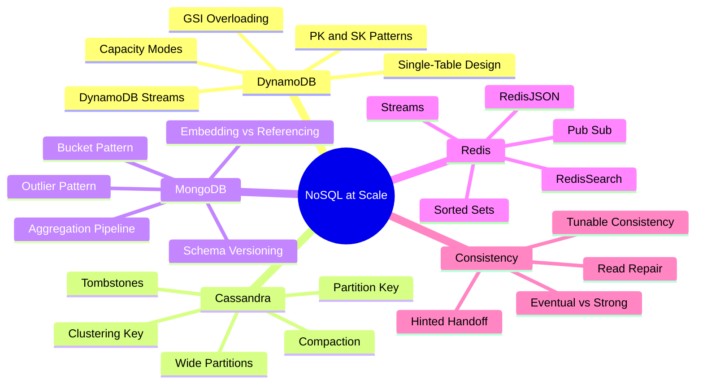
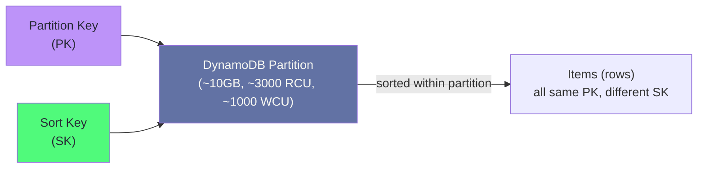
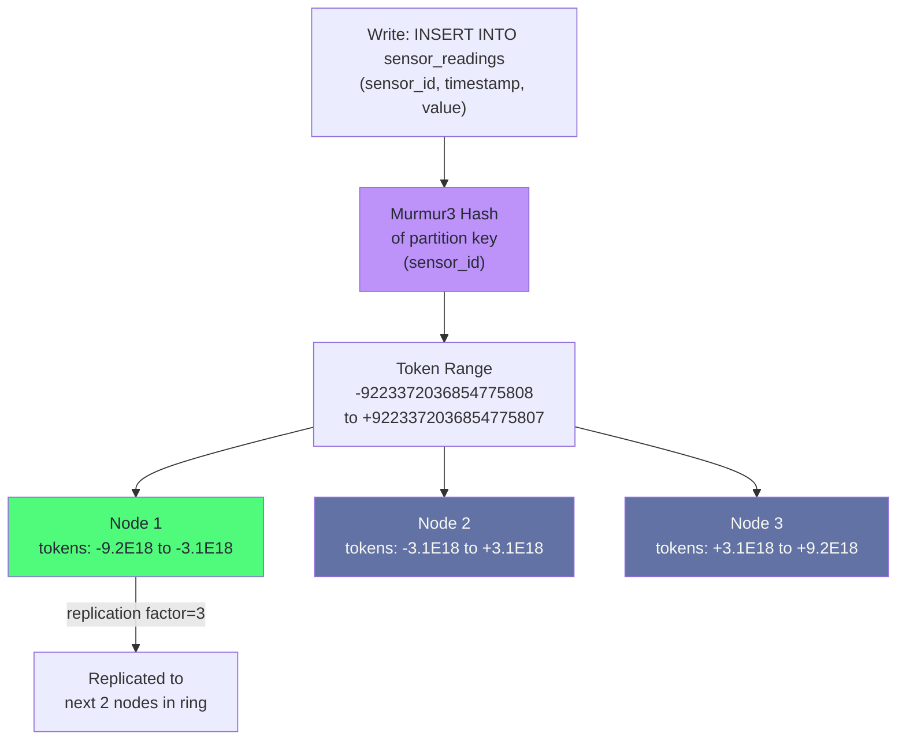
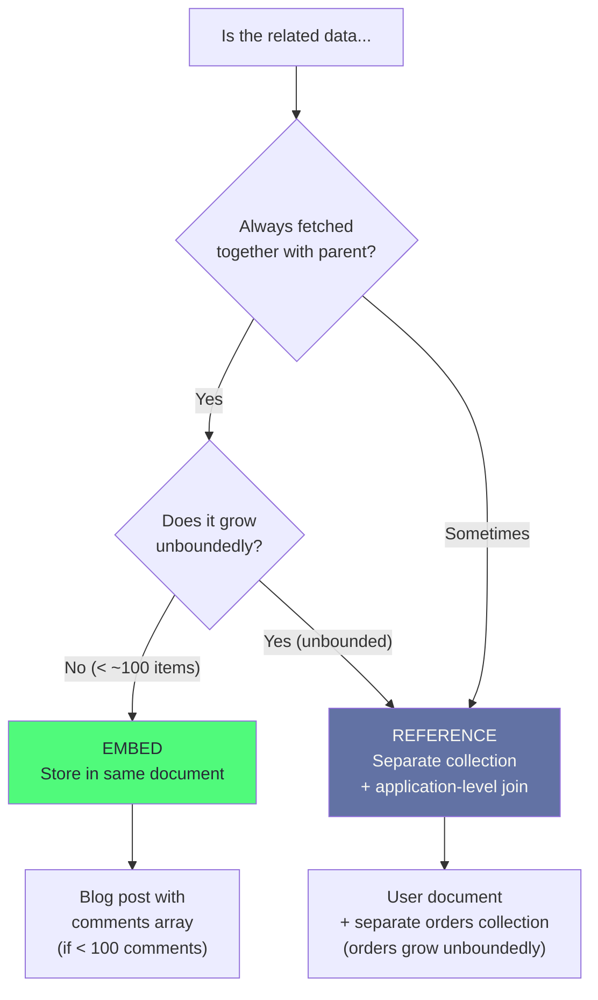
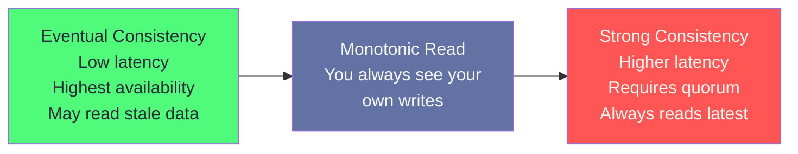

# Chapter 7: NoSQL at Scale

> "NoSQL is not a rejection of SQL. It is a deliberate choice to trade relational expressiveness for specific performance guarantees."

## Mind Map



---

## DynamoDB: Single-Table Design

DynamoDB is a serverless key-value and document store from AWS that scales to millions of requests per second with consistent single-digit millisecond latency. The key to using it correctly is understanding that its data model is radically different from SQL.

### The Single-Table Principle

In SQL, you normalize data into multiple tables and JOIN at query time. In DynamoDB, you **precompute the joins** at write time by storing multiple entity types in a single table, using overloaded attribute names.

Every DynamoDB table has:
- **Partition Key (PK):** Determines which partition (physical node) stores the item
- **Sort Key (SK):** Sorts items within a partition; enables range queries and hierarchical relationships



### E-Commerce Single-Table Schema

All entity types (users, orders, order items, products) live in one DynamoDB table:

| PK | SK | Attributes | Entity Type |
|----|-----|-----------|-------------|
| `USER#u001` | `PROFILE#u001` | name, email, created_at | User profile |
| `USER#u001` | `ORDER#2024-01-15#ord001` | total, status | Order header |
| `USER#u001` | `ORDER#2024-01-15#ord002` | total, status | Order header |
| `ORDER#ord001` | `ITEM#sku123` | quantity, price | Order item |
| `ORDER#ord001` | `ITEM#sku456` | quantity, price | Order item |
| `PRODUCT#sku123` | `METADATA` | name, description, price | Product |

```javascript
// Access patterns enabled by this schema:

// 1. Get user profile
{ PK: "USER#u001", SK: "PROFILE#u001" }

// 2. Get all orders for a user (sorted by date)
{
  KeyConditionExpression: "PK = :pk AND begins_with(SK, :prefix)",
  ExpressionAttributeValues: { ":pk": "USER#u001", ":prefix": "ORDER#" }
}

// 3. Get all items in an order
{
  KeyConditionExpression: "PK = :pk AND begins_with(SK, :prefix)",
  ExpressionAttributeValues: { ":pk": "ORDER#ord001", ":prefix": "ITEM#" }
}

// 4. Get product metadata
{ PK: "PRODUCT#sku123", SK: "METADATA" }
```

### GSI Overloading

Global Secondary Indexes (GSIs) add alternative access patterns. By using generic attribute names (`GSI1PK`, `GSI1SK`), you can answer multiple query patterns with one GSI:

| PK | SK | GSI1PK | GSI1SK | Entity |
|----|-----|--------|--------|--------|
| `USER#u001` | `ORDER#2024-01-15#ord001` | `STATUS#pending` | `2024-01-15T10:00:00` | Order |
| `USER#u002` | `ORDER#2024-01-16#ord003` | `STATUS#shipped` | `2024-01-16T09:00:00` | Order |

```javascript
// GSI: find all pending orders across all users, sorted by time
{
  IndexName: "GSI1",
  KeyConditionExpression: "GSI1PK = :status",
  ExpressionAttributeValues: { ":status": "STATUS#pending" },
  ScanIndexForward: true  // ascending by GSI1SK (time)
}
```

### Access Pattern Planning

Design your DynamoDB schema by listing access patterns first:

| Access Pattern | PK | SK | GSI? |
|---------------|-----|-----|------|
| Get user by ID | `USER#{id}` | `PROFILE#{id}` | No |
| Get orders for user | `USER#{id}` | `ORDER#*` | No |
| Get items for order | `ORDER#{id}` | `ITEM#*` | No |
| Get orders by status | — | — | GSI1: `STATUS#{status}` |
| Get product by SKU | `PRODUCT#{sku}` | `METADATA` | No |

:::warning Never Scan a DynamoDB Table
`Scan` reads every item in the table, consuming all provisioned capacity. Design every access pattern to use `Query` (with PK) or `GetItem` (with PK + SK). If you cannot avoid a scan, consider whether DynamoDB is the right tool or whether you need a GSI for that access pattern.
:::

---

## Cassandra: Partition and Clustering Keys

Cassandra is a wide-column store designed for massive write throughput across multiple data centers. Its data model is fundamentally different from both SQL and DynamoDB.

### Partition Routing



### Schema Design: Primary Key Anatomy

```sql
-- Cassandra table: sensor readings
CREATE TABLE sensor_readings (
  sensor_id   UUID,       -- Partition key: determines node
  bucket      TEXT,       -- Partition key component: time bucketing (2024-01)
  timestamp   TIMESTAMP,  -- Clustering key: sort order within partition
  value       DOUBLE,
  unit        TEXT,
  PRIMARY KEY ((sensor_id, bucket), timestamp)  -- Composite partition + clustering
) WITH CLUSTERING ORDER BY (timestamp DESC);

-- Query: last 100 readings for sensor X in January 2024
SELECT * FROM sensor_readings
WHERE sensor_id = ? AND bucket = '2024-01'
ORDER BY timestamp DESC
LIMIT 100;
```

### Wide Partition Anti-Pattern

A partition in Cassandra can store up to 2 billion cells (columns × rows). A partition that grows without bound becomes a **hot partition** — all reads and writes for that partition land on one node, creating a bottleneck.

```sql
-- ANTI-PATTERN: unbounded partition
-- All posts for a popular user (millions of posts) → one partition → hot node
CREATE TABLE user_posts (
  user_id UUID,
  post_id TIMEUUID,
  content TEXT,
  PRIMARY KEY (user_id, post_id)
);

-- CORRECT: time-bucketed partition
-- Each partition holds at most one month of posts per user
CREATE TABLE user_posts (
  user_id   UUID,
  month     TEXT,   -- '2024-01', '2024-02', etc.
  post_id   TIMEUUID,
  content   TEXT,
  PRIMARY KEY ((user_id, month), post_id)
) WITH CLUSTERING ORDER BY (post_id DESC);
```

The time-bucketing strategy limits partition size while keeping related data co-located. The trade-off: queries spanning multiple months must query multiple partitions and merge results.

### Tombstones: The Hidden Performance Killer

In Cassandra, `DELETE` does not remove data — it writes a **tombstone** marker. During reads, Cassandra must scan all tombstones in a partition before returning live rows. Heavy delete workloads cause tombstone accumulation that severely degrades read performance.

```sql
-- Check tombstone count per partition (Cassandra nodetool)
-- nodetool tablehistograms keyspace.table

-- Design to avoid tombstones:
-- Option 1: Use TTL instead of DELETE
INSERT INTO events (id, data) VALUES (?, ?)
USING TTL 2592000;  -- Auto-expires after 30 days (no tombstone at read time)

-- Option 2: Partition by time bucket, DROP old partitions
-- Instead of deleting rows, let old month-buckets fall off naturally
```

:::warning Tombstone GC Grace Period
By default, tombstones are only removed by compaction 10 days after creation (`gc_grace_seconds = 864000`). If you delete heavily and read the same partition, you will read through all accumulated tombstones every time. Tune `gc_grace_seconds` to match your compaction frequency, or redesign to use TTL.
:::

### Compaction Strategies

| Strategy | How It Works | Best For |
|---------|-------------|---------|
| **STCS** (SizeTieredCompaction) | Merges SSTables of similar size | Write-heavy workloads, minimal reads |
| **LCS** (LeveledCompaction) | Organized levels, like RocksDB | Read-heavy, needs low read amplification |
| **TWCS** (TimeWindowCompaction) | Compacts SSTables within time windows | Time-series data with TTL |

---

## MongoDB: Schema Patterns

MongoDB stores documents (JSON/BSON) in collections. Unlike DynamoDB, it supports flexible queries without predefined access patterns — but schema design still matters enormously for performance.

### Embedding vs Referencing

The fundamental MongoDB schema decision: store related data in one document (embedding) or separate documents with references (referencing):



```javascript
// EMBEDDING: order with line items (bounded, always fetched together)
{
  _id: ObjectId("..."),
  user_id: "u001",
  status: "shipped",
  created_at: ISODate("2024-01-15"),
  items: [
    { sku: "SKU123", qty: 2, price: 19.99 },
    { sku: "SKU456", qty: 1, price: 49.99 }
  ],
  total: 89.97
}

// REFERENCING: user with separate orders collection
// users collection:
{ _id: "u001", name: "Alice", email: "a@x.com" }

// orders collection:
{ _id: ObjectId("..."), user_id: "u001", status: "shipped", total: 89.97 }
```

### Advanced Schema Patterns

**Bucket Pattern** — group time-series measurements into one document per time window to reduce document count and improve compression:

```javascript
// Instead of one document per reading (millions of docs):
{ sensor_id: "s001", timestamp: ISODate("..."), value: 23.4 }

// Bucket by hour (24 readings per document for minute-level data):
{
  sensor_id: "s001",
  bucket_hour: ISODate("2024-01-15T10:00:00Z"),
  count: 60,
  measurements: {
    "00": 23.4, "01": 23.5, "02": 23.3,  // minute offsets
    // ... 57 more
  },
  min: 23.1, max: 23.8, sum: 1405.2
}
```

**Outlier Pattern** — handle documents that grow beyond normal size (e.g., a viral post with 100K comments):

```javascript
// Normal blog post (comments embedded)
{
  _id: "post001",
  title: "Normal Post",
  comments: [ /* up to 100 comments */ ],
  has_overflow: false
}

// Viral post (overflow to separate collection)
{
  _id: "post999",
  title: "Viral Post",
  comments: [ /* first 50 comments */ ],
  has_overflow: true  // signal to app: fetch /comment_overflow/post999 too
}
// comment_overflow collection:
{ post_id: "post999", comments: [ /* comments 51-100K */ ] }
```

**Schema Versioning Pattern** — handle rolling schema migrations without downtime:

```javascript
// Add schema_version field to track document format
{
  _id: "u001",
  schema_version: 2,
  name: "Alice Smith",        // v2: split full_name into name
  // full_name: "Alice Smith" // v1 format — application handles both
}

// Application code:
function readUser(doc) {
  if (doc.schema_version === 1) {
    return { name: doc.full_name, ...doc };
  }
  return doc;  // v2 already correct
}
```

### MongoDB Aggregation Pipeline

```javascript
// Complex aggregation: daily revenue by product category, last 30 days
db.orders.aggregate([
  // Stage 1: filter to last 30 days
  { $match: { created_at: { $gte: new Date(Date.now() - 30 * 86400000) } } },
  // Stage 2: unwind line items array
  { $unwind: "$items" },
  // Stage 3: lookup product category
  { $lookup: {
    from: "products",
    localField: "items.sku",
    foreignField: "_id",
    as: "product"
  }},
  { $unwind: "$product" },
  // Stage 4: group by date + category
  { $group: {
    _id: {
      date: { $dateToString: { format: "%Y-%m-%d", date: "$created_at" } },
      category: "$product.category"
    },
    revenue: { $sum: { $multiply: ["$items.qty", "$items.price"] } },
    order_count: { $sum: 1 }
  }},
  // Stage 5: sort by date descending
  { $sort: { "_id.date": -1, revenue: -1 } }
]);
```

---

## Redis: Beyond Caching

Redis is most commonly used as a cache, but its data structures support production patterns that would require complex SQL or separate services.

### Sorted Sets: Leaderboards and Rate Limiting

```python
import redis
r = redis.Redis()

# Global leaderboard: O(log N) add, O(log N + K) range query
r.zadd("leaderboard:global", {"user:alice": 9850, "user:bob": 7420})

# Top 10 players
top_10 = r.zrevrange("leaderboard:global", 0, 9, withscores=True)

# Sliding window rate limiting: count requests in last 60 seconds
import time
now = time.time()
window_key = f"rate:user:alice:{int(now // 60)}"
count = r.incr(window_key)
r.expire(window_key, 120)  # Keep for 2 windows
if count > 100:
    raise RateLimitExceeded()
```

### Redis Streams: Durable Event Log

Redis Streams (added in 5.0) provide a persistent, ordered log — similar to Kafka topics but within Redis:

```python
# Producer: append event to stream
r.xadd("events:orders", {
    "event_type": "order_created",
    "order_id": "ord001",
    "user_id": "u001",
    "total": "89.97"
})

# Consumer group: competing consumers, each message processed once
r.xgroup_create("events:orders", "shipping-service", id="0", mkstream=True)

# Read new messages
messages = r.xreadgroup(
    groupname="shipping-service",
    consumername="worker-1",
    streams={"events:orders": ">"},  # ">" = only new messages
    count=10,
    block=1000  # Block up to 1 second for new messages
)

# Acknowledge after successful processing
for stream, entries in messages:
    for entry_id, data in entries:
        process_order(data)
        r.xack("events:orders", "shipping-service", entry_id)
```

### Redis Modules

| Module | Capability | Use Case |
|--------|-----------|---------|
| **RedisJSON** | Native JSON storage with path queries | Config storage, user profiles, semi-structured data |
| **RedisSearch** | Full-text search, secondary indexes | Autocomplete, faceted search, filtering JSON docs |
| **RedisTimeSeries** | Time-series storage with aggregation | Metrics, IoT, monitoring dashboards |
| **RedisBloom** | Probabilistic structures (Bloom, Cuckoo, HLL) | Unique visitor counting, duplicate detection |
| **RedisGraph** | Graph database using Cypher | Social connections, recommendation engine |

### Memory Management

```bash
# redis.conf — production memory management
maxmemory 48gb
maxmemory-policy allkeys-lru    # Evict least recently used keys when full

# Key sizing: estimate memory before deploying
# String: 72 bytes overhead + value length
# Hash: 64 bytes overhead + (field: 64 bytes + value) × N fields
# Sorted Set: 128 bytes overhead + (64 bytes × N members)

# Monitor memory fragmentation
redis-cli INFO memory | grep -E "used_memory|fragmentation"
```

:::tip Persistence Options for Redis
`RDB` snapshots: periodic full-dataset dump. Fastest restart, data loss up to snapshot interval (5 minutes default). `AOF` (Append-Only File): logs every write command. Configurable fsync (`always`, `everysec`, `no`). `everysec` is the production default — at most 1 second of data loss on crash. `RDB + AOF`: best durability, slowest restart (replays AOF from last RDB).
:::

---

## NoSQL Consistency Patterns

NoSQL databases offer tunable consistency — a spectrum between eventual consistency (high availability, some data may be stale) and strong consistency (always current, higher latency).



### Consistency Levels Compared

| System | Level | Quorum Required | Behavior |
|--------|-------|----------------|---------|
| **Cassandra** | `ONE` | 1 replica | Fastest; may read stale data |
| **Cassandra** | `QUORUM` | (RF/2 + 1) replicas | Consistent if RF=3 and 2 nodes up |
| **Cassandra** | `ALL` | All replicas | Strongest; any replica down = failure |
| **DynamoDB** | Eventual Read | — | Default; up to ~1s stale |
| **DynamoDB** | Strongly Consistent Read | — | 2× cost; always latest |
| **MongoDB** | `primary` | Primary only | Default; always latest |
| **MongoDB** | `primaryPreferred` | Primary or secondary | Falls back to secondary if primary down |
| **MongoDB** | `majority` | Majority of nodes | Consistent; slower |

```python
# Cassandra: per-query consistency level
from cassandra import ConsistencyLevel
from cassandra.query import SimpleStatement

# Read with QUORUM (balanced: consistent + available)
stmt = SimpleStatement(
    "SELECT * FROM orders WHERE user_id = %s",
    consistency_level=ConsistencyLevel.QUORUM
)
session.execute(stmt, [user_id])

# Write with QUORUM (most production use cases)
stmt = SimpleStatement(
    "INSERT INTO orders (id, user_id, total) VALUES (%s, %s, %s)",
    consistency_level=ConsistencyLevel.QUORUM
)
```

### Read Repair and Hinted Handoff

**Read Repair:** When Cassandra reads with `QUORUM`, it compares versions across replicas. If replicas disagree, the latest version wins and is written back to stale replicas in the background. This is how eventual consistency converges.

**Hinted Handoff:** If a replica is temporarily down during a write, the coordinator stores a "hint" and replays the write when the replica comes back up. This provides durability without requiring all replicas to be available for every write.

---

## Case Study: Netflix's Cassandra Deployment

Netflix is one of the world's largest Cassandra operators, running thousands of Cassandra nodes across multiple AWS regions.

**Scale (2023):** ~7,000 Cassandra nodes, ~2.5 petabytes of data, multiple keyspaces for different services, 99.9999% availability target.

**The Core Use Case: Viewing History**

Netflix's viewing history service tracks every play, pause, and resume event for every user across every device. Requirements:
- Write: ~1M events/second globally
- Read: user opens Netflix → load viewing history in <50ms
- Retention: 2 years of history per user
- Availability: must work even during AWS regional outages

**Schema Design:**

```sql
-- Viewing history table
CREATE TABLE viewing_history (
  user_id   UUID,
  month     TEXT,      -- time bucket: '2024-01'
  show_id   UUID,
  watched_at TIMESTAMP,
  position  INT,       -- seconds watched
  completed BOOLEAN,
  PRIMARY KEY ((user_id, month), watched_at, show_id)
) WITH CLUSTERING ORDER BY (watched_at DESC)
  AND compaction = {'class': 'TWCS',  -- TimeWindowCompactionStrategy
                    'compaction_window_unit': 'DAYS',
                    'compaction_window_size': '1'};
```

**Multi-DC Replication:**

Netflix runs Cassandra with `NetworkTopologyStrategy`, replicating to 3 replicas per data center, across 3 AWS regions (us-east-1, us-west-2, eu-west-1). Writes use `LOCAL_QUORUM` (2 of 3 replicas in the local region) for low-latency writes. Cross-DC replication happens asynchronously.

**The "Chaos Monkey" Validation:**

Netflix's Chaos Engineering (randomly killing production instances) regularly validates that Cassandra's hinted handoff and read repair mechanisms maintain consistency after replica failures. Their experience: with proper schema design and `QUORUM` reads on critical paths, Cassandra maintains consistency despite frequent node failures.

**Key Lessons:**
- TWCS compaction is essential for time-series data — it co-locates data by time window, making old-data expiration (DROP TABLE or TTL) extremely efficient
- Time-bucketing by month limits partition size to manageable levels even for heavy users
- `LOCAL_QUORUM` is the sweet spot: consistent within a region, low latency, cross-DC replication happens asynchronously
- Cassandra's throughput advantage disappears for read-heavy workloads with many secondary indexes — Netflix routes complex analytics to Spark, not Cassandra

---

## Related Chapters

| Chapter | Relevance |
|---------|-----------|
| [Ch01 — Database Landscape](/database/part-1-foundations/ch01-database-landscape) | NoSQL category overview and CAP theorem |
| [Ch02 — Data Modeling for Scale](/database/part-1-foundations/ch02-data-modeling-for-scale) | Access-pattern-driven design (applies to NoSQL) |
| [Ch08 — Specialized Databases](/database/part-2-engines/ch08-specialized-databases) | When NoSQL is still not specialized enough |
| [System Design Ch10](/system-design/part-2-building-blocks/ch10-databases-nosql) | NoSQL selection in system design interviews |

---

## Practice Questions

### Beginner

1. **DynamoDB Access Pattern:** You are designing a DynamoDB table for a messaging app. Users send messages to conversations. Access patterns: (1) get all messages in a conversation, sorted by time; (2) get all conversations for a user. Design the PK/SK structure and explain what entity types you would store in a single table.

   <details>
   <summary>Hint</summary>
   PK: `CONV#{conversation_id}`, SK: `MSG#{timestamp}#{message_id}` for messages. For the user's conversations list: PK: `USER#{user_id}`, SK: `CONV#{last_message_timestamp}#{conversation_id}`. Both entity types in one table. For access pattern (2), a GSI where GSI1PK = `USER#{user_id}` and GSI1SK = `CONV#{last_message_timestamp}` gives conversations sorted by most recent activity.
   </details>

2. **Cassandra Partition Design:** A Cassandra table stores IoT temperature readings with schema `PRIMARY KEY (device_id, timestamp)`. After 6 months, queries for popular devices take 5+ seconds. What is the problem and how would you fix it?

   <details>
   <summary>Hint</summary>
   Wide partition problem: all readings for a popular device accumulate in one partition (potentially billions of rows). Fix: add a time-bucket component to the partition key — `PRIMARY KEY ((device_id, month), timestamp)`. Now each partition holds at most one month of readings. The trade-off: queries spanning multiple months must hit multiple partitions and merge results in the application.
   </details>

### Intermediate

3. **MongoDB Embedding Decision:** A blog platform stores posts and comments. Posts average 5–20 comments, but viral posts can have 50,000+ comments. Should you embed comments in the post document or reference them? Design a schema that handles both cases.

   <details>
   <summary>Hint</summary>
   Use the Outlier Pattern: embed the first N comments (e.g., 50) in the post document for normal posts. Add `has_overflow: true` flag when comments exceed 50 and store additional comments in a separate `comment_overflow` collection keyed by `post_id`. Application fetches overflow conditionally. This keeps the common case (< 50 comments) fast with no extra queries, while handling viral posts without hitting MongoDB's 16MB document size limit.
   </details>

4. **Redis vs Cassandra for Session Storage:** Your authentication service needs to store user sessions. Requirements: 10M active sessions, each ~2KB, 100K reads/second, 20K writes/second, sessions expire after 24 hours, must survive a Redis restart. Compare Redis vs Cassandra for this use case.

   <details>
   <summary>Hint</summary>
   Redis: 10M × 2KB = 20GB — fits comfortably in memory. With AOF `everysec` persistence, survives restart with at most 1 second of session loss (acceptable for session tokens that can be re-authenticated). Read at 100K/s at sub-millisecond latency. TTL handles expiration automatically — no DELETE needed. Cassandra: overkill for this use case — better for petabyte scale. The 24-hour TTL and sub-millisecond latency requirement favor Redis. Use Redis with RDB + AOF persistence and a standby replica for failover.
   </details>

### Advanced

5. **DynamoDB Hot Partition:** Your DynamoDB table stores product inventory. During a flash sale, product `SKU-IPHONE-15` receives 50,000 reads/second. A single DynamoDB partition supports ~3,000 RCU/second. DynamoDB auto-scaling cannot respond fast enough. Design a solution without changing the application's API.

   <details>
   <summary>Hint</summary>
   Write sharding + caching: (1) For the hot item, create N copies in DynamoDB with keys `PRODUCT#SKU-IPHONE-15#shard-{0..9}`. Reads randomly pick a shard, distributing load across 10 partitions (effective 30,000 RCU). Writes update all N shards (fan-out). (2) More practical at flash sale scale: cache the inventory in ElastiCache (Redis) with a short TTL (1–5 seconds). The application checks Redis first; cache miss triggers a DynamoDB read and repopulates cache. Redis can handle 100K+ reads/second at sub-millisecond latency. (3) Use DynamoDB DAX (in-memory cache layer) which is transparent to the application.
   </details>

---

## References

- [AWS DynamoDB Developer Guide — Best Practices](https://docs.aws.amazon.com/amazondynamodb/latest/developerguide/best-practices.html)
- [Alex DeBrie — The DynamoDB Book](https://www.dynamodbbook.com/)
- [Cassandra Data Modeling Documentation](https://cassandra.apache.org/doc/latest/cassandra/data_modeling/)
- [MongoDB Schema Design Patterns](https://www.mongodb.com/developer/products/mongodb/schema-design-anti-pattern-summary/)
- [Redis Streams Introduction](https://redis.io/docs/data-types/streams/)
- [Netflix Tech Blog — Cassandra at Netflix](https://netflixtechblog.com/tagged/cassandra)
- [Netflix Tech Blog — Chaos Engineering](https://netflixtechblog.com/the-netflix-simian-army-16e57fbab116)
- ["Designing Data-Intensive Applications"](https://dataintensive.net/) — Kleppmann, Ch. 2 (Data Models), Ch. 5 (Replication)
- [Cassandra: The Definitive Guide](https://www.oreilly.com/library/view/cassandra-the-definitive/9781492097136/) — Carpenter & Hewitt
