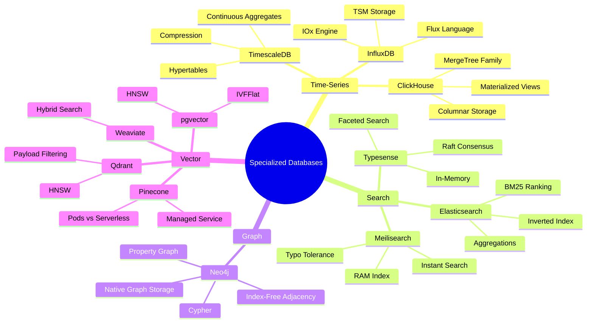
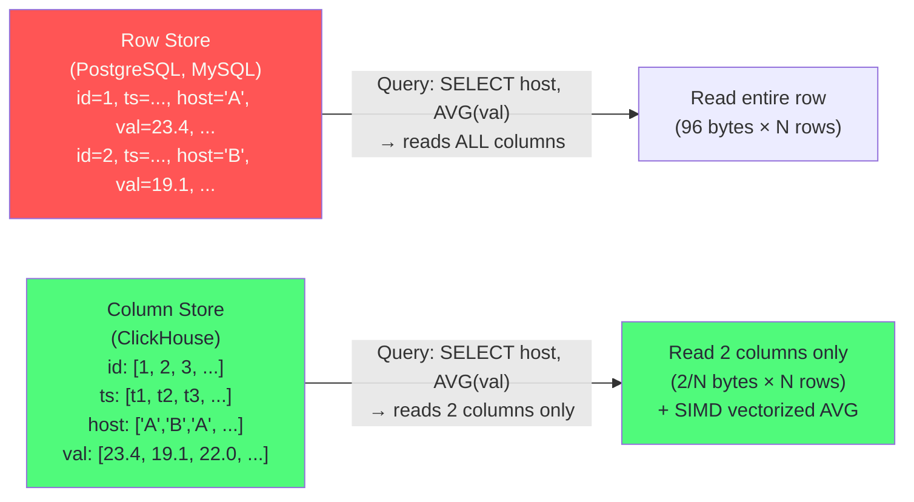
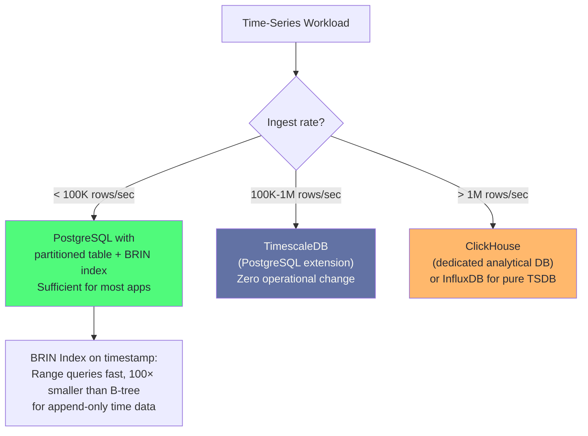
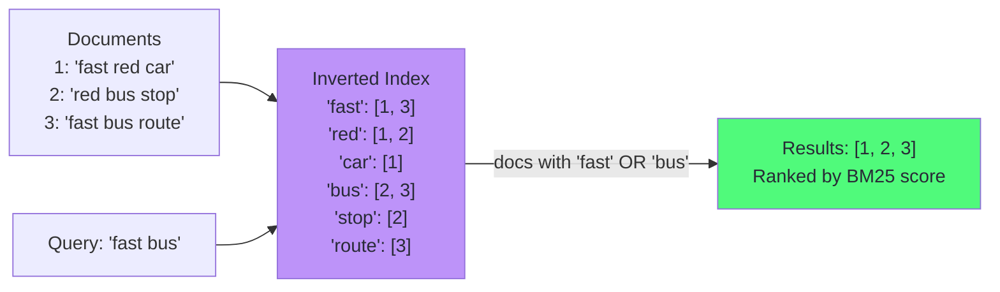
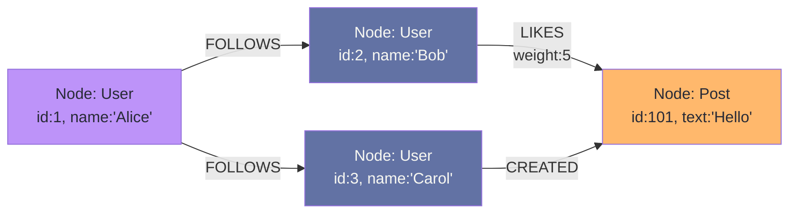
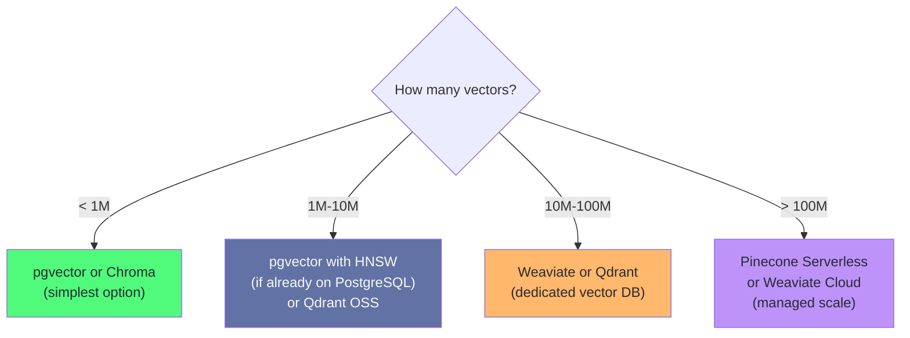
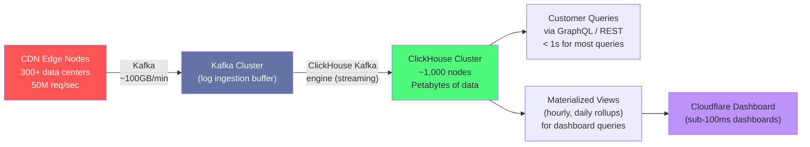

# Chapter 8: Specialized Databases

> "A specialized database does one thing 10× faster than a general-purpose database. The engineering question is always: does your workload actually need 10×?"

## Mind Map



---

## Time-Series Databases

Time-series workloads share three characteristics: data arrives with a timestamp, it is almost always appended (rarely updated), and queries are predominantly range-based (e.g., "last 24 hours"). These properties call for different storage optimizations than OLTP databases.

### ClickHouse: Columnar OLAP at CDN Scale

ClickHouse stores data column-by-column rather than row-by-row. A query touching only 3 columns of a 100-column table reads 3% of the data a row-store would read. Combined with vectorized execution (SIMD CPU instructions processing 256 bits at once), ClickHouse achieves extraordinary scan throughput.



#### MergeTree Engine

ClickHouse's primary storage engine is **MergeTree** — a family of LSM-like engines that append data in sorted parts and merge them in the background.

```sql
-- ClickHouse: web analytics events table
CREATE TABLE page_views (
  timestamp    DateTime,
  session_id   UUID,
  user_id      UInt64,
  page_url     String,
  referrer     String,
  country      LowCardinality(String),  -- dictionary encoding for low-cardinality
  duration_ms  UInt32,
  is_bounce    UInt8
)
ENGINE = MergeTree()
PARTITION BY toYYYYMM(timestamp)   -- one partition per month
ORDER BY (timestamp, session_id)   -- primary sort key (also the sparse index)
TTL timestamp + INTERVAL 2 YEAR;  -- auto-delete rows older than 2 years

-- Insert at high throughput: use batch inserts (100K+ rows per INSERT)
-- ClickHouse amortizes merge overhead across large batches

-- Materialized view: pre-aggregate by hour for dashboard queries
CREATE MATERIALIZED VIEW hourly_stats
ENGINE = SummingMergeTree()
ORDER BY (hour, country, page_url)
AS SELECT
  toStartOfHour(timestamp) AS hour,
  country,
  page_url,
  count() AS views,
  sum(duration_ms) AS total_duration,
  countIf(is_bounce = 1) AS bounces
FROM page_views
GROUP BY hour, country, page_url;
```

#### ClickHouse Benchmarks

| Metric | Value | Notes |
|--------|-------|-------|
| Ingestion rate | 4M rows/second | Single node, batch inserts, uncompressed |
| Compression ratio | 5–15× | LZ4 default; ZSTD for higher ratio |
| Scan throughput | 2–100 GB/s | Depends on query selectivity and column count |
| Query latency (1B rows, aggregation) | 100ms–2s | Single node, indexed sort key |
| Storage efficiency | 10–50 bytes/row | After compression (vs 100–500 bytes in PostgreSQL) |

### TimescaleDB: PostgreSQL for Time-Series

TimescaleDB is a PostgreSQL extension that adds time-series capabilities: automatic partitioning (hypertables), native compression, and continuous aggregates.

```sql
-- Create a hypertable: PostgreSQL table + automatic time-based partitioning
SELECT create_hypertable('sensor_readings', 'time',
  chunk_time_interval => INTERVAL '1 week'  -- one partition per week
);

-- Native compression: 10-30× compression ratio
ALTER TABLE sensor_readings SET (
  timescaledb.compress,
  timescaledb.compress_orderby = 'time DESC',
  timescaledb.compress_segmentby = 'sensor_id'
);

-- Compress chunks older than 7 days
SELECT add_compression_policy('sensor_readings', INTERVAL '7 days');

-- Continuous aggregate: materializes query results, refreshes automatically
CREATE MATERIALIZED VIEW sensor_hourly
WITH (timescaledb.continuous) AS
SELECT
  sensor_id,
  time_bucket('1 hour', time) AS bucket,
  AVG(value) AS avg_val,
  MAX(value) AS max_val,
  MIN(value) AS min_val
FROM sensor_readings
GROUP BY sensor_id, bucket;

SELECT add_continuous_aggregate_policy('sensor_hourly',
  start_offset => INTERVAL '2 days',
  end_offset   => INTERVAL '1 hour',
  schedule_interval => INTERVAL '30 minutes'
);

-- Query the continuous aggregate (fast: hits materialized data)
SELECT bucket, avg_val
FROM sensor_hourly
WHERE sensor_id = 'sensor-42'
  AND bucket >= NOW() - INTERVAL '7 days'
ORDER BY bucket DESC;
```

**TimescaleDB Benchmarks:**

| Metric | Value | Notes |
|--------|-------|-------|
| Ingestion rate | 1.3M rows/second | Single node, via COPY or multi-row INSERT |
| Compression ratio | 10–30× | Native columnar compression on chunks |
| Query speedup vs vanilla PostgreSQL | 10–100× | For time-range aggregations on compressed chunks |
| Continuous aggregate query | 1–50ms | Pre-materialized; near-instant |

### InfluxDB: Purpose-Built TSDB

InfluxDB 3.0 (IOx engine) is a rewrite in Rust using Apache Arrow and Parquet for storage, enabling SQL queries via Apache DataFusion. The older InfluxDB 1.x and 2.x use the TSM (Time-Structured Merge tree) storage engine.

```sql
-- InfluxDB 3.0: SQL interface over IOx
SELECT
  date_trunc('hour', time) AS hour,
  mean(temperature) AS avg_temp,
  max(temperature) AS max_temp
FROM weather_readings
WHERE location = 'NYC'
  AND time >= now() - INTERVAL '24 hours'
GROUP BY hour
ORDER BY hour DESC;
```

**Ingestion Benchmarks Comparison:**

| Database | Ingestion Rate (single node) | Compression | Best For |
|----------|---------------------------|------------|---------|
| ClickHouse | 4M rows/second | 10–50× | OLAP analytics, CDN-scale events |
| TimescaleDB | 1.3M rows/second | 10–30× | PostgreSQL teams, mixed OLTP+TS |
| InfluxDB 3.0 | 1.2M rows/second | 5–20× | IoT, metrics, pure time-series |

### When PostgreSQL Is Enough



---

## Search Engines

### Elasticsearch: Inverted Index at Scale

Elasticsearch stores documents in an inverted index — a map from terms to the list of documents containing that term. This enables full-text search across billions of documents in milliseconds.



**BM25 Ranking** considers term frequency in the document, inverse document frequency (rarer terms score higher), and document length normalization. It outperforms TF-IDF for most text search tasks.

```json
// Elasticsearch: product search with filters and aggregations
{
  "query": {
    "bool": {
      "must": [
        {
          "multi_match": {
            "query": "wireless headphones",
            "fields": ["title^3", "description", "tags"],
            "type": "best_fields",
            "fuzziness": "AUTO"
          }
        }
      ],
      "filter": [
        { "term": { "in_stock": true } },
        { "range": { "price": { "gte": 20, "lte": 300 } } }
      ]
    }
  },
  "aggs": {
    "brands": {
      "terms": { "field": "brand.keyword", "size": 10 }
    },
    "price_ranges": {
      "range": {
        "field": "price",
        "ranges": [
          { "to": 50 }, { "from": 50, "to": 150 }, { "from": 150 }
        ]
      }
    }
  },
  "from": 0, "size": 20,
  "sort": [{ "_score": "desc" }, { "sales_rank": "asc" }]
}
```

### Meilisearch: Sub-50ms Typo-Tolerant Search

Meilisearch maintains its entire index in RAM (memory-mapped files with mmap). This enables <50ms search latency at the cost of memory requirements proportional to index size.

```javascript
// Meilisearch: instant search with typo tolerance
const client = new MeiliSearch({ host: 'http://localhost:7700' });
const index = client.index('products');

// Configure relevance and filtering
await index.updateSettings({
  searchableAttributes: ['title', 'description', 'tags'],
  filterableAttributes: ['category', 'price', 'in_stock'],
  sortableAttributes: ['price', 'sales_rank'],
  typoTolerance: {
    enabled: true,
    minWordSizeForTypos: { oneTypo: 4, twoTypos: 8 }
  }
});

// Search: returns results in < 50ms for < 10M documents
const results = await index.search('wireles headphone', {
  filter: 'in_stock = true AND price < 200',
  sort: ['sales_rank:asc'],
  facets: ['category', 'brand'],
  limit: 20
});
```

### Typesense: Raft-Replicated In-Memory Search

Typesense uses Raft consensus for a distributed, fault-tolerant cluster of in-memory search nodes. Features native vector search (hybrid BM25 + ANN), multi-tenant isolation, and a strict schema.

### Search Latency Benchmarks

| Engine | Dataset | p50 Latency | p99 Latency | Notes |
|--------|---------|------------|------------|-------|
| Elasticsearch | 10K docs | 5ms | 15ms | Index warm, single shard |
| Elasticsearch | 1M docs | 10ms | 50ms | Single shard |
| Elasticsearch | 1B docs | 100ms | 500ms | Multi-shard cluster |
| Meilisearch | 10K docs | 1ms | 5ms | All in RAM |
| Meilisearch | 1M docs | 5ms | 20ms | RAM-mapped |
| Meilisearch | 1B docs | Not recommended | — | Memory requirement too high |
| Typesense | 10K docs | 1ms | 5ms | In-memory |
| Typesense | 1M docs | 3ms | 15ms | In-memory |
| PostgreSQL (GIN/tsvector) | 1M docs | 10ms | 100ms | Good for simple FTS |

### When PostgreSQL Full-Text Search Is Enough

```sql
-- PostgreSQL full-text search with GIN index
-- Handles up to ~5M documents well; beyond that, Elasticsearch wins

-- Add tsvector column for fast FTS
ALTER TABLE products ADD COLUMN search_vector tsvector;
UPDATE products SET search_vector =
  to_tsvector('english',
    coalesce(title, '') || ' ' ||
    coalesce(description, '') || ' ' ||
    coalesce(tags, '')
  );
CREATE INDEX idx_products_fts ON products USING GIN(search_vector);

-- Trigger to keep search_vector current
CREATE OR REPLACE FUNCTION update_search_vector() RETURNS trigger AS $$
BEGIN
  NEW.search_vector := to_tsvector('english',
    coalesce(NEW.title, '') || ' ' ||
    coalesce(NEW.description, '') || ' ' ||
    coalesce(NEW.tags, ''));
  RETURN NEW;
END $$ LANGUAGE plpgsql;

CREATE TRIGGER trg_search_vector BEFORE INSERT OR UPDATE ON products
FOR EACH ROW EXECUTE FUNCTION update_search_vector();

-- Search query with ranking
SELECT id, title,
       ts_rank(search_vector, query) AS rank
FROM products,
     to_tsquery('english', 'wireless & headphone') query
WHERE search_vector @@ query
  AND in_stock = true
ORDER BY rank DESC
LIMIT 20;
```

---

## Graph Databases

### Neo4j: Property Graph Model

Neo4j stores data as nodes (entities) and relationships (typed, directed edges), both with properties. The key innovation: **index-free adjacency** — each node stores direct pointers to its adjacent nodes, eliminating the need for B-tree index lookups during traversal.



```cypher
-- Cypher: find Alice's second-degree connections who liked a post
MATCH (alice:User {name: 'Alice'})-[:FOLLOWS]->(friend:User)-[:FOLLOWS]->(fof:User)
WHERE NOT (alice)-[:FOLLOWS]->(fof)
  AND alice <> fof
RETURN fof.name, COUNT(friend) AS mutual_friends
ORDER BY mutual_friends DESC
LIMIT 10;

-- Fraud detection: find accounts sharing 3+ attributes (IP, device, email pattern)
MATCH (a:Account)-[:USES]->(attr)<-[:USES]-(b:Account)
WHERE a.id <> b.id
WITH a, b, COUNT(attr) AS shared_attrs
WHERE shared_attrs >= 3
RETURN a.id, b.id, shared_attrs
ORDER BY shared_attrs DESC;
```

### When Graph Beats Relational Joins

The performance advantage of graph traversal over SQL JOINs grows with traversal depth. For deep relationship queries (3+ hops), graph databases are dramatically faster because they follow direct pointers rather than performing index lookups and hash joins.

| Traversal Depth | SQL (self-join) | Neo4j | Winner |
|----------------|----------------|-------|--------|
| 1 hop (direct friends) | 2ms | 2ms | Tie |
| 2 hops (friends of friends) | 20ms | 5ms | Neo4j (4×) |
| 3 hops | 300ms | 8ms | Neo4j (37×) |
| 4 hops | 30s+ | 15ms | Neo4j (2000×) |
| 5+ hops | Minutes/timeout | 50ms | Neo4j |

_Benchmark data: LinkedIn recommendation engine, 10M user graph, Neotechnology (2013)._

### Use Cases for Graph Databases

| Use Case | Why Graph Wins | Example Query |
|---------|---------------|--------------|
| Social network recommendations | Multi-hop traversal (FOAF, common interests) | "People you may know" |
| Fraud detection | Find connected rings of suspicious accounts | Shared device/IP/card chains |
| Knowledge graph | Arbitrary relationship types, semantic queries | "What drugs interact with X?" |
| Supply chain tracking | Bill of materials, dependency graphs | "What components use this chip?" |
| Access control (RBAC/ABAC) | Hierarchical permissions, role inheritance | "Does user have access via role chain?" |

---

## Vector Databases

Vector databases store dense floating-point embeddings and answer approximate nearest neighbor (ANN) queries: "find the K documents whose embedding is closest to this query embedding." This powers semantic search, RAG (Retrieval-Augmented Generation), and recommendation engines.

### Index Algorithms

**IVFFlat (Inverted File Flat):**
- Training phase: cluster embeddings into N centroids via k-means
- Query: find the M nearest centroids, then search exhaustively within them
- Pros: lower memory overhead than HNSW
- Cons: requires training (data must exist before index build); recall degrades for highly clustered data

**HNSW (Hierarchical Navigable Small World):**
- Multi-layer graph structure: top layers are sparse long-range links, bottom layers are dense short-range links
- Query: start at top layer, greedily navigate toward query point, descend layers
- Pros: no training, excellent recall (>95%), fast queries
- Cons: higher memory (1.5–2× raw embedding size), slower build than IVFFlat

```sql
-- pgvector: HNSW index (recommended for < 10M vectors)
CREATE EXTENSION vector;

CREATE TABLE product_embeddings (
  product_id BIGINT PRIMARY KEY,
  category   TEXT,
  embedding  vector(1536)
);

-- HNSW index: m=16 (connectivity), ef_construction=64 (build quality)
-- Higher m = better recall, more memory. 16 is a good default.
CREATE INDEX ON product_embeddings
  USING hnsw (embedding vector_cosine_ops)
  WITH (m = 16, ef_construction = 64);

-- Set query-time search width (higher = better recall, slower)
SET hnsw.ef_search = 100;

-- Semantic search: find 10 products most similar to a query embedding
SELECT
  product_id,
  category,
  1 - (embedding <=> '[0.1, 0.2, ...]'::vector) AS cosine_similarity
FROM product_embeddings
WHERE category = 'electronics'  -- pgvector pre-filters before ANN (good for small subsets)
ORDER BY embedding <=> '[0.1, 0.2, ...]'::vector
LIMIT 10;
```

### Vector Database Comparison

| System | Type | Max Vectors | Index | Filtering | Best For |
|--------|------|------------|-------|----------|---------|
| **pgvector** | PostgreSQL extension | ~10M (HNSW) | HNSW, IVFFlat | Full SQL WHERE | PostgreSQL-first teams, < 10M vectors |
| **Pinecone** | Managed SaaS | Billions (serverless) | Proprietary | Metadata filters | Production scale, no ops overhead |
| **Weaviate** | OSS + Cloud | 100M+ | HNSW | GraphQL, BM25 hybrid | Hybrid semantic + keyword search |
| **Qdrant** | OSS + Cloud | 100M+ | HNSW | Payload filters (rich) | Complex payload-filtered ANN |
| **Chroma** | OSS embedded | ~1M | HNSW | Metadata | Local dev, small datasets |



### RAG Architecture with pgvector

```python
# Retrieval-Augmented Generation with pgvector
import openai
import psycopg2
import numpy as np

def embed(text: str) -> list[float]:
    response = openai.embeddings.create(
        model="text-embedding-3-small",
        input=text
    )
    return response.data[0].embedding

def retrieve(query: str, top_k: int = 5) -> list[dict]:
    query_embedding = embed(query)

    conn = psycopg2.connect(DATABASE_URL)
    with conn.cursor() as cur:
        cur.execute("""
            SELECT document_id, content, chunk_text,
                   1 - (embedding <=> %s::vector) AS similarity
            FROM document_chunks
            ORDER BY embedding <=> %s::vector
            LIMIT %s
        """, (query_embedding, query_embedding, top_k))
        return [
            {"id": r[0], "content": r[2], "similarity": r[3]}
            for r in cur.fetchall()
        ]

def answer(question: str) -> str:
    context_docs = retrieve(question, top_k=5)
    context = "\n\n".join(d["content"] for d in context_docs)

    response = openai.chat.completions.create(
        model="gpt-4o",
        messages=[
            {"role": "system", "content": f"Context:\n{context}"},
            {"role": "user", "content": question}
        ]
    )
    return response.choices[0].message.content
```

---

## Decision Matrix

Use this table to choose a specialized database for your workload:

| Workload | Volume | Recommended DB | Reasoning |
|---------|--------|---------------|----------|
| Application metrics, dashboards | < 10M rows/day | PostgreSQL + TimescaleDB | Same cluster, SQL, continuous aggregates |
| CDN/web analytics | > 100M events/day | ClickHouse | Columnar, 4M rows/sec ingestion, MergeTree |
| IoT sensor data, monitoring | 1M–100M rows/day | TimescaleDB or InfluxDB | Hypertables, compression, native time functions |
| Full-text search, autocomplete | < 5M docs | PostgreSQL tsvector + GIN | No additional system |
| Full-text search, relevance scoring | 5M–100M docs | Elasticsearch or Typesense | Inverted index, BM25, faceting |
| Instant search, typo tolerance | < 50M docs | Meilisearch | Sub-50ms, zero-config |
| Social graph, fraud rings | Any | Neo4j | Index-free traversal, multi-hop performance |
| Recommendation engine (graph) | < 100M nodes | Neo4j Community | Open source |
| Semantic search, RAG | < 10M embeddings | pgvector HNSW | Integrated with existing PostgreSQL |
| Semantic search, RAG | 10M–100M embeddings | Qdrant or Weaviate | Purpose-built ANN, payload filtering |
| Semantic search, production SaaS | > 100M embeddings | Pinecone Serverless | Fully managed, petabyte scale |

---

## Monitoring Specialized Databases

Specialized databases have unique failure modes. Monitor these engine-specific metrics.

| Engine | Key Metrics | Tool | Critical Alert |
|--------|------------|------|----------------|
| **ClickHouse** | MergeTree parts count, Query duration p99, Delayed inserts, Replication queue | `system.metrics`, `system.query_log` | Parts > 300 per partition (merge backlog) |
| **Elasticsearch** | Cluster health (green/yellow/red), JVM heap %, Search latency p99, Unassigned shards | `_cluster/health`, `_cat/nodes` | Cluster status != green or JVM heap > 85% |
| **Neo4j** | Page cache hit ratio, Transaction count, Bolt connections, Store size | Neo4j Metrics API, Prometheus exporter | Page cache hit ratio < 95% |
| **pgvector** | Index build time, Recall rate, Probes per query | `pg_stat_user_indexes`, `EXPLAIN ANALYZE` | Recall < 95% at target latency (increase `ef_search`) |

```sql
-- ClickHouse: check merge health
SELECT table, count() AS parts, sum(rows) AS total_rows
FROM system.parts
WHERE active AND database = 'default'
GROUP BY table
ORDER BY parts DESC;

-- Elasticsearch: cluster health (via curl)
-- curl -s localhost:9200/_cluster/health?pretty
```

:::warning Specialized DB Failure Modes
ClickHouse: too many parts = merge can't keep up with inserts → insert delays. Elasticsearch: JVM GC pauses cause cluster instability → size heap to 50% of RAM, max 31GB. Neo4j: cold page cache after restart → warm with traversal queries before accepting traffic.
:::

---

## Case Study: Cloudflare's Analytics Pipeline with ClickHouse

Cloudflare operates one of the world's largest CDN networks, handling 50+ million HTTP requests per second across 300+ data centers. Every HTTP request generates a log event.

**The Challenge:** Cloudflare's analytics product lets customers query their traffic data in real-time — "show me 5xx errors by data center, last 15 minutes" — across petabytes of data. Traditional OLAP databases (Redshift, BigQuery) could not deliver sub-second query latency at this scale without cost-prohibitive caching.

**Why ClickHouse:**
Cloudflare evaluated ClickHouse in 2018 and found it delivered 100–1000× lower query latency than their existing Hadoop + Presto pipeline for typical analytics queries. The columnar MergeTree engine's ability to skip irrelevant columns and time-range partitions meant that most customer queries touched < 1% of stored data.

**Architecture (2023):**



**Key Technical Decisions:**
- **Kafka engine in ClickHouse:** ClickHouse reads directly from Kafka topics via a materialized view pipeline — no ETL process needed
- **ReplicatedMergeTree:** each shard is replicated 2× using ClickHouse's built-in replication (via ZooKeeper/ClickHouse Keeper)
- **Projection feature:** pre-sorts a subset of columns in a different order, enabling fast aggregations on secondary sort keys without full scans
- **`PARTITION BY toYYYYMMDD(timestamp)`:** monthly or daily partitioning allows instant `DROP PARTITION` for data expiration instead of slow DELETE operations

**Performance Numbers (2023):**
- 50M+ HTTP events/second ingested continuously
- Typical customer analytics query: 50–500ms (scanning billions of rows)
- Dashboard page load: < 100ms (uses pre-computed materialized views)
- Storage: ~50 bytes/event after ClickHouse LZ4 compression (vs ~500 bytes raw JSON in S3)

**Lesson:** ClickHouse's power comes not just from columnar storage but from the combination of columnar + partitioning + materialized views + efficient compression. A ClickHouse table without proper partitioning and materialized views for common query patterns will still be slow.

---

## Related Chapters

| Chapter | Relevance |
|---------|-----------|
| [Ch01 — Database Landscape](/database/part-1-foundations/ch01-database-landscape) | Storage engine fundamentals, LSM vs B-tree |
| [Ch05 — PostgreSQL in Production](/database/part-2-engines/ch05-postgresql-in-production) | pgvector extension, pg_stat_statements |
| [Ch07 — NoSQL at Scale](/database/part-2-engines/ch07-nosql-at-scale) | Redis as time-series cache layer |
| [System Design Ch09](/system-design/part-2-building-blocks/ch09-databases-sql) | SQL databases in system design |
| [System Design Ch10](/system-design/part-2-building-blocks/ch10-databases-nosql) | NoSQL and specialized DBs in system design |

---

## Practice Questions

### Beginner

1. **ClickHouse vs PostgreSQL for Analytics:** Your application stores order data in PostgreSQL (50M rows). Business intelligence queries like "total revenue by product category per month for the last 2 years" take 45 seconds. A colleague suggests moving the orders table to ClickHouse. What would you expect the query time to be in ClickHouse, and what are the trade-offs of maintaining a separate ClickHouse instance?

   <details>
   <summary>Model Answer</summary>
   ClickHouse would likely reduce this query to 1–5 seconds (10–45× speedup) due to columnar storage (only reading category, revenue, date columns), vectorized execution, and efficient compression. Trade-offs: (1) operational overhead of a second database system; (2) data synchronization (need to stream changes from PostgreSQL to ClickHouse via CDC/Debezium or Kafka); (3) analytics queries run on slightly stale data (minutes lag). For a team without ClickHouse expertise, consider TimescaleDB (PostgreSQL extension) as a lower-overhead alternative.
   </details>

2. **Vector Database Selection:** A startup building a customer support chatbot wants to add semantic search over 50,000 support articles. They currently use PostgreSQL. Should they add pgvector or deploy a dedicated vector database like Pinecone?

   <details>
   <summary>Model Answer</summary>
   pgvector is the correct choice at this scale. 50,000 vectors at 1536 dimensions = ~300MB of embedding data — trivially fits in PostgreSQL shared_buffers. pgvector's HNSW index will return results in < 10ms with > 95% recall. Benefits: no additional system to operate, vectors stored alongside metadata in same database, ACID transactions, full SQL filtering. Pinecone is warranted at 10M+ embeddings with strict latency SLAs (< 10ms p99) or when you need zero operational overhead.
   </details>

### Intermediate

3. **Cassandra Tombstone Investigation:** A Cassandra cluster's read latency has increased from 5ms to 500ms over 3 months on the `user_activity` table. The table tracks user actions with frequent deletes (expired sessions, privacy deletions). Diagnose and fix the problem.

   <details>
   <summary>Model Answer</summary>
   Tombstone accumulation is the most likely cause. Diagnosis: `nodetool tablehistograms keyspace.user_activity` — look for high tombstone counts (> 100 per read is problematic). Fix: (1) Switch to TTL-based expiration instead of explicit DELETEs — this removes tombstones at compaction time after `gc_grace_seconds`. (2) Use TWCS (TimeWindowCompactionStrategy) which naturally expires old time windows. (3) Reduce `gc_grace_seconds` to match your compaction schedule (risky: must ensure all replicas have received the tombstone before it's GC'd). (4) Run a full compaction immediately to clear existing tombstones: `nodetool compact keyspace user_activity`.
   </details>

4. **Search Engine Selection:** You are building a SaaS product catalog search for a B2B marketplace with 2M products. Requirements: typo tolerance, faceted filtering (category, price, brand), sub-100ms p99, and the ability to tune relevance per customer. Compare Elasticsearch vs Typesense vs Meilisearch for this use case.

   <details>
   <summary>Model Answer</summary>
   At 2M products: all three are viable. Meilisearch: easiest setup, excellent typo tolerance, sub-50ms out of the box. Limitation: less flexible relevance tuning, per-customer configuration requires multi-tenancy design. Typesense: similar simplicity, Raft replication for HA, good multi-tenancy. Elasticsearch: most flexible relevance tuning (per-customer boosting, scripted scoring), best for complex B2B requirements. More operational complexity. Recommendation: if per-customer relevance tuning is critical, Elasticsearch. If simplicity and instant search are the priority and relevance is uniform, Meilisearch or Typesense.
   </details>

### Advanced

5. **Hybrid Search Architecture:** Your e-commerce platform needs to implement search that combines keyword search (exact product codes, brand names) with semantic search (natural language queries like "affordable laptop for students"). Design a hybrid search architecture using both an inverted index and vector search, handling re-ranking and explaining latency trade-offs at 10M products.

   <details>
   <summary>Model Answer</summary>
   Hybrid search (reciprocal rank fusion): (1) Run BM25 keyword search (Elasticsearch or pgvector full-text) → get top 100 results with BM25 scores. (2) Run ANN vector search (pgvector HNSW or Weaviate) → get top 100 results with cosine similarity scores. (3) Merge via Reciprocal Rank Fusion: score = 1/(k + rank_bm25) + 1/(k + rank_ann), where k=60 is standard. (4) Return top 20 merged results. Latency budget at 10M products: BM25 query = 20ms, ANN query = 30ms (run in parallel) → merge = 2ms → total = ~52ms. For sub-50ms p99, pre-filter by in-stock status before ANN (pgvector WHERE clause filters before HNSW traversal if selectivity is high). Weaviate natively supports hybrid search with RRF built-in.
   </details>

---

## References

- [ClickHouse Documentation — MergeTree Engine](https://clickhouse.com/docs/en/engines/table-engines/mergetree-family/mergetree)
- [TimescaleDB Documentation — Hypertables](https://docs.timescale.com/use-timescale/latest/hypertables/)
- [Elasticsearch: The Definitive Guide](https://www.elastic.co/guide/en/elasticsearch/guide/current/index.html)
- [pgvector GitHub — HNSW Index](https://github.com/pgvector/pgvector)
- [Qdrant Documentation — HNSW Parameters](https://qdrant.tech/documentation/concepts/indexing/)
- [Neo4j — Index-Free Adjacency](https://neo4j.com/docs/getting-started/graph-database/)
- [Cloudflare Blog — ClickHouse at Cloudflare](https://blog.cloudflare.com/http-analytics-for-6m-requests-per-second-using-clickhouse/)
- [Pinecone — Vector Database Fundamentals](https://www.pinecone.io/learn/vector-database/)
- [ANN Benchmarks — Comparison of ANN Algorithms](https://ann-benchmarks.com/)
- ["Designing Data-Intensive Applications"](https://dataintensive.net/) — Kleppmann, Ch. 3 (Storage & Retrieval)
- [InfluxDB IOx Architecture](https://docs.influxdata.com/influxdb/cloud-iox/reference/internals/)
