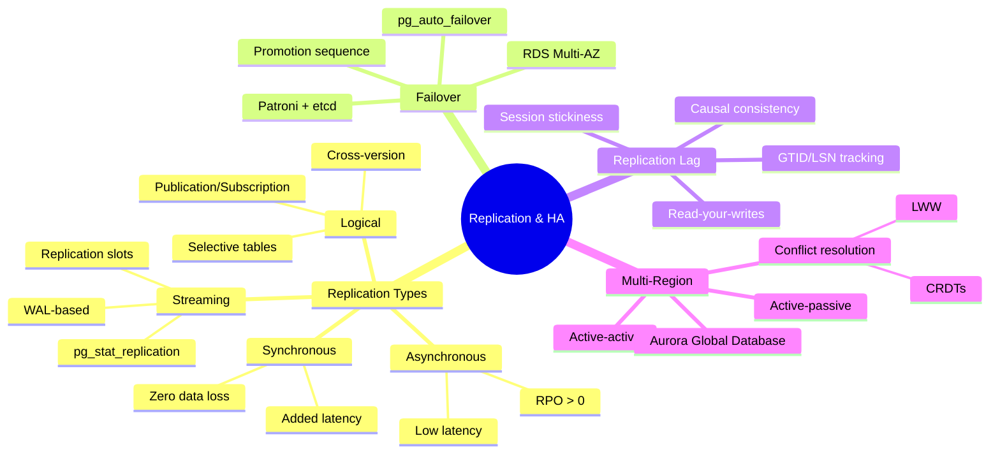
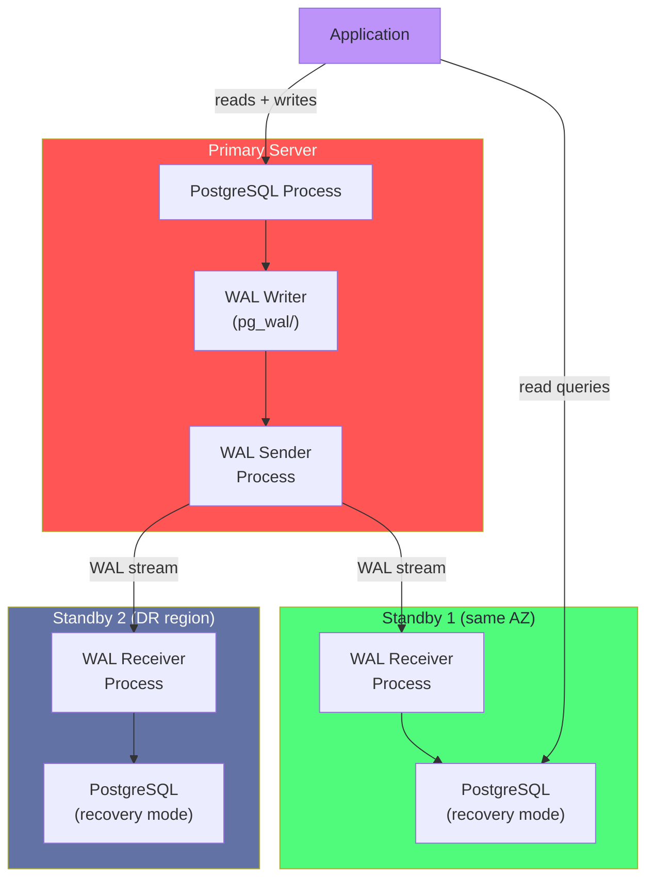
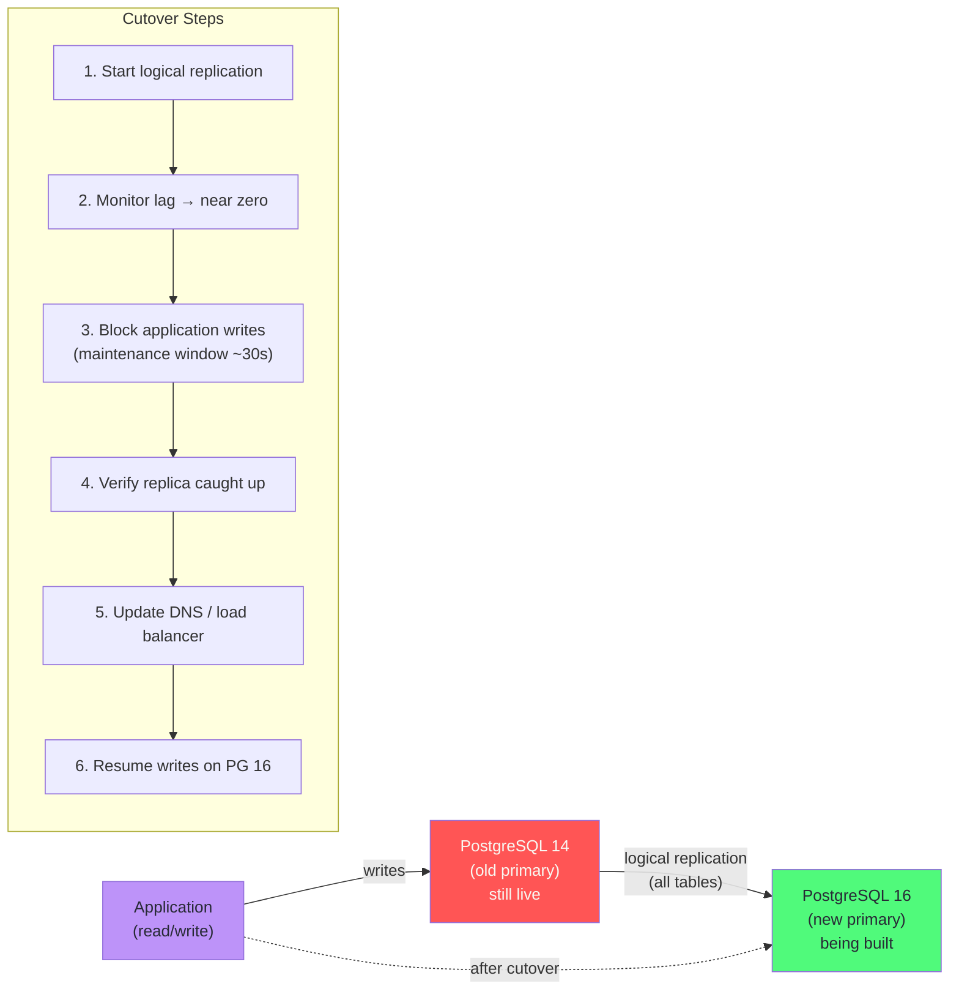
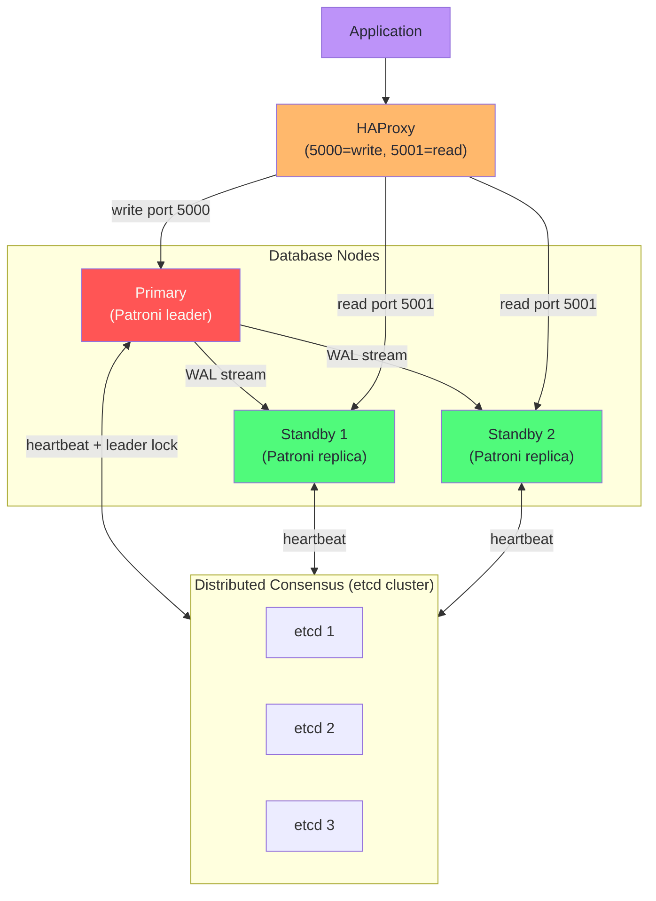
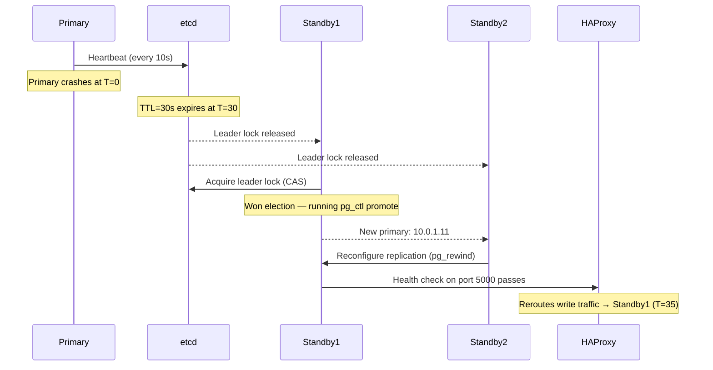
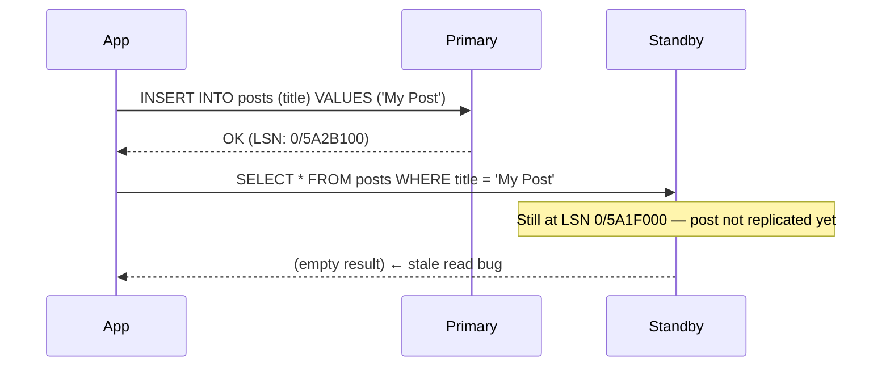
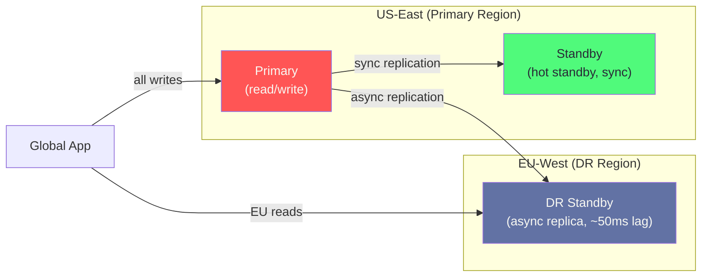
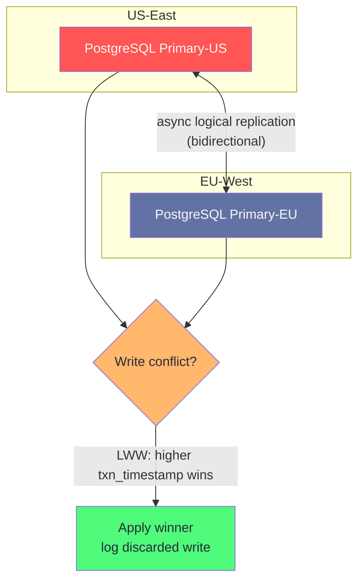
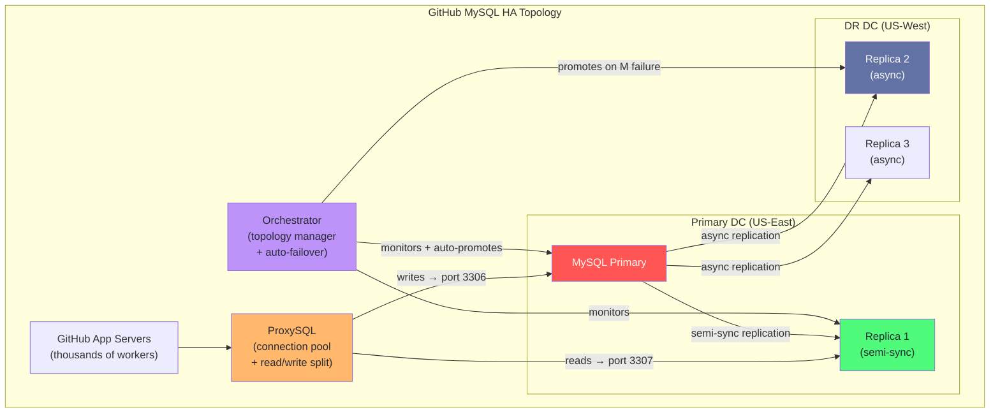

# Chapter 9: Replication & High Availability

> "High availability is not a feature you add. It is an architecture you commit to from day one."

## Mind Map



## Overview

Replication serves two purposes: durability (your data survives hardware failure) and availability (your database survives node failure without downtime). These are related but distinct goals, and the architecture decisions you make optimize for one or both.

A single PostgreSQL primary with no standby has RAID storage as its only durability guarantee. Add a synchronous standby and you gain zero-data-loss failover. Add an asynchronous standby in a second availability zone and you gain geographic redundancy. Add automated failover via Patroni and you gain sub-30-second recovery from any primary failure. Each addition has a cost — understand what you are paying for.

---

## Synchronous vs Asynchronous Replication

The fundamental trade-off is between data safety (RPO) and write latency.

| Property | Synchronous | Asynchronous |
|----------|-------------|-------------|
| **Data loss on primary failure** | Zero (RPO = 0) | Up to lag at failure time |
| **Write latency overhead** | RTT to standby | Near zero |
| **Standby failure impact** | Primary blocks (unless `ANY 1`) | None — primary continues |
| **Typical use case** | Financial transactions, ledgers | Read scaling, backups, disaster recovery |
| **PostgreSQL setting** | `synchronous_commit = on` | `synchronous_commit = local` (default) |

### Synchronous Commit in PostgreSQL

PostgreSQL's `synchronous_commit` has five levels:

```sql
-- Level 1: local only (default — async standby)
SET synchronous_commit = 'local';

-- Level 2: standby has received WAL (not yet applied)
SET synchronous_commit = 'remote_write';

-- Level 3: standby has flushed WAL to disk (safe from standby crash)
SET synchronous_commit = 'remote_apply';

-- Level 4: standby has applied change (visible on standby reads)
SET synchronous_commit = 'on';  -- requires synchronous_standby_names

-- Per-transaction override for critical writes
BEGIN;
SET LOCAL synchronous_commit = 'on';
INSERT INTO ledger_entries (account_id, amount, created_at)
VALUES (42, -500.00, now());
COMMIT;
```

```ini
# postgresql.conf — configure synchronous standby
synchronous_standby_names = 'FIRST 1 (standby1, standby2)'
# FIRST 1: wait for confirmation from at least 1 of the listed standbys
# ANY 1: wait for any 1 standby (regardless of order listed)
```

:::tip Use Per-Transaction Sync for Mixed Workloads
Rather than setting `synchronous_commit = on` globally (which adds latency to every write), override it per transaction for operations that truly require RPO = 0. User sessions, analytics writes, and background jobs can use asynchronous commits safely.
:::

:::warning Synchronous Standby Failure Blocks Writes
If `synchronous_standby_names` requires confirmation from a standby that goes down, the primary will block all commits. Always use `ANY 1 (standby1, standby2)` across two standbys so that losing one does not stop the primary.
:::

---

## Streaming Replication: Architecture & Setup

PostgreSQL streaming replication works by shipping WAL records from the primary to standbys in real time. Standbys replay these records to stay in sync — the same mechanism as crash recovery, applied continuously to a live remote server.



### Primary Configuration

```ini
# postgresql.conf (primary)
wal_level = replica           # minimum for streaming replication
max_wal_senders = 10          # max concurrent replication connections
wal_keep_size = 1024          # MB of WAL to retain for slow standbys
hot_standby = on              # allow read queries on standby

# For replication slots (prevents WAL removal until standby consumes)
max_replication_slots = 10
```

```sql
-- Allow standby to connect for replication (pg_hba.conf entry):
-- host  replication  replicator  10.0.1.0/24  scram-sha-256
CREATE ROLE replicator WITH REPLICATION LOGIN PASSWORD 'strongpassword';
```

### Standby Configuration

```ini
# postgresql.conf (standby)
hot_standby = on
hot_standby_feedback = on     # prevent primary vacuum from removing rows standby needs
```

```ini
# postgresql.auto.conf (standby) — created by pg_basebackup or set manually
primary_conninfo = 'host=10.0.1.10 port=5432 user=replicator password=strongpassword'
primary_slot_name = 'standby1_slot'
```

```bash
# Initial standby setup via base backup
pg_basebackup \
  --host=10.0.1.10 \
  --username=replicator \
  --pgdata=/var/lib/postgresql/data \
  --wal-method=stream \
  --checkpoint=fast \
  --progress

# Signal PostgreSQL this is a standby
touch /var/lib/postgresql/data/standby.signal
```

### Replication Slots

Replication slots prevent the primary from removing WAL segments that a standby has not yet consumed. Without slots, a slow or lagging standby can fall behind and lose its replication connection when the WAL it needs is recycled.

```sql
-- Create a physical replication slot
SELECT pg_create_physical_replication_slot('standby1_slot');

-- Monitor slot consumption
SELECT slot_name, active, restart_lsn,
       pg_size_pretty(pg_current_wal_lsn() - restart_lsn) AS lag_size
FROM pg_replication_slots;
```

:::warning Replication Slots Can Fill Your Disk
If a standby goes offline with a slot, the primary keeps all WAL since the slot's `restart_lsn`. This can fill `pg_wal/` and crash the primary. Monitor slot lag continuously. Drop slots for permanently offline standbys:
```sql
SELECT pg_drop_replication_slot('standby1_slot');
```
In PostgreSQL 13+, set `max_slot_wal_keep_size = '10GB'` to cap how much WAL a slot can retain.
:::

### Monitoring Replication Health

```sql
-- On primary: check all connected standbys
SELECT
    client_addr,
    state,           -- streaming / catchup / backup
    sent_lsn,
    write_lsn,
    flush_lsn,
    replay_lsn,
    pg_size_pretty(sent_lsn - replay_lsn) AS replication_lag,
    sync_state       -- async / sync / quorum
FROM pg_stat_replication;

-- On standby: check how far behind we are
SELECT
    now() - pg_last_xact_replay_timestamp() AS replication_delay,
    pg_is_in_recovery()                      AS is_standby,
    pg_last_wal_replay_lsn()                 AS applied_lsn;
```

---

## Logical Replication

Logical replication replicates individual rows and tables rather than raw WAL bytes. This enables:
- **Selective replication**: replicate only specific tables, not the whole database
- **Cross-version upgrades**: replicate from PostgreSQL 14 to PostgreSQL 16 while the old version stays live
- **Fan-out**: one primary to multiple heterogeneous subscribers
- **CDC pipelines**: tools like Debezium subscribe as logical replication clients

### Publication and Subscription

```sql
-- On the source (publisher)
-- Requires wal_level = logical in postgresql.conf

CREATE PUBLICATION orders_pub
    FOR TABLE orders, order_items, customers
    WITH (publish = 'insert, update, delete');

-- Publish all tables in a schema
CREATE PUBLICATION app_pub FOR TABLES IN SCHEMA app;
```

```sql
-- On the destination (subscriber)
CREATE SUBSCRIPTION orders_sub
    CONNECTION 'host=source-db port=5432 user=replicator dbname=app'
    PUBLICATION orders_pub;

-- Monitor subscription progress
SELECT subname, received_lsn, latest_end_lsn,
       pg_size_pretty(latest_end_lsn - received_lsn) AS lag
FROM pg_stat_subscription;
```

### Logical Replication for Zero-Downtime Major Version Upgrades



:::info Logical vs Physical Replication for Upgrades
`pg_upgrade` requires a brief outage and both versions on the same host. Logical replication enables a rolling upgrade: run the new version as a subscriber, let it catch up, then cut over in < 30 seconds. Logical replication does not replicate DDL automatically — schema changes must be applied to the subscriber manually before the data arrives.
:::

---

## Failover Automation

Manual failover is not high availability — it is recovery with a pager. True HA requires automated detection and promotion within seconds of a primary failure.

### Patroni: Production-Grade HA

Patroni is the industry-standard PostgreSQL HA solution. It uses a distributed consensus store (etcd, Consul, or ZooKeeper) as the arbiter for leader election, preventing split-brain scenarios where two nodes both believe they are primary.



```yaml
# patroni.yml — minimal configuration for pg-node-1
scope: postgres-cluster
name: pg-node-1

etcd3:
  hosts: etcd1:2379,etcd2:2379,etcd3:2379

bootstrap:
  dcs:
    ttl: 30                              # leader lock TTL in seconds
    loop_wait: 10                        # health check interval
    retry_timeout: 10
    maximum_lag_on_failover: 1048576     # refuse promotion if lagging > 1MB

  postgresql:
    parameters:
      wal_level: replica
      hot_standby: "on"
      max_wal_senders: 5
      max_replication_slots: 5
      wal_log_hints: "on"               # required for pg_rewind

postgresql:
  listen: 0.0.0.0:5432
  connect_address: 10.0.1.10:5432
  data_dir: /var/lib/postgresql/data
  authentication:
    replication:
      username: replicator
      password: strongpassword
    superuser:
      username: postgres
      password: adminpassword
```

### Automatic Failover Sequence

When Patroni detects the primary is unavailable (TTL expires without leader lock renewal):



Total elapsed: **20–40 seconds** with TTL=30, loop_wait=10.

### pg_auto_failover: Simpler Two-Node HA

For teams that do not need the full Patroni/etcd stack, `pg_auto_failover` provides a monitor-based failover for smaller deployments:

```sql
-- On monitor node (separate server)
SELECT pgautofailover.create_formation('default');
SELECT pgautofailover.create_group('default', 'pg-primary', 5432);

-- Add a standby
-- (run pg_autoctl create postgres on each data node)

-- Check health from monitor
SELECT * FROM pgautofailover.node;
-- Returns: state, health, lsn, candidate_priority
```

### AWS RDS Multi-AZ

Amazon RDS Multi-AZ maintains a **synchronous** physical standby in a separate AZ. Failover is automatic (60–120 seconds) and triggered by RDS monitoring. The endpoint DNS record is updated to point to the promoted standby — application code requires no changes, only the DNS TTL affects reconnection time.

| HA Solution | Failover Time | Split-Brain Safe | Managed | Cost |
|-------------|--------------|-----------------|---------|------|
| Patroni + etcd | 20–40s | Yes (consensus) | No | Server cost only |
| pg_auto_failover | 30–60s | Yes (monitor quorum) | No | Server cost only |
| RDS Multi-AZ | 60–120s | Yes (AWS-managed) | Yes | 2× instance cost |
| Aurora Multi-AZ | 30–60s | Yes | Yes | 3–5× vs RDS |

---

## Handling Replication Lag

Asynchronous standbys always have some lag. This creates a class of bugs where a write on the primary is not yet visible on a standby the application reads from.

### The Read-Your-Writes Problem



**Solution 1: Session stickiness** — route reads to primary for N seconds after a write:

```python
import time

WRITE_STICKY_SECONDS = 5

def get_db_connection(user_id: str, is_write: bool = False) -> Connection:
    if is_write:
        cache.set(f"wrote:{user_id}", "1", ex=WRITE_STICKY_SECONDS)
        return primary_pool.getconn()
    if cache.get(f"wrote:{user_id}"):
        return primary_pool.getconn()
    return replica_pool.getconn()
```

**Solution 2: LSN-based routing** — track the write LSN, only read from a caught-up standby:

```sql
-- After write, capture LSN and store in session/cookie
SELECT pg_current_wal_lsn()::text AS write_lsn;
-- Returns: '0/5A2B100'

-- On standby, check before serving the read
SELECT pg_last_wal_replay_lsn() >= $1::pg_lsn AS is_caught_up;
-- If false, route to primary instead
```

**Solution 3: Synchronous commit for that transaction** — use `remote_apply` so standby is guaranteed current before commit returns:

```sql
BEGIN;
SET LOCAL synchronous_commit = 'remote_apply';
INSERT INTO user_preferences (user_id, key, value)
VALUES (42, 'theme', 'dark');
COMMIT;
-- Now safe to immediately read from standby
```

### Lag Monitoring Runbook

```sql
-- Alert query: standbys with more than 100MB lag or 30s time lag
SELECT
    client_addr                                           AS standby_ip,
    pg_size_pretty(sent_lsn - replay_lsn)                AS byte_lag,
    extract(epoch FROM now() - reply_time)::int           AS seconds_since_heartbeat,
    sync_state
FROM pg_stat_replication
WHERE sent_lsn - replay_lsn > 104857600   -- 100MB
   OR extract(epoch FROM now() - reply_time) > 30;
```

---

## Multi-Region Replication

Single-region HA protects against node and AZ failures. Multi-region replication protects against full regional outages and enables lower read latency for global users.

### Active-Passive: Simple and Reliable



Active-passive is simple: one region accepts all writes, one or more regions host read replicas. On regional failure, you promote the DR standby and update DNS. The trade-off: all writes from EU users travel to US-East (adds 80–100ms round-trip latency per write).

### Active-Active: Write in Any Region

Active-active allows writes in multiple regions simultaneously. Write conflicts occur when two regions independently update the same row before replication completes.

| Conflict Strategy | How It Works | Best For |
|------------------|-------------|---------|
| **Last Write Wins (LWW)** | Higher timestamp survives; other write discarded | Counters, settings, idempotent updates |
| **CRDT data types** | Conflict-free by design (G-Counter, PN-Counter, LWW-Register) | Distributed counters, flags |
| **Geo-partitioned writes** | EU users' rows only written in EU; no cross-region conflicts | User-owned data sharded by region |
| **Application merge** | App reconciles conflicts with domain-specific logic | Collaborative editing, carts |



### Aurora Global Database

Amazon Aurora Global Database provides managed multi-region replication with:
- **< 1 second replication lag** from primary to secondary regions (uses dedicated replication infrastructure, not standard WAL streaming)
- **Managed failover** in under 1 minute to a secondary region
- **Up to 5 secondary regions**, each with up to 16 read replicas
- **Write forwarding**: secondary region can optionally forward writes to the primary, avoiding application-level routing changes

Aurora Global is the managed alternative to running BDR or Patroni across regions. The trade-offs are vendor lock-in and cost (Aurora is 3–5× the price of self-managed PostgreSQL on EC2).

---

## Case Study: GitHub's MySQL HA Architecture

GitHub serves over 100 million developers and processes millions of Git push/pull operations daily. Their MySQL HA architecture demonstrates production-grade failover at scale.

**Stack:** MySQL 8.0 + **Orchestrator** (topology management) + **ProxySQL** (connection routing) + **gh-ost** (online schema changes)



**Key metrics:**
- **Failover time:** < 30 seconds (detection ~9s + promotion + DNS update)
- **Replica scale:** 20–50 MySQL replicas per cluster at peak load
- **ProxySQL connection multiplexing:** reduces 10K application connections to ~200 real MySQL connections
- **Semi-synchronous replication:** primary waits for at least one replica to acknowledge WAL receipt before committing — provides near-zero data loss without full synchronous commit latency

**Orchestrator failover sequence:**
1. Detects primary unreachable (3 consecutive failed health checks, ~9 seconds)
2. Selects the best candidate replica (most up-to-date by binlog position, fewest seconds of lag)
3. Issues `STOP REPLICA` on all other replicas
4. Promotes candidate: `RESET REPLICA ALL` + begins accepting writes
5. Reconfigures all other replicas to follow new primary (`CHANGE REPLICATION SOURCE TO`)
6. Updates internal DNS CNAME via GitHub's service registry
7. ProxySQL backend configuration propagates within 1 second

**ProxySQL lag-aware routing:**
```sql
-- ProxySQL routes away from replicas lagging more than 2 seconds
-- configured in proxysql.cnf:
-- max_replication_lag = 2
-- Any replica reporting lag > 2s is temporarily removed from the read pool
```

**Lessons from GitHub's architecture:**
- Semi-synchronous replication (MySQL's equivalent of `synchronous_commit = remote_write`) provides 99%+ of synchronous safety at a fraction of the latency cost
- ProxySQL's connection multiplexing is essential — MySQL's thread-per-connection model cannot handle 10K simultaneous application connections without it
- Orchestrator's visual topology graph is the single most valuable debugging tool during incidents involving complex replication chains
- gh-ost performs online ALTER TABLE by creating a ghost copy and using triggers + binlog streaming, enabling schema changes on tables with billions of rows without locking

---

## Related Chapters

| Chapter | Relevance |
|---------|-----------|
| [Ch01 — Database Landscape](/database/part-1-foundations/ch01-database-landscape) | WAL mechanics that power streaming replication |
| [Ch10 — Sharding & Partitioning](/database/part-3-operations/ch10-sharding-partitioning) | When replication alone is not enough for write scaling |
| [Ch12 — Backup & Disaster Recovery](/database/part-3-operations/ch12-backup-migration-disaster-recovery) | RPO/RTO planning and PITR for complete DR strategy |
| [System Design Ch09 — SQL Databases](/system-design/part-2-building-blocks/ch09-databases-sql) | Replication and read replicas in system design interviews |

---

## Practice Questions

### Beginner

1. **Sync vs Async Trade-off:** A fintech startup processes bank transfers and cannot tolerate any data loss if their primary database server fails. Should they use synchronous or asynchronous replication? What is the latency cost, and how does `synchronous_standby_names = 'ANY 1 (standby1, standby2)'` improve resilience?

   <details>
   <summary>Model Answer</summary>
   Synchronous replication guarantees RPO = 0 — the primary waits for one standby to acknowledge before returning success to the client. The latency cost is one round-trip to the standby per commit (typically 1–5ms in the same DC, 50–100ms cross-region). ANY 1 with two standbys means losing one standby doesn't block the primary, but losing both does. For a fintech use case the data loss risk of async is unacceptable; sync with dual standbys is correct.
   </details>

2. **Replication Slot Risk:** A DBA creates a replication slot for a standby but the standby goes offline for three days during maintenance. The primary's disk fills up and crashes. Explain the failure chain and two ways it could have been prevented.

   <details>
   <summary>Model Answer</summary>
   The replication slot prevented PostgreSQL from recycling WAL files the standby had not yet consumed. After 3 days of writes, pg_wal/ grew until disk was exhausted and the primary crashed. Prevention options: (1) Monitor slot lag with an alert at 10GB — drop the slot when the standby is intentionally offline. (2) Set `max_slot_wal_keep_size = '20GB'` in PG 13+ — PostgreSQL will invalidate the slot (losing replication state) rather than filling the disk.
   </details>

### Intermediate

3. **Read-Your-Writes Bug:** A social media application routes all reads to a PostgreSQL standby. A user posts a new tweet and immediately refreshes their feed — the tweet doesn't appear for 2 seconds. Describe three solutions to this read-your-writes problem and the trade-offs of each.

   <details>
   <summary>Model Answer</summary>
   (1) Session stickiness: route to primary for N seconds after a write — simple but wastes primary capacity. (2) LSN tracking: record write LSN, check if standby has applied it before reading — precise but requires a coordination layer. (3) Synchronous commit for the write (`SET LOCAL synchronous_commit = 'remote_apply'`) — guarantees standby is current before commit returns but adds latency to every post operation. Option 2 is best for high-traffic sites; option 3 is best for low-frequency critical writes.
   </details>

4. **Patroni Cluster Design:** Design a Patroni cluster that: (a) survives primary failure without manual intervention, (b) survives losing one etcd node, (c) prevents split-brain, and (d) provides read replicas for analytics. How many PostgreSQL nodes and etcd nodes are required at minimum?

   <details>
   <summary>Model Answer</summary>
   Minimum: 3 etcd nodes (quorum = 2, can lose 1 without losing consensus), 1 primary + 2 standbys (need at least one standby to promote, and another to keep HA after promotion). Total: 6 servers minimum, or etcd can run co-located on the PostgreSQL nodes. Split-brain prevention is etcd's responsibility — the leader lock in etcd ensures only one Patroni agent holds the primary role at any time via compare-and-swap.
   </details>

### Advanced

5. **Multi-Region Write Latency:** A SaaS company serves customers in the US (60%) and Europe (40%). EU write latency is currently 180ms (US-East primary round-trip). Design an architecture that reduces EU write latency to < 20ms while maintaining consistency. What are the failure modes and conflict handling strategy?

   <details>
   <summary>Model Answer</summary>
   The cleanest solution is geo-partitioning: EU customers' data lives in an EU primary; US customers' data in a US primary. No cross-region writes are needed because each row is owned by exactly one region. On failure, each region falls over to a local standby. Conflicts don't exist because writes are partitioned. The complexity is routing — the application must know which region owns each customer's data (typically stored in a metadata table). For data that must be global (e.g., a shared product catalog), replicate it read-only to all regions with async replication + LWW conflict resolution for rare updates.
   </details>

---

## References & Further Reading

- [Patroni Documentation](https://patroni.readthedocs.io/) — PostgreSQL HA with etcd
- [PostgreSQL Documentation — Streaming Replication](https://www.postgresql.org/docs/current/warm-standby.html)
- [PostgreSQL Documentation — Logical Replication](https://www.postgresql.org/docs/current/logical-replication.html)
- [GitHub Engineering Blog — MySQL HA at GitHub](https://github.blog/engineering/infrastructure/mysql-high-availability-at-github/)
- [Orchestrator — MySQL Topology Manager](https://github.com/openark/orchestrator)
- [Aurora Global Database](https://docs.aws.amazon.com/AmazonRDS/latest/AuroraUserGuide/aurora-global-database.html)
- ["Designing Data-Intensive Applications"](https://dataintensive.net/) — Kleppmann, Chapter 5
- [ProxySQL — Connection Pooling and Read/Write Split](https://proxysql.com/documentation/)
