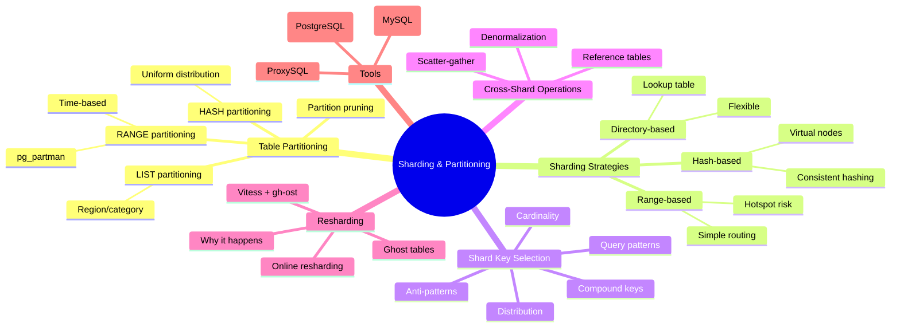
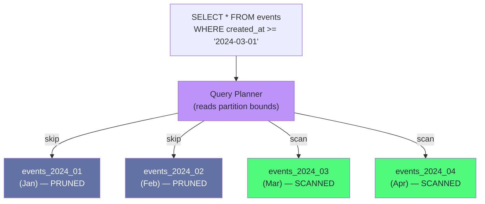
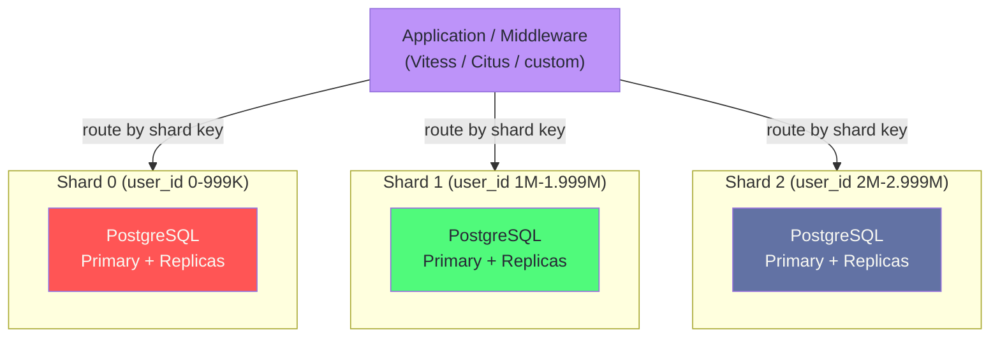
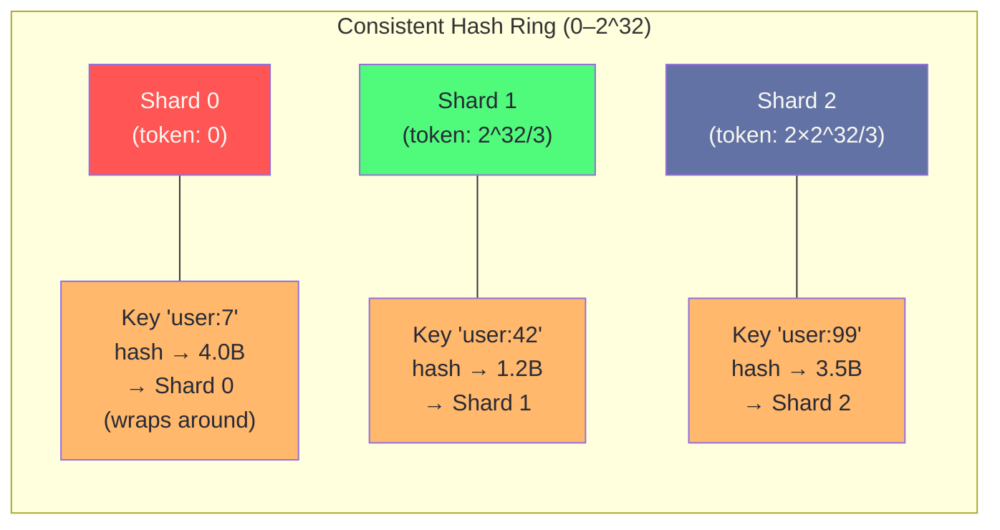
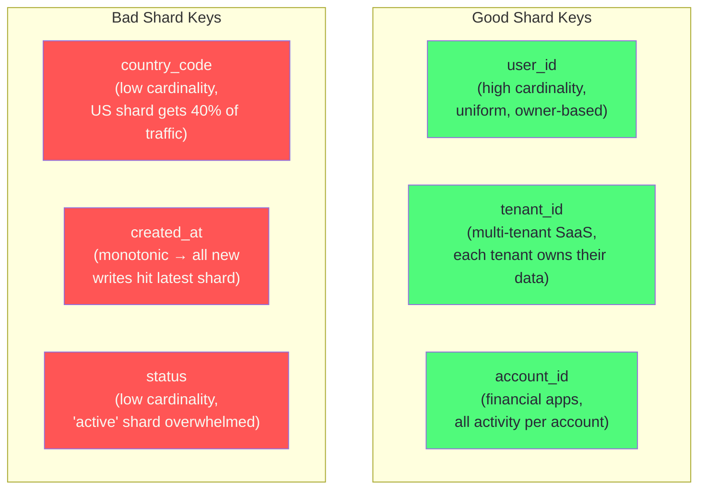
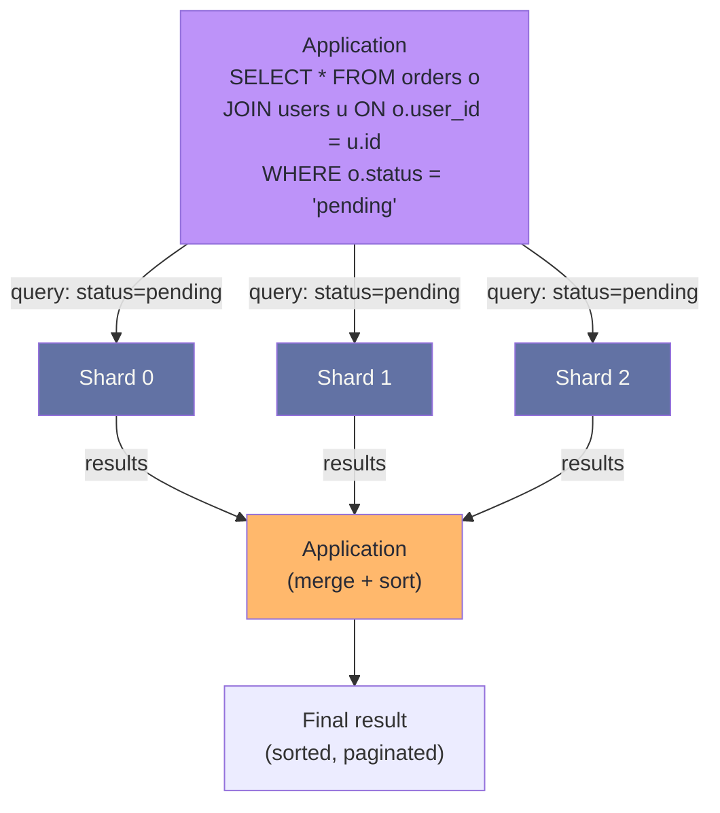
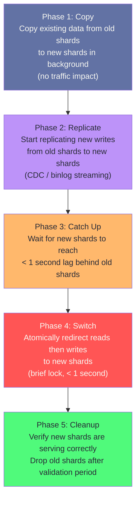
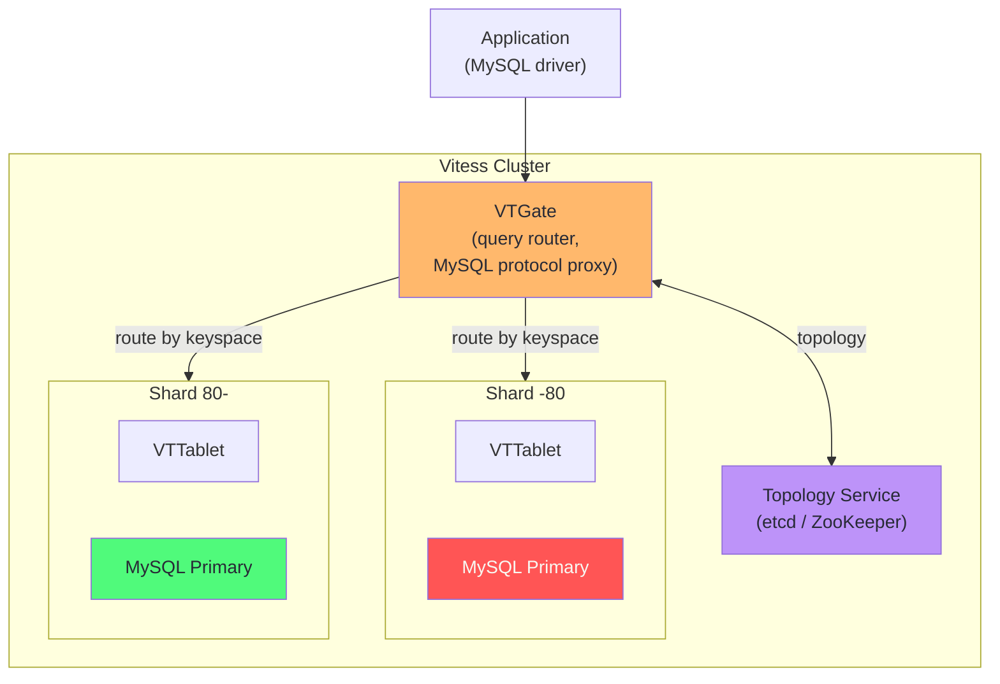
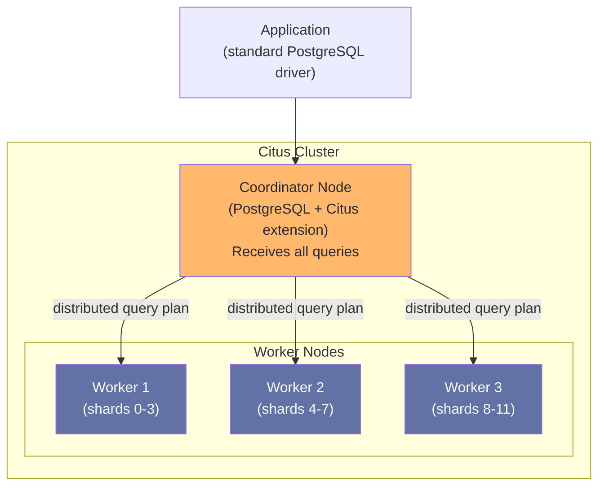

# Chapter 10: Sharding & Partitioning

> "Sharding is not a scaling strategy. It is a last resort after every other strategy has been exhausted."

## Mind Map



## Overview

Partitioning and sharding are related but distinct concepts. **Partitioning** divides a single large table into smaller physical segments within the same database server. **Sharding** distributes data across multiple independent database servers (shards), each owning a subset of the data. You should almost always try partitioning before sharding — it provides many of the same benefits (query pruning, partition-level vacuuming, parallel scans) without the operational complexity of a distributed system.

This chapter covers both, starting with PostgreSQL table partitioning and advancing to full cluster sharding with consistent hashing, shard key design, and the tools that make horizontal scaling possible.

---

## Table Partitioning in PostgreSQL

PostgreSQL supports declarative table partitioning since version 10. A partitioned table is a virtual table — the data lives in child tables (partitions) that the planner routes to automatically.

### RANGE Partitioning (Time-Based)

The most common partitioning pattern for time-series and append-heavy data:

```sql
-- Create the partitioned parent table
CREATE TABLE events (
    id          BIGSERIAL,
    user_id     BIGINT NOT NULL,
    event_type  TEXT NOT NULL,
    payload     JSONB,
    created_at  TIMESTAMPTZ NOT NULL DEFAULT now()
) PARTITION BY RANGE (created_at);

-- Create monthly partitions
CREATE TABLE events_2024_01 PARTITION OF events
    FOR VALUES FROM ('2024-01-01') TO ('2024-02-01');

CREATE TABLE events_2024_02 PARTITION OF events
    FOR VALUES FROM ('2024-02-01') TO ('2024-03-01');

-- Queries automatically route to the correct partition
EXPLAIN SELECT * FROM events WHERE created_at >= '2024-01-15';
-- Output: Seq Scan on events_2024_01 (partition pruning in action)

-- Old partitions can be detached and archived instead of DELETE
ALTER TABLE events DETACH PARTITION events_2024_01;
-- Now events_2024_01 is an independent table — attach to cold storage
```

### LIST Partitioning (Category/Region)

```sql
-- Partition by region for multi-tenant or geographic workloads
CREATE TABLE orders (
    id      BIGSERIAL,
    region  TEXT NOT NULL,  -- 'us', 'eu', 'apac'
    amount  NUMERIC(12, 2),
    created_at TIMESTAMPTZ DEFAULT now()
) PARTITION BY LIST (region);

CREATE TABLE orders_us   PARTITION OF orders FOR VALUES IN ('us');
CREATE TABLE orders_eu   PARTITION OF orders FOR VALUES IN ('eu');
CREATE TABLE orders_apac PARTITION OF orders FOR VALUES IN ('apac');
CREATE TABLE orders_rest PARTITION OF orders DEFAULT;  -- catch-all
```

### HASH Partitioning (Uniform Distribution)

When no natural range or list partition key exists, hash partitioning distributes rows uniformly:

```sql
-- Hash partition by user_id into 8 buckets
CREATE TABLE user_activity (
    id      BIGSERIAL,
    user_id BIGINT NOT NULL,
    action  TEXT,
    ts      TIMESTAMPTZ DEFAULT now()
) PARTITION BY HASH (user_id);

CREATE TABLE user_activity_0 PARTITION OF user_activity
    FOR VALUES WITH (MODULUS 8, REMAINDER 0);
CREATE TABLE user_activity_1 PARTITION OF user_activity
    FOR VALUES WITH (MODULUS 8, REMAINDER 1);
-- ... repeat for 2-7
```

### Partition Pruning

Partition pruning is the key performance benefit: the planner scans only relevant partitions. For this to work, the WHERE clause must reference the partition key.

```sql
-- Pruning works: planner only scans 2024-01 partition
SELECT count(*) FROM events WHERE created_at BETWEEN '2024-01-01' AND '2024-01-31';

-- Pruning does NOT work: full scan across all partitions
SELECT count(*) FROM events WHERE user_id = 42;
-- If you frequently query by user_id, partition by user_id instead (or add a regular index)
```



### Automating Partitions with pg_partman

Manually creating monthly partitions is error-prone. `pg_partman` automates creation and retention:

```sql
-- Install pg_partman extension
CREATE EXTENSION pg_partman;

-- Set up automated monthly partitions, retain 12 months
SELECT partman.create_parent(
    p_parent_table   => 'public.events',
    p_control        => 'created_at',
    p_interval       => 'monthly',
    p_premake        => 3           -- pre-create 3 future partitions
);

-- Schedule maintenance (run via pg_cron or external cron)
SELECT partman.run_maintenance();
-- Creates new future partitions, drops/detaches old ones per retention policy

-- Configure retention
UPDATE partman.part_config
SET retention = '12 months',
    retention_keep_table = false   -- drop old partitions automatically
WHERE parent_table = 'public.events';
```

:::tip Partition Before You Shard
Before moving to multi-server sharding, try: (1) RANGE partitioning to enable efficient time-based pruning and archival, (2) adding read replicas to offload analytics queries, (3) upgrading to a larger server. Partitioning is free in terms of query transparency — the same SQL works, partition pruning happens automatically.
:::

---

## Sharding: Distributing Data Across Servers

Sharding splits data across multiple independent database servers. Each server (shard) owns a disjoint subset of the data and handles only queries for its subset. The application (or middleware) must route queries to the correct shard.



### Hash-Based Sharding

The most common sharding strategy. A hash function maps the shard key to a shard number:

```
shard = hash(user_id) % num_shards
```

**Problem with naive modulo:** Adding a new shard invalidates all existing assignments — `hash(key) % 8` routes differently than `hash(key) % 9`. You must migrate all data.

### Consistent Hashing

Consistent hashing solves the resharding problem. Keys and shards are placed on a circular ring. A key maps to the first shard clockwise on the ring. Adding or removing a shard only displaces a fraction of keys.



### Virtual Nodes (vnodes)

With only 3 physical shards on the ring, adding a 4th shard requires moving ~33% of data (the arc between shard 3 and its neighbor). Virtual nodes distribute each physical shard across many positions on the ring, making data movement more granular and balanced:

```
Physical Shard 0 → vnodes at positions: 5, 18, 31, 47, 62, ... (100 positions)
Physical Shard 1 → vnodes at positions: 2, 12, 25, 39, 55, ... (100 positions)
```

Adding a physical shard means taking a few vnodes from each existing shard — small, balanced movements across all shards.

### Range-Based Sharding

```
Shard 0: user_id 1 – 1,000,000
Shard 1: user_id 1,000,001 – 2,000,000
Shard 2: user_id 2,000,001 – 3,000,000
```

**Pros:** Simple routing logic, range queries on the shard key stay on one shard.

**Cons:** Prone to hotspots — if user_id is sequential and new users are always on the last shard, that shard receives all new writes (hot shard problem). Requires more careful shard key selection.

### Directory-Based Sharding

A lookup table maps each key (or key range) to a specific shard:

```sql
-- Shard directory (lives in a highly available metadata service)
CREATE TABLE shard_directory (
    entity_type TEXT,
    entity_id   BIGINT,
    shard_id    INT,
    PRIMARY KEY (entity_type, entity_id)
);

-- Route: SELECT shard_id FROM shard_directory WHERE entity_type='user' AND entity_id=42;
```

**Pros:** Maximum flexibility — can move individual keys between shards without any formula change.

**Cons:** Every query requires a directory lookup (often cached in memory). The directory itself is a single point of failure and must be highly available.

---

## Choosing a Shard Key

The shard key decision determines the performance characteristics of your sharding cluster. A bad shard key creates hot shards, forces expensive cross-shard queries, and makes resharding difficult.

### Shard Key Properties

| Property | Requirement | Failure Mode if Missing |
|----------|-------------|------------------------|
| **High cardinality** | Many distinct values | Too few values → can't split evenly |
| **Uniform distribution** | Values spread evenly over the key space | Hot shard receives disproportionate traffic |
| **Query alignment** | Most queries filter by the shard key | Cross-shard scatter-gather queries |
| **Immutability** | Value doesn't change after insertion | Changing shard key requires moving the row |
| **Business meaning** | Key maps to a logical data owner | Arbitrary keys break cross-entity queries |

### Good vs Bad Shard Keys



### Compound Shard Keys

When a single key produces hotspots, compound keys can help:

```
Shard key: (tenant_id, user_id)
→ All queries for a user stay on one shard
→ Queries across tenants span multiple shards (acceptable)
→ A single tenant with millions of users can still overwhelm one shard
```

For a large multi-tenant SaaS, large tenants may need their own dedicated shards (tenant isolation), while small tenants share shards.

---

## Cross-Shard Queries and Joins

Cross-shard queries are the primary operational cost of sharding. JOINs between two sharded tables require a scatter-gather pattern: query all shards, collect results, merge in the application layer.

### Scatter-Gather



**Scatter-gather cost:** latency is `max(shard_latency)` + merge time. With 100 shards, the tail latency of the slowest shard dominates. Scatter-gather queries do not scale well — minimize them.

### Avoiding Cross-Shard Joins: Denormalization

Instead of joining `orders` with `users` across shards, embed the user data you need into the `orders` table:

```sql
-- Before denormalization (requires cross-shard JOIN)
CREATE TABLE orders (
    id       BIGSERIAL PRIMARY KEY,
    user_id  BIGINT NOT NULL,  -- references users table on another shard
    amount   NUMERIC(12, 2)
);

-- After denormalization (self-contained)
CREATE TABLE orders (
    id          BIGSERIAL PRIMARY KEY,
    user_id     BIGINT NOT NULL,
    user_email  TEXT NOT NULL,   -- denormalized from users
    user_name   TEXT NOT NULL,   -- denormalized from users
    amount      NUMERIC(12, 2)
);
-- Tradeoff: email/name updates must be propagated via CDC or background job
```

### Reference Tables

For small, frequently-joined lookup tables (countries, categories, currencies), replicate the entire table to every shard:

```sql
-- In Citus: reference tables are replicated to all workers
SELECT create_reference_table('countries');
SELECT create_reference_table('product_categories');

-- Now JOINs between sharded orders and reference countries work without scatter-gather
SELECT o.amount, c.name AS country
FROM orders o
JOIN countries c ON o.country_code = c.code
WHERE o.user_id = 42;  -- routed to single shard, countries available locally
```

---

## Resharding: Splitting and Migrating Shards

You will eventually need more shards than you started with. Resharding moves data between shards while the application continues serving traffic.

### Why Resharding Happens

- Shard capacity exceeded (disk, CPU, or connection count)
- Shard key chosen poorly — one shard is a hotspot
- Business growth requiring geographic distribution
- Shard failure requiring emergency data redistribution

### Online Resharding with Vitess

Vitess implements online resharding via a multi-phase process that keeps the old shards live while building new ones:



The key technique is **ghost tables**: Vitess creates the new shard tables alongside the old ones, copies data in the background, and uses binlog replication to keep them in sync — the same pattern as gh-ost for online schema changes.

---

## Sharding Tools Comparison

| Tool | Target DB | Sharding Model | Cross-Shard Queries | Managed Version |
|------|-----------|---------------|--------------------|-|
| **Vitess** | MySQL | Hash / range | Scatter-gather + merge | PlanetScale |
| **Citus** | PostgreSQL | Hash / range / reference tables | Distributed SQL | Azure Cosmos DB for PostgreSQL |
| **ProxySQL** | MySQL | Application-defined routing rules | None (routing only) | None |
| **Crunchy Postgres** | PostgreSQL | Per-tenant isolation | Federated queries | Crunchy Bridge |

### Vitess Architecture



### Citus Architecture



```sql
-- Citus setup: distribute orders by user_id
SELECT create_distributed_table('orders', 'user_id');
SELECT create_distributed_table('order_items', 'user_id', colocate_with => 'orders');
-- Citus collocates order_items with orders on the same shard
-- → JOINs on user_id are local, no scatter-gather

-- Distributed query — Citus handles routing transparently
SELECT user_id, count(*), sum(amount)
FROM orders
GROUP BY user_id
ORDER BY sum(amount) DESC
LIMIT 10;
```

---

## Case Study: Pinterest's Sharding Architecture

Pinterest scaled to billions of pins and hundreds of billions of relationships, making sharding unavoidable. Their architecture is a textbook example of practical sharding design.

**Problem:** By 2012, Pinterest had outgrown a single MySQL server. Simple master-slave replication helped with reads but writes were hitting the ceiling.

**Approach:** Manual range-based sharding across 8 MySQL servers, later expanded to 1,024 virtual shards (logical shards mapped to physical servers).

**Shard ID embedded in object IDs:**

Pinterest encodes the shard ID directly in every object's ID using a 64-bit integer format:

```
64-bit Pinterest ID:
┌─────────────────┬────────┬──────┬────────┐
│  Timestamp (ms) │ Shard  │ Type │ Local  │
│  (41 bits)      │ (10 b) │ (0b) │ (13 b) │
└─────────────────┴────────┴──────┴────────┘

Example:
ID = 1234567890123456789
Shard  = (ID >> 13) & 0x3FF    → shard 42
Type   = (ID >> 3)  & 0x1F     → type 1 (pin)
```

This design means **every object carries its shard location** — no directory lookup required. The routing function is a pure bit manipulation on the ID, O(1) with no database access.

**Cross-shard social graph:**
```
Pin follows (user A → pin B):
  - user A is on shard 12
  - pin B is on shard 87
  → Store the relationship record on shard 12 (user A's shard)
  → Query: "all pins user A follows" → single-shard query on shard 12
  → Query: "all users following pin B" → stored on each user's shard (fan-out)
```

**Key decisions:**
- 1,024 virtual shards mapped to 8 physical servers — adding a server means moving 128 virtual shards, not resharding at the key level
- Shard ID in object ID eliminates directory lookups entirely
- Social graph edges stored on the entity's own shard for read locality
- MySQL chosen for familiar ACID semantics; sharding added as a layer above

**Scale achieved:** 200+ billion pins, 40+ petabytes of data, hundreds of millions of monthly active users — all on this sharded MySQL architecture as of Pinterest's 2013 engineering blog post.

---

## Related Chapters

| Chapter | Relevance |
|---------|-----------|
| [Ch09 — Replication & HA](/database/part-3-operations/ch09-replication-high-availability) | Each shard needs its own replication setup |
| [Ch11 — Query Optimization](/database/part-3-operations/ch11-query-optimization-performance) | Cross-shard query performance and EXPLAIN |
| [Ch02 — Data Modeling for Scale](/database/part-1-foundations/ch02-data-modeling-for-scale) | Schema design that avoids cross-shard joins |
| [System Design Ch10 — NoSQL Databases](/system-design/part-2-building-blocks/ch10-databases-nosql) | Consistent hashing and sharding in distributed systems |

---

## Practice Questions

### Beginner

1. **Partitioning Basics:** An e-commerce database has an `orders` table with 500 million rows. 90% of queries filter by `created_at` within the last 30 days. The DBA wants to archive and delete data older than 2 years. How should they partition this table, and what SQL would they use to delete all orders from 2021?

   <details>
   <summary>Model Answer</summary>
   RANGE partition by created_at with monthly or yearly partitions. To "delete" 2021 data without a slow DELETE: `ALTER TABLE orders DETACH PARTITION orders_2021;` — this is instantaneous because it only removes the partition from the parent table's catalog, not the data. Then `DROP TABLE orders_2021;` or move it to cold storage.
   </details>

2. **Hot Shard Problem:** A sharded user database uses `created_at` as the shard key. After launch, nearly all new user registrations go to shard 3 (the most recent shard). The DBA observes shard 3 at 95% CPU while shards 0–2 are idle. Explain why this happened and what shard key would have prevented it.

   <details>
   <summary>Model Answer</summary>
   created_at is monotonically increasing — all new users land on the most recent shard range. `user_id` (with consistent hashing) would distribute uniformly because the hash function maps sequential IDs to different positions on the ring. Alternatively, hash(user_id) % num_shards distributes new users evenly regardless of their sequential ID.
   </details>

### Intermediate

3. **Shard Key Design:** A multi-tenant SaaS application stores `users`, `projects`, and `tasks` tables. The application's most common queries are:
   - All projects for a user
   - All tasks for a project
   - All tasks assigned to a user

   Design a sharding strategy that keeps the most common queries on a single shard. What trade-offs does your choice make?

   <details>
   <summary>Model Answer</summary>
   Shard key: `user_id` for users and tasks, `owner_user_id` for projects (the user who created the project). Collocate `projects` and `tasks` with their owning user on the same shard. This makes "all projects for a user" and "all tasks for a user" single-shard queries. The trade-off: "all tasks for a project" requires knowing the project's owner_user_id first (or doing a cross-shard lookup for tasks not owned by the current user). For Citus, use `colocate_with` to ensure related tables land on the same shard.
   </details>

4. **Online Resharding:** A Pinterest-style application is running 8 MySQL shards and needs to expand to 16 shards without downtime. Describe the Vitess online resharding process step by step. What is the maximum acceptable downtime during the cutover phase?

   <details>
   <summary>Model Answer</summary>
   Vitess steps: (1) Create 8 new shards alongside existing 8. (2) Copy all data from old shards to new shards in background (no traffic impact, takes hours for large datasets). (3) Start replicating new writes from old to new shards via binlog streaming. (4) Wait until new shards are < 1 second behind. (5) VTGate atomically switches reads then writes to new shards (~1 second of write blocking). (6) Verify and clean up old shards. Maximum downtime: < 5 seconds in practice for the write cutover. The data copy phase has zero downtime.
   </details>

### Advanced

5. **Cross-Shard Social Graph:** Design a sharding strategy for a Twitter-like follow graph with 500 million users and 50 billion follow relationships. The two critical read paths are: (a) "who does user X follow" and (b) "who follows user X" (followers). How do you avoid scatter-gather for both paths? What is the write cost of this design?

   <details>
   <summary>Model Answer</summary>
   Use the "double write" or "fan-out" pattern: store each follow relationship twice — once on the follower's shard (for "who does X follow") and once on the followee's shard (for "who follows X"). This doubles storage and makes writes more expensive (two shards must be written per follow), but both reads are single-shard. For users with 50M+ followers (celebrities), fan-out-on-write to all followers' shards on each tweet is impractical — switch to fan-out-on-read for these accounts (computed at read time). This is exactly Twitter's architecture: regular users get push-model feed, celebrities get pull-model feed.
   </details>

---

## References & Further Reading

- [Vitess Documentation — Resharding](https://vitess.io/docs/user-guides/configuration-advanced/resharding/)
- [Citus Documentation — Distributing Tables](https://docs.citusdata.com/en/stable/sharding/data_modeling.html)
- [PostgreSQL Documentation — Table Partitioning](https://www.postgresql.org/docs/current/ddl-partitioning.html)
- [pg_partman — Partition Management Extension](https://github.com/pgpartman/pg_partman)
- [Pinterest Engineering — Sharding Pinterest](https://medium.com/pinterest-engineering/sharding-pinterest-how-we-scaled-our-mysql-fleet-3f54d420e89f)
- [Consistent Hashing and Random Trees — Karger et al.](https://dl.acm.org/doi/10.1145/258533.258660)
- ["Designing Data-Intensive Applications"](https://dataintensive.net/) — Kleppmann, Chapter 6 (Partitioning)
- [ProxySQL — Query Rules for Sharding](https://proxysql.com/documentation/proxysql-query-rules/)
