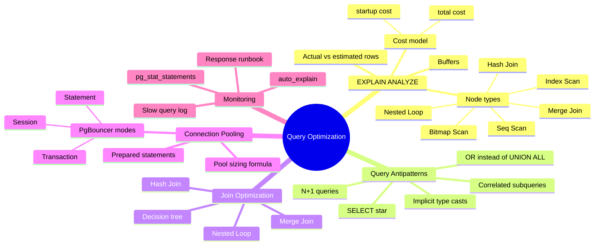
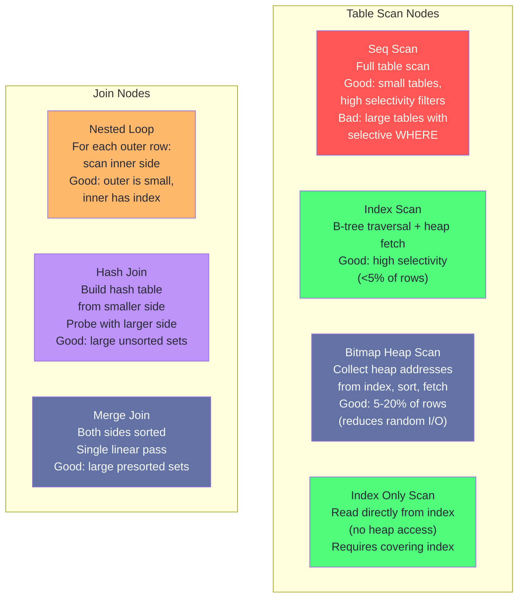
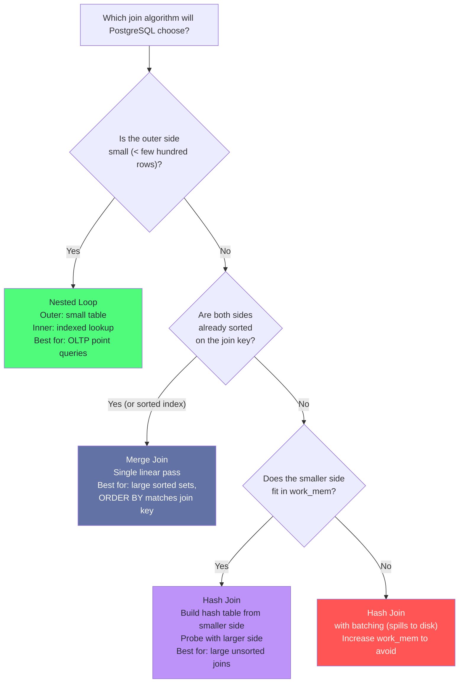
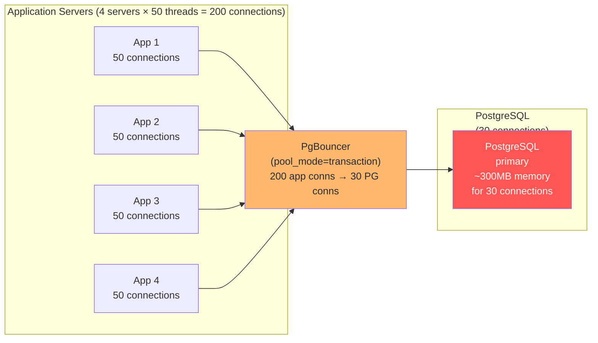
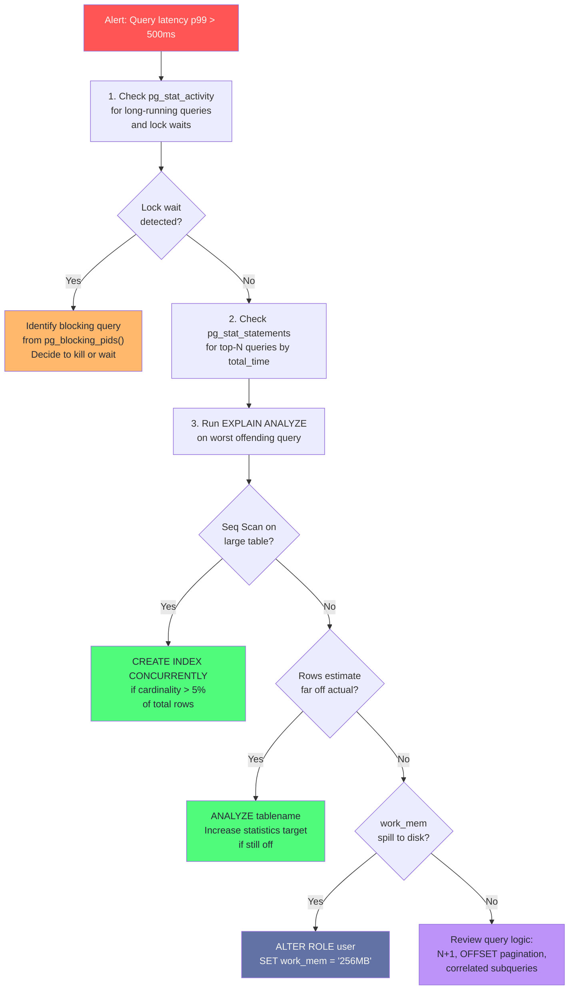

# Chapter 11: Query Optimization & Performance

> "The query plan is not what you asked for. It is what the database decided to do. Understanding that distinction is the entire job."

## Mind Map



:::info Prerequisites
This chapter assumes understanding of B-tree indexes and EXPLAIN basics ([Ch03](/database/part-1-foundations/ch03-indexing-strategies)) and PostgreSQL internals ([Ch05](/database/part-2-engines/ch05-postgresql-in-production)). Review those first if needed.
:::

## Overview

Most database performance problems are not hardware problems. They are query problems — queries that scan millions of rows to return one, JOINs that create intermediate result sets larger than memory, index choices that send the planner in the wrong direction. This chapter gives you the tools to find and fix these problems systematically.

The mental model for query optimization is: **understand what the database actually does, not what you think it should do**. `EXPLAIN ANALYZE` is the authoritative source. Everything else is hypothesis.

---

## EXPLAIN ANALYZE Masterclass

`EXPLAIN` shows the query plan the planner *would* execute. `EXPLAIN ANALYZE` actually executes the query and shows both the planned cost estimates and the actual runtime measurements. Always use `EXPLAIN (ANALYZE, BUFFERS, FORMAT TEXT)` for diagnostics.

### Basic Syntax

```sql
-- Read-only investigation (wraps in transaction and rolls back)
EXPLAIN (ANALYZE, BUFFERS, FORMAT TEXT)
SELECT u.name, count(o.id) AS order_count
FROM users u
LEFT JOIN orders o ON o.user_id = u.id
WHERE u.created_at > '2024-01-01'
GROUP BY u.id, u.name
ORDER BY order_count DESC
LIMIT 10;
```

### Reading the Output

```
Sort  (cost=1284.52..1284.54 rows=10 width=40) (actual time=45.231..45.234 rows=10 loops=1)
  Sort Key: (count(o.id)) DESC
  Sort Method: top-N heapsort  Memory: 25kB
  Buffers: shared hit=892 read=438
  ->  HashAggregate  (cost=1283.10..1284.20 rows=110 width=40) (actual time=44.891..45.102 rows=847 loops=1)
        Group Key: u.id, u.name
        Batches: 1  Memory Usage: 193kB
        ->  Hash Left Join  (cost=412.50..1258.50 rows=4920 width=36) (actual time=8.142..42.113 rows=51230 loops=1)
              Hash Cond: (o.user_id = u.id)
              Buffers: shared hit=892 read=438
              ->  Seq Scan on orders o  (cost=0.00..722.00 rows=42000 width=8) (actual time=0.014..12.445 rows=42000 loops=1)
                    Buffers: shared hit=522
              ->  Hash  (cost=380.00..380.00 rows=2600 width=36) (actual time=7.891..7.892 rows=2600 loops=1)
                    Buckets: 4096  Batches: 1  Memory Usage: 194kB
                    Buffers: shared hit=370 read=438
                    ->  Index Scan using idx_users_created_at on users u  (cost=0.28..380.00 rows=2600 width=36) (actual time=0.033..7.201 rows=2600 loops=1)
                          Index Cond: (created_at > '2024-01-01')
                          Buffers: shared hit=370 read=438
Planning Time: 0.892 ms
Execution Time: 45.521 ms
```

**Reading cost notation:** `(cost=startup..total rows=N width=W)`
- `startup cost`: cost before returning the first row (relevant for ORDER BY, sort nodes)
- `total cost`: estimated cost to return all rows (arbitrary units — not milliseconds)
- `rows`: estimated row count (compare to `actual rows` for planner accuracy)
- `width`: estimated average row width in bytes

**Key indicators of problems:**

| Signal | What It Means |
|--------|--------------|
| `actual rows` >> `rows` | Planner underestimated rows — statistics stale, run `ANALYZE` |
| `actual rows` << `rows` | Planner overestimated — may choose wrong join strategy |
| `Seq Scan` on large table | Missing index, or planner chose sequential scan (check why) |
| `loops=N` on inner side of Nested Loop | Inner query runs N times — classic N+1 query pattern |
| `Batches: N` on Hash Join/Agg | Hash table spilled to disk — increase `work_mem` |
| `shared read=N` (high) | Data not in cache — I/O bound query |
| `shared hit=N` (high) | Data served from shared_buffers — fast path |

### EXPLAIN Node Types



:::info Version Note
PostgreSQL examples verified against PostgreSQL 16/17. Autovacuum defaults and some `pg_stat_*` views changed in PostgreSQL 17 — check the [release notes](https://www.postgresql.org/docs/17/release-17.html) for your version.
:::

---

## Worked Example: Optimizing a 3-Table JOIN from 2s to 5ms

A reporting query in a SaaS application is timing out at 2 seconds. Let's trace the optimization step by step.

### The Slow Query

```sql
-- Slow query: 3-table JOIN with 2s execution time
SELECT
    u.email,
    p.name          AS project_name,
    count(t.id)     AS task_count,
    max(t.updated_at) AS last_activity
FROM tasks t
JOIN projects p ON p.id = t.project_id
JOIN users u    ON u.id = p.owner_id
WHERE t.status = 'open'
  AND t.created_at > now() - interval '30 days'
GROUP BY u.email, p.name
ORDER BY last_activity DESC
LIMIT 50;
```

### Step 1: Run EXPLAIN ANALYZE

```
Sort  (cost=89234.51..89234.64 rows=50 width=88) (actual time=2041.234..2041.238 rows=50 loops=1)
  ->  HashAggregate  (cost=89140.00..89233.50 rows=50 width=88) (actual time=2038.102..2040.891 rows=12483 loops=1)
        ->  Hash Join  (cost=1842.00..88200.00 rows=184000 width=56) (actual time=18.402..1998.331 rows=184312 loops=1)
              Hash Cond: (t.project_id = p.id)
              ->  Seq Scan on tasks t  (cost=0.00..84000.00 rows=184000 width=20) (actual time=0.041..1831.234 rows=184312 loops=1)
                    Filter: ((status = 'open') AND (created_at > (now() - '30 days'::interval)))
                    Rows Removed by Filter: 3815688
              ->  Hash  (cost=1640.00..1640.00 rows=16160 width=44) (actual time=17.891..17.893 rows=16160 loops=1)
                    ->  Hash Join  (cost=620.00..1640.00 rows=16160 width=44) ...
                          ->  Seq Scan on projects p  ...
                          ->  Hash  ...  (Seq Scan on users u)
Execution Time: 2041.671 ms
```

**Diagnosis:**
- `Seq Scan on tasks t` scans 4 million rows, filters down to 184K — bad selectivity on a full table scan
- `Rows Removed by Filter: 3,815,688` — we're scanning 96% of the table to get 4%
- No index on `tasks(status, created_at)` — the planner has no choice but to scan everything

### Step 2: Add Missing Index

```sql
-- Composite index on the filter columns
CREATE INDEX CONCURRENTLY idx_tasks_status_created
    ON tasks (status, created_at DESC)
    WHERE status = 'open';  -- partial index: only index open tasks

-- Also index the JOIN column
CREATE INDEX CONCURRENTLY idx_tasks_project_id ON tasks (project_id);
```

### Step 3: Verify the New Plan

```sql
EXPLAIN (ANALYZE, BUFFERS)
SELECT u.email, p.name, count(t.id), max(t.updated_at)
FROM tasks t
JOIN projects p ON p.id = t.project_id
JOIN users u    ON u.id = p.owner_id
WHERE t.status = 'open'
  AND t.created_at > now() - interval '30 days'
GROUP BY u.email, p.name
ORDER BY max(t.updated_at) DESC
LIMIT 50;
```

```
Sort  (cost=842.51..842.64 rows=50 width=88) (actual time=4.891..4.894 rows=50 loops=1)
  ->  HashAggregate  (cost=839.00..841.50 rows=50 width=88) (actual time=4.812..4.873 rows=50 loops=1)
        ->  Hash Join  (cost=420.00..812.00 rows=5440 width=56) (actual time=2.012..4.231 rows=5440 loops=1)
              Hash Cond: (t.project_id = p.id)
              ->  Bitmap Heap Scan on tasks t  (cost=84.00..422.00 rows=5440 width=20) (actual time=0.341..1.891 rows=5440 loops=1)
                    Recheck Cond: ((status = 'open') AND (created_at > ...))
                    ->  Bitmap Index Scan on idx_tasks_status_created  (cost=0.00..82.64 rows=5440 width=0) (actual time=0.298..0.299 rows=5440 loops=1)
              ->  Hash  (cost=280.00..280.00 rows=12160 width=44) ...
Execution Time: 5.234 ms
```

**Result:** 2041ms → 5ms. The partial index reduced the scan from 4M rows to 5,440 rows — the exact rows matching `status = 'open'` in the last 30 days.

### Step 4: Update Table Statistics if Needed

```sql
-- If EXPLAIN shows rows estimates are wildly off, statistics may be stale
ANALYZE tasks;  -- updates pg_statistic for the tasks table

-- For columns with high correlation or unusual distribution, increase statistics target
ALTER TABLE tasks ALTER COLUMN status SET STATISTICS 500;
ANALYZE tasks;
```

---

## Common Query Antipatterns

| Antipattern | Problem | Fix |
|-------------|---------|-----|
| **N+1 queries** | 1 query to get list + N queries for each row's details | JOIN or `IN (...)` batch load |
| **SELECT \*** | Fetches unused columns; breaks covering indexes | Explicit column list |
| **Implicit type cast** | `WHERE user_id = '42'` (integer vs text) — index unusable | Match types exactly |
| **OR with different columns** | `WHERE status='open' OR priority='high'` — can't use either index | `UNION ALL` of two indexed queries |
| **Correlated subquery in SELECT** | Runs subquery once per output row | LEFT JOIN or lateral join |
| **OFFSET pagination** | `OFFSET 10000` scans and discards 10K rows | Keyset pagination (cursor-based) |
| **COUNT(\*)  with no filter** | Full table scan for live row count | Estimate from `pg_class.reltuples` |
| **Functions on indexed columns** | `WHERE lower(email) = ...` bypasses index | Expression index: `CREATE INDEX ON users (lower(email))` |

### N+1: Before and After

```sql
-- BEFORE: N+1 pattern (1 query + N queries)
-- Application code (Python pseudo):
projects = db.query("SELECT id, name FROM projects LIMIT 10")
for project in projects:
    project.tasks = db.query(f"SELECT * FROM tasks WHERE project_id = {project.id}")
-- Result: 11 database round trips

-- AFTER: Single JOIN query
SELECT
    p.id, p.name,
    t.id AS task_id, t.title, t.status
FROM projects p
LEFT JOIN tasks t ON t.project_id = p.id
WHERE p.id = ANY(ARRAY[1,2,3,4,5,6,7,8,9,10])
ORDER BY p.id, t.created_at;
-- Result: 1 database round trip
```

### OR vs UNION ALL

```sql
-- SLOW: OR prevents index usage on either column
EXPLAIN SELECT * FROM orders
WHERE status = 'pending'
   OR priority = 'high';
-- Result: Bitmap Or (two bitmap scans) — often OK for small tables
-- But for large tables with many distinct status values, can be slow

-- FAST: UNION ALL lets each branch use its optimal index independently
SELECT * FROM orders WHERE status = 'pending'
UNION ALL
SELECT * FROM orders WHERE priority = 'high' AND status != 'pending';
-- Each branch uses its own index independently, no duplicates via the AND filter
```

### Keyset Pagination vs OFFSET

```sql
-- SLOW: OFFSET 50000 scans 50,000 rows to discard them
SELECT id, title, created_at
FROM posts
ORDER BY created_at DESC
LIMIT 20 OFFSET 50000;

-- FAST: Keyset pagination uses the last seen cursor value
-- Store last seen: created_at='2024-03-15 10:30:00', id=12345
SELECT id, title, created_at
FROM posts
WHERE (created_at, id) < ('2024-03-15 10:30:00', 12345)
ORDER BY created_at DESC, id DESC
LIMIT 20;
-- Uses index on (created_at DESC, id DESC) — always O(log n)
```

---

## Join Optimization: Decision Tree



### Tuning work_mem for Hash Joins

```sql
-- Check if hash joins are spilling to disk (Batches > 1)
EXPLAIN (ANALYZE, BUFFERS)
SELECT ...;
-- Look for: Hash  (cost=...) (actual ... Batches: 4  Memory Usage: 4096kB)
-- Batches: 4 means the hash table spilled to disk 4 times

-- Increase work_mem for this session (not global — too dangerous)
SET work_mem = '256MB';
-- Re-run the query

-- For reporting queries that are known memory-intensive:
-- Set work_mem per role, not globally
ALTER ROLE reporting_user SET work_mem = '256MB';
```

:::warning Setting work_mem Too High
`work_mem` is per sort/hash operation per query, and a single query can have multiple such operations. `work_mem = 1GB` with 200 concurrent connections could allocate 200GB of memory. Set it at the role level for heavy users, or use `SET LOCAL work_mem` within a transaction. The global default of 4MB is intentionally conservative.
:::

---

## Connection Pooling: PgBouncer

PostgreSQL spawns a new OS process per client connection (not a thread). Each process uses ~5–10MB of memory and adds ~500μs of overhead. Beyond ~200 direct connections, PostgreSQL performance degrades significantly due to lock contention and memory pressure.

PgBouncer is a lightweight connection pooler that sits between the application and PostgreSQL, multiplexing thousands of application connections to a smaller pool of real PostgreSQL connections.

### PgBouncer Modes

| Mode | Transaction Boundary | Use Case | Limitation |
|------|---------------------|----------|-----------|
| **Transaction pooling** | Returned to pool after `COMMIT`/`ROLLBACK` | Best efficiency, most deployments | No `SET`-level state, no `LISTEN/NOTIFY` |
| **Session pooling** | Returned to pool when application disconnects | Session-level state required | Less efficient — one PG conn per app session |
| **Statement pooling** | Returned after each statement | Rarely used | Cannot use transactions at all |

```ini
# pgbouncer.ini
[databases]
myapp = host=postgres-primary port=5432 dbname=myapp

[pgbouncer]
listen_port = 6432
listen_addr = *

# Transaction pooling — most common
pool_mode = transaction

# Pool sizing
default_pool_size = 20       # PostgreSQL connections per database/user pair
max_client_conn = 10000      # max application connections PgBouncer accepts
min_pool_size = 5            # keep at least 5 connections warm

# Timeouts
query_timeout = 30000        # ms — kill queries running longer than 30s
client_idle_timeout = 60000  # ms — disconnect idle application clients

server_reset_query = DISCARD ALL  # reset server state on return to pool
```

### Pool Sizing Formula

```
optimal_pool_size = (num_cpu_cores × 2) + effective_spindle_count

For a 16-core server with SSD (spindle_count = 1):
optimal_pool_size = (16 × 2) + 1 = 33

For a 32-core server with 4-disk RAID:
optimal_pool_size = (32 × 2) + 4 = 68
```

This formula (from PgBouncer and Hikari CP documentation) reflects the fact that PostgreSQL workers are CPU-bound for computation and I/O-bound for disk waits. Beyond this number, additional connections compete for the same CPUs without improving throughput.



### Prepared Statements with PgBouncer

In transaction pooling mode, `PREPARE`/`EXECUTE` statements do not work because the prepared statement is tied to a server connection that may be given to a different client after the transaction ends.

```python
# WRONG: Prepared statements with PgBouncer in transaction mode
cursor.execute("PREPARE my_stmt AS SELECT * FROM users WHERE id = $1")
cursor.execute("EXECUTE my_stmt (42)")

# CORRECT: Use parameterized queries (PgBouncer handles protocol-level parameters)
cursor.execute("SELECT * FROM users WHERE id = %s", (42,))
# Or use the $1 style via psycopg3 which sends as protocol-level parameter
```

Alternatively, use `server_reset_query = DEALLOCATE ALL` and prepare statements inside each transaction — inefficient but compatible.

---

## pg_stat_statements: Query Performance Monitoring

`pg_stat_statements` tracks execution statistics for every distinct query the database runs. It is the most valuable monitoring tool in PostgreSQL and should be enabled in every production database.

```sql
-- Enable the extension
CREATE EXTENSION pg_stat_statements;

-- Required in postgresql.conf:
-- shared_preload_libraries = 'pg_stat_statements'
-- pg_stat_statements.max = 10000
-- pg_stat_statements.track = all
```

### Finding Top Queries by Total Time

```sql
-- Top 10 queries consuming the most total database time
SELECT
    left(query, 80)                                     AS query_snippet,
    calls,
    round(total_exec_time::numeric, 2)                 AS total_ms,
    round(mean_exec_time::numeric, 2)                  AS mean_ms,
    round(stddev_exec_time::numeric, 2)                AS stddev_ms,
    round((100 * total_exec_time /
           sum(total_exec_time) OVER ())::numeric, 2)  AS pct_of_total
FROM pg_stat_statements
WHERE query NOT ILIKE '%pg_stat_statements%'
ORDER BY total_exec_time DESC
LIMIT 10;
```

```sql
-- Find queries with high variance (intermittent slowness)
SELECT
    left(query, 80) AS query_snippet,
    calls,
    round(mean_exec_time::numeric, 2)   AS mean_ms,
    round(stddev_exec_time::numeric, 2) AS stddev_ms,
    round(stddev_exec_time / NULLIF(mean_exec_time, 0), 2) AS cv  -- coefficient of variation
FROM pg_stat_statements
WHERE calls > 100
  AND mean_exec_time > 10
ORDER BY cv DESC
LIMIT 10;
-- High CV (> 2) indicates the query sometimes runs much slower than average
-- Common cause: cache misses, autovacuum interference, lock waits
```

### Regression Detection

```sql
-- Reset baseline stats (do this after a deployment)
SELECT pg_stat_statements_reset();

-- After 1 hour, compare against pre-deployment baseline
-- Store snapshots in a monitoring table:
CREATE TABLE query_stats_snapshots AS
SELECT now() AS captured_at, * FROM pg_stat_statements;

-- Compare: find queries that got slower after deployment
SELECT
    curr.query,
    curr.mean_exec_time - prev.mean_exec_time AS latency_increase_ms,
    curr.calls
FROM pg_stat_statements curr
JOIN query_stats_snapshots prev
  ON curr.queryid = prev.queryid
WHERE curr.mean_exec_time > prev.mean_exec_time * 1.5  -- 50% slower
  AND curr.calls > 100
ORDER BY latency_increase_ms DESC;
```

---

## Slow Query Detection and Response

### log_min_duration_statement

```ini
# postgresql.conf — log all queries taking longer than 500ms
log_min_duration_statement = 500   # milliseconds (0 = log all, -1 = disabled)
log_line_prefix = '%t [%p]: [%l-1] user=%u,db=%d,app=%a,client=%h '
```

```bash
# Parse slow query log with pgbadger
pgbadger /var/log/postgresql/postgresql.log \
  --outfile report.html \
  --format stderr
```

### auto_explain: Automatic EXPLAIN for Slow Queries

```ini
# postgresql.conf
shared_preload_libraries = 'auto_explain'
auto_explain.log_min_duration = 1000   # ms — auto-EXPLAIN queries > 1 second
auto_explain.log_analyze = on          # include ANALYZE (actually runs)
auto_explain.log_buffers = on
auto_explain.log_nested_statements = on
```

This logs the full `EXPLAIN ANALYZE` output for every query exceeding 1 second — invaluable for catching slow queries in production without running EXPLAIN manually.

### Slow Query Response Runbook



```sql
-- Check current lock waits
SELECT
    blocked.pid,
    blocked.query                        AS blocked_query,
    blocking.pid                         AS blocking_pid,
    blocking.query                       AS blocking_query,
    now() - blocked.query_start          AS blocked_duration
FROM pg_stat_activity blocked
JOIN pg_stat_activity blocking
  ON blocking.pid = ANY(pg_blocking_pids(blocked.pid))
WHERE cardinality(pg_blocking_pids(blocked.pid)) > 0;
```

---

## MySQL Query Optimization Toolkit

While this chapter focuses on PostgreSQL, MySQL has its own powerful optimization tools. If your stack includes MySQL (covered in [Ch06](/database/part-2-engines/ch06-mysql-distributed-sql)), these are the equivalents.

### EXPLAIN FORMAT=JSON

MySQL's JSON EXPLAIN output provides cost estimates, access types, and optimizer decisions in a structured format.

```sql
-- MySQL EXPLAIN with cost breakdown
EXPLAIN FORMAT=JSON
SELECT u.name, count(o.id)
FROM users u
JOIN orders o ON o.user_id = u.id
WHERE u.created_at > '2024-01-01'
GROUP BY u.id\G

-- Key fields to check:
-- "query_cost": total estimated cost
-- "access_type": ALL (full scan), ref (index), eq_ref (unique index), range
-- "rows_examined_per_scan": compare to "rows_produced_per_join"
-- "used_key_parts": which index columns are actually used
```

### Performance Schema & SHOW PROFILE

```sql
-- Enable profiling for the session
SET profiling = 1;
SELECT * FROM orders WHERE status = 'pending';
SHOW PROFILE FOR QUERY 1;
-- Shows: Sending data, Creating sort index, etc. with time per stage

-- Performance Schema: find top queries by total latency
SELECT
    DIGEST_TEXT AS query,
    COUNT_STAR AS calls,
    ROUND(SUM_TIMER_WAIT / 1e12, 2) AS total_sec,
    ROUND(AVG_TIMER_WAIT / 1e12, 4) AS avg_sec
FROM performance_schema.events_statements_summary_by_digest
ORDER BY SUM_TIMER_WAIT DESC
LIMIT 10;
```

### pt-query-digest (Percona Toolkit)

The industry-standard tool for analyzing MySQL slow query logs.

```bash
# Analyze slow query log — top queries by total time
pt-query-digest /var/log/mysql/slow.log

# Key output columns:
# Rank  Query ID           Response time  Calls  R/Call
# 1     0x3A89C5F24B7E...  45.2s  32.1%   1.2K   0.0377s
# Shows: fingerprinted query, total time, percentage of all query time, call count
```

### MySQL vs PostgreSQL Optimization Comparison

| Capability | PostgreSQL | MySQL (InnoDB) |
|-----------|-----------|----------------|
| Query plan analysis | `EXPLAIN (ANALYZE, BUFFERS)` | `EXPLAIN FORMAT=JSON` / `EXPLAIN ANALYZE` (8.0.18+) |
| Slow query logging | `log_min_duration_statement` | `slow_query_log` + `long_query_time` |
| Query statistics | `pg_stat_statements` extension | `performance_schema.events_statements_summary_by_digest` |
| Automatic plan logging | `auto_explain` extension | `performance_schema` (always on in 8.0+) |
| Log analysis tool | `pgbadger` | `pt-query-digest` (Percona Toolkit) |
| Connection pooling | PgBouncer (external) | ProxySQL (external), MySQL Router |
| Index hints | Rarely needed (planner is strong) | `USE INDEX`, `FORCE INDEX` (sometimes necessary) |

---

## Case Study: How Figma Reduced Query Latency by 10x

Figma is a browser-based design tool. Every multiplayer cursor move, object drag, and property change triggers database reads and writes. At scale, query performance is directly tied to product feel.

**The Problem (2020):** Figma's PostgreSQL p99 query latency had grown to 800ms for certain dashboard queries. The root cause was a combination of:

1. **Missing composite indexes**: queries like "all files in a team sorted by last modified" were using a single-column index on `team_id` but scanning all team files to sort — sometimes 50K+ rows per team
2. **N+1 in the API layer**: the files list endpoint fetched file metadata in one query, then made N separate queries for each file's thumbnail URL and collaborator count
3. **Statistics staleness**: autovacuum was not keeping up with write volume on hot tables, so the planner was making decisions based on outdated row count estimates

**The Investigation:**

```sql
-- Figma's approach: pg_stat_statements sorted by total time
SELECT query, calls, mean_exec_time, total_exec_time
FROM pg_stat_statements
ORDER BY total_exec_time DESC
LIMIT 20;

-- The offending query (simplified):
-- SELECT * FROM files WHERE team_id = $1 ORDER BY updated_at DESC LIMIT 20;
-- Was using: Index Scan on idx_files_team_id + sort on 50K rows
-- Fix: CREATE INDEX idx_files_team_updated ON files (team_id, updated_at DESC);
-- New plan: Index Scan on composite index — no sort node needed
```

**The Fixes:**

```sql
-- Fix 1: Composite index eliminates sort
CREATE INDEX CONCURRENTLY idx_files_team_updated
    ON files (team_id, updated_at DESC)
    INCLUDE (name, thumbnail_url, owner_id);  -- covering index — no heap fetch needed

-- Fix 2: Batch N+1 queries in the API layer
-- Before: SELECT thumbnail_url FROM files WHERE id = $1 (N times)
-- After:
SELECT id, thumbnail_url
FROM files
WHERE id = ANY($1::bigint[]);  -- single query with array parameter

-- Fix 3: Fix autovacuum for hot tables
ALTER TABLE files SET (
    autovacuum_vacuum_scale_factor = 0.01,   -- vacuum at 1% dead rows (default: 20%)
    autovacuum_analyze_scale_factor = 0.005  -- analyze at 0.5% changes (default: 10%)
);
```

**Results:**
- Dashboard p99 latency: 800ms → 65ms (12× improvement)
- Database CPU: reduced 40% due to eliminated sort operations
- Autovacuum tune: statistics now updated 10× more frequently, planner estimates accurate within 5%

**Key lesson from Figma:** `INCLUDE` columns in indexes create covering indexes — the query can be answered entirely from the index without touching the heap. For queries that fetch a fixed set of columns repeatedly (like a list view), covering indexes eliminate the most expensive part of the read path.

---

## Related Chapters

| Chapter | Relevance |
|---------|-----------|
| [Ch03 — Indexing Strategies](/database/part-1-foundations/ch03-indexing-strategies) | Index types that feed into EXPLAIN plan choices |
| [Ch04 — Transactions & Concurrency](/database/part-1-foundations/ch04-transactions-concurrency-control) | Lock waits that appear in pg_stat_activity |
| [Ch10 — Sharding & Partitioning](/database/part-3-operations/ch10-sharding-partitioning) | Partition pruning in EXPLAIN plans |
| [Ch05 — PostgreSQL in Production](/database/part-2-engines/ch05-postgresql-in-production) | autovacuum, shared_buffers, and other tuning parameters |

---

## Common Mistakes

| Mistake | Why It Happens | Impact | Fix |
|---------|---------------|--------|-----|
| Optimizing queries before checking EXPLAIN | "I know what's slow" | Optimizing the wrong part; missing the real bottleneck | Always run `EXPLAIN (ANALYZE, BUFFERS)` first; let data guide the fix |
| Adding indexes without checking write impact | "Indexes always help reads" | 8 indexes on a 50K writes/sec table = 8 index updates per write | Check existing index usage with `pg_stat_user_indexes` before adding; remove unused ones first |
| Ignoring connection pool saturation | "We have PgBouncer" | Pool is sized too small; connections queue; p99 latency spikes | Monitor `cl_waiting` in PgBouncer admin; resize pool to `(cores × 2) + spindles` formula |
| Using `OFFSET` for pagination on large tables | "It's just pagination" | `OFFSET 100000` scans and discards 100K rows on every page load | Switch to keyset (cursor) pagination using `WHERE (created_at, id) < ($last_ts, $last_id)` |
| Setting `work_mem` globally to a high value | "Memory is cheap" | `work_mem × concurrent_queries × sorts_per_query` → OOM | Set `work_mem` per role or per transaction for known heavy queries; keep global default at 4–16MB |

---

## Practice Questions

### Beginner

1. **EXPLAIN Reading:** You run `EXPLAIN ANALYZE` on a query and see `Seq Scan on orders (actual rows=4000000 loops=1)` followed by a filter that removes 3,990,000 rows, leaving 10,000. What does this tell you about the query, and what action should you take?

   <details>
   <summary>Model Answer</summary>
   The planner is scanning 4 million rows to return 10,000 — 0.25% selectivity on a full table scan. This means either (a) there is no index on the filtered column(s), or (b) the planner chose not to use an existing index (possible if it thinks the table is small or statistics are stale). Action: check if an index exists on the WHERE clause columns, create one with CREATE INDEX CONCURRENTLY if not, then run EXPLAIN again to see if the plan changes.
   </details>

2. **Connection Pooling Math:** A Node.js application runs on 10 servers, each with 100 concurrent async connections to PostgreSQL. The PostgreSQL server has 16 CPU cores. What problems would you expect without a connection pooler? How many PostgreSQL connections should PgBouncer maintain in the pool?

   <details>
   <summary>Model Answer</summary>
   Without pooling: 1,000 PostgreSQL backend processes consuming ~5-10GB RAM just for connection overhead, plus severe lock contention. Optimal pool size formula: (16 cores × 2) + 1 = 33. PgBouncer should maintain ~33 real PostgreSQL connections and multiplex 1,000 application connections to those 33, returning connections to the pool after each transaction completes. The application sees 1,000 available connections but PostgreSQL only handles 33 concurrent workers.
   </details>

### Intermediate

3. **Antipattern Fix:** A GraphQL API resolver fetches 20 posts, then for each post fetches the author details and comment count in separate queries. Rewrite this as a single SQL query that returns all the data needed, and explain how the EXPLAIN ANALYZE output would differ between the N+1 version and the fixed version.

   <details>
   <summary>Model Answer</summary>
   Single query: `SELECT p.id, p.title, p.body, u.name AS author, u.avatar_url, count(c.id) AS comment_count FROM posts p JOIN users u ON u.id = p.author_id LEFT JOIN comments c ON c.post_id = p.id WHERE p.id = ANY($1) GROUP BY p.id, u.id ORDER BY p.created_at DESC`. The N+1 EXPLAIN would show 21 separate plans each with an Index Scan (fast individually but 21 round trips). The fixed version shows one Hash Join plan with one round trip and a single HashAggregate for the count.
   </details>

4. **PgBouncer Mode Selection:** A Django application uses `LISTEN/NOTIFY` for real-time notifications and also uses database-level session variables (`SET my.tenant_id = '...'`) for row-level security. The team wants to add PgBouncer. Which pool mode should they choose and why? What code changes are required?

   <details>
   <summary>Model Answer</summary>
   Session pooling mode is required. Transaction pooling would break LISTEN/NOTIFY (the LISTEN is tied to a specific connection that gets returned to the pool after the transaction) and would break session variables (SET is lost when the connection is returned). Session pooling keeps one PostgreSQL connection per application session, which is less efficient but maintains all session state. The trade-off: session pooling only helps by capping max connections and reusing idle connections — it doesn't provide the full multiplexing benefit of transaction pooling.
   </details>

### Advanced

5. **Query Planner Failure:** A query on a `users` table with 10 million rows is choosing a Seq Scan even though there is an index on the `status` column. The query is `SELECT * FROM users WHERE status = 'trial'`. You run `ANALYZE users` but the planner still chooses Seq Scan. What are three possible explanations, and how would you diagnose each?

   <details>
   <summary>Model Answer</summary>
   (1) Planner correctly assessed that 'trial' covers >5-10% of rows (low selectivity) — index scan + heap fetch would be slower than sequential scan. Diagnose: `SELECT count(*) FROM users WHERE status = 'trial'` — if it's >500K rows out of 10M, Seq Scan may be correct. (2) Statistics are misleading — if 'trial' rows are clustered in a narrow range, a correlated index+heap scan is actually faster but the planner's correlation estimate is wrong. Diagnose: check `pg_stats` for the status column's `correlation` value. (3) `random_page_cost` is too high relative to `seq_page_cost` — on SSDs, set `random_page_cost = 1.1` to reflect that random and sequential reads have similar cost. The planner then more aggressively favors index scans.
   </details>

---

## References & Further Reading

- [PostgreSQL Documentation — EXPLAIN](https://www.postgresql.org/docs/current/sql-explain.html)
- [PostgreSQL Documentation — pg_stat_statements](https://www.postgresql.org/docs/current/pgstatstatements.html)
- [Use The Index, Luke](https://use-the-index-luke.com/) — Markus Winand (free online book)
- [PgBouncer Documentation](https://www.pgbouncer.org/config.html)
- [Figma Engineering Blog — Speeding Up Postgres Queries](https://www.figma.com/blog/how-figma-scaled-postgres/)
- [pgbadger — PostgreSQL Log Analyzer](https://github.com/darold/pgbadger)
- [auto_explain — Log Slow Query Plans](https://www.postgresql.org/docs/current/auto-explain.html)
- ["PostgreSQL: Up and Running"](https://www.oreilly.com/library/view/postgresql-up-and/9781491963401/) — Regina Obe & Leo Hsu, Chapters 7–9
