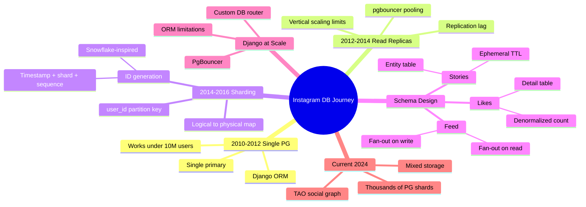
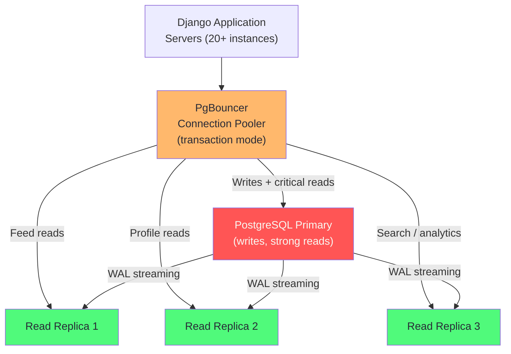
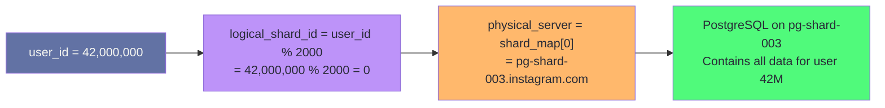
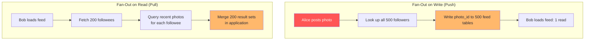
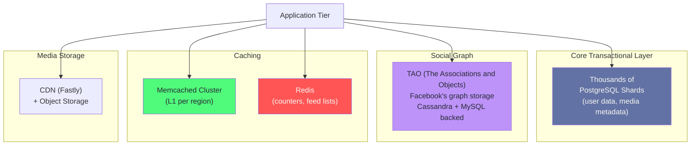

# Chapter 13: Instagram: PostgreSQL at Scale

> "We were surprised how far PostgreSQL took us. We kept expecting to hit the wall. We kept not hitting it."
> — Instagram Engineering, 2012

## Mind Map



:::info Prerequisites
This chapter assumes familiarity with PostgreSQL production concepts ([Ch05](/database/part-2-engines/ch05-postgresql-in-production)) and sharding strategies ([Ch10](/database/part-3-operations/ch10-sharding-partitioning)). Review those first if needed.
:::

## The Starting Point (2010–2012)

Instagram launched in October 2010 with a remarkably simple stack: a single PostgreSQL 9.0 instance running on a dedicated server, with Django as the application framework and a custom Python backend. The founding engineers — Kevin Systrom and Mike Krieger — were not database specialists. They chose PostgreSQL because it was the best general-purpose relational database available and because they knew SQL.

The initial schema was conventional: users, photos, follows, likes, comments — each a normalized table with foreign key constraints. Django's ORM generated clean SQL queries. Everything fit on a single machine.

```sql
-- Simplified original Instagram schema (2010)
CREATE TABLE users (
    id          BIGSERIAL PRIMARY KEY,
    username    VARCHAR(30) UNIQUE NOT NULL,
    email       VARCHAR(255) UNIQUE NOT NULL,
    bio         TEXT,
    created_at  TIMESTAMPTZ DEFAULT NOW()
);

CREATE TABLE photos (
    id          BIGSERIAL PRIMARY KEY,
    user_id     BIGINT REFERENCES users(id),
    image_url   TEXT NOT NULL,
    caption     TEXT,
    filter_type VARCHAR(30),
    created_at  TIMESTAMPTZ DEFAULT NOW()
);

CREATE TABLE follows (
    follower_id BIGINT REFERENCES users(id),
    followee_id BIGINT REFERENCES users(id),
    created_at  TIMESTAMPTZ DEFAULT NOW(),
    PRIMARY KEY (follower_id, followee_id)
);

CREATE TABLE likes (
    photo_id    BIGINT REFERENCES photos(id),
    user_id     BIGINT REFERENCES users(id),
    created_at  TIMESTAMPTZ DEFAULT NOW(),
    PRIMARY KEY (photo_id, user_id)
);
```

This schema handled 1 million users without modification. By January 2011, Instagram had 2 million users. By June 2011: 5 million. The single PostgreSQL instance was still handling the load — but the engineering team could see the ceiling.

:::tip What Worked at <10M Users
- A single PostgreSQL primary with one read replica
- `BIGSERIAL` auto-increment IDs (simple, no coordination needed)
- Standard B-tree indexes on `user_id` and `created_at`
- Django ORM for all queries (100–500ms acceptable at this scale)
- PgBouncer in transaction pooling mode to handle connection overhead
:::

## Read Replica Phase (2012–2014)

By early 2012, Instagram had 10 million users and had been acquired by Facebook for $1 billion. The engineering team grew from 3 to 13 engineers. The single primary approach was failing:

- **Read/write ratio:** Instagram is extremely read-heavy — browsing the feed, loading a profile, viewing likes are all reads. Writes (posting a photo, adding a like) are infrequent. The primary was spending 80% of its capacity serving reads that did not need to come from the primary.
- **VACUUM pressure:** PostgreSQL's MVCC generates dead tuples that VACUUM must clean up. At high write rates, VACUUM could not keep up, causing table bloat and query plan degradation.
- **Connection exhaustion:** Each Django worker needed a database connection. At 100 workers × multiple servers, connection count exceeded PostgreSQL's default `max_connections = 100`.

The solution was standard: **streaming replication with multiple hot standbys**.



**Replication lag** became the first truly hard problem. When a user posted a photo, subsequent requests to load their profile came back from a replica that had not yet replicated the new photo (the WAL had been written but not yet applied to the standby). Instagram solved this with a combination of:

1. **Read-your-own-writes routing:** POST requests to the primary; GET requests that immediately follow a POST also route to the primary for 2 seconds
2. **Lag monitoring:** pg_stat_replication tracking; if replica lag exceeded 100ms, route those queries to primary
3. **Asynchronous replication:** acceptable for most reads; only notifications and messaging required synchronous replication

:::warning Replication Lag is a Product Bug
A user who likes a photo and immediately reloads will see the like count unchanged if served from a lagging replica. At Instagram's scale, even 50ms of replication lag affects thousands of concurrent users. Plan your routing logic before you add replicas, not after users report the bug.
:::

## Sharding Strategy (2014–2016)

By 2013, Instagram had 100 million users and 55 million photos per day. Vertical scaling had been exhausted — the PostgreSQL primary was on the largest available machine. The team made the decision to shard.

### Why User-ID as the Partition Key

The core question in any sharding design is: **what is the primary partition key?**

Instagram chose `user_id` for all core tables. The reasoning:

- **Locality:** All photos, likes, comments, and follows for a user live on the same shard. A profile page query hits one shard.
- **Simplicity:** The application router is a simple `user_id % num_shards` computation (with a lookup table for re-balancing flexibility).
- **Predictability:** User creation is the only operation that assigns a new shard; everything else follows the user.

The cost was cross-shard queries. "Show me all likes from users I follow on photos from users I follow" requires joining data across many shards. Instagram accepted this cost by denormalizing aggressively (more on this in the schema section).

### Logical Shard Mapping

Instagram used a two-level mapping: **logical shards → physical shards**. Rather than mapping `user_id` directly to a server, they mapped to one of 2,000 logical shards, and logical shards to physical servers. This made re-balancing easier: moving a logical shard to a new physical server only required updating the mapping table, not rehashing all user IDs.



### ID Generation: The Snowflake-Inspired Scheme

`BIGSERIAL` auto-increment IDs do not work in a sharded system — each shard would generate its own sequence starting at 1, causing collisions. Instagram needed globally unique IDs that also encoded the shard they came from.

They built a PostgreSQL-based ID generator using a stored function. Each generated ID encodes:

```
Bit layout (64 bits total):
[41 bits: millisecond timestamp] [13 bits: logical shard ID] [10 bits: sequence]
```

- **41 bits of timestamp:** milliseconds since a custom epoch (January 1, 2011). Gives ~69 years of IDs before overflow.
- **13 bits of shard ID:** encodes which logical shard the row lives on. Allows 2^13 = 8,192 logical shards.
- **10 bits of sequence:** allows 2^10 = 1,024 IDs per millisecond per shard before rollover.

```sql
-- Instagram's ID generation function (PostgreSQL)
CREATE OR REPLACE FUNCTION next_id(OUT result BIGINT) AS $$
DECLARE
    our_epoch  BIGINT := 1314220021721;   -- Custom epoch (ms since Unix epoch)
    seq_id     BIGINT;
    now_ms     BIGINT;
    shard_id   INT := 5;                  -- Set per shard at install time
BEGIN
    SELECT nextval('global_id_sequence') % 1024 INTO seq_id;

    SELECT FLOOR(EXTRACT(EPOCH FROM clock_timestamp()) * 1000) INTO now_ms;

    result := (now_ms - our_epoch) << 23;  -- 41 bits
    result := result | (shard_id << 10);   -- 13 bits
    result := result | (seq_id);           -- 10 bits
END;
$$ LANGUAGE PLPGSQL;
```

This scheme has elegant properties:
- **Sortable by time:** IDs generated later are larger. `ORDER BY id DESC` is equivalent to `ORDER BY created_at DESC` — no timestamp column needed for ordering.
- **Shard-encoded:** Given any entity ID, you can extract the logical shard without a lookup: `(id >> 10) & 0x1FFF`.
- **No coordination:** Each shard generates IDs independently using its own sequence.

:::info ID Generation vs. Snowflake
Twitter's Snowflake system (2010) uses the same 41+10+12 bit layout but with a worker ID instead of a shard ID. Instagram's adaptation uses 13 shard bits and 10 sequence bits, tuned for their 2,000-shard architecture. Both approaches produce 64-bit integers that fit in a PostgreSQL `BIGINT` column.
:::

## Schema Design Deep Dive

### Feed Generation: Fan-Out Trade-offs

The Instagram feed — "show me the recent photos from everyone I follow" — is the most read-heavy query in the system. At scale, two strategies exist:

**Fan-out on write (push model):** When Alice posts a photo, immediately write that photo ID to the feed of every follower. A "feed" is a pre-materialized list of photo IDs per user.

**Fan-out on read (pull model):** When Bob loads his feed, query all users Bob follows, fetch their recent photos, merge and rank.



Instagram used **fan-out on write** for users with <10,000 followers and **fan-out on read** for celebrities (Kylie Jenner with 400M followers). Writing Kylie's photo to 400 million feed rows synchronously would take hours and consume enormous storage. Instead, celebrity posts are fetched on-demand and merged with the pre-materialized feed of followed non-celebrities at read time.

### Likes: Denormalized Count

The naive schema stores one row per like and computes `COUNT(*)` for the like count:

```sql
-- Naive: expensive COUNT(*) at read time
SELECT COUNT(*) FROM likes WHERE photo_id = ?;
```

At billions of likes, this query is slow even with an index. Instagram maintains a **denormalized count** directly on the photo row:

```sql
-- Instagram-style schema: denormalized count
ALTER TABLE photos ADD COLUMN like_count BIGINT DEFAULT 0;

-- On like insert:
UPDATE photos SET like_count = like_count + 1 WHERE id = ?;
INSERT INTO likes (photo_id, user_id, created_at) VALUES (?, ?, NOW());

-- On like read: instant, no aggregation
SELECT like_count FROM photos WHERE id = ?;
```

The cost: `like_count` can drift from the true `COUNT(likes)` if the UPDATE and INSERT are not atomic. Instagram wraps both in a transaction and runs periodic reconciliation jobs to correct drift.

### Stories: Ephemeral Data with TTL

Stories disappear after 24 hours. The naive approach — a `deleted_at` column with a background job — accumulates rows and requires VACUUM to reclaim space. Instagram uses a more aggressive approach:

- Stories live in a **separate partitioned table** partitioned by `created_at` (daily partitions)
- A daily cron drops the previous day's partition: `DROP TABLE stories_2024_01_15`
- Dropping a partition is instantaneous — no row-by-row deletion, no VACUUM needed

```sql
-- Partitioned stories table
CREATE TABLE stories (
    id          BIGINT NOT NULL,
    user_id     BIGINT NOT NULL,
    media_url   TEXT NOT NULL,
    created_at  TIMESTAMPTZ NOT NULL
) PARTITION BY RANGE (created_at);

-- Daily partitions created automatically via pg_partman
CREATE TABLE stories_2024_01_16
    PARTITION OF stories
    FOR VALUES FROM ('2024-01-16') TO ('2024-01-17');

-- Expiry: drop yesterday's partition
DROP TABLE stories_2024_01_15;  -- Instant, reclaims all disk space
```

## Django ORM at Scale

Django's ORM was Instagram's primary query interface throughout its growth. At scale, several patterns emerged:

### Custom Database Router

Django's database router allows directing queries to specific databases:

```python
# Instagram-style Django DB router
class InstagramDBRouter:
    def db_for_read(self, model, **hints):
        user_id = hints.get('user_id')
        if user_id:
            shard = user_id % 2000
            return f'shard_{shard_to_server[shard]}'
        return 'replica_default'

    def db_for_write(self, model, **hints):
        user_id = hints.get('user_id')
        if user_id:
            shard = user_id % 2000
            return f'shard_{shard_to_server[shard]}'
        return 'primary'

    def allow_relation(self, obj1, obj2, **db):
        # Relations only allowed within the same shard
        return True
```

### ORM Limitations Discovered at Scale

1. **N+1 queries:** Django's ORM generates N+1 SQL queries when iterating over related objects. `select_related()` and `prefetch_related()` are mandatory for any query touching multiple tables.
2. **No connection awareness:** The ORM does not know about sharding — the router must be injected at every query site.
3. **Long transactions from ORMs:** Django's default transaction model wraps each request in a transaction. On heavily contested rows (like counters), this held locks too long. Instagram moved hot counters to Redis.

:::warning Django ORM and Connection Pooling
Django opens a new database connection per request by default. At 500 application servers × 20 threads = 10,000 connections, this overwhelmed PostgreSQL's `max_connections`. PgBouncer in **transaction pooling mode** — which multiplexes many client connections onto a small pool of server connections — is non-negotiable at Instagram's scale. However, transaction pooling is incompatible with prepared statements; Instagram had to disable them.
:::

## Current Architecture (2024)

Instagram's 2024 database architecture has evolved far beyond the original sharded PostgreSQL setup:



Key architectural facts from Instagram engineering blog posts (2019–2023):

- **Thousands of PostgreSQL shards** serve user profile data, media metadata, and comments
- **TAO** (Facebook's social graph storage system) handles the follow graph — a workload that outgrew PostgreSQL's JOIN performance
- **Memcached** provides L1 caching per data center; cache hit rates above 99% for profile reads
- **Redis** stores hot feed lists, counters, and session data
- PostgreSQL's role has narrowed to: structured user data that requires ACID guarantees

## Key Lessons

| Lesson | Detail |
|--------|--------|
| PostgreSQL scales further than expected | Instagram ran a single PG instance to 10M users, then replicas to 100M users — longer than any prediction |
| Shard early by `user_id` | The partition key decision is the hardest one to change later; user_id gives excellent locality for social data |
| ID scheme should encode shard | Instagram's Snowflake-inspired IDs allow shard routing without a lookup table |
| Denormalize for reads | `like_count` on the photo row avoids expensive `COUNT(*)` aggregations |
| Partitioned tables for ephemeral data | Dropping a partition is 1,000× faster than deleting rows for TTL data |
| Connection pooling is non-negotiable | PgBouncer in transaction mode is required at any scale above ~100 application servers |
| Fan-out strategy must handle celebrity accounts | Pure fan-out-on-write fails when some users have 100M+ followers |

## Common Mistakes

| Mistake | Why It Happens | Impact | Fix |
|---------|---------------|--------|-----|
| Copying Instagram's sharding strategy without their scale | "They shard by user_id, so should we" | Sharding at 10K users adds massive complexity with no benefit | Only shard when you have exhausted read replicas, vertical scaling, and partitioning — Instagram didn't shard until 100M+ users |
| Fan-out-on-write without capping follower count | "Push model is simpler for feed reads" | Posting for a celebrity with 100M followers fans out 100M writes | Use hybrid model: fan-out for users < 1M followers, pull for high-follower accounts at read time |
| Storing like counts only in the aggregate column | "Counting is expensive, cache it" | Concurrent likes on viral posts cause lost-update races under extreme load | Buffer hot counters in Redis with `INCR`; flush to PostgreSQL periodically |
| Not adapting Django ORM queries to shard-aware routing | ORM generates standard SQL | Cross-shard queries silently scatter; performance degrades | Implement a custom Django database router that enforces shard-key-aware queries |

## Related Chapters

| Chapter | Relevance |
|---------|-----------|
| [Ch02 — Data Modeling for Scale](/database/part-1-foundations/ch02-data-modeling-for-scale) | Access-pattern schema design used throughout Instagram's evolution |
| [Ch03 — Indexing Strategies](/database/part-1-foundations/ch03-indexing-strategies) | Index choices for user_id, created_at, and composite keys |
| [Ch04 — Transactions & Concurrency](/database/part-1-foundations/ch04-transactions-concurrency-control) | MVCC and locking behavior relevant to like counter contention |
| [Ch05 — PostgreSQL in Production](/database/part-2-engines/ch05-postgresql-in-production) | WAL, VACUUM, and connection pooling internals |
| [Ch10 — Sharding & Partitioning](/database/part-3-operations/ch10-sharding-partitioning) | Horizontal sharding patterns applied here |
| [Ch16 — Database Selection Framework](/database/part-4-real-world/ch16-database-selection-framework) | How to apply Instagram's lessons to your own selection decision |

## Practice Questions

### Beginner

1. **ID Generation:** Instagram's ID scheme uses 41 bits for timestamp, 13 for shard ID, and 10 for sequence. How many IDs per millisecond can a single shard generate? What is the maximum number of logical shards the scheme supports? When will IDs overflow the 64-bit integer?

   <details>
   <summary>Model Answer</summary>
   10 sequence bits = 2^10 = 1,024 IDs per millisecond per shard. 13 shard ID bits = 2^13 = 8,192 logical shards. 41 timestamp bits in milliseconds = 2^41 ms ≈ 69 years from the custom epoch (set to 2011, so overflow around 2080).
   </details>

2. **Read Replicas:** A user posts a photo and immediately reloads their profile. Their new photo does not appear. What is the likely cause, and how would you fix it in the application routing layer?

   <details>
   <summary>Model Answer</summary>
   The profile read was routed to a replica that had not yet replicated the new photo row. The fix: read-your-own-writes routing — for a short window after a write (or permanently for the posting user), route profile reads to the primary.
   </details>

### Intermediate

3. **Fan-Out Design:** A new social platform has 95% of users with fewer than 1,000 followers, and 5% of users ("influencers") with more than 1 million followers. Design a hybrid feed system that uses fan-out-on-write for regular users and fan-out-on-read for influencers. What threshold would you use, and how does the application know which strategy to apply at read time?

   <details>
   <summary>Model Answer</summary>
   Store follower_count on the user row, updated on every follow/unfollow. At feed generation time, check if the followee is "celebrity" (follower_count > threshold, e.g., 50,000). Fetch celebrity posts inline at read time and merge with the pre-materialized feed. The threshold is a tuning parameter: lower reduces storage for pre-materialized feeds, higher increases read-time fan-out cost.
   </details>

4. **Sharding Key Analysis:** Instagram chose `user_id` as the sharding key. What queries become efficient? What queries become expensive or impossible without cross-shard joins? Give three examples of each.

   <details>
   <summary>Model Answer</summary>
   Efficient: fetch all photos by user, fetch user profile + followers, load user's feed (if feed is stored by user_id). Expensive: "find all photos tagged #sunset" (cross-shard full scan), "find all users who liked photo X" (likes distributed by photo's user shard, not liker's shard), "recommended follows based on mutual friends" (graph traversal across shards).
   </details>

### Advanced

5. **Migration Planning:** Instagram had 100M rows in the `photos` table on a single PostgreSQL instance and needed to migrate to a sharded system with 2,000 logical shards. Design the migration process: how do you move data without downtime? How do you handle writes that come in during the migration? How do you validate that all rows were migrated correctly?

   <details>
   <summary>Model Answer</summary>
   Phase 1: Dual-write — all new writes go to both old DB and new shard. Phase 2: Backfill — copy historical data shard by shard, using a cursor on photo_id to avoid re-processing. Phase 3: Validation — compare row counts and checksums per logical shard. Phase 4: Read cut-over — gradually shift read traffic to shards, starting with lowest traffic shards. Phase 5: Stop writing to old DB. The trickiest part is handling updates to rows still being backfilled — use a replication lag check or a "migration_complete" flag per logical shard.
   </details>

## References

- [Sharding & IDs at Instagram](https://instagram-engineering.com/sharding-ids-at-instagram-1cf5a71e5a5c) — Instagram Engineering Blog (2012)
- [Storing Hundreds of Millions of Simple Key-Value Pairs in Redis](https://instagram-engineering.com/storing-hundreds-of-millions-of-simple-key-value-pairs-in-redis-1091ae80f74c) — Instagram Engineering Blog (2012)
- [What Powers Instagram: Hundreds of Instances, Dozens of Technologies](https://instagram-engineering.com/what-powers-instagram-hundreds-of-instances-dozens-of-technologies-adf2e22da2ad) — Instagram Engineering Blog (2011)
- [TAO: Facebook's Distributed Data Store for the Social Graph](https://www.usenix.org/system/files/conference/atc13/atc13-bronson.pdf) — Bronson et al., USENIX ATC (2013)
- [Snowflake: Generating Unique IDs in High Scale Systems](https://blog.twitter.com/engineering/en_us/a/2010/announcing-snowflake) — Twitter Engineering Blog (2010)
- [PgBouncer Documentation](https://www.pgbouncer.org/config.html) — Connection pooling modes and trade-offs
- ["Designing Data-Intensive Applications"](https://dataintensive.net/) — Kleppmann, Chapter 6 (Partitioning)
