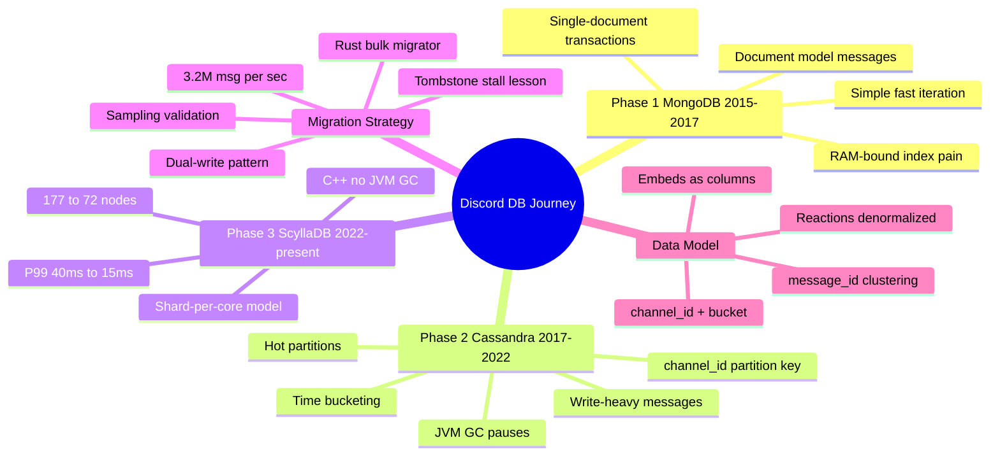
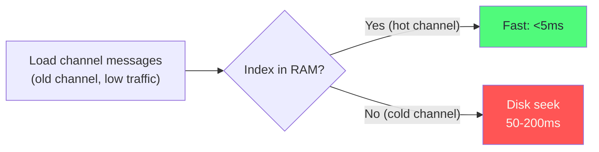
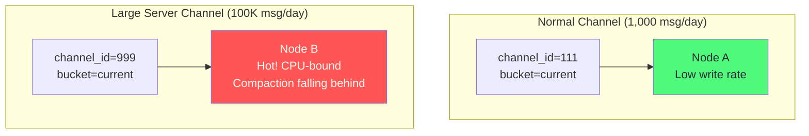
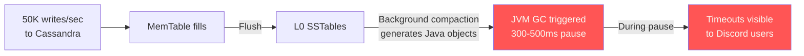
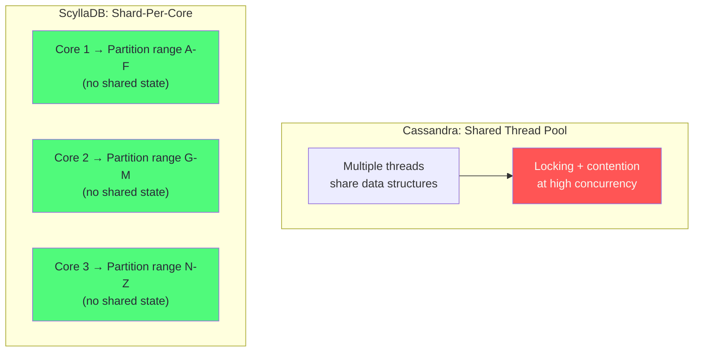
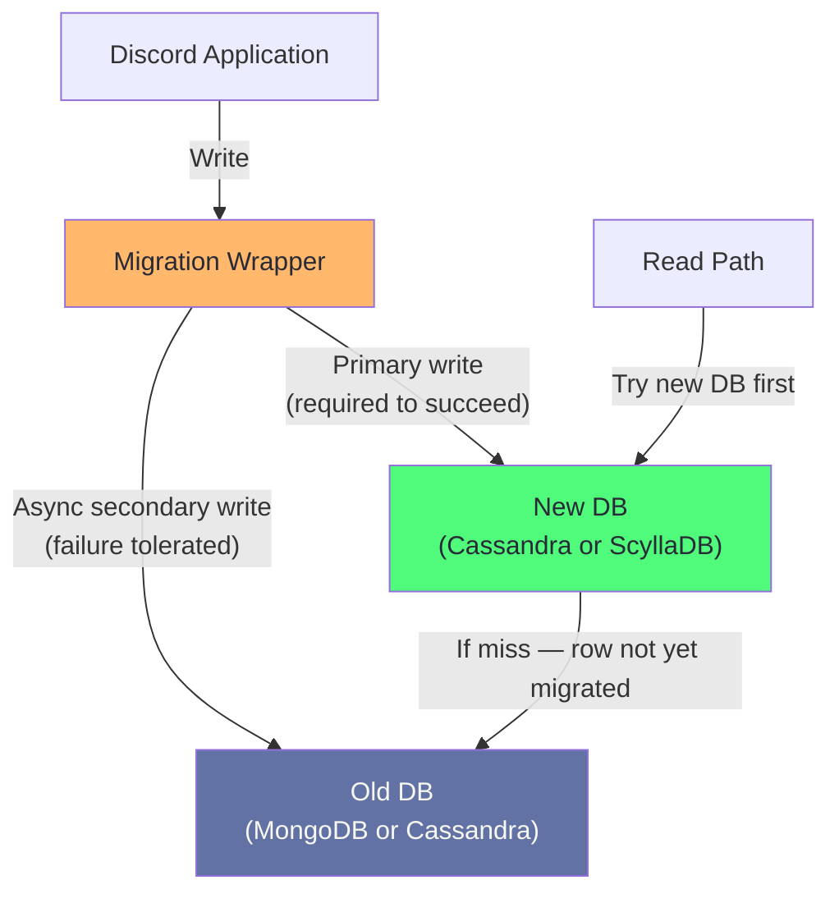
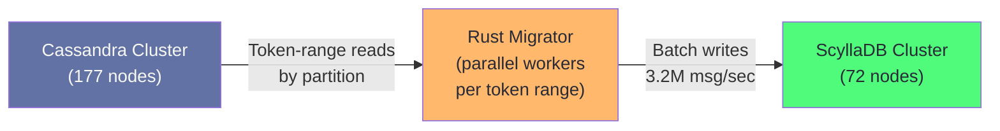

# Chapter 14: Discord: Data Layer Evolution

> "The best migration is the one you never have to do. The second best is the one you do once and never have to undo."
> — Discord Engineering

## Mind Map



## Phase 1: MongoDB (2015–2017)

Discord launched in May 2015 and chose MongoDB for the same reason many startups do: flexible schema, fast iteration, and a document model that matched the early mental model of "a message is a document."

The initial message schema was simple:

```javascript
// MongoDB message document (2015)
{
  "_id": ObjectId("507f1f77bcf86cd799439011"),
  "channel_id": "123456789",
  "author_id": "987654321",
  "content": "Hello, world!",
  "timestamp": ISODate("2015-05-13T10:00:00Z"),
  "mentions": ["111111111"],
  "embeds": [],
  "attachments": []
}
```

For the first year, this worked well. The document model matched the application's data — messages have variable structure (some have attachments, some have embeds, some have reactions). MongoDB's secondary indexes on `channel_id` and `timestamp` made "load the last 50 messages in a channel" fast.

### Pain Points That Emerged at Scale

By 2017, Discord had 100 million messages per day and the MongoDB pain points were undeniable:

**RAM-bound indexes:** MongoDB requires its working set (active data + indexes) to fit in RAM for good performance. The `messages` collection's index on `(channel_id, timestamp)` was larger than available RAM on a single machine. Queries that fell outside the hot cache caused disk seeks.



**Single-document transaction model:** MongoDB 3.x (what Discord used) had no multi-document transactions. Updating a message and updating a channel's `last_message_id` in the same operation was not atomic.

**No native TTL at scale:** MongoDB's TTL index worked for simple cases but struggled with the rate at which Discord needed to expire and archive messages at scale.

**Scaling model mismatch:** MongoDB's sharding required careful shard key selection. Discord had already built too much application logic assuming a single MongoDB instance, making a retrofit expensive.

:::warning Why Not MongoDB at Scale
MongoDB's original storage engine (MMAPv1) was replaced by WiredTiger in 3.0, which improved significantly. However, by 2017, Discord's access pattern was fundamentally append-heavy — messages are rarely updated, never deleted by users — and time-ordered. This is exactly the pattern that wide-column stores with LSM engines are designed for. MongoDB's document model added flexibility Discord did not need, without the write throughput it did need.
:::

## Phase 2: Apache Cassandra (2017–2022)

Discord chose Cassandra for its write throughput, linear horizontal scalability, and time-ordered data model. Messages are append-heavy: Discord sends billions of messages that are rarely edited and almost never deleted. Cassandra's LSM storage engine is purpose-built for this pattern. See [Ch01 — Storage Engines](/database/part-1-foundations/ch01-database-landscape) for the LSM fundamentals underlying this choice.

### Data Model Design

The message table design was the most critical architectural decision:

```sql
-- Discord's Cassandra messages table (simplified)
CREATE TABLE messages (
    channel_id   BIGINT,
    bucket       INT,              -- Time bucket: timestamp_ms / bucket_size_ms
    message_id   BIGINT,          -- Snowflake ID (encodes timestamp)
    author_id    BIGINT,
    content      TEXT,
    mentions     LIST<BIGINT>,
    reactions    MAP<TEXT, INT>,  -- emoji -> count (denormalized)
    edited_at    TIMESTAMP,
    deleted      BOOLEAN,
    PRIMARY KEY ((channel_id, bucket), message_id)
) WITH CLUSTERING ORDER BY (message_id DESC);
```

**Why `(channel_id, bucket)` as the partition key?**

Cassandra stores all rows in a partition together on the same node. The natural partition key — just `channel_id` — creates **unbounded partitions**: a Discord server active for years would accumulate millions of messages in a single partition, eventually hitting Cassandra's practical partition size limit (~100MB or ~2 billion cells).

The **time bucket** solves this. Each bucket represents a fixed time window (e.g., 10 days of messages). When a bucket fills, it becomes read-only and compaction finishes quickly. The application calculates the bucket at query time:

```python
BUCKET_SIZE_DAYS = 10
EPOCH_MS = 1420070400000  # Jan 1, 2015 in milliseconds

def get_bucket(message_id: int) -> int:
    # message_id is a Snowflake: top 42 bits encode millisecond timestamp
    timestamp_ms = (message_id >> 22) + EPOCH_MS
    return int(timestamp_ms / 1000 / 86400 / BUCKET_SIZE_DAYS)

def get_messages(channel_id: int, before_id: int, limit: int = 50):
    bucket = get_bucket(before_id)
    results = []

    while len(results) < limit:
        rows = session.execute(
            "SELECT * FROM messages "
            "WHERE channel_id = %s AND bucket = %s "
            "AND message_id < %s ORDER BY message_id DESC LIMIT %s",
            [channel_id, bucket, before_id, limit]
        )
        results.extend(rows)
        bucket -= 1    # Walk backwards through time buckets
        if bucket < 0:
            break

    return results[:limit]
```

### Why Not User-ID as Partition Key

An alternative design partitions by `author_id` instead of `channel_id`. Discord rejected this because:

- The primary read pattern is "load messages in channel X" — not "load all messages by user Y"
- Partitioning by author would require scatter-gather across all authors in a channel for every message load
- Channel-based partitioning means loading a channel's history requires exactly `ceil(message_count / bucket_capacity)` partition reads

### Hot Partition Problem

Large Discord servers ("guilds") with millions of members generate thousands of messages per second in a single channel. All those writes land on the `(channel_id, bucket)` partition — potentially on a single Cassandra node.



Discord addressed hot partitions through:
1. **Replication factor 3** — writes go to 3 nodes; no single node bears 100% of the write load
2. **Cassandra token assignment** — the consistent hashing ring distributes the 3 replicas across different physical nodes
3. **Rate limiting** — server-side rate limits prevent any single channel from exceeding burst thresholds

### JVM GC Pauses: The Critical Failure Mode

Cassandra runs on the JVM. As of 2022, Discord was running Cassandra 3.x with Java heap sizes of 16–32GB. Stop-the-world GC pauses (even with G1GC or ZGC) caused:

- P99 latency spikes from 40ms to 300–500ms during GC
- Occasional full GC pauses causing 2–10 second outages visible to users
- Compaction pressure triggering GC: background compaction (merging SSTables) generates garbage that triggered GC



Discord's SRE team spent significant engineering time tuning JVM flags, heap sizes, and GC algorithms. They could reduce pause frequency but not eliminate it at their write rates.

## Phase 3: ScyllaDB (2022–Present)

ScyllaDB is a C++ reimplementation of the Cassandra storage engine. It is API-compatible with Cassandra (same CQL, same data model, same replication protocol) but eliminates the JVM entirely. Discord's decision to migrate was driven by three ScyllaDB advantages:

### 1. No JVM — No GC Pauses

ScyllaDB is written in C++ using the Seastar framework. Memory management is explicit; there is no garbage collector. Compaction runs without causing stop-the-world pauses. Discord's GC-induced P99 spikes disappeared.

### 2. Shard-Per-Core Architecture

ScyllaDB assigns each CPU core its own shard of data and handles requests for that shard without cross-core communication. This eliminates lock contention that occurs in the JVM Cassandra implementation when multiple threads compete for shared data structures.



### 3. Dramatic Infrastructure Reduction

Discord's results after migrating message storage to ScyllaDB:

| Metric | Cassandra | ScyllaDB | Improvement |
|--------|-----------|----------|-------------|
| Node count | 177 nodes | 72 nodes | 59% reduction |
| P99 read latency | 40–125ms | 15ms | 3–8× better |
| P99 write latency | 5ms | 5ms | Comparable |
| GC-induced spikes | Frequent | None | Eliminated |
| Latency jitter | High | Low | Predictable |

## Migration Strategy

The MongoDB→Cassandra and Cassandra→ScyllaDB migrations followed similar patterns but with different tooling.

### Dual-Write Pattern

Every migration began with a dual-write phase: the application writes to both old and new stores simultaneously.



**Key principles:**
- New DB is the primary write target; old DB is the fallback read source
- Reads check new DB first; fall back to old DB if the message has not yet been migrated
- Dual-write runs for weeks before backfill begins, ensuring all new messages land in the new store

### Rust Bulk Migrator

For the Cassandra→ScyllaDB migration, Discord built a bulk migrator in **Rust**. The choice of Rust was deliberate:

- **No GC:** migrating data at maximum throughput while avoiding GC pauses in the migrator itself
- **Controlled memory:** Rust's ownership model ensures the migrator does not accumulate unbounded heap
- **Throughput achieved:** 3.2 million messages per second sustained throughput



### Tombstone Stall Lesson

The most painful incident during migration was the **tombstone crisis**. In Cassandra and ScyllaDB, deletes do not immediately remove data — they write a **tombstone** marker. The compaction process eventually removes tombstones and associated data. But during compaction, a read must scan past all tombstones to find live data.

Discord's messages table had a `deleted` column (soft deletes) and also used actual CQL `DELETE` statements for moderation use cases. During the migration backfill, old tombstones accumulated faster than compaction could clear them. Read latency on channels with heavy moderation activity spiked because each read scanned thousands of tombstones.


**Resolution:** Discord changed the data model to use a `deleted BOOLEAN` column and never issue CQL `DELETE` — instead updating the column to `true`. This produces a tombstone-free compaction path. The lesson: **model deletes as updates, not as deletes**, in LSM-based databases.

### Sampling Validation

After backfill, Discord validated correctness by sampling:
1. Random 0.1% of `channel_id` values
2. Fetch last 1,000 messages from each in both old and new DB
3. Compare `message_id` sets and content checksums
4. Alert if mismatch rate exceeded 0.001%

This approach validated correctness without the cost of reading every row in both databases.

## Schema Analysis: Why Channel-First

The `(channel_id, bucket)` partition key optimizes for the 99% case: "load messages in channel X." But it creates inefficiency for "find all messages by user Y." Discord made an explicit product decision: users cannot search their own message history across servers. This removed the requirement for an author-indexed table.

| Access Pattern | Efficiency | Notes |
|----------------|-----------|-------|
| Load last N messages in channel | Excellent | Single partition read |
| Load message by ID | Excellent | Derive partition from Snowflake timestamp |
| Search by keyword in channel | Good | Elasticsearch sidecar handles this |
| All messages by user across servers | Not supported | Product decision |
| Count unread messages per channel | Good | Read from latest bucket only |

### Reactions and Embeds as Denormalized Columns

Reactions (emoji responses to messages) and embeds (link previews) are stored as map columns within the message row rather than separate tables:

```sql
-- Reactions stored as MAP<text, int> within the message row
-- Query: SELECT reactions FROM messages WHERE ...
-- Result:
reactions = {
    '👍': 42,
    '❤️': 15,
    '😂': 7
}
```

This denormalization avoids secondary index lookups for the common case (display a message with its reaction counts). The cost: if reactions need to be queried independently (e.g., "show all messages reacted to with ❤️"), no efficient query path exists. Discord accepted this limitation because that access pattern is not exposed in the product. This is the same denormalization principle seen in [Instagram's like_count pattern](/database/part-4-real-world/ch13-instagram-postgresql-at-scale).

## Key Lessons

| Lesson | Detail |
|--------|--------|
| Best migration is the one you avoid | MongoDB worked for 2 years; the Cassandra migration was significant engineering cost |
| Model deletes as updates in LSM stores | CQL DELETE creates tombstones that accumulate and stall reads; use a `deleted` boolean instead |
| Test with production access patterns | Benchmarks that don't replicate hot partitions and time-bucket traversals miss the real bottleneck |
| Rust for data migration pipelines | No GC and controlled memory achieved 3.2M msg/sec throughput; Python or Java migrators would GC under this load |
| Monitor compaction health, not just query latency | Cassandra's compaction falling behind was a leading indicator 30 minutes before query latency degraded |
| Shard-per-core eliminates JVM as the bottleneck | ScyllaDB's architecture shift — not just a language change — reduced node count by 59% |

## Related Chapters

| Chapter | Relevance |
|---------|-----------|
| [Ch01 — Database Landscape](/database/part-1-foundations/ch01-database-landscape) | LSM vs B-tree storage engine tradeoffs underlying this evolution |
| [Ch02 — Data Modeling for Scale](/database/part-1-foundations/ch02-data-modeling-for-scale) | Access-pattern-driven schema design used in channel + bucket key |
| [Ch09 — Replication & High Availability](/database/part-3-operations/ch09-replication-high-availability) | Cassandra's tunable consistency used during dual-write migration |
| [Ch10 — Sharding & Partitioning](/database/part-3-operations/ch10-sharding-partitioning) | Token ring and partition key selection relevant to bucket design |
| [Ch13 — Instagram: PostgreSQL at Scale](/database/part-4-real-world/ch13-instagram-postgresql-at-scale) | Parallel case study: denormalization and sharding in a different DB family |
| [Ch16 — Database Selection Framework](/database/part-4-real-world/ch16-database-selection-framework) | Applying Discord's migration lessons to future selection decisions |

## Practice Questions

### Beginner

1. **Tombstone Behavior:** A Discord channel has 1 million messages of which 50,000 have been moderated (deleted) using CQL `DELETE`. How does this affect read performance when loading the most recent 50 messages? What alternative data model avoids this problem?

   <details>
   <summary>Model Answer</summary>
   Cassandra and ScyllaDB mark deleted rows with tombstones. Reads must scan past tombstones to find live rows. With 50,000 tombstones scattered across the partition, reading 50 live messages requires scanning many more entries. Alternative: use a `deleted BOOLEAN` column and `UPDATE messages SET deleted = true WHERE ...` — this writes a regular value update, not a tombstone, so compaction handles it efficiently.
   </details>

2. **Time Bucketing:** Discord uses 10-day time buckets for message partitions. What happens when you load the last 50 messages in a channel and the most recent bucket has only 20 messages? Describe the query behavior step by step.

   <details>
   <summary>Model Answer</summary>
   The application calculates the current bucket from the most recent message_id, queries that bucket and gets 20 messages. Since fewer than 50 were returned, it decrements the bucket number and queries again — getting up to 30 more messages from the previous bucket. Each bucket query is a single Cassandra partition read. This continues until 50 total messages are found or the earliest bucket is reached.
   </details>

### Intermediate

3. **Hot Partition Mitigation:** A large Discord server has 2 million members and one main channel that receives 10,000 messages per minute during live events. How would you detect this hot partition, and what options exist to mitigate it without changing the data model?

   <details>
   <summary>Model Answer</summary>
   Detection: monitor per-partition write rate using ScyllaDB's shard-level metrics or Cassandra's nodetool tablestats. Mitigation options: (1) Read replicas with LOCAL_QUORUM reads to distribute read load across 3 nodes. (2) Application-level rate limiting on writes per channel. (3) Token-aware driver so each write goes directly to the correct replica without coordinator overhead. (4) Increase replication factor so writes land on more nodes.
   </details>

4. **Dual-Write Migration Risk:** During the Cassandra→ScyllaDB migration, a user edits a message. The edit lands in ScyllaDB but the async write to Cassandra fails due to a network partition. An hour later, the migration completes and Cassandra is decommissioned. Was any data lost? What if the failure was reversed (Cassandra succeeds, ScyllaDB fails)?

   <details>
   <summary>Model Answer</summary>
   If ScyllaDB (new DB) gets the write and Cassandra (old DB) does not: no data is lost — ScyllaDB is the source of truth. If Cassandra gets the write and ScyllaDB does not: the edit is lost in ScyllaDB. The message shows the pre-edit version. This is why the migration framework must treat the new DB as the primary write target — new DB success is required; old DB failure is acceptable.
   </details>

### Advanced

5. **ScyllaDB vs Cassandra Architecture:** Discord reduced from 177 Cassandra nodes to 72 ScyllaDB nodes while handling the same workload. Explain the architectural reasons why ScyllaDB requires fewer nodes. What does the shard-per-core model eliminate that Cassandra's JVM thread pool cannot? Under what conditions might ScyllaDB's advantage shrink?

   <details>
   <summary>Model Answer</summary>
   Three factors: (1) No JVM overhead — ScyllaDB's C++ uses less memory per operation, so more CPU budget goes to actual work vs. GC bookkeeping. (2) Shard-per-core eliminates cross-core synchronization — each core handles its partitions without locks. (3) Predictable compaction — no GC pauses mean compaction runs continuously at steady state rather than bursty. ScyllaDB's advantage shrinks with very low concurrency (a single-threaded workload doesn't benefit from shard-per-core) and with workloads that are network-bound rather than CPU-bound.
   </details>

## References

- [How Discord Stores Billions of Messages](https://discord.com/blog/how-discord-stores-billions-of-messages) — Discord Engineering Blog (2017)
- [How Discord Stores Trillions of Messages](https://discord.com/blog/how-discord-stores-trillions-of-messages) — Discord Engineering Blog (2023)
- [ScyllaDB Architecture: Shared-Nothing Design](https://www.scylladb.com/product/technology/shared-nothing-architecture/) — ScyllaDB Documentation
- [Cassandra Tombstones: The Good, The Bad, and the Ugly](https://thelastpickle.com/blog/2016/07/27/about-deletes-and-tombstones.html) — The Last Pickle (2016)
- [The Seastar Framework for High-Performance Server Applications](http://seastar.io/) — Avi Kivity et al.
- ["Designing Data-Intensive Applications"](https://dataintensive.net/) — Kleppmann, Chapter 3 (Storage and Retrieval)
- [Apache Cassandra Documentation: Compaction](https://cassandra.apache.org/doc/latest/cassandra/managing/operating/compaction/index.html)
