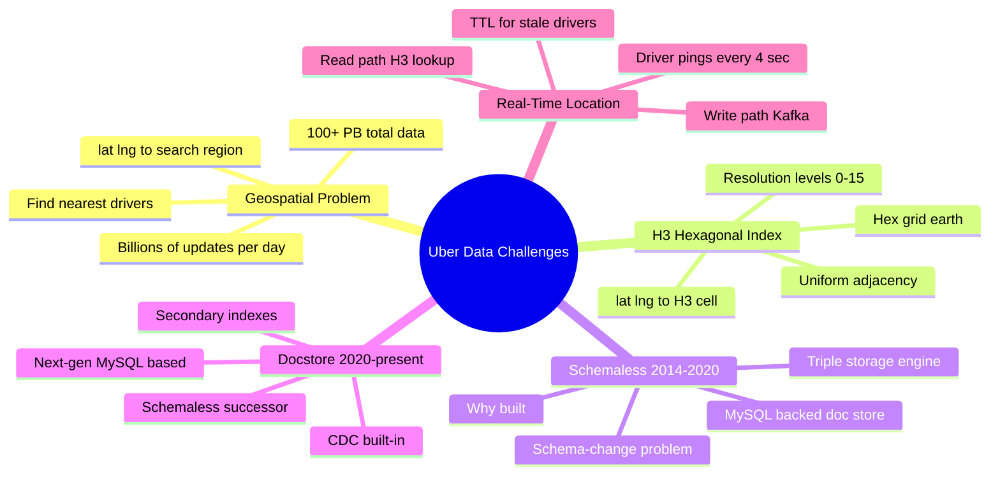
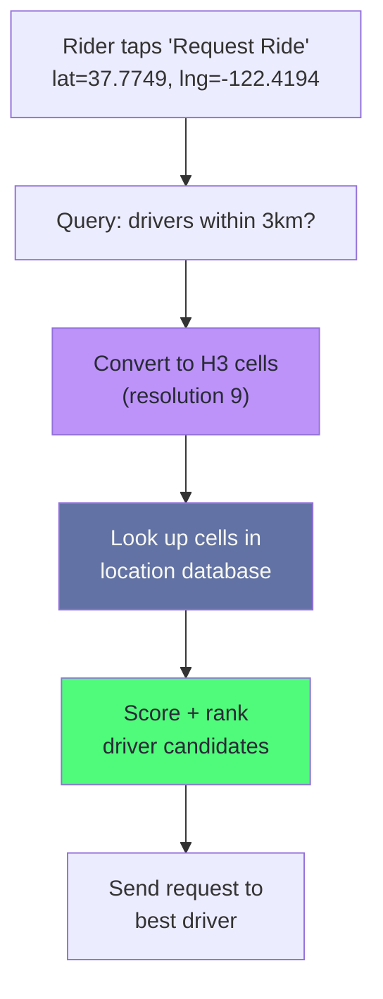
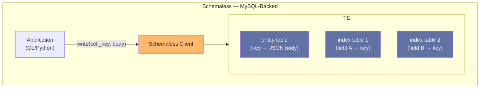
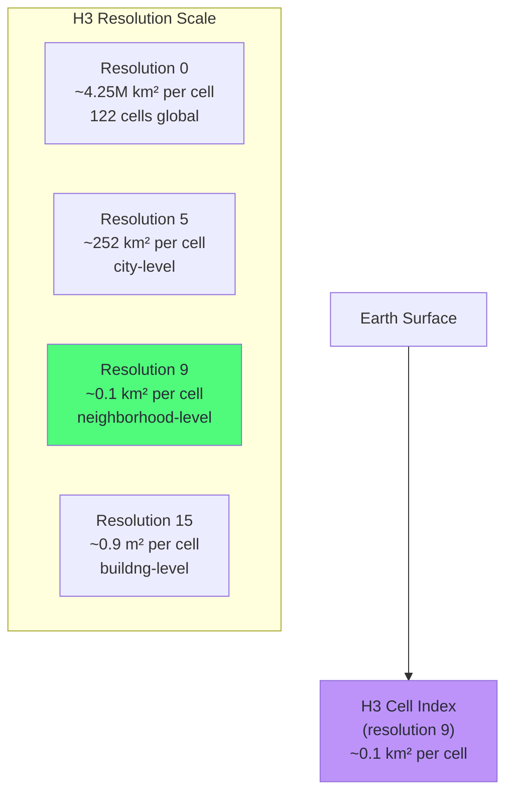
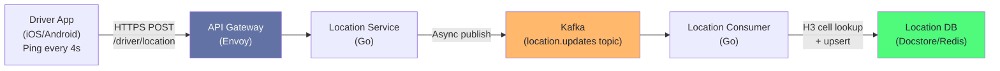
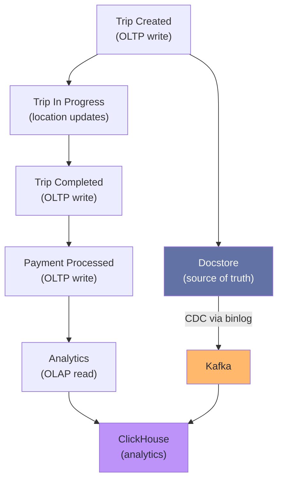

# Chapter 15: Uber: Geospatial Database Design

> "The core question sounds simple: 'Where is the nearest driver?' At a million concurrent requests per second, answering it correctly requires rethinking what a database is."
> — Uber Engineering

## Mind Map



## The Core Data Challenge

Uber's primary database challenge is deceptively simple to state: **every few seconds, find all available drivers within 3km of a rider's location**. At scale, the numbers make this extraordinary:

- **5 million drivers** on the platform globally
- **Driver location updates** every 4 seconds per active driver = ~1.25 million location writes per second
- **Rider requests** that each require a geospatial lookup across all nearby drivers
- **100+ PB** of total trip and analytics data (as of 2023)
- **Sub-200ms** end-to-end latency requirement from rider tap to driver candidates shown

No off-the-shelf database in 2014 could answer "which of 5 million moving points are within 3km of this coordinate" at this rate. Uber built custom systems.



## Schemaless: Why Uber Built a Database (2014–2020)

### The MySQL Scaling Problem

Uber's early architecture (2010–2013) used MySQL directly. MySQL's relational model worked for trips — a trip has a well-defined schema with a start location, end location, fare, and timestamps. But the application evolved rapidly:

- New payment methods required new columns
- Surge pricing added columns to the trips table
- New features (scheduled rides, UberPool) required schema changes

Schema changes on a MySQL table with hundreds of millions of rows require table locks or online DDL operations that are slow and risky. Adding a column to the `trips` table took hours. At the velocity Uber was developing in 2013–2014, this was unacceptable.

### The Schemaless Design

Uber built **Schemaless** (open-sourced as "Docstore" externally) — a MySQL-backed document store that eliminated the schema change problem. The insight: store structured data as JSON in a MySQL column. Schema changes at the application level require no database migration.



The triple storage engine stored:
1. **Entity table:** `(row_key, column_name, ref_key) → JSON body` — the main data
2. **Added-time index:** rows sortable by insertion time for iteration
3. **Per-column indexes:** user-specified field indexes, stored as separate MySQL tables

This allowed schema-free storage while retaining queryability on specific fields. A new field in the JSON body required no database migration — only the application reading it.

### Schemaless Limitations

By 2018, Schemaless had accumulated technical debt:
- **No general secondary indexes:** each custom index was a separate MySQL table that had to be explicitly created and maintained
- **No built-in CDC:** Change Data Capture required external tooling
- **Consistency complexity:** the triple-write (entity + indexes) was eventually consistent rather than atomic at the MySQL level
- **MySQL version constraints:** Schemaless was deeply coupled to specific MySQL versions

### Docstore: The Next Generation (2020–Present)

Uber built **Docstore** as Schemaless's successor. Docstore is still MySQL-backed but adds:
- **Native secondary indexes** managed by the Docstore layer
- **Built-in CDC** using MySQL binlog
- **Consistent reads** via MySQL's MVCC (see [Ch04 — Transactions](/database/part-1-foundations/ch04-transactions-concurrency-control))
- **Hot/cold tiering** — recent rows in MySQL, older rows archived to cheaper storage

```sql
-- Docstore conceptual schema (what MySQL sees internally)
CREATE TABLE trips (
    row_key     VARCHAR(255) NOT NULL,
    body        JSON NOT NULL,
    created_at  BIGINT NOT NULL,
    updated_at  BIGINT NOT NULL,
    PRIMARY KEY (row_key),
    INDEX idx_driver_id ((body->>'$.driver_id'), created_at),
    INDEX idx_rider_id  ((body->>'$.rider_id'), created_at)
) ENGINE=InnoDB;
```

MySQL 5.7+ supports functional indexes on JSON expressions, which Docstore uses to implement secondary indexes on JSON fields without a separate index table.

## H3: Hexagonal Geospatial Index

### Why Standard Approaches Failed

**Approach 1: Bounding box query**
```sql
-- Naive: find drivers within bounding box
SELECT * FROM driver_locations
WHERE lat BETWEEN ? AND ?
  AND lng BETWEEN ? AND ?
```
This requires a spatial index and still returns drivers in the corners of the box that are farther than 3km. More importantly, at 5 million driver updates per second, maintaining a spatial index that can answer 1M queries/second is beyond what any single MySQL or PostgreSQL instance can handle.

**Approach 2: Geohash**
Geohash encodes a geographic point as a string (e.g., `9q8yy4`) where common prefixes indicate nearby locations. It works but has edge effects: two points on opposite sides of a geohash cell boundary can have very different prefix strings despite being meters apart.

**Approach 3: S2 (Google)**
Google's S2 library uses a Hilbert curve to map the sphere to a 64-bit integer. Used by Google Maps and Foursquare. Better edge properties than Geohash but cells are irregular quadrilaterals.

### H3: Uber's Hexagonal Grid

Uber open-sourced **H3** in 2018. H3 divides Earth's surface into a hierarchy of hexagonal cells at 16 resolution levels (0 = very coarse, 15 = very fine).



**Why hexagons?**

| Property | Square Grid | Hexagonal Grid |
|----------|-------------|----------------|
| Neighbors | 4 direct, 4 diagonal (inconsistent) | 6 equidistant neighbors |
| Edge effects | Corner adjacency problems | All neighbors equidistant |
| Distance calculation | Manhattan or Euclidean | Uniform hex distance |
| Geospatial query | Inconsistent coverage | All cells same area |

In a square grid, the center of a corner-adjacent cell is ~41% farther than a side-adjacent cell. In a hexagonal grid, all 6 neighbors are equidistant. This makes geospatial queries — "find all drivers within N hexes" — accurate and efficient.

### H3 Query Pattern

Finding nearby drivers at Uber:

```python
import h3

def find_nearby_drivers(rider_lat: float, rider_lng: float,
                        radius_km: float = 3.0) -> list:
    # Step 1: Convert rider location to H3 cell at resolution 9
    rider_cell = h3.geo_to_h3(rider_lat, rider_lng, resolution=9)

    # Step 2: Find all H3 cells within radius
    # k=1 → 7 cells (center + 6 neighbors)
    # k=2 → 19 cells, k=3 → 37 cells
    k_rings = h3.k_ring(rider_cell, k=3)  # ~1km radius at res 9

    # Step 3: Look up all drivers in those cells
    drivers = []
    for cell in k_rings:
        cell_drivers = location_db.get_drivers_in_cell(cell)
        drivers.extend(cell_drivers)

    return drivers
```

### Database Schema for Driver Locations

```sql
-- Driver location table (conceptual; Uber uses Docstore internally)
CREATE TABLE driver_locations (
    h3_index    VARCHAR(16) NOT NULL,  -- H3 cell ID at resolution 9
    driver_id   BIGINT NOT NULL,
    lat         DOUBLE NOT NULL,
    lng         DOUBLE NOT NULL,
    heading     SMALLINT,              -- Direction of travel (0-359 degrees)
    speed       FLOAT,                 -- km/h
    status      ENUM('available', 'on_trip', 'offline') NOT NULL,
    updated_at  BIGINT NOT NULL,       -- Unix timestamp ms
    PRIMARY KEY (h3_index, driver_id),
    INDEX idx_status_updated (status, updated_at)  -- For stale driver cleanup
);

-- TTL cleanup: remove stale driver records
DELETE FROM driver_locations
WHERE updated_at < UNIX_TIMESTAMP() * 1000 - 30000  -- 30 seconds stale
  AND status = 'offline';
```

The composite primary key `(h3_index, driver_id)` enables the core query — "give me all drivers in these H3 cells" — as an efficient range scan on `h3_index`.

### Geospatial Index Comparison

| Approach | Cell Shape | Edge Effects | Resolution Levels | Used By |
|----------|-----------|--------------|-------------------|---------|
| Geohash | Rectangle | Problematic at boundaries | 12 levels | Foursquare (early), many apps |
| S2 | Quadrilateral | Moderate | 30 levels | Google Maps, Foursquare (now) |
| **H3** | **Hexagon** | **Minimal** | **16 levels** | **Uber, Airbnb, DoorDash** |
| PostGIS GIST | Any shape | None (exact) | Continuous | PostgreSQL users, any shape |

:::info When to Use PostGIS vs H3
PostGIS with a GIST index computes exact geospatial queries. H3 computes approximate geospatial queries using cell containment. Use PostGIS for precision use cases (property boundary queries, legal geographic analysis). Use H3 for scale use cases where approximate is acceptable and partition-key-based lookup is needed. At Uber's query rate, PostGIS on a single PostgreSQL instance cannot answer queries fast enough — H3 cells become the partition key for a distributed lookup.
:::

## Real-Time Location Architecture

### Write Path

Drivers ping their location every 4 seconds via the Uber driver app. The write path is designed for throughput, not latency:



Kafka decouples the driver app from the location database. If the location DB is slow for 5 seconds, drivers continue pinging successfully — the backlog absorbs the delay. This is the same write-path pattern described in the System Design chapters' producer-consumer architecture.

### Read Path

When a rider requests a ride, the read path must be fast:


Redis caches the driver list per H3 cell with a TTL of 4–8 seconds (matching driver ping frequency). Cache misses fall through to Docstore. This means most "find nearby drivers" queries never touch the persistent database.

### TTL for Ephemeral Location Data

Driver location data is ephemeral — a location from 30 seconds ago is worse than useless for matching. Uber uses two TTL mechanisms:

1. **Redis TTL:** Each H3 cell entry in Redis expires after 8 seconds. If no driver updates their location, the cell becomes empty — ensuring stale data cannot serve riders.
2. **Database cleanup:** A background job deletes `driver_locations` rows where `updated_at` is older than 30 seconds. This prevents the database from accumulating unbounded location history.

:::tip Ephemeral Data Deserves Ephemeral Storage
Driver current location is fundamentally different from driver trip history. Location data is valid for ~8 seconds; trip history is retained for years. Mixing them in the same storage system (as some early Uber architectures did) wastes storage and creates index bloat. Separate the concerns: Redis for current location, Docstore for trip history.
:::

## Trip Data Architecture

Beyond driver locations, Uber stores billions of trips. The trip lifecycle creates data at multiple stages:



Trip data flows from Docstore (OLTP source of truth) through Kafka CDC to ClickHouse for analytics. This is the same OLTP→OLAP pattern used at Instagram and Discord — the source-of-truth database handles transactions, and an analytical database handles aggregation queries. Never run analytics directly on the OLTP store.

## Key Lessons

| Lesson | Detail |
|--------|--------|
| Build your own only at Uber scale | Schemaless was necessary in 2014; in 2024, solutions like CockroachDB or PlanetScale may eliminate the need |
| H3 is open-source; use it | Uber open-sourced H3 in 2018. It's the best hex grid library available and eliminates the geospatial index problem for most use cases |
| Geospatial = read optimization | The key insight: convert coordinates to index keys (H3 cells) that can be looked up as a primary key scan, not a spatial index scan |
| TTL is mandatory for ephemeral data | Location data without TTL accumulates unboundedly; 30-second TTL keeps the working set small and fast |
| Separate current from historical | Current driver location (Redis, 8s TTL) and historical trip data (Docstore, permanent) are different data classes with different storage requirements |
| Schema flexibility at app layer | Docstore's JSON body eliminated MySQL schema migrations; the cost is loss of strict type enforcement at the DB layer |

## Related Chapters

| Chapter | Relevance |
|---------|-----------|
| [Ch02 — Data Modeling for Scale](/database/part-1-foundations/ch02-data-modeling-for-scale) | Access-pattern-first design used in H3 cell as partition key |
| [Ch03 — Indexing Strategies](/database/part-1-foundations/ch03-indexing-strategies) | Geospatial index types (GIST, GIN) vs H3 cell-based lookup |
| [Ch06 — MySQL & Distributed SQL](/database/part-2-engines/ch06-mysql-distributed-sql) | Docstore's MySQL internals and JSON functional indexes |
| [Ch10 — Sharding & Partitioning](/database/part-3-operations/ch10-sharding-partitioning) | H3 cell as the partition key for distributed location lookup |
| [Ch13 — Instagram: PostgreSQL at Scale](/database/part-4-real-world/ch13-instagram-postgresql-at-scale) | Parallel case study on custom ID generation and sharding |
| [Ch16 — Database Selection Framework](/database/part-4-real-world/ch16-database-selection-framework) | When to build custom vs. use off-the-shelf solutions |

## Practice Questions

### Beginner

1. **H3 Basics:** A driver is at latitude 37.7749, longitude -122.4194 (San Francisco). Their H3 cell at resolution 9 is `8928308280fffff`. A rider at the same resolution is in cell `8928308281fffff`. How do you determine if these two cells are adjacent (within 1 hex of each other)? Why does hexagonal adjacency matter for "find nearby drivers"?

   <details>
   <summary>Hint</summary>
   Use `h3.h3_indexes_are_neighbors(cell_a, cell_b)` or compute the grid distance with `h3.h3_distance(cell_a, cell_b)` — if the result is 1, they are adjacent. Hexagonal adjacency matters because all 6 neighboring hexes are equidistant from the center hex. In a square grid, diagonal neighbors are ~41% farther — causing inconsistent coverage in a "find nearby" query. With hexagons, "k_ring(cell, k=1)" always returns exactly 7 equidistant cells.
   </details>

2. **TTL Design:** Why does Uber set a TTL of ~8 seconds on driver location data in Redis? What would happen if there was no TTL? What would happen if the TTL was too short (e.g., 1 second)?

   <details>
   <summary>Hint</summary>
   Without TTL: drivers who go offline would remain in the cache indefinitely, causing requests to be dispatched to offline drivers. Too-short TTL: frequent cache misses force every lookup to hit Docstore; at 1M queries/second this overwhelms the persistent database. 8 seconds (2× the driver ping interval) ensures a driver's cell entry is refreshed before it expires during normal operation, but expires quickly if the driver goes offline.
   </details>

### Intermediate

3. **Geohash vs H3 Edge Case:** Two Uber drivers are 200 meters apart, standing on opposite sides of a geohash cell boundary. Their geohash strings diverge at the 4th character: driver A is `9q8y` and driver B is `9q8z`. A rider queries for drivers in `9q8y` and all cells with that prefix. Will driver B appear in the results? How does H3 handle this case differently?

   <details>
   <summary>Hint</summary>
   Driver B will NOT appear in the geohash query — despite being 200m away, their cell prefix differs. This is the geohash edge effect. With H3, both drivers would be in adjacent cells. The query `k_ring(rider_cell, k=1)` would return both cells, capturing driver B correctly. This is why Uber chose H3: consistent adjacency eliminates false negatives at cell boundaries.
   </details>

4. **Schemaless Design Trade-offs:** Uber built Schemaless to avoid MySQL schema migration pain. What did they gain? What did they give up? If you were designing Uber's trip storage today (2025), what would you use instead of building a custom document store?

   <details>
   <summary>Hint</summary>
   Gained: schema flexibility (add new trip fields without ALTER TABLE), horizontal scaling via consistent hashing over MySQL shards. Given up: secondary index efficiency, strict typing, native aggregations. Today's alternatives: (1) PostgreSQL with JSONB columns + GIN indexes — has secondary indexes, strict typing for non-JSON fields, ACID. (2) CockroachDB — distributed SQL with JSON support. (3) PlanetScale — sharded MySQL with schema change tooling that eliminates the original problem. Uber's 2014 problem (schema changes on locked MySQL) is largely solved in 2025 by pt-online-schema-change, gh-ost, or PlanetScale's branching model.
   </details>

### Advanced

5. **Scale Calculation:** Uber has 5 million active drivers updating location every 4 seconds. Each location update: (a) writes to Kafka, (b) is consumed and upserts a Redis H3 cell entry, (c) is consumed and upserts a Docstore row. Estimate the sustained write throughput in messages/second for each step. If Redis uses 100 bytes per driver entry and 5% of drivers are in any given H3 cell, how many H3 cells at resolution 9 cover Uber's active areas? What is the total Redis memory footprint for driver locations?

   <details>
   <summary>Hint</summary>
   Write rate: 5M drivers / 4 seconds = 1.25M location writes/second to each system. Redis memory: 5M active drivers × 100 bytes = 500MB for driver data. H3 cells: if 5% of drivers per cell = 250,000 drivers per cell average, then 5M / 250,000 = 200 cells needed — but this assumes unrealistic uniformity. In reality, Uber's active H3 cells at resolution 9 number in the tens of thousands (major cities). A more realistic estimate: 50,000 active cells × average 100 drivers per cell × 100 bytes = 500MB for cell→driver list indexes plus the 500MB for driver→cell data. Total: ~1GB, easily fits in a single Redis node. This is why H3's discretization is powerful — it transforms a hard geospatial problem into a simple key-value lookup.
   </details>

## References

- [H3: Uber's Hexagonal Hierarchical Spatial Index](https://www.uber.com/blog/h3/) — Uber Engineering Blog (2018)
- [Uber's Fulfillment Platform: An On-Demand Ride-Hailing Service](https://www.usenix.org/system/files/conference/atc21/atc21-li.pdf) — USENIX ATC (2021)
- [Schemaless: Adding structure to Uber Engineering's datastores](https://www.uber.com/blog/schemaless-part-one-mysql-datastore/) — Uber Engineering Blog (2016)
- [Docstore: Uber Engineering's Scalable Datastore](https://www.uber.com/blog/postgres-to-mysql-migration/) — Uber Engineering Blog (2020)
- [H3 Library Documentation](https://h3geo.org/) — Uber Open Source
- [PostGIS: Geographic Information Systems in PostgreSQL](https://postgis.net/documentation/) — Official Docs
- [Geohash: A Hierarchical Spatial Data Structure](http://geohash.org/) — Niemeyer (2008)
- ["Database Internals"](https://www.databass.dev/) — Alex Petrov, Chapter 7 (Log-Structured Storage)
