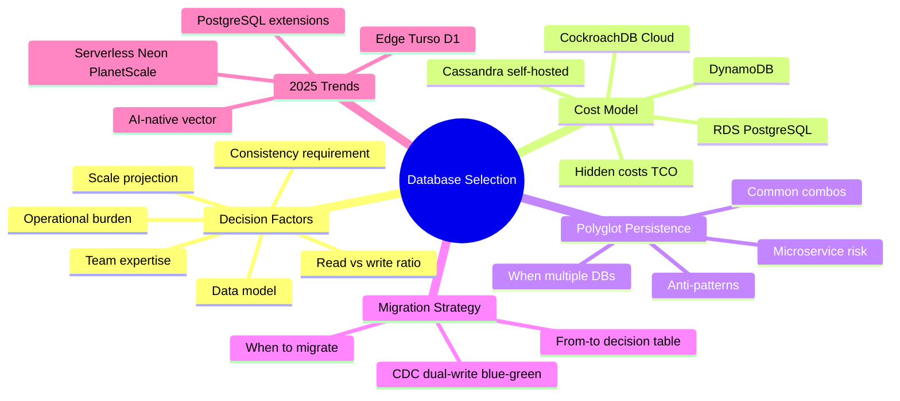
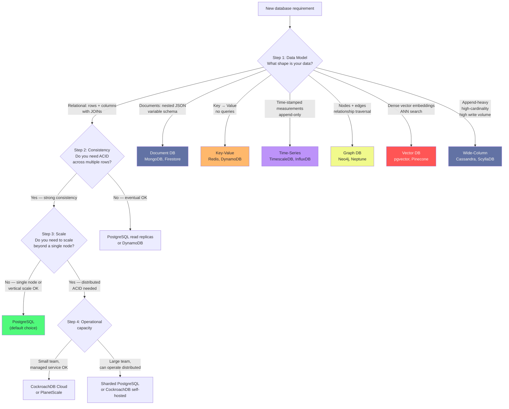
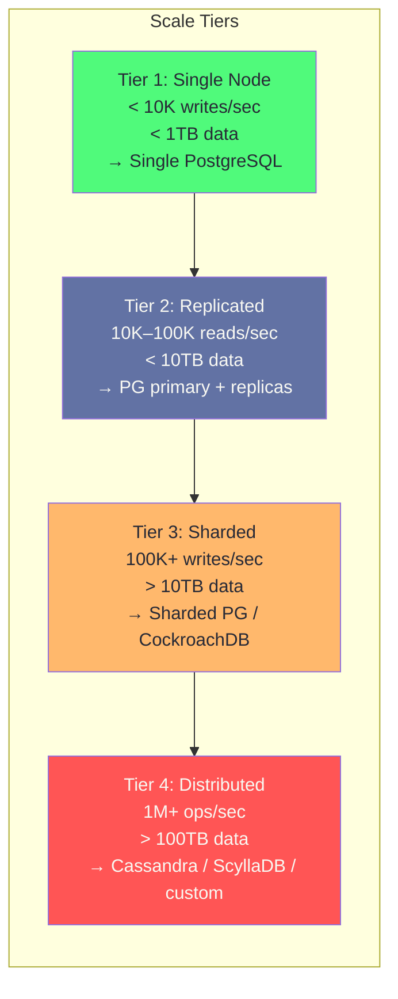
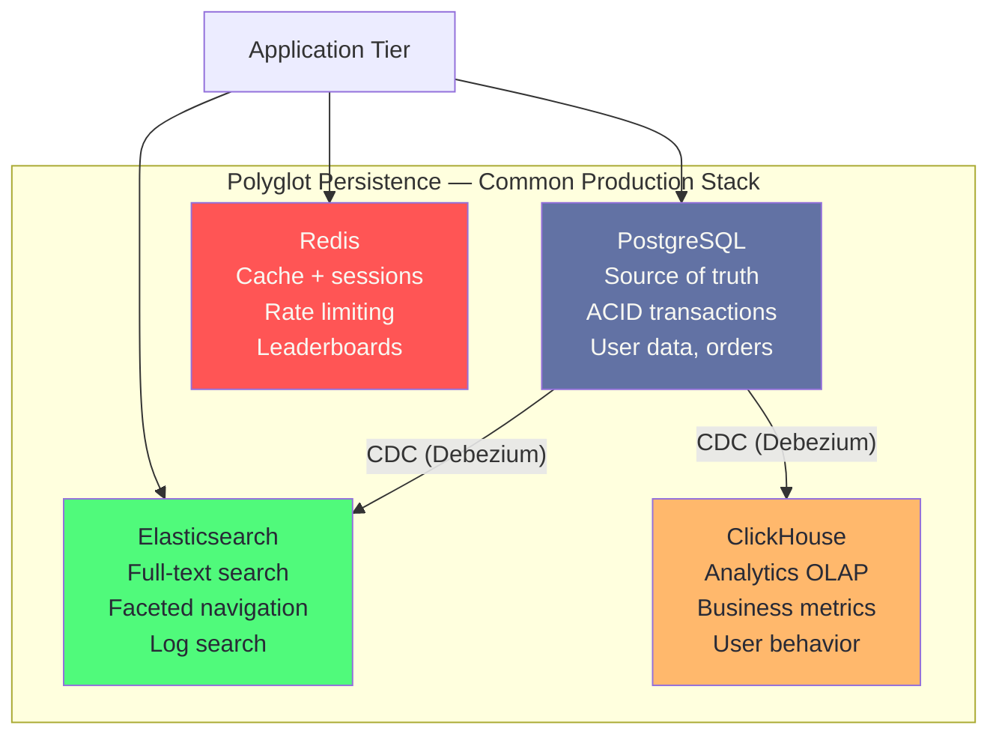
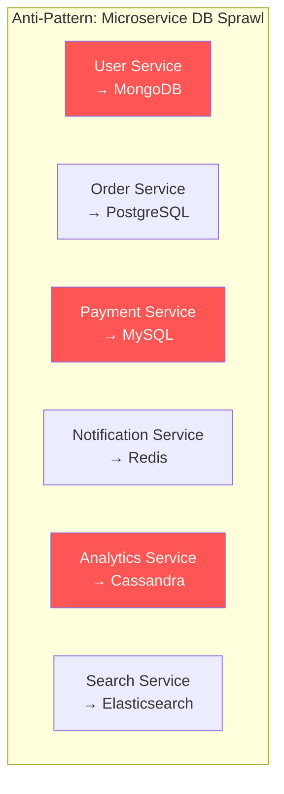
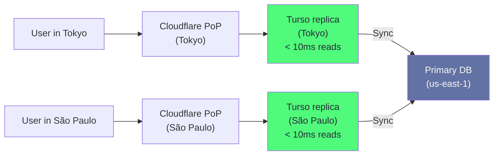
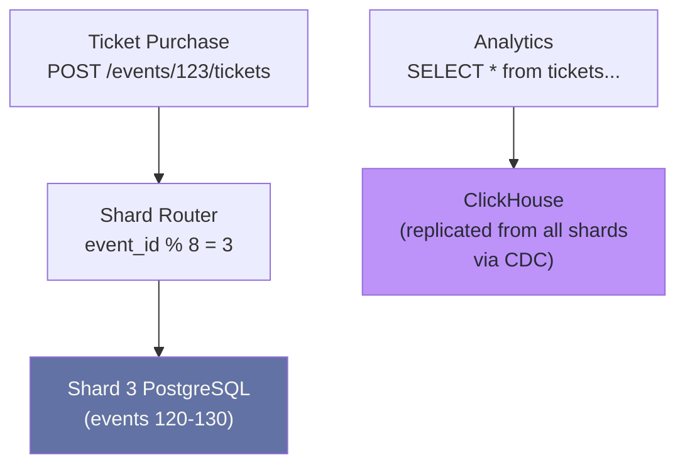

# Chapter 16: Database Selection Framework

> "There is no best database. There is only the right database for your access pattern, consistency requirement, and operational capacity."

## Mind Map



## The Decision Framework

Database selection is an architectural decision that is expensive to reverse. A startup that chooses MongoDB in year 1 and needs to migrate to PostgreSQL in year 3 faces weeks of engineering time, significant risk, and possible downtime — exactly the pattern Discord experienced in [Chapter 14](/database/part-4-real-world/ch14-discord-data-layer-evolution).

The framework below applies four sequential filters. Stop when you have a clear answer.



## Decision Factors: Priority Order

These five factors determine database selection in priority order. Do not skip a factor with a clear answer to reach a preferred answer.

### Factor 1: Consistency Requirement

| Consistency Need | Implication | Example |
|----------------|-------------|---------|
| **Strong (ACID)** | All writes must be immediately visible; no lost updates | Bank balance, inventory count, order state |
| **Read-your-writes** | A user sees their own writes immediately | Social media profile update |
| **Eventual** | Writes propagate eventually; brief inconsistency acceptable | Like counts, view counts, follower counts |
| **Causal** | Operations with causal dependency are ordered correctly | Comment threads, version history |

:::warning Consistency is Non-Negotiable for Financial Data
Never choose eventual consistency for data where inconsistency has monetary consequences. A user's account balance must use ACID transactions. "We'll reconcile later" has ended companies. Start with the consistency requirement and let it constrain your options — do not start with a preferred database and rationalize the consistency story.
:::

### Factor 2: Read/Write Ratio

| Pattern | Typical Ratio | Recommended Strategy |
|---------|--------------|---------------------|
| Read-heavy (content) | 100:1 reads | Primary + many read replicas; aggressive caching |
| Write-heavy (logging) | 1:100 reads | LSM store (Cassandra, ScyllaDB); avoid B-tree |
| Balanced (OLTP) | 10:1 reads | PostgreSQL or MySQL; PgBouncer pooling |
| Mixed OLTP + OLAP | Complex | Separate OLTP and OLAP stores; CDC pipeline |

Instagram's feed (100:1 read ratio) drove their aggressive denormalization and replica strategy, covered in [Chapter 13](/database/part-4-real-world/ch13-instagram-postgresql-at-scale). Discord's messages (heavily write-biased, append-only) drove the move to an LSM-based store in [Chapter 14](/database/part-4-real-world/ch14-discord-data-layer-evolution).

### Factor 3: Data Model

| Data Model | Best Fit | Do Not Use When |
|-----------|----------|-----------------|
| **Relational** | Structured, normalized, JOIN-heavy | Data has no natural foreign-key relationships |
| **Document** | Nested, variable schema, entity-centric | You need to query across entity boundaries |
| **Wide-column** | Append-heavy, high-cardinality partition key | You need random updates or row-level locking |
| **Key-Value** | O(1) lookup by known key, no range queries | You need to query by value or range scan |
| **Time-Series** | Monotonically increasing timestamp, same schema | Schema varies across measurements |
| **Graph** | Relationship traversal 3+ hops deep | Most queries access by node ID, not edge traversal |
| **Vector** | Semantic similarity, embedding-based retrieval | You need exact match, not approximate |

### Factor 4: Scale Projection

Scale projections should be **12-month forecasts**, not 10-year fantasies. Over-engineering for scale that never arrives wastes engineering effort and adds operational complexity that slows development.



**The most common mistake:** choosing Tier 3 or Tier 4 infrastructure for a Tier 1 workload. A startup processing 1,000 writes/day does not need Cassandra. A single PostgreSQL instance on a $100/month server handles this trivially and offers better ACID guarantees.

### Factor 5: Operational Burden

| Factor | Managed Cloud | Self-Hosted |
|--------|--------------|-------------|
| Setup time | Minutes | Days–weeks |
| Backup management | Automatic | Manual or scripted |
| Failover | Automatic | Manual + runbooks |
| Version upgrades | Managed | Manual, disruptive |
| Monthly cost | Higher (2–4×) | Lower |
| Control | Limited | Full |
| Team expertise needed | Low | High |

For teams with fewer than 5 engineers, managed databases (RDS, Cloud SQL, PlanetScale, Neon) almost always win on total engineering cost, even though the monthly bill is higher than self-hosted.

## Cost Comparison

Monthly cost estimates for a production workload: 1TB of data, 1,000 writes/sec, 10,000 reads/sec, single region.

| Option | Monthly Cost | Hidden Costs | TCO Notes |
|--------|-------------|--------------|-----------|
| **RDS PostgreSQL** (db.r6g.2xlarge) | ~$700/mo | Read replica +$700, backups +$100, data transfer | Predictable; managed failover included |
| **Aurora PostgreSQL** (Serverless v2) | ~$400–1,200/mo | Scales with ACU usage; I/O costs add up | Good for variable workloads; Aurora Global ~2× |
| **DynamoDB** (on-demand) | ~$500–1,500/mo | Read/write capacity units add up with variable load; GSI doubles cost | Ops-free; cost unpredictable at scale |
| **CockroachDB Cloud** (Dedicated) | ~$1,500/mo | Egress, cross-region replication | Distributed SQL; 3-node minimum |
| **Cassandra self-hosted** (3×c5.2xlarge) | ~$600/mo (EC2 only) | Ops time: 8–16h/month; expertise; monitoring | Cheapest at scale; high operational tax |
| **PlanetScale** (Business) | ~$400/mo | Branches free; connection limits on lower tiers | MySQL + Vitess; zero-downtime migrations |
| **Neon** (Pro) | ~$200/mo | Compute scales with usage; only PostgreSQL-compatible | Serverless PG; great for dev/test, growing for prod |

:::info The Hidden Cost of Self-Hosted
Self-hosted Cassandra at 3 nodes costs ~$600/month in EC2. But a senior engineer costs ~$200/hour. If Cassandra consumes 10 hours/month of SRE time (upgrades, tuning, incidents), the real cost is $600 + $2,000 = $2,600/month — more than CockroachDB Cloud's managed offering. Calculate Total Cost of Ownership, not just infrastructure cost.
:::

## Polyglot Persistence Patterns

### When to Use Multiple Databases

Polyglot persistence — using different databases for different workloads — is the right architecture when:

1. A workload has fundamentally different access patterns (OLTP vs. OLAP)
2. A workload requires capabilities absent from the primary database (full-text search, vector search)
3. A workload has different consistency requirements (ACID for transactions, eventual for caches)



### Common Production Combinations

| Use Case | Primary DB | Add-On DB | Reason |
|----------|-----------|-----------|--------|
| E-commerce | PostgreSQL | Redis + Elasticsearch | Cache product pages; search catalog |
| Messaging | Cassandra or ScyllaDB | Redis + PostgreSQL | LSM for messages; PG for user accounts |
| Ride-sharing | MySQL/Docstore | Redis + ClickHouse | Location cache; trip analytics |
| SaaS | PostgreSQL | Redis + pgvector | Cache sessions; AI semantic search |
| Gaming | Redis | PostgreSQL | Leaderboards in Redis; player data in PG |

### Anti-Pattern: Different DB Per Microservice

One dangerous pattern is assigning a different database technology to each microservice, justified by "each service should own its data store."



This pattern creates operational overhead proportional to the number of database technologies. Each requires separate expertise, monitoring, backup procedures, and incident runbooks. The result: a 6-person engineering team operating 6 different database systems, spending more time on database operations than on product features.

**Rule of thumb:** Until you have dedicated DBAs or SREs, use at most 2–3 database technologies: one OLTP store (PostgreSQL), one cache (Redis), and optionally one search engine (Elasticsearch or Typesense) or analytics store (ClickHouse).

## Migration Strategy Matrix

### When to Migrate

| Symptom | Likely Cause | Migration Target |
|---------|-------------|-----------------|
| P99 read latency > 500ms on simple queries | Index not in RAM; connection saturation | Add read replicas; add PgBouncer |
| Write throughput ceiling (~10K writes/sec) | Single primary bottleneck | Sharding or LSM-based store |
| Schema changes take hours | Large table ALTER TABLE | PlanetScale; pt-online-schema-change |
| ACID not required; writes dominate | Wrong data model | Cassandra / ScyllaDB |
| Need full-text search on large text | PostgreSQL tsvector not sufficient | Elasticsearch sidecar |
| Joins across millions of rows are slow | Denormalization needed or wrong DB | Denormalize schema; consider document store |

:::warning Never Migrate for the Wrong Reason
Common wrong reasons: "NoSQL is more scalable" (not always true; PostgreSQL scales to 100M+ rows), "MongoDB is more flexible" (JSONB in PostgreSQL offers equal flexibility), "everyone is using Cassandra" (without matching write volume). Always diagnose the specific bottleneck before choosing a migration target.
:::

### Migration Patterns

Three patterns cover most database migrations:

```mermaid
flowchart TD
    subgraph CDC["Pattern 1: CDC Migration"]
        C1["Source DB\n(production traffic)"]
        C1 -->|"Binlog / WAL"| CDC_Tool["Debezium / AWS DMS"]
        CDC_Tool -->|"Real-time replication"| C2["Target DB\n(receives all changes)"]
        C2 -->|"Cut-over when\nlag < 1 second"| C3["Traffic switched\nto target"]
    end

    subgraph DW["Pattern 2: Dual-Write"]
        D1["Application"]
        D1 -->|"Write to both"| D2["Source DB"]
        D1 -->|"Write to both"| D3["Target DB"]
        D3 -->|"Validate sample"| D4["Cut-over reads\nto target"]
    end

    subgraph BG["Pattern 3: Blue-Green"]
        B1["Blue: Source DB\n(live)"]
        B2["Green: Target DB\n(offline migration)"]
        B2 -->|"Full data copy\n+ CDC catch-up"| B3["Green becomes live\nBlue decommissioned"]
    end

    style C2 fill:#50fa7b,color:#282a36
    style D3 fill:#50fa7b,color:#282a36
    style B3 fill:#50fa7b,color:#282a36
```



| Pattern | Best For | Risk | Downtime |
|---------|----------|------|---------|
| **CDC** | Live databases; any size | Replication lag during cut-over | Near-zero |
| **Dual-Write** | Small-to-medium; when CDC unavailable | Write amplification; consistency window | Near-zero |
| **Blue-Green** | Large databases; full-fidelity copy | Long preparation time | Near-zero |

### From → To Decision Table

| From | To | Why | Pattern |
|------|-----|-----|---------|
| MongoDB | PostgreSQL | ACID needed; joins needed | CDC (Debezium) |
| MongoDB | Cassandra | Write volume exceeds MongoDB capacity | Dual-write + backfill |
| PostgreSQL (single) | PostgreSQL (sharded) | Write ceiling hit | Dual-write; shard by domain key |
| MySQL | PostgreSQL | JSON, JSONB, arrays; PostGIS needed | CDC (AWS DMS or pglogical) |
| Cassandra 3.x | ScyllaDB | JVM GC pauses; reduce node count | CQL-compatible; dual-write |
| Self-hosted | Cloud managed | Team too small for ops burden | Backup restore into managed service |
| Separate OLTP + OLAP | PostgreSQL + ClickHouse | Analytics degrading OLTP performance | CDC from OLTP → ClickHouse |

## 2025 Database Trends

### Trend 1: PostgreSQL Extensions Replace 80% of Specialized DBs

By 2025, PostgreSQL with extensions handles use cases that previously required separate databases:

| Extension | Replaces | Limitation |
|-----------|----------|-----------|
| **pgvector** + HNSW index | Pinecone, Weaviate (< 50M vectors) | ANN recall drops at > 50M; Pinecone wins above that |
| **TimescaleDB** | InfluxDB (< 50GB/day ingest) | InfluxDB 3.0 with Apache Arrow beats PG at high ingest rates |
| **PostGIS** | Dedicated geo DBs | Uber-scale real-time location still needs H3 + custom |
| **pg_search** (ParadeDB) | Elasticsearch (< 100M documents) | Elasticsearch still wins for complex relevance scoring |
| **Citus** | Custom sharding middleware | CockroachDB has better distributed transaction story |

The implication: **start with PostgreSQL + extensions**. Only migrate to a specialized system when you hit a measurable limit.

### Trend 2: Serverless Databases

Serverless databases scale to zero when idle and scale instantly under load. Relevant for development environments, variable-traffic applications, and startups:

| Product | Based On | Key Feature |
|---------|---------|-------------|
| **Neon** | PostgreSQL | Branching (copy-on-write database branches for dev/test) |
| **PlanetScale** | MySQL + Vitess | Schema branching; zero-downtime migrations |
| **Aurora Serverless v2** | MySQL/PostgreSQL | 0.5 ACU minimum; per-second billing |
| **Turso** | libSQL (SQLite fork) | Edge-distributed; 10ms reads from 35+ edge locations |
| **Cloudflare D1** | SQLite | Edge SQLite in Cloudflare Workers; zero ops |

:::info Serverless is Not for All Workloads
Serverless databases that scale to zero have cold-start latency (100–500ms for the first query after idle). For production APIs with consistent traffic, a reserved-instance database is cheaper and faster. Serverless shines for: staging environments, low-traffic microservices, development databases, and variable-traffic multi-tenant SaaS.
:::

### Trend 3: AI-Native Vector Storage

Every major database is adding vector support in 2024–2025:

| Database | Vector Support | Index Type | Notes |
|----------|---------------|-----------|-------|
| PostgreSQL + pgvector | Native extension | HNSW, IVFFlat | Best for < 50M vectors with ACID |
| MongoDB Atlas | Atlas Vector Search | HNSW | Combines document + vector in one system |
| Cassandra | DataStax Astra | SAI (Storage-Attached Index) | Cassandra-scale vector search |
| Redis | Redis Vector Similarity | HNSW, FLAT | In-memory; low latency |
| DynamoDB | Not native | — | Requires separate vector layer |

The trend: **vector search is becoming a primitive** in every database, not a specialized system. For new applications, start with PostgreSQL + pgvector unless you project > 50 million embeddings with < 100ms p99 ANN latency.

### Trend 4: Edge Databases

Applications running at the network edge (CDN PoPs, Cloudflare Workers, Fastly Compute) need databases that can respond locally:



Edge databases accept eventual consistency (reads from local replica may lag primary by 100–500ms) in exchange for sub-10ms read latency globally.

## Case Study: Database Selection from Startup to Scale

This case study applies every framework principle to a single application evolving from MVP to 10M users.

**Application:** "EventFlow" — an event ticketing platform where users discover events, purchase tickets, and receive real-time venue updates.

### MVP Phase (0–10K users)

**Requirement:** Manage events, tickets, users, and payments. Consistency is critical (ticket oversell = product failure). Team: 3 engineers.

**Decision:** PostgreSQL on RDS (db.t4g.medium, $50/month).

```sql
-- EventFlow MVP schema (single PostgreSQL database)
CREATE TABLE events (
    id           BIGSERIAL PRIMARY KEY,
    name         TEXT NOT NULL,
    venue_id     BIGINT REFERENCES venues(id),
    start_time   TIMESTAMPTZ NOT NULL,
    capacity     INT NOT NULL,
    tickets_sold INT NOT NULL DEFAULT 0
);

-- Prevent oversell with optimistic locking
UPDATE events
SET tickets_sold = tickets_sold + 1
WHERE id = ? AND tickets_sold < capacity
RETURNING id;
-- If 0 rows updated: sold out
```

No Redis, no Elasticsearch, no message queue. YAGNI.

### Growth Phase (10K–500K users)

**Symptom:** Event pages load slowly during high-traffic launches. Database CPU spikes to 90% on event release day.

**Decision:** Add Redis for hot event data and a read replica for search.

```python
# Cache hot event data with 60-second TTL
def get_event(event_id: int) -> Event:
    cached = redis.get(f"event:{event_id}")
    if cached:
        return Event.from_json(cached)

    event = db.query("SELECT * FROM events WHERE id = %s", [event_id])
    redis.setex(f"event:{event_id}", 60, event.to_json())
    return event
```

Also add Elasticsearch for event discovery (search by name, location, category). Sync via Debezium CDC from PostgreSQL.

### Scale Phase (500K–10M users)

**Symptom:** Ticket purchase writes during major events (10K tickets/second during Taylor Swift release) overwhelm the single PostgreSQL primary.

**Decision:** Shard tickets table by `event_id`. Events table remains on unsharded PostgreSQL (it is read-mostly and fits on one machine).



Final architecture at 10M users:

| Component | Database | Purpose |
|-----------|---------|---------|
| User accounts, events | PostgreSQL (single) | ACID, normalized |
| Ticket purchases | PostgreSQL (sharded × 8 by event_id) | Write throughput |
| Session cache | Redis | Sub-ms session lookup |
| Event discovery | Elasticsearch | Full-text + geo search |
| Analytics | ClickHouse | Business intelligence |

**Key insight:** The architecture grew incrementally to match actual load. Starting with the Scale Phase architecture at MVP would have taken 3× longer to build and introduced operational complexity that slowed the team down.

## Summary Checklist

Before finalizing any database selection decision:

- [ ] What is the exact access pattern? (key lookup, range scan, full-text, geospatial, graph traversal)
- [ ] What consistency level is required? (ACID, read-your-writes, eventual)
- [ ] What is the 12-month write volume projection?
- [ ] What is the read/write ratio?
- [ ] Does the team have operational expertise for this database?
- [ ] Is a managed service available that reduces operational burden?
- [ ] Have you tried to solve the problem with PostgreSQL + extensions first?
- [ ] If choosing a specialized database, what is the migration path back if requirements change?

## Related Chapters

| Chapter | Relevance |
|---------|-----------|
| [Ch01 — Database Landscape](/database/part-1-foundations/ch01-database-landscape) | The full taxonomy of database categories this framework navigates |
| [Ch04 — Transactions & Concurrency](/database/part-1-foundations/ch04-transactions-concurrency-control) | Consistency models that drive the first decision factor |
| [Ch09 — Replication & High Availability](/database/part-3-operations/ch09-replication-high-availability) | Replication strategies for the growth phase |
| [Ch10 — Sharding & Partitioning](/database/part-3-operations/ch10-sharding-partitioning) | Sharding options for the scale phase |
| [Ch13 — Instagram: PostgreSQL at Scale](/database/part-4-real-world/ch13-instagram-postgresql-at-scale) | PostgreSQL sharding in production |
| [Ch14 — Discord: Data Layer Evolution](/database/part-4-real-world/ch14-discord-data-layer-evolution) | Case study of a migration driven by wrong initial choice |
| [Ch15 — Uber: Geospatial Design](/database/part-4-real-world/ch15-uber-geospatial-database-design) | Custom database engineering for geospatial requirements |

## Practice Questions

### Beginner

1. **Framework Application:** A startup is building a recipe sharing app. Users can search recipes by ingredient, cuisine, and dietary restriction. Recipes have a flexible set of tags. The team has 2 engineers and expects 50,000 active users in year 1. Walk through the decision framework and choose a database (or combination). Justify each step.

   <details>
   <summary>Model Answer</summary>
   Step 1 (Data model): Recipes are structured but have flexible tags — JSONB in PostgreSQL handles this. Step 2 (Consistency): Saving a recipe must be consistent but like counts can be eventual. Step 3 (Scale): 50K users is Tier 1 — a single PostgreSQL instance easily handles this. Step 4 (Ops): 2 engineers should use managed RDS. Result: PostgreSQL on RDS, with a tsvector index or pg_search for ingredient search. No separate Elasticsearch — you'd add it only if search performance becomes a measurable problem.
   </details>

2. **Cost Trade-off:** A 3-engineer startup uses self-hosted Cassandra (3 nodes on EC2) at $600/month. The team spends 12 hours/month on Cassandra operations (upgrades, incidents, tuning). Their senior engineers bill at $200/hour. What is the true monthly TCO? How does this compare to CockroachDB Cloud at $1,500/month?

   <details>
   <summary>Model Answer</summary>
   TCO = $600 (infrastructure) + 12 × $200 (engineering time) = $600 + $2,400 = $3,000/month. CockroachDB Cloud at $1,500/month is 50% cheaper in true TCO and frees 12 engineering hours for product development. The infrastructure line item is misleading; always include operations time.
   </details>

### Intermediate

3. **Polyglot Decision:** An e-commerce team runs PostgreSQL for orders and user data. They want to add: (a) product search with faceting and typo-tolerance, (b) session management for 1M concurrent users, (c) real-time inventory counts visible across all users within 1 second. Design a polyglot architecture. For each addition, choose a database and justify. What consistency model does each use?

   <details>
   <summary>Model Answer</summary>
   (a) Elasticsearch or Typesense for product search — synced via CDC from PostgreSQL. Eventual consistency (search index lags writes by 100–500ms). (b) Redis for sessions — in-memory key-value at sub-millisecond latency. Eventual (Redis replication is asynchronous). (c) Inventory is trickier — requires strong consistency to prevent oversell. Keep inventory in PostgreSQL with row-level locking or optimistic concurrency (`WHERE inventory > 0`). Cache the display count in Redis with short TTL (5–10 seconds) — riders see "available" while true count is in PostgreSQL.
   </details>

4. **Migration Planning:** A team runs a MongoDB-backed application with 500M documents in a `messages` collection. They need to migrate to Cassandra for write throughput. Design the dual-write migration: what does the application code change look like during migration? How do you handle documents that exist in MongoDB but haven't been migrated to Cassandra yet? How do you validate completeness?

   <details>
   <summary>Model Answer</summary>
   Phase 1 (dual-write): Application writes to both MongoDB (old) and Cassandra (new). Read from Cassandra first; fall back to MongoDB if missing. Phase 2 (backfill): A background job reads all MongoDB documents in chunks and writes to Cassandra. Track progress with a cursor on `_id`. Phase 3 (validate): Sample 1% of documents, compare checksums in both stores. Alert if mismatch > 0.01%. Phase 4 (cut-over): Stop writing to MongoDB. Phase 5 (decommission): After 2 weeks of successful operation, delete MongoDB collection. Edge case: updates to documents during backfill — dual-write ensures Cassandra always has the latest version; the backfill can overwrite with the MongoDB version safely since dual-write already sent the latest version.
   </details>

### Advanced

5. **Comprehensive Architecture:** Design the full database architecture for a global ride-sharing startup planning to launch in 5 cities, targeting 500K rides in year 1 and 10M rides in year 3. Include: user accounts, driver accounts, trip records, real-time driver locations, analytics, and event notifications. For each data type: choose a database, justify the choice, identify the partition/shard key, and describe the consistency model. Show how data flows between the databases.

   <details>
   <summary>Model Answer</summary>
   Year 1 (MVP): Single PostgreSQL for user/driver/trip data (ACID required). Redis for driver locations (key = driver_id, TTL = 8s). No analytics DB yet — query PostgreSQL with read replica. Year 3 (Scale): Add H3-based location lookup in Redis (partition by H3 cell). Shard trips table by city_id (5 shards). Add ClickHouse for analytics (CDC from PostgreSQL shards via Debezium + Kafka). Add PostgreSQL read replicas per region for driver/user profile reads. The data flow: App → PostgreSQL (OLTP) → Kafka (CDC) → ClickHouse (OLAP) + Elasticsearch (search). Driver pings → Kafka (location.updates) → Redis (H3 cells, TTL 8s). Key insight: the architecture at year 1 and year 3 differ significantly — don't build year 3 architecture at year 1. The transition points are measurable (specific latency thresholds, QPS ceilings) not arbitrary timelines.
   </details>

## References

- [Architecture Haiku: PostgreSQL as a Platform](https://www.figma.com/blog/how-figma-scaled-to-multiple-databases/) — Figma Engineering Blog (2020)
- [Stripe's Approach to Payments Infrastructure](https://stripe.com/blog/payment-api-design) — Stripe Engineering Blog
- [Shopify's Database Architecture at Scale](https://engineering.shopify.com/blogs/engineering/horizontally-scaling-the-rails-backend-of-shop-app-with-vitess) — Shopify Engineering Blog (2020)
- [Neon: Serverless PostgreSQL](https://neon.tech/blog/architecture-decisions-in-neon) — Neon Architecture Blog
- [H3: Uber's Hexagonal Hierarchical Spatial Index](https://www.uber.com/blog/h3/) — Uber Engineering Blog (2018)
- [PlanetScale: Schema Change Management](https://planetscale.com/blog/how-online-schema-change-tools-work) — PlanetScale Engineering Blog
- [ClickHouse Performance Overview](https://clickhouse.com/docs/en/introduction/performance/) — ClickHouse Documentation
- [The CAP Theorem Explained](https://www.infoq.com/articles/cap-twelve-years-later-how-the-rules-have-changed/) — Eric Brewer, IEEE Computer (2012)
- ["Designing Data-Intensive Applications"](https://dataintensive.net/) — Kleppmann, Chapter 1 (Reliable, Scalable, Maintainable)
- ["Database Reliability Engineering"](https://www.oreilly.com/library/view/database-reliability-engineering/9781491925935/) — Campbell & Majors, O'Reilly
