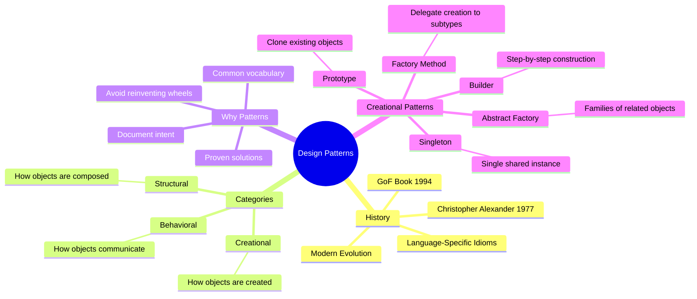
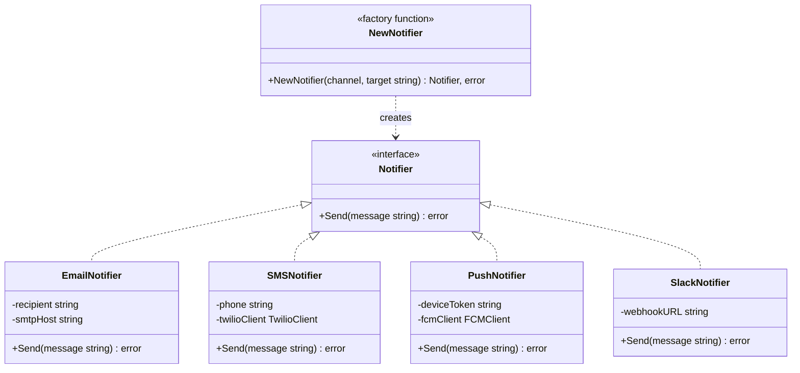
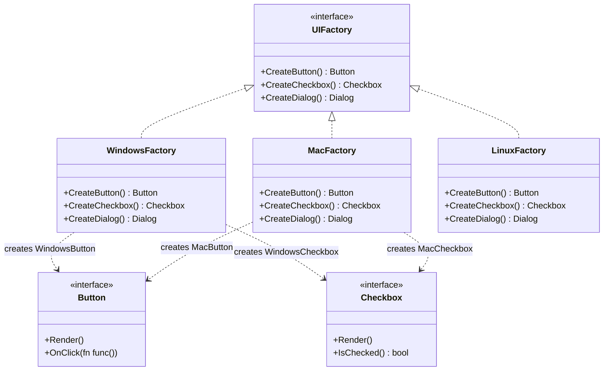
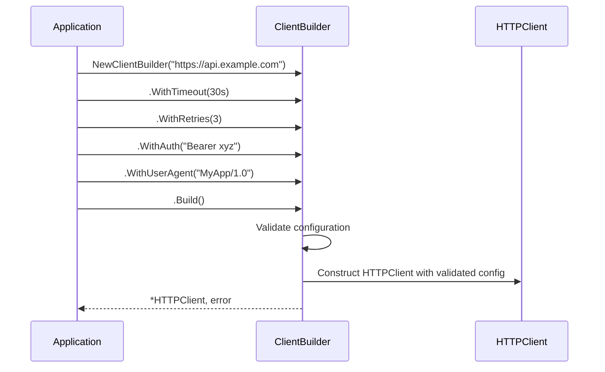
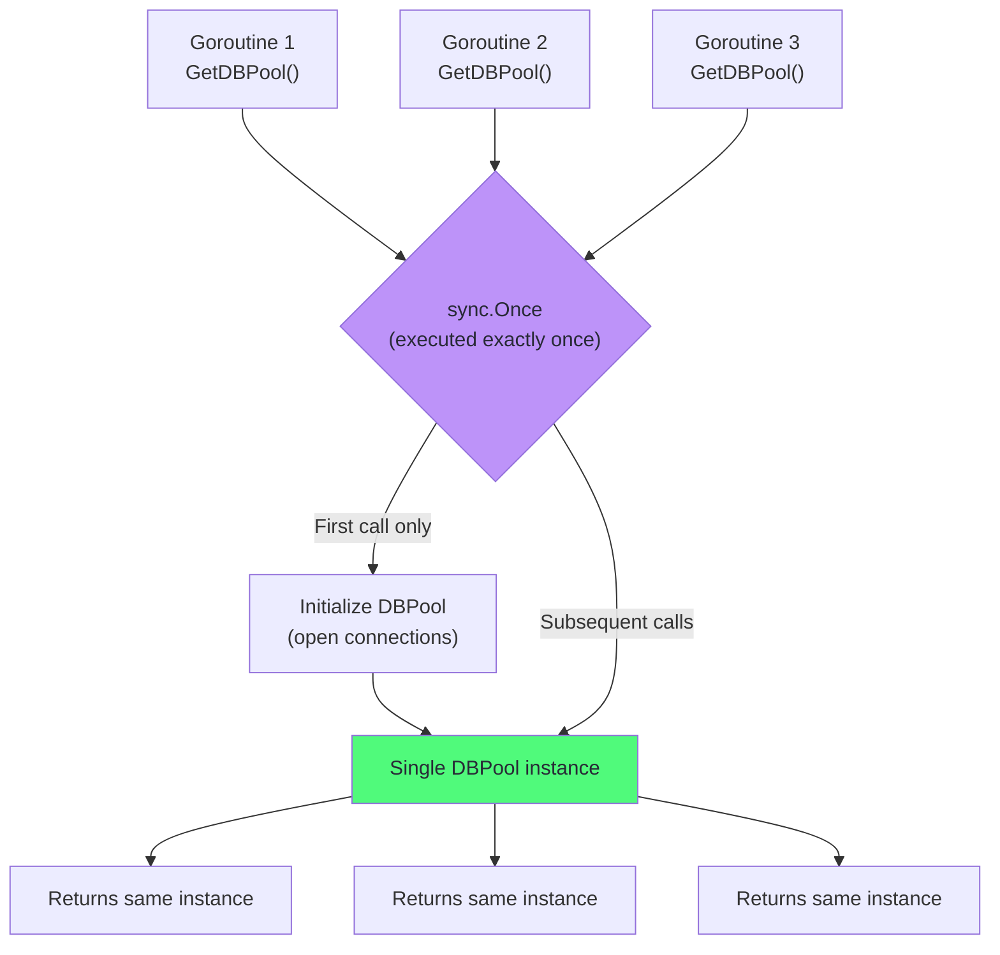
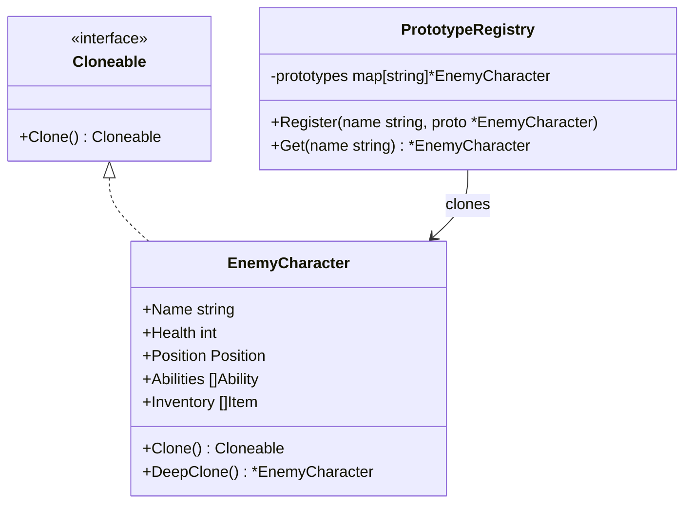
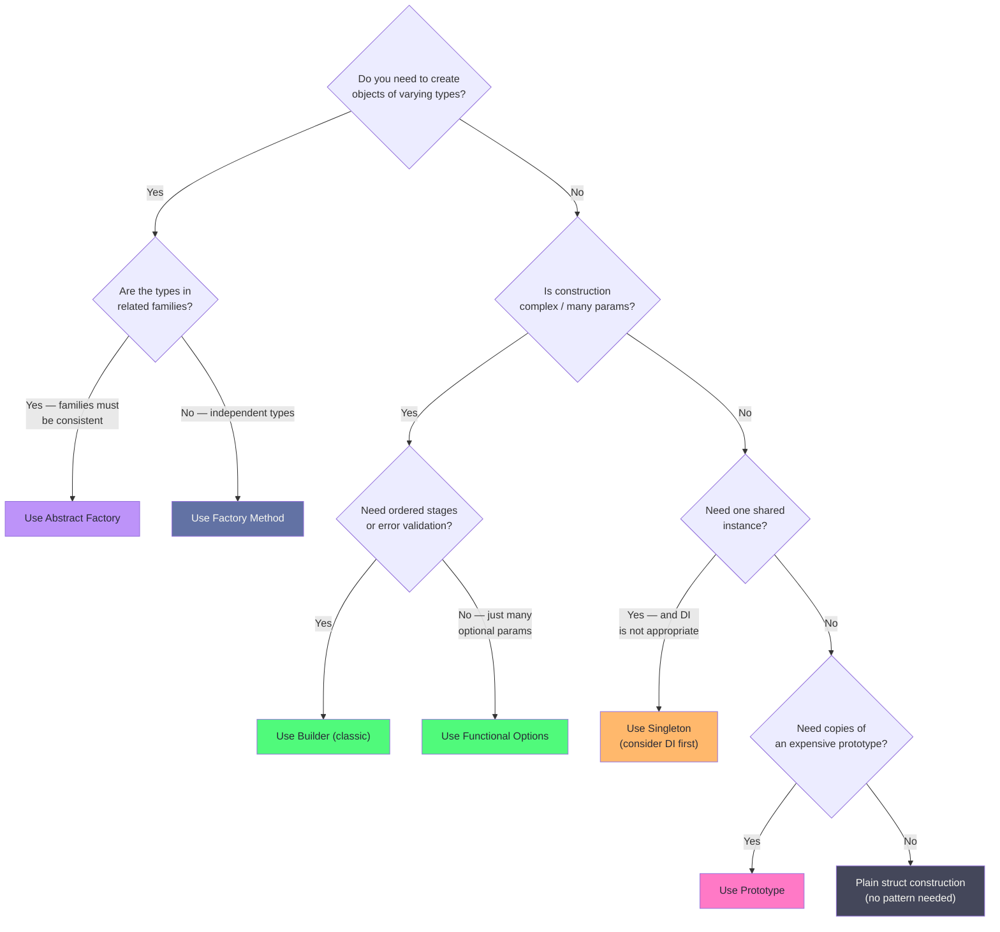

# Chapter 1: Foundations & Creational Patterns

## Mind Map



## Overview

Design patterns are reusable solutions to recurring software design problems. They are not code you copy-paste — they are conceptual blueprints, a shared vocabulary for engineers to communicate design intent concisely. When a senior engineer says "use a Factory here," they mean a specific, well-understood structural approach with known trade-offs.

This chapter establishes the foundations — what patterns are, where they came from, and how to evaluate whether one actually helps — then covers all five **creational patterns**: the group focused on how objects are constructed and composed.

---

## Section 1: What Are Design Patterns?

### Definition

A design pattern is a named, generalized solution to a recurring class of design problem. The key word is *recurring* — if you keep solving the same structural problem independently across projects, a pattern captures that solution once, gives it a name, and documents its trade-offs.

Think of architectural blueprints. Architects worldwide face recurring challenges: how to build load-bearing walls, how to handle drainage, how to frame a doorway. They do not reinvent structural engineering from scratch each time. They apply proven patterns. Christopher Alexander captured this insight in his 1977 book *A Pattern Language* (about actual buildings), and software engineers adapted the idea in the Gang of Four's seminal 1994 book *Design Patterns: Elements of Reusable Object-Oriented Software*.

### What Patterns Are NOT

- **Not a library or framework** — you cannot `import "patterns"`. You implement the structural concept in your own codebase.
- **Not an algorithm** — an algorithm solves a computational problem (sort these items). A pattern solves a structural/organizational problem (how should these components relate to each other?).
- **Not always necessary** — this is critical. A pattern applied where simple code would work is over-engineering. We address this directly in every pattern's "When NOT to use" section.

### The Gang of Four (GoF)

Erich Gamma, Richard Helm, Ralph Johnson, and John Vlissides published *Design Patterns* in 1994, cataloguing 23 patterns organized into three categories. It became one of the best-selling programming books of all time. The patterns were originally documented in C++ and Smalltalk, but the structural concepts translate to any object-oriented language — including Go, with some idiomatic adaptations.

### Three Pattern Categories

| Category | Question Answered | Examples |
|----------|------------------|---------|
| **Creational** | How are objects created? | Factory, Builder, Singleton |
| **Structural** | How are objects composed? | Adapter, Decorator, Proxy |
| **Behavioral** | How do objects communicate? | Observer, Strategy, Command |

This chapter covers Creational. Structural and Behavioral follow in Chapters 2 and 3.

---

## Section 2: Why Patterns Matter (and When They Don't)

### The Case For Patterns

**Common vocabulary.** When a pull request comment says "this should be a Strategy pattern," every engineer on the team immediately understands the proposed structure — without a lengthy explanation. Patterns compress communication.

**Proven solutions.** These solutions have been stress-tested across thousands of codebases over decades. They encode lessons learned from real failures. Using a known pattern means you inherit that accumulated wisdom.

**Documented trade-offs.** Every pattern has known strengths and weaknesses. When you name the pattern you used, you also communicate the trade-offs you accepted. New engineers joining the project can look up the pattern and immediately understand the design intent and its limitations.

**Design language for reviews.** Code review becomes more productive when reviewers can reference patterns. "This is a leaky Singleton — consider using dependency injection instead" is a far more actionable comment than "this global variable seems problematic."

### The Case Against Forced Patterns

> "Make it work in v1.0, refactor with patterns in v2.0." — Refactoring.Guru philosophy

Patterns solve *specific* problems. Applying them without the corresponding problem is over-engineering. Signs you are forcing a pattern:

- You cannot clearly articulate the specific problem it solves
- The code with the pattern is longer and harder to understand than without it
- You are implementing the pattern "because it's best practice"
- Simple functions and structs would accomplish the same goal with less code

**YAGNI applies here**: if you do not have the specific flexibility problem a pattern solves, you are paying the complexity cost without receiving the benefit. The "When NOT to use" section in each pattern is as important as the "When to use" section — read both.

---

## Section 3: Pattern Template

Every pattern in this handbook follows the same structure so you can predict exactly what to expect and locate what you need quickly:

1. **Real-world analogy** — a non-code metaphor that builds intuition
2. **The problem** — a concrete code scenario, not abstract theory
3. **Solution** — Mermaid diagram showing the structure
4. **Go code** — BEFORE (the messy version) → AFTER (with pattern applied)
5. **When to use** — specific conditions where this pattern earns its complexity
6. **When NOT to use** — equally important; when to reach for simpler code
7. **Real-world usage** — where you see this pattern in Go stdlib and popular libraries
8. **Related patterns** — cross-references and when to consider alternatives

---

## Pattern 1: Factory Method

### Real-World Analogy

You walk into a restaurant and order "a burger." You do not specify which chef cooks it, which specific recipe variant they use, or what kitchen equipment they employ. The restaurant (the factory) decides all of that internally. You just get a burger — and the burger conforms to an expected interface: it fits in your hands, it has a bun, it is edible.

The Factory Method works the same way: callers request an object by type without knowing — or caring — about the specific implementation details of its construction.

### The Problem

You are building a notification system. Initially it supports Email. Six months later: SMS. Then Push notifications. Then Slack. Each time you add a channel, you modify the core dispatch function:

```go
// BEFORE: Rigid if/else chain — open/closed principle violation
func SendNotification(channel string, msg string, target string) error {
    if channel == "email" {
        client := smtp.NewClient(smtpHost, smtpPort)
        // configure TLS, authentication, etc.
        return client.SendMail(target, msg)
    } else if channel == "sms" {
        twilioClient := twilio.NewRestClient()
        // configure credentials, phone number formatting, etc.
        return twilioClient.Messages.Create(target, msg)
    } else if channel == "push" {
        fcmClient := firebase.NewClient(ctx, option.WithCredentialsFile("creds.json"))
        // configure device tokens, payload formatting, etc.
        return fcmClient.Send(ctx, &messaging.Message{Token: target, Body: msg})
    }
    // To add Slack: modify this function, re-test everything, re-deploy
    return fmt.Errorf("unknown channel: %s", channel)
}
```

Every new channel requires touching — and re-testing — existing code. This function becomes a maintenance burden and a source of regressions.

### Solution



### Go Code — AFTER

```go
// notifier.go

package notify

import "fmt"

// Notifier is the common interface all channel implementations satisfy.
// Callers depend only on this interface — never on concrete types.
type Notifier interface {
    Send(message string) error
}

// EmailNotifier sends messages via SMTP.
type EmailNotifier struct {
    recipient string
    smtpHost  string
    smtpPort  int
}

func (e EmailNotifier) Send(message string) error {
    // SMTP implementation details isolated here
    fmt.Printf("[EMAIL] To: %s | Message: %s\n", e.recipient, message)
    return nil
}

// SMSNotifier sends messages via Twilio.
type SMSNotifier struct {
    phone string
}

func (s SMSNotifier) Send(message string) error {
    fmt.Printf("[SMS] To: %s | Message: %s\n", s.phone, message)
    return nil
}

// PushNotifier sends Firebase Cloud Messaging notifications.
type PushNotifier struct {
    deviceToken string
}

func (p PushNotifier) Send(message string) error {
    fmt.Printf("[PUSH] Token: %s | Message: %s\n", p.deviceToken, message)
    return nil
}

// SlackNotifier posts to a Slack webhook — added without touching existing code.
type SlackNotifier struct {
    webhookURL string
}

func (sl SlackNotifier) Send(message string) error {
    fmt.Printf("[SLACK] Webhook: %s | Message: %s\n", sl.webhookURL, message)
    return nil
}

// NewNotifier is the factory function. It centralizes the creation decision.
// Adding a new channel means adding a case here — existing cases are untouched.
func NewNotifier(channel string, target string) (Notifier, error) {
    switch channel {
    case "email":
        return EmailNotifier{recipient: target, smtpHost: "smtp.example.com", smtpPort: 587}, nil
    case "sms":
        return SMSNotifier{phone: target}, nil
    case "push":
        return PushNotifier{deviceToken: target}, nil
    case "slack":
        return SlackNotifier{webhookURL: target}, nil
    default:
        return nil, fmt.Errorf("unknown notification channel: %q", channel)
    }
}

// Usage: callers never import EmailNotifier, SMSNotifier, etc.
// They only see the Notifier interface.
func DispatchAlert(channel, target, message string) error {
    n, err := NewNotifier(channel, target)
    if err != nil {
        return fmt.Errorf("creating notifier: %w", err)
    }
    return n.Send(message)
}
```

Adding a `WhatsAppNotifier` requires: (1) create the struct, (2) add one `case "whatsapp"` line. Zero changes to `DispatchAlert` or any calling code.

### When to Use

- Object creation logic varies by type and you want to centralize that variation
- Callers should not know or depend on concrete implementation types
- You anticipate adding new variants without modifying existing dispatch code
- You want to enforce a consistent interface across a family of related types

### When NOT to Use

- You have 1–2 types that will realistically never change — a switch statement inline is simpler
- The construction logic is trivial (one-line struct literal) — a factory adds indirection without benefit
- You need to inject dependencies into the factory itself — consider Abstract Factory instead
- You are writing a small script or CLI tool — the OCP benefit is irrelevant at that scale

### Real-World Usage in Go

- `sql.Open(driverName, dataSourceName)` — returns a `*sql.DB` regardless of which database driver is registered (MySQL, PostgreSQL, SQLite, etc.)
- `log/slog.New(handler)` — handler parameter uses factory-style selection of output format
- `net/http` transport selection — different transport implementations behind the same `http.RoundTripper` interface
- `io.Writer` variants — `os.Stdout`, `bytes.Buffer`, `bufio.Writer` all satisfy the same interface; callers use factory functions to get one

### Related Patterns

| Pattern | Relationship |
|---------|-------------|
| **Abstract Factory** | Factory Method creates one product; Abstract Factory creates families of related products |
| **Builder** | Use Builder when construction is complex and multi-step; Factory Method when creation is single-step but type varies |
| **Strategy** | Strategy selects algorithm at runtime; Factory Method selects implementation at construction time |

---

## Pattern 2: Abstract Factory

### Real-World Analogy

You walk into IKEA and decide on the "STOCKHOLM" collection (Modern Scandinavian style). Once you commit to that collection, every piece you pick — the coffee table, the sofa, the bookshelf — is guaranteed to be visually consistent because they all come from the same coordinated product family. You cannot accidentally mix a baroque armchair with your minimalist collection. The showroom (abstract factory) guarantees family coherence.

### The Problem

You are building a cross-platform desktop UI toolkit. You need `Button`, `Checkbox`, and `Dialog` components. The problem: these components must look and behave consistently per operating system. A Windows Button has a specific visual style and keyboard behavior. A macOS Button has different borders, focus rings, and animations. Mixing platform styles in the same window looks wrong and violates OS conventions.

```go
// BEFORE: Platform checks scattered throughout the application
func CreateLoginForm(os string) {
    var btn Button
    var chk Checkbox

    // Same platform check duplicated everywhere a widget is created
    if os == "windows" {
        btn = WindowsButton{}
        chk = WindowsCheckbox{}
    } else if os == "macos" {
        btn = MacButton{}
        chk = MacCheckbox{}
    }

    // If you add Linux, you modify every single creation site
    // If WindowsButton and WindowsCheckbox drift out of sync — visual bug
}
```

### Solution



### Go Code — AFTER

```go
// ui_factory.go

package ui

import "runtime"

// ---- Product interfaces ----

type Button interface {
    Render()
    SetLabel(label string)
}

type Checkbox interface {
    Render()
    IsChecked() bool
}

// ---- Abstract Factory interface ----

// UIFactory guarantees that all products from one factory belong to the same family.
// Client code uses only this interface — never concrete factories directly.
type UIFactory interface {
    CreateButton() Button
    CreateCheckbox() Checkbox
}

// ---- Windows family ----

type WindowsButton struct{ label string }

func (b *WindowsButton) Render()           { /* Windows-specific rendering */ }
func (b *WindowsButton) SetLabel(l string) { b.label = l }

type WindowsCheckbox struct{ checked bool }

func (c *WindowsCheckbox) Render()        { /* Windows-specific rendering */ }
func (c *WindowsCheckbox) IsChecked() bool { return c.checked }

type WindowsFactory struct{}

func (f WindowsFactory) CreateButton() Button   { return &WindowsButton{} }
func (f WindowsFactory) CreateCheckbox() Checkbox { return &WindowsCheckbox{} }

// ---- macOS family ----

type MacButton struct{ label string }

func (b *MacButton) Render()           { /* macOS-specific rendering */ }
func (b *MacButton) SetLabel(l string) { b.label = l }

type MacCheckbox struct{ checked bool }

func (c *MacCheckbox) Render()        { /* macOS-specific rendering */ }
func (c *MacCheckbox) IsChecked() bool { return c.checked }

type MacFactory struct{}

func (f MacFactory) CreateButton() Button   { return &MacButton{} }
func (f MacFactory) CreateCheckbox() Checkbox { return &MacCheckbox{} }

// ---- Factory selector ----

// GetUIFactory selects the correct factory based on runtime environment.
// This is the single place where platform detection lives.
func GetUIFactory() UIFactory {
    switch runtime.GOOS {
    case "windows":
        return WindowsFactory{}
    case "darwin":
        return MacFactory{}
    default:
        return WindowsFactory{} // fallback
    }
}

// ---- Application code ----

// Application only depends on UIFactory and the product interfaces.
// It has no knowledge of Windows or Mac concrete types.
type LoginForm struct {
    factory  UIFactory
    button   Button
    remember Checkbox
}

func NewLoginForm(factory UIFactory) *LoginForm {
    f := &LoginForm{factory: factory}
    f.button = factory.CreateButton()
    f.button.SetLabel("Sign In")
    f.remember = factory.CreateCheckbox()
    return f
}

func (f *LoginForm) Render() {
    f.button.Render()
    f.remember.Render()
}
```

Adding a `LinuxFactory` requires: create the Linux product structs and the `LinuxFactory` struct, add one `case "linux"` in `GetUIFactory`. Zero changes to `LoginForm` or any other application code.

### When to Use

- You need families of related objects that must be used together consistently
- The system needs to be independent of how its products are created and composed
- You want to enforce product family consistency (prevent mixing Windows and Mac widgets)
- You have multiple product families and need to switch between them at runtime or configuration time

### When NOT to Use

- You only have one product family — regular Factory Method is simpler
- Products within the "family" are not actually related or used together
- You are adding products frequently — adding a new product type requires modifying every factory interface and all implementations
- The family invariant is not important — if mixing styles is acceptable, a plain Factory Method per product is simpler

### Real-World Usage in Go

- **`database/sql` driver system** — different drivers (`mysql`, `postgres`, `sqlite3`) each produce compatible `*sql.DB`, `*sql.Stmt`, `*sql.Rows` objects. The driver acts as an Abstract Factory producing a family of consistent database interaction objects.
- **`testing` package mocks** — mock frameworks generate families of related mock objects (MockDB, MockCache, MockQueue) that share consistent test behavior through a factory
- **`net/http` transport + TLS** — creating an HTTPS client requires coordinated selection of `Transport`, `TLSConfig`, and timeout settings — an abstract factory pattern in practice

### Related Patterns

| Pattern | Relationship |
|---------|-------------|
| **Factory Method** | Abstract Factory is often implemented using Factory Methods internally |
| **Builder** | Abstract Factory creates families; Builder builds one complex object step by step |
| **Prototype** | Abstract Factory can use Prototype to create products by cloning prototypes rather than constructing fresh |

---

## Pattern 3: Builder

### Real-World Analogy

At Subway, you build your sandwich step by step: choose bread, choose protein, add cheese, add vegetables, choose sauce, toast or not. The sandwich artist (builder) guides you through each step, applies your choices, and produces a valid sandwich at the end. You cannot accidentally skip bread entirely or apply sauce before the bread is chosen — the process has structure. If you want the same sandwich next time, you can specify the same steps without caring about the exact implementation details of "add jalapeños."

### The Problem

Complex objects with many optional parameters break down in two ways:

**Telescoping constructors** — multiply constructors for every common combination:

```go
// BEFORE: Constructor with too many parameters
func NewHTTPClient(
    baseURL string,
    timeout time.Duration,
    maxRetries int,
    followRedirects bool,
    transport *http.Transport,
    authToken string,
    userAgent string,
    enableCompression bool,
    skipTLSVerify bool,
) *HTTPClient {
    // What do the two booleans mean? Which order are they in?
    // Callers make mistakes. Code is unreadable at call sites.
}

// Call site — what do false, nil, "", true, false mean?
client := NewHTTPClient(
    "https://api.example.com",
    30*time.Second,
    3,
    true,
    nil,
    "Bearer xyz123",
    "MyApp/1.0",
    true,
    false,
)
```

This is unreadable. Adding a 10th parameter breaks every call site.

### Solution



### Go Code — AFTER (Classic Builder)

```go
// http_client_builder.go

package httpclient

import (
    "errors"
    "net/http"
    "time"
)

// HTTPClient is the complex object being built.
type HTTPClient struct {
    baseURL          string
    timeout          time.Duration
    maxRetries       int
    followRedirects  bool
    authToken        string
    userAgent        string
    enableCompression bool
    transport        *http.Transport
}

// ClientBuilder accumulates configuration steps before constructing.
type ClientBuilder struct {
    baseURL          string
    timeout          time.Duration
    maxRetries       int
    followRedirects  bool
    authToken        string
    userAgent        string
    enableCompression bool
    transport        *http.Transport
}

// NewClientBuilder creates a builder with sensible defaults.
// Only the truly required parameter (baseURL) is in the constructor.
func NewClientBuilder(baseURL string) *ClientBuilder {
    return &ClientBuilder{
        baseURL:         baseURL,
        timeout:         30 * time.Second, // default
        maxRetries:      3,                // default
        followRedirects: true,             // default
        userAgent:       "Go-HTTPClient/1.0",
    }
}

// Each With... method returns the builder for chaining.
func (b *ClientBuilder) WithTimeout(d time.Duration) *ClientBuilder {
    b.timeout = d
    return b
}

func (b *ClientBuilder) WithRetries(n int) *ClientBuilder {
    b.maxRetries = n
    return b
}

func (b *ClientBuilder) WithAuth(token string) *ClientBuilder {
    b.authToken = token
    return b
}

func (b *ClientBuilder) WithUserAgent(ua string) *ClientBuilder {
    b.userAgent = ua
    return b
}

func (b *ClientBuilder) WithCompression() *ClientBuilder {
    b.enableCompression = true
    return b
}

func (b *ClientBuilder) WithTransport(t *http.Transport) *ClientBuilder {
    b.transport = t
    return b
}

// Build validates the accumulated configuration and constructs the final object.
// Returning an error here ensures callers cannot construct invalid instances.
func (b *ClientBuilder) Build() (*HTTPClient, error) {
    if b.baseURL == "" {
        return nil, errors.New("baseURL is required")
    }
    if b.timeout <= 0 {
        return nil, errors.New("timeout must be positive")
    }
    if b.maxRetries < 0 {
        return nil, errors.New("maxRetries cannot be negative")
    }

    return &HTTPClient{
        baseURL:          b.baseURL,
        timeout:          b.timeout,
        maxRetries:       b.maxRetries,
        followRedirects:  b.followRedirects,
        authToken:        b.authToken,
        userAgent:        b.userAgent,
        enableCompression: b.enableCompression,
        transport:        b.transport,
    }, nil
}

// Usage — readable, self-documenting, easy to extend
client, err := NewClientBuilder("https://api.example.com").
    WithTimeout(15 * time.Second).
    WithRetries(5).
    WithAuth("Bearer xyz123").
    WithCompression().
    Build()
```

### Go Idiom: Functional Options Pattern

In Go, the **functional options** pattern is often preferred over a dedicated Builder struct. It achieves the same goal with less code and is idiomatic in the Go standard library and popular packages like `grpc-go`:

```go
// functional_options.go

package httpclient

import (
    "net/http"
    "time"
)

// ClientConfig holds all configuration.
type ClientConfig struct {
    baseURL          string
    timeout          time.Duration
    maxRetries       int
    authToken        string
    userAgent        string
    enableCompression bool
}

// Option is a function that modifies ClientConfig.
// This is the functional options pattern.
type Option func(*ClientConfig)

// Each option is a function — no builder struct needed.
func WithTimeout(d time.Duration) Option {
    return func(c *ClientConfig) {
        c.timeout = d
    }
}

func WithRetries(n int) Option {
    return func(c *ClientConfig) {
        c.maxRetries = n
    }
}

func WithAuth(token string) Option {
    return func(c *ClientConfig) {
        c.authToken = token
    }
}

func WithCompression() Option {
    return func(c *ClientConfig) {
        c.enableCompression = true
    }
}

// NewClient applies all options to sensible defaults.
func NewClient(baseURL string, opts ...Option) *http.Client {
    cfg := &ClientConfig{
        baseURL:    baseURL,
        timeout:    30 * time.Second, // default
        maxRetries: 3,
        userAgent:  "Go-HTTPClient/1.0",
    }

    // Apply each option in order
    for _, opt := range opts {
        opt(cfg)
    }

    return &http.Client{
        Timeout: cfg.timeout,
        // ... apply other config fields
    }
}

// Usage — even more concise
client := NewClient("https://api.example.com",
    WithTimeout(15*time.Second),
    WithRetries(5),
    WithAuth("Bearer xyz123"),
    WithCompression(),
)
```

### Builder vs Functional Options — When to Choose Each

| Dimension | Classic Builder | Functional Options |
|-----------|-----------------|-------------------|
| Validation | `Build()` can return errors | Harder to validate; no build step |
| Multi-step stages | Natural — ordered stages | Awkward |
| Go idiom | Acceptable | More idiomatic |
| Boilerplate | More (builder struct + product struct) | Less |
| Discoverability | Builder methods are groupable | Options scattered if not organized |
| Immutability | Product is immutable after `Build()` | Depends on implementation |

Use **Classic Builder** when: construction has ordered stages, you need validation that returns errors, or the object under construction is complex enough that a dedicated builder type improves clarity.

Use **Functional Options** when: you have many optional parameters, all options are independent (no ordering constraints), and you want idiomatic Go.

### When to Use

- Object construction requires more than a handful of parameters
- Many parameters are optional with sensible defaults
- You want to enforce construction validity (invalid objects should be impossible to create)
- Construction involves multiple stages or the result has different "configurations" (e.g., a debug client vs a production client)

### When NOT to Use

- The object has 2–3 fields — just use a struct literal
- All fields are required — a plain constructor is clearer
- `functional options` already solves the problem cleanly — do not add a Builder on top
- The "builder" does not actually validate anything — it is just a verbose wrapper

### Real-World Usage in Go

- `strings.Builder` in stdlib — builds a string incrementally, avoids repeated allocations
- `bytes.Buffer` — step-by-step byte accumulation
- `grpc.Dial()` with `grpc.WithXxx()` options — functional options pattern
- `go.uber.org/zap` logger construction — functional options for log level, output, encoding
- Protocol buffer message builders (`proto.Builder` pattern in `google.golang.org/protobuf`)

### Related Patterns

| Pattern | Relationship |
|---------|-------------|
| **Factory Method** | Use Factory when creation varies by type; Builder when a single type has complex multi-step construction |
| **Abstract Factory** | Abstract Factory can use Builder internally to construct complex products |
| **Prototype** | Alternative to Builder when you have a configured prototype and need copies with minor changes |

---

## Pattern 4: Singleton

### Real-World Analogy

A country has one president at a time. Everyone who needs to communicate with the president contacts the same individual — there is a single, globally accessible instance with a well-known access mechanism. You do not create a second president; you get a reference to the existing one.

### The Problem

Your application has a database connection pool. Connection pools are expensive to create — they open connections, negotiate authentication, run health checks, and allocate memory. Creating multiple pools wastes resources and can exhaust database connection limits. You need exactly one pool shared across all goroutines.

```go
// BEFORE: Nothing prevents multiple pool creation
// This could be called from multiple goroutines simultaneously
func NewDBPool(dsn string) *DBPool {
    pool := &DBPool{}
    // Opens 10 connections, negotiates auth, allocates buffers...
    pool.init(dsn)
    return pool
}

// If three goroutines call this concurrently, you get three pools.
// 30 open connections instead of 10. DB server may reject the extras.
```

### Solution



### Go Code — AFTER

```go
// db_pool.go

package db

import (
    "database/sql"
    "fmt"
    "sync"
)

// DBPool wraps the database connection pool.
type DBPool struct {
    db *sql.DB
}

// package-level variables — unexported to force use of GetDBPool()
var (
    instance *DBPool
    once     sync.Once
    initErr  error
)

// GetDBPool returns the singleton DBPool instance.
// sync.Once guarantees the initialization runs exactly once,
// even if called concurrently from multiple goroutines.
func GetDBPool(dsn string) (*DBPool, error) {
    once.Do(func() {
        db, err := sql.Open("postgres", dsn)
        if err != nil {
            initErr = fmt.Errorf("opening db: %w", err)
            return
        }

        db.SetMaxOpenConns(25)
        db.SetMaxIdleConns(10)

        if err := db.Ping(); err != nil {
            initErr = fmt.Errorf("pinging db: %w", err)
            return
        }

        instance = &DBPool{db: db}
    })

    return instance, initErr
}

func (p *DBPool) Query(query string, args ...interface{}) (*sql.Rows, error) {
    return p.db.Query(query, args...)
}
```

**Testing caveat** — Singletons complicate testing because `sync.Once` cannot be reset between tests. The idiomatic Go solution: pass the pool as a dependency instead of using a global.

```go
// Testable version: pass DBPool as dependency (preferred over global Singleton)
type UserRepository struct {
    pool *DBPool // injected, not retrieved via GetDBPool()
}

func NewUserRepository(pool *DBPool) *UserRepository {
    return &UserRepository{pool: pool}
}

// In tests: pass a test-scoped pool or mock
```

### The Singleton Controversy

Many experienced engineers consider Singleton an anti-pattern. Here is why the debate exists:

**Arguments against:**
- Introduces hidden global state — callers cannot see the dependency by looking at the function signature
- Makes unit testing hard — you cannot swap the instance per test without resetting package-level variables
- Couples components to a specific global — violates dependency inversion
- Concurrency initialization errors are subtle — `sync.Once` helps, but error handling in `once.Do` is still tricky

**When it is genuinely useful:**
- Infrastructure singletons (logger, metrics reporter, config) where you consciously accept the global-state tradeoff
- Objects that are inherently single (hardware device drivers, process-level signal handlers)
- Performance-critical paths where the indirection of dependency injection is genuinely measured as a bottleneck

The modern recommendation: **prefer dependency injection** for everything testable. Reserve Singleton for truly global infrastructure concerns and be explicit about the trade-offs when you use it.

### When to Use

- Exactly one instance is semantically correct (hardware device, process-wide config)
- Construction is expensive and the resource must be shared (connection pool, cache warmed on start)
- You need a global coordination point and have explicitly decided dependency injection is not appropriate

### When NOT to Use

- You need different configurations in tests — use dependency injection instead
- Multiple independent instances might be needed in the future (e.g., connecting to multiple databases)
- The "singleton" is just convenient, not actually required to be singular — global variables are a design smell
- The component has side effects that complicate test isolation

### Real-World Usage in Go

- `http.DefaultClient` — a package-level `*http.Client` instance usable without construction
- `log.Default()` — returns the default logger (a singleton managed by the `log` package)
- `rand.globalRand` — the default random source in `math/rand`
- Config libraries like `viper` default instance — `viper.GetString()` uses a singleton `Viper`

### Related Patterns

| Pattern | Relationship |
|---------|-------------|
| **Factory Method** | Factory Method can return the same Singleton instance each time |
| **Prototype** | Alternative when you need one canonical instance but permit cloning it for variation |
| **Dependency Injection** | The modern alternative — pass the single instance explicitly rather than accessing it globally |

---

## Pattern 5: Prototype

### Real-World Analogy

A photocopier. You create one carefully formatted document — headers, fonts, margins, official logo. When you need 100 copies with minor changes (different recipient name, different date), you do not create each from scratch. You copy the original and modify only the relevant parts. The copy is independent — changes to it do not affect the original.

### The Problem

You are building an RPG game. The game has `EnemyCharacter` objects with 30+ attributes: position, health, armor, abilities, inventory, movement speed, aggro radius, loot tables, animation states, etc. Creating a "Goblin Warrior" from scratch every time one spawns is expensive — it initializes all 30+ fields, loads assets, runs validation. You want a pre-configured prototype Goblin Warrior and just clone it for each spawn, tweaking only the position and health variation.

```go
// BEFORE: Expensive construction from scratch for every spawn
func SpawnGoblin(x, y float64) *EnemyCharacter {
    // Expensive: loads sprites, validates config, builds ability trees
    goblin := &EnemyCharacter{}
    goblin.loadSprites("goblin")       // file I/O
    goblin.buildAbilityTree("warrior") // recursive computation
    goblin.initInventory([]Item{       // heap allocations
        {Name: "rusty sword", Damage: 5},
        {Name: "leather scraps", Armor: 2},
    })
    goblin.setPosition(x, y)
    goblin.Health = 50 + rand.Intn(20)
    return goblin
}
// Called 200 times per level — 200 full initializations
```

### Solution



### Go Code — AFTER

```go
// prototype.go

package game

import (
    "encoding/json"
    "fmt"
)

type Position struct {
    X, Y float64
}

type Ability struct {
    Name   string
    Damage int
    Cooldown float64
}

type Item struct {
    Name   string
    Damage int
    Armor  int
}

type EnemyCharacter struct {
    Name     string
    Health   int
    Position Position
    Abilities []Ability
    Inventory []Item
    AggroRadius float64
    MovementSpeed float64
}

// DeepClone creates a fully independent copy.
// All slice fields are copied — mutations to the clone do not affect the prototype.
func (e *EnemyCharacter) DeepClone() *EnemyCharacter {
    clone := *e // shallow copy of value fields (Name, Health, Position, etc.)

    // Deep copy slice fields — critical for true independence
    clone.Abilities = make([]Ability, len(e.Abilities))
    copy(clone.Abilities, e.Abilities)

    clone.Inventory = make([]Item, len(e.Inventory))
    copy(clone.Inventory, e.Inventory)

    return &clone
}

// DeepCloneViaJSON uses JSON marshaling for deep copy — simpler for complex nested structs,
// but slower. Use when the struct has many nested pointers/slices and manual copy is error-prone.
func (e *EnemyCharacter) DeepCloneViaJSON() (*EnemyCharacter, error) {
    data, err := json.Marshal(e)
    if err != nil {
        return nil, fmt.Errorf("marshaling prototype: %w", err)
    }

    var clone EnemyCharacter
    if err := json.Unmarshal(data, &clone); err != nil {
        return nil, fmt.Errorf("unmarshaling clone: %w", err)
    }

    return &clone, nil
}

// PrototypeRegistry holds pre-built prototypes keyed by name.
type PrototypeRegistry struct {
    prototypes map[string]*EnemyCharacter
}

func NewPrototypeRegistry() *PrototypeRegistry {
    return &PrototypeRegistry{
        prototypes: make(map[string]*EnemyCharacter),
    }
}

// Register stores a fully initialized prototype.
// This expensive initialization runs ONCE per enemy type at startup.
func (r *PrototypeRegistry) Register(name string, proto *EnemyCharacter) {
    r.prototypes[name] = proto
}

// Spawn returns a deep clone of the named prototype, ready for position and variation.
func (r *PrototypeRegistry) Spawn(name string, x, y float64) (*EnemyCharacter, error) {
    proto, ok := r.prototypes[name]
    if !ok {
        return nil, fmt.Errorf("unknown enemy type: %q", name)
    }

    clone := proto.DeepClone()
    clone.Position = Position{X: x, Y: y}
    return clone, nil
}

// ---- Usage ----

func SetupGame() {
    registry := NewPrototypeRegistry()

    // Expensive initialization runs ONCE
    goblinWarrior := &EnemyCharacter{
        Name:          "Goblin Warrior",
        Health:        50,
        AggroRadius:   8.0,
        MovementSpeed: 3.5,
        Abilities: []Ability{
            {Name: "Slash", Damage: 12, Cooldown: 1.5},
            {Name: "Rage", Damage: 25, Cooldown: 8.0},
        },
        Inventory: []Item{
            {Name: "Rusty Sword", Damage: 5},
            {Name: "Leather Scraps", Armor: 2},
        },
    }
    registry.Register("goblin_warrior", goblinWarrior)

    // Cloning is cheap — just memory allocation and slice copy
    g1, _ := registry.Spawn("goblin_warrior", 10.0, 25.0)
    g2, _ := registry.Spawn("goblin_warrior", 12.0, 30.0)

    // g1 and g2 are independent — modifying g1's inventory does not affect g2
    g1.Health = 60 // health variation
    _ = g2
}
```

### Deep Copy Caution

Go structs containing slices, maps, or pointers require explicit deep copy logic. A naive struct assignment (`clone := *original`) only creates a shallow copy — slice headers are copied, but underlying arrays are shared. Mutating the clone's slice contents would corrupt the prototype.

| Field Type | Shallow Copy Safe? | Requires Deep Copy? |
|------------|------------------|---------------------|
| `int`, `string`, `float64`, `bool` | Yes | No |
| `struct` (no pointer fields) | Yes | No |
| `[]T` (slice) | No — shares backing array | Yes — use `copy()` |
| `map[K]V` | No — shares backing map | Yes — iterate and copy |
| `*T` (pointer) | No — shares pointee | Yes — clone the pointee |
| Nested structs with slices/pointers | No | Yes — recursive copy |

### When to Use

- Object construction is expensive (loads assets, opens connections, runs complex validation)
- You need many instances with small variations from a known base
- The system needs to preserve "template" objects that get individualized copies
- Cloning is simpler than reconstructing from scratch

### When NOT to Use

- Objects are simple to create — a struct literal is clearer
- Deep copy semantics are complex (circular references, unexported fields, channels) — deep copy becomes a maintenance burden
- The variations are large enough that a clone is not meaningfully different from fresh construction
- Consider using the Builder pattern instead when variations involve different configuration choices (not just field tweaks)

### Real-World Usage in Go

- `bytes.Buffer` copy — `buf2 := *buf1` is a shallow copy; `bytes.Clone()` in Go 1.20 provides deep copy semantics
- `proto.Clone()` in `google.golang.org/protobuf` — deep-clones protobuf messages for mutation safety
- `context.WithValue()` — creates a clone of the context with an additional key-value (a form of prototype extension)
- Configuration objects in test setups — start from a default config prototype and clone + override per test case

### Related Patterns

| Pattern | Relationship |
|---------|-------------|
| **Builder** | Use Builder when object variation involves different construction steps; Prototype when variation is post-construction field changes |
| **Factory Method** | Factory Method can return cloned prototypes instead of constructing fresh instances |
| **Singleton** | A Singleton registry can store the canonical prototypes |

---

## Comparison Table

| Pattern | Core Intent | Complexity | Go Native Idiom | Key Trade-off |
|---------|------------|-----------|-----------------|--------------|
| **Factory Method** | Delegate creation to subtype; decouple caller from concrete types | Low | Constructor functions + interface | Adds indirection; worth it when types vary |
| **Abstract Factory** | Produce families of related objects that must be used together | Medium | Interface-based factory with product interfaces | Adding new product types modifies every factory |
| **Builder** | Construct complex objects step-by-step with optional parameters | Medium | Functional options (`WithXxx`) | Builder struct adds boilerplate; functional options are lighter |
| **Singleton** | Ensure exactly one instance; provide global access point | Low | `sync.Once` | Global state complicates testing; prefer DI |
| **Prototype** | Clone existing objects rather than constructing from scratch | Medium | `Clone()` method with explicit deep copy | Deep copy correctness is easy to get wrong |

### Decision Flow



---

## Practice Questions

### Easy

1. **Factory vs Constructor:** You have a `Logger` that can output to stdout, a file, or a remote logging service. When would you use a Factory Method instead of three separate constructor functions like `NewStdoutLogger()`, `NewFileLogger()`, `NewRemoteLogger()`? What specific capability does the Factory Method add?

   <details>
   <summary>Hint</summary>
   Think about what happens when the choice of logger type is determined at runtime from configuration (e.g., an environment variable). Can you call `NewStdoutLogger()` vs `NewFileLogger()` from a single code path without a conditional? Now compare to `NewLogger(cfg.LogOutput)`.
   </details>

2. **Builder vs Struct Literal:** A `Point` struct has two fields: `X float64` and `Y float64`. Should you use a Builder for this? What threshold of complexity justifies the Builder overhead?

   <details>
   <summary>Hint</summary>
   Count the fields, consider whether any are optional, and ask whether a call site reader could misidentify fields. `Point{X: 1.5, Y: 2.3}` is already self-documenting. Compare to a 12-field config struct where most fields are optional.
   </details>

### Medium

3. **Refactor to Factory Method:** The following function handles payment processing. Refactor it to use the Factory Method pattern:

   ```go
   func ProcessPayment(method string, amount float64, currency string) error {
       if method == "stripe" {
           stripeClient := stripe.New(os.Getenv("STRIPE_KEY"))
           _, err := stripeClient.Charges.New(&stripe.ChargeParams{
               Amount:   stripe.Int64(int64(amount * 100)),
               Currency: stripe.String(currency),
           })
           return err
       } else if method == "paypal" {
           ppClient := paypal.NewClient(os.Getenv("PAYPAL_ID"), os.Getenv("PAYPAL_SECRET"))
           _, err := ppClient.CreateOrder(context.Background(), paypal.OrderIntentCapture, nil)
           return err
       }
       return fmt.Errorf("unsupported payment method: %s", method)
   }
   ```

   Define the `PaymentProcessor` interface, implement two concrete types, and write the `NewPaymentProcessor` factory.

   <details>
   <summary>Hint</summary>
   Define `type PaymentProcessor interface { Charge(amount float64, currency string) error }`. Then `StripeProcessor` and `PayPalProcessor` each implement it. The factory function returns a `PaymentProcessor` by method string.
   </details>

4. **Singleton Testing Problem:** You have a Singleton logger initialized with `sync.Once`. A unit test sets the log level to DEBUG for one test function. The next test function expects the default log level. What is wrong? How would you redesign this to make the logger testable without giving up the "one logger" property in production?

   <details>
   <summary>Hint</summary>
   `sync.Once` cannot be reset between tests in the same process. The solution: accept a `*Logger` parameter in functions under test (dependency injection). Production `main.go` calls `GetLogger()` once and passes it everywhere. Tests construct their own logger instances without using the Singleton.
   </details>

### Hard

5. **Plugin System with Abstract Factory:** Design a plugin system for a data pipeline that supports multiple storage backends (PostgreSQL, S3, local filesystem). Each backend requires three coordinated objects: a `Reader` (reads data), a `Writer` (writes data), and a `Healthchecker` (verifies connectivity). These three objects must be consistent per backend — you cannot mix a PostgreSQL `Reader` with an S3 `Writer`.

   Sketch the interface hierarchy and factory structure in Go. Then explain: when a new backend (e.g., Google Cloud Storage) is added, which files change and which do not?

   <details>
   <summary>Hint</summary>
   Define `StorageFactory` interface with `CreateReader() Reader`, `CreateWriter() Writer`, `CreateHealthchecker() Healthchecker`. Implement `PostgresFactory`, `S3Factory`, `LocalFactory`. A `GetFactory(backendType string)` selector function builds the correct factory. Adding GCS: create `GCSFactory` + three GCS product types, add one case to the selector. No existing factory or product code changes.
   </details>

---

## References & Further Reading

- *Design Patterns: Elements of Reusable Object-Oriented Software* — Gamma, Helm, Johnson, Vlissides (1994)
- *Head First Design Patterns* — Freeman & Robson — more approachable introduction with visual explanations
- Refactoring.Guru — https://refactoring.guru/design-patterns — excellent visual pattern catalog
- Go standard library source — `database/sql`, `sync`, `net/http` — idiomatic pattern usage in production Go
- *The Go Programming Language* — Donovan & Kernighan — idiomatic Go construction patterns

---

> **Key Takeaway:** Creational patterns are about **controlling and clarifying object construction**. Factory Method decouples callers from concrete types. Abstract Factory ensures product family consistency. Builder tames complex optional parameters. Singleton provides a controlled single instance (but reach for dependency injection first). Prototype enables cheap cloning of expensive-to-construct objects. In each case: apply the pattern only when the specific problem it solves is actually present in your code.

---

## References & Further Reading

- [Refactoring.Guru — Creational Patterns](https://refactoring.guru/design-patterns/creational-patterns) — Visual explanations with code in 10 languages
- [Design Patterns: Elements of Reusable Object-Oriented Software](https://en.wikipedia.org/wiki/Design_Patterns) — Gamma, Helm, Johnson, Vlissides (GoF, 1994)
- [Head First Design Patterns](https://www.oreilly.com/library/view/head-first-design/9781492077992/) — Freeman & Robson, 2nd edition (2020)
- [design-patterns-for-humans](https://github.com/kamranahmedse/design-patterns-for-humans) — Ultra-simplified pattern explanations (45k+ stars)
- [go-patterns — Creational](https://github.com/tmrts/go-patterns) — Go-idiomatic implementations (25k+ stars)
- [Functional Options in Go](https://dave.cheney.net/2014/10/17/functional-options-for-friendly-apis) — Dave Cheney's original article on the pattern
- [Singleton in Go](https://refactoring.guru/design-patterns/singleton/go/example) — Refactoring.Guru Go-specific example with `sync.Once`
