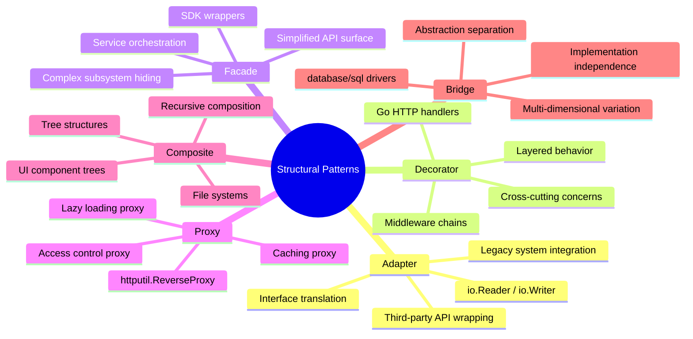
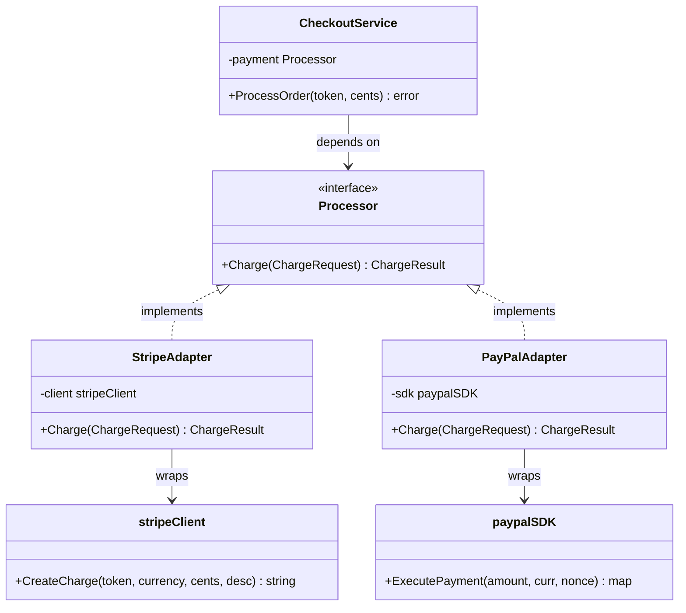
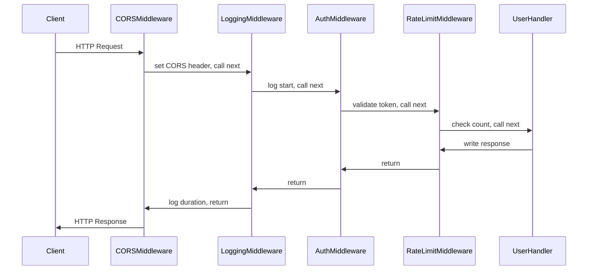
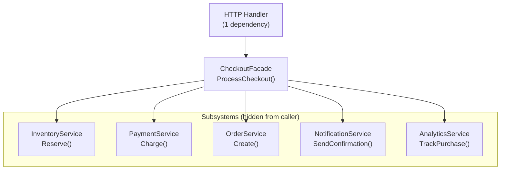
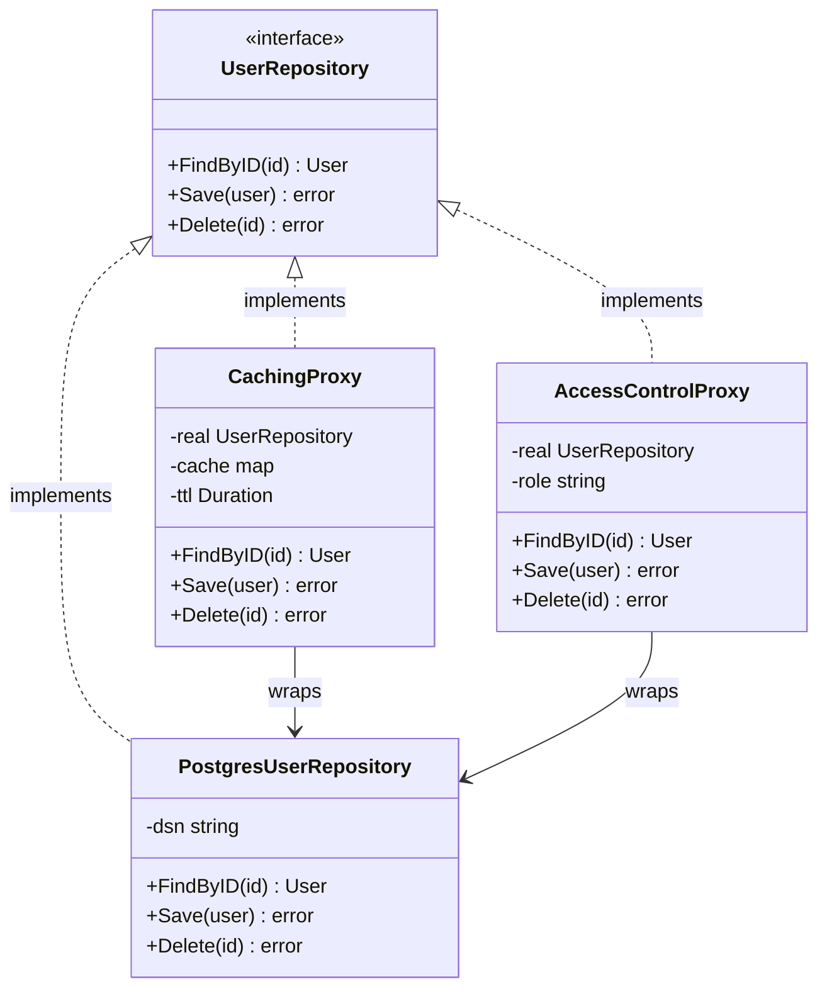
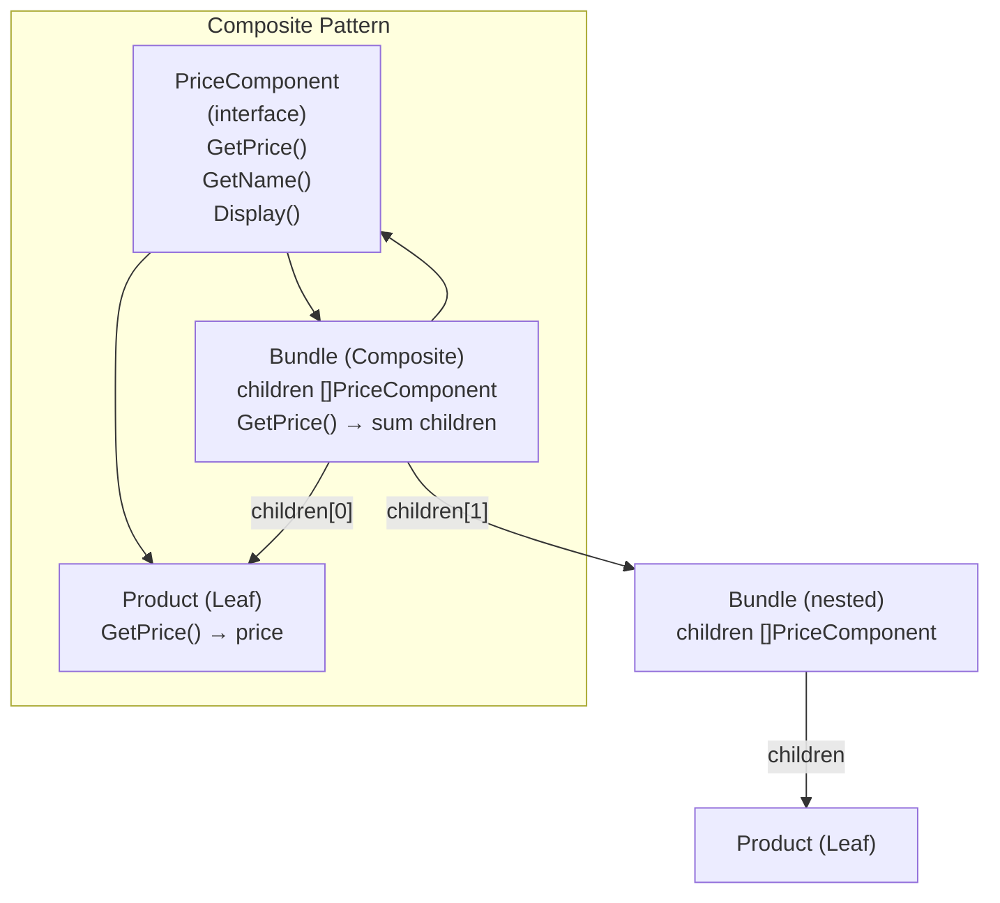
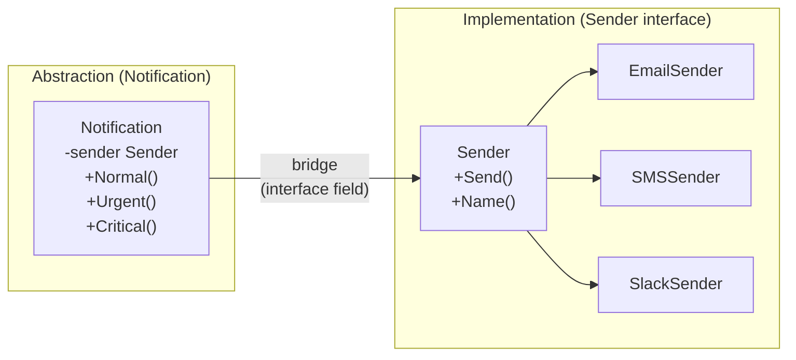

# Chapter 2: Structural Patterns

## Mind Map



## Overview

Structural patterns deal with **object composition** — how you assemble classes and objects into larger structures while keeping those structures flexible and efficient. Where creational patterns handle *how objects are born*, structural patterns handle *how objects relate and collaborate*.

The six structural patterns in this chapter address the most common composition problems in real-world software:

| Pattern | Core Problem Solved | Go Idiom |
|---------|---------------------|----------|
| **Adapter** | Incompatible interfaces need to work together | Wrapper struct implementing target interface |
| **Decorator** | Add behavior to an object without changing its structure | `func(Handler) Handler` middleware |
| **Facade** | Simplify a complex subsystem behind a clean API | Struct orchestrating multiple services |
| **Proxy** | Control or augment access to an object | Wrapper implementing the same interface |
| **Composite** | Treat individual objects and groups uniformly | Interface with recursive children |
| **Bridge** | Vary abstraction and implementation independently | Struct with an interface field |

A key insight before diving in: **Adapter and Proxy look similar** (both wrap an object), but their intent differs. An Adapter *translates* an incompatible interface. A Proxy *controls access to* a compatible one. Keep this distinction in mind as you read.

---

## Pattern 1: Adapter

### Real-World Analogy

A power outlet adapter lets you plug a US two-prong device into a European Schuko socket. Neither device changes — the adapter sits between them and translates the physical interface. The same principle applies when integrating incompatible software interfaces.

### Problem

Your application uses a `PaymentProcessor` interface. You start with Stripe. Six months later, the business adds PayPal. A year later, they add Square. Each vendor SDK has a completely different method signature, error type, and response structure.

Without the Adapter pattern, every call site that uses payments must handle three different APIs. When you swap vendors or add a fourth, you touch dozens of files.

**BEFORE — call sites tightly coupled to vendor SDK:**

```go
package main

import (
    "fmt"
    stripe "github.com/stripe/stripe-go/v76"
    "github.com/stripe/stripe-go/v76/charge"
)

// Every handler that needs payments imports and uses Stripe directly.
// Switching to PayPal means modifying every one of these.
func HandleCheckout(amount int64, token string) error {
    params := &stripe.ChargeParams{
        Amount:   stripe.Int64(amount),
        Currency: stripe.String("usd"),
        Source:   &stripe.SourceParams{Token: stripe.String(token)},
    }
    ch, err := charge.New(params)
    if err != nil {
        return fmt.Errorf("stripe charge failed: %w", err)
    }
    fmt.Printf("charged %s: %d cents\n", ch.ID, ch.Amount)
    return nil
}
```

Every handler knows about `stripe.ChargeParams`, `stripe.SourceParams`, Stripe error types, and Stripe response fields. Adding PayPal means touching every handler.

**AFTER — all call sites use a common interface:**

```go
package payment

import (
    "fmt"
    "time"
)

// --- The target interface your application owns ---

// ChargeRequest is your application's payment language.
type ChargeRequest struct {
    AmountCents int64
    Currency    string
    Token       string
    Description string
}

// ChargeResult is your application's payment result.
type ChargeResult struct {
    TransactionID string
    ProcessedAt   time.Time
    AmountCents   int64
}

// Processor is the single interface your whole application depends on.
type Processor interface {
    Charge(req ChargeRequest) (ChargeResult, error)
}

// --- Stripe Adapter ---

// stripeClient simulates the real Stripe SDK type.
type stripeClient struct{ apiKey string }

func (c *stripeClient) CreateCharge(token, currency string, cents int64, desc string) (string, error) {
    // Real Stripe SDK call would live here.
    return "ch_stripe_" + token[:4], nil
}

// StripeAdapter translates your ChargeRequest into Stripe SDK calls.
type StripeAdapter struct {
    client *stripeClient
}

func NewStripeAdapter(apiKey string) *StripeAdapter {
    return &StripeAdapter{client: &stripeClient{apiKey: apiKey}}
}

func (a *StripeAdapter) Charge(req ChargeRequest) (ChargeResult, error) {
    id, err := a.client.CreateCharge(req.Token, req.Currency, req.AmountCents, req.Description)
    if err != nil {
        return ChargeResult{}, fmt.Errorf("stripe: %w", err)
    }
    return ChargeResult{
        TransactionID: id,
        ProcessedAt:   time.Now(),
        AmountCents:   req.AmountCents,
    }, nil
}

// --- PayPal Adapter ---

// paypalSDK simulates the real PayPal SDK type with a different API shape.
type paypalSDK struct{ clientID, secret string }

func (s *paypalSDK) ExecutePayment(amount float64, curr, nonce string) (map[string]string, error) {
    // Real PayPal SDK call would live here.
    return map[string]string{"id": "PAY-paypal-" + nonce[:4]}, nil
}

// PayPalAdapter translates your ChargeRequest into PayPal SDK calls.
type PayPalAdapter struct {
    sdk *paypalSDK
}

func NewPayPalAdapter(clientID, secret string) *PayPalAdapter {
    return &PayPalAdapter{sdk: &paypalSDK{clientID: clientID, secret: secret}}
}

func (a *PayPalAdapter) Charge(req ChargeRequest) (ChargeResult, error) {
    // PayPal uses float64 dollars, not int64 cents — the adapter handles conversion.
    dollarAmount := float64(req.AmountCents) / 100.0
    result, err := a.sdk.ExecutePayment(dollarAmount, req.Currency, req.Token)
    if err != nil {
        return ChargeResult{}, fmt.Errorf("paypal: %w", err)
    }
    return ChargeResult{
        TransactionID: result["id"],
        ProcessedAt:   time.Now(),
        AmountCents:   req.AmountCents,
    }, nil
}

// --- Application code: zero knowledge of which vendor is behind Processor ---

type CheckoutService struct {
    payment Processor
}

func NewCheckoutService(p Processor) *CheckoutService {
    return &CheckoutService{payment: p}
}

func (s *CheckoutService) ProcessOrder(token string, cents int64) error {
    result, err := s.payment.Charge(ChargeRequest{
        AmountCents: cents,
        Currency:    "usd",
        Token:       token,
        Description: "Order payment",
    })
    if err != nil {
        return fmt.Errorf("payment failed: %w", err)
    }
    fmt.Printf("payment confirmed: txn=%s amount=%d\n", result.TransactionID, result.AmountCents)
    return nil
}
```

Switching from Stripe to PayPal is now one line at the composition root: `NewCheckoutService(NewPayPalAdapter(...))`. Every handler remains unchanged.

### Structure



### When to Use

- Integrating third-party or legacy libraries with incompatible interfaces
- You need multiple implementations of the same concept (multiple payment providers, multiple storage backends)
- You want to insulate your codebase from churn in external APIs
- Writing unit tests: inject a mock `Processor` instead of hitting real Stripe

### When NOT to Use

- Interfaces are already compatible — wrapping for the sake of it adds layers with no benefit
- Only one implementation will ever exist and there is genuinely no reason to expect a second
- The "incompatibility" is minor enough to handle inline — avoid adding a file and a type for a two-line conversion

### Real-World Usage in Go

| Usage | Adapter |
|-------|---------|
| `bufio.NewReader(r io.Reader)` | Adapts any `io.Reader` into a buffered reader |
| `strings.NewReader(s string)` | Adapts a `string` into an `io.Reader` |
| `http.FileSystem` + `http.Dir` | Adapts the OS filesystem into the HTTP file serving interface |
| `database/sql` drivers | Each driver (pq, mysql) adapts vendor protocol into the `sql.Driver` interface |

### Related Patterns

- **Proxy** — also wraps an object, but *same interface*, used for access control not translation
- **Facade** — also simplifies an interface, but hides a *subsystem*, not a single object
- **Bridge** — separates abstraction from implementation by design; Adapter reconciles incompatibility after the fact

---

## Pattern 2: Decorator

### Real-World Analogy

A coffee order at a specialty café: start with a base espresso shot. Want milk? The barista wraps the espresso in a milk decorator. Caramel syrup? Another wrapper. Whipped cream? Another. Each add-on enriches the drink without changing the original espresso. You can stack them in any order, and you can have the base shot without any additions.

This is exactly how Go HTTP middleware works.

### Problem

An HTTP handler needs logging, authentication, rate limiting, and CORS headers. These are cross-cutting concerns — they appear across many handlers but have nothing to do with any specific handler's business logic.

**BEFORE — all concerns tangled in one handler:**

```go
package main

import (
    "log"
    "net/http"
    "sync"
    "time"
)

var (
    requestCounts = map[string]int{}
    mu            sync.Mutex
)

// UserHandler does one thing conceptually but is responsible for five.
func UserHandler(w http.ResponseWriter, r *http.Request) {
    // 1. CORS — belongs in every handler or a middleware
    w.Header().Set("Access-Control-Allow-Origin", "*")
    if r.Method == http.MethodOptions {
        w.WriteHeader(http.StatusNoContent)
        return
    }

    // 2. Logging — copy-pasted into every handler
    start := time.Now()
    defer func() {
        log.Printf("[%s] %s %s %v", r.Method, r.URL.Path, r.RemoteAddr, time.Since(start))
    }()

    // 3. Authentication — checking auth token in every handler
    token := r.Header.Get("Authorization")
    if token == "" || token != "Bearer secret-token" {
        http.Error(w, "unauthorized", http.StatusUnauthorized)
        return
    }

    // 4. Rate limiting — duplicated logic in every handler
    mu.Lock()
    requestCounts[r.RemoteAddr]++
    count := requestCounts[r.RemoteAddr]
    mu.Unlock()
    if count > 100 {
        http.Error(w, "too many requests", http.StatusTooManyRequests)
        return
    }

    // 5. Actual business logic — buried under 40 lines of boilerplate
    w.Write([]byte(`{"user": "alice"}`))
}
```

Every new handler copy-pastes sections 1–4. If the auth check changes, you update 20 handlers. If rate limit logic changes, same problem.

**AFTER — each concern is its own decorator, handlers stay pure:**

```go
package main

import (
    "log"
    "net/http"
    "sync"
    "time"
)

// --- Each middleware is a Decorator: func(http.Handler) http.Handler ---

// LoggingMiddleware wraps any handler with request/response logging.
// It demonstrates the core Decorator shape: accepts a Handler, returns a Handler.
func LoggingMiddleware(next http.Handler) http.Handler {
    return http.HandlerFunc(func(w http.ResponseWriter, r *http.Request) {
        start := time.Now()
        log.Printf("→ %s %s from %s", r.Method, r.URL.Path, r.RemoteAddr)
        next.ServeHTTP(w, r) // delegate to the wrapped handler
        log.Printf("← %s %s completed in %v", r.Method, r.URL.Path, time.Since(start))
    })
}

// AuthMiddleware wraps any handler with token-based authentication.
func AuthMiddleware(next http.Handler) http.Handler {
    return http.HandlerFunc(func(w http.ResponseWriter, r *http.Request) {
        token := r.Header.Get("Authorization")
        if token != "Bearer secret-token" {
            http.Error(w, "unauthorized", http.StatusUnauthorized)
            return // short-circuit: next.ServeHTTP is NOT called
        }
        next.ServeHTTP(w, r)
    })
}

// RateLimitMiddleware wraps any handler with per-IP rate limiting.
func RateLimitMiddleware(limit int) func(http.Handler) http.Handler {
    counts := map[string]int{}
    var mu sync.Mutex
    return func(next http.Handler) http.Handler {
        return http.HandlerFunc(func(w http.ResponseWriter, r *http.Request) {
            mu.Lock()
            counts[r.RemoteAddr]++
            count := counts[r.RemoteAddr]
            mu.Unlock()
            if count > limit {
                http.Error(w, "too many requests", http.StatusTooManyRequests)
                return
            }
            next.ServeHTTP(w, r)
        })
    }
}

// CORSMiddleware wraps any handler with CORS headers.
func CORSMiddleware(next http.Handler) http.Handler {
    return http.HandlerFunc(func(w http.ResponseWriter, r *http.Request) {
        w.Header().Set("Access-Control-Allow-Origin", "*")
        if r.Method == http.MethodOptions {
            w.WriteHeader(http.StatusNoContent)
            return
        }
        next.ServeHTTP(w, r)
    })
}

// --- Handlers contain only business logic ---

func UserHandler(w http.ResponseWriter, r *http.Request) {
    w.Header().Set("Content-Type", "application/json")
    w.Write([]byte(`{"user": "alice"}`))
}

func ProductHandler(w http.ResponseWriter, r *http.Request) {
    w.Header().Set("Content-Type", "application/json")
    w.Write([]byte(`{"product": "widget"}`))
}

// --- Composition: stack decorators like layers ---

func main() {
    userHandler := http.HandlerFunc(UserHandler)
    productHandler := http.HandlerFunc(ProductHandler)

    // Manual stacking — readable, explicit order
    // Request flows: CORS → Logging → Auth → RateLimit → UserHandler
    wrappedUser := CORSMiddleware(
        LoggingMiddleware(
            AuthMiddleware(
                RateLimitMiddleware(100)(userHandler),
            ),
        ),
    )

    // Idiomatic Go: define a chain helper to avoid nesting
    chain := func(h http.Handler, middlewares ...func(http.Handler) http.Handler) http.Handler {
        // Apply in reverse so the first middleware in the slice is outermost
        for i := len(middlewares) - 1; i >= 0; i-- {
            h = middlewares[i](h)
        }
        return h
    }

    wrappedProduct := chain(productHandler,
        CORSMiddleware,
        LoggingMiddleware,
        AuthMiddleware,
        RateLimitMiddleware(50),
    )

    http.Handle("/user", wrappedUser)
    http.Handle("/product", wrappedProduct)
    http.ListenAndServe(":8080", nil)
}
```

### How the Decorator Executes



Each middleware wraps the next in a chain. When auth fails, the chain short-circuits — `next.ServeHTTP` is never called for the layers below auth, so the handler and rate limiter are never invoked.

### Key Insight: Go HTTP Middleware IS the Decorator Pattern

The type `func(http.Handler) http.Handler` is the Decorator pattern expressed in Go's type system. This is not a coincidence — Go's idiomatic HTTP middleware design was deliberately chosen to match the Decorator shape. Understanding this equivalence unlocks every middleware library in the Go ecosystem: `gorilla/mux`, `chi`, `echo`, `gin` — all use this pattern.

Libraries like `justinas/alice` and `urfave/negroni` exist specifically to make middleware chaining more ergonomic, but they all implement the same underlying pattern.

### When to Use

- Cross-cutting concerns: logging, authentication, rate limiting, CORS, tracing, metrics
- Adding behavior to third-party types you cannot modify
- Multiple independent behaviors that can be combined in different configurations
- You want to enable/disable behaviors at runtime by controlling which decorators are applied

### When NOT to Use

- The order of decorators is non-obvious and causes hard-to-debug behavior (auth must come before rate-limiting, but readers may not know that)
- A single, focused behavior addition — just add it to the handler directly
- Deeply nested decorators obscure the call stack in profilers and stack traces
- The decorator state (like the rate limit counter above) creates implicit shared state bugs

### Real-World Usage

| Usage | Decorator |
|-------|-----------|
| `io.TeeReader(r, w)` | Wraps an `io.Reader`, tees every read to a writer |
| `io.LimitReader(r, n)` | Wraps an `io.Reader`, stops after n bytes |
| `gzip.NewWriter(w)` | Wraps an `io.Writer` with transparent gzip compression |
| Express.js / Koa middleware | Same `(req, res, next)` pattern is the Decorator pattern |
| Python `@decorator` syntax | Language-level Decorator support |

### Related Patterns

- **Proxy** — similar structure but different intent; Proxy controls access, Decorator adds behavior
- **Chain of Responsibility** — also chains handlers, but any handler can stop the chain and handle the request itself (see Chapter 3)
- **Composite** — Decorator wraps a single object; Composite works with trees of objects

---

## Pattern 3: Facade

### Real-World Analogy

A hotel concierge is a perfect Facade. You say "I need dinner reservations for two at 8pm." The concierge calls the restaurant, confirms availability, arranges transport if needed, and reports back with a confirmation number. You interact with one person. Behind them: the restaurant reservation system, the transport service, and the hotel's internal guest management system. You neither know nor care how those subsystems work.

### Problem

An e-commerce checkout involves at least five operations: inventory reservation, payment processing, order creation, email confirmation, and analytics tracking. Without a Facade, the HTTP handler directly orchestrates all five services.

**BEFORE — handler directly orchestrates 5 services:**

```go
package main

import (
    "encoding/json"
    "fmt"
    "net/http"
)

// Simulated service types
type InventoryService struct{}
type PaymentService struct{}
type OrderService struct{}
type NotificationService struct{}
type AnalyticsService struct{}

func (s *InventoryService) Reserve(productID string, qty int) error {
    fmt.Printf("inventory: reserving %d of %s\n", qty, productID)
    return nil
}
func (s *PaymentService) Charge(token string, cents int64) (string, error) {
    return "txn_123", nil
}
func (s *OrderService) Create(productID, txnID string) (string, error) {
    return "ord_456", nil
}
func (s *NotificationService) SendConfirmation(email, orderID string) error {
    fmt.Printf("notification: sending confirmation for %s to %s\n", orderID, email)
    return nil
}
func (s *AnalyticsService) TrackPurchase(productID string, cents int64) {
    fmt.Printf("analytics: purchase %s $%.2f\n", productID, float64(cents)/100)
}

// Handler knows about all 5 services and their error handling.
// Adding a 6th service (e.g., loyalty points) means modifying this handler.
func CheckoutHandler(
    inv *InventoryService,
    pay *PaymentService,
    ord *OrderService,
    notif *NotificationService,
    analytics *AnalyticsService,
) http.HandlerFunc {
    return func(w http.ResponseWriter, r *http.Request) {
        productID := r.URL.Query().Get("product")
        token := r.Header.Get("X-Payment-Token")
        email := r.Header.Get("X-User-Email")

        if err := inv.Reserve(productID, 1); err != nil {
            http.Error(w, "inventory unavailable", http.StatusConflict)
            return
        }
        txnID, err := pay.Charge(token, 2999)
        if err != nil {
            http.Error(w, "payment failed", http.StatusPaymentRequired)
            return
        }
        orderID, err := ord.Create(productID, txnID)
        if err != nil {
            http.Error(w, "order creation failed", http.StatusInternalServerError)
            return
        }
        notif.SendConfirmation(email, orderID) // fire-and-forget
        analytics.TrackPurchase(productID, 2999)

        json.NewEncoder(w).Encode(map[string]string{"order_id": orderID})
    }
}
```

The handler has 5 parameters, understands 5 error modes, and must be updated whenever the checkout workflow changes.

**AFTER — handler depends on a single Facade:**

```go
package checkout

import (
    "encoding/json"
    "fmt"
    "net/http"
)

// --- Domain types ---

type OrderRequest struct {
    ProductID string
    Quantity  int
    PriceCents int64
    PaymentToken string
    CustomerEmail string
}

type Receipt struct {
    OrderID       string
    TransactionID string
    AmountCents   int64
}

// --- Facade definition ---

// CheckoutFacade hides the complexity of the checkout workflow.
// Callers see one method: ProcessCheckout.
type CheckoutFacade struct {
    inventory    *InventoryService
    payment      *PaymentService
    orders       *OrderService
    notification *NotificationService
    analytics    *AnalyticsService
}

func NewCheckoutFacade(
    inv *InventoryService,
    pay *PaymentService,
    ord *OrderService,
    notif *NotificationService,
    analytics *AnalyticsService,
) *CheckoutFacade {
    return &CheckoutFacade{
        inventory:    inv,
        payment:      pay,
        orders:       ord,
        notification: notif,
        analytics:    analytics,
    }
}

// ProcessCheckout is the single entry point. It orchestrates all subsystems.
// The caller knows nothing about inventory, payment, or analytics internals.
func (f *CheckoutFacade) ProcessCheckout(req OrderRequest) (Receipt, error) {
    if err := f.inventory.Reserve(req.ProductID, req.Quantity); err != nil {
        return Receipt{}, fmt.Errorf("checkout: inventory: %w", err)
    }

    txnID, err := f.payment.Charge(req.PaymentToken, req.PriceCents)
    if err != nil {
        return Receipt{}, fmt.Errorf("checkout: payment: %w", err)
    }

    orderID, err := f.orders.Create(req.ProductID, txnID)
    if err != nil {
        return Receipt{}, fmt.Errorf("checkout: order: %w", err)
    }

    // Fire-and-forget: notification and analytics failures don't fail the checkout
    go f.notification.SendConfirmation(req.CustomerEmail, orderID)
    go f.analytics.TrackPurchase(req.ProductID, req.PriceCents)

    return Receipt{
        OrderID:       orderID,
        TransactionID: txnID,
        AmountCents:   req.PriceCents,
    }, nil
}

// --- Handler: one dependency, one error path ---

func NewCheckoutHandler(facade *CheckoutFacade) http.HandlerFunc {
    return func(w http.ResponseWriter, r *http.Request) {
        req := OrderRequest{
            ProductID:     r.URL.Query().Get("product"),
            Quantity:      1,
            PriceCents:    2999,
            PaymentToken:  r.Header.Get("X-Payment-Token"),
            CustomerEmail: r.Header.Get("X-User-Email"),
        }
        receipt, err := facade.ProcessCheckout(req)
        if err != nil {
            http.Error(w, err.Error(), http.StatusBadRequest)
            return
        }
        json.NewEncoder(w).Encode(receipt)
    }
}
```

### Structure



### When to Use

- Providing a clean public API for a complex library or SDK
- Decoupling client code from subsystem internals — when subsystems change, only the Facade changes
- Reducing the cognitive load on callers who just want to accomplish a task
- Layering a simpler interface on top of a legacy system during migration

### When NOT to Use

- The subsystem is already simple — Facade adds a layer without reducing complexity
- Clients legitimately need fine-grained control over subsystem internals
- The Facade becomes a "god object" that accumulates too many responsibilities — split it into multiple focused facades
- You are building an internal package where the teams using it understand the subsystem

### Real-World Usage

| Usage | Facade |
|-------|--------|
| AWS SDK high-level clients | `s3manager.Uploader` wraps multipart upload, retry, concurrency |
| `os/exec.Command()` | Facade over `fork(2)`, `exec(2)`, pipe management |
| `database/sql.Open()` | Facade hiding connection pool, driver registration, DSN parsing |
| `http.Get(url)` | Facade over `http.Client`, request construction, response handling |

### Related Patterns

- **Adapter** — Adapter reconciles incompatible interfaces; Facade simplifies a complex but internally consistent subsystem
- **Mediator** — Facade provides one-way simplification; Mediator coordinates bidirectional communication between components (see Chapter 3)
- **Abstract Factory** — Both hide implementation details; Abstract Factory creates families of objects, Facade hides subsystem orchestration

---

## Pattern 4: Proxy

### Real-World Analogy

A celebrity's manager is a Proxy. You do not call the celebrity directly. The manager screens your request (access control), negotiates on their behalf, and may say "they have that slot open in two months" (lazy scheduling). The celebrity's contract and identity (interface) is the same whether you reach them through the manager or not.

### Problem

Database queries are expensive. A `UserRepository.FindByID` call hits PostgreSQL. The same user profile is fetched 200 times per second on a popular endpoint. You need caching without adding cache logic to the repository itself.

### Caching Proxy

```go
package repository

import (
    "fmt"
    "sync"
    "time"
)

// --- Domain type ---

type User struct {
    ID    string
    Name  string
    Email string
}

// --- The interface (shared by real and proxy) ---

type UserRepository interface {
    FindByID(id string) (*User, error)
    Save(user *User) error
    Delete(id string) error
}

// --- Real implementation ---

type PostgresUserRepository struct {
    dsn string
}

func (r *PostgresUserRepository) FindByID(id string) (*User, error) {
    // Expensive DB query — simulate with a print
    fmt.Printf("db: SELECT * FROM users WHERE id = %s\n", id)
    return &User{ID: id, Name: "Alice", Email: "alice@example.com"}, nil
}

func (r *PostgresUserRepository) Save(user *User) error {
    fmt.Printf("db: INSERT/UPDATE user %s\n", user.ID)
    return nil
}

func (r *PostgresUserRepository) Delete(id string) error {
    fmt.Printf("db: DELETE FROM users WHERE id = %s\n", id)
    return nil
}

// --- Caching Proxy ---

type cacheEntry struct {
    user      *User
    expiresAt time.Time
}

// CachingProxy implements UserRepository and transparently caches FindByID results.
// The caller never knows whether the result came from cache or database.
type CachingProxy struct {
    real    UserRepository    // the real PostgresUserRepository
    cache   map[string]cacheEntry
    mu      sync.RWMutex
    ttl     time.Duration
}

func NewCachingProxy(real UserRepository, ttl time.Duration) *CachingProxy {
    return &CachingProxy{
        real:  real,
        cache: make(map[string]cacheEntry),
        ttl:   ttl,
    }
}

func (p *CachingProxy) FindByID(id string) (*User, error) {
    // Check cache first (read lock — allows concurrent reads)
    p.mu.RLock()
    entry, found := p.cache[id]
    p.mu.RUnlock()

    if found && time.Now().Before(entry.expiresAt) {
        fmt.Printf("cache: HIT for user %s\n", id)
        return entry.user, nil
    }

    // Cache miss — delegate to real repository
    user, err := p.real.FindByID(id)
    if err != nil {
        return nil, err
    }

    // Store in cache (write lock)
    p.mu.Lock()
    p.cache[id] = cacheEntry{user: user, expiresAt: time.Now().Add(p.ttl)}
    p.mu.Unlock()

    return user, nil
}

func (p *CachingProxy) Save(user *User) error {
    // Invalidate cache on write
    p.mu.Lock()
    delete(p.cache, user.ID)
    p.mu.Unlock()
    return p.real.Save(user)
}

func (p *CachingProxy) Delete(id string) error {
    p.mu.Lock()
    delete(p.cache, id)
    p.mu.Unlock()
    return p.real.Delete(id)
}
```

### Access Control Proxy

```go
// AccessControlProxy gates every operation behind a permission check.
// The caller's interface is identical to the real repository.
type AccessControlProxy struct {
    real       UserRepository
    currentUserRole string
}

func NewAccessControlProxy(real UserRepository, role string) *AccessControlProxy {
    return &AccessControlProxy{real: real, currentUserRole: role}
}

func (p *AccessControlProxy) FindByID(id string) (*User, error) {
    // Readers and above can query
    if p.currentUserRole == "" {
        return nil, fmt.Errorf("access denied: authentication required")
    }
    return p.real.FindByID(id)
}

func (p *AccessControlProxy) Save(user *User) error {
    // Only admins can write
    if p.currentUserRole != "admin" {
        return fmt.Errorf("access denied: admin role required for writes")
    }
    return p.real.Save(user)
}

func (p *AccessControlProxy) Delete(id string) error {
    if p.currentUserRole != "admin" {
        return fmt.Errorf("access denied: admin role required for deletes")
    }
    return p.real.Delete(id)
}
```

### Lazy Loading Proxy

```go
// LazyProxy defers expensive initialization until first use.
// Useful when the real object is expensive to create (DB connection pool,
// third-party client, large in-memory index).
type LazyProxy struct {
    real    UserRepository
    once    sync.Once
    initErr error
    dsn     string
}

func NewLazyProxy(dsn string) *LazyProxy {
    return &LazyProxy{dsn: dsn}
}

func (p *LazyProxy) initialize() {
    p.once.Do(func() {
        fmt.Printf("lazy: initializing expensive DB connection to %s\n", p.dsn)
        // Expensive initialization happens here — only once, on first call
        p.real = &PostgresUserRepository{dsn: p.dsn}
    })
}

func (p *LazyProxy) FindByID(id string) (*User, error) {
    p.initialize()
    if p.initErr != nil {
        return nil, p.initErr
    }
    return p.real.FindByID(id)
}

func (p *LazyProxy) Save(user *User) error {
    p.initialize()
    return p.real.Save(user)
}

func (p *LazyProxy) Delete(id string) error {
    p.initialize()
    return p.real.Delete(id)
}
```

### Structure



### When to Use

- **Caching proxy:** Expensive read operations with hot keys; avoids redundant computation
- **Access control proxy:** Authorization logic should be separate from business logic
- **Lazy loading proxy:** Resource is expensive to initialize and may not always be needed
- **Logging/monitoring proxy:** Instrument calls without modifying the real object
- **Remote proxy:** The real object is on another machine (e.g., gRPC client proxy)

### When NOT to Use

- Direct access is already fast and the proxy would add round-trip overhead for no gain
- Cache invalidation is complex enough to cause correctness bugs (cache invalidation is famously hard)
- The proxied interface changes frequently — every change requires updating all proxies
- Simple delegation without any added behavior — just use the real object

### Real-World Usage

| Usage | Proxy |
|-------|-------|
| `httputil.ReverseProxy` | Proxies HTTP requests to upstream servers |
| Kubernetes API server | Proxy to `etcd` with auth, admission control, caching |
| CDN (Cloudflare, Fastly) | Caching proxy in front of origin servers |
| gRPC client stubs | Generated code is a remote proxy for a service on another host |

### Related Patterns

- **Adapter** — Adapter changes the interface; Proxy keeps the same interface
- **Decorator** — Decorator adds behavior; Proxy controls or augments access (overlapping intent, differ in emphasis)
- **Facade** — Facade hides a complex subsystem; Proxy wraps a single object with the same interface

---

## Pattern 5: Composite

### Real-World Analogy

A file system is the canonical Composite. You can ask a single file for its size. You can ask a directory for its size — and it recursively sums the sizes of everything it contains, which may include other directories. The `Size()` operation works identically on both a 1KB text file and a 50GB folder full of nested subdirectories. Same interface, radically different internal complexity.

### Problem

An e-commerce platform has product bundles. A bundle can contain individual products or other bundles. You need to calculate the total price of any item (product or bundle) without the caller knowing or caring whether it is a leaf or a container.

**BEFORE — caller must handle products and bundles differently:**

```go
package main

import "fmt"

type Product struct {
    Name  string
    Price float64
}

type Bundle struct {
    Name     string
    Products []Product
    Bundles  []Bundle // Only one level of nesting — breaks for deeper hierarchies
}

// Caller must check the type and handle each case separately.
// Adding a new composite type (e.g., SubscriptionBundle) breaks all callers.
func CalculateTotalPrice(p *Product, b *Bundle) float64 {
    if p != nil {
        return p.Price
    }
    total := 0.0
    for _, prod := range b.Products {
        total += prod.Price
    }
    for _, bundle := range b.Bundles {
        total += CalculateTotalPrice(nil, &bundle) // awkward recursion
    }
    return total
}
```

**AFTER — uniform interface for leaves and composites:**

```go
package catalog

import "fmt"

// --- Component interface: the uniform API ---

// PriceComponent is the common interface for both individual products
// (leaves) and bundles (composites). Callers use only this interface.
type PriceComponent interface {
    GetPrice() float64
    GetName() string
    Display(indent string) // recursive display for debugging
}

// --- Leaf: individual product ---

type Product struct {
    name  string
    price float64
}

func NewProduct(name string, price float64) *Product {
    return &Product{name: name, price: price}
}

func (p *Product) GetPrice() float64 { return p.price }
func (p *Product) GetName() string   { return p.name }
func (p *Product) Display(indent string) {
    fmt.Printf("%s[Product] %s: $%.2f\n", indent, p.name, p.price)
}

// --- Composite: bundle that contains other PriceComponents ---

type Bundle struct {
    name     string
    children []PriceComponent // can hold Products, other Bundles, or any future Component
    discount float64          // bundle discount as a fraction (0.1 = 10% off)
}

func NewBundle(name string, discount float64) *Bundle {
    return &Bundle{name: name, discount: discount}
}

func (b *Bundle) Add(c PriceComponent) {
    b.children = append(b.children, c)
}

func (b *Bundle) GetName() string { return b.name }

// GetPrice recursively sums children — the core of the Composite pattern.
func (b *Bundle) GetPrice() float64 {
    total := 0.0
    for _, child := range b.children {
        total += child.GetPrice() // works for both Product and nested Bundle
    }
    return total * (1 - b.discount)
}

func (b *Bundle) Display(indent string) {
    fmt.Printf("%s[Bundle] %s: $%.2f (%.0f%% discount)\n",
        indent, b.name, b.GetPrice(), b.discount*100)
    for _, child := range b.children {
        child.Display(indent + "  ")
    }
}

// --- Usage: caller uses PriceComponent throughout, never checks types ---

func PrintCartSummary(items []PriceComponent) {
    total := 0.0
    for _, item := range items {
        item.Display("")
        total += item.GetPrice()
    }
    fmt.Printf("Cart total: $%.2f\n", total)
}
```

Example usage:

```go
keyboard := NewProduct("Mechanical Keyboard", 149.99)
mouse := NewProduct("Wireless Mouse", 59.99)
monitor := NewProduct("4K Monitor", 499.99)
webcam := NewProduct("HD Webcam", 89.99)

// A bundle containing individual products
peripherals := NewBundle("Desk Peripherals", 0.10) // 10% bundle discount
peripherals.Add(keyboard)
peripherals.Add(mouse)

// A bundle containing another bundle — arbitrary depth
homeOffice := NewBundle("Home Office Bundle", 0.05) // 5% additional discount
homeOffice.Add(peripherals) // composite inside composite
homeOffice.Add(monitor)
homeOffice.Add(webcam)

// The cart holds a mix of leaves and composites — same interface
cart := []PriceComponent{keyboard, homeOffice}
PrintCartSummary(cart)
// [Product] Mechanical Keyboard: $149.99
// [Bundle] Home Office Bundle: $...
//   [Bundle] Desk Peripherals: $...
//     [Product] Mechanical Keyboard: $149.99
//     [Product] Wireless Mouse: $59.99
//   [Product] 4K Monitor: $499.99
//   [Product] HD Webcam: $89.99
// Cart total: $...
```

### Structure



### When to Use

- Tree structures where individual nodes and container nodes need the same interface
- File systems, menus, organization charts, UI component trees, ASTs
- Recursive computation: total price, total size, render tree, permission inheritance
- You want to add new leaf or composite types without changing the processing code

### When NOT to Use

- Flat structures — if there is no hierarchy, the pattern adds complexity for nothing
- Leaf and composite behaviors are so different that a common interface is artificial
- Forced generalization makes both types harder to understand than they would be separately
- Type-specific operations are needed frequently — if you keep needing type assertions, reconsider

### Real-World Usage

| Usage | Composite |
|-------|-----------|
| `html/template` | Template trees with nested templates |
| Compiler ASTs | Expression nodes are leaves; statement blocks are composites |
| React / Vue component trees | Every component renders children uniformly |
| `fs.FS` in Go 1.16 | File and directory both implement `fs.File` |
| `encoding/json` value types | JSON value is a leaf (string, number) or composite (object, array) |

### Related Patterns

- **Decorator** — Decorator wraps a single object with added behavior; Composite manages a tree of children
- **Iterator** — Often used to traverse Composite trees (see Chapter 3)
- **Visitor** — Applies an operation across a Composite tree without modifying node types (see Chapter 3)

---

## Pattern 6: Bridge

### Real-World Analogy

A TV remote and a television. The remote (abstraction) provides a consistent interface: power, volume, channel. The TV brand (implementation) can be Samsung, LG, or Sony. You can replace the remote without buying a new TV. You can buy a new TV without buying a new remote. The two evolve independently because the interface between them (IR signals / HDMI-CEC protocol) is stable.

### Problem

A notification system sends messages with two varying dimensions:
- **Urgency**: `Normal`, `Urgent`, `Critical`
- **Channel**: `Email`, `SMS`, `Push`, `Slack`

Without Bridge, you need a class for every combination: `UrgentEmail`, `NormalSMS`, `CriticalPush`, `CriticalSlack`, `NormalEmail`... That is 3 × 4 = 12 types. Adding a fifth channel requires 3 new types. Adding a fourth urgency level requires 4 new types. The count grows as N × M.

**BEFORE — class explosion:**

```go
// Without Bridge: every combination is a separate type
type UrgentEmailNotification struct{}
type NormalEmailNotification struct{}
type CriticalEmailNotification struct{}
type UrgentSMSNotification struct{}
type NormalSMSNotification struct{}
// ... 12 types total, growing to 20 when you add Slack
```

**AFTER — Bridge separates urgency from delivery:**

```go
package notification

import (
    "fmt"
    "strings"
    "time"
)

// --- Implementation side: delivery channels ---

// Sender is the Implementation interface.
// Urgency logic does NOT live here. Only delivery mechanics live here.
type Sender interface {
    Send(recipient, subject, body string) error
    Name() string
}

// EmailSender delivers via SMTP.
type EmailSender struct {
    smtpHost string
}

func NewEmailSender(host string) *EmailSender {
    return &EmailSender{smtpHost: host}
}

func (s *EmailSender) Send(recipient, subject, body string) error {
    fmt.Printf("[Email via %s] To: %s | Subject: %s | Body: %s\n",
        s.smtpHost, recipient, subject, body)
    return nil
}

func (s *EmailSender) Name() string { return "email" }

// SMSSender delivers via SMS gateway.
type SMSSender struct {
    gatewayURL string
}

func NewSMSSender(gatewayURL string) *SMSSender {
    return &SMSSender{gatewayURL: gatewayURL}
}

func (s *SMSSender) Send(recipient, subject, body string) error {
    // SMS ignores subject, truncates body
    truncated := body
    if len(truncated) > 160 {
        truncated = truncated[:157] + "..."
    }
    fmt.Printf("[SMS via %s] To: %s | %s\n", s.gatewayURL, recipient, truncated)
    return nil
}

func (s *SMSSender) Name() string { return "sms" }

// SlackSender delivers to a Slack channel.
type SlackSender struct {
    webhookURL string
}

func NewSlackSender(webhookURL string) *SlackSender {
    return &SlackSender{webhookURL: webhookURL}
}

func (s *SlackSender) Send(recipient, subject, body string) error {
    fmt.Printf("[Slack webhook] Channel: %s | *%s* %s\n", recipient, subject, body)
    return nil
}

func (s *SlackSender) Name() string { return "slack" }

// --- Abstraction side: urgency levels ---

// Notification is the Abstraction. It holds a reference to a Sender (the Bridge).
// Urgency formatting logic lives here, channel mechanics are delegated to Sender.
type Notification struct {
    sender    Sender // the bridge — can be any implementation
    recipient string
}

func NewNotification(sender Sender, recipient string) *Notification {
    return &Notification{sender: sender, recipient: recipient}
}

// Normal sends a low-priority notification.
func (n *Notification) Normal(title, message string) error {
    return n.sender.Send(n.recipient, title, message)
}

// Urgent sends a high-priority notification with visual emphasis.
func (n *Notification) Urgent(title, message string) error {
    urgentSubject := fmt.Sprintf("⚠️ URGENT: %s", title)
    urgentBody := fmt.Sprintf("[%s] %s\nSent at: %s",
        strings.ToUpper(title), message, time.Now().Format(time.RFC3339))
    return n.sender.Send(n.recipient, urgentSubject, urgentBody)
}

// Critical sends a critical alert with maximum emphasis and escalation info.
func (n *Notification) Critical(title, message string) error {
    criticalSubject := fmt.Sprintf("🚨 CRITICAL ALERT: %s", title)
    criticalBody := fmt.Sprintf(
        "CRITICAL: %s\n%s\n\nThis is an automated critical alert. Immediate action required.\nTimestamp: %s",
        title, message, time.Now().Format(time.RFC3339),
    )
    return n.sender.Send(n.recipient, criticalSubject, criticalBody)
}

// --- Usage: mix and match abstraction + implementation freely ---

func main() {
    emailSender := NewEmailSender("smtp.company.com")
    smsSender := NewSMSSender("https://api.twilio.com")
    slackSender := NewSlackSender("https://hooks.slack.com/services/xxx")

    // Urgent notification via Email
    emailNotif := NewNotification(emailSender, "oncall@company.com")
    emailNotif.Urgent("Database CPU spike", "Primary DB at 95% CPU for 3 minutes")

    // Critical notification via SMS — same urgency type, different sender
    smsNotif := NewNotification(smsSender, "+15551234567")
    smsNotif.Critical("Service down", "API gateway returning 503")

    // Normal notification via Slack
    slackNotif := NewNotification(slackSender, "#deployments")
    slackNotif.Normal("Deployment complete", "v2.4.1 deployed to production")

    // Adding a new urgency level: only add methods to Notification — no new types for each channel
    // Adding a new channel (e.g., PagerDuty): implement Sender — no new types for each urgency level
}
```

The key result: adding a 4th urgency level requires adding one method to `Notification`. Adding a 5th channel requires creating one new `Sender` implementation. The N × M explosion becomes N + M.

### Structure



### When to Use

- Two independent dimensions of variation — you can identify two orthogonal axes (urgency × channel, shape × renderer, data format × output format)
- You need to switch implementations at runtime (swap channels without recreating the notification)
- The Cartesian product of combinations would create an unmanageable number of types
- Both dimensions are likely to grow independently

### When NOT to Use

- Only one dimension actually varies — this is just a regular interface, not a Bridge
- Premature abstraction — do not reach for Bridge until you have at least 2 implementations on each side
- Simple inheritance or a single interface is sufficient
- The two "dimensions" are actually coupled (changing one requires changing the other)

### Real-World Usage

| Usage | Bridge |
|-------|--------|
| `database/sql` | `sql.DB` (abstraction) + driver interface (implementation) — swap PostgreSQL/MySQL without changing application code |
| `image` package | Image types (`RGBA`, `Gray`) bridged to encoder implementations (`png.Encode`, `jpeg.Encode`) |
| `io.Writer` + formatters | `log.New(w io.Writer, ...)` bridges log formatting from log destination |
| JDBC (Java) | Same pattern: `Connection` abstraction over vendor drivers |

### Related Patterns

- **Adapter** — Adapter fixes an incompatibility that already exists; Bridge designs the separation from the start
- **Strategy** — Strategy swaps algorithms; Bridge swaps implementations in a two-dimensional structure (see Chapter 3)
- **Abstract Factory** — Can be used to create the implementation side of a Bridge

---

## Pattern Comparison Table

| Pattern | Intent | Structural Shape | Go Idiom | Common Use Case |
|---------|--------|-----------------|----------|----------------|
| **Adapter** | Translate incompatible interface | Wrapper struct with target interface | Struct wrapping vendor type, implementing local interface | Third-party API integration |
| **Decorator** | Add behavior without subclassing | Wrapper with same interface | `func(http.Handler) http.Handler` | HTTP middleware chains |
| **Facade** | Simplify complex subsystem | Struct aggregating multiple services | Service struct with one public method per use case | SDK/library public API |
| **Proxy** | Control access to object | Same interface as real object | Struct with interface field, same interface | Caching, auth, lazy loading |
| **Composite** | Treat leaves and containers uniformly | Recursive interface | Interface with slice of same interface | File systems, product bundles |
| **Bridge** | Vary abstraction and implementation independently | Abstraction holds implementation interface | Struct with interface field (two-dimensional) | Notification × channel |

### Adapter vs Proxy — The Most Common Confusion

Both wrap an object. The difference is intent and interface:

| Dimension | Adapter | Proxy |
|-----------|---------|-------|
| **Interface match** | Converts incompatible interface to compatible one | Implements the *same* interface as the real object |
| **Purpose** | Translation — make two things work together | Control — add caching, access control, or lazy loading |
| **Example** | `PayPalAdapter` implements your `Processor` interface using PayPal SDK | `CachingProxy` implements `UserRepository`, wraps `PostgresRepository` |

---

## Practice Questions

### Easy

1. **Identify the pattern:** Go's `http.Handler` middleware — a function that takes an `http.Handler` and returns an `http.Handler` — implements which structural pattern? Explain the correspondence between the pattern's roles and the concrete Go types.

   <details>
   <summary>Answer</summary>
   Decorator. The `http.Handler` interface is the Component. The base handler (e.g., `UserHandler`) is the ConcreteComponent. Each middleware function (e.g., `LoggingMiddleware`) is the Decorator — it wraps a Component and returns a new Component, adding behavior before and/or after delegating to the wrapped handler.
   </details>

2. **Adapter or Proxy?** You have a `UserRepository` interface. You write a `RedisUserRepository` that implements the same interface by fetching from Redis first and falling back to PostgreSQL. Is this an Adapter or a Proxy? Justify your answer.

   <details>
   <summary>Answer</summary>
   Proxy (specifically a Caching Proxy). The interface is the same — `UserRepository`. Nothing is being translated. The Redis implementation controls access to the real PostgreSQL store by intercepting `FindByID` calls and caching results. If the interfaces were different (e.g., the Redis client had a different API and you were making it look like a `UserRepository`), that wrapping layer would be an Adapter.
   </details>

### Medium

3. **Design a logging proxy:** Define a `KVStore` interface with `Get(key string) (string, error)` and `Set(key, value string) error`. Implement a `LoggingProxy` that wraps any `KVStore`, logs every operation with its duration, and delegates to the real store. Show how a caller would wire up `LoggingProxy` wrapping a `MemoryKVStore`.

   <details>
   <summary>Hint</summary>
   Use `time.Now()` before and `time.Since(start)` after the real call in each method. The caller constructs: `LoggingProxy{real: NewMemoryKVStore()}`. No caller code changes.
   </details>

4. **Bridge vs Strategy:** Both Bridge and Strategy use an interface field to delegate to interchangeable implementations. What distinguishes them? If you have a `Sorter` struct that holds an `Algorithm` interface (bubble, quick, merge), is that Bridge or Strategy?

   <details>
   <summary>Answer</summary>
   Strategy (Chapter 3). Bridge addresses two *independent* dimensions of variation — the abstraction and the implementation both vary and both can have multiple types. Strategy focuses on swapping a single algorithm within a single context. The `Sorter` has only one axis of variation (the sort algorithm), so it is Strategy. Bridge would apply if `Sorter` had both an algorithm dimension *and* an independent data-source dimension, each with multiple implementations that can be freely combined.
   </details>

### Hard

5. **Notification system with Bridge:** Implement a complete notification system using Bridge. Abstraction: three urgency levels — `Info`, `Warning`, `Alert`. Implementation: three channels — `Email`, `Slack`, `PagerDuty`. Requirements: (a) the system must support runtime channel switching per notification, (b) adding a 4th urgency level must not require changes to any `Sender` implementation, (c) adding a 4th channel must not require changes to the urgency formatting logic. Write the full Go types and a `main()` demonstrating that a `Warning` can be sent via either `Slack` or `PagerDuty` with no code change other than which `Sender` is constructed.

   <details>
   <summary>Hint</summary>
   Start with the `Sender` interface and three implementations. Then create a `Notification` struct that holds a `Sender` field and has `Info()`, `Warning()`, `Alert()` methods. Each method applies its formatting before calling `n.sender.Send(...)`. In `main()`, construct two `Notification` instances pointing to different senders and call `.Warning()` on each. The `Warning()` method implementation is identical — only the sender differs.
   </details>

---

## Related Chapters

| Chapter | Relevance |
|---------|-----------|
| [Ch01 — Foundations & Creational Patterns](./ch01-foundations-creational.md) | Factory patterns create the objects that structural patterns compose |
| [Ch03 — Behavioral Patterns](./ch03-behavioral-patterns.md) | Strategy (related to Bridge), Chain of Responsibility (extends Decorator concept), Iterator (traverses Composite trees) |
| [Ch04 — Modern Application Patterns](./ch04-modern-application-patterns.md) | Repository + Proxy is a foundational combination in clean architecture |
| [Ch06 — Anti-Patterns & Selection Guide](./ch06-anti-patterns-selection-guide.md) | God Object anti-pattern is what Facade becomes when overloaded |
