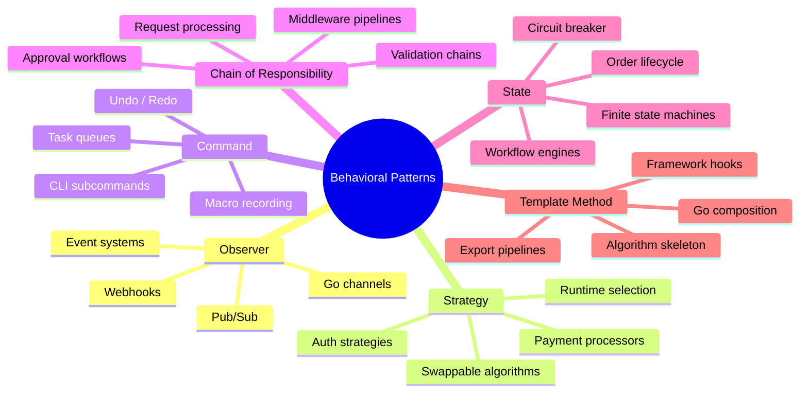
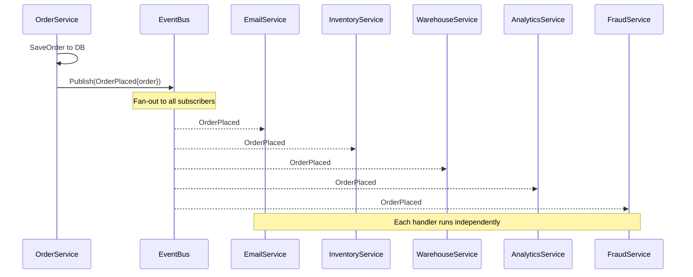
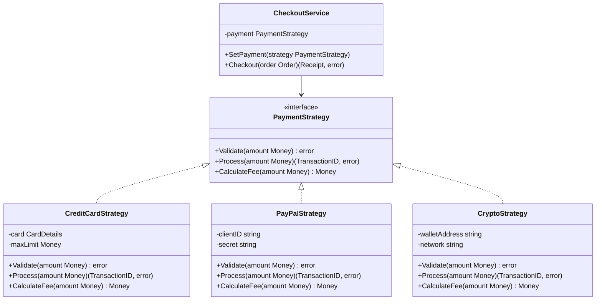
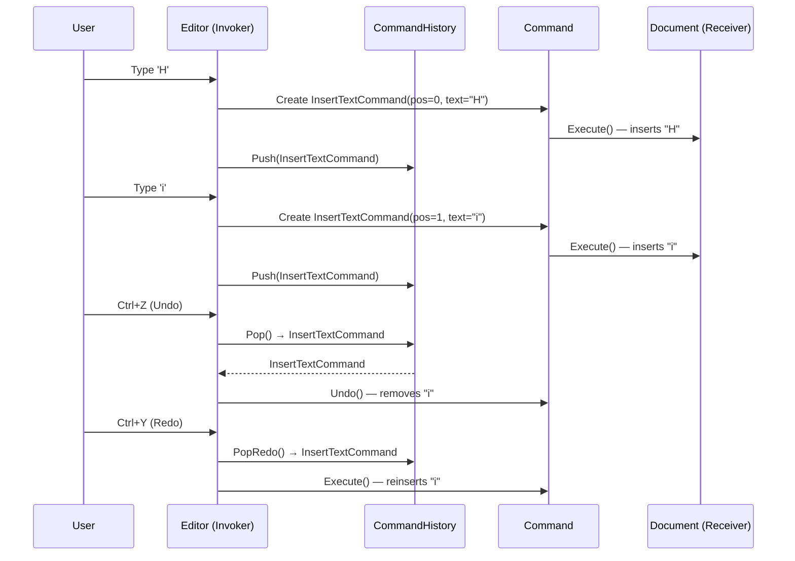
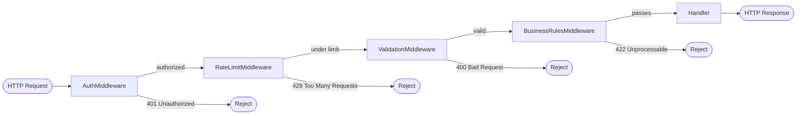
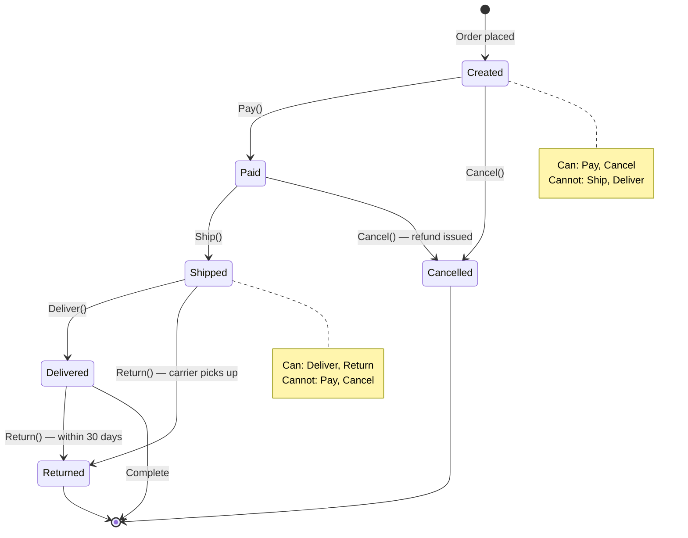
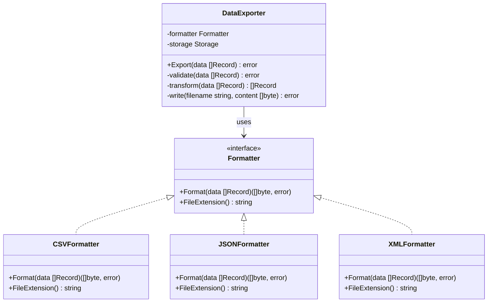

# Chapter 3: Behavioral Patterns

> Structural patterns shape how objects are composed. Behavioral patterns govern how they communicate, delegate, and coordinate — how responsibilities flow through a system at runtime.

---

## Mind Map



---

## Pattern 1: Observer

### Real-World Analogy

Think of a newsletter subscription. You sign up once, and every time a new article is published, you automatically receive it — without the publisher knowing your email address directly. Other subscribers get the same article. You can unsubscribe at any time without the publisher changing anything. That is the Observer pattern: one publisher, many independent listeners, zero direct coupling.

### The Problem

An e-commerce order service needs to react to a new order being placed. Five things must happen: send a confirmation email, update inventory, notify the warehouse, record analytics, and trigger a fraud check. Without Observer, the `PlaceOrder` function directly calls every downstream service:

```go
// BEFORE: PlaceOrder owns too much — tight coupling to every consumer
func (s *OrderService) PlaceOrder(ctx context.Context, order Order) error {
    if err := s.db.SaveOrder(ctx, order); err != nil {
        return fmt.Errorf("save order: %w", err)
    }

    // Hard-coded calls — adding a new action means editing this function
    if err := s.emailService.SendConfirmation(ctx, order); err != nil {
        return fmt.Errorf("send email: %w", err)
    }
    if err := s.inventoryService.Reserve(ctx, order.Items); err != nil {
        return fmt.Errorf("reserve inventory: %w", err)
    }
    if err := s.warehouseService.Notify(ctx, order); err != nil {
        return fmt.Errorf("notify warehouse: %w", err)
    }
    if err := s.analyticsService.Record(ctx, order); err != nil {
        return fmt.Errorf("record analytics: %w", err)
    }
    if err := s.fraudService.Check(ctx, order); err != nil {
        return fmt.Errorf("fraud check: %w", err)
    }

    return nil
}
// Adding a new step (e.g., webhook) requires modifying this file.
// If AnalyticsService is slow, every order placement feels slow.
// Testing requires mocking 5 dependencies.
```

Every new integration means reopening and modifying `PlaceOrder`. The function accumulates unrelated concerns.

### Solution Diagram



### Solution — Event Bus with Subscribe / Publish

```go
// AFTER: OrderService publishes one event; subscribers handle the rest

// Event is an immutable fact about something that happened
type Event struct {
    Type    string
    Payload interface{}
    OccurredAt time.Time
}

// EventBus is a synchronous, in-process pub/sub mechanism
type EventBus struct {
    subscribers map[string][]func(Event)
    mu          sync.RWMutex
}

func NewEventBus() *EventBus {
    return &EventBus{
        subscribers: make(map[string][]func(Event)),
    }
}

// Subscribe registers a handler for a given event type.
// Handlers are called synchronously in the order they were registered.
func (eb *EventBus) Subscribe(eventType string, handler func(Event)) {
    eb.mu.Lock()
    defer eb.mu.Unlock()
    eb.subscribers[eventType] = append(eb.subscribers[eventType], handler)
}

// Publish delivers an event to all registered handlers.
func (eb *EventBus) Publish(event Event) {
    eb.mu.RLock()
    handlers := eb.subscribers[event.Type]
    eb.mu.RUnlock()

    for _, handler := range handlers {
        handler(event)
    }
}

// OrderService now has a single dependency — the event bus
type OrderService struct {
    db  OrderRepository
    bus *EventBus
}

func (s *OrderService) PlaceOrder(ctx context.Context, order Order) error {
    if err := s.db.SaveOrder(ctx, order); err != nil {
        return fmt.Errorf("save order: %w", err)
    }

    // Publish ONE event — subscribers handle everything else
    s.bus.Publish(Event{
        Type:       "OrderPlaced",
        Payload:    order,
        OccurredAt: time.Now(),
    })
    return nil
}

// Subscribing services register once at startup — no changes to OrderService ever
func wireSubscribers(bus *EventBus, email *EmailService, inventory *InventoryService) {
    bus.Subscribe("OrderPlaced", func(e Event) {
        order := e.Payload.(Order)
        email.SendConfirmation(context.Background(), order)
    })
    bus.Subscribe("OrderPlaced", func(e Event) {
        order := e.Payload.(Order)
        inventory.Reserve(context.Background(), order.Items)
    })
    // Adding a webhook? Add a Subscribe call here. OrderService unchanged.
}
```

### Alternative: Go Channels as Observer (Idiomatic Go)

Go channels are the language's native Observer mechanism. For concurrent, non-blocking notification, they are often more idiomatic than a callback registry:

```go
// ChannelBus uses buffered channels for non-blocking publish
type ChannelBus struct {
    topics map[string][]chan Event
    mu     sync.RWMutex
}

func NewChannelBus() *ChannelBus {
    return &ChannelBus{topics: make(map[string][]chan Event)}
}

// Subscribe returns a receive-only channel the caller can range over
func (cb *ChannelBus) Subscribe(topic string, bufferSize int) <-chan Event {
    cb.mu.Lock()
    defer cb.mu.Unlock()

    ch := make(chan Event, bufferSize)
    cb.topics[topic] = append(cb.topics[topic], ch)
    return ch
}

// Publish sends to all subscriber channels (non-blocking with select)
func (cb *ChannelBus) Publish(topic string, event Event) {
    cb.mu.RLock()
    channels := cb.topics[topic]
    cb.mu.RUnlock()

    for _, ch := range channels {
        select {
        case ch <- event:
        default:
            // Channel full — drop or log; decide based on your SLA
        }
    }
}

// Consumer listens on its own goroutine
func startInventoryWorker(events <-chan Event) {
    go func() {
        for e := range events {
            order := e.Payload.(Order)
            reserveInventory(order.Items)
        }
    }()
}

// Wiring
func main() {
    bus := NewChannelBus()
    inventoryCh := bus.Subscribe("OrderPlaced", 100)
    emailCh     := bus.Subscribe("OrderPlaced", 100)

    startInventoryWorker(inventoryCh)
    startEmailWorker(emailCh)
}
```

The channel-based approach enables **concurrent consumers** and **backpressure** — full channels signal the producer to slow down, a capability the callback approach lacks.

### When to Use

- One event should trigger multiple independent reactions
- Subscribers need to be added or removed at runtime without modifying the publisher
- Event-driven architectures where you want producers and consumers decoupled
- Building plugin systems where third-party code hooks into your event stream

### When NOT to Use

- Only one or two subscribers that will never change — a direct call is simpler
- Event ordering is critical and must be guaranteed — Observer fan-out does not preserve ordering across subscribers
- Long chains of events triggering events: "A publishes B, B publishes C" becomes very hard to debug
- Synchronous request/response flows where the caller needs a result

### Real-World Usage

| Library / System | How It Uses Observer |
|---|---|
| Go channels + goroutines | Language-level Observer primitives |
| `database/sql` driver registry | `sql.Register()` subscribes drivers to the `sql` package |
| Kubernetes Watch API | `List-Watch` — controllers subscribe to resource events |
| React `useEffect` | Observes state/prop dependencies, re-runs on change |
| Kafka consumers | Consumer groups subscribe to topics (distributed Observer) |

### Related Patterns

- **[Ch05 Event Sourcing](/design-patterns/ch05-distributed-system-patterns)** — extends Observer: events are persisted as the source of truth, not just dispatched
- **[System Design Ch14 — Event-Driven Architecture](/system-design/part-3-architecture-patterns/ch14-event-driven-architecture)** — distributed Observer at infrastructure scale (Kafka, SNS)
- **Strategy (below)** — observers often delegate their behavior to a Strategy for how to process an event

---

## Pattern 2: Strategy

### Real-World Analogy

A GPS navigation app lets you choose your routing preference: fastest route, shortest distance, or avoid tolls. The destination is the same; the algorithm to get there is swappable. The navigation system does not care which strategy you chose — it calls `FindRoute()` and the selected algorithm does the work. That is Strategy: a family of interchangeable algorithms behind a common interface.

### The Problem

A checkout service needs to support credit card, PayPal, and cryptocurrency payments. Each has different validation rules, processing steps, and fee calculations. Without Strategy, this becomes a cascading switch statement that grows with every new payment method:

```go
// BEFORE: payment logic tangled in checkout — hard to add new providers

type CheckoutService struct {
    db OrderRepository
}

func (s *CheckoutService) ProcessPayment(order Order, method string) (Receipt, error) {
    switch method {
    case "credit_card":
        if order.Total > 10000 {
            return Receipt{}, errors.New("credit card: amount exceeds limit")
        }
        // Credit card-specific API call
        txID, err := callCreditCardAPI(order.Card, order.Total)
        if err != nil {
            return Receipt{}, fmt.Errorf("credit card failed: %w", err)
        }
        fee := order.Total * 0.029 // 2.9% fee
        return Receipt{TransactionID: txID, Fee: fee}, nil

    case "paypal":
        if order.Total < 1 {
            return Receipt{}, errors.New("paypal: minimum $1")
        }
        token, err := getPayPalToken()
        if err != nil {
            return Receipt{}, err
        }
        txID, err := callPayPalAPI(token, order.Total)
        if err != nil {
            return Receipt{}, fmt.Errorf("paypal failed: %w", err)
        }
        fee := order.Total * 0.035 // 3.5% fee
        return Receipt{TransactionID: txID, Fee: fee}, nil

    case "crypto":
        // ... yet another block
    default:
        return Receipt{}, fmt.Errorf("unknown payment method: %s", method)
    }
    // Adding Apple Pay = reopen this function, risk breaking credit card
}
```

### Solution Diagram



### Solution — Strategy Interface

```go
// AFTER: each payment method is its own focused struct

// Money is a value object — immutable, typed
type Money struct {
    Amount   int64  // in cents
    Currency string
}

type TransactionID string

// PaymentStrategy is the interface every payment provider must satisfy
type PaymentStrategy interface {
    Validate(amount Money) error
    Process(amount Money) (TransactionID, error)
    CalculateFee(amount Money) Money
}

// --- Strategy 1: Credit Card ---

type CreditCardStrategy struct {
    card     CardDetails
    maxLimit Money
}

func (c *CreditCardStrategy) Validate(amount Money) error {
    if amount.Amount > c.maxLimit.Amount {
        return fmt.Errorf("credit card: amount %d exceeds limit %d", amount.Amount, c.maxLimit.Amount)
    }
    if !c.card.IsValid() {
        return errors.New("credit card: invalid card details")
    }
    return nil
}

func (c *CreditCardStrategy) Process(amount Money) (TransactionID, error) {
    txID, err := callCreditCardAPI(c.card, amount)
    if err != nil {
        return "", fmt.Errorf("credit card processing: %w", err)
    }
    return TransactionID(txID), nil
}

func (c *CreditCardStrategy) CalculateFee(amount Money) Money {
    // 2.9% + $0.30 flat
    fee := (amount.Amount * 29 / 1000) + 30
    return Money{Amount: fee, Currency: amount.Currency}
}

// --- Strategy 2: PayPal ---

type PayPalStrategy struct {
    clientID string
    secret   string
}

func (p *PayPalStrategy) Validate(amount Money) error {
    if amount.Amount < 100 { // minimum $1.00
        return errors.New("paypal: minimum amount is $1.00")
    }
    return nil
}

func (p *PayPalStrategy) Process(amount Money) (TransactionID, error) {
    token, err := p.getAccessToken()
    if err != nil {
        return "", fmt.Errorf("paypal auth: %w", err)
    }
    txID, err := callPayPalAPI(token, amount)
    if err != nil {
        return "", fmt.Errorf("paypal processing: %w", err)
    }
    return TransactionID(txID), nil
}

func (p *PayPalStrategy) CalculateFee(amount Money) Money {
    fee := amount.Amount * 35 / 1000 // 3.5%
    return Money{Amount: fee, Currency: amount.Currency}
}

// --- Context: CheckoutService uses any PaymentStrategy ---

type CheckoutService struct {
    db      OrderRepository
    payment PaymentStrategy
}

// SetPayment allows runtime strategy swapping
func (c *CheckoutService) SetPayment(strategy PaymentStrategy) {
    c.payment = strategy
}

func (c *CheckoutService) Checkout(order Order) (Receipt, error) {
    if err := c.payment.Validate(order.Total); err != nil {
        return Receipt{}, fmt.Errorf("payment validation: %w", err)
    }

    txID, err := c.payment.Process(order.Total)
    if err != nil {
        return Receipt{}, fmt.Errorf("payment processing: %w", err)
    }

    fee := c.payment.CalculateFee(order.Total)

    if err := c.db.SaveOrder(context.Background(), order); err != nil {
        return Receipt{}, fmt.Errorf("save order: %w", err)
    }

    return Receipt{
        OrderID:       order.ID,
        TransactionID: txID,
        Fee:           fee,
    }, nil
}

// Adding Apple Pay = write one new struct implementing PaymentStrategy.
// CheckoutService is never touched.
```

### Strategy with Function Values (Simpler Go Approach)

For simpler cases where the strategy is a single operation, Go's first-class functions work well without defining a full interface:

```go
// SortStrategy as a function type — used by sort.Slice
type LessFunc func(i, j int) bool

// Compression strategy — same idea
type CompressFunc func(data []byte) ([]byte, error)

type FileProcessor struct {
    compress CompressFunc
}

func NewFileProcessor(compress CompressFunc) *FileProcessor {
    return &FileProcessor{compress: compress}
}

// Swap the algorithm at construction time
gzipProcessor  := NewFileProcessor(gzip.Compress)
zstdProcessor  := NewFileProcessor(zstd.Compress)
noopProcessor  := NewFileProcessor(func(d []byte) ([]byte, error) { return d, nil })
```

### When to Use

- Multiple algorithms perform the same job — sorting, compression, payment, authentication
- The algorithm needs to be selected at runtime based on context (user tier, region, config)
- You want to add new algorithms without touching existing code (Open/Closed Principle)
- Testing: inject a mock strategy without mocking an entire external service

### When NOT to Use

- Only one algorithm exists and it will never change — the interface adds indirection with zero benefit
- The difference between "strategies" is two lines of code — a simple `if` is more readable
- The strategy requires so much context from the caller that the interface becomes bloated

### Real-World Usage

| Library / System | Strategy in Action |
|---|---|
| Go `sort.Interface` | `Less(i, j int) bool` is the comparison strategy |
| Go `http.RoundTripper` | Swappable HTTP transport (default, mock, retry) |
| `encoding/json` marshaling | Custom `MarshalJSON` methods on types |
| Authentication middleware | OAuth, JWT, API key — same interface, different logic |
| AWS SDK retry policies | Configurable backoff strategies |

### Related Patterns

- **Template Method (below)** — similar intent but uses inheritance/composition for a *fixed skeleton* with variable steps; Strategy replaces the whole algorithm
- **[Ch04 Dependency Injection](/design-patterns/ch04-modern-application-patterns)** — Strategy is typically injected via DI
- **Observer (above)** — observers often select their reaction strategy at runtime

---

## Pattern 3: Command

### Real-World Analogy

In a restaurant, a waiter writes your order on a ticket and hands it to the kitchen. The ticket is a *command object*: it encapsulates everything the kitchen needs (table number, items, modifications). The waiter does not cook; the kitchen does not take orders directly. The ticket can be queued, reprioritized, or cancelled. The manager can review all tickets to see what was ordered when — a command history.

### The Problem

A text editor needs undo/redo. Each user action (type a character, delete a selection, apply bold formatting) must be reversible in order. Without Command, undoing means each action implements its own reversal logic scattered across handlers:

```go
// BEFORE: actions mutate state directly — no undo capability

type Document struct {
    content strings.Builder
}

func (d *Document) InsertAt(pos int, text string) {
    // mutates content directly — no way to undo
    current := d.content.String()
    d.content.Reset()
    d.content.WriteString(current[:pos] + text + current[pos:])
}

func (d *Document) DeleteRange(start, end int) {
    current := d.content.String()
    d.content.Reset()
    d.content.WriteString(current[:start] + current[end:])
    // what was deleted? No record. Undo = impossible.
}

// The caller wants undo:
func handleKeyPress(doc *Document, key rune) {
    doc.InsertAt(cursorPos, string(key))
    // Ctrl+Z pressed... now what? No history.
}
```

### Solution Diagram



### Solution — Command Interface with Undo

```go
// AFTER: every action is a Command object with Execute + Undo

// Command encapsulates a reversible action
type Command interface {
    Execute() error
    Undo() error
    Description() string // for debugging command history
}

// Document is the Receiver — it has no knowledge of commands
type Document struct {
    content []rune
}

func (d *Document) Insert(pos int, text string) {
    runes := []rune(text)
    d.content = append(d.content[:pos], append(runes, d.content[pos:]...)...)
}

func (d *Document) Delete(pos, length int) []rune {
    deleted := make([]rune, length)
    copy(deleted, d.content[pos:pos+length])
    d.content = append(d.content[:pos], d.content[pos+length:]...)
    return deleted
}

func (d *Document) String() string { return string(d.content) }

// --- Concrete Command: Insert ---

type InsertTextCommand struct {
    doc  *Document
    pos  int
    text string
}

func (c *InsertTextCommand) Execute() error {
    c.doc.Insert(c.pos, c.text)
    return nil
}

func (c *InsertTextCommand) Undo() error {
    c.doc.Delete(c.pos, len([]rune(c.text)))
    return nil
}

func (c *InsertTextCommand) Description() string {
    return fmt.Sprintf("Insert %q at pos %d", c.text, c.pos)
}

// --- Concrete Command: Delete ---

type DeleteTextCommand struct {
    doc     *Document
    pos     int
    length  int
    deleted []rune // captured at Execute time for Undo
}

func (c *DeleteTextCommand) Execute() error {
    c.deleted = c.doc.Delete(c.pos, c.length)
    return nil
}

func (c *DeleteTextCommand) Undo() error {
    c.doc.Insert(c.pos, string(c.deleted))
    return nil
}

func (c *DeleteTextCommand) Description() string {
    return fmt.Sprintf("Delete %d chars at pos %d", c.length, c.pos)
}

// --- CommandHistory: the Invoker ---

type CommandHistory struct {
    undoStack []Command
    redoStack []Command
}

func (h *CommandHistory) Execute(cmd Command) error {
    if err := cmd.Execute(); err != nil {
        return err
    }
    h.undoStack = append(h.undoStack, cmd)
    h.redoStack = nil // clear redo on new action
    return nil
}

func (h *CommandHistory) Undo() error {
    if len(h.undoStack) == 0 {
        return errors.New("nothing to undo")
    }
    n := len(h.undoStack)
    cmd := h.undoStack[n-1]
    h.undoStack = h.undoStack[:n-1]

    if err := cmd.Undo(); err != nil {
        return err
    }
    h.redoStack = append(h.redoStack, cmd)
    return nil
}

func (h *CommandHistory) Redo() error {
    if len(h.redoStack) == 0 {
        return errors.New("nothing to redo")
    }
    n := len(h.redoStack)
    cmd := h.redoStack[n-1]
    h.redoStack = h.redoStack[:n-1]

    if err := cmd.Execute(); err != nil {
        return err
    }
    h.undoStack = append(h.undoStack, cmd)
    return nil
}

// --- Usage ---

func main() {
    doc := &Document{}
    history := &CommandHistory{}

    history.Execute(&InsertTextCommand{doc: doc, pos: 0, text: "Hello"})
    history.Execute(&InsertTextCommand{doc: doc, pos: 5, text: " World"})
    fmt.Println(doc.String()) // "Hello World"

    history.Undo()
    fmt.Println(doc.String()) // "Hello"

    history.Redo()
    fmt.Println(doc.String()) // "Hello World"
}
```

### Command as a Task Queue

Command objects are a natural fit for task queues — serialize commands, enqueue them, dequeue and execute later:

```go
// WorkerQueue processes Command objects asynchronously
type WorkerQueue struct {
    queue chan Command
    wg    sync.WaitGroup
}

func NewWorkerQueue(workers int) *WorkerQueue {
    q := &WorkerQueue{queue: make(chan Command, 1000)}
    for i := 0; i < workers; i++ {
        q.wg.Add(1)
        go q.worker()
    }
    return q
}

func (q *WorkerQueue) Enqueue(cmd Command) {
    q.queue <- cmd
}

func (q *WorkerQueue) worker() {
    defer q.wg.Done()
    for cmd := range q.queue {
        if err := cmd.Execute(); err != nil {
            log.Printf("command %s failed: %v", cmd.Description(), err)
        }
    }
}

func (q *WorkerQueue) Shutdown() {
    close(q.queue)
    q.wg.Wait()
}
```

### When to Use

- You need undo/redo functionality — Command captures the before-state
- Actions need to be queued, scheduled, or executed asynchronously
- You want to log or audit all operations (each Command is a record)
- Macro recording: store a sequence of Commands, replay them later
- CLI tools: each subcommand maps cleanly to a Command object

### When NOT to Use

- Simple one-shot operations with no need for undo, queuing, or logging
- The "receiver" is trivial — wrapping a one-liner in a Command is over-engineering
- The undo logic is impractical (e.g., "undo send email" cannot be done — prefer Saga compensating transactions instead)

### Real-World Usage

| Library / System | Command in Action |
|---|---|
| `os/exec.Cmd` | Each `exec.Command()` is a Command object ready to `Run()` |
| Database migrations (go-migrate) | `Up()` = Execute, `Down()` = Undo |
| Redis / RabbitMQ job queues | Job payloads are serialized Command objects |
| Cobra CLI framework | Each `cobra.Command` is the pattern applied directly |
| Transaction journals | Write-ahead logs record commands before applying them |

### Related Patterns

- **Chain of Responsibility (below)** — combine to build an undoable middleware pipeline
- **Observer (above)** — an event handler receiving an event can create a Command to process it
- **[Ch04 Circuit Breaker](/design-patterns/ch04-modern-application-patterns)** — failed commands can be retried or compensated

---

## Pattern 4: Chain of Responsibility

### Real-World Analogy

When you call tech support, Tier 1 tries to help. If the issue is beyond their knowledge, they escalate to Tier 2, then Tier 3, then engineering. Each level either resolves the issue or passes it along. No single handler is responsible for everything. The caller does not know in advance who will ultimately solve their problem.

### The Problem

An HTTP API needs to validate incoming requests through a series of checks: is the user authenticated? Are they authorized for this resource? Have they exceeded their rate limit? Is the input valid? Do the business rules pass? Without Chain of Responsibility, all of this lives in a monolithic handler:

```go
// BEFORE: all validation crammed into the handler — violates SRP

func (h *OrderHandler) CreateOrder(w http.ResponseWriter, r *http.Request) {
    // Authentication
    token := r.Header.Get("Authorization")
    user, err := h.authService.ValidateToken(token)
    if err != nil {
        http.Error(w, "unauthorized", http.StatusUnauthorized)
        return
    }

    // Authorization
    if !user.HasPermission("order:create") {
        http.Error(w, "forbidden", http.StatusForbidden)
        return
    }

    // Rate limiting
    if h.rateLimiter.IsExceeded(user.ID) {
        http.Error(w, "rate limit exceeded", http.StatusTooManyRequests)
        return
    }

    // Input validation
    var req CreateOrderRequest
    if err := json.NewDecoder(r.Body).Decode(&req); err != nil {
        http.Error(w, "bad request", http.StatusBadRequest)
        return
    }
    if req.Total <= 0 {
        http.Error(w, "invalid total", http.StatusBadRequest)
        return
    }

    // Business logic (finally!)
    // ...
    // Every new check = modify this function.
    // Every handler duplicates these checks.
}
```

### Solution Diagram



### Solution — Go Middleware Chain (Idiomatic)

Go's `http.Handler` interface makes Chain of Responsibility idiomatic. Each middleware wraps the next:

```go
// AFTER Approach 1: Go-idiomatic middleware chain

// Middleware wraps an http.Handler with additional behavior
type Middleware func(next http.Handler) http.Handler

// Chain composes a handler with a slice of middlewares (applied right-to-left)
func Chain(handler http.Handler, middlewares ...Middleware) http.Handler {
    // Reverse so the first middleware is the outermost wrapper
    for i := len(middlewares) - 1; i >= 0; i-- {
        handler = middlewares[i](handler)
    }
    return handler
}

// AuthMiddleware checks the Authorization header
func AuthMiddleware(authSvc AuthService) Middleware {
    return func(next http.Handler) http.Handler {
        return http.HandlerFunc(func(w http.ResponseWriter, r *http.Request) {
            token := r.Header.Get("Authorization")
            user, err := authSvc.ValidateToken(token)
            if err != nil {
                http.Error(w, "unauthorized", http.StatusUnauthorized)
                return // chain stops here
            }
            // Pass user downstream via context
            ctx := context.WithValue(r.Context(), userKey, user)
            next.ServeHTTP(w, r.WithContext(ctx))
        })
    }
}

// RateLimitMiddleware checks per-user request rate
func RateLimitMiddleware(limiter RateLimiter) Middleware {
    return func(next http.Handler) http.Handler {
        return http.HandlerFunc(func(w http.ResponseWriter, r *http.Request) {
            user := r.Context().Value(userKey).(User)
            if limiter.IsExceeded(user.ID) {
                http.Error(w, "rate limit exceeded", http.StatusTooManyRequests)
                return
            }
            next.ServeHTTP(w, r)
        })
    }
}

// ValidationMiddleware parses and validates the request body
func ValidationMiddleware[T Validatable]() Middleware {
    return func(next http.Handler) http.Handler {
        return http.HandlerFunc(func(w http.ResponseWriter, r *http.Request) {
            var req T
            if err := json.NewDecoder(r.Body).Decode(&req); err != nil {
                http.Error(w, "invalid JSON", http.StatusBadRequest)
                return
            }
            if err := req.Validate(); err != nil {
                http.Error(w, err.Error(), http.StatusBadRequest)
                return
            }
            ctx := context.WithValue(r.Context(), requestKey, req)
            next.ServeHTTP(w, r.WithContext(ctx))
        })
    }
}

// LoggingMiddleware wraps any handler with request logging
func LoggingMiddleware(logger *slog.Logger) Middleware {
    return func(next http.Handler) http.Handler {
        return http.HandlerFunc(func(w http.ResponseWriter, r *http.Request) {
            start := time.Now()
            wrapped := &responseWriter{ResponseWriter: w}
            next.ServeHTTP(wrapped, r)
            logger.Info("request",
                "method", r.Method,
                "path", r.URL.Path,
                "status", wrapped.status,
                "duration", time.Since(start),
            )
        })
    }
}

// --- Wiring — clean, readable, composable ---

func NewRouter(authSvc AuthService, limiter RateLimiter, logger *slog.Logger) http.Handler {
    orderHandler := &OrderHandler{}

    return Chain(
        http.HandlerFunc(orderHandler.CreateOrder),
        LoggingMiddleware(logger),
        AuthMiddleware(authSvc),
        RateLimitMiddleware(limiter),
        ValidationMiddleware[CreateOrderRequest](),
    )
}
```

### Alternative — Linked List Style (Classic GoF)

For non-HTTP scenarios (e.g., event processing pipelines), the classic linked-list approach is useful:

```go
// AFTER Approach 2: Classic Chain of Responsibility for non-HTTP pipelines

type Request struct {
    UserID  string
    Amount  Money
    Payload interface{}
}

type Response struct {
    Approved bool
    Reason   string
}

type Handler interface {
    SetNext(handler Handler) Handler
    Handle(req Request) (Response, error)
}

// BaseHandler provides default SetNext behavior via embedding
type BaseHandler struct {
    next Handler
}

func (b *BaseHandler) SetNext(handler Handler) Handler {
    b.next = handler
    return handler
}

func (b *BaseHandler) HandleNext(req Request) (Response, error) {
    if b.next != nil {
        return b.next.Handle(req)
    }
    return Response{Approved: true}, nil
}

// FraudCheckHandler detects suspicious patterns
type FraudCheckHandler struct {
    BaseHandler
    fraudDB FraudRepository
}

func (h *FraudCheckHandler) Handle(req Request) (Response, error) {
    if h.fraudDB.IsFlagged(req.UserID) {
        return Response{Approved: false, Reason: "fraud flag on account"}, nil
    }
    return h.HandleNext(req) // pass to next handler
}

// AmountLimitHandler enforces transaction limits
type AmountLimitHandler struct {
    BaseHandler
    limit Money
}

func (h *AmountLimitHandler) Handle(req Request) (Response, error) {
    if req.Amount.Amount > h.limit.Amount {
        return Response{Approved: false, Reason: "exceeds transaction limit"}, nil
    }
    return h.HandleNext(req)
}

// Build the chain
func buildApprovalChain(fraudDB FraudRepository) Handler {
    fraud  := &FraudCheckHandler{fraudDB: fraudDB}
    limit  := &AmountLimitHandler{limit: Money{Amount: 100000}}

    fraud.SetNext(limit) // fraud -> limit -> (approved)
    return fraud
}
```

### When to Use

- Multiple independent checks can reject a request — each check is its own concern
- The set of handlers needs to change or be reordered without modifying callers
- You want to build reusable, composable pipeline stages
- Approval workflows where the first capable handler should process the request

### When NOT to Use

- A single handler always processes every request — there is no "chain"
- The logic is simple enough that a flat sequence of `if` checks is more readable
- Request order through the chain is unpredictable — this makes debugging painful
- Every handler must process the request (use a simple loop over handlers instead)

### Real-World Usage

| Library / System | Chain of Responsibility in Action |
|---|---|
| Go `net/http` middleware | Every `func(http.Handler) http.Handler` is a chain link |
| Express.js `app.use()` | Middleware chain for Node.js HTTP servers |
| Java Servlet Filters | `FilterChain.doFilter()` passes request down the chain |
| AWS Lambda Powertools | Middleware pattern for Lambda handlers |
| `log/slog` Handler chain | Log handlers can delegate to child handlers |

### Related Patterns

- **[Ch02 Decorator](/design-patterns/ch02-structural-patterns)** — similar wrapping structure but different intent. Decorator *adds behavior* around a fixed core; Chain of Responsibility *decides whether to continue* or absorb the request. A middleware that logs and always calls `next` is a Decorator; one that rejects unauthorized requests is Chain of Responsibility.
- **Command (above)** — combine to build auditable, undoable processing pipelines
- **[Ch04 Middleware Pattern](/design-patterns/ch04-modern-application-patterns)** — the Go idiomatic elaboration of this pattern

---

## Pattern 5: State

### Real-World Analogy

A vending machine behaves differently depending on its state. When it is idle, pressing a product button does nothing. When a coin is inserted, pressing a button dispenses the product. When it is out of stock, coins are returned. Same input, radically different behavior — driven entirely by the current state.

### The Problem

An order system has a lifecycle: `Created → Paid → Shipped → Delivered`, with `Cancelled` and `Returned` as exit states. Each state allows different actions. Without the State pattern, every method degenerates into a switch statement on the status field, duplicated across every action:

```go
// BEFORE: status checked everywhere — the switch/case explosion

type OrderStatus string
const (
    StatusCreated   OrderStatus = "created"
    StatusPaid      OrderStatus = "paid"
    StatusShipped   OrderStatus = "shipped"
    StatusDelivered OrderStatus = "delivered"
    StatusCancelled OrderStatus = "cancelled"
)

type Order struct {
    ID     string
    Status OrderStatus
    Total  Money
}

func (o *Order) Pay(paymentID string) error {
    switch o.Status {
    case StatusCreated:
        o.Status = StatusPaid
        return nil
    case StatusPaid:
        return errors.New("already paid")
    case StatusShipped, StatusDelivered:
        return errors.New("cannot pay: order already processed")
    case StatusCancelled:
        return errors.New("cannot pay: order is cancelled")
    default:
        return fmt.Errorf("unknown status: %s", o.Status)
    }
}

func (o *Order) Ship(trackingID string) error {
    switch o.Status {
    case StatusCreated:
        return errors.New("cannot ship: order not paid")
    case StatusPaid:
        o.Status = StatusShipped
        return nil
    // ... repeat for every status, every method
    }
}

// Each new status means updating EVERY method.
// Each new method means a full switch across ALL statuses.
```

### Solution Diagram



### Solution — State Interface per Lifecycle Stage

```go
// AFTER: each state is a struct that knows what it can and cannot do

// OrderState defines what actions are valid in a given state
type OrderState interface {
    Pay(order *Order, paymentID string) error
    Ship(order *Order, trackingID string) error
    Deliver(order *Order) error
    Cancel(order *Order) error
    Return(order *Order) error
    Name() string
}

// Order holds its state as an interface — behavior delegates to the state object
type Order struct {
    ID        string
    Total     Money
    state     OrderState
    PaymentID string
    TrackingID string
}

func NewOrder(id string, total Money) *Order {
    o := &Order{ID: id, Total: total}
    o.state = &CreatedState{} // initial state
    return o
}

// Delegate all actions to the current state
func (o *Order) Pay(paymentID string) error     { return o.state.Pay(o, paymentID) }
func (o *Order) Ship(trackingID string) error   { return o.state.Ship(o, trackingID) }
func (o *Order) Deliver() error                  { return o.state.Deliver(o) }
func (o *Order) Cancel() error                   { return o.state.Cancel(o) }
func (o *Order) Return() error                   { return o.state.Return(o) }
func (o *Order) Status() string                  { return o.state.Name() }

// --- State: Created ---

type CreatedState struct{}

func (s *CreatedState) Name() string { return "created" }

func (s *CreatedState) Pay(order *Order, paymentID string) error {
    order.PaymentID = paymentID
    order.state = &PaidState{}
    return nil
}

func (s *CreatedState) Ship(order *Order, trackingID string) error {
    return errors.New("cannot ship: order not paid")
}

func (s *CreatedState) Deliver(order *Order) error {
    return errors.New("cannot deliver: order not shipped")
}

func (s *CreatedState) Cancel(order *Order) error {
    order.state = &CancelledState{}
    return nil
}

func (s *CreatedState) Return(order *Order) error {
    return errors.New("cannot return: order not delivered")
}

// --- State: Paid ---

type PaidState struct{}

func (s *PaidState) Name() string { return "paid" }

func (s *PaidState) Pay(order *Order, paymentID string) error {
    return errors.New("cannot pay: order already paid")
}

func (s *PaidState) Ship(order *Order, trackingID string) error {
    order.TrackingID = trackingID
    order.state = &ShippedState{}
    return nil
}

func (s *PaidState) Deliver(order *Order) error {
    return errors.New("cannot deliver: order not shipped")
}

func (s *PaidState) Cancel(order *Order) error {
    // Refund would be triggered here
    order.state = &CancelledState{}
    return nil
}

func (s *PaidState) Return(order *Order) error {
    return errors.New("cannot return: order not delivered")
}

// --- State: Shipped ---

type ShippedState struct{}

func (s *ShippedState) Name() string { return "shipped" }

func (s *ShippedState) Pay(order *Order, paymentID string) error {
    return errors.New("cannot pay: order already shipped")
}

func (s *ShippedState) Ship(order *Order, trackingID string) error {
    return errors.New("already shipped")
}

func (s *ShippedState) Deliver(order *Order) error {
    order.state = &DeliveredState{}
    return nil
}

func (s *ShippedState) Cancel(order *Order) error {
    return errors.New("cannot cancel: order in transit — initiate a return instead")
}

func (s *ShippedState) Return(order *Order) error {
    order.state = &ReturnedState{}
    return nil
}

// --- State: Delivered ---

type DeliveredState struct {
    deliveredAt time.Time
}

func (s *DeliveredState) Name() string { return "delivered" }

func (s *DeliveredState) Pay(order *Order, paymentID string) error {
    return errors.New("cannot pay: order complete")
}
func (s *DeliveredState) Ship(order *Order, trackingID string) error {
    return errors.New("already delivered")
}
func (s *DeliveredState) Deliver(order *Order) error {
    return errors.New("already delivered")
}
func (s *DeliveredState) Cancel(order *Order) error {
    return errors.New("cannot cancel: already delivered — initiate a return")
}
func (s *DeliveredState) Return(order *Order) error {
    if time.Since(s.deliveredAt) > 30*24*time.Hour {
        return errors.New("return window closed")
    }
    order.state = &ReturnedState{}
    return nil
}

// CancelledState and ReturnedState are terminal — all actions return errors

type CancelledState struct{}
func (s *CancelledState) Name() string { return "cancelled" }
func (s *CancelledState) Pay(o *Order, id string) error    { return errors.New("order cancelled") }
func (s *CancelledState) Ship(o *Order, id string) error   { return errors.New("order cancelled") }
func (s *CancelledState) Deliver(o *Order) error            { return errors.New("order cancelled") }
func (s *CancelledState) Cancel(o *Order) error             { return errors.New("already cancelled") }
func (s *CancelledState) Return(o *Order) error             { return errors.New("order cancelled") }

// --- Usage ---

func example() {
    order := NewOrder("ord-42", Money{Amount: 9900, Currency: "USD"})

    fmt.Println(order.Status())        // "created"
    order.Pay("pmt-001")
    fmt.Println(order.Status())        // "paid"

    err := order.Ship("trk-xyz")
    fmt.Println(order.Status())        // "shipped"
    fmt.Println(err)                   // nil

    err = order.Cancel()               // "cannot cancel: order in transit"
    fmt.Println(err.Error())
}
```

### When to Use

- An object behaves fundamentally differently based on internal state
- You have large switch/case blocks on a status field spread across many methods
- State transitions need to be controlled (invalid transitions return errors, not silently ignored)
- Finite state machines: order processing, workflow engines, CI/CD pipelines, game states

### When NOT to Use

- Two or three states with simple, stable transitions — a plain `if/else` is more readable
- State objects would be nearly empty — the interface overhead is not justified
- States are just boolean flags on a simple struct

### Real-World Usage

| System | State Pattern in Action |
|---|---|
| TCP connections | `LISTEN → SYN_RECEIVED → ESTABLISHED → CLOSE_WAIT` — each state defines valid transitions |
| Game character AI | Idle, Patrolling, Chasing, Attacking — behavior per state |
| CI/CD pipeline stages | Queued, Running, Passed, Failed, Cancelled |
| **Circuit Breaker** | Closed (normal), Open (failing), Half-Open (testing) — see [Ch04](/design-patterns/ch04-modern-application-patterns) |
| `net/http` server lifecycle | Initializing, Serving, Draining, Closed |

### Related Patterns

- **Strategy (above)** — Strategy swaps algorithms; State swaps *behavior for the whole object*. In Strategy, the context chooses the algorithm; in State, the state transitions itself.
- **[Ch04 Circuit Breaker](/design-patterns/ch04-modern-application-patterns)** — a State machine with three states: Closed, Open, Half-Open
- **Command (above)** — combine State + Command: Commands trigger state transitions and can be undone

---

## Pattern 6: Template Method

### Real-World Analogy

A tax return form is a template. The steps are fixed: enter income, subtract deductions, compute tax owed, sign and submit. The *form* defines the skeleton. *You* fill in your specific numbers. The process is invariant; the data is not. That is Template Method: a fixed algorithm skeleton where specific steps are customized by the caller.

### The Problem

A data export pipeline needs to export records to CSV, JSON, and XML. All three formats share the same pipeline: validate the data, transform it, format it into bytes, and write it to storage. Only the format step differs. Without Template Method, each exporter duplicates the validate/transform/write logic:

```go
// BEFORE: three exporters, each duplicating the same pipeline skeleton

type CSVExporter struct{ storage Storage }

func (e *CSVExporter) Export(data []Record) error {
    // Step 1: validate — DUPLICATED
    if len(data) == 0 {
        return errors.New("no data to export")
    }
    for _, r := range data {
        if err := r.Validate(); err != nil {
            return fmt.Errorf("invalid record: %w", err)
        }
    }

    // Step 2: transform — DUPLICATED
    cleaned := cleanAndNormalize(data)

    // Step 3: format — CSV-specific (this is the ONLY difference)
    var buf bytes.Buffer
    w := csv.NewWriter(&buf)
    for _, r := range cleaned {
        if err := w.Write(r.ToCSVRow()); err != nil {
            return err
        }
    }
    w.Flush()

    // Step 4: write — DUPLICATED
    return e.storage.Write("export.csv", buf.Bytes())
}

type JSONExporter struct{ storage Storage }

func (e *JSONExporter) Export(data []Record) error {
    // Step 1: validate — DUPLICATED (again)
    if len(data) == 0 { return errors.New("no data to export") }
    // ... same validation logic ...

    // Step 2: transform — DUPLICATED
    cleaned := cleanAndNormalize(data)

    // Step 3: format — JSON-specific
    output, err := json.Marshal(cleaned)
    if err != nil { return err }

    // Step 4: write — DUPLICATED
    return e.storage.Write("export.json", output)
}

// XMLExporter has the same problem — 3 methods, 3x duplicated pipeline
```

### Solution Diagram



### Solution — Go Composition Approach

Go does not have inheritance or abstract classes, so Template Method is expressed through composition and interfaces. The template (`DataExporter`) holds a `Formatter` interface for the variable step:

```go
// AFTER: shared pipeline skeleton in DataExporter, variable step in Formatter

// Formatter defines the one step that varies between export formats
type Formatter interface {
    Format(data []Record) ([]byte, error)
    FileExtension() string
}

// DataExporter IS the template — it owns the skeleton algorithm
type DataExporter struct {
    formatter Formatter
    storage   Storage
}

func NewDataExporter(formatter Formatter, storage Storage) *DataExporter {
    return &DataExporter{formatter: formatter, storage: storage}
}

// Export is the template method — fixed skeleton, variable Format step
func (e *DataExporter) Export(data []Record) error {
    // Step 1: Validate — shared, never varies
    if err := e.validate(data); err != nil {
        return fmt.Errorf("validation: %w", err)
    }

    // Step 2: Transform — shared normalization, never varies
    normalized := e.transform(data)

    // Step 3: Format — VARIABLE STEP delegated to formatter
    output, err := e.formatter.Format(normalized)
    if err != nil {
        return fmt.Errorf("format: %w", err)
    }

    // Step 4: Write — shared, never varies
    filename := fmt.Sprintf("export.%s", e.formatter.FileExtension())
    if err := e.storage.Write(filename, output); err != nil {
        return fmt.Errorf("write: %w", err)
    }

    return nil
}

func (e *DataExporter) validate(data []Record) error {
    if len(data) == 0 {
        return errors.New("no data to export")
    }
    for i, r := range data {
        if err := r.Validate(); err != nil {
            return fmt.Errorf("record %d: %w", i, err)
        }
    }
    return nil
}

func (e *DataExporter) transform(data []Record) []Record {
    result := make([]Record, 0, len(data))
    for _, r := range data {
        result = append(result, r.Normalize())
    }
    return result
}

// --- Concrete Formatters — each is small and focused ---

type CSVFormatter struct{}

func (f *CSVFormatter) FileExtension() string { return "csv" }

func (f *CSVFormatter) Format(data []Record) ([]byte, error) {
    var buf bytes.Buffer
    w := csv.NewWriter(&buf)
    // Write header
    if err := w.Write([]string{"id", "name", "value", "created_at"}); err != nil {
        return nil, err
    }
    for _, r := range data {
        if err := w.Write(r.ToCSVRow()); err != nil {
            return nil, err
        }
    }
    w.Flush()
    if err := w.Error(); err != nil {
        return nil, err
    }
    return buf.Bytes(), nil
}

type JSONFormatter struct {
    pretty bool
}

func (f *JSONFormatter) FileExtension() string { return "json" }

func (f *JSONFormatter) Format(data []Record) ([]byte, error) {
    if f.pretty {
        return json.MarshalIndent(data, "", "  ")
    }
    return json.Marshal(data)
}

type XMLFormatter struct{}

func (f *XMLFormatter) FileExtension() string { return "xml" }

func (f *XMLFormatter) Format(data []Record) ([]byte, error) {
    return xml.Marshal(struct {
        XMLName xml.Name `xml:"records"`
        Records []Record `xml:"record"`
    }{Records: data})
}

// --- Usage: swap the formatter, the pipeline stays the same ---

func main() {
    storage := NewFileStorage("/exports")

    csvExporter  := NewDataExporter(&CSVFormatter{}, storage)
    jsonExporter := NewDataExporter(&JSONFormatter{pretty: true}, storage)
    xmlExporter  := NewDataExporter(&XMLFormatter{}, storage)

    data := loadRecordsFromDB()

    csvExporter.Export(data)  // → export.csv
    jsonExporter.Export(data) // → export.json
    xmlExporter.Export(data)  // → export.xml

    // Adding NDJSON format: implement Formatter interface — exporter unchanged
}
```

### Template Method vs Strategy

These two patterns look similar but solve different problems:

| | Template Method | Strategy |
|---|---|---|
| **Intent** | Fix the algorithm skeleton, vary specific steps | Replace the entire algorithm |
| **Variable part** | One or more *steps* within a fixed sequence | The whole algorithm |
| **Go expression** | Composition: struct holds an interface for the variable step | Interface field injected into context struct |
| **Use when** | Steps share before/after logic that must not be duplicated | Entire algorithms are interchangeable |
| **Example** | `DataExporter` with pluggable `Formatter` | `CheckoutService` with pluggable `PaymentStrategy` |

### When to Use

- Multiple implementations of a process share setup, teardown, or pipeline logic that must not be duplicated
- You are building a framework extension point — callers provide hooks, your framework provides the skeleton
- The sequence of steps is invariant and must be enforced; only specific steps vary

### When NOT to Use

- The "template" has only one variable step and the shared steps are trivial — Strategy is simpler
- Every step varies — use Strategy (or multiple Strategies composed together)
- You can achieve the same result with a simple function that takes callbacks — avoid the full pattern for three lines of shared logic

### Real-World Usage

| Library / System | Template Method in Action |
|---|---|
| `sort.Slice(s, less)` | `sort` provides the quicksort skeleton; you provide `less` — the variable step |
| `http.Handler.ServeHTTP` | Framework calls your `ServeHTTP`; lifecycle (connection, TLS, keepalive) is the template |
| Go `testing.T` test lifecycle | Setup → test body → cleanup; `TestMain` hooks into the lifecycle |
| `database/sql` scanner | Query execution skeleton; `Scan()` is the variable step your struct provides |
| `io.Reader` / `io.Writer` pipeline | `io.Copy` is the template; reader and writer are the variable steps |

### Related Patterns

- **Strategy (above)** — use Strategy when the entire algorithm is swappable; use Template Method when only specific steps within a fixed skeleton vary
- **[Ch02 Decorator](/design-patterns/ch02-structural-patterns)** — Decorator adds behavior around a fixed object; Template Method fixes a process and delegates specific steps
- **Chain of Responsibility (above)** — a chain can call Template-Method-structured handlers where each handler runs a pipeline

---

## Pattern Comparison

| Pattern | Core Intent | Direction of Control | Go Idiom | When It Shines |
|---|---|---|---|---|
| **Observer** | One-to-many notification without coupling | Publisher pushes to Subscribers | Channels + goroutines, or callback slices | Event-driven systems, decoupled hooks |
| **Strategy** | Swappable algorithm behind a common interface | Context delegates to Strategy | Interface field in struct | Payment, auth, sorting, compression |
| **Command** | Encapsulate a request as an object | Invoker → Command → Receiver | Interface with `Execute()` + `Undo()` | Undo/redo, task queues, audit logs |
| **Chain of Responsibility** | Pass a request along a chain of handlers | Request flows through chain | `func(http.Handler) http.Handler` | HTTP middleware, validation pipelines |
| **State** | Object behavior varies by internal state | Context delegates to State object | State interface field, transitions in state | Order lifecycle, FSMs, circuit breakers |
| **Template Method** | Fixed algorithm skeleton with variable steps | Template calls abstract/interface steps | Composition: struct holds a Formatter/step interface | Export pipelines, framework hooks |

### Choosing Between Similar Patterns

```
Need one-to-many notification?
  → Observer

Need to swap an entire algorithm at runtime?
  → Strategy

Need to swap ONE STEP within a fixed process?
  → Template Method

Need undo/redo or task queuing?
  → Command

Need to process a request through sequential checks that can reject it?
  → Chain of Responsibility

Object behavior fundamentally changes based on internal state?
  → State
```

---

## Practice Questions

### Beginner

1. **Observer vs direct calls:** Your `UserService` needs to send a welcome email, create a default profile, and log an audit event when a new user registers. When would you use Observer (event bus) instead of calling each service directly? What is the trade-off?

   <details>
   <summary>Hint</summary>
   Direct calls are simpler and easier to trace when there are 2–3 stable dependencies. Observer is worth it when you expect new reactions to be added frequently, or when those reactions belong to different teams/services. The trade-off: Observer adds indirection and makes tracing harder; direct calls are tight coupling but easy to read.
   </details>

### Intermediate

2. **Strategy for sorting:** Implement a `SortService` that supports three comparison strategies: `SortByName`, `SortByPrice`, and `SortByRating`. The strategy should be selectable at runtime. Use a Go interface. Then implement the same thing using `sort.Slice` function values — when is each approach preferable?

   <details>
   <summary>Hint</summary>
   Interface approach: clean when strategies have additional state (e.g., locale for name sorting) or multiple methods. Function value approach: simpler for single-function strategies with no state. Go's `sort.Interface` and `sort.Slice` both express Strategy — one via interface, one via closure.
   </details>

3. **Vending machine State machine:** Design a vending machine using the State pattern. States: `Idle`, `CoinInserted`, `Dispensing`, `OutOfStock`. Actions: `InsertCoin(amount)`, `SelectProduct(id)`, `CancelAndRefund()`. Write the `VendingMachineState` interface and implement at least two concrete states, showing how invalid transitions return meaningful errors.

   <details>
   <summary>Hint</summary>
   In `IdleState`, `SelectProduct` should return "insert coin first"; in `CoinInsertedState`, `InsertCoin` should add to the credit balance rather than error (partial payment for expensive items). The `OutOfStock` state should accept coins but immediately return an error on SelectProduct and transition back to Idle after refund.
   </details>

### Advanced

4. **Undoable validation pipeline:** Combine Chain of Responsibility and Command to build a validation pipeline where each validation step is a `Command`. The pipeline should: (a) execute each validation command in order, (b) on failure, undo all previously executed validations (e.g., release reserved resources), and (c) return a detailed error listing which step failed and why. Design the interfaces and show the execution loop.

   <details>
   <summary>Hint</summary>
   The key insight: each validation step that *reserves or modifies state* (e.g., reserve inventory slot during validation) needs an `Undo()` that releases it. Pure read-only checks (field length, format) have no-op `Undo()`. The chain iterates commands in order, tracks executed commands in a slice, and on first failure walks the slice in reverse calling `Undo()`.
   </details>

---

## Key Takeaways

> Behavioral patterns answer the question: **how do objects collaborate at runtime?** Observer decouples notification from reaction. Strategy makes algorithms swappable without touching the caller. Command turns actions into objects — enabling undo, queuing, and audit. Chain of Responsibility builds composable pipelines. State eliminates conditional sprawl for lifecycle-driven behavior. Template Method enforces a process skeleton while letting callers customize the variable steps.

> In Go, many of these patterns emerge naturally from the language: channels are Observer, interfaces are Strategy and State, `func(next Handler) Handler` is Chain of Responsibility, and function values are lightweight Commands. The patterns are not foreign impositions — they are the grammar already present in idiomatic Go, named and made explicit.

---

## Related Chapters

| Chapter | Relevance |
|---|---|
| [Ch01 — Creational Patterns](/design-patterns/ch01-foundations-creational) | Factory creates Strategy and Command objects; Builder assembles complex Command pipelines |
| [Ch02 — Structural Patterns](/design-patterns/ch02-structural-patterns) | Decorator vs Chain of Responsibility: similar structure, different intent |
| [Ch04 — Modern Application Patterns](/design-patterns/ch04-modern-application-patterns) | Middleware (Chain of Responsibility applied to HTTP), Circuit Breaker (State pattern applied to resilience) |
| [Ch05 — Distributed System Patterns](/design-patterns/ch05-distributed-system-patterns) | Event Sourcing extends Observer; CQRS uses Command as its write model |
| [System Design Ch14 — Event-Driven Architecture](/system-design/part-3-architecture-patterns/ch14-event-driven-architecture) | Observer at infrastructure scale: Kafka, SNS, EventBridge |

---

## References & Further Reading

- [Refactoring.Guru — Behavioral Patterns](https://refactoring.guru/design-patterns/behavioral-patterns) — Visual explanations with code in 10 languages
- [Design Patterns: Elements of Reusable Object-Oriented Software](https://en.wikipedia.org/wiki/Design_Patterns) — Gamma, Helm, Johnson, Vlissides (GoF, 1994)
- [go-patterns — Behavioral](https://github.com/tmrts/go-patterns#behavioral-patterns) — Go-idiomatic implementations
- [Go Concurrency Patterns](https://go.dev/blog/pipelines) — Official Go blog on pipelines and cancellation (Observer/Channel patterns)
- [Patterns.dev — Observer Pattern](https://www.patterns.dev/vanilla/observer-pattern/) — JavaScript perspective with interactive examples
- [SourceMaking — Behavioral Patterns](https://sourcemaking.com/design_patterns/behavioral_patterns) — Frequency-of-use ratings and anti-pattern warnings
