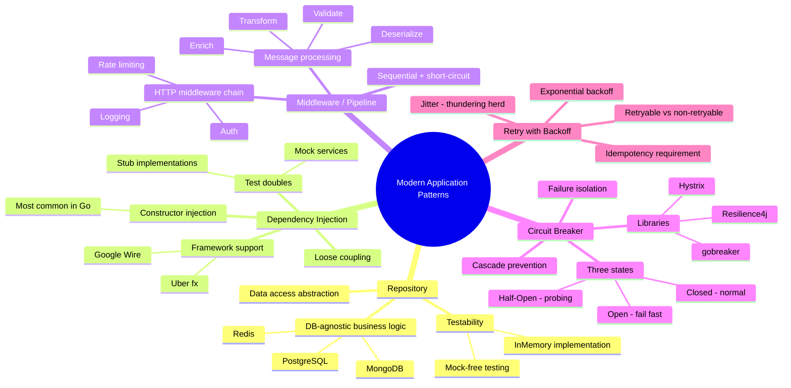
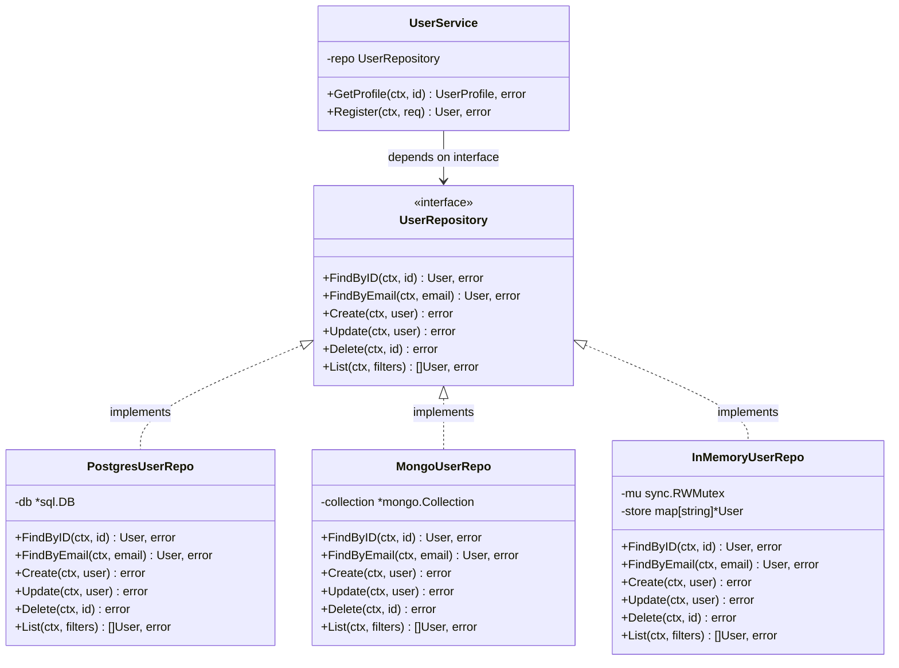
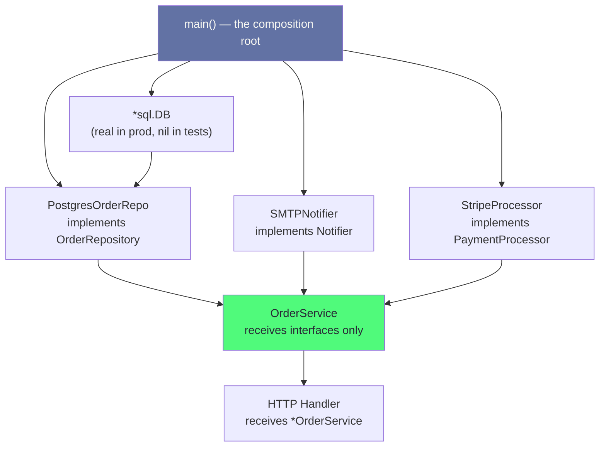
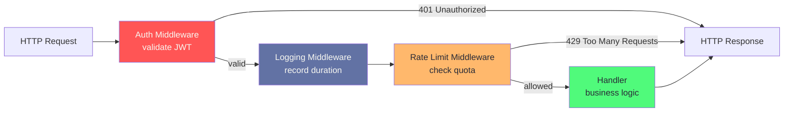
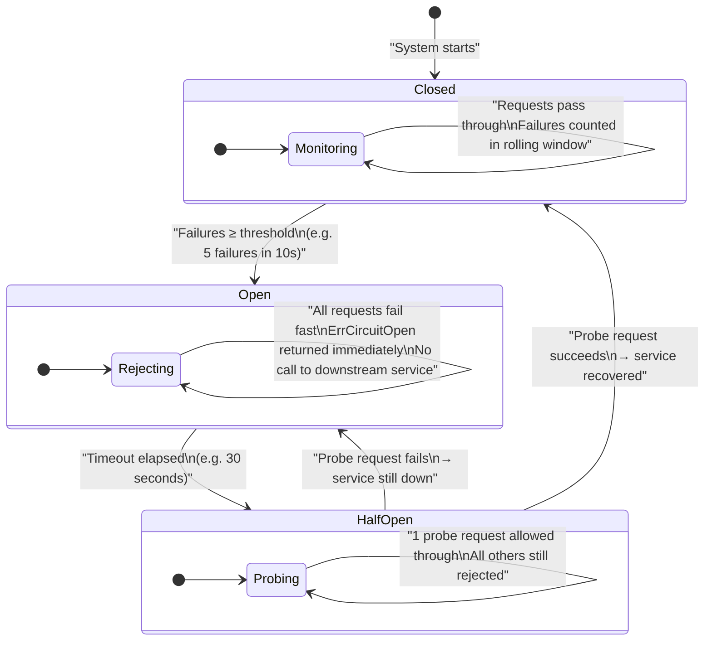
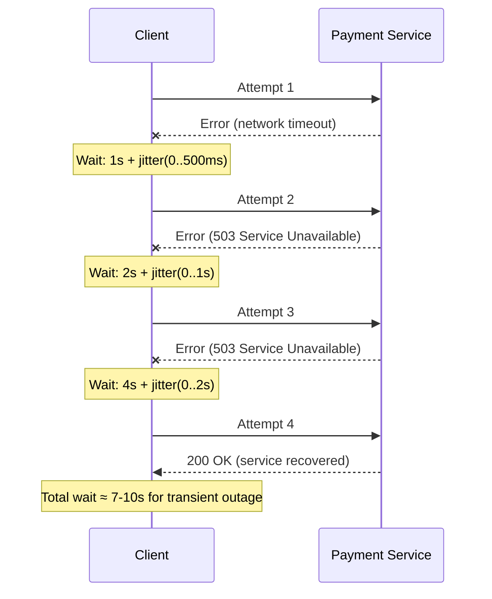
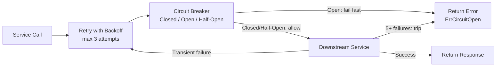

# Chapter 4: Modern Application Patterns

> These are not academic patterns — they are the patterns your team uses every week. Repository keeps your business logic portable. Dependency Injection makes your code testable. Middleware chains HTTP concerns cleanly. Circuit Breaker prevents cascade failures. Retry with Backoff handles the transient mess of distributed systems.

---

## Mind Map



---

## Overview

The Gang of Four patterns in the previous chapters were designed for in-process object collaboration. **Modern application patterns** address the realities of production software: databases that need to be swapped or mocked, services that fail intermittently, HTTP pipelines that accumulate cross-cutting concerns, and distributed systems where cascading failures are a daily threat.

| Pattern | Core Problem | Key Benefit |
|---------|-------------|-------------|
| **Repository** | Business logic tangled with SQL | DB-agnostic, unit-testable data access |
| **Dependency Injection** | Services create their own dependencies | Testability, swappable implementations |
| **Middleware / Pipeline** | Cross-cutting logic duplicated everywhere | Composable, reorderable processing chain |
| **Circuit Breaker** | Downstream failures cascade upstream | Fail fast, protect the entire system |
| **Retry with Backoff** | Transient failures lose real requests | Automatic recovery with controlled load |

---

## Pattern 1: Repository

### Real-World Analogy

Think of a library catalog. You walk up and say "I need the book on distributed systems." You don't care whether it is stored in the basement, on shelf 12B, in a digital archive, or on loan from another branch. The **librarian** (repository) knows where to find it. You only care about the result: the book.

The Repository pattern is exactly this: a clean interface that abstracts **how** data is fetched and stored, so the caller only expresses **what** it wants.

### The Problem

Without Repository, business logic directly embeds SQL:

```go
// BEFORE: SQL scattered through handler functions
func (h *Handler) GetUserProfile(w http.ResponseWriter, r *http.Request) {
    userID := r.PathValue("id")

    // SQL directly in handler — no way to unit-test this without a real DB
    row := h.db.QueryRowContext(r.Context(),
        "SELECT id, name, email, created_at FROM users WHERE id = $1 AND deleted_at IS NULL",
        userID,
    )

    var user User
    if err := row.Scan(&user.ID, &user.Name, &user.Email, &user.CreatedAt); err != nil {
        if errors.Is(err, sql.ErrNoRows) {
            http.Error(w, "not found", http.StatusNotFound)
            return
        }
        http.Error(w, "internal error", http.StatusInternalServerError)
        return
    }

    // Business logic now coupled to the DB row structure
    if user.CreatedAt.Before(time.Now().AddDate(-1, 0, 0)) {
        user.IsVeteran = true
    }

    json.NewEncoder(w).Encode(user)
}
```

Problems:
- Migrating from PostgreSQL to CockroachDB means touching every handler
- Unit testing requires a live database — slow, fragile CI
- The handler owns the schema; changing a column name breaks everything
- Business rules (IsVeteran logic) are entangled with raw SQL scanning

### Solution Structure



### Go Implementation

**The interface — domain-first, not DB-first:**

```go
// user_repository.go

package user

import "context"

// UserFilters are optional query parameters — zero value means no filter.
type UserFilters struct {
    EmailDomain string
    CreatedAfter time.Time
    Limit        int
    Offset       int
}

// UserRepository abstracts all persistence operations for the User domain.
// Business logic ONLY interacts with this interface — never with *sql.DB directly.
type UserRepository interface {
    FindByID(ctx context.Context, id string) (*User, error)
    FindByEmail(ctx context.Context, email string) (*User, error)
    Create(ctx context.Context, user *User) error
    Update(ctx context.Context, user *User) error
    Delete(ctx context.Context, id string) error
    List(ctx context.Context, filters UserFilters) ([]*User, error)
}
```

**PostgreSQL implementation:**

```go
// postgres_user_repo.go

package user

import (
    "context"
    "database/sql"
    "errors"
    "fmt"

    "github.com/lib/pq"
)

type postgresUserRepo struct {
    db *sql.DB
}

// NewPostgresUserRepo constructs a Postgres-backed UserRepository.
func NewPostgresUserRepo(db *sql.DB) UserRepository {
    return &postgresUserRepo{db: db}
}

func (r *postgresUserRepo) FindByID(ctx context.Context, id string) (*User, error) {
    const q = `
        SELECT id, name, email, created_at
        FROM users
        WHERE id = $1 AND deleted_at IS NULL`

    row := r.db.QueryRowContext(ctx, q, id)

    var u User
    if err := row.Scan(&u.ID, &u.Name, &u.Email, &u.CreatedAt); err != nil {
        if errors.Is(err, sql.ErrNoRows) {
            return nil, ErrUserNotFound
        }
        return nil, fmt.Errorf("postgresUserRepo.FindByID: %w", err)
    }
    return &u, nil
}

func (r *postgresUserRepo) Create(ctx context.Context, user *User) error {
    const q = `
        INSERT INTO users (id, name, email, created_at)
        VALUES ($1, $2, $3, $4)`

    _, err := r.db.ExecContext(ctx, q, user.ID, user.Name, user.Email, user.CreatedAt)
    if err != nil {
        // Translate Postgres unique violation to a domain error
        var pgErr *pq.Error
        if errors.As(err, &pgErr) && pgErr.Code == "23505" {
            return ErrEmailAlreadyExists
        }
        return fmt.Errorf("postgresUserRepo.Create: %w", err)
    }
    return nil
}

// FindByEmail, Update, Delete, List follow the same pattern...
```

**In-memory implementation for tests — no mocking framework needed:**

```go
// inmemory_user_repo.go

package user

import (
    "context"
    "sync"
)

// InMemoryUserRepo is a thread-safe in-memory implementation for unit tests.
// No database, no Docker, no test fixtures — just fast, isolated tests.
type InMemoryUserRepo struct {
    mu    sync.RWMutex
    store map[string]*User
    byEmail map[string]string // email -> id index
}

func NewInMemoryUserRepo() *InMemoryUserRepo {
    return &InMemoryUserRepo{
        store:   make(map[string]*User),
        byEmail: make(map[string]string),
    }
}

func (r *InMemoryUserRepo) FindByID(ctx context.Context, id string) (*User, error) {
    r.mu.RLock()
    defer r.mu.RUnlock()

    u, ok := r.store[id]
    if !ok {
        return nil, ErrUserNotFound
    }
    // Return a copy — prevent callers from mutating stored state
    copy := *u
    return &copy, nil
}

func (r *InMemoryUserRepo) Create(ctx context.Context, user *User) error {
    r.mu.Lock()
    defer r.mu.Unlock()

    if _, exists := r.byEmail[user.Email]; exists {
        return ErrEmailAlreadyExists
    }

    copy := *user
    r.store[user.ID] = &copy
    r.byEmail[user.Email] = user.ID
    return nil
}

// Seed is a test helper — not part of the interface, only on the concrete type.
func (r *InMemoryUserRepo) Seed(users ...*User) {
    for _, u := range users {
        copy := *u
        r.store[u.ID] = &copy
        r.byEmail[u.Email] = u.ID
    }
}
```

**Business logic using the repository — clean and DB-agnostic:**

```go
// user_service.go

package user

// UserService contains all business rules. It has no idea whether
// the repository uses Postgres, Mongo, or an in-memory map.
type UserService struct {
    repo UserRepository
}

func NewUserService(repo UserRepository) *UserService {
    return &UserService{repo: repo}
}

func (s *UserService) GetProfile(ctx context.Context, id string) (*UserProfile, error) {
    user, err := s.repo.FindByID(ctx, id)
    if err != nil {
        return nil, err
    }

    // Pure business logic — no SQL, no driver imports
    profile := &UserProfile{
        User:      user,
        IsVeteran: user.CreatedAt.Before(time.Now().AddDate(-1, 0, 0)),
        Tier:      calculateTier(user),
    }
    return profile, nil
}
```

**Unit test — fast, zero infrastructure:**

```go
func TestUserService_GetProfile_IsVeteran(t *testing.T) {
    repo := NewInMemoryUserRepo()
    repo.Seed(&User{
        ID:        "user-1",
        Name:      "Alice",
        Email:     "alice@example.com",
        CreatedAt: time.Now().AddDate(-2, 0, 0), // 2 years ago
    })

    svc := NewUserService(repo)
    profile, err := svc.GetProfile(context.Background(), "user-1")

    assert.NoError(t, err)
    assert.True(t, profile.IsVeteran) // pure business logic tested, no DB
}
```

### When to Use

- Non-trivial applications where business logic should remain DB-agnostic
- Any project where unit testing matters (which is every project)
- When the underlying database might change (PostgreSQL → CockroachDB, MySQL → Vitess)
- Clean Architecture or Hexagonal Architecture — Repository is the port

### When NOT to Use

- Tiny scripts or CLI tools with a single SQL query
- Prototyping where tight iteration speed matters more than structure
- When the "repository" would be a one-line wrapper with no real abstraction — YAGNI applies

### Real-World Usage

Martin Fowler coined the pattern in *Patterns of Enterprise Application Architecture* (2002). Every well-structured Go backend uses it: GORM's `DB` wrapped in domain-specific repositories, `sqlc`-generated query interfaces wrapped in repository structs, `pgx` connection pools hidden behind interfaces.

---

## Pattern 2: Dependency Injection

### Real-World Analogy

A professional kitchen doesn't grow its own vegetables. The head chef defines a **menu** (the service's needs) and specifies the ingredients required (dependencies: seasonal produce, imported spices, aged cheese). A **supplier** (the injector/main function) sources and delivers those ingredients. The kitchen only cooks — it doesn't farm.

Dependency Injection means: **declare what you need, don't create it yourself.**

### The Problem

Without DI, services create their own dependencies internally:

```go
// BEFORE: Tightly coupled — impossible to test
type OrderService struct{}

func (s *OrderService) PlaceOrder(ctx context.Context, order Order) error {
    // Creates its own DB connection — hardcoded driver, hardcoded env var
    db, err := sql.Open("postgres", os.Getenv("DATABASE_URL"))
    if err != nil {
        return err
    }
    defer db.Close()

    // Creates its own email client — hardcoded SMTP config
    emailClient, err := smtp.Dial(os.Getenv("SMTP_HOST") + ":25")
    if err != nil {
        return err
    }

    // Creates its own payment gateway — hardcoded API key
    paymentClient := stripe.NewClient(os.Getenv("STRIPE_SECRET_KEY"))

    // Actual logic buried under dependency construction
    if err := db.ExecContext(ctx, "INSERT INTO orders ...", order); err != nil {
        return err
    }
    paymentClient.Charge(order.Total, order.PaymentMethod)
    emailClient.Send(order.UserEmail, "Order confirmed")
    return nil
}
```

Problems:
- Testing requires real Postgres, real SMTP server, real Stripe account
- Can't test failure scenarios (what if payment fails? what if email fails?)
- Can't swap implementations (want to use SES instead of SMTP? Rewrite the service)
- OS environment is a hidden dependency — not visible from the function signature

### Solution: Constructor Injection



```go
// AFTER: Loosely coupled — fully testable

// Define interfaces for every external dependency
type OrderRepository interface {
    Create(ctx context.Context, order *Order) error
    FindByID(ctx context.Context, id string) (*Order, error)
    UpdateStatus(ctx context.Context, id string, status OrderStatus) error
}

type Notifier interface {
    SendOrderConfirmation(ctx context.Context, email string, order *Order) error
}

type PaymentProcessor interface {
    Charge(ctx context.Context, amount int64, method string) (string, error)
    Refund(ctx context.Context, chargeID string) error
}

// OrderService declares its dependencies — all interfaces
type OrderService struct {
    repo     OrderRepository
    notifier Notifier
    payment  PaymentProcessor
}

// Constructor injection — dependencies are provided from outside
func NewOrderService(
    repo OrderRepository,
    notifier Notifier,
    payment PaymentProcessor,
) *OrderService {
    return &OrderService{
        repo:     repo,
        notifier: notifier,
        payment:  payment,
    }
}

func (s *OrderService) PlaceOrder(ctx context.Context, order *Order) error {
    // Create order record
    if err := s.repo.Create(ctx, order); err != nil {
        return fmt.Errorf("create order: %w", err)
    }

    // Charge payment
    chargeID, err := s.payment.Charge(ctx, order.TotalCents, order.PaymentMethodID)
    if err != nil {
        // Rollback: mark order as payment-failed
        _ = s.repo.UpdateStatus(ctx, order.ID, StatusPaymentFailed)
        return fmt.Errorf("charge payment: %w", err)
    }

    order.ChargeID = chargeID
    _ = s.repo.UpdateStatus(ctx, order.ID, StatusConfirmed)

    // Notify — non-critical, don't fail the order if email fails
    if err := s.notifier.SendOrderConfirmation(ctx, order.UserEmail, order); err != nil {
        // Log but don't return error — notification failure ≠ order failure
        slog.Warn("failed to send order confirmation", "order_id", order.ID, "err", err)
    }

    return nil
}
```

**Testing with stub implementations — zero infrastructure:**

```go
// Stubs implement the interfaces with controlled behavior

type stubOrderRepo struct {
    createdOrders []*Order
    findResult    *Order
    findErr       error
}

func (r *stubOrderRepo) Create(ctx context.Context, order *Order) error {
    r.createdOrders = append(r.createdOrders, order)
    return nil
}
func (r *stubOrderRepo) FindByID(ctx context.Context, id string) (*Order, error) {
    return r.findResult, r.findErr
}
func (r *stubOrderRepo) UpdateStatus(ctx context.Context, id string, status OrderStatus) error {
    return nil
}

type stubPayment struct {
    shouldFail bool
    chargeID   string
}

func (p *stubPayment) Charge(ctx context.Context, amount int64, method string) (string, error) {
    if p.shouldFail {
        return "", errors.New("card declined")
    }
    return p.chargeID, nil
}
func (p *stubPayment) Refund(ctx context.Context, chargeID string) error { return nil }

type stubNotifier struct{ sent []string }

func (n *stubNotifier) SendOrderConfirmation(ctx context.Context, email string, order *Order) error {
    n.sent = append(n.sent, email)
    return nil
}

// Tests are now fast, isolated, and cover failure paths easily

func TestPlaceOrder_PaymentFails_MarksOrderFailed(t *testing.T) {
    repo := &stubOrderRepo{}
    notifier := &stubNotifier{}
    payment := &stubPayment{shouldFail: true}

    svc := NewOrderService(repo, notifier, payment)

    err := svc.PlaceOrder(context.Background(), &Order{
        ID:              "order-1",
        UserEmail:       "alice@example.com",
        TotalCents:      2500,
        PaymentMethodID: "pm_xxx",
    })

    assert.Error(t, err)
    assert.Contains(t, err.Error(), "charge payment")
    assert.Equal(t, StatusPaymentFailed, repo.createdOrders[0].Status)
    assert.Empty(t, notifier.sent) // confirmation not sent on failure
}
```

**Wiring in main() — the composition root:**

```go
// main.go — the only place that knows about concrete implementations

func main() {
    cfg := mustLoadConfig()

    // Create infrastructure
    db := mustOpenDB(cfg.DatabaseURL)
    defer db.Close()

    // Build dependency graph from bottom up
    orderRepo := order.NewPostgresOrderRepo(db)
    notifier := notification.NewSMTPNotifier(cfg.SMTPHost, cfg.SMTPPort)
    paymentProc := payment.NewStripeProcessor(cfg.StripeKey)

    // Inject into service
    orderSvc := order.NewOrderService(orderRepo, notifier, paymentProc)

    // Inject service into handler
    handler := api.NewOrderHandler(orderSvc)

    http.ListenAndServe(cfg.Addr, handler)
}
```

### Three DI Approaches in Go

**1. Constructor injection (recommended for most cases)**

As shown above. Explicit, compile-time verifiable, no magic. Dependencies are visible in function signatures. Most idiomatic Go code uses this approach.

**2. Google Wire — compile-time code generation**

Wire reads provider functions and generates the wiring code at build time. Zero runtime overhead, excellent for large applications with complex dependency graphs.

```go
// wire.go (build tag: //go:build wireinject)

//go:build wireinject

package main

func InitializeOrderHandler(cfg Config) (*api.OrderHandler, error) {
    wire.Build(
        order.NewPostgresOrderRepo,
        notification.NewSMTPNotifier,
        payment.NewStripeProcessor,
        order.NewOrderService,
        api.NewOrderHandler,
    )
    return nil, nil
}
```

Running `wire gen` generates `wire_gen.go` with all the wiring code. No reflection, no startup overhead.

**3. Uber fx — runtime DI framework**

fx uses reflection to wire dependencies at startup. More concise than manual wiring, good for very large applications.

```go
func main() {
    app := fx.New(
        fx.Provide(
            mustOpenDB,
            order.NewPostgresOrderRepo,
            notification.NewSMTPNotifier,
            payment.NewStripeProcessor,
            order.NewOrderService,
            api.NewOrderHandler,
        ),
        fx.Invoke(startHTTPServer),
    )
    app.Run()
}
```

**Recommendation:** Use constructor injection for most projects. Introduce Wire when the `main()` function exceeds ~50 lines of wiring code. Use fx when you need lifecycle hooks (fx.Lifecycle) or have a large platform team that prefers convention over explicit wiring.

### When to Use

- Any service with external dependencies (DB, cache, queue, third-party APIs)
- When unit testing matters — which is always for production services
- Clean/Hexagonal Architecture — DI is the mechanism that enforces layer boundaries
- When you want to swap implementations (test vs production, vendor A vs vendor B)

### When NOT to Use

- Simple utility functions with no external state
- Do not inject primitive values (`int`, `string`) — create config structs
- Tiny scripts or one-off tools where the wiring overhead exceeds the benefit

### Real-World Usage

Every serious Go backend uses constructor injection. Google Wire powers large Google internal services. Uber fx is widely used within Uber's Go monorepo. Spring (Java) and NestJS (TypeScript) are the most prominent DI frameworks in other ecosystems.

---

## Pattern 3: Middleware / Pipeline

### Real-World Analogy

Think of airport security. Your carry-on bag passes through a sequence of independent checkpoints: X-ray scanner, liquid check, passport verification, boarding pass scan. Each station is independent (can be added, removed, or reordered), each can reject your bag (short-circuit), and each processes the same object as it moves through the chain.

HTTP middleware chains and message processing pipelines work the same way.

### The Problem

Without a pipeline, cross-cutting concerns are duplicated in every handler:

```go
// BEFORE: Cross-cutting logic duplicated in every handler

func (h *Handler) CreateOrder(w http.ResponseWriter, r *http.Request) {
    // Auth — duplicated in 20 handlers
    token := r.Header.Get("Authorization")
    user, err := h.auth.ValidateToken(token)
    if err != nil {
        http.Error(w, "unauthorized", http.StatusUnauthorized)
        return
    }

    // Logging — duplicated in 20 handlers
    start := time.Now()
    defer func() {
        slog.Info("request completed",
            "method", r.Method,
            "path", r.URL.Path,
            "duration", time.Since(start),
        )
    }()

    // Rate limiting — duplicated in 20 handlers
    if !h.limiter.Allow(user.ID) {
        http.Error(w, "rate limit exceeded", http.StatusTooManyRequests)
        return
    }

    // Actual handler logic buried under boilerplate
    // ...
}
```

### Solution: Middleware Chain



**Go HTTP middleware — the standard pattern:**

```go
// middleware.go

package middleware

// Middleware wraps an http.Handler with additional behavior.
// This is the standard Go HTTP middleware signature.
type Middleware func(http.Handler) http.Handler

// Auth validates the JWT Bearer token and injects the user into context.
func Auth(tokenValidator TokenValidator) Middleware {
    return func(next http.Handler) http.Handler {
        return http.HandlerFunc(func(w http.ResponseWriter, r *http.Request) {
            token := strings.TrimPrefix(r.Header.Get("Authorization"), "Bearer ")
            if token == "" {
                http.Error(w, "missing token", http.StatusUnauthorized)
                return
            }

            user, err := tokenValidator.Validate(token)
            if err != nil {
                http.Error(w, "invalid token", http.StatusUnauthorized)
                return
            }

            // Inject user into context — downstream handlers retrieve it
            ctx := context.WithValue(r.Context(), contextKeyUser, user)
            next.ServeHTTP(w, r.WithContext(ctx))
        })
    }
}

// Logging records request method, path, status, and duration.
func Logging(logger *slog.Logger) Middleware {
    return func(next http.Handler) http.Handler {
        return http.HandlerFunc(func(w http.ResponseWriter, r *http.Request) {
            start := time.Now()

            // Wrap ResponseWriter to capture status code
            rw := &responseWriter{ResponseWriter: w, statusCode: http.StatusOK}
            next.ServeHTTP(rw, r)

            logger.Info("http request",
                "method", r.Method,
                "path", r.URL.Path,
                "status", rw.statusCode,
                "duration_ms", time.Since(start).Milliseconds(),
            )
        })
    }
}

// RateLimit enforces per-user request quotas.
func RateLimit(limiter RateLimiter) Middleware {
    return func(next http.Handler) http.Handler {
        return http.HandlerFunc(func(w http.ResponseWriter, r *http.Request) {
            user := UserFromContext(r.Context())

            if !limiter.Allow(user.ID) {
                w.Header().Set("Retry-After", "60")
                http.Error(w, "rate limit exceeded", http.StatusTooManyRequests)
                return
            }

            next.ServeHTTP(w, r)
        })
    }
}

// Chain composes middlewares right-to-left, so the first middleware
// in the list is the outermost (first to execute).
func Chain(middlewares ...Middleware) Middleware {
    return func(final http.Handler) http.Handler {
        for i := len(middlewares) - 1; i >= 0; i-- {
            final = middlewares[i](final)
        }
        return final
    }
}
```

**Clean handler registration — middleware applied declaratively:**

```go
// main.go

mux := http.NewServeMux()

// Build the shared middleware chain
stack := middleware.Chain(
    middleware.Logging(logger),      // outermost — runs first and last
    middleware.Auth(tokenValidator), // second — validates before rate limiting
    middleware.RateLimit(limiter),   // innermost before handler
)

// Apply stack to routes
mux.Handle("POST /orders", stack(orderHandler.Create))
mux.Handle("GET /orders/{id}", stack(orderHandler.Get))
mux.Handle("GET /healthz", healthHandler.Check) // health check skips auth
```

**Message processing pipeline — same concept, different domain:**

```go
// pipeline.go — generic pipeline for message/event processing

type Message struct {
    ID      string
    Payload []byte
    Headers map[string]string
    // Enriched as it moves through the pipeline
    ParsedBody interface{}
    UserID     string
}

// Processor is a single pipeline step.
type Processor func(ctx context.Context, msg *Message) error

// Pipeline executes steps sequentially; any step failure short-circuits.
type Pipeline struct {
    steps []Processor
    name  string
}

func NewPipeline(name string, steps ...Processor) *Pipeline {
    return &Pipeline{name: name, steps: steps}
}

func (p *Pipeline) Execute(ctx context.Context, msg *Message) error {
    for i, step := range p.steps {
        if err := step(ctx, msg); err != nil {
            return fmt.Errorf("pipeline %q step %d: %w", p.name, i, err)
        }
    }
    return nil
}

// Example: Kafka message processing pipeline
orderPipeline := NewPipeline("order-events",
    DeserializeJSON,      // []byte -> ParsedBody
    ValidateSchema,       // check required fields
    EnrichWithUserData,   // fetch user from cache, add to Message
    TransformToOrderEvent,// shape for downstream consumers
    PersistToDatabase,    // write to orders table
    AcknowledgeMessage,   // commit Kafka offset
)

// io.Reader pipeline — the Go standard library uses this pattern natively
// gzip.NewReader wraps base64.NewDecoder wraps the raw reader
reader := gzip.NewReader(base64.NewDecoder(base64.StdEncoding, rawReader))
```

### When to Use

- HTTP handlers with multiple cross-cutting concerns (auth, logging, tracing, rate limiting)
- Message/event processing with independent sequential steps
- ETL pipelines where each transformation is reusable
- When steps need to be added, removed, or reordered without touching handler logic

### When NOT to Use

- Steps are tightly coupled (step B needs step A's internals, not just the enriched message)
- Order never changes and there is only one step
- Simple single-purpose functions where a pipeline adds ceremony with no benefit

### Related Patterns

- **Ch02 Decorator** — Decorator adds behavior to a single object; Middleware is Decorator applied systematically to a chain of handlers.
- **Ch03 Chain of Responsibility** — In CoR, the first handler that can handle the request wins. In Middleware/Pipeline, every step processes the request.
- **Key distinction:** Middleware = same message flows through all steps. Chain of Responsibility = first capable handler responds.

### Real-World Usage

Go's standard `net/http` uses this pattern natively (any function with `func(http.Handler) http.Handler` signature). Chi, Gorilla, and Echo all build their middleware systems on this convention. Alice is a popular helper library for chaining. Unix pipes (`cat file | grep foo | sort | uniq`) are the original pipeline pattern.

---

## Pattern 4: Circuit Breaker

### Real-World Analogy

Your home's electrical circuit breaker panel exists for one reason: if too much current flows through a circuit (overload, short circuit), the breaker **trips** to protect your appliances and wiring from damage. After the breaker trips, you investigate the problem, fix it, and manually reset the breaker. You don't keep running current through a broken circuit hoping it will fix itself.

In distributed systems, the Circuit Breaker pattern does the same thing: when a downstream service starts failing, **stop sending requests** to it. Fail fast. Give it time to recover. Then cautiously test if it is healthy again.

### The Problem

Without Circuit Breaker, a failing downstream service creates a cascade:

```
Payment Service (slow: 8s timeout)
     ↑
Order Service: 100 goroutines waiting for Payment Service
     ↑
API Gateway: 1000 requests waiting for Order Service
     ↑
Clients: all see 30s timeouts before eventual 504
```

The cascade is caused by **resource exhaustion**: goroutines, connection pool slots, and memory all pile up waiting for a response that will never come (or comes too slowly). Adding a timeout helps, but you are still paying the timeout penalty for every request.

Circuit Breaker eliminates this by **rejecting requests immediately** once failure is detected — without touching the downstream service at all.

### State Machine



**Closed (normal):** Requests pass through to the downstream service. A rolling window counts failures. When failures exceed the threshold, the circuit opens.

**Open (tripped):** Requests are rejected immediately with `ErrCircuitOpen`. No network call is made. The downstream service gets time to recover without a flood of incoming traffic.

**Half-Open (testing):** After a configurable timeout, one probe request is allowed through. If it succeeds, the circuit closes and normal operation resumes. If it fails, the circuit reopens and the timeout restarts.

### Go Implementation

```go
// circuit_breaker.go

package resilience

import (
    "errors"
    "sync"
    "time"
)

// ErrCircuitOpen is returned when the circuit is open and requests are rejected.
var ErrCircuitOpen = errors.New("circuit breaker is open")

type State int

const (
    StateClosed   State = iota // Normal — requests pass through
    StateOpen                  // Tripped — requests rejected immediately
    StateHalfOpen              // Testing — one probe allowed through
)

func (s State) String() string {
    switch s {
    case StateClosed:
        return "closed"
    case StateOpen:
        return "open"
    case StateHalfOpen:
        return "half-open"
    default:
        return "unknown"
    }
}

// Config holds the Circuit Breaker tuning parameters.
type Config struct {
    // FailureThreshold is the number of consecutive failures that trip the circuit.
    FailureThreshold int
    // SuccessThreshold is the number of consecutive successes in half-open
    // state before the circuit closes (most implementations use 1).
    SuccessThreshold int
    // OpenTimeout is how long the circuit stays open before trying half-open.
    OpenTimeout time.Duration
}

// DefaultConfig returns sensible production defaults.
func DefaultConfig() Config {
    return Config{
        FailureThreshold: 5,
        SuccessThreshold: 1,
        OpenTimeout:      30 * time.Second,
    }
}

// CircuitBreaker wraps calls to an unreliable service.
// It is safe for concurrent use by multiple goroutines.
type CircuitBreaker struct {
    cfg             Config
    state           State
    failureCount    int
    successCount    int
    lastFailureTime time.Time
    mu              sync.Mutex

    // Callbacks for observability (optional)
    onStateChange func(from, to State)
}

// NewCircuitBreaker creates a CircuitBreaker in the Closed state.
func NewCircuitBreaker(cfg Config) *CircuitBreaker {
    return &CircuitBreaker{cfg: cfg, state: StateClosed}
}

// WithOnStateChange registers an optional callback for state transitions.
// Use this to emit metrics, log state changes, or trigger alerts.
func (cb *CircuitBreaker) WithOnStateChange(fn func(from, to State)) *CircuitBreaker {
    cb.onStateChange = fn
    return cb
}

// Execute runs fn through the circuit breaker.
// Returns ErrCircuitOpen immediately if the circuit is open.
// Records the result (success or failure) to drive state transitions.
func (cb *CircuitBreaker) Execute(fn func() error) error {
    cb.mu.Lock()

    // Evaluate state transitions before executing
    switch cb.state {
    case StateOpen:
        // Check if enough time has passed to attempt recovery
        if time.Since(cb.lastFailureTime) < cb.cfg.OpenTimeout {
            cb.mu.Unlock()
            return ErrCircuitOpen // fail fast — no network call
        }
        // Transition to half-open: allow one probe request
        cb.transitionTo(StateHalfOpen)

    case StateHalfOpen:
        // In half-open, only allow the first request (the probe).
        // Reject all concurrent requests while probe is in flight.
        if cb.failureCount > 0 {
            cb.mu.Unlock()
            return ErrCircuitOpen
        }
    }

    cb.mu.Unlock()

    // Execute the actual function (outside the lock — don't hold lock during I/O)
    err := fn()

    cb.mu.Lock()
    defer cb.mu.Unlock()

    if err != nil {
        cb.recordFailure()
    } else {
        cb.recordSuccess()
    }

    return err
}

func (cb *CircuitBreaker) recordFailure() {
    cb.failureCount++
    cb.successCount = 0
    cb.lastFailureTime = time.Now()

    switch cb.state {
    case StateClosed:
        if cb.failureCount >= cb.cfg.FailureThreshold {
            cb.transitionTo(StateOpen)
        }
    case StateHalfOpen:
        // Probe failed — reopen the circuit
        cb.transitionTo(StateOpen)
    }
}

func (cb *CircuitBreaker) recordSuccess() {
    cb.failureCount = 0
    cb.successCount++

    if cb.state == StateHalfOpen && cb.successCount >= cb.cfg.SuccessThreshold {
        cb.transitionTo(StateClosed)
    }
}

func (cb *CircuitBreaker) transitionTo(next State) {
    if cb.onStateChange != nil {
        cb.onStateChange(cb.state, next)
    }
    cb.state = next
    if next == StateOpen {
        cb.failureCount = 0
        cb.successCount = 0
    }
}

// State returns the current circuit state (for monitoring/dashboards).
func (cb *CircuitBreaker) State() State {
    cb.mu.Lock()
    defer cb.mu.Unlock()
    return cb.state
}
```

**Using Circuit Breaker in a service:**

```go
// payment_client.go

type PaymentClient struct {
    httpClient *http.Client
    baseURL    string
    cb         *resilience.CircuitBreaker
}

func NewPaymentClient(baseURL string) *PaymentClient {
    cb := resilience.NewCircuitBreaker(resilience.Config{
        FailureThreshold: 5,
        SuccessThreshold: 1,
        OpenTimeout:      30 * time.Second,
    }).WithOnStateChange(func(from, to resilience.State) {
        // Emit metrics when circuit state changes
        metrics.CircuitBreakerStateChange("payment_service", from.String(), to.String())
        slog.Warn("circuit breaker state changed",
            "service", "payment_service",
            "from", from,
            "to", to,
        )
    })

    return &PaymentClient{
        httpClient: &http.Client{Timeout: 2 * time.Second},
        baseURL:    baseURL,
        cb:         cb,
    }
}

func (c *PaymentClient) Charge(ctx context.Context, amount int64, method string) (string, error) {
    var chargeID string

    err := c.cb.Execute(func() error {
        req, _ := http.NewRequestWithContext(ctx, "POST", c.baseURL+"/charges", encodeJSON(map[string]interface{}{
            "amount": amount,
            "method": method,
        }))

        resp, err := c.httpClient.Do(req)
        if err != nil {
            return fmt.Errorf("http call failed: %w", err)
        }
        defer resp.Body.Close()

        if resp.StatusCode >= 500 {
            // Server-side errors are retryable — count as failures
            return fmt.Errorf("payment service returned %d", resp.StatusCode)
        }

        if resp.StatusCode == 402 {
            // Card declined — not a circuit-worthy failure, but also not retryable
            // Decode and return domain error — do NOT count as circuit failure
            // (return nil here, handle the 402 as a domain error separately)
        }

        chargeID = decodeChargeID(resp.Body)
        return nil
    })

    if errors.Is(err, resilience.ErrCircuitOpen) {
        // Circuit is open — return a fallback or fast-fail with clear error
        return "", fmt.Errorf("payment service unavailable (circuit open): %w", err)
    }

    return chargeID, err
}
```

**Circuit Breaker as HTTP middleware:**

```go
// Use circuit breaker as middleware in the HTTP pipeline (Pattern 3 + Pattern 4)

func CircuitBreakerMiddleware(cb *resilience.CircuitBreaker) middleware.Middleware {
    return func(next http.Handler) http.Handler {
        return http.HandlerFunc(func(w http.ResponseWriter, r *http.Request) {
            err := cb.Execute(func() error {
                rw := &captureWriter{ResponseWriter: w}
                next.ServeHTTP(rw, r)

                // Treat 5xx responses as failures for the circuit breaker
                if rw.statusCode >= 500 {
                    return fmt.Errorf("upstream returned %d", rw.statusCode)
                }
                return nil
            })

            if errors.Is(err, resilience.ErrCircuitOpen) {
                http.Error(w, "service temporarily unavailable", http.StatusServiceUnavailable)
            }
        })
    }
}
```

### When to Use

- Any synchronous call to an external service (HTTP, gRPC, database, cache)
- Preventing cascade failures in microservice architectures
- When "fail fast" is better than waiting for a 30s timeout under load
- High-traffic services where a slow downstream creates resource exhaustion

### When NOT to Use

- Calling local functions with no network I/O
- When a failure is expected behavior (e.g., cache miss — not a circuit failure)
- Simple scripts or low-traffic services where a circuit breaker adds overhead with no benefit

### Real-World Usage

**Sony's `gobreaker`** is the most popular Circuit Breaker library in the Go ecosystem. **Netflix Hystrix** (now in maintenance) was the library that popularized the pattern after a real incident where a single downstream API failure took down Netflix's entire API tier. **Envoy proxy** and **Istio** implement circuit breaking at the infrastructure layer. AWS SDK has built-in circuit breaking in its retry logic.

---

## Pattern 5: Retry with Backoff

### Real-World Analogy

You call a restaurant to make a reservation and the line is busy. You don't hang up and immediately redial 50 times per second — that would make the line busier. Instead, you wait a minute, try again. Still busy — wait two minutes. Then four minutes. Each retry waits longer than the last. You also add a small random offset so you are not calling at the exact same second as everyone else who got a busy signal.

This is **exponential backoff with jitter**.

### The Problem

Distributed systems have **transient failures**: a network packet drops, a DNS lookup times out for 200ms, a service is briefly overloaded during a deployment. Without retry, these transient failures result in user-visible errors for no good reason. With naive retry (immediate, no delay), you can make the problem worse:

```go
// BEFORE: Naive immediate retry — thundering herd

func callPaymentService(ctx context.Context, req PaymentRequest) (*PaymentResponse, error) {
    for i := 0; i < 3; i++ {
        resp, err := httpClient.Post("/charge", req)
        if err == nil {
            return resp, nil
        }
        // Immediate retry — all 1000 callers retry at the same microsecond
        // This turns a brief overload into a prolonged overload
    }
    return nil, errors.New("payment service unavailable after 3 attempts")
}
```

Problems:
- If the service is briefly overloaded, 1000 immediate retries pile onto it simultaneously — **thundering herd**
- Linear delay (`time.Sleep(1 * time.Second)`) doesn't back off enough for systemic failures
- No distinction between retryable errors (network timeout) and non-retryable errors (card declined)
- No jitter — all retrying clients are synchronized

### Retry Sequence (with exponential backoff + jitter)



### Go Implementation

```go
// retry.go

package resilience

import (
    "context"
    "errors"
    "fmt"
    "math/rand"
    "time"
)

// RetryConfig holds parameters for the retry strategy.
type RetryConfig struct {
    // MaxAttempts is the total number of attempts (1 = no retry).
    MaxAttempts int
    // BaseDelay is the initial wait duration before the first retry.
    BaseDelay time.Duration
    // MaxDelay caps the delay to prevent unbounded backoff.
    MaxDelay time.Duration
    // Multiplier determines how aggressively the delay grows (2.0 = exponential).
    Multiplier float64
    // IsRetryable determines if a given error should be retried.
    // If nil, all errors are retried.
    IsRetryable func(err error) bool
}

// DefaultRetryConfig returns production-sensible defaults for external service calls.
func DefaultRetryConfig() RetryConfig {
    return RetryConfig{
        MaxAttempts: 4,
        BaseDelay:   500 * time.Millisecond,
        MaxDelay:    30 * time.Second,
        Multiplier:  2.0,
        IsRetryable: IsRetryableError,
    }
}

// WithRetry executes fn with exponential backoff and jitter.
// Respects context cancellation — stops retrying if ctx is cancelled.
func WithRetry(ctx context.Context, cfg RetryConfig, fn func() error) error {
    delay := cfg.BaseDelay

    for attempt := 0; attempt < cfg.MaxAttempts; attempt++ {
        err := fn()

        if err == nil {
            return nil // success
        }

        // Check if we should retry this error
        if cfg.IsRetryable != nil && !cfg.IsRetryable(err) {
            // Non-retryable error (e.g., card declined, validation failure)
            return fmt.Errorf("non-retryable error on attempt %d: %w", attempt+1, err)
        }

        // Last attempt — don't sleep, just return the error
        if attempt == cfg.MaxAttempts-1 {
            return fmt.Errorf("max attempts (%d) exceeded: %w", cfg.MaxAttempts, err)
        }

        // Check for context cancellation before sleeping
        select {
        case <-ctx.Done():
            return fmt.Errorf("context cancelled during retry: %w", ctx.Err())
        default:
        }

        // Exponential backoff with full jitter
        // Jitter range: [0, delay] — randomizes the sleep duration
        // This spreads retrying clients across the backoff window (prevents thundering herd)
        jitter := time.Duration(rand.Int63n(int64(delay)))
        sleepDuration := delay + jitter

        // Sleep with context awareness — cancel retry if context expires
        select {
        case <-ctx.Done():
            return fmt.Errorf("context cancelled during backoff: %w", ctx.Err())
        case <-time.After(sleepDuration):
        }

        // Grow the delay for the next attempt, capped at MaxDelay
        delay = time.Duration(float64(delay) * cfg.Multiplier)
        if delay > cfg.MaxDelay {
            delay = cfg.MaxDelay
        }
    }

    return nil
}

// IsRetryableError returns true for errors that represent transient failures.
// Customize this for your specific infrastructure and error types.
func IsRetryableError(err error) bool {
    if err == nil {
        return false
    }

    // Context errors are NOT retryable — the caller already gave up
    if errors.Is(err, context.Canceled) || errors.Is(err, context.DeadlineExceeded) {
        return false
    }

    // Check for HTTP status codes embedded in error types
    var httpErr *HTTPError
    if errors.As(err, &httpErr) {
        switch {
        case httpErr.StatusCode == 429: // Too Many Requests — retryable with backoff
            return true
        case httpErr.StatusCode >= 500: // Server errors — retryable
            return true
        case httpErr.StatusCode >= 400: // Client errors — NOT retryable
            return false
        }
    }

    // Network-level errors are generally retryable
    // In production, also check for *url.Error, *net.OpError, etc.
    return true
}
```

**Typed error for HTTP status codes:**

```go
// http_error.go

type HTTPError struct {
    StatusCode int
    Message    string
}

func (e *HTTPError) Error() string {
    return fmt.Sprintf("HTTP %d: %s", e.StatusCode, e.Message)
}

// parseHTTPError converts an HTTP response to an HTTPError if the status is non-2xx.
func parseHTTPError(resp *http.Response) error {
    if resp.StatusCode >= 200 && resp.StatusCode < 300 {
        return nil
    }
    body, _ := io.ReadAll(resp.Body)
    return &HTTPError{
        StatusCode: resp.StatusCode,
        Message:    strings.TrimSpace(string(body)),
    }
}
```

**Using Retry in a real service call:**

```go
// payment_client.go — combining retry with the circuit breaker

func (c *PaymentClient) ChargeWithRetry(ctx context.Context, amount int64, method string) (string, error) {
    var chargeID string

    // Retry wraps the circuit breaker — retries only happen while circuit is closed
    err := resilience.WithRetry(ctx, resilience.RetryConfig{
        MaxAttempts: 3,
        BaseDelay:   200 * time.Millisecond,
        MaxDelay:    5 * time.Second,
        Multiplier:  2.0,
        IsRetryable: func(err error) bool {
            // Don't retry if the circuit is open — it will stay open
            if errors.Is(err, resilience.ErrCircuitOpen) {
                return false
            }
            return resilience.IsRetryableError(err)
        },
    }, func() error {
        return c.cb.Execute(func() error {
            // The actual HTTP call
            resp, err := c.doCharge(ctx, amount, method)
            if err != nil {
                return err
            }
            chargeID = resp.ChargeID
            return nil
        })
    })

    return chargeID, err
}
```

**Idempotency — the critical prerequisite for safe retry:**

```go
// IMPORTANT: Only retry idempotent operations safely.
// For non-idempotent operations, use an idempotency key to make them idempotent.

func (c *PaymentClient) doCharge(ctx context.Context, amount int64, method string) (*ChargeResponse, error) {
    req, _ := http.NewRequestWithContext(ctx, "POST", c.baseURL+"/charges",
        encodeJSON(ChargeRequest{
            Amount:         amount,
            PaymentMethod:  method,
            // Idempotency key — the payment processor uses this to deduplicate
            // If we retry with the same key, the processor returns the original result
            // without charging the customer twice.
            IdempotencyKey: generateIdempotencyKey(amount, method),
        }),
    )
    req.Header.Set("Idempotency-Key", generateIdempotencyKey(amount, method))

    resp, err := c.httpClient.Do(req)
    if err != nil {
        return nil, err
    }
    defer resp.Body.Close()

    if err := parseHTTPError(resp); err != nil {
        return nil, err
    }

    var result ChargeResponse
    json.NewDecoder(resp.Body).Decode(&result)
    return &result, nil
}

// generateIdempotencyKey creates a deterministic key from the request parameters.
// Same inputs always produce the same key — retries use the same key.
func generateIdempotencyKey(amount int64, method string) string {
    h := sha256.New()
    fmt.Fprintf(h, "%d|%s", amount, method)
    return hex.EncodeToString(h.Sum(nil))
}
```

### Backoff Strategies Compared

| Strategy | Formula | Behavior | Use When |
|---------|---------|----------|---------|
| **No retry** | — | Fail immediately | Never for transient errors |
| **Immediate retry** | delay = 0 | Retry at full speed | Only for CPU-bound idempotent operations |
| **Fixed delay** | delay = base | Always same wait | Simple scripts, low volume |
| **Linear backoff** | delay = base × n | Grows slowly | Moderate traffic, gradual relief |
| **Exponential backoff** | delay = base × 2^n | Grows fast | Network calls, external services |
| **Exponential + jitter** | delay = rand(0, base × 2^n) | Spread over window | **Production standard** — prevents thundering herd |

### When to Use

- Any network call to an external service (HTTP, gRPC, message queue, database reconnect)
- Operations that fail with "service temporarily unavailable" or "rate limit exceeded"
- Message queue consumer reconnects after broker restarts
- Database connection recovery after transient network interruption

### When NOT to Use

- **Non-transient errors:** 400 Bad Request (your payload is wrong — retrying won't fix it), 401 Unauthorized (your credentials are invalid), 404 Not Found
- **Non-idempotent operations without safeguards:** Charging a payment without an idempotency key will charge the customer twice
- **Strict latency requirements:** If P99 latency must be < 200ms, a 3-attempt retry with backoff cannot fit in that budget
- **When a Circuit Breaker is already open:** Retrying into an open circuit wastes resources

### Real-World Usage

AWS SDK uses exponential backoff with jitter for all API calls. gRPC has built-in retry policies configurable in the service config JSON. Kubernetes pod restart uses exponential backoff (10s → 20s → 40s → 5 min). The AWS Architecture Blog post "Exponential Backoff and Jitter" (2015) by Marc Brooker is the canonical reference for adding jitter.

---

## Comparison Table

| Pattern | Core Intent | Scope | Failure Handling | Go Idiom |
|---------|------------|-------|-----------------|---------|
| **Repository** | Abstract data persistence | Single service | Wraps DB errors as domain errors | Interface + struct |
| **Dependency Injection** | Decouple creation from use | Application-wide | Enables testing failure paths | Constructor + interface |
| **Middleware / Pipeline** | Sequential processing chain | Request / message | Each step short-circuits on error | `func(Handler) Handler` |
| **Circuit Breaker** | Prevent cascade failures | Cross-service calls | Fail fast when failure is systemic | Struct with state machine |
| **Retry with Backoff** | Handle transient failures | Per-call | Automatic recovery with controlled load | Higher-order function |

---

## Pattern Combinations

These patterns are designed to work together. Real production services use all five:

### Repository + Dependency Injection

The most fundamental combination — Repository defines what the service needs, DI provides the concrete implementation:

```go
// Service declares repository as a dependency (DI)
type UserService struct {
    repo UserRepository // defined by Pattern 1
}

// In tests: inject InMemoryUserRepo (no DB required)
svc := NewUserService(NewInMemoryUserRepo())

// In production: inject PostgresUserRepo
svc := NewUserService(NewPostgresUserRepo(db))
```

### Circuit Breaker + Retry with Backoff

Retry handles transient failures; Circuit Breaker handles systemic failures. Together, they cover the full spectrum of distributed system failures:



```go
// Retry wraps the circuit breaker
err := resilience.WithRetry(ctx, cfg, func() error {
    return cb.Execute(func() error {
        return callDownstream(ctx, req)
    })
})
```

**Why this order matters:** Retry is the outer layer. If the circuit is open, retry sees `ErrCircuitOpen` — configure `IsRetryable` to return `false` for this error so retry does not blindly attempt an open circuit. If the circuit is closed and calls fail transiently, retry fires before the circuit accumulates enough failures to trip.

### Middleware + Circuit Breaker

Apply Circuit Breaker as HTTP middleware to protect an entire route group:

```go
// Protect all outbound calls through the payment service
paymentCB := resilience.NewCircuitBreaker(resilience.DefaultConfig())

mux.Handle("POST /checkout", middleware.Chain(
    middleware.Auth(tokenValidator),
    middleware.Logging(logger),
    CircuitBreakerMiddleware(paymentCB), // applied at the HTTP layer
)(checkoutHandler))
```

### Full Stack: Real Production Microservice

```go
// main.go — how all 5 patterns compose in a real service

func main() {
    db := mustOpenDB(cfg.DatabaseURL)

    // Pattern 1: Repository
    userRepo := user.NewPostgresUserRepo(db)
    orderRepo := order.NewPostgresOrderRepo(db)

    // Pattern 4 + 5: Circuit Breaker + Retry for downstream call
    paymentCB := resilience.NewCircuitBreaker(resilience.DefaultConfig())
    paymentClient := payment.NewPaymentClient(cfg.PaymentServiceURL, paymentCB)

    // Pattern 2: Dependency Injection — inject everything into service
    orderSvc := order.NewOrderService(orderRepo, userRepo, paymentClient)

    // Pattern 3: Middleware pipeline
    handler := api.NewOrderHandler(orderSvc)
    stack := middleware.Chain(
        middleware.Logging(logger),
        middleware.Auth(tokenValidator),
        middleware.RateLimit(limiter),
    )

    mux.Handle("POST /orders", stack(handler.Create))
    http.ListenAndServe(cfg.Addr, mux)
}
```

---

## Practice Questions

### Easy

1. **Repository contract:** A junior engineer argues "why should `FindByID` return `*User` (pointer) rather than the DB row directly?" Explain why Repository returns domain types, not database rows. What happens when you add a new column to the `users` table if you return domain types? What happens if you return `sql.Row`?

   <details>
   <summary>Hint</summary>
   Domain types decouple the caller from schema changes — adding a column to the DB doesn't break callers if they only read the domain fields they care about. Returning sql.Row leaks the driver into the caller, meaning every caller imports database/sql, couples to your schema, and breaks when you add a nullable column they don't know how to handle.
   </details>

2. **DI anti-pattern:** A colleague's service has 12 constructor parameters: `NewService(db, cache, emailClient, smsClient, pushClient, s3Client, ...)`. What principle is being violated, and how would you fix it? (Hint: this is an SRP violation masquerading as a DI question.)

   <details>
   <summary>Hint</summary>
   Too many dependencies indicates the service has too many responsibilities. Split it: a NotificationService owns email + SMS + push, injected as a single Notifier interface. A StorageService owns S3. Now the main service receives two or three focused dependencies, not twelve.
   </details>

### Medium

3. **Circuit Breaker implementation:** Extend the Circuit Breaker above to support a **rolling window failure rate** instead of a consecutive failure count. For example: "trip if more than 50% of requests in the last 60 seconds failed (minimum 10 requests)." Why is a rolling window better than a consecutive counter for production traffic?

   <details>
   <summary>Hint</summary>
   A rolling window handles the case where requests succeed and fail interleaved — a consecutive counter would never trip if every other request succeeds. Use a circular buffer (ring buffer) of results with timestamps; count failures in the window on each call.
   </details>

4. **Retry with idempotency:** You are building a `TransferFunds` endpoint that moves money between accounts. A junior engineer adds `WithRetry` to it directly. Why is this dangerous? What must you implement first, and how does the Stripe idempotency key model solve it?

   <details>
   <summary>Hint</summary>
   Without idempotency protection, a retry after a network timeout that the server actually processed will execute the transfer twice. Implement idempotency keys: generate a unique key per user request, send it in a header, and have the server store (requestID → result). On duplicate keys, return the stored result without re-executing the transfer.
   </details>

### Hard

5. **Resilient service call design:** Design a complete `callInventoryService` function that:
   - Times out after 2 seconds per attempt
   - Retries up to 3 times with exponential backoff + jitter (only on 5xx and network errors)
   - Is protected by a Circuit Breaker (trip after 5 failures, 30s open timeout)
   - Logs all retries with attempt number and error
   - Returns a typed error that callers can distinguish: `ErrInventoryUnavailable` vs `ErrItemNotFound` vs `ErrCircuitOpen`

   Draw the flow diagram showing how a 5xx response propagates through all three layers (timeout → retry → circuit breaker → caller).

   <details>
   <summary>Hint</summary>
   Layer order (outside in): Retry → CircuitBreaker → HTTP call with timeout context. Retry sees ErrCircuitOpen as non-retryable. CircuitBreaker counts 5xx as failures. The HTTP call uses context.WithTimeout to enforce per-attempt timeout — this prevents retry from waiting longer than 2s per attempt. Total worst case: 3 attempts × (2s timeout + backoff) before caller gets the error.
   </details>

---

## Key Takeaway

> **These five patterns form the foundation of every production Go microservice.** Repository and DI make your code testable and DB-agnostic. Middleware keeps HTTP concerns composable and out of business logic. Circuit Breaker and Retry with Backoff are the resilience patterns that keep your system stable when (not if) downstream services fail. Use them together — they compose cleanly and address complementary failure modes.

---

## Related Chapters

| Chapter | Relevance |
|---------|-----------|
| [Ch02 — Structural Patterns](/design-patterns/ch02-structural-patterns) | Decorator pattern is the foundation for HTTP middleware |
| [Ch03 — Behavioral Patterns](/design-patterns/ch03-behavioral-patterns) | Chain of Responsibility vs Pipeline; State pattern in Circuit Breaker |
| [Ch05 — Distributed System Patterns](/design-patterns/ch05-distributed-system-patterns) | CQRS and Event Sourcing build on Repository; Saga uses Circuit Breaker |
| [Ch13 — Microservices](/system-design/part-3-architecture-patterns/ch13-microservices) | Service mesh implements Circuit Breaker at infrastructure layer |
| [Ch16 — Security & Reliability](/system-design/part-3-architecture-patterns/ch16-security-reliability) | Rate limiting, timeouts, and bulkhead pattern complement these five |
