# Chapter 5: Distributed System Patterns

> *Distributed systems are about managing failure gracefully. Every pattern in this chapter is an answer to the question: "What happens when part of the system breaks?"*

---

## Mind Map

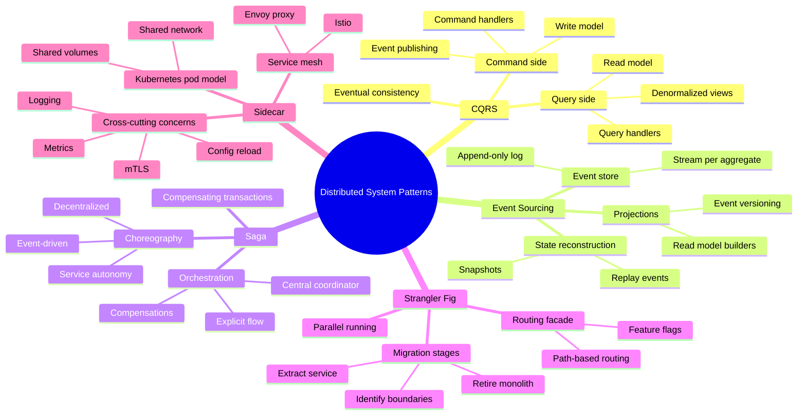

---

## Introduction

These five patterns operate at a different level than GoF patterns. They address problems that only emerge when you have **multiple services, distributed data, and eventual consistency**. You cannot solve them with a clever class hierarchy.

| Pattern | Core Problem | Key Trade-off |
|---------|-------------|---------------|
| **CQRS** | Read and write models conflict | Read performance vs model complexity |
| **Event Sourcing** | State history is lost on update | Full audit trail vs replay cost |
| **Saga** | Transactions span multiple services | Distributed consistency vs compensation complexity |
| **Strangler Fig** | Legacy migration without downtime | Safety vs maintaining two systems |
| **Sidecar** | Cross-cutting concerns in polyglot services | Separation of concerns vs operational overhead |

> Cross-reference: These patterns relate closely to the System Design handbook — [Ch13 Microservices](/system-design/part-3-architecture-patterns/ch13-microservices), [Ch14 Event-Driven Architecture](/system-design/part-3-architecture-patterns/ch14-event-driven-architecture), and [Ch15 Data Replication](/system-design/part-3-architecture-patterns/ch15-data-replication-consistency). This chapter focuses on **pattern mechanics and Go implementation** rather than system-level architecture.

---

## Pattern 1: CQRS (Command Query Responsibility Segregation)

### The Analogy

A restaurant kitchen vs the menu board. The **kitchen** (command side) handles orders and cooking — it works with normalized, relational data about ingredients, recipes, and inventory. The **menu board** (query side) shows customers what's available and at what price — it's pre-formatted, denormalized, optimized for display. They have different schemas, different data access patterns, and different scaling needs. The menu board doesn't update in real time every time someone orders a dish; it updates periodically when the kitchen signals a change.

### The Problem

A single data model serves both reads and writes. Writes need **normalized data** for consistency — avoid duplication, maintain referential integrity, validate business rules. Reads need **denormalized, pre-joined data** — fast, flat queries that avoid expensive joins. Optimizing for one hurts the other.

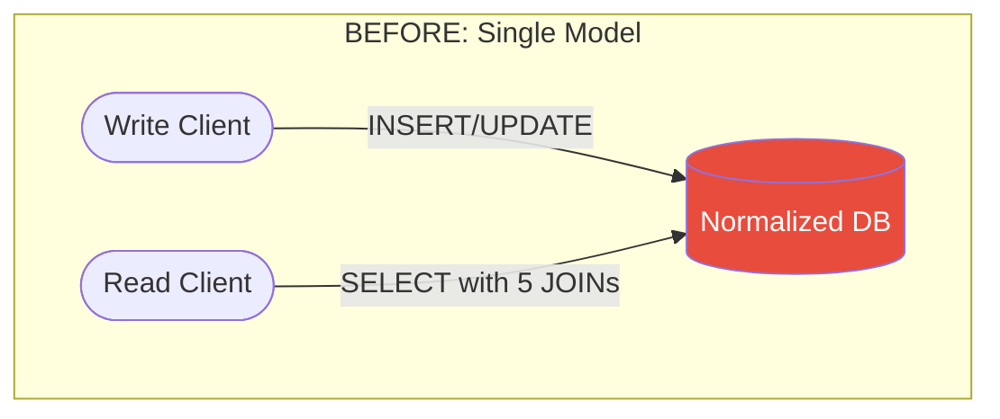

The `orders` table is normalized. But the UI needs: order ID, customer name, customer email, item names, item prices, item quantities, total, order status — which means joining `orders`, `customers`, `order_items`, `products`. On high-traffic systems, this join becomes the bottleneck.

### Solution Architecture

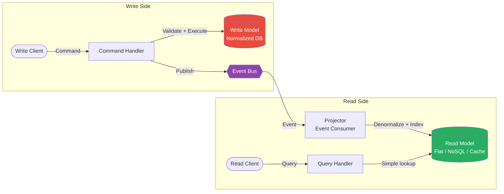

The write side handles commands (state-changing operations). The read side handles queries (data retrieval). They use **different data stores optimized for their purpose**.

### BEFORE — Single Model

```go
// BEFORE: One service doing everything — read/write conflict

type OrderService struct {
    db *sql.DB
}

// Write: needs normalized tables for integrity
func (s *OrderService) CreateOrder(ctx context.Context, req CreateOrderRequest) (*Order, error) {
    tx, err := s.db.BeginTx(ctx, nil)
    if err != nil {
        return nil, err
    }
    defer tx.Rollback()

    var order Order
    err = tx.QueryRowContext(ctx,
        "INSERT INTO orders (customer_id, status) VALUES ($1, 'pending') RETURNING id, created_at",
        req.CustomerID,
    ).Scan(&order.ID, &order.CreatedAt)
    if err != nil {
        return nil, err
    }

    for _, item := range req.Items {
        _, err = tx.ExecContext(ctx,
            "INSERT INTO order_items (order_id, product_id, quantity, price) VALUES ($1, $2, $3, $4)",
            order.ID, item.ProductID, item.Quantity, item.Price,
        )
        if err != nil {
            return nil, err
        }
    }
    return &order, tx.Commit()
}

// Read: same model, but expensive joins for the display view
func (s *OrderService) GetOrderSummary(ctx context.Context, orderID string) (*OrderSummary, error) {
    // 5-table JOIN every time — does not scale at read volume
    row := s.db.QueryRowContext(ctx, `
        SELECT o.id, c.name, c.email,
               COUNT(oi.id) as item_count,
               SUM(oi.quantity * oi.price) as total,
               o.status
        FROM orders o
        JOIN customers c ON c.id = o.customer_id
        JOIN order_items oi ON oi.order_id = o.id
        WHERE o.id = $1
        GROUP BY o.id, c.name, c.email, o.status
    `, orderID)
    // ...
}
```

### AFTER — CQRS

```go
// AFTER: Separate command and query models

// ── Command Side ──────────────────────────────────────────────────────────────

// Commands express intent, not state
type CreateOrderCommand struct {
    CustomerID string
    Items      []OrderItem
}

type ReserveItemsCommand struct {
    OrderID string
    Items   []OrderItem
}

// Command handler owns business logic + write model
type OrderCommandHandler struct {
    writeRepo OrderWriteRepository
    eventBus  EventBus
}

func (h *OrderCommandHandler) HandleCreateOrder(ctx context.Context, cmd CreateOrderCommand) (string, error) {
    // Validate domain rules
    if len(cmd.Items) == 0 {
        return "", errors.New("order must have at least one item")
    }

    order := NewOrder(cmd.CustomerID, cmd.Items)

    if err := h.writeRepo.Save(ctx, order); err != nil {
        return "", fmt.Errorf("saving order: %w", err)
    }

    // Publish event for read model projector and downstream services
    event := OrderCreatedEvent{
        OrderID:    order.ID,
        CustomerID: order.CustomerID,
        Items:      order.Items,
        CreatedAt:  order.CreatedAt,
    }
    if err := h.eventBus.Publish(ctx, "order.created", event); err != nil {
        return "", fmt.Errorf("publishing event: %w", err)
    }

    return order.ID, nil
}

// Write repository — normalized, transactional
type OrderWriteRepository interface {
    Save(ctx context.Context, order *Order) error
    FindByID(ctx context.Context, id string) (*Order, error)
    Update(ctx context.Context, order *Order) error
}

// ── Query Side ────────────────────────────────────────────────────────────────

// Read model is pre-denormalized — flat structure, optimized for display
type OrderSummary struct {
    OrderID      string    `json:"order_id"`
    CustomerName string    `json:"customer_name"`
    CustomerEmail string   `json:"customer_email"`
    ItemCount    int       `json:"item_count"`
    Items        []ItemLine `json:"items"`
    Total        float64   `json:"total"`
    Status       string    `json:"status"`
    CreatedAt    time.Time `json:"created_at"`
}

type ItemLine struct {
    ProductName string  `json:"product_name"`
    Quantity    int     `json:"quantity"`
    UnitPrice   float64 `json:"unit_price"`
    LineTotal   float64 `json:"line_total"`
}

// Query handler — no joins, simple key lookups
type OrderQueryHandler struct {
    readRepo OrderReadRepository
}

func (h *OrderQueryHandler) GetOrderSummary(ctx context.Context, orderID string) (*OrderSummary, error) {
    return h.readRepo.FindSummaryByID(ctx, orderID)
}

func (h *OrderQueryHandler) ListCustomerOrders(ctx context.Context, customerID string) ([]*OrderSummary, error) {
    return h.readRepo.FindByCustomerID(ctx, customerID)
}

// Read repository — optimized store (Redis, Elasticsearch, denormalized Postgres table)
type OrderReadRepository interface {
    FindSummaryByID(ctx context.Context, id string) (*OrderSummary, error)
    FindByCustomerID(ctx context.Context, customerID string) ([]*OrderSummary, error)
    Upsert(ctx context.Context, summary *OrderSummary) error
}

// ── Projector — bridges command side events to read model ────────────────────

type OrderProjector struct {
    readRepo    OrderReadRepository
    customerSvc CustomerService // to enrich with customer name/email
    productSvc  ProductService  // to enrich with product names
}

// Projectors consume events and rebuild/update the read model
func (p *OrderProjector) OnOrderCreated(ctx context.Context, event OrderCreatedEvent) error {
    customer, err := p.customerSvc.Get(ctx, event.CustomerID)
    if err != nil {
        return fmt.Errorf("fetching customer: %w", err)
    }

    var items []ItemLine
    var total float64
    for _, item := range event.Items {
        product, err := p.productSvc.Get(ctx, item.ProductID)
        if err != nil {
            return fmt.Errorf("fetching product %s: %w", item.ProductID, err)
        }
        lineTotal := float64(item.Quantity) * item.Price
        total += lineTotal
        items = append(items, ItemLine{
            ProductName: product.Name,
            Quantity:    item.Quantity,
            UnitPrice:   item.Price,
            LineTotal:   lineTotal,
        })
    }

    summary := &OrderSummary{
        OrderID:       event.OrderID,
        CustomerName:  customer.Name,
        CustomerEmail: customer.Email,
        ItemCount:     len(items),
        Items:         items,
        Total:         total,
        Status:        "pending",
        CreatedAt:     event.CreatedAt,
    }

    return p.readRepo.Upsert(ctx, summary)
}
```

### When to Use

- Read and write patterns differ significantly (e.g., complex queries vs simple writes)
- High read-to-write ratio requiring independent read scaling
- Read model needs data from multiple aggregates (denormalization required)
- Used alongside Event Sourcing (they pair naturally — see Pattern 2)
- Complex domain where optimizing writes for consistency is critical

### When NOT to Use

- Simple CRUD where read and write models are nearly identical
- Eventual consistency is unacceptable (CQRS introduces read lag)
- Small team/project — adds architectural complexity without proportional benefit
- Prototyping or MVPs — implement as regular CRUD, extract CQRS when the need is clear

### Real-World Usage

- **Shopify** — order system separates write path (cart checkout, inventory reservation) from read path (order history pages served from read replicas/cache)
- **Banking systems** — transaction write model is normalized and transactional; account statement read model is pre-computed and denormalized
- **Content management systems** — publishing (write) uses normalized content model; delivery (read) uses CDN-cached flat HTML/JSON

### Related Patterns

- **Event Sourcing** (Pattern 2) — CQRS pairs naturally; the event store IS the write model, projectors build read models from events
- **Repository** (Ch04) — each side of CQRS typically implements its own repository
- System Design [Ch14 Event-Driven Architecture](/system-design/part-3-architecture-patterns/ch14-event-driven-architecture)

---

## Pattern 2: Event Sourcing

### The Analogy

A bank account statement. Instead of storing the **current balance** ($500), you store every **transaction** that produced it:

```
AccountOpened ($0)
→ Deposited $1,000
→ Withdrew $300
→ PurchaseCharged $200
→ Current balance = $500
```

The balance is not stored — it is **derived by replaying events**. This means you can answer: "What was the balance on March 15th?" You can undo a transaction by replaying without it. You have a complete audit trail for regulators.

### The Problem

Traditional CRUD **overwrites state**. `UPDATE accounts SET balance = 500 WHERE id = 'acc-123'` destroys the previous value. You lose history. Audit requirements, debugging production incidents, and "undo" features all become impossible or require expensive bolt-on audit tables.

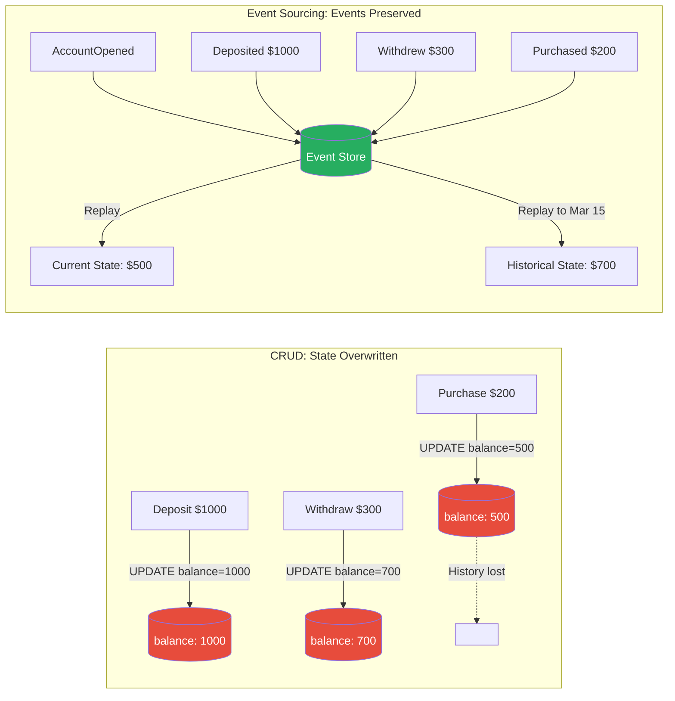

### Event Store Design

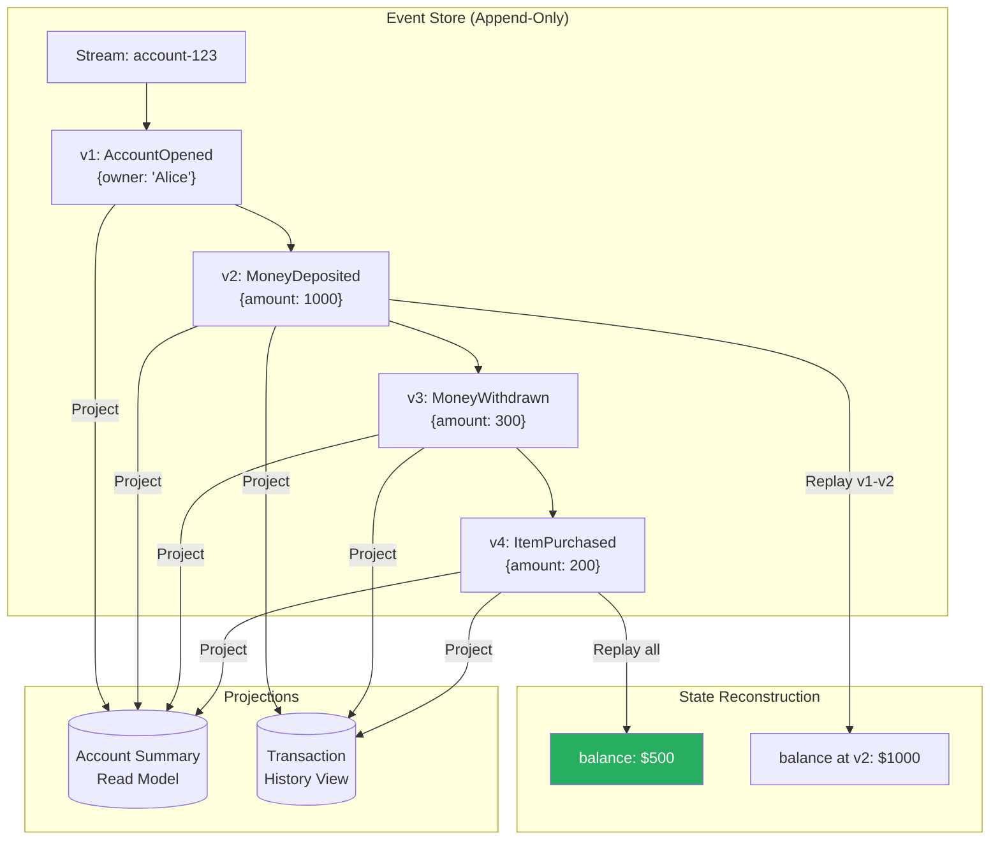

### Go Implementation

```go
// ── Core Event Types ──────────────────────────────────────────────────────────

// Event is an immutable fact about something that happened.
// It is never updated or deleted — only appended.
type Event struct {
    ID          string          `json:"id"`
    StreamID    string          `json:"stream_id"`    // e.g., "account-123"
    Type        string          `json:"type"`         // e.g., "MoneyDeposited"
    Data        json.RawMessage `json:"data"`
    Timestamp   time.Time       `json:"timestamp"`
    Version     int             `json:"version"`      // sequential within stream
    CausationID string          `json:"causation_id"` // which command caused this
}

// EventStore is append-only — no Update or Delete operations
type EventStore interface {
    // Append adds new events to a stream. expectedVersion enables optimistic concurrency:
    // if the stream's current version != expectedVersion, return a conflict error.
    Append(ctx context.Context, streamID string, events []Event, expectedVersion int) error

    // ReadStream returns all events for a stream from a given version onward.
    ReadStream(ctx context.Context, streamID string, fromVersion int) ([]Event, error)

    // ReadStreamTo returns events up to a specific version (for temporal queries).
    ReadStreamTo(ctx context.Context, streamID string, toVersion int) ([]Event, error)

    // SubscribeToAll registers a handler for all new events across all streams.
    SubscribeToAll(ctx context.Context, handler func(Event)) error
}

// ── Domain Aggregate ──────────────────────────────────────────────────────────

// BankAccount is rebuilt by replaying events — it never stores data directly.
type BankAccount struct {
    ID      string
    Owner   string
    Balance int64 // in cents
    Version int
    Status  string

    // Uncommitted events — accumulated during a command, persisted at the end
    uncommitted []Event
}

// Apply updates aggregate state from a single event.
// Apply must be deterministic and side-effect free — it only mutates state.
func (a *BankAccount) Apply(event Event) error {
    switch event.Type {
    case "AccountOpened":
        var data AccountOpenedData
        if err := json.Unmarshal(event.Data, &data); err != nil {
            return err
        }
        a.ID = data.AccountID
        a.Owner = data.Owner
        a.Balance = 0
        a.Status = "active"

    case "MoneyDeposited":
        var data MoneyDepositedData
        if err := json.Unmarshal(event.Data, &data); err != nil {
            return err
        }
        a.Balance += data.AmountCents

    case "MoneyWithdrawn":
        var data MoneyWithdrawnData
        if err := json.Unmarshal(event.Data, &data); err != nil {
            return err
        }
        a.Balance -= data.AmountCents

    case "AccountClosed":
        a.Status = "closed"

    default:
        return fmt.Errorf("unknown event type: %s", event.Type)
    }
    a.Version = event.Version
    return nil
}

// Withdraw is a command that validates rules and records an event (does not persist yet).
func (a *BankAccount) Withdraw(amountCents int64, reference string) error {
    if a.Status != "active" {
        return errors.New("account is not active")
    }
    if amountCents <= 0 {
        return errors.New("withdrawal amount must be positive")
    }
    if a.Balance < amountCents {
        return errors.New("insufficient funds")
    }

    data, _ := json.Marshal(MoneyWithdrawnData{
        AmountCents: amountCents,
        Reference:   reference,
    })
    event := Event{
        ID:       uuid.New().String(),
        StreamID: fmt.Sprintf("account-%s", a.ID),
        Type:     "MoneyWithdrawn",
        Data:     data,
        Version:  a.Version + 1,
    }

    // Apply immediately to update in-memory state
    a.Apply(event)
    // Queue for persistence
    a.uncommitted = append(a.uncommitted, event)
    return nil
}

// ── Rebuilding State from Events ──────────────────────────────────────────────

// RebuildAccount replays all events for an account stream to reconstruct current state.
func RebuildAccount(events []Event) (*BankAccount, error) {
    account := &BankAccount{}
    for _, event := range events {
        if err := account.Apply(event); err != nil {
            return nil, fmt.Errorf("applying event %s (v%d): %w", event.Type, event.Version, err)
        }
    }
    return account, nil
}

// AccountAtVersion rebuilds state up to a specific version — temporal query.
func AccountAtVersion(store EventStore, ctx context.Context, accountID string, version int) (*BankAccount, error) {
    events, err := store.ReadStreamTo(ctx, fmt.Sprintf("account-%s", accountID), version)
    if err != nil {
        return nil, err
    }
    return RebuildAccount(events)
}

// ── Snapshots — Performance Optimization ─────────────────────────────────────

// For high-traffic aggregates, replaying 10,000 events on every read is too slow.
// Snapshots capture the state at a checkpoint version; you replay only from snapshot + delta.

type AccountSnapshot struct {
    AccountID string        `json:"account_id"`
    State     *BankAccount  `json:"state"`
    Version   int           `json:"version"`
    CreatedAt time.Time     `json:"created_at"`
}

type SnapshotStore interface {
    Save(ctx context.Context, snapshot AccountSnapshot) error
    Load(ctx context.Context, accountID string) (*AccountSnapshot, error)
}

// LoadAccountWithSnapshot loads from snapshot + delta events (efficient)
func LoadAccountWithSnapshot(
    ctx context.Context,
    accountID string,
    eventStore EventStore,
    snapshotStore SnapshotStore,
) (*BankAccount, error) {
    snapshot, err := snapshotStore.Load(ctx, accountID)
    fromVersion := 0
    var account *BankAccount

    if err == nil && snapshot != nil {
        // Start from snapshot version — only replay delta
        account = snapshot.State
        fromVersion = snapshot.Version + 1
    } else {
        account = &BankAccount{}
    }

    events, err := eventStore.ReadStream(ctx, fmt.Sprintf("account-%s", accountID), fromVersion)
    if err != nil {
        return nil, err
    }
    for _, event := range events {
        if err := account.Apply(event); err != nil {
            return nil, err
        }
    }

    // Optionally save a new snapshot if delta was large
    if len(events) > 100 {
        _ = snapshotStore.Save(ctx, AccountSnapshot{
            AccountID: accountID,
            State:     account,
            Version:   account.Version,
            CreatedAt: time.Now(),
        })
    }
    return account, nil
}

// ── Event Versioning — Schema Evolution ──────────────────────────────────────

// Events are immutable once stored. When the schema changes, use upcasting:
// transform old event format to new format on the way out of the store.

type EventUpcaster interface {
    Upcast(event Event) Event
}

// MoneyDepositedV1 → MoneyDepositedV2 (added "currency" field)
type MoneyDepositedUpcaster struct{}

func (u MoneyDepositedUpcaster) Upcast(event Event) Event {
    if event.Type != "MoneyDeposited" {
        return event
    }
    var v1 struct {
        AmountCents int64 `json:"amount_cents"`
    }
    if json.Unmarshal(event.Data, &v1) != nil {
        return event
    }
    // Check if already v2 (has currency field)
    var v2 struct {
        AmountCents int64  `json:"amount_cents"`
        Currency    string `json:"currency"`
    }
    if json.Unmarshal(event.Data, &v2) == nil && v2.Currency != "" {
        return event // already v2
    }
    // Upcast: add default currency
    v2.AmountCents = v1.AmountCents
    v2.Currency = "USD"
    data, _ := json.Marshal(v2)
    return Event{
        ID: event.ID, StreamID: event.StreamID, Type: event.Type,
        Data: data, Timestamp: event.Timestamp, Version: event.Version,
    }
}
```

### When to Use

- Full audit trail required (finance, healthcare, legal, compliance)
- Need temporal queries ("what was the state at time X?")
- Event-driven architecture where downstream systems react to state changes
- Debugging complex distributed behavior (replay to reproduce bugs)
- "Undo" functionality in business workflows

### When NOT to Use

- Simple CRUD with no audit or history requirements
- Event schemas change frequently (upcasting becomes complex fast)
- Team is new to event sourcing — high learning curve, easy to get wrong
- Eventual consistency is unacceptable for the primary use case
- Events are too coarse (the whole entity per change) — defeats the purpose

### Real-World Usage

- **Banking ledgers** — the canonical use case; every transaction is an event
- **Git** — the commit log is event sourcing at the file system level; `git log` replays events; `git checkout <sha>` is a temporal query
- **Apache Kafka** as event store — Kafka's log is append-only, retained forever with log compaction
- **EventStoreDB** — purpose-built event store (Greg Young's project, the author who named CQRS/ES)
- **Axon Framework** — Java event sourcing framework used in enterprise DDD systems

### Related Patterns

- **CQRS** (Pattern 1) — the natural companion; event store = write model; projectors build read models from events
- System Design [Ch14 Event-Driven Architecture](/system-design/part-3-architecture-patterns/ch14-event-driven-architecture)

---

## Pattern 3: Saga

### The Analogy

Booking a trip online — you reserve a flight, then a hotel, then a car rental. These are **three separate systems**. If the car rental is unavailable at the end, you need to **cancel the hotel and flight** (compensating actions). There is no single database transaction that spans all three companies' systems. You coordinate through a sequence of actions, each reversible, with explicit compensation steps.

### The Problem

Distributed transactions across microservices. An e-commerce order requires:

1. **Order Service** — create the order
2. **Payment Service** — charge the customer
3. **Inventory Service** — reserve the items
4. **Shipping Service** — schedule delivery

Each service owns its own database. **Two-Phase Commit (2PC)** would require all four databases to lock until every participant confirms — creating a slow, fragile distributed lock that fails if any participant goes down.

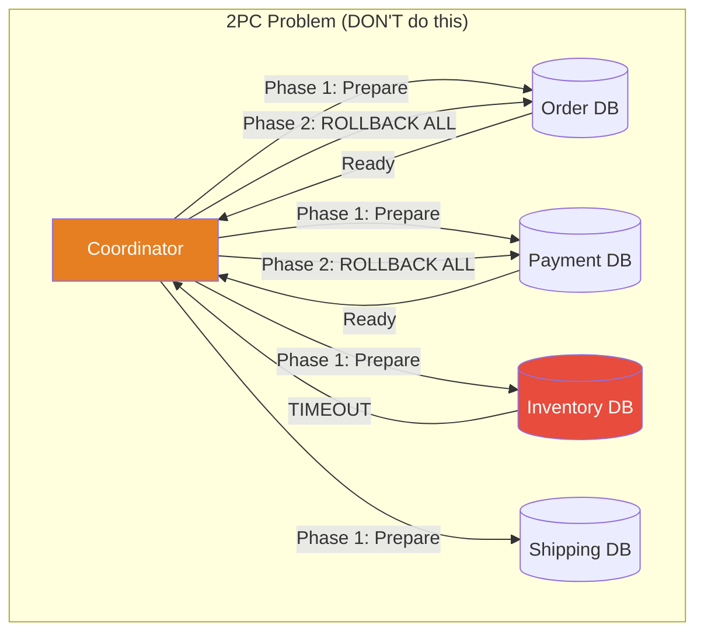

### Choreography Saga

Each service publishes an event when its step completes. The next service listens and reacts. There is no central coordinator — services are autonomous.

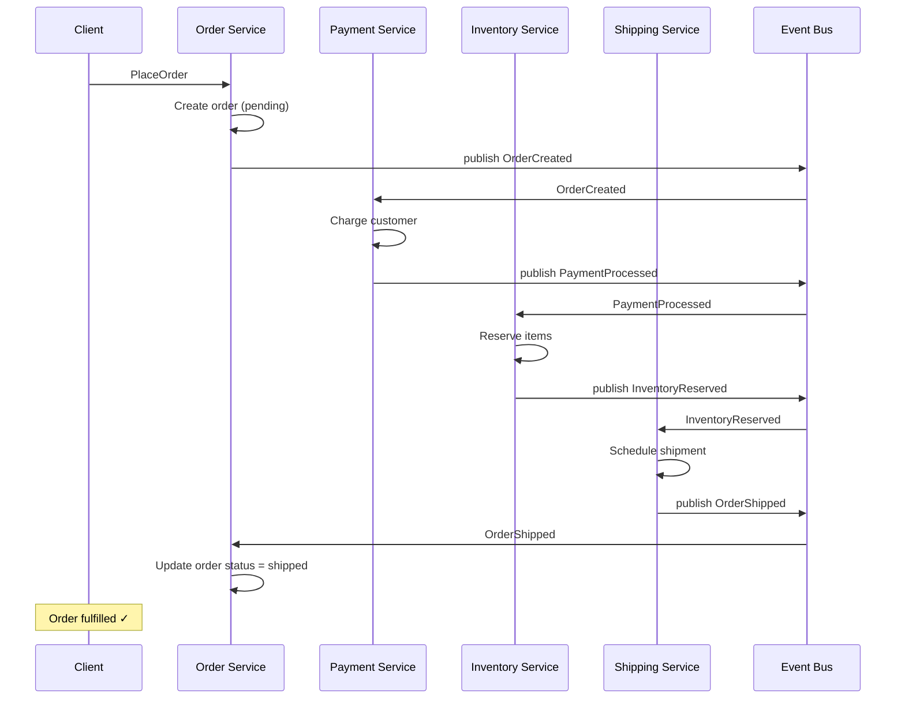

**Compensation flow when InventoryService fails:**

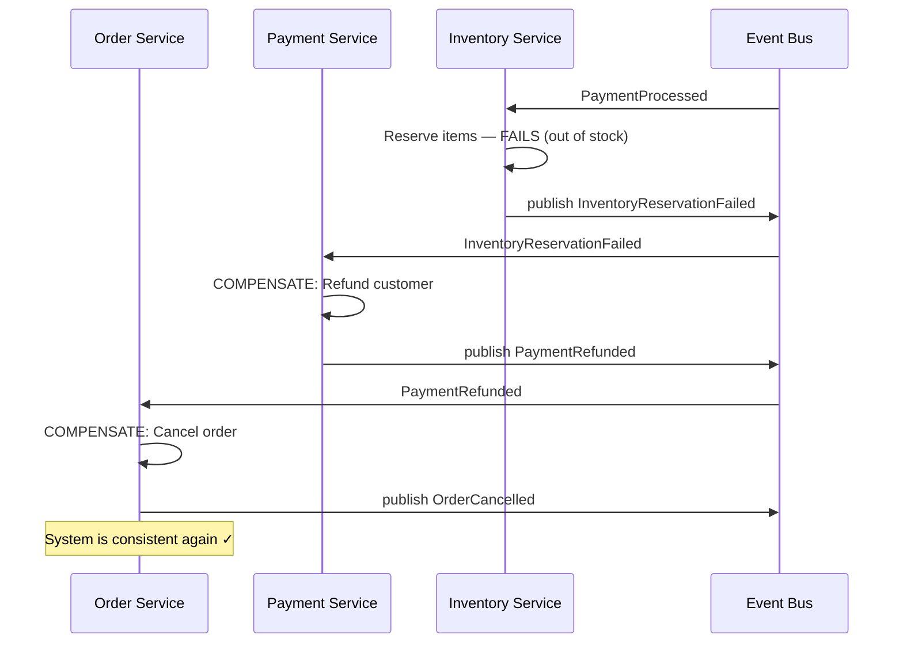

### Orchestration Saga

A central **Saga Orchestrator** coordinates each step. It knows the full workflow, calls each service explicitly, and drives compensation on failure.

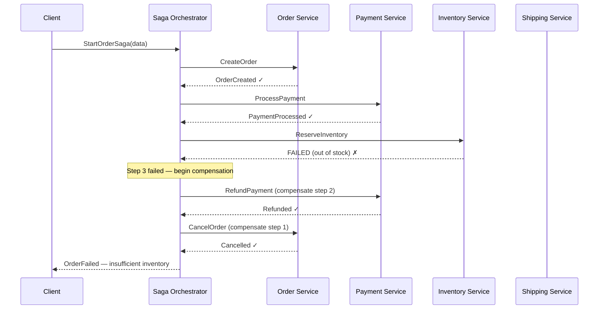

### Go Implementation — Orchestration

```go
// ── Saga Orchestrator ─────────────────────────────────────────────────────────

// SagaData holds the shared context passed between steps.
// Use a concrete struct per saga type for type safety.
type OrderSagaData struct {
    OrderID    string
    CustomerID string
    Items      []OrderItem
    PaymentID  string  // populated by payment step
    ShipmentID string  // populated by shipping step
}

// SagaStep defines one unit of work plus its compensation.
// Every step MUST have a compensation — if compensation is a no-op, make that explicit.
type SagaStep[T any] struct {
    Name       string
    Execute    func(ctx context.Context, data *T) error
    Compensate func(ctx context.Context, data *T) error
}

// SagaOrchestrator runs steps in sequence; compensates in reverse on failure.
type SagaOrchestrator[T any] struct {
    steps  []SagaStep[T]
    store  SagaStateStore // persist saga state for crash recovery
}

func NewOrderSagaOrchestrator(
    orderSvc OrderService,
    paymentSvc PaymentService,
    inventorySvc InventoryService,
    shippingSvc ShippingService,
    store SagaStateStore,
) *SagaOrchestrator[OrderSagaData] {
    steps := []SagaStep[OrderSagaData]{
        {
            Name: "CreateOrder",
            Execute: func(ctx context.Context, data *OrderSagaData) error {
                orderID, err := orderSvc.Create(ctx, data.CustomerID, data.Items)
                if err != nil {
                    return fmt.Errorf("creating order: %w", err)
                }
                data.OrderID = orderID
                return nil
            },
            Compensate: func(ctx context.Context, data *OrderSagaData) error {
                return orderSvc.Cancel(ctx, data.OrderID)
            },
        },
        {
            Name: "ProcessPayment",
            Execute: func(ctx context.Context, data *OrderSagaData) error {
                paymentID, err := paymentSvc.Charge(ctx, data.CustomerID, calculateTotal(data.Items))
                if err != nil {
                    return fmt.Errorf("processing payment: %w", err)
                }
                data.PaymentID = paymentID
                return nil
            },
            Compensate: func(ctx context.Context, data *OrderSagaData) error {
                return paymentSvc.Refund(ctx, data.PaymentID)
            },
        },
        {
            Name: "ReserveInventory",
            Execute: func(ctx context.Context, data *OrderSagaData) error {
                return inventorySvc.Reserve(ctx, data.OrderID, data.Items)
            },
            Compensate: func(ctx context.Context, data *OrderSagaData) error {
                return inventorySvc.Release(ctx, data.OrderID, data.Items)
            },
        },
        {
            Name: "ScheduleShipping",
            Execute: func(ctx context.Context, data *OrderSagaData) error {
                shipmentID, err := shippingSvc.Schedule(ctx, data.OrderID, data.CustomerID)
                if err != nil {
                    return fmt.Errorf("scheduling shipping: %w", err)
                }
                data.ShipmentID = shipmentID
                return nil
            },
            Compensate: func(ctx context.Context, data *OrderSagaData) error {
                return shippingSvc.Cancel(ctx, data.ShipmentID)
            },
        },
    }
    return &SagaOrchestrator[OrderSagaData]{steps: steps, store: store}
}

// Run executes the saga. On any failure, compensates completed steps in reverse order.
func (s *SagaOrchestrator[T]) Run(ctx context.Context, sagaID string, data *T) error {
    // Persist initial state for crash recovery
    if err := s.store.Save(ctx, sagaID, "started", data); err != nil {
        return fmt.Errorf("persisting saga state: %w", err)
    }

    completed := make([]int, 0, len(s.steps))

    for i, step := range s.steps {
        if err := step.Execute(ctx, data); err != nil {
            // Persist failure state before compensating
            _ = s.store.Save(ctx, sagaID, fmt.Sprintf("failed-at-%s", step.Name), data)

            // Compensate in reverse order
            for j := len(completed) - 1; j >= 0; j-- {
                compensateStep := s.steps[completed[j]]
                if compErr := compensateStep.Compensate(ctx, data); compErr != nil {
                    // Log compensation failure — requires manual intervention
                    // Do NOT stop compensating other steps
                    slog.Error("compensation failed",
                        "saga_id", sagaID,
                        "step", compensateStep.Name,
                        "error", compErr,
                    )
                }
            }

            _ = s.store.Save(ctx, sagaID, "compensated", data)
            return fmt.Errorf("saga failed at step %s (step %d): %w", step.Name, i+1, err)
        }
        completed = append(completed, i)
        // Persist progress after each successful step
        _ = s.store.Save(ctx, sagaID, fmt.Sprintf("completed-%s", step.Name), data)
    }

    _ = s.store.Save(ctx, sagaID, "completed", data)
    return nil
}

// SagaStateStore persists saga progress — critical for crash recovery.
// If the orchestrator crashes mid-saga, it can resume from the last saved checkpoint.
type SagaStateStore interface {
    Save(ctx context.Context, sagaID string, status string, data interface{}) error
    Load(ctx context.Context, sagaID string) (status string, data json.RawMessage, err error)
}

// ── Idempotency — Steps may be retried ───────────────────────────────────────

// Steps must be idempotent: calling them twice has the same effect as calling once.
// Use idempotency keys passed as part of the saga data.

func (svc *paymentServiceImpl) Charge(ctx context.Context, customerID string, amount int64) (string, error) {
    idempotencyKey := fmt.Sprintf("saga-%s-payment", ctx.Value("saga_id"))

    // Check if already charged with this key
    if existing, err := svc.findByIdempotencyKey(ctx, idempotencyKey); err == nil {
        return existing.PaymentID, nil // idempotent: return existing result
    }

    // Actually charge
    return svc.stripe.Charge(ctx, customerID, amount, idempotencyKey)
}
```

### Choreography vs Orchestration — Trade-offs

| Dimension | Choreography | Orchestration |
|-----------|-------------|---------------|
| **Coupling** | Loose — services only know about events | Tighter — orchestrator knows all services |
| **Visibility** | Hard — flow is implicit in event subscriptions | Easy — orchestrator defines the entire flow |
| **Debugging** | Hard — follow event chain across services | Easier — check orchestrator state |
| **Single point of failure** | None — no central coordinator | Orchestrator (mitigated by persistence) |
| **Adding steps** | Low risk — add new listener | Must modify orchestrator |
| **Compensations** | Each service handles its own rollback | Orchestrator drives compensation explicitly |
| **Best for** | Simple flows, high service autonomy | Complex flows, explicit control, long-running |

### When to Use

- Distributed transactions across microservices that own their own databases
- Long-running business processes (order fulfillment, booking workflows)
- Eventual consistency is acceptable (the system will be consistent, but not immediately)
- Each step has a clear compensating action

### When NOT to Use

- Single database — use a regular ACID transaction instead
- Strong consistency required — Saga only provides eventual consistency
- Operations that cannot be compensated (e.g., sending an email — you can send a correction but not "unsend")
- Team is not ready to handle eventual consistency complexity

### Real-World Usage

- **Uber** trip lifecycle — requesting, accepting, route planning, billing across independent services
- **E-commerce order fulfillment** — every major retailer uses saga-like patterns for checkout
- **Temporal.io** — workflow engine that implements saga with durable execution (Go SDK available)
- **AWS Step Functions** — orchestration-style saga as a managed service

### Related Patterns

- System Design [Ch13 Microservices](/system-design/part-3-architecture-patterns/ch13-microservices)
- System Design [Ch14 Event-Driven Architecture](/system-design/part-3-architecture-patterns/ch14-event-driven-architecture)

---

## Pattern 4: Strangler Fig

### The Analogy

A strangler fig tree — it begins as a vine that climbs an existing tree. Over years, the fig grows around the host tree, eventually replacing it entirely. The old tree dies inside, but at no point was the forest without a tree. **Incremental replacement, never a risky big-bang rewrite.**

### The Problem

A legacy monolith that cannot be rewritten all at once. You need to migrate to microservices, but:

- The monolith is too large to rewrite safely in one project
- Downtime is unacceptable
- Business cannot pause feature development for a 12-month rewrite
- The "big bang" rewrite has a 70%+ failure rate in industry

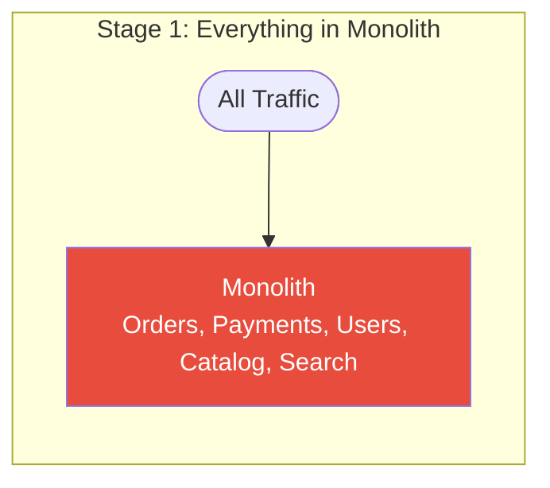

```mermaid
graph LR
    subgraph "Stage 2: Proxy Routes Extracted Services"
        C2([All Traffic]) --> P[Strangler\nProxy / Facade]
        P -->|"/api/search/*"| NS[New Search\nMicroservice]
        P -->|"/api/orders/*"| NO[New Order\nMicroservice]
        P -->|"everything else"| M2[Monolith\n(shrinking)]
        style P fill:#8e44ad,color:#fff
        style NS fill:#27ae60,color:#fff
        style NO fill:#27ae60,color:#fff
        style M2 fill:#e67e22,color:#fff
    end
```

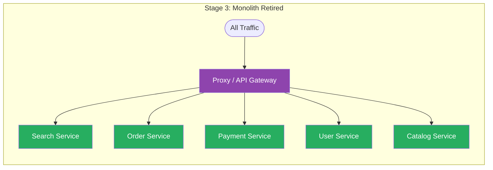

### Go Implementation — Routing Facade

```go
// ── Strangler Proxy ───────────────────────────────────────────────────────────

// StranglerProxy routes requests between the legacy monolith and new microservices.
// As more paths are extracted, migratedPaths grows and the monolith shrinks.
type StranglerProxy struct {
    legacy         *httputil.ReverseProxy
    newService     *httputil.ReverseProxy
    migratedPaths  []string
    featureFlags   FeatureFlagClient
}

func NewStranglerProxy(legacyURL, newServiceURL string, flags FeatureFlagClient) *StranglerProxy {
    return &StranglerProxy{
        legacy:        newReverseProxy(legacyURL),
        newService:    newReverseProxy(newServiceURL),
        featureFlags:  flags,
        migratedPaths: []string{
            "/api/orders",
            "/api/order-items",
        },
    }
}

func (p *StranglerProxy) ServeHTTP(w http.ResponseWriter, r *http.Request) {
    // Check feature flag first — allows per-user or per-request rollout control
    if p.featureFlags.IsEnabled(r.Context(), "use-new-order-service", userIDFromRequest(r)) {
        for _, path := range p.migratedPaths {
            if strings.HasPrefix(r.URL.Path, path) {
                p.newService.ServeHTTP(w, r)
                return
            }
        }
    }
    // Fall back to legacy monolith
    p.legacy.ServeHTTP(w, r)
}

func newReverseProxy(targetURL string) *httputil.ReverseProxy {
    target, _ := url.Parse(targetURL)
    return httputil.NewSingleHostReverseProxy(target)
}

// ── Parallel Running — Dark Launch ───────────────────────────────────────────

// ParallelRunner sends requests to both old and new, compares responses.
// Traffic goes to old system; new system runs in shadow mode.
// Differences are logged for investigation — not returned to the user.
type ParallelRunner struct {
    primary  http.Handler // legacy — response returned to user
    shadow   http.Handler // new service — response compared silently
    reporter DifferenceReporter
}

func (p *ParallelRunner) ServeHTTP(w http.ResponseWriter, r *http.Request) {
    // Clone request for shadow (body can only be read once)
    body, _ := io.ReadAll(r.Body)
    r.Body = io.NopCloser(bytes.NewBuffer(body))

    shadowReq := r.Clone(r.Context())
    shadowReq.Body = io.NopCloser(bytes.NewBuffer(body))

    // Serve primary — this is what the user sees
    primaryRecorder := httptest.NewRecorder()
    p.primary.ServeHTTP(primaryRecorder, r)

    // Shadow call in background — do NOT block user response
    go func() {
        shadowRecorder := httptest.NewRecorder()
        p.shadow.ServeHTTP(shadowRecorder, shadowReq)

        if primaryRecorder.Code != shadowRecorder.Code ||
            primaryRecorder.Body.String() != shadowRecorder.Body.String() {
            p.reporter.Report(DifferenceReport{
                Path:           r.URL.Path,
                PrimaryStatus:  primaryRecorder.Code,
                ShadowStatus:   shadowRecorder.Code,
                PrimaryBody:    primaryRecorder.Body.String(),
                ShadowBody:     shadowRecorder.Body.String(),
                Timestamp:      time.Now(),
            })
        }
    }()

    // Copy primary response to actual client
    for k, v := range primaryRecorder.Header() {
        w.Header()[k] = v
    }
    w.WriteHeader(primaryRecorder.Code)
    w.Write(primaryRecorder.Body.Bytes())
}

// ── Data Synchronization During Migration ────────────────────────────────────

// While migrating, both old and new systems may need to read/write the same data.
// Use a dual-write strategy: write to both, read from one (gradually shift reads).

type DualWriteOrderRepository struct {
    legacy    LegacyOrderRepository
    newRepo   OrderRepository
    readFrom  string // "legacy" or "new" — controlled by feature flag
    flags     FeatureFlagClient
}

func (r *DualWriteOrderRepository) Save(ctx context.Context, order *Order) error {
    // Write to both systems — new system is kept in sync
    if err := r.legacy.Save(ctx, order); err != nil {
        return fmt.Errorf("legacy save: %w", err)
    }
    if err := r.newRepo.Save(ctx, order); err != nil {
        // Log but don't fail — new system is not authoritative yet
        slog.Warn("new repo save failed during migration", "error", err, "order_id", order.ID)
    }
    return nil
}

func (r *DualWriteOrderRepository) FindByID(ctx context.Context, id string) (*Order, error) {
    if r.flags.IsEnabled(ctx, "read-from-new-order-service", "") {
        return r.newRepo.FindByID(ctx, id)
    }
    return r.legacy.FindByID(ctx, id)
}
```

### When to Use

- Migrating a legacy monolith to microservices (the primary use case)
- Risk-averse incremental approach — each extraction is independently verifiable
- Team must maintain both old and new during migration (acceptable trade-off)
- Clear service boundaries exist in the monolith (natural seams to cut along)

### When NOT to Use

- Greenfield project — no legacy to strangle
- The legacy system is too entangled to isolate any piece (the seams don't exist)
- Business has appetite for a planned big-bang rewrite with a long freeze (rare but valid)
- The monolith is small enough to rewrite in a sprint

### Real-World Usage

- **Shopify** — decomposed a massive Rails monolith over years using the strangler pattern; Storefront Renderer was extracted first
- **Amazon** — Jeff Bezos's famous "you must communicate through APIs" mandate; teams extracted services from a monolith over years
- **Spotify** — backend services progressively extracted with a routing layer in front
- **Netflix** — migration from data center monolith to AWS microservices used this pattern

### Related Patterns

- **Proxy** (Ch02) — the routing facade IS a proxy pattern
- **Facade** (Ch02) — the strangler facade hides migration complexity from clients
- System Design [Ch13 Microservices](/system-design/part-3-architecture-patterns/ch13-microservices)

---

## Pattern 5: Sidecar

### The Analogy

A motorcycle sidecar. The motorcycle (main service) focuses entirely on driving — business logic. The sidecar (auxiliary process) handles passengers and cargo — cross-cutting concerns. They travel together, share a physical connection, but have separate purposes. The motorcycle doesn't need to know what's in the sidecar.

### The Problem

Every microservice needs:

- Structured logging forwarded to a central aggregation system
- Metrics emitted to Prometheus or Datadog
- Mutual TLS (mTLS) for service-to-service encryption
- Service discovery and load balancing
- Config reload without restart

Implementing these in every service (especially across Go, Java, Python, Node.js polyglot services) is massive duplication. The infrastructure team needs to update logging in 47 services.

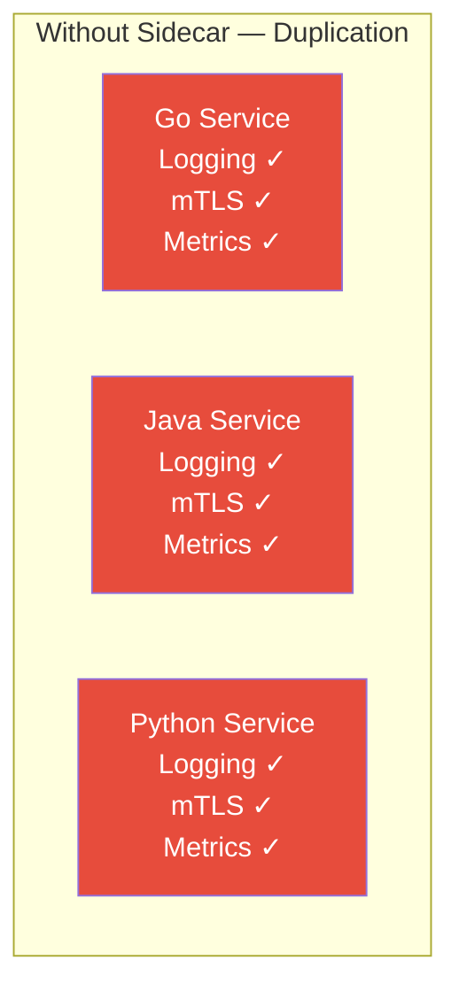

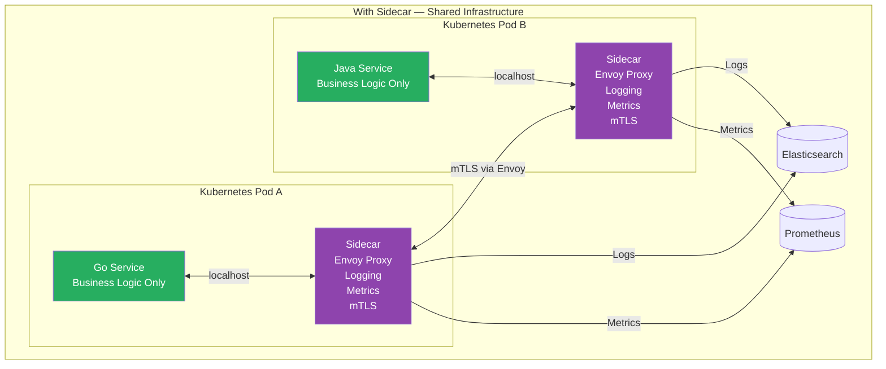

### Kubernetes Pod Model

In Kubernetes, a **pod** is the unit of deployment — it can contain multiple containers that share:

- **Network namespace** — same IP address, communicate via `localhost`
- **Volumes** — shared file system paths
- **Lifecycle** — started and stopped together

This co-location model makes the sidecar pattern native to Kubernetes.

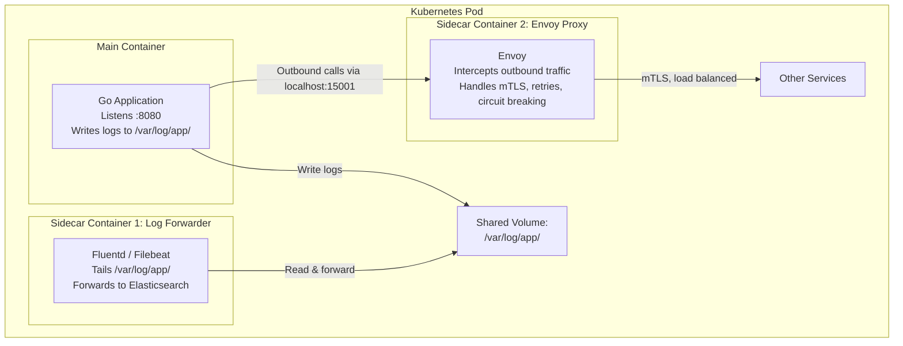

### Go Implementation

```go
// ── Main Service — Writes to Shared Log File ──────────────────────────────────

// The main application just writes structured JSON logs to a file.
// It has no knowledge of Elasticsearch, log aggregation, or forwarding.
// The sidecar handles all that.

func setupLogger(logPath string) (*slog.Logger, error) {
    logFile, err := os.OpenFile(logPath, os.O_APPEND|os.O_CREATE|os.O_WRONLY, 0644)
    if err != nil {
        return nil, fmt.Errorf("opening log file: %w", err)
    }

    // JSON handler — structured, machine-parseable
    handler := slog.NewJSONHandler(logFile, &slog.HandlerOptions{
        Level: slog.LevelInfo,
    })
    return slog.New(handler), nil
}

func main() {
    // Log path is a shared volume in the Kubernetes pod spec
    logger, err := setupLogger("/var/log/app/service.log")
    if err != nil {
        log.Fatal(err)
    }
    slog.SetDefault(logger)

    http.HandleFunc("/orders", func(w http.ResponseWriter, r *http.Request) {
        slog.Info("handling request",
            "method", r.Method,
            "path", r.URL.Path,
            "user_agent", r.UserAgent(),
            "request_id", r.Header.Get("X-Request-ID"),
        )
        // ... business logic
    })

    slog.Info("service starting", "port", 8080)
    log.Fatal(http.ListenAndServe(":8080", nil))
}

// ── Sidecar: Log Forwarder ────────────────────────────────────────────────────

// This runs as a separate container in the same pod.
// It reads the shared log file and forwards to a central system.

type LogForwarder struct {
    logPath  string
    endpoint string
    client   *http.Client
}

func (f *LogForwarder) Run(ctx context.Context) error {
    slog.Info("log forwarder starting", "path", f.logPath, "endpoint", f.endpoint)

    file, err := os.Open(f.logPath)
    if err != nil {
        return fmt.Errorf("opening log file: %w", err)
    }
    defer file.Close()

    // Seek to end — only forward new lines
    file.Seek(0, io.SeekEnd)

    reader := bufio.NewReader(file)
    ticker := time.NewTicker(100 * time.Millisecond)
    defer ticker.Stop()

    var buffer []string

    for {
        select {
        case <-ctx.Done():
            return ctx.Err()
        case <-ticker.C:
            // Read all available lines
            for {
                line, err := reader.ReadString('\n')
                if len(line) > 0 {
                    buffer = append(buffer, strings.TrimRight(line, "\n"))
                }
                if err == io.EOF {
                    break
                }
                if err != nil {
                    slog.Error("reading log file", "error", err)
                    break
                }
            }
            // Batch forward if we have lines
            if len(buffer) > 0 {
                if err := f.forward(ctx, buffer); err != nil {
                    slog.Error("forwarding logs", "error", err, "count", len(buffer))
                    // Keep buffer — retry next tick
                } else {
                    buffer = buffer[:0] // clear on success
                }
            }
        }
    }
}

func (f *LogForwarder) forward(ctx context.Context, lines []string) error {
    payload := map[string]interface{}{
        "entries":   lines,
        "timestamp": time.Now().UTC(),
    }
    body, _ := json.Marshal(payload)
    req, _ := http.NewRequestWithContext(ctx, "POST", f.endpoint, bytes.NewReader(body))
    req.Header.Set("Content-Type", "application/json")

    resp, err := f.client.Do(req)
    if err != nil {
        return err
    }
    defer resp.Body.Close()
    if resp.StatusCode >= 400 {
        return fmt.Errorf("endpoint returned %d", resp.StatusCode)
    }
    return nil
}

// ── Sidecar: Config Watcher ───────────────────────────────────────────────────

// A config-watching sidecar monitors a ConfigMap (Kubernetes) or config file
// and signals the main service to reload — without a restart.

type ConfigWatcher struct {
    configPath string
    onUpdate   func(newConfig []byte)
}

func (w *ConfigWatcher) Watch(ctx context.Context) error {
    lastHash := ""

    for {
        select {
        case <-ctx.Done():
            return ctx.Err()
        case <-time.After(5 * time.Second):
            data, err := os.ReadFile(w.configPath)
            if err != nil {
                slog.Error("reading config", "error", err)
                continue
            }
            hash := fmt.Sprintf("%x", sha256.Sum256(data))
            if hash != lastHash {
                slog.Info("config changed, signaling reload")
                w.onUpdate(data)
                lastHash = hash
            }
        }
    }
}
```

### Service Mesh — Sidecar at Scale

When every pod has an Envoy sidecar, the sidecars form a **service mesh**. The mesh handles:

- **mTLS everywhere** — automatic certificate rotation, no TLS code in application
- **Distributed tracing** — Envoy injects trace headers (Jaeger, Zipkin) transparently
- **Circuit breaking** — Envoy retries and circuit breaks without application changes
- **Canary routing** — mesh routes X% of traffic to new service version
- **Observability** — metrics for every RPC across the entire fleet

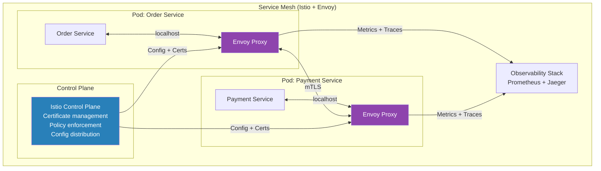

### When to Use

- Cross-cutting concerns (logging, metrics, mTLS) across polyglot microservices
- Service mesh architectures (Istio, Linkerd, Consul Connect)
- Kubernetes deployments — pod model makes sidecar first-class
- Infrastructure concerns must be separated from business logic
- Same sidecar can be updated across fleet without touching application code

### When NOT to Use

- Monolithic application — no pods, no natural sidecar deployment
- Latency-sensitive paths where even localhost overhead matters (sub-millisecond requirements)
- Simple deployments without container orchestration (Docker Compose, bare VMs)
- Team is not yet operating Kubernetes — operational complexity is real

### Real-World Usage

- **Istio/Envoy** — the canonical service mesh sidecar; every pod in the mesh has an Envoy sidecar
- **Fluentd / Filebeat / Vector** — log collection sidecars in every pod
- **HashiCorp Vault Agent** — sidecar that fetches and renews secrets, writes to shared volume
- **Dapr** — Microsoft's Distributed Application Runtime deploys as a sidecar in every pod, providing pub/sub, state store, and service invocation APIs
- **Linkerd** — lightweight Rust-based service mesh with a small-footprint sidecar proxy

### Related Patterns

- **Adapter** (Ch02) — sidecar is the adapter pattern at infrastructure level; it translates between the app and infrastructure APIs
- **Decorator** (Ch02) — sidecar decorates service with additional behavior without modifying it
- System Design Ch23 Cloud-Native

---

## CQRS + Event Sourcing: The Natural Combination

These two patterns pair together so frequently they are often discussed as a single pattern. Here is why and how:

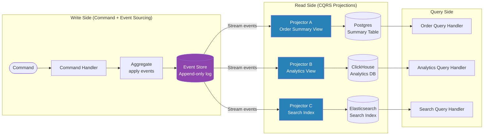

**Why they fit together:**

1. **Event store = natural write model** for CQRS — commands produce events, events go to the store
2. **Projectors = CQRS read model builders** — each projection is an optimized read model for a different query pattern
3. **Multiple read models from one event stream** — the same events project to Postgres for queries, Elasticsearch for search, ClickHouse for analytics
4. **Rebuild read models from scratch** — if a projector has a bug, replay all events to rebuild the read model correctly
5. **Temporal queries for free** — replay events to point-in-time for the read model

**The trade-off:** Combined complexity is high. Use when you genuinely need both full audit history AND query model flexibility. Don't use for CRUD.

---

## Pattern Comparison Table

| Pattern | Scope | Consistency Model | Complexity | Primary Trade-off |
|---------|-------|-------------------|------------|-------------------|
| **CQRS** | Single/multi-service | Eventual (read lag) | Medium | Read performance vs model complexity |
| **Event Sourcing** | Single service (event store) | Eventual | High | Full history + replay vs storage cost |
| **Saga** | Multi-service | Eventual (with compensation) | High | Distributed consistency vs compensation complexity |
| **Strangler Fig** | System migration | N/A — migration tool | Medium | Safe migration vs maintaining two systems |
| **Sidecar** | Infrastructure layer | N/A — infrastructure | Low–Medium | Concerns separation vs operational overhead |

**Decision guide:**

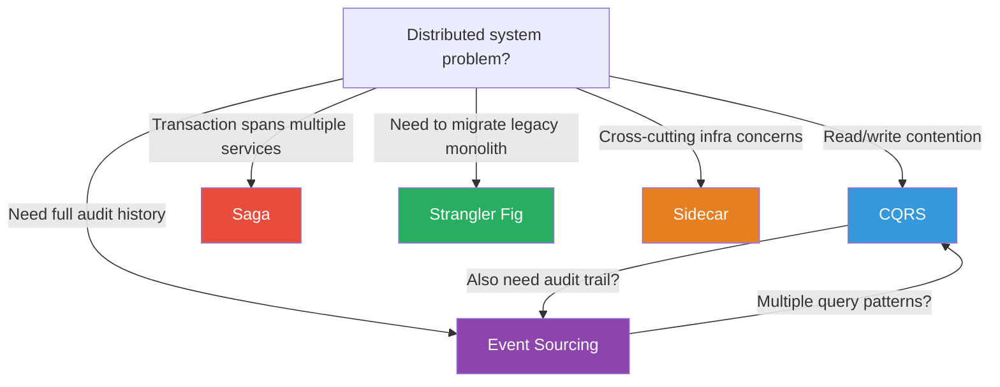

---

## Practice Questions

### Easy

**1. CQRS without Event Sourcing**

When would you use CQRS *without* Event Sourcing? Describe a concrete scenario and explain what the write model stores (if not events) and how the read model gets updated.

<details>
<summary>Hint</summary>
A CMS with heavy read traffic but simple writes — articles are stored as rows in Postgres (write model). A read model is a denormalized Redis cache updated by a database trigger or a CDC (Change Data Capture) pipeline when articles change. No need for event history — just separate models for performance.
</details>

---

### Medium

**2. Saga for Travel Booking**

Design a Saga for a travel booking system: the user books a **flight**, **hotel**, and **car rental** as a bundle. Each is a separate service with its own database.

- Draw the happy path and the compensation path when the car rental is unavailable
- Choose choreography or orchestration and justify your choice
- Identify which steps are hardest to compensate and why

<details>
<summary>Hint</summary>
Orchestration fits better here — the booking flow is sequential and explicit, and a travel platform benefits from seeing the full saga state in one place (for customer support). Compensation: cancel car = easy (reservation not confirmed); cancel hotel = easy (refundable window); cancel flight = hard (cancellation fees, airline APIs may not be idempotent). The flight cancellation compensation must handle partial refunds and retry scenarios.
</details>

**3. Strangler Fig Migration Plan**

You are the lead engineer at an e-commerce company with a 10-year-old Rails monolith. The monolith handles: product catalog, user accounts, orders, payments, inventory, and search. Plan a Strangler Fig migration. Which service do you extract first, and why? What is your data synchronization strategy during migration?

<details>
<summary>Hint</summary>
Extract **Search** first — it has the clearest boundary (read-only from the monolith's perspective), can be rebuilt from a product catalog snapshot, and has no write operations that need dual-write. After search, extract **payments** (hardest) or **catalog** (safer). Data sync: use CDC (Debezium on the monolith DB) to stream changes to the new service's DB during the migration period.
</details>

---

### Hard

**4. Event-Sourced Banking System with Temporal Queries**

Design an event-sourced bank account system that supports:
- Current balance queries (sub-10ms)
- "Balance as of date X" queries
- Monthly statement generation (all transactions in a month)
- 99.99% account accuracy — no balance can ever be lost

Address:
- How do snapshots work and when do you create them?
- How do you handle event schema evolution when the `MoneyTransferred` event gains a new `currency` field?
- What happens if the projector that builds the balance read model crashes halfway through replaying events?

<details>
<summary>Hint</summary>
Snapshots: create after every N events (e.g., 100) or on a daily schedule, stored with the version number. For current balance, load latest snapshot + replay delta events — O(delta) not O(all). Schema evolution: use upcasters that transform old events on read (v1 → v2 by adding `currency: "USD"` default). Projector crash: projectors must be idempotent and track their last processed event version; on restart, resume from the last committed version checkpoint. Use an outbox pattern to guarantee events reach the projector exactly-once.
</details>

---

## Related Chapters

| Chapter | Relevance |
|---------|-----------|
| [Ch02 — Structural Patterns](/design-patterns/ch02-structural-patterns) | Proxy (Strangler), Adapter (Sidecar), Decorator (Sidecar) |
| [Ch04 — Modern Application Patterns](/design-patterns/ch04-modern-application-patterns) | Repository (CQRS read/write repos), Circuit Breaker (Saga resilience) |
| [Ch13 — Microservices](/system-design/part-3-architecture-patterns/ch13-microservices) | Service boundaries for Saga and Strangler Fig |
| [Ch14 — Event-Driven Architecture](/system-design/part-3-architecture-patterns/ch14-event-driven-architecture) | Event buses for CQRS projectors and Choreography Saga |
| [Ch15 — Data Replication](/system-design/part-3-architecture-patterns/ch15-data-replication-consistency) | Eventual consistency guarantees underlying CQRS and Event Sourcing |

---

## Key Takeaway

> **Distributed system patterns solve problems that cannot be solved with code structure alone.** CQRS and Event Sourcing address the fundamental conflict between optimizing for reads vs writes. Saga addresses the impossibility of atomic distributed transactions. Strangler Fig addresses the business reality that you cannot pause development for a big-bang rewrite. Sidecar addresses the duplication tax of polyglot infrastructure. Each pattern adds complexity — apply them only when the problem is real.

---

## References & Further Reading

- [Microsoft Azure — CQRS Pattern](https://learn.microsoft.com/en-us/azure/architecture/patterns/cqrs) — Architecture reference with trade-off analysis
- [Martin Fowler — Event Sourcing](https://martinfowler.com/eaaDev/EventSourcing.html) — Original definition and motivation
- [microservices.io — Saga Pattern](https://microservices.io/patterns/data/saga.html) — Chris Richardson's canonical reference
- [ByteByteGo — Saga Pattern Demystified](https://blog.bytebytego.com/p/saga-pattern-demystified-orchestration) — Orchestration vs Choreography visual guide
- [AWS — Saga Orchestration Pattern](https://docs.aws.amazon.com/prescriptive-guidance/latest/cloud-design-patterns/saga-orchestration.html) — AWS prescriptive guidance
- [Martin Fowler — Strangler Fig Application](https://martinfowler.com/bliki/StranglerFigApplication.html) — Original article naming the pattern
- [Microsoft Azure — Sidecar Pattern](https://learn.microsoft.com/en-us/azure/architecture/patterns/sidecar) — Architecture reference
- [Temporal.io — Saga Pattern](https://temporal.io/blog/mastering-saga-patterns-for-distributed-transactions-in-microservices) — Production implementation guide
