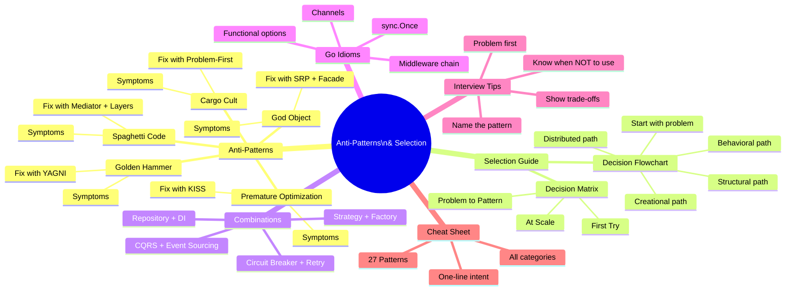

# Chapter 6: Anti-Patterns & Selection Guide

> Knowing which pattern to use is only half the battle. The other half is knowing which patterns to avoid — and recognizing when your codebase has already fallen into one of the traps this chapter names. The engineers who write the cleanest systems aren't the ones who know the most patterns; they're the ones who know exactly which pattern fits the problem in front of them right now.

---

## Mind Map



---

## Part A: Common Anti-Patterns

Anti-patterns are the recurring mistakes that seem like good ideas at the time. Unlike a design pattern, an anti-pattern makes your code worse — harder to understand, harder to change, and harder to test. Recognizing them in your own codebase is the first step to fixing them.

---

### Anti-Pattern 1: God Object / Blob

**What it is:** A single struct, class, or module that knows too much and does too much. The 2,000-line file that handles user authentication, order processing, payment charging, email notifications, report generation, and cache invalidation — all in one place.

**Why it feels right at first:** "Everything is in one place! Easy to find things!" In the early days of a project, a monolithic manager struct feels pragmatic. The problems compound with every feature added.

**Symptoms:**
- File exceeds 500 lines and keeps growing
- Struct has 15+ fields and 30+ methods
- The struct imports nearly every package in the project
- Every bug fix risks breaking three unrelated features
- No one can describe what the struct's single responsibility is
- New engineers are afraid to touch it

**Code smell — before:**

```go
// AppManager does... everything. 2,000 lines and counting.
type AppManager struct {
    db       *sql.DB
    cache    *redis.Client
    smtp     *smtp.Client
    stripe   *stripe.Client
    s3       *s3.Client
    logger   *zap.Logger
    config   *Config
    // ... 12 more fields
}

func (m *AppManager) CreateUser(email, password string) (*User, error)      { /* ... */ }
func (m *AppManager) AuthenticateUser(email, password string) (string, error) { /* ... */ }
func (m *AppManager) ProcessPayment(userID string, amount int) error         { /* ... */ }
func (m *AppManager) SendWelcomeEmail(userID string) error                   { /* ... */ }
func (m *AppManager) GenerateSalesReport(from, to time.Time) (*Report, error) { /* ... */ }
func (m *AppManager) UploadAvatar(userID string, data []byte) (string, error) { /* ... */ }
func (m *AppManager) InvalidateUserCache(userID string) error                { /* ... */ }
// ... 40 more methods
```

**How to fix — after:**

Split by responsibility. Each service owns one concern and its dependencies.

```go
// UserService owns user lifecycle only.
type UserService struct {
    repo   UserRepository
    hasher PasswordHasher
    cache  UserCache
}

func (s *UserService) Create(email, password string) (*User, error) { /* ... */ }
func (s *UserService) Authenticate(email, password string) (string, error) { /* ... */ }

// PaymentService owns payment processing only.
type PaymentService struct {
    gateway PaymentGateway
    repo    PaymentRepository
}

func (s *PaymentService) Charge(userID string, amount int) error { /* ... */ }

// NotificationService owns outbound messaging only.
type NotificationService struct {
    smtp   EmailSender
    config NotificationConfig
}

func (s *NotificationService) SendWelcome(userID, email string) error { /* ... */ }

// If callers need a single entry point, use Facade — don't merge the services back.
type OrderFacade struct {
    users    *UserService
    payments *PaymentService
    notify   *NotificationService
}

func (f *OrderFacade) PlaceOrder(userID string, order Order) error {
    if err := f.payments.Charge(userID, order.Total); err != nil {
        return err
    }
    return f.notify.SendOrderConfirmation(userID, order.ID)
}
```

**Design patterns that fix it:** Single Responsibility Principle (structural discipline) + **Facade** (unified entry point without merging) + **Dependency Injection** (each service gets only what it needs).

---

### Anti-Pattern 2: Spaghetti Code

**What it is:** Code with no clear structure, no separation of concerns, and circular or deeply tangled dependencies. Functions call other functions across five packages in unpredictable ways. Data flows everywhere and nowhere.

**Why it feels right at first:** "I just need to get this done." Every shortcut that skips a layer or reaches across a boundary feels like a time-saver. The debt accumulates invisibly until the codebase becomes unmaintainable.

**Symptoms:**
- Circular imports between packages
- A handler function that queries the database, formats HTML, and sends emails
- "Don't touch that file — nobody understands it anymore"
- Adding a feature requires changing 7 different files with no clear pattern
- Unit testing is impossible because nothing can be isolated

**Code smell — before:**

```go
// handlers/order.go directly calls notification logic and
// the notification package directly queries the database.
// Nothing is testable in isolation.

func HandlePlaceOrder(w http.ResponseWriter, r *http.Request) {
    var req OrderRequest
    json.NewDecoder(r.Body).Decode(&req)

    // Direct DB call from handler
    db.Exec("INSERT INTO orders ...", req.UserID, req.Total)

    // Direct call into notification package
    notification.SendEmail(req.UserID, "Order placed!")

    // Direct call into reporting package
    reporting.LogOrderEvent(req.UserID, req.Total)

    // reporting.go queries the DB directly and also calls notification...
    // Now you have a cycle: handler → notification → db → handler (for auth)
}
```

**How to fix — after:**

Establish clear layers with a strict dependency direction: Handler → Service → Repository. Use interfaces at layer boundaries. Use **Observer** or an event bus to break circular notification dependencies.

```go
// Dependency direction is always downward. No layer calls upward.
//
//   HTTP Handler
//       ↓
//   OrderService (business logic)
//       ↓
//   OrderRepository (data access)
//
// Cross-cutting events use Observer — services emit events,
// notification service subscribes. No circular calls.

type OrderService struct {
    repo      OrderRepository   // interface — no direct DB import
    eventBus  EventPublisher    // interface — no direct notification import
}

func (s *OrderService) PlaceOrder(ctx context.Context, req PlaceOrderRequest) (*Order, error) {
    order, err := s.repo.Create(ctx, req)
    if err != nil {
        return nil, fmt.Errorf("create order: %w", err)
    }
    // Publish event — notification service handles it independently
    s.eventBus.Publish(OrderPlacedEvent{OrderID: order.ID, UserID: req.UserID})
    return order, nil
}
```

**Design patterns that fix it:** **Mediator** (centralized communication hub), **Observer** (event-driven decoupling), layered architecture with strict dependency direction, **Dependency Injection** (inject interfaces, not concrete packages).

---

### Anti-Pattern 3: Golden Hammer

**What it is:** "When all you have is a hammer, everything looks like a nail." Over-applying a single familiar pattern, tool, or technology to every problem regardless of fit. The engineer who learned microservices applies them to a 3-person internal tool. The team that loves Repository pattern wraps a simple one-off script in five interfaces.

**Why it feels right at first:** Familiarity breeds confidence. After successfully using a pattern on one project, it becomes the default answer. "We used Circuit Breaker there and it worked great — let's use it everywhere."

**Symptoms:**
- Every service is a microservice, including the config reader
- Every function has an interface, even private utilities with one implementation
- Singleton pattern appears on objects that don't need shared state
- The team reaches for Kafka before considering a database query
- Over-abstracted simple code: 5 interfaces for a 10-line helper function

**Code smell — before:**

```go
// A simple utility to format a user's display name.
// This does NOT need an interface, factory, or dependency injection.

type NameFormatter interface {
    Format(first, last string) string
}

type StandardNameFormatter struct{}

func NewNameFormatter() NameFormatter {
    return &StandardNameFormatter{}
}

func (f *StandardNameFormatter) Format(first, last string) string {
    return first + " " + last
}

// Usage requires constructing via factory, injecting via DI container...
// For a function that concatenates two strings.
```

**How to fix — after:**

Start with the simplest code that works. Introduce abstraction when a concrete need for it exists — multiple implementations, testability requirements, or clear extension points.

```go
// Just a function. No interface needed — there's only one implementation
// and it will never be mocked in tests.
func FormatDisplayName(first, last string) string {
    return first + " " + last
}
```

The fix isn't a design pattern — it's **YAGNI** (You Aren't Gonna Need It). The rule: introduce a pattern when it solves a real pain you feel right now, not a hypothetical pain you might feel later.

**When complexity IS warranted:** If you have `FormatDisplayName`, `FormatLegalName`, `FormatInformalName`, and tests need to swap implementations — then an interface earns its place.

**Design patterns that fix it:** None — the fix is restraint. But **Strategy** is the correct pattern if you genuinely need swappable behavior (vs. just adding an interface for its own sake).

---

### Anti-Pattern 4: Cargo Cult Programming

**What it is:** Copying patterns, architectures, or technologies without understanding why they work — or whether they apply to your context. Named after the cargo cult phenomenon: building the form of something without understanding the function.

Classic examples:
- "Netflix uses microservices, so we should too" — for a team of 3 with 200 users
- Adding Event Sourcing because a conference talk made it sound impressive
- Implementing CQRS for a simple blog with no performance problems
- Using a Saga pattern for a single-database application

**Why it feels right at first:** Social proof is powerful. If Google, Amazon, or Netflix does it, it must be right. The cargo cult programmer conflates the tool with the outcome — not understanding that Netflix's microservices solve Netflix-scale problems that their system doesn't have.

**Symptoms:**
- The team can't explain why a pattern was chosen
- Patterns were added during initial design before any problems were observed
- The architecture's complexity exceeds the product's complexity
- "We'll need this when we scale" — but the scale never came
- New patterns are chosen based on what's trending, not what's needed

**Code smell — before:**

```go
// A TODO app with 50 users and 2 developers.
// Someone read about CQRS and Event Sourcing at a conference.

// CommandHandler for creating a TODO. There are no query handlers.
// There is no reason to separate reads from writes at this scale.
type CreateTodoCommandHandler struct {
    eventStore EventStore
    readModel  ReadModelProjector
    sagaOrch   SagaOrchestrator
}

// The "read" path goes through a separate event-sourced projection
// that reconstructs state from an append-only log...
// for a TODO app with a single Postgres table.
```

**How to fix — after:**

Start with the problem statement. If you can't articulate "this pattern solves THIS specific problem I have TODAY," don't use it.

```go
// TODO app with 50 users. A single service with a Postgres table.
// Add patterns when pain is felt, not anticipated.

type TodoService struct {
    db *sql.DB
}

func (s *TodoService) Create(ctx context.Context, userID, title string) (*Todo, error) {
    // Direct SQL. No event store. No CQRS. No Saga.
    // When you have 100k users and complex query patterns, revisit.
    row := s.db.QueryRowContext(ctx,
        "INSERT INTO todos (user_id, title) VALUES ($1, $2) RETURNING id, created_at",
        userID, title,
    )
    var t Todo
    return &t, row.Scan(&t.ID, &t.CreatedAt)
}
```

**The question to ask before every pattern:** "What specific problem does this solve in our system today? What is the cost of adding it? Would a simpler approach work?"

**Design patterns that fix it:** None specifically — the fix is disciplined problem-first thinking. The **Strangler Fig** pattern is useful later, when you genuinely need to migrate a grown system to a more sophisticated architecture incrementally.

---

### Anti-Pattern 5: Premature Optimization / Over-Engineering

**What it is:** Adding complexity to solve performance or scalability problems that haven't been measured or may never materialize. Closely related to Cargo Cult, but specifically about optimizing before establishing a baseline.

**Donald Knuth:** "Premature optimization is the root of all evil." The second half of the quote is less often cited: "Yet we should not pass up our opportunities in that critical 3%." The key word is "measured."

**Symptoms:**
- Pattern count exceeds feature count in the codebase
- Simple CRUD endpoints take three weeks to implement because of "future-proofing"
- Connection pooling, caching layers, and sharding strategies exist before the first user
- "We might need to support 10 million users" with no evidence the product will reach 10,000
- Engineers spend more time designing the infrastructure than building features

**Code smell — before:**

```go
// Fetching a user profile. The system has 500 users.
// Three layers of caching, a read replica, and a CDN edge cache
// have been added "for scale."

func (s *UserService) GetProfile(ctx context.Context, userID string) (*UserProfile, error) {
    // L1: in-process LRU cache
    if p := s.l1Cache.Get(userID); p != nil {
        return p.(*UserProfile), nil
    }
    // L2: Redis distributed cache
    if data, err := s.redis.Get(ctx, "user:"+userID).Bytes(); err == nil {
        var p UserProfile
        json.Unmarshal(data, &p)
        s.l1Cache.Set(userID, &p, 5*time.Minute)
        return &p, nil
    }
    // L3: Read replica (primary is "too slow" — never measured)
    p, err := s.readReplicaRepo.FindByID(ctx, userID)
    if err != nil {
        return nil, err
    }
    // Populate both caches, handle invalidation...
    // 80 more lines of cache management for 500 users
}
```

**How to fix — after:**

Build the simplest thing that works. Measure. Optimize the bottleneck you find, not the bottleneck you imagine.

```go
// Simple. Direct. Measurable. Add complexity only when profiling shows this is slow.
func (s *UserService) GetProfile(ctx context.Context, userID string) (*UserProfile, error) {
    return s.repo.FindByID(ctx, userID)
}

// When you measure and find this is slow for real users:
// Step 1: Add a single Redis cache layer
// Step 2: Add a read replica if write contention is measured
// Step 3: Add an L1 cache if Redis latency is measured as a bottleneck
```

**The optimization ladder:** Direct DB → Single cache layer → Read replicas → L1 + L2 cache → Sharding. Climb one rung at a time, only when measured data justifies it.

**Design patterns that fix it:** **KISS** (Keep It Simple, Stupid) + **YAGNI**. When genuine performance problems are found: **Proxy** (transparent caching), **Repository** (swap implementations without changing service code), **Circuit Breaker** (when actual failure scenarios are observed).

---

## Part B: Pattern Selection Decision Matrix

The right pattern comes from the right problem. Start by identifying what you're trying to solve, not what pattern you want to use.

### Primary Decision Matrix

| Problem You're Solving | First Try | When Complexity Grows | At Distributed Scale |
|---|---|---|---|
| **Object creation varies by type** | Factory Method (constructor functions in Go) | Abstract Factory (families of related objects) | — |
| **Object construction has many optional parameters** | Builder / Functional Options (`With...()`) | — | — |
| **Need a single shared instance** | `sync.Once` | — | Distributed lock + shared cache |
| **Interfaces are incompatible** | Adapter (wrapper struct) | Bridge (two independent dimensions of variation) | Sidecar (infrastructure-level translation) |
| **Add behavior without modifying existing code** | Decorator / Middleware | Proxy (with access control) | — |
| **Simplify a complex subsystem** | Facade | — | API Gateway |
| **Reuse / share an expensive object** | Singleton (`sync.Once`) | Object Pool | — |
| **Clone an existing object** | Prototype (`Clone()` method) | — | — |
| **Tree / hierarchy of objects** | Composite | — | — |
| **One-to-many event notification** | Observer / Go channels | Event Bus | Event Sourcing + CQRS |
| **Swappable algorithms** | Strategy (interface field in struct) | — | — |
| **Encapsulate a request as an object** | Command | Command + history (undo) | Saga (distributed commands) |
| **Request through multiple handlers** | Chain of Responsibility | Middleware pipeline | — |
| **Behavior changes based on internal state** | State (FSM) | — | Circuit Breaker (3-state FSM) |
| **Fixed algorithm, variable steps** | Template Method (via composition) | Strategy | — |
| **Abstract data access layer** | Repository (interface + implementation) | Repository + DI | CQRS (separate read/write models) |
| **Decouple creation from consumption** | Dependency Injection | DI container/wire | — |
| **Sequential processing steps** | Middleware / Pipeline | Chain of Responsibility | — |
| **Handle transient failures** | Retry with exponential backoff | Circuit Breaker | Circuit Breaker + Retry |
| **Distributed transactions across services** | — | — | Saga (choreography or orchestration) |
| **Audit trail / event history** | — | — | Event Sourcing |
| **Separate read and write load** | — | Read replicas + different models | CQRS |
| **Migrate a legacy monolith incrementally** | — | — | Strangler Fig |
| **Cross-cutting infrastructure concerns** | Middleware / Decorator | — | Sidecar pattern |
| **Control access to an object** | Proxy | — | — |

---

### Decision Flowchart

Use this flowchart when you face a new design problem. Start at the top — answer each question honestly about your current situation.

```mermaid
flowchart TD
    START([New Design Problem]) --> Q1{What kind\nof problem?}

    Q1 --> |Creating objects| CREAT[Creational Path]
    Q1 --> |Structuring code| STRUCT[Structural Path]
    Q1 --> |Object behavior\n& communication| BEHAV[Behavioral Path]
    Q1 --> |Resilience /\ndistributed systems| DIST[Distributed Path]

    %% Creational Path
    CREAT --> C1{Many object\ntypes?}
    C1 --> |Yes, one type| C_FM[Factory Method\nConstructor func]
    C1 --> |Yes, families\nof related types| C_AF[Abstract Factory\nInterface-returning func]
    C1 --> |Complex construction\nwith many options| C_B[Builder\nFunctional Options]
    C1 --> |One shared instance| C_S[Singleton\nsync.Once]
    C1 --> |Clone existing| C_P[Prototype\nClone method]

    %% Structural Path
    STRUCT --> S1{What structural\nneed?}
    S1 --> |Incompatible interfaces| S_A[Adapter\nWrapper struct]
    S1 --> |Add behavior dynamically| S_D[Decorator\nMiddleware func]
    S1 --> |Simplify complex API| S_F[Facade\nOrchestrator struct]
    S1 --> |Control / wrap access| S_PR[Proxy\nSame-interface wrapper]
    S1 --> |Tree / hierarchy| S_C[Composite\nRecursive interface]
    S1 --> |Two independent\ndimensions of variation| S_BR[Bridge\nStruct + interface field]

    %% Behavioral Path
    BEHAV --> B1{Core need?}
    B1 --> |Notify many from one| B_O[Observer\nChannels / event bus]
    B1 --> |Swap algorithms| B_ST[Strategy\nInterface field]
    B1 --> |Encapsulate request\nor support undo| B_CM[Command\nExecute / Undo interface]
    B1 --> |Route through\nmultiple handlers| B_CR[Chain of Resp.\nMiddleware chain]
    B1 --> |Behavior varies\nby internal state| B_S[State\nFSM with state interface]
    B1 --> |Fixed steps,\nvariable implementation| B_TM[Template Method\nComposition]

    %% Distributed Path
    DIST --> D1{Distributed\nchallenge?}
    D1 --> |Handle transient\nfailures| D1A{How severe?}
    D1A --> |Occasional hiccup| D_R[Retry w/ Backoff\nExponential + jitter]
    D1A --> |Repeated failures\nfrom one dependency| D_CB[Circuit Breaker\n3-state FSM]
    D1 --> |Distributed\ntransactions| D_SA[Saga\nOrchestration or\nChoreography]
    D1 --> |Audit trail needed\nor event replay| D_ES[Event Sourcing\nAppend-only log]
    D1 --> |Scale reads separately\nfrom writes| D_CQ[CQRS\nSeparate handlers]
    D1 --> |Migrate\nlegacy system| D_SF[Strangler Fig\nRouting proxy]
    D1 --> |Cross-cutting infra\ne.g. observability, TLS| D_SC[Sidecar\nContainer companion]

    style START fill:#50fa7b,color:#282a36
    style C_FM fill:#6272a4,color:#f8f8f2
    style C_AF fill:#6272a4,color:#f8f8f2
    style C_B fill:#6272a4,color:#f8f8f2
    style C_S fill:#6272a4,color:#f8f8f2
    style C_P fill:#6272a4,color:#f8f8f2
    style S_A fill:#bd93f9,color:#282a36
    style S_D fill:#bd93f9,color:#282a36
    style S_F fill:#bd93f9,color:#282a36
    style S_PR fill:#bd93f9,color:#282a36
    style S_C fill:#bd93f9,color:#282a36
    style S_BR fill:#bd93f9,color:#282a36
    style B_O fill:#ffb86c,color:#282a36
    style B_ST fill:#ffb86c,color:#282a36
    style B_CM fill:#ffb86c,color:#282a36
    style B_CR fill:#ffb86c,color:#282a36
    style B_S fill:#ffb86c,color:#282a36
    style B_TM fill:#ffb86c,color:#282a36
    style D_R fill:#ff5555,color:#f8f8f2
    style D_CB fill:#ff5555,color:#f8f8f2
    style D_SA fill:#ff5555,color:#f8f8f2
    style D_ES fill:#ff5555,color:#f8f8f2
    style D_CQ fill:#ff5555,color:#f8f8f2
    style D_SF fill:#ff5555,color:#f8f8f2
    style D_SC fill:#ff5555,color:#f8f8f2
```



---

### Pattern Combinations That Work Well Together

Some patterns are designed to complement each other. These combinations appear repeatedly in well-architected systems.

| Combination | Why They Pair | Concrete Example |
|---|---|---|
| **Repository + Dependency Injection** | DI makes the repository swappable — inject a mock in tests, a real DB in production. The repository provides the interface DI needs. | `NewOrderService(repo OrderRepository)` — pass `MockOrderRepo` in tests |
| **Strategy + Factory Method** | Factory creates the right strategy at runtime based on configuration or context. Strategy provides the swappable interface. | `PaymentStrategyFactory.For("stripe")` returns a `PaymentStrategy` |
| **Observer + Command** | Commands are issued, observers react asynchronously. Enables event-driven undo/redo systems and decoupled workflows. | UI button issues `PlaceOrderCommand`; email service, analytics service observe `OrderPlaced` event |
| **CQRS + Event Sourcing** | CQRS separates read and write models; Event Sourcing provides the write model as an immutable event log that projects into any read model. | Financial ledger: write path appends events; read path projects to account balance view |
| **Circuit Breaker + Retry with Backoff** | Retry handles sporadic transient failures; Circuit Breaker handles sustained failures by failing fast and preventing cascade. Together they cover the full failure spectrum. | Payment gateway calls: retry 3x with backoff on network error; circuit opens after 50% failure rate in 60s |
| **Facade + Adapter** | Facade simplifies access to a complex subsystem; Adapter makes a legacy or third-party interface conform to the subsystem's expected interface. | `NotificationFacade` wraps `SendGrid` via `EmailAdapter` and `Twilio` via `SMSAdapter` |
| **Middleware Pipeline + Chain of Responsibility** | Middleware provides the chain infrastructure (request → response); Chain of Responsibility pattern provides the handler logic for each stage with explicit pass/stop semantics. | HTTP authentication middleware: each handler either calls `next()` or returns 401 |
| **Strangler Fig + Repository** | Strangler Fig routes traffic between old and new systems; Repository pattern allows the new implementation to be swapped in behind the same interface. | Old monolith's `UserStore` and new microservice's `UserRepository` both implement `UserRepository` interface |
| **Singleton (`sync.Once`) + Dependency Injection** | `sync.Once` ensures the expensive resource is created once; DI ensures callers receive it as an interface, keeping them testable. | `database.New()` using `sync.Once` injected as `DatabasePort` interface |

---

## Part C: Go Idioms vs Classic OOP Patterns

Go's design — no inheritance, implicit interface satisfaction, goroutines and channels, composition over inheritance — changes how classic patterns are implemented. Some patterns simplify dramatically; a few become unnecessary.

| Classic OOP Pattern | Go Idiomatic Implementation | Notes |
|---|---|---|
| **Abstract Factory** | Function returning an interface | `func NewStorage(driver string) Storage` — the function IS the factory |
| **Builder** | Functional options: `With...()` functions | `NewServer(WithTimeout(5*time.Second), WithPort(8080))` — idiomatic Go |
| **Singleton** | `sync.Once` + package-level variable | `var instance *DB; var once sync.Once; once.Do(func() { instance = newDB() })` |
| **Decorator** | `func(Handler) Handler` middleware functions | `loggingMiddleware(authMiddleware(handler))` — chainable, composable |
| **Observer** | Goroutines + channels | `events := make(chan Event, 100)` — Go's native event model; avoid callbacks |
| **Strategy** | Interface field in struct | `type Sorter struct { algo SortAlgorithm }` — swap via struct field, not inheritance |
| **Template Method** | Composition + interface | No abstract classes — embed a struct and override via interface methods |
| **Iterator** | `range` keyword or channel | `for item := range collection` — built into the language |
| **Command** | Struct with `Execute() error` and `Undo() error` | Same as OOP but simpler — no class hierarchy needed |
| **Chain of Responsibility** | Slice of `func(ctx, next)` | `type Middleware func(Handler) Handler` — compose with `for` loop |
| **Facade** | Struct with methods calling internal services | Same concept; Go's package system already provides natural facades |
| **Proxy** | Wrapper struct implementing same interface | `type CachedUserRepo struct { inner UserRepository; cache Cache }` |

**Key insight for Go engineers:** Go's interfaces are satisfied implicitly. This means any type that has the right methods is automatically an Adapter, a Strategy, or a Command — without explicit declaration. The pattern exists in the structure, not in `implements SomeAbstractBase`.

---

## Part D: Interview Tips

Design patterns come up in three ways in technical interviews:

1. **Directly asked:** "Which design pattern would you use to...?"
2. **Embedded in system design:** "How would you make this extensible / testable / resilient?"
3. **Code review scenarios:** "What's wrong with this code?" (usually an anti-pattern)

---

### The Interview Framework: 4 Steps

When a pattern-related question comes up, use this structure:

```
1. IDENTIFY the problem → "The core challenge here is..."
2. NAME the pattern     → "This is essentially the X pattern because..."
3. JUSTIFY the choice   → "I'd choose X over Y here because..."
4. DISCUSS trade-offs   → "The cost of this approach is..."
```

**Example:**

*"How would you design a payment processing system that supports Stripe, PayPal, and future gateways?"*

- **Identify:** "The core challenge is that each gateway has a different API. We need to swap implementations without changing the calling code."
- **Name:** "This is the Strategy pattern — or at the interface level, the Adapter pattern for each gateway."
- **Justify:** "I'd use Strategy here because the business logic (when to charge, retry logic) is the same; only the external API call differs. Each gateway gets an Adapter that conforms to a common `PaymentGateway` interface."
- **Trade-offs:** "The cost is an additional interface layer. For just two gateways, it might be simpler to use a switch statement. We'd justify the interface once we have three or more gateways, or when we need to mock the gateway in tests — which we likely do."

---

### 5 Rules for Pattern Discussions in Interviews

**1. Never lead with the pattern name.**
Say the problem first: "We have multiple notification channels — email, SMS, push — and they all need to send the same event. The problem is tight coupling..." Then: "This is the Observer pattern."

Leading with the name sounds like pattern-dropping. Describing the problem first shows you understand *why* the pattern exists.

**2. Show the trade-off.**
Every pattern has a cost. Naming the cost demonstrates seniority:
- "Strategy adds an interface layer — overhead if you only have 2 algorithms."
- "Observer makes execution order non-deterministic — needs careful handling."
- "Saga adds coordination complexity — only worth it for distributed transactions."

**3. Know when NOT to use.**
Interviewers are more impressed by "we don't need a pattern here, a simple function will do" than by pattern-dropping. It shows judgment, not just knowledge.

**4. Connect to real systems you know.**
- "Go's `net/http` middleware stack is the Decorator pattern."
- "`database/sql` uses a form of Repository pattern."
- "Kubernetes controllers are essentially the Observer pattern."
- "AWS Step Functions implement the Saga pattern."

This shows depth beyond textbook knowledge.

**5. Sketch the structure.**
In a live interview (or on a whiteboard), quickly sketch the key types and their relationships. Even a 3-box diagram shows you can translate concepts into concrete design.

---

### Common Interview Questions and Pattern-Based Answers

| Interview Question | Pattern(s) to Mention | Key Point to Make |
|---|---|---|
| "How would you make this code extensible?" | Factory Method, Strategy, Observer | Open/Closed Principle — extend via new types, not by modifying existing code |
| "How do you handle failures in distributed systems?" | Circuit Breaker, Retry with Backoff, Saga | Distinguish transient failures (retry) from sustained failures (circuit break) from distributed transaction failures (saga) |
| "How would you migrate this monolith to microservices?" | Strangler Fig | Incremental migration — route by feature, not by big-bang rewrite |
| "How do you ensure data consistency across services?" | Saga, Event Sourcing, CQRS | Eventual consistency is the default; Saga provides compensating transactions |
| "How would you add caching without changing business logic?" | Decorator, Proxy | Same interface — callers don't know they're hitting a cache |
| "How do you make this code testable?" | Dependency Injection, Repository | Inject interfaces; mock at the boundary |
| "How do you support multiple payment providers?" | Strategy + Adapter | Strategy for swappable behavior; Adapter to conform each provider's API to your interface |
| "How do you handle rate limiting in a middleware stack?" | Chain of Responsibility, Decorator | Each middleware stage is a handler in the chain |
| "Your service calls three downstream APIs — how do you prevent cascade failures?" | Circuit Breaker + Retry | Retry for transient; circuit breaker to fail fast on sustained failures |
| "How would you build an audit log?" | Event Sourcing | Append-only event log — derive current state from event history |

---

## Part E: Complete Pattern Cheat Sheet

All 27 patterns from Chapters 1–5, in one reference table. **Bookmark this page.**

| # | Pattern | Category | Intent | When to Use | When NOT to Use | Complexity |
|---|---|---|---|---|---|---|
| 1 | **Factory Method** | Creational | Delegate object creation to subclasses / constructor functions | Multiple object types from one interface; decouple creation from use | Only one type, creation is simple | Low |
| 2 | **Abstract Factory** | Creational | Create families of related objects without specifying concrete types | Multiple related object families (e.g., UI themes, cloud providers) | Only one family; over-abstraction | Medium |
| 3 | **Builder** | Creational | Construct a complex object step by step; support optional parameters | Object with many optional fields; fluent construction API | Simple objects with 2–3 fields | Low–Medium |
| 4 | **Singleton** | Creational | Ensure one instance exists; provide global access point | Shared resources: DB connection pool, config, logger | When "global" state creates hidden coupling in tests | Low |
| 5 | **Prototype** | Creational | Create new objects by cloning an existing object | Expensive initialization; need many similar objects with small variations | When construction is cheap; when deep copy semantics are unclear | Low–Medium |
| 6 | **Adapter** | Structural | Convert one interface to another; make incompatible interfaces work together | Integrating third-party or legacy APIs; wrapping external SDKs | New code you control — design the interface correctly from the start | Low |
| 7 | **Decorator** | Structural | Add behavior to an object dynamically without modifying it | Cross-cutting concerns: logging, auth, caching, metrics; HTTP middleware | When behavior is always present — just put it in the struct | Low–Medium |
| 8 | **Facade** | Structural | Provide a simplified interface to a complex subsystem | Reduce coupling to a complex package; provide a high-level API | When callers need full access to the subsystem; don't hide needed complexity | Low |
| 9 | **Proxy** | Structural | Provide a surrogate that controls access to another object | Lazy loading, caching, access control, logging — transparently | When the behavior is best in the object itself; don't add proxy for its own sake | Low–Medium |
| 10 | **Composite** | Structural | Compose objects into tree structures to represent part-whole hierarchies | File systems, UI components, org charts, expression trees | Flat collections of uniform types — just use a slice | Medium |
| 11 | **Bridge** | Structural | Decouple an abstraction from its implementation so both can vary independently | Two orthogonal dimensions of variation (e.g., shape + renderer) | Single dimension of variation — use Strategy instead | Medium–High |
| 12 | **Observer** | Behavioral | Define a one-to-many dependency so that when one object changes state, dependents are notified | Event-driven architectures; decoupled pub/sub; UI events; domain events | When you need guaranteed ordering or synchronous behavior | Medium |
| 13 | **Strategy** | Behavioral | Define a family of algorithms, encapsulate each, and make them interchangeable | Swappable business rules: pricing, sorting, validation, payment processing | Only one algorithm exists and won't change; prefer a simple function | Low |
| 14 | **Command** | Behavioral | Encapsulate a request as an object; supports undo, queuing, logging | Undo/redo systems; task queues; macro recording; transactional operations | Simple one-off operations with no undo requirement | Medium |
| 15 | **Chain of Resp.** | Behavioral | Pass a request along a chain of handlers; each handler decides to process or pass on | Middleware pipelines; validation chains; authorization checks; event handling | When every handler must process the request — use a simple loop | Low–Medium |
| 16 | **State** | Behavioral | Allow an object to alter its behavior when its internal state changes | Finite state machines: order lifecycle, connection state, game AI | Simple boolean flags — don't over-engineer two-state problems | Medium |
| 17 | **Template Method** | Behavioral | Define the skeleton of an algorithm; let subclasses fill in specific steps | Fixed algorithm with variable steps (report generation, data processing pipelines) | When steps vary independently — Strategy is more flexible | Low–Medium |
| 18 | **Repository** | Modern App | Abstract the data access layer behind an interface | Any application with persistent storage; enables testability via mocks | One-off scripts; read-only data; when the abstraction adds more complexity than value | Low |
| 19 | **Dependency Injection** | Modern App | Provide dependencies from outside rather than constructing them internally | Any non-trivial service; enables testing, flexibility, and loose coupling | Leaf-level utilities with no external dependencies | Low |
| 20 | **Middleware/Pipeline** | Modern App | Process a request through a sequential series of handlers, each adding behavior | HTTP servers; gRPC interceptors; message processing; cross-cutting concerns | Single-step processing with no cross-cutting needs | Low–Medium |
| 21 | **Circuit Breaker** | Modern App | Detect sustained failures and fail fast; prevent cascade failures | Service-to-service calls in microservices; any external dependency call | In-process function calls; when failures are rare and fast | Medium |
| 22 | **Retry w/ Backoff** | Modern App | Automatically retry failed operations with increasing delay | Transient network errors; rate limits; temporary unavailability | Non-idempotent operations without careful design; when failures aren't transient | Low–Medium |
| 23 | **CQRS** | Distributed | Separate the model for reads from the model for writes | High read/write load disparity; complex read queries; need for multiple read models | Simple CRUD with similar read/write patterns; small teams and codebases | High |
| 24 | **Event Sourcing** | Distributed | Store state as a sequence of events; derive current state by replaying | Audit requirements; temporal queries; event-driven integration; financial systems | Simple CRUD; when event history provides no business value; high query complexity | High |
| 25 | **Saga** | Distributed | Manage distributed transactions through a series of local transactions with compensations | Multi-service transactions where ACID is unavailable; order processing, booking systems | Single-service transactions — use a database transaction instead | High |
| 26 | **Strangler Fig** | Distributed | Incrementally replace a legacy system by routing traffic to new implementations feature by feature | Legacy monolith migration; risk-averse incremental rewrites | Greenfield systems; small systems where a rewrite is low-risk | Medium–High |
| 27 | **Sidecar** | Distributed | Deploy a companion container alongside the main service to handle cross-cutting infrastructure concerns | Service mesh (Envoy/Istio); distributed tracing; mTLS; log forwarding; config hot-reload | When concerns can be handled in a shared library; not all environments support sidecars | Medium |

---

## Practice Questions

### Easy

**1.** Name three anti-patterns described in this chapter and, for each, identify one design pattern that helps fix it.

*Hint: God Object → Facade + SRP; Spaghetti Code → Observer/Mediator; Golden Hammer → YAGNI (no pattern needed).*

**2.** Given this Go struct, identify which anti-pattern it represents and explain how you would refactor it:

```go
type SystemManager struct {
    db     *sql.DB
    cache  *redis.Client
    mailer *smtp.Client
}

func (m *SystemManager) CreateUser(email string) error { /* ... */ }
func (m *SystemManager) ProcessOrder(id string) error { /* ... */ }
func (m *SystemManager) SendPromoEmail(userID string) error { /* ... */ }
func (m *SystemManager) GenerateInvoice(orderID string) ([]byte, error) { /* ... */ }
func (m *SystemManager) ValidateCoupon(code string) (bool, error) { /* ... */ }
```

---

### Medium

**3.** You are designing an e-commerce platform with the following requirements:
- Users can place orders
- Orders trigger inventory reservation
- Successful orders trigger payment processing
- Successful payments trigger shipping scheduling and email confirmation
- Any step can fail, and failures must roll back previous steps

Which patterns would you use? Draw the architecture. Identify which pattern handles each concern.

*Expected answer covers: **Saga** (distributed transaction with compensations), **Observer** or **Event Bus** (order placed → inventory/payment/shipping), **Command** (each step encapsulated), **Circuit Breaker** (resilience for payment gateway).*

**4.** Your team is debating whether to use CQRS for a new product. The product is a project management tool with 500 paying customers, a single Postgres database, and a team of 4 engineers. Make the case for AND against CQRS. What is your recommendation?

*Anti-pattern trap: this is a Cargo Cult scenario. CQRS adds significant complexity for a system at this scale. The correct answer is "no" — with a clear explanation of when CQRS would be justified.*

---

### Hard

**5.** Design an order management system for a large e-commerce platform. The system must:
- Handle 10,000 orders per minute at peak
- Provide real-time order status to customers
- Support full audit history of every state change
- Process payments, inventory, and shipping as separate services
- Recover automatically from partial failures

Using the patterns from Chapters 1–5:
1. Draw the high-level architecture (system components and their relationships)
2. Identify which patterns are used at each layer
3. Explain the data flow for a successful order
4. Explain the compensating transaction flow for a failed payment
5. Explain how you would add a new "loyalty points" service without modifying existing code

*This question combines CQRS + Event Sourcing (audit + real-time), Saga (distributed transaction), Circuit Breaker + Retry (resilience), Observer (new service integration via events — no existing code change), and Repository + DI (testability).*

---

**6.** A colleague proposes the following architecture for a new internal tool used by 10 employees to manage team vacation requests:

> "We'll use microservices — one for authentication, one for vacation requests, one for approvals, one for notifications. We'll use Kafka for async communication, Event Sourcing to track all state changes, and a Saga orchestrator for the approval workflow."

Identify every anti-pattern present in this proposal. What architecture would you recommend instead?

*This covers Cargo Cult Programming, Premature Optimization, and Golden Hammer — all in one proposal.*

---

## Chapter Summary

You have now completed all six chapters of the Design Patterns section. Here is what you can do with this knowledge:

**Recognize problems before reaching for patterns.** The anti-patterns in this chapter are more common than any of the 27 patterns. Recognizing a God Object or Cargo Cult in your codebase is the first skill. Knowing the right pattern is the second.

**Use the decision matrix as a first filter.** When a design problem arises, start with the matrix: what is the *problem type*? Creational, structural, behavioral, or distributed? Then apply the flowchart to narrow the choice.

**Prefer simple over clever.** The strongest engineers write the simplest code that solves the actual problem. Patterns are tools, not goals. A well-named function with no pattern applied is better than a poorly-chosen pattern that adds complexity without value.

**Connect patterns to real systems.** Go's standard library, Kubernetes, AWS services, and popular Go frameworks all use these patterns. Connecting abstract concepts to tools you use daily is what transforms knowledge into judgment.

**In interviews, lead with the problem.** The framework — Identify → Name → Justify → Trade-offs — works for any pattern question. Practice it until it's reflexive.

---

*This concludes the Design Patterns section. 27 patterns across 6 chapters. The next step is applying them: pick a codebase you own and identify one anti-pattern. Fix it. Then come back and pick the next one.*

---

## References & Further Reading

- [Refactoring.Guru — Design Patterns Catalog](https://refactoring.guru/design-patterns/catalog) — All 23 GoF patterns with visual guides
- [AntiPatterns: Refactoring Software, Architectures, and Projects in Crisis](https://en.wikipedia.org/wiki/AntiPatterns) — Brown et al. (1998) — the canonical anti-patterns reference
- [design-patterns-for-humans](https://github.com/kamranahmedse/design-patterns-for-humans) — Ultra-simplified pattern explanations (45k+ stars)
- [awesome-design-patterns](https://github.com/DovAmir/awesome-design-patterns) — Curated meta-list including cloud, microservices, and DevOps patterns
- [A Philosophy of Software Design](https://web.stanford.edu/~ouster/cgi-bin/book.php) — John Ousterhout — when NOT to use patterns
- [SourceMaking — Anti-Patterns](https://sourcemaking.com/antipatterns) — Comprehensive anti-pattern catalog with detection guides
- [Dive Into Design Patterns](https://refactoring.guru/design-patterns/book) — Alexander Shvets — modernized GoF with trade-off analysis
