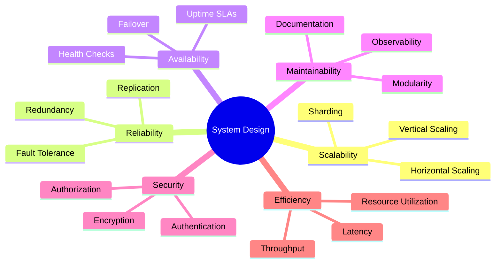
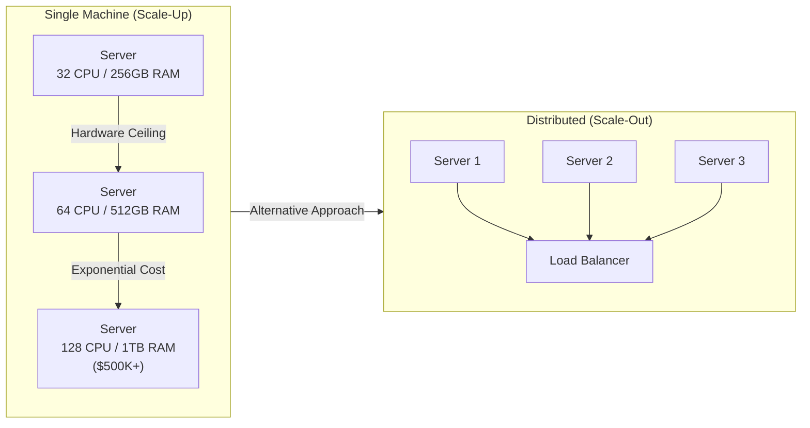
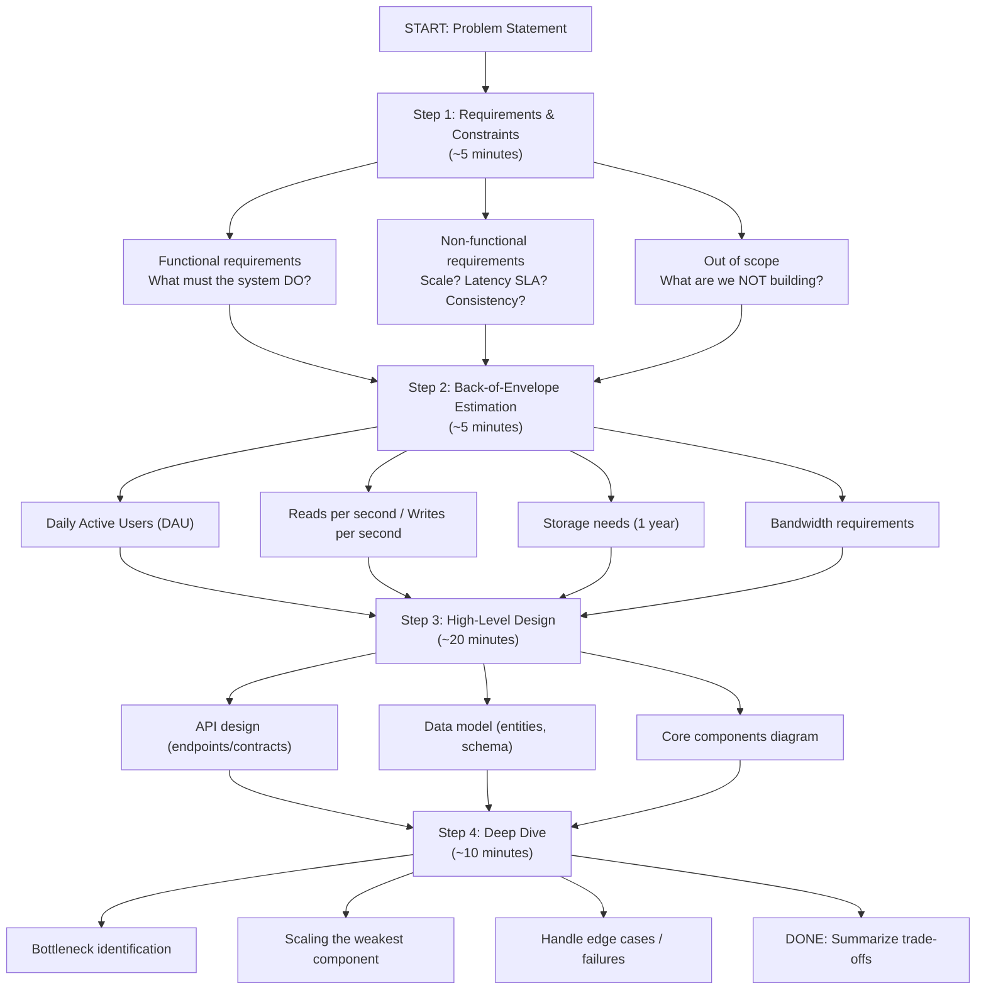
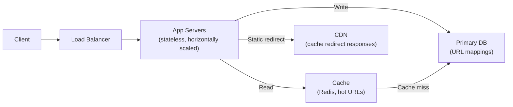
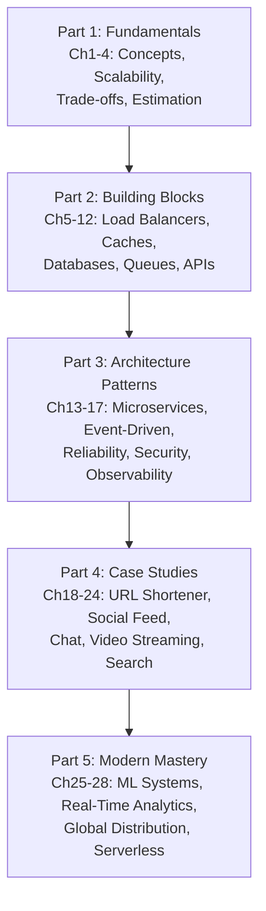
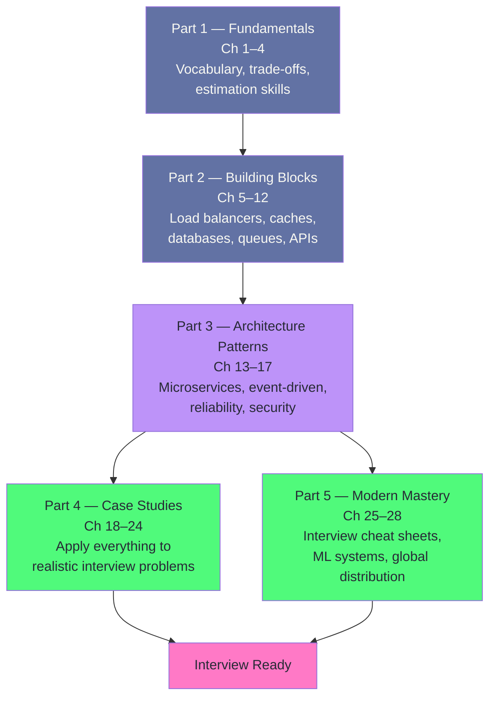
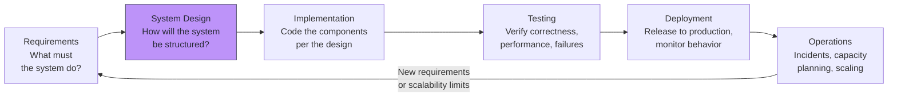

# Chapter 1: Introduction to System Design

## Mind Map

## Overview

System design is the process of defining the architecture, components, modules, interfaces, and data flow of a system to satisfy specified requirements. Unlike algorithm problems — which test your ability to solve well-defined puzzles with optimal code — system design asks you to reason about ambiguous, large-scale problems where there is no single correct answer. You are not writing code; you are making architectural decisions that will affect millions of users, engineering teams for years to come, and company revenue.

Systems thinking in this context means designing for **measurable scale** (how many QPS, how much storage), **predictable failure modes** (what breaks first and how you recover), and **operational requirements** (monitoring, deployment, cost). It is not about designing for unknowns — it is about systematically converting unknowns into known constraints through estimation and requirements gathering.

This chapter lays the foundation for everything that follows. We define what system design is, why distributed systems became necessary, introduce the five key properties every system must balance, and walk through a practical interview framework you can use immediately.

---

## What Is System Design?

System design is the discipline of translating requirements into a concrete technical blueprint. It covers decisions like:

- How many servers do we need?
- How is data stored, replicated, and retrieved?
- What happens when a component fails?
- How does the system behave under 10× normal load?

### System Design vs. Algorithm Design

These two disciplines are often confused early in an engineering career. The table below clarifies the distinction:

| Dimension | Algorithm / Coding Interview | System Design Interview |
|---|---|---|
| **Problem scope** | Narrow, well-defined | Broad, open-ended |
| **Answer type** | Optimal solution | Best trade-off for context |
| **Output** | Working code | Architecture diagram + rationale |
| **Skills tested** | Data structures, logic | Distributed systems, trade-offs |
| **Time horizon** | Minutes to hours | Years of operation |
| **Failure modes** | Wrong output | Cascading failures, data loss |

A coding interview asks: "Find the shortest path in this graph." A system design interview asks: "Design a URL shortener that handles 10 billion redirects per day." The latter has no single correct answer — only better or worse trade-offs given constraints.

---

## Why Distributed Systems?

### The Limits of a Single Machine

Early web applications ran on a single powerful server. As traffic grew, engineers upgraded that server — more CPU, more RAM, faster disks. This approach worked until it didn't. Every physical machine has a hardware ceiling: at some point you cannot buy a bigger box, and even before that ceiling, the cost curve turns exponential while performance gains become marginal.

Beyond cost and hardware limits, a single machine is a **single point of failure (SPOF)**. One hardware fault, one kernel panic, one misconfigured deployment — and your entire service goes down. For a consumer product with an SLA of 99.99% uptime (52 minutes of downtime per year), a single machine is simply not viable.

### Enter Distribution

Distributed systems solve these problems by spreading work and data across many machines connected by a network. The tradeoffs are real — distributed systems introduce network latency, partial failures, and consistency challenges — but the alternative (a single machine) cannot scale to internet scale. Google serves an estimated 8.5 billion searches per day. Netflix streams to 300+ million subscribers simultaneously. Amazon processes millions of transactions per hour. None of these workloads fit on one machine.

---

## Key Properties of Well-Designed Systems

Every system design decision involves balancing five core properties. Understanding them precisely is essential before any interview or production architecture work.

### Scalability

Scalability is a system's ability to handle increased load without proportional increases in cost or latency degradation. A scalable system processes 1 million requests as gracefully as it handles 1,000 — the architecture accommodates growth. Scalability can be achieved by scaling vertically (upgrading hardware), scaling horizontally (adding machines), or both. We dedicate all of [Chapter 2](./ch02-scalability.md) to this topic.

### Reliability

Reliability is the probability that a system performs its intended function under stated conditions for a specified period. A reliable system continues operating correctly even when individual components fail. This is achieved through redundancy (no single points of failure), replication (data exists in multiple places), and graceful degradation (partial failures do not cascade). Reliability is measured as Mean Time Between Failures (MTBF) and Mean Time To Recovery (MTTR).

### Availability

Availability is the percentage of time a system is operational and accessible to users. It is closely related to reliability but specifically measures uptime. Availability is expressed as "nines":

| Availability | Downtime per Year | Downtime per Month |
|---|---|---|
| 99% ("two nines") | 3.65 days | 7.3 hours |
| 99.9% ("three nines") | 8.77 hours | 43.8 minutes |
| 99.99% ("four nines") | 52.6 minutes | 4.4 minutes |
| 99.999% ("five nines") | 5.26 minutes | 26 seconds |

High availability requires eliminating SPOFs, implementing health checks and automatic failover, and deploying across multiple availability zones or regions. Availability and consistency are in tension — a concept formalized in the CAP theorem, covered in [Chapter 3](./ch03-core-tradeoffs.md).

### Maintainability

Maintainability describes how easily engineers can understand, modify, and operate a system over time. It encompasses three dimensions: **operability** (easy to monitor and manage in production), **simplicity** (new engineers can understand the system without months of onboarding), and **evolvability** (the system can be extended or changed without major rewrites). Systems that score low on maintainability accumulate technical debt, become fragile, and eventually slow down the entire engineering organization.

### Efficiency

Efficiency measures how well a system utilizes resources to deliver results. Two key metrics capture this: **latency** (time to complete a single operation, measured in milliseconds) and **throughput** (number of operations completed per unit time, measured in requests per second). These two are often in tension — optimizing for maximum throughput may require batching operations, which increases latency for individual requests. Good system design understands and explicitly manages this trade-off.

---

## The System Design Interview

System design interviews assess your ability to reason about ambiguous large-scale problems. Unlike coding interviews with a clear correct answer, success here means demonstrating structured thinking, knowing the right questions to ask, and communicating trade-offs clearly. Use this four-step framework consistently.

### Step 1: Requirements & Constraints (5 minutes)

Never begin designing before understanding what you are building. Ask clarifying questions to separate:

- **Functional requirements** — the features the system must provide. "Users can shorten URLs. Users can access shortened URLs."
- **Non-functional requirements** — performance, scalability, and reliability expectations. "100 million URLs created per day. Redirects must complete in under 100ms. 99.99% availability."
- **Out of scope** — explicitly state what you are not building to manage time. "We are not building analytics dashboards or user authentication in this session."

This step prevents you from designing the wrong system and demonstrates business awareness.

### Step 2: Back-of-Envelope Estimation (5 minutes)

Translate requirements into numbers before touching architecture. This grounds your design decisions in reality. Key estimates to compute:

- **Queries per second (QPS):** `DAU × actions_per_day / 86,400 seconds`
- **Storage (1 year):** `writes_per_day × record_size × 365`
- **Bandwidth:** `QPS × average_response_size`

See [Chapter 4](./ch04-estimation.md) for detailed estimation techniques and worked examples.

### Step 3: High-Level Design (20 minutes)

Sketch the overall architecture on the whiteboard before diving into any component. Cover:

1. **API design** — define the key endpoints and their contracts. Example: `POST /api/v1/shorten` accepts `{ url: string }` and returns `{ shortCode: string }`.
2. **Data model** — define core entities and their relationships. What does a URL record look like? What indices are needed?
3. **Component diagram** — clients, load balancers, application servers, databases, caches, message queues. Draw boxes and arrows showing data flow.

Keep this high-level. Do not tune database parameters or choose between Redis data structures yet — that is Step 4.

### Step 4: Deep Dive (10 minutes)

Now investigate the most interesting or challenging aspect of your design. The interviewer will often guide this, but good candidates proactively identify bottlenecks:

- Where does the system break under the estimated load?
- How does it handle the failure of one component?
- What is the consistency/availability trade-off in the data tier?

Demonstrate depth by exploring one area thoroughly rather than skimming all areas shallowly.

### Applying the Framework: URL Shortener Example

To make the framework concrete, here is how you would apply all four steps to a common interview problem — designing a URL shortener like bit.ly.

**Step 1 — Requirements (5 min):**
- Functional: users submit a long URL and receive a short code; any user accessing the short URL is redirected to the original
- Non-functional: 100M new URLs per day, 10B redirects per day, redirects in under 100ms, 99.99% availability
- Out of scope: analytics dashboard, user accounts, custom short codes

**Step 2 — Estimation (5 min):**
- Write QPS: 100M / 86,400 ≈ 1,160 writes/sec
- Read QPS: 10B / 86,400 ≈ 115,740 reads/sec (100:1 read-write ratio)
- Storage (5 years): 100M/day × 365 × 5 × 500 bytes ≈ 91 TB
- Peak read bandwidth: 115,740 × 500 bytes ≈ 55 MB/s

**Step 3 — High-Level Design (20 min):**

**Step 4 — Deep Dive (10 min):** The most interesting challenge is generating short codes that are unique, short, and not predictable (to prevent enumeration). Options include base62 encoding of a counter, MD5 hash truncation, or a dedicated ID generation service (Snowflake). Each has trade-offs in uniqueness guarantees, performance, and complexity. Note that MD5 truncation carries meaningful collision risk — by the birthday paradox, truncating to 7 characters (~36 bits) yields ~50% collision probability around 80K entries; in production, pair it with a collision check or prefer counter-based approaches.

This example demonstrates how the four-step framework transforms a vague problem statement into a structured architecture discussion in 40 minutes.

---

## Common System Design Mistakes

Understanding what not to do is as important as knowing the right patterns. These are the most common errors seen in system design interviews and production systems:

**Premature optimization:** Designing for 1 billion users before you have 1,000. Start with a simple architecture and add complexity only when a specific bottleneck is demonstrated. The best system design for a startup is usually the simplest one that works.

**Ignoring the data model:** Many candidates jump to architecture diagrams without defining the core entities and their relationships. A poorly designed data model is extremely expensive to change later and is often the root cause of scalability issues.

**Treating the database as infinitely scalable:** The database is almost always the first bottleneck in a distributed system. Candidates often scale the stateless application tier while ignoring database capacity.

**No failure handling:** Production systems encounter hardware failures, network partitions, and unexpected traffic spikes constantly. A design that only describes the happy path is incomplete. Always ask: "What happens when X fails?"

**Over-engineering:** Adding Kafka, Kubernetes, and microservices to a system that could be a simple monolith is a red flag in interviews. Interviewers want to see appropriate complexity, not maximum complexity.

---

## The System Design Learning Path

System design is a broad discipline. The chapters in this book follow a deliberate learning path:

Each part builds on the previous. Part 1 establishes the vocabulary and mental models. Part 2 introduces the components you will compose in designs. Part 3 covers how to combine them into production-grade architectures. Part 4 applies everything to realistic interview scenarios. Part 5 addresses the cutting edge of modern distributed systems.

---

## Real-World Perspectives

### Google

Google's infrastructure is built around the principle that hardware fails constantly at scale, so software must tolerate failure transparently. Their Bigtable paper (2006) and MapReduce paper (2004) introduced the industry to distributed data processing at scale. Google Search serves billions of queries per day with sub-second response times — achieved through massive horizontal scaling, aggressive caching, and years of infrastructure optimization.

### Netflix

Netflix migrated from a monolithic DVD rental system to a microservices architecture deployed entirely on AWS. Today, Netflix runs over 1,000 microservices (as of 2024). Their chaos engineering practice (Chaos Monkey deliberately kills production servers) was born from the need to prove that the system handles failures gracefully. At peak, Netflix accounts for approximately 15% of global internet bandwidth. Their full scaling story is covered in [Chapter 2](./ch02-scalability.md#real-world-how-netflix-scaled).

### Amazon

Amazon's retail platform evolved from a monolith to a service-oriented architecture in the early 2000s — driven by Jeff Bezos's famous "API mandate" requiring all teams to communicate through service interfaces. This internal discipline eventually became AWS, now the world's largest cloud provider. Amazon's DynamoDB, built for the shopping cart, is a canonical example of trading consistency for availability and performance — a pattern covered in [Chapter 3](./ch03-core-tradeoffs.md).

---

> **Key Takeaway:** System design is not about finding the perfect architecture — it is about making informed trade-offs between scalability, reliability, availability, maintainability, and efficiency given real-world constraints. Master the four-step interview framework and practice articulating *why* you made each decision.

---

## How to Use This Handbook

This handbook is designed to be read cover-to-cover the first time and used as a reference on every subsequent visit. The learning path is linear — each part builds vocabulary and intuitions that the next part depends on.

### Recommended Learning Path

### Reading Strategies

**Sequential (recommended for beginners):** Read Part 1 → Part 2 → Part 3 → Part 4 → Part 5. This is the fastest path to interview readiness because later chapters reference concepts introduced earlier.

**Topic-based (for experienced engineers):** Jump directly to Part 2 building blocks or Part 4 case studies. Use the mind maps at the start of each chapter to quickly orient yourself. Cross-references link to prerequisite concepts.

**Cheat-sheet mode (for interview prep):** Start with Chapter 25 (interview framework), then use the case studies in Part 4 as practice. Return to Part 2 building blocks when a case study references a component you are unfamiliar with.

### Prerequisite Knowledge

Before starting Part 1, you should be comfortable with:
- [ ] Basic networking concepts (what TCP/IP is, what HTTP means)
- [ ] Relational databases (tables, indexes, queries)
- [ ] At least one cloud provider (AWS, GCP, or Azure) at a beginner level
- [ ] Data structures and algorithms at an intermediate level

You do **not** need production distributed systems experience. This handbook teaches distributed systems concepts from first principles.

---

## System Design in the Software Lifecycle

System design is not a phase that happens once before coding begins. It is a continuous activity that spans the entire software development lifecycle and influences every subsequent phase.

System design decisions made early become the most expensive to change later. A poor choice of data model discovered at implementation costs days. The same mistake discovered in production costs weeks of migration work and potential data loss.

### Junior vs Senior Engineer Thinking

The biggest difference between junior and senior engineers is not knowledge of specific technologies — it is the instinct to ask different questions at each stage.

| Design Dimension | Junior Engineer Instinct | Senior Engineer Instinct |
|---|---|---|
| **Starting point** | "What technology should I use?" | "What does the system need to do?" |
| **Data model** | Design tables to match code objects | Design data model to match access patterns |
| **Scale** | "It works for the demo" | "What breaks first at 10× traffic?" |
| **Failure modes** | Happy path only | "What happens when X component is down?" |
| **Consistency** | Strong consistency assumed everywhere | Explicit trade-off per data type |
| **Components** | Add layers to solve every problem | Add layers only when a concrete bottleneck demands it |
| **Database choice** | Default to familiar database | Choose based on query patterns and scaling requirements |
| **Caching** | Introduced reactively after slowdowns | Designed into read path from the start |
| **Monitoring** | Added post-launch | Defined alongside the architecture |
| **Security** | Addressed in a separate "security sprint" | Baked into data flow and API design from day one |

The purpose of this handbook is to develop senior-engineer instincts — not just knowledge of what Redis is, but judgment about when Redis is the right tool and when it is not.

---

## The Four-Step Framework in Depth

The four-step interview framework introduced earlier in this chapter is not just interview theater. It mirrors the actual process a senior engineer uses when designing a new system. Here is the framework with the critical decision points made explicit.

```mermaid
flowchart TD
    START(["New System Design Problem"]) --> S1

    S1["STEP 1 - Requirements\n5 minutes"]
    S1 --> S1A{"Are functional requirements clear?"}
    S1A -->|"No"| S1B["Ask clarifying questions:\nWho are the users?\nWhat are the core actions?\nWhat is out of scope?"]
    S1B --> S1A
    S1A -->|"Yes"| S1C{"Are non-functional requirements defined?"}
    S1C -->|"No"| S1D["Probe for scale:\nDAU? Latency SLA?\nAvailability target?\nConsistency model?"]
    S1D --> S1C
    S1C -->|"Yes"| S1E["Summarize back:\nWe are building X with Y constraints.\nOut of scope: Z. Agreed?"]
    S1E --> S2

    S2["STEP 2 - Estimation\n5-10 minutes"]
    S2 --> S2A["Calculate write QPS\nand read QPS"]
    S2A --> S2B["Calculate storage\nneeds at 1 and 5 years"]
    S2B --> S2C["Calculate bandwidth\nQPS x payload size"]
    S2C --> S2D{"Does a single server suffice?"}
    S2D -->|"Yes, < 1K QPS"| S2E["Note: simple architecture\nmay be sufficient"]
    S2D -->|"No, > 1K QPS"| S2F["Note: distributed\narchitecture required"]
    S2E & S2F --> S3

    S3["STEP 3 - High-Level Design\n15-20 minutes"]
    S3 --> S3A["Define API endpoints\ninputs, outputs, HTTP verbs"]
    S3A --> S3B["Define core data model\nentities, relationships, key fields"]
    S3B --> S3C["Draw core component diagram\nclients, LB, app servers, DB, cache"]
    S3C --> S3D["Trace the primary\nread path end-to-end"]
    S3D --> S3E["Trace the primary\nwrite path end-to-end"]
    S3E --> S3F{"Bottlenecks identified?"}
    S3F -->|"Yes"| S3G["Add components to address\neach bottleneck - justify each addition"]
    S3G --> S4
    S3F -->|"None obvious"| S4

    S4["STEP 4 - Deep Dive\n10 minutes"]
    S4 --> S4A{"Interviewer directs a specific area?"}
    S4A -->|"Yes"| S4B["Go deep on that area:\nbottleneck, failure mode, or scaling"]
    S4A -->|"No"| S4C["Self-select the most\ninteresting trade-off to explore"]
    S4B & S4C --> S4D["Summarize:\nkey decisions, alternatives considered,\nwhat you would revisit with more time"]
    S4D --> DONE(["Design Complete"])

    style S1 fill:#6272a4,color:#f8f8f2
    style S2 fill:#6272a4,color:#f8f8f2
    style S3 fill:#bd93f9,color:#282a36
    style S4 fill:#50fa7b,color:#282a36
    style DONE fill:#ff79c6,color:#282a36
```

The most important insight from this diagram: **the first two steps are almost entirely about gathering information, not producing output.** The architecture you draw in Step 3 is only as good as the requirements and scale numbers you established in Steps 1 and 2. Candidates who skip straight to drawing boxes typically design for the wrong problem.

---

## Related Chapters

| Chapter | Relevance |
|---------|-----------|
| [Ch02 — Scalability](/system-design/part-1-fundamentals/ch02-scalability) | Next step: applying design principles at scale |
| [Ch03 — Core Trade-offs](/system-design/part-1-fundamentals/ch03-core-tradeoffs) | CAP/PACELC foundations for every design decision |
| [Ch04 — Estimation](/system-design/part-1-fundamentals/ch04-estimation) | Back-of-envelope skills used in Step 2 of the framework |
| [Ch25 — Interview Framework](/system-design/part-5-modern-mastery/ch25-interview-framework-cheat-sheets) | Full interview cheat sheets built on this foundation |

---

## Practice Questions

### Beginner

1. **Vertical vs Horizontal Scaling:** A startup's single-server web application is struggling under growing traffic. The CTO says "just upgrade the server." What are the limits of this approach, and what would you recommend instead for a system expecting 10× growth over 12 months?

   

   
Hint

   Consider the ceiling of vertical scaling (hardware limits, cost curve) and what becomes possible once the application is stateless.
   

2. **Availability vs Reliability:** Define the difference between availability and reliability. Give an example of a system that is highly available but not highly reliable, and explain how that state is possible.

   

   
Hint

   A system can always respond (available) while frequently returning incorrect results (unreliable) — think of a cache returning stale data.
   

### Intermediate

3. **Requirements Clarification:** You are designing a social media feed system for 50M DAU. List five functional requirements and five non-functional requirements you would clarify in Step 1 of the interview framework, and explain why each matters for architecture.

   

   
Hint

   Distinguish between what the system does (functional) and how well it must do it — latency, throughput, consistency, and durability are non-functional.
   

4. **Availability Math:** A system has 99.9% availability. How many minutes of downtime per month does that allow? If the business requires 99.99%, what specific architectural changes (redundancy, failover, deployment strategy) would you consider to close that gap?

   

   
Hint

   Monthly minutes = 43,800; work out the allowed downtime at each SLA tier, then map each change (active-active, rolling deploys, multi-AZ) to the failure modes it eliminates.
   

### Advanced

5. **Estimation + Capacity Planning:** Google serves 8.5 billion searches per day. Without a calculator, estimate the average QPS this represents. If each server handles 1,000 QPS and must maintain 30% headroom, how many servers are needed for peak load (assume peak is 3× average)? What does this imply about Google's data center strategy?

   

   
Hint

   Break the day into seconds, apply the peak multiplier, add the headroom factor, then reason about geographic distribution and redundancy for fault tolerance.
   

---

## References & Further Reading

- "Designing Data-Intensive Applications" — Martin Kleppmann
- "System Design Interview" — Alex Xu (Vol 1 & 2)
- "The System Design Primer" — Donne Martin (GitHub)
- [Google SRE Book](https://sre.google/sre-book/table-of-contents/)
