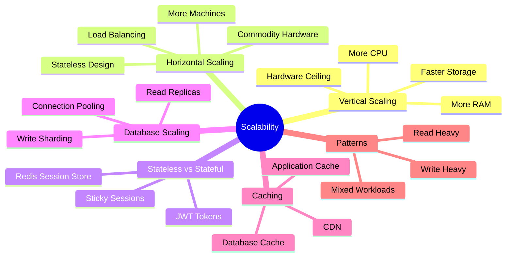
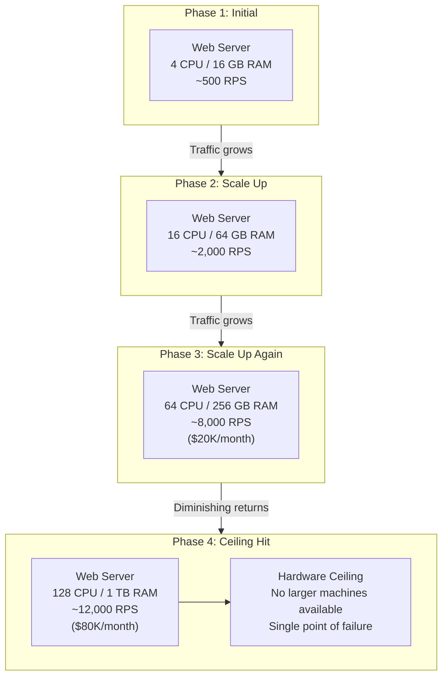
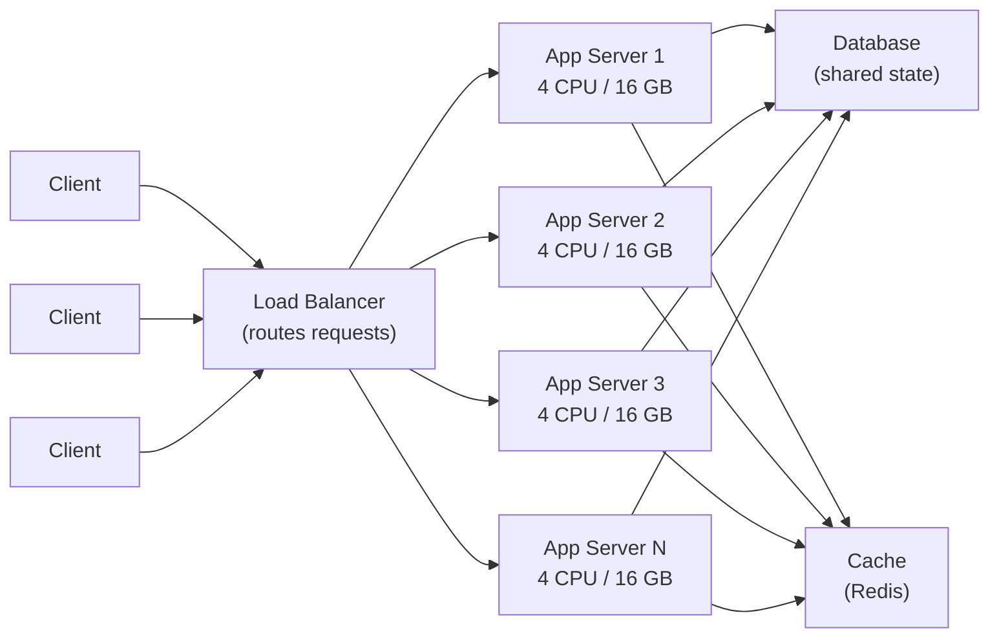
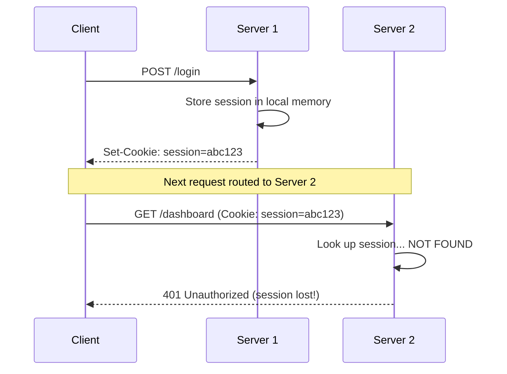
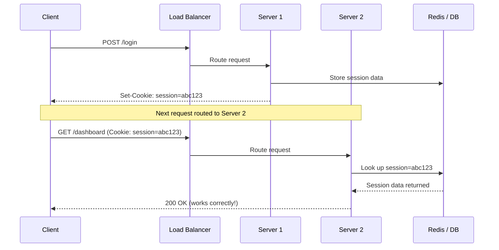
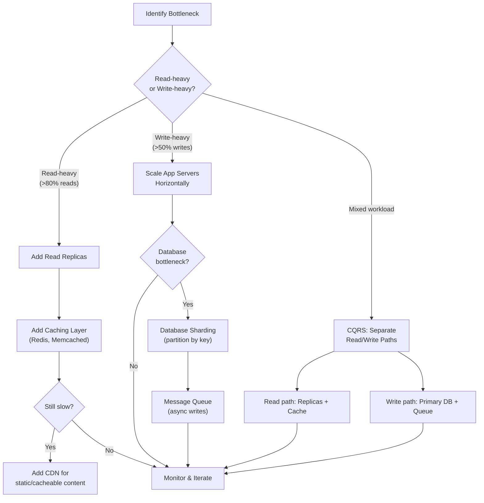
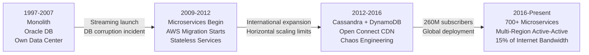
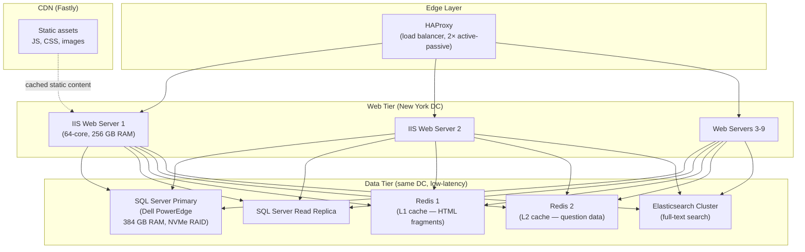

# Chapter 2: Scalability

## Mind Map

## Overview

Scalability is a system's capacity to handle growing workloads — more users, more data, more requests — without proportional degradation in performance or exponential growth in cost. A system that handles 1,000 requests per second well but collapses at 10,000 is not scalable. A system that handles 10,000 requests per second but requires 100× the infrastructure cost to do so is poorly scalable.

Scalability is not a binary property. It exists on a spectrum, and the correct scaling strategy depends on the specific bottleneck: CPU, memory, storage, network, or database throughput. This chapter covers the two fundamental scaling dimensions (vertical and horizontal), the architectural prerequisite for horizontal scaling (stateless design), and the key patterns used at every major technology company.

---

## Vertical Scaling (Scale Up)

Vertical scaling means making your existing machine more powerful: adding CPU cores, increasing RAM, upgrading to faster NVMe storage, or moving to a higher-bandwidth network card. It is the simplest approach because the application code does not change — the same program runs on a bigger machine.

### Limits of Vertical Scaling

**Hardware ceiling:** At some point, no larger machine exists. The most powerful single servers available today top out around 128 CPU cores and several terabytes of RAM. Internet-scale workloads exceed this ceiling.

**Exponential cost curve:** As you climb the hardware ladder, costs grow faster than performance. Doubling RAM from 64 GB to 128 GB might cost 2× more, but doubling from 512 GB to 1 TB can cost 6–8× more. Enterprise hardware pricing is non-linear.

**Single point of failure:** A single powerful machine is still one machine. Hardware failures, kernel panics, power loss, and botched deployments all cause complete outages. No amount of CPU upgrades eliminates this risk.

**Downtime for upgrades:** Physical hardware upgrades typically require taking the machine offline. Every upgrade window is an outage window.

Vertical scaling is appropriate for early-stage products, databases that are difficult to shard, and components where horizontal distribution introduces unacceptable complexity. But it is a short-term strategy, not a foundation for internet-scale systems.

---

## Horizontal Scaling (Scale Out)

Horizontal scaling means adding more machines to distribute the load. Instead of one large server, you run many commodity servers — each handling a portion of the total traffic. A load balancer sits in front and routes incoming requests across the pool.

### Benefits of Horizontal Scaling

**Near-linear cost scaling:** Adding a fifth $500/month server increases your cost by $500. The relationship between capacity and cost remains roughly linear, unlike vertical scaling.

**Theoretical unlimited ceiling:** There is no architectural limit to how many machines you can add. Google, Meta, and Amazon operate millions of servers each.

**Fault tolerance through redundancy:** If one server in a pool of ten fails, the other nine continue serving traffic. The load balancer detects the failure via health checks and stops routing to the dead node.

**Zero-downtime deployments:** Rolling deployments upgrade servers one at a time (or in small batches), keeping the rest of the pool available throughout. This enables continuous deployment without maintenance windows.

### The Statelessness Requirement

Horizontal scaling introduces a critical constraint: **any server in the pool must be able to handle any request**. If Server 1 stores a user's shopping cart in local memory and the load balancer routes that user's next request to Server 2, the cart is gone.

This means application servers must be **stateless** — they cannot store request-specific state locally between requests. All shared state must live in an external system (database, cache, message queue) that every server can access. See the [Stateless vs. Stateful Architectures](#stateless-vs-stateful-architectures) section below for implementation strategies.

---

## Vertical vs. Horizontal Comparison

| Aspect | Vertical Scaling | Horizontal Scaling |
|---|---|---|
| **Approach** | Upgrade existing machine | Add more machines |
| **Application changes** | None required | Requires stateless design |
| **Cost curve** | Exponential (diminishing returns) | Linear |
| **Complexity** | Low | High (load balancer, distributed state) |
| **Downtime for upgrades** | Required | Zero-downtime possible |
| **Failure blast radius** | Complete outage | Partial degradation |
| **Upper limit** | Hardware maximum | Theoretically unlimited |
| **Best suited for** | Databases, early-stage apps | Web/API servers, microservices |
| **Cloud equivalent** | Instance resize | Auto Scaling Group |

---

## Stateless vs. Stateful Architectures

The architectural choice between stateless and stateful design is the primary enabler of horizontal scalability.

### Stateful Architecture

In a stateful architecture, a server remembers information about previous interactions with a client. The classic example is server-side session storage: when a user logs in, the server creates a session object in memory and returns a session ID cookie. Subsequent requests include that cookie, and the server retrieves the session from its local memory.

Stateful design works with a single server but breaks immediately under horizontal scaling without additional complexity (sticky sessions, which bind a user to one server and reintroduce the SPOF problem).

### Stateless Architecture

In a stateless architecture, each request contains all the information the server needs to process it. The server does not rely on any locally stored state from previous requests. All persistent state lives in shared external stores accessible by every server.

### Session Management Strategies

Two dominant patterns implement stateless session management:

**JWT (JSON Web Tokens):** The session state is encoded directly in the token and signed with a server secret. The token is self-contained — servers verify the signature and read the payload without any external lookup. This eliminates network hops to a session store but prevents server-side session invalidation (you cannot revoke a JWT until it expires, unless you maintain a blocklist — which reintroduces a shared store).

**Redis Session Store:** A centralized session cache stores session data. Servers receive a session ID, look it up in Redis (sub-millisecond latency), and retrieve the session. This enables instant session invalidation (logout, security events) at the cost of a Redis dependency. Redis can be clustered for high availability.

| Strategy | JWT | Redis Session Store |
|---|---|---|
| **Server-side session storage** | None | Redis cluster |
| **Revocability** | Difficult (blocklist needed) | Instant |
| **Network hops per request** | 0 (self-contained) | 1 (Redis lookup) |
| **Token size** | Larger (encoded payload) | Small (ID only) |
| **Best for** | Microservices, APIs | Web apps with logout requirements |
| **Security model** | Signature verification | Server-controlled |

---

## Scaling Patterns

Real systems combine multiple scaling techniques. The appropriate pattern depends on whether the workload is read-heavy, write-heavy, or mixed.

### Read Replicas

For read-heavy workloads, add read replicas to your database. The primary database handles all writes and replicates changes asynchronously to replicas. Read traffic is distributed across replicas. This scales read throughput linearly with the number of replicas. The trade-off is **eventual consistency** — replicas may lag behind the primary by milliseconds to seconds. Applications must tolerate reading slightly stale data on the replica path.

### Write Sharding (Database Partitioning)

When write volume exceeds what a single primary database can handle, shard the database by partitioning data across multiple independent nodes. Each shard owns a range of data (e.g., users A–M on Shard 1, N–Z on Shard 2). This distributes write load but introduces complexity: cross-shard queries become expensive, transactions spanning shards require distributed coordination, and resharding as data grows is operationally complex. See [Chapter 9](../part-2-building-blocks/ch09-databases-sql.md) for a full treatment of database scaling.

### Caching Layers

Caches serve pre-computed or frequently accessed data at memory speed (sub-millisecond) rather than querying the database on every request. Caches are appropriate for:

- **Static content:** product catalog pages, user profile data that changes rarely
- **Computed results:** leaderboard rankings, recommendation lists
- **Database query results:** any expensive query whose result is reused frequently

The primary cache challenge is **cache invalidation**: when data changes in the database, the cache must be updated or invalidated or users will see stale data. Common strategies include time-to-live (TTL) expiry, write-through caching (update cache on every write), and cache-aside (application manages cache population on cache misses).

### Content Delivery Network (CDN)

A CDN is a globally distributed network of edge servers that cache static assets (images, CSS, JavaScript, video) close to end users. Instead of every user's request traveling to your origin server in Virginia, a user in Tokyo fetches assets from an edge node in Tokyo — reducing latency from 200ms to 5ms. CDNs also absorb massive traffic spikes and provide basic DDoS protection. See [Chapter 7](../part-2-building-blocks/ch07-caching.md) for CDN architecture details.

---

## Database Scaling Preview

The database is typically the first bottleneck in a horizontally-scaled application — stateless app servers scale easily, but the shared database they all write to does not. Strategies include:

- **Connection pooling** (PgBouncer, ProxySQL): reduce the overhead of database connections
- **Read replicas**: distribute read traffic (covered above)
- **Vertical scaling of the database**: the database is often the one component that benefits most from a very large single machine
- **Sharding**: horizontal partitioning of data (complex, use as a last resort)
- **Moving workloads to specialized stores**: full-text search to Elasticsearch, time-series data to InfluxDB, caching to Redis

Full database scaling strategies are covered in [Chapter 9: Databases](../part-2-building-blocks/ch09-databases-sql.md) and [Chapter 10: NoSQL](../part-2-building-blocks/ch10-databases-nosql.md).

---

## Load Balancing Preview

A load balancer is the entry point for horizontally scaled application tiers. It distributes incoming requests across the server pool using algorithms such as:

- **Round-robin:** requests distributed evenly in sequence
- **Least connections:** route to the server with fewest active connections
- **IP hash:** route a given client IP consistently to the same server (useful for some stateful protocols)
- **Weighted:** route more traffic to higher-capacity servers

Load balancers also perform health checks, removing unhealthy servers from the pool automatically. See [Chapter 6: Load Balancing](../part-2-building-blocks/ch06-load-balancing.md) for a complete treatment.

---

## Real-World: How Netflix Scaled

Netflix is one of the most frequently cited scaling stories in system design. The progression illustrates every concept in this chapter.

### Phase 1: DVD by Mail (1997–2007)

Netflix started as a DVD rental-by-mail service with a straightforward three-tier web application: web server → application server → database. The system ran on Oracle databases in their own data center. This architecture was entirely adequate for the scale.

### Phase 2: Streaming Launch and Growing Pains (2007–2009)

When Netflix launched streaming in 2007, traffic patterns changed dramatically. Video is bandwidth-intensive and the viewing patterns are bursty (everyone watches on Friday night). Their monolithic Oracle-backed system struggled. A major database corruption incident in 2008 caused three days of outage for DVD shipping, unable to update customer queues.

This incident was the catalyst for a fundamental architectural rethink.

### Phase 3: The AWS Migration (2009–2016)

Netflix made the decision to migrate entirely to AWS — the first major consumer internet company to do so at this scale. The migration took seven years and involved decomposing the monolith into hundreds of microservices.

Key architectural decisions during this phase:
- **Stateless microservices on EC2 Auto Scaling Groups**: each service scaled horizontally and independently
- **DynamoDB and Cassandra** for high-throughput data stores that scaled horizontally (relational databases were replaced for most workloads)
- **CDN (Netflix Open Connect)**: Netflix built their own CDN, deploying edge servers inside ISP data centers globally, so video bytes never traverse long internet paths
- **Chaos Engineering**: the Chaos Monkey tool randomly terminated production EC2 instances to prove the system handled failures. The Netflix Simian Army extended this to entire availability zone failures

### Phase 4: Global Scale (2016–Present)

Netflix operates in 190+ countries with 260+ million subscribers (2024). At peak, Netflix accounts for ~15% of global downstream internet bandwidth.

Their architecture at this scale:
- **700+ microservices**, each owned by a small team and deployed independently
- **Global CDN (Open Connect)** with 1,000+ appliances in ISPs worldwide, serving video bytes locally
- **Multi-region active-active** deployment with traffic routing based on latency and availability
- **Personalization ML pipeline** running at massive scale to compute recommendations for every subscriber

The core lesson from Netflix: **scaling is a journey, not a destination.** Their architecture today is unrecognizable compared to 2007, and it will continue to evolve. Each phase of scaling introduced new bottlenecks that required new architectural patterns.

### Netflix Scaling Timeline

---

> **Key Takeaway:** Scalability is achieved by designing stateless application layers that can be replicated horizontally behind a load balancer, while pushing all shared state into purpose-built external stores (databases, caches, queues). Vertical scaling buys time; horizontal scaling is the long-term foundation.

---

## Case Study: Stack Overflow — Scale Vertically First

Stack Overflow is one of the most visited developer resources in the world — and one of the most counterintuitive infrastructure stories. While most companies at similar traffic levels operate hundreds of servers across multiple cloud regions, Stack Overflow serves over **1.3 billion page views per month** from approximately **9 web servers** and a handful of database machines. As of 2021, the primary SQL Server database runs on a single powerful on-premises machine.

This is not a legacy accident. It is a deliberate architectural philosophy: **optimize the machine you have before adding machines you don't need**.

> *"We're not in the business of scaling infrastructure. We're in the business of serving Stack Overflow."*
> — Nick Craver, Stack Overflow Infrastructure Lead

### Infrastructure Overview

### Why So Few Servers?

The answer is aggressive, multi-layer caching combined with vertical investment in the database tier.

**Layer 1 — HTTP cache (Fastly CDN):** Static assets (JavaScript, CSS, images) are served from edge nodes globally. Anonymous page views are cached at the CDN level — Stack Overflow serves millions of anonymous users who never hit the origin.

**Layer 2 — Application-level Redis:** Two Redis instances cache rendered HTML fragments, user data, and question metadata. A page with 40 questions is assembled from Redis-cached components, not fresh DB queries. Cache hit rates consistently exceed 90%.

**Layer 3 — SQL Server with massive RAM:** The primary SQL Server has 384 GB of RAM. The entire working dataset of the most active questions, answers, and user profiles fits in the database's buffer pool — in-memory reads. Disk I/O is rarely the bottleneck.

**Layer 4 — Compiled, efficient .NET:** Stack Overflow runs ASP.NET MVC (now ASP.NET Core). Each web server handles thousands of concurrent requests efficiently. The JIT-compiled code paths for common page renders are highly optimized.

### Key Metrics

| Metric | Stack Overflow | "Typical" at This Scale | Difference |
|---|---|---|---|
| Page views / month | 1.3 billion+ | 1.3 billion+ | Same |
| Web servers | ~9 (on-premises) | 50–200+ (cloud) | 5–20× fewer |
| Database servers | 1 primary + 1 replica | 5–20+ (sharded) | 5–10× fewer |
| Infrastructure cost / month | ~$5K–10K (own hardware) | ~$200K–$500K (cloud at scale) | 20–50× cheaper |
| Average SQL query time | < 1ms (all in buffer pool) | varies | Extreme optimization |
| Redis cache hit rate | > 90% | 70–85% typical | High intentional caching |
| Deployment servers | ASP.NET IIS on Windows | Polyglot microservices | Monolith discipline |

*Note: Stack Overflow cost estimates are approximate, based on public engineering blog posts circa 2019–2021. Exact figures vary with hardware refresh cycles.*

### Architecture Timeline

Stack Overflow launched in 2008 on a single server. Rather than immediately decomposing into microservices as traffic grew, the team systematically profiled and optimized:

1. **2008–2010:** Single server, grew to a few web servers + SQL Server. Profile first, scale second.
2. **2011–2014:** Added Redis caching aggressively. Reduced DB load by 90%+ on read paths.
3. **2015–2018:** Upgraded SQL Server hardware instead of sharding. Bought more RAM, NVMe SSDs.
4. **2019–present:** Added Elasticsearch for search. Maintained monolith discipline. ~9 web servers.

The team publicly documented that they deliberately avoided Kubernetes, microservices decomposition, and cloud migration because **the existing architecture, properly optimized, continued to meet the SLA**.

---

## Lessons from Stack Overflow

The Stack Overflow story challenges several common assumptions in system design. These lessons apply to any team deciding when and how to scale.

### 1. Profile Before You Scale

Stack Overflow's team ran extensive profiling before every scaling decision. They identified that most latency came from N+1 SQL queries and unoptimized ORM calls — not hardware limits. Fixing the queries cost nothing. Adding servers would have cost thousands per month while leaving the root cause in place.

**Lesson:** Measure your actual bottleneck. CPU? Memory? DB query time? Network? The answer determines the intervention.

### 2. A Single Powerful Database Can Go Far

The conventional wisdom is that you must shard your database horizontally as traffic grows. Stack Overflow demonstrates that a single, well-tuned SQL Server with sufficient RAM can serve billions of page views when:
- Queries are indexed correctly
- The working dataset fits in buffer pool memory
- The application uses caching to avoid redundant queries

**Lesson:** Vertical scaling of the database is often the right first move. Sharding introduces distributed transactions, cross-shard query complexity, and operational burden. Delay it until you have clear evidence of the bottleneck.

### 3. Caching Multiplies Capacity

Redis transformed Stack Overflow's capacity. With > 90% cache hit rates on the most active content, each database query effectively serves thousands of users. The relationship is not linear — a 90% cache hit rate means the database serves 10× fewer queries, not 1.1×.

**Lesson:** Before scaling the database, aggressively cache. Identify the hottest 20% of data that serves 80% of requests. Cache it. Measure the impact before adding hardware.

### 4. Monoliths Can Scale With Discipline

Stack Overflow runs a monolithic .NET application. They have not decomposed into microservices because the monolith is well-structured, has clear internal module boundaries, and does not have the team coordination problems that motivate microservice adoption (hundreds of teams working independently).

**Lesson:** Microservices solve **organizational** and **deployment independence** problems, not primarily throughput problems. A disciplined monolith can scale to enormous traffic if the data access patterns are optimized.

### 5. Own Your Hardware When the Numbers Work

Stack Overflow co-locates servers in a data center rather than running on AWS or Azure. At their scale, the economics favor owned hardware: they pay once for servers that run for 5+ years, rather than paying per-hour cloud rates indefinitely.

**Lesson:** Cloud is not always cheaper. For stable, predictable workloads with consistent utilization, owned or co-located hardware can be 5–10× more cost-effective. Cloud's value proposition is elasticity — if you don't need elasticity, weigh the total cost carefully.

**Cross-reference:** See [Chapter 7 — Caching](/system-design/part-2-building-blocks/ch07-caching.md) for cache invalidation strategies that make high hit rates sustainable. See [Chapter 9 — SQL Databases](/system-design/part-2-building-blocks/ch09-databases-sql.md) for buffer pool sizing, indexing, and query optimization that enable Stack Overflow's single-DB approach.

---

## Practice Questions

1. You are designing the backend for a photo-sharing app. The app is currently running on a single $500/month server at 70% CPU capacity, and the team expects 5× growth in the next year. Walk through the scaling strategy you would recommend, step by step.

2. Explain why stateless application servers are a prerequisite for horizontal scaling. What happens if you attempt to horizontally scale a stateful application server? What are the workarounds and their trade-offs?

3. A read-heavy social media platform has a single primary PostgreSQL database. Reads are slow even with proper indexing. Describe at least three architectural changes you would make to address this, in the order you would implement them.

4. Compare JWT-based sessions to Redis-based sessions. For a banking application where instant session revocation (on logout or suspicious activity) is critical, which would you choose and why?

5. Netflix built their own CDN (Open Connect) rather than using a commercial CDN like Cloudflare or Akamai. What business and technical motivations might drive that decision? What are the trade-offs of building vs. buying infrastructure like a CDN?
