# Chapter 3: Core Trade-offs


> *Every system design decision is a trade-off. There is no free lunch — only informed choices.*

## Mind Map

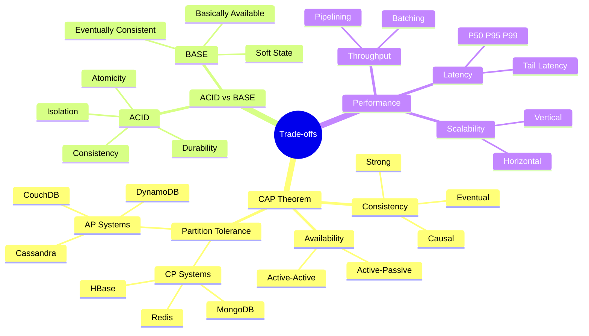

---

## Overview

When engineers build distributed systems, they constantly face decisions where improving one property
forces a trade-off against another. Understanding these fundamental tensions is not academic —
it is the lens through which every design decision is made.

Three trade-offs appear in nearly every system design conversation:

1. **CAP Theorem** — Consistency, Availability, and Partition Tolerance: pick two
2. **ACID vs BASE** — Strong guarantees vs. high availability at scale
3. **Latency vs Throughput** — Fast responses vs. high volume processing

This chapter builds the vocabulary and mental models referenced throughout the entire handbook.
You will encounter these concepts in caching (ch04), databases (ch09/ch10), and every case study in Part 4.

---

## CAP Theorem

### Definition

The CAP theorem, formalized by Eric Brewer in 2000 and proved by Gilbert and Lynch in 2002, states that
a distributed data store can guarantee at most **two** of the following three properties simultaneously:

| Property | Definition |
|---|---|
| **C — Consistency** | Every read receives the most recent write or an error. All nodes see the same data at the same time. |
| **A — Availability** | Every request receives a non-error response — but it might not be the most recent data. |
| **P — Partition Tolerance** | The system continues operating even when network messages are dropped or delayed between nodes. |

### Why You Can Only Have Two

Network partitions are not optional in distributed systems — they will happen. A fiber cable gets cut.
A switch fails. An AWS availability zone goes dark. Since **P is mandatory in any real distributed system**,
the real choice is always between **C and A** during a partition event.

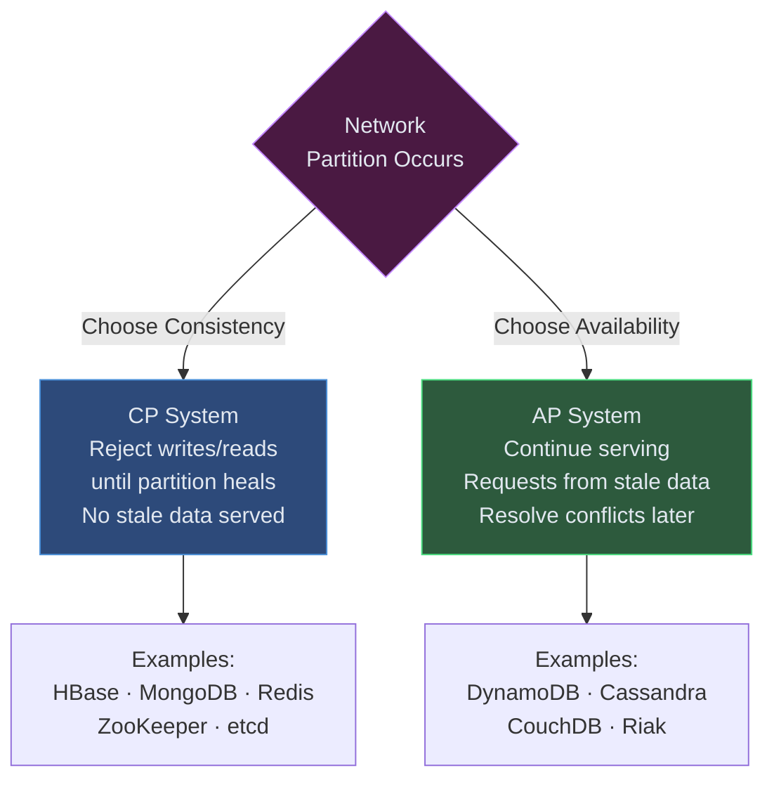

### CP vs AP: Behavior During a Partition

**CP System behavior** — the system refuses to answer rather than give stale data:

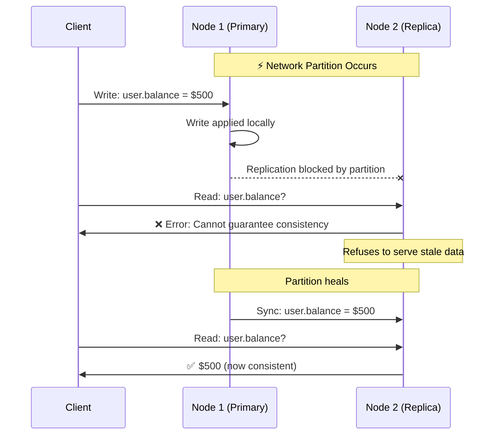

**AP System behavior** — the system continues serving potentially stale data:

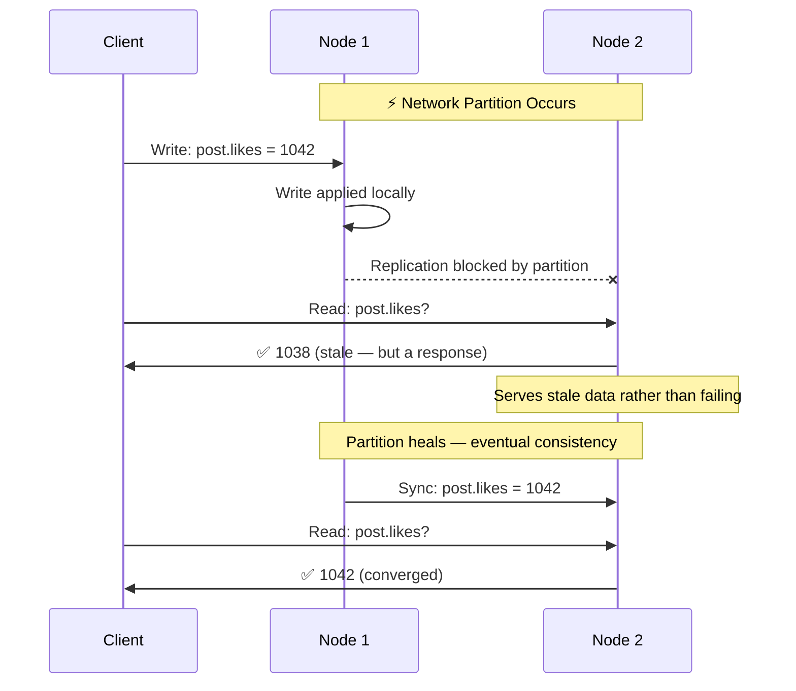

### CA Systems

Traditional single-datacenter RDBMS (PostgreSQL, MySQL) are often labeled **CA** — consistent and available,
without partition tolerance. This is technically accurate only when the entire database runs on a single machine
where network partitions between nodes cannot occur. As soon as you add replication across datacenters, the CA
category collapses back to the CP/AP choice.

> **Critical clarification (Brewer, 2012):** **P is not a design choice — it is a physical reality.** Network
> partitions *will* happen in any distributed system: cables get cut, switches fail, cloud availability zones
> go dark. Because you cannot opt out of partitions, "CA" does not exist as a viable distributed-system
> classification. The real and only choice is between **CP** (sacrifice availability when a partition occurs)
> and **AP** (sacrifice consistency when a partition occurs). "CA" only applies to a truly single-node system
> with no network between nodes — which is not a distributed system at all.

### PACELC Theorem

The **PACELC theorem** (Abadi, 2012) extends CAP by addressing what happens when there is *no* network partition — the normal operating state for most systems.

**PACELC states:** If there is a **P**artition, choose between **A**vailability and **C**onsistency (same as CAP). **E**lse (normal operation), choose between **L**atency and **C**onsistency.

This matters because CAP only describes behavior during failures, but most of the time your system is running normally. During normal operation, you still face a fundamental trade-off: do you sacrifice latency for stronger consistency, or accept weaker consistency for faster responses?

| System | During Partition (PA/PC) | Normal Operation (EL/EC) | Classification |
|---|---|---|---|
| DynamoDB / Cassandra | PA (favor availability) | EL (favor latency) | PA/EL |
| MongoDB | PC (favor consistency) | EC (favor consistency) | PC/EC |
| PAXOS / Raft | PC (favor consistency) | EC (favor consistency) | PC/EC |
| Cosmos DB | Configurable | Configurable | Tunable |

> **Key insight:** PACELC is more useful than CAP for real-world system design because it captures the latency vs. consistency trade-off that engineers face every day, not just during rare partition events.

---

## ACID vs BASE

### ACID: Strong Guarantees

**ACID** defines the properties that guarantee database transactions are processed reliably. Born from the
requirements of financial and transactional systems where correctness is non-negotiable.

| Property | Meaning | Example |
|---|---|---|
| **Atomicity** | A transaction is all-or-nothing. If any step fails, the entire transaction rolls back. | Transfer $100: debit succeeds but credit fails → both operations rolled back |
| **Consistency** | A transaction brings the database from one valid state to another. Constraints are always satisfied. | Account balance can never go below zero |
| **Isolation** | Concurrent transactions execute as if they were sequential. No dirty reads. | Two users booking the last seat: only one succeeds |
| **Durability** | Once committed, a transaction persists even through system failures. | Power outage after commit → data survives on disk |

### BASE: Trade Guarantees for Scale

**BASE** is the philosophical counterpoint to ACID, coined to describe the trade-offs made by large-scale
distributed databases that prioritize availability and partition tolerance.

| Property | Meaning | Example |
|---|---|---|
| **Basically Available** | The system remains available even during failures, possibly returning stale data. | DynamoDB continues serving reads during an AZ outage |
| **Soft State** | Data in the system may change over time due to eventual consistency propagation, even without new writes. | A replica's view of data may shift as syncs arrive |
| **Eventually Consistent** | Given enough time without new updates, all replicas will converge to the same value. | All Cassandra nodes will agree on a counter value — eventually |

### ACID vs BASE Comparison

| Property | ACID | BASE |
|---|---|---|
| **Consistency** | Strong — immediate, guaranteed | Eventual — converges over time |
| **Availability** | May sacrifice availability for correctness | Prioritizes availability over consistency |
| **Partition handling** | Reject operations during partition | Serve best-effort responses |
| **Scalability** | Harder — coordination overhead | Easier — nodes act independently |
| **Latency** | Higher — waits for quorum/locks | Lower — local writes, async sync |
| **Complexity** | Simple programming model | Application must handle stale reads |
| **Use cases** | Banking, orders, payments, inventory | Social feeds, analytics, shopping carts |
| **Representative systems** | PostgreSQL, MySQL, Oracle, CockroachDB | Cassandra, DynamoDB, CouchDB, Riak |

### When to Choose ACID

- Financial transactions: bank transfers, payment processing
- Inventory management: only one customer can buy the last item
- Booking systems: airline seats, hotel rooms
- Any system where reading stale data causes **real-world harm**

### When to Choose BASE

- Social media feeds: seeing a like count of 10,041 vs 10,042 is inconsequential
- Analytics and metrics: approximate counts are acceptable
- Shopping carts: temporary inconsistency is fine, eventual convergence is expected
- Any system prioritizing **global scale over strict correctness**

---

## Consistency Models

Consistency is not binary. There is a spectrum from "always correct" to "eventually correct" with
several well-defined stopping points.

### Strong Consistency

Every read returns the most recent committed write. No client ever observes stale data.

**How it works:** Writes are not acknowledged until all replicas confirm receipt. Reads can be served from
any node since they are all guaranteed to be identical.

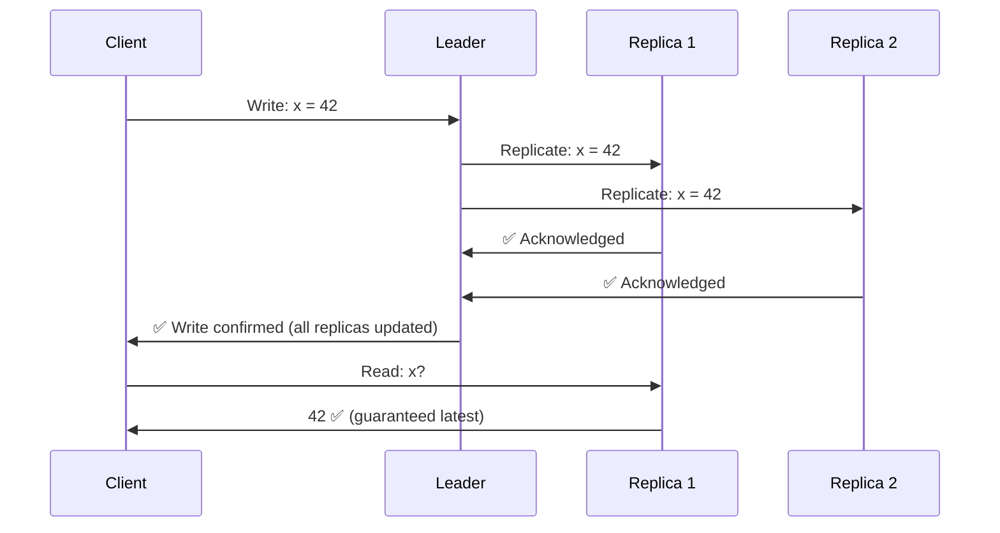

**Cost:** Higher write latency (must wait for all replicas). Lower availability during partition.

**Used by:** Google Spanner, CockroachDB, etcd, ZooKeeper, HBase

### Eventual Consistency

Given enough time without new writes, all replicas will converge to the same value. Reads may
temporarily return stale data.

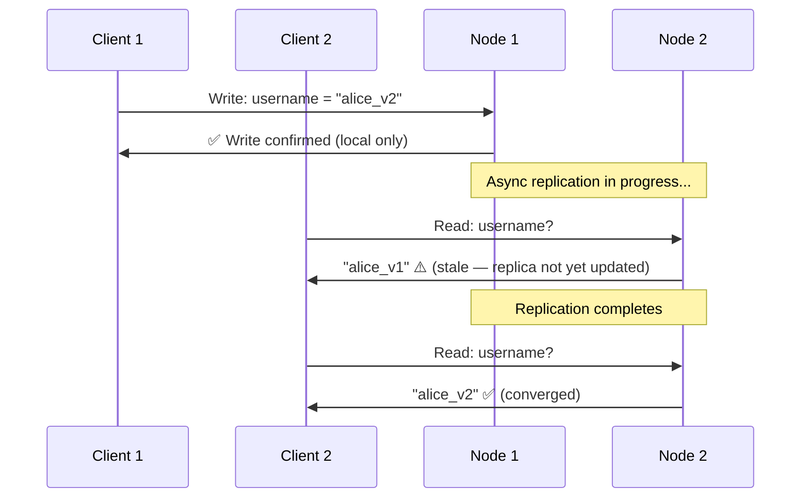

**Cost:** Application must handle stale reads. Conflict resolution logic required.

**Used by:** DynamoDB (default), Cassandra, CouchDB, DNS, CDNs

### Causal Consistency

Operations that are causally related are seen in the correct order by all nodes. Operations with no
causal relationship may be seen in different orders.

**Example:** If Alice posts "I got the job!" and then Bob replies "Congratulations!", no user should
ever see Bob's reply without first seeing Alice's post. The reply is causally dependent on the post.

```
Alice: [Post: "I got the job!"] → [Edit post]
Bob:   [Read Alice's post] → [Reply: "Congrats!"]
Carol: Must see Alice's post BEFORE Bob's reply ✅
       May see Alice's post and edit in either order (no causal link)
```

**Used by:** MongoDB (causal sessions), some distributed databases with vector clocks

### Consistency Models Comparison

| Model | Guarantee | Latency | Availability | Complexity |
|---|---|---|---|---|
| **Strong** | Always latest data | High | Lower | Simple to program |
| **Causal** | Causally related ops in order | Medium | Medium | Moderate — vector clocks |
| **Eventual** | Converges over time | Low | High | Hard — stale reads, conflicts |

### Decision Guide: Which Consistency Model?

- **Strong:** Use when stale data causes real harm — financial systems, inventory, access control
- **Causal:** Use when ordering matters for user experience — social feeds, collaborative editing
- **Eventual:** Use when scale matters more than precision — analytics, CDN content, DNS propagation

---

## Availability Patterns

High availability means the system remains operational even when individual components fail.
The key question is: how do you ensure a backup takes over when the primary fails?

### Active-Passive Failover (Hot Standby)

One server handles all traffic (active). A standby server waits, receiving heartbeats and
synced data, ready to take over if the active server fails.

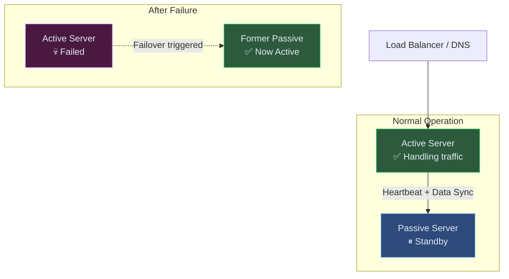

**Failover time:** Seconds to minutes (depends on heartbeat interval and health check timeout)

**Types:**
- **Hot standby** — passive server is running and synchronized, fast failover
- **Warm standby** — passive server is running but not fully synced, slower failover
- **Cold standby** — passive server is off, must boot and restore data (slowest)

### Active-Active Failover (Load Balanced)

Both servers handle live traffic simultaneously. If one fails, the other absorbs its load.
No downtime — the surviving node simply handles more traffic.

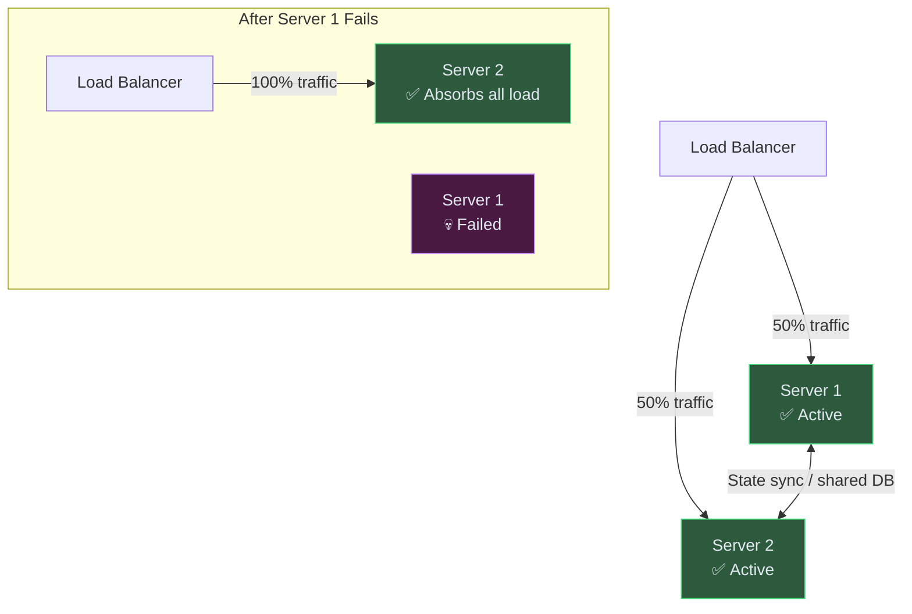

**Challenge:** Both nodes must agree on shared state. This requires distributed coordination —
either a shared database, distributed locks, or conflict-free data structures (CRDTs).

### Active-Passive vs Active-Active

| Property | Active-Passive | Active-Active |
|---|---|---|
| **Normal capacity** | 50% utilized (passive sits idle) | 100% utilized |
| **Failover time** | Seconds (hot standby) to minutes | Zero downtime |
| **Complexity** | Simple — clear primary | Higher — coordination required |
| **Cost** | Higher — idle hardware | Lower — full utilization |
| **Consistency** | Easier — single writer | Harder — concurrent writes |
| **Best for** | Databases, leader election | Stateless services, web servers |

---

## Latency vs Throughput

### Definitions

**Latency** is the time to complete a single operation — from request initiation to response receipt.
Measured as P50, P95, P99 (50th, 95th, 99th percentile response times).

**Throughput** is the number of operations completed per unit of time — requests per second (RPS),
transactions per second (TPS), or megabytes per second (MB/s).

### The Relationship

Latency and throughput are often in tension. Optimizing for one frequently degrades the other:

| Technique | Effect on Throughput | Effect on Latency |
|---|---|---|
| **Batching writes** | ↑ Higher — amortizes I/O overhead | ↑ Higher — waits to accumulate batch |
| **Connection pooling** | ↑ Higher — reuses established connections | ↓ Lower — no connection setup cost |
| **Request pipelining** | ↑ Higher — multiple in-flight | Neutral — same per-request time |
| **Adding replicas** | ↑ Higher — parallel reads | ↓ Lower — less contention |
| **Synchronous replication** | ↓ Lower — waits for all acks | ↑ Higher — blocked waiting |

**The batching example in detail:**

A database write normally takes 2ms. If you batch 100 writes together, the batch completes in 10ms.
- **Individual latency:** 2ms per write
- **Batch throughput:** 100 writes / 10ms = 10,000 writes/sec vs 500 writes/sec individual
- **Batch latency:** 10ms (the first write in the batch waits up to 10ms before being flushed)

This is the exact trade-off Kafka makes: producers accumulate messages in a buffer (`linger.ms`) to
increase throughput, at the cost of added latency for individual messages.

### Little's Law

The relationship between concurrency, throughput, and latency is captured by Little's Law (`L = λ × W`). It is covered in full — with capacity planning examples — in the [Queuing Theory Basics](#queuing-theory-basics) section below.

---

## Performance vs Scalability

### The Distinction

- **Performance** — How fast does the system process a single request?
- **Scalability** — Can the system handle more requests by adding resources?

A system can be high-performance but not scalable, or scalable but not high-performance.

### When They Conflict

**Example 1: Single-threaded Redis**

Redis is extraordinarily fast — sub-millisecond responses — because it runs a single-threaded event loop
with no locking or contention. This is exceptional *performance*. However, Redis cannot horizontally scale
a single instance — one Redis server is bounded by one CPU core. To scale beyond that, you need Redis Cluster
with sharding, which adds complexity and cross-shard coordination overhead.

**Example 2: Microservices vs Monolith**

A monolith has better raw *performance* for individual requests — no network hops between services, shared
memory, no serialization overhead. But a microservices architecture is more *scalable* — each service can
be scaled independently based on its specific load pattern.

**Example 3: Global locks**

Adding a global mutex around a critical section solves correctness but destroys scalability.
Performance per request may be fine, but throughput collapses under concurrency.

### The Scalability Spectrum

```
Single Server → Vertical Scaling → Horizontal Scaling → Sharding → Global Distribution
← Better Performance ────────────────────────── Better Scalability →
```

---

## Real-World Trade-off Examples

### DynamoDB: Choosing AP

Amazon's DynamoDB is built explicitly for availability over consistency. The design philosophy emerged
from Amazon's 2007 Dynamo paper: during peak shopping events (Black Friday), it is better to allow
a customer to add items to their cart with stale inventory data than to refuse the operation entirely.

- **Choice:** AP — available and partition-tolerant
- **Mechanism:** Eventual consistency by default; optional strongly consistent reads (at higher cost)
- **Conflict resolution:** Last-write-wins (LWW) using timestamps; application-level resolution optional
- **Real impact:** During an AZ outage, DynamoDB continues serving reads and writes from remaining nodes

### Google Spanner: CP with External Consistency

Google Spanner achieves something remarkable: globally distributed CP consistency. Most distributed
databases accept that strong consistency across datacenters requires high latency (speed of light delay
between regions). Spanner sidesteps this using **TrueTime** — a globally synchronized clock built on
GPS receivers and atomic clocks in every Google datacenter.

- **Choice:** CP — consistent and partition-tolerant (sacrifices availability for correctness)
- **Mechanism:** TrueTime provides bounded clock uncertainty (~7ms globally), enabling serializable
  transactions across continents without indefinite blocking
- **Real impact:** Google Ads and Google F1 (AdWords database) run on Spanner — financial accuracy at
  planetary scale

### Traditional RDBMS: CA (Single Datacenter)

PostgreSQL, MySQL, Oracle running in a single datacenter operate as CA systems. Within one datacenter,
the network is reliable enough that partition tolerance is not a practical concern. These databases
deliver strong consistency (ACID) and high availability through primary-replica setups.

- **Choice:** CA — consistent and available within one datacenter
- **Limitation:** The CA label breaks down the moment you replicate across datacenters (network partitions
  become real). At that point, PostgreSQL's streaming replication reverts to the CP/AP choice.
- **Used by:** Banks, healthcare, any regulated industry requiring audit trails and strong consistency

### Summary: Choosing Your System

| Use Case | Recommended Choice | System Examples |
|---|---|---|
| Financial transactions | CP (ACID) | PostgreSQL, CockroachDB, Spanner |
| Global social feed | AP (BASE) | Cassandra, DynamoDB |
| Distributed coordination | CP | ZooKeeper, etcd, Consul |
| Real-time analytics | AP | Cassandra, ClickHouse |
| E-commerce inventory | CP | MySQL, PostgreSQL |
| Shopping cart | AP | DynamoDB, Redis |
| Configuration/metadata | CP | etcd, ZooKeeper |
| User preferences | AP | DynamoDB, Cassandra |

---

> **Key Takeaway:** In distributed systems, the most dangerous engineer is one who has not internalized
> CAP. Every database, every cache, every queue embodies these trade-offs — your job is to match the
> system's guarantees to the business requirements. When a bank asks you to design a payment system and
> you reach for Cassandra, you have made a career-limiting choice. When a social media company needs
> global scale and you insist on PostgreSQL for the like counter, you are building your own bottleneck.

---

## PACELC Theorem

CAP describes behavior **during a partition**. But networks are not partitioned most of the time. PACELC extends CAP by asking: what trade-off do you make during **normal operation**?

> **PACELC**: If there is a **P**artition, choose between **A**vailability and **C**onsistency; **E**lse (normal operation), choose between **L**atency and **C**onsistency.

### Why PACELC Matters

A database that replicates synchronously is strongly consistent even when there is no partition — but every write pays a latency penalty waiting for replicas to confirm. A database that replicates asynchronously has lower write latency — but reads may see stale data. PACELC names this second trade-off explicitly.

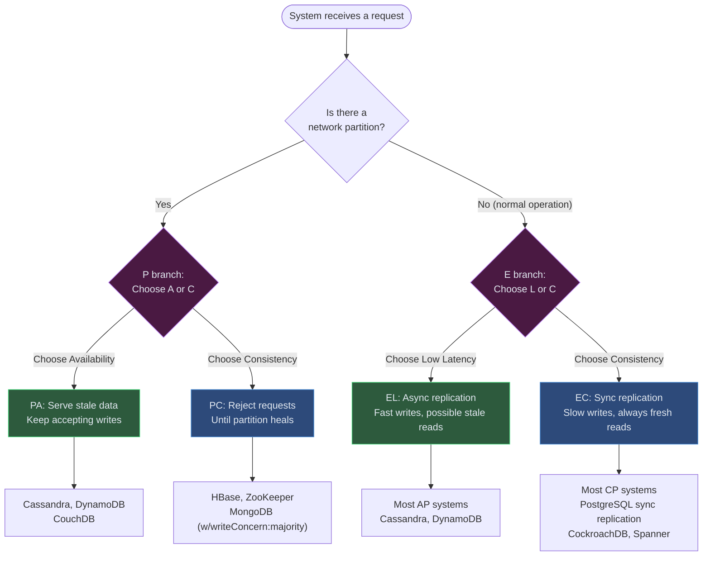

### PACELC Classifications

A database's PACELC label is written as `PA/EL`, `PC/EC`, etc.:

- **PA/EL** — Sacrifices consistency both during partitions and during normal operation (favors availability + low latency)
- **PC/EC** — Preserves consistency in both cases (pays in availability + latency)
- **PA/EC** — Inconsistent during partition (prioritizes availability) but consistent in normal operation (pays latency)

---

## CAP/PACELC Database Classification

| Database | CAP | PACELC | Partition Behavior | Normal-Op Trade-off | Notes |
|---|---|---|---|---|---|
| **PostgreSQL** | CA/CP | PC/EC | Rejects if replica sync fails | Sync replica → higher write latency | Single-region: CA. Multi-region: CP |
| **MySQL InnoDB** | CA/CP | PC/EC | Semi-sync replication | Configurable sync level | Semi-sync = 1 replica confirms |
| **CockroachDB** | CP | PC/EC | Refuses stale reads | Consensus (Raft) adds ~2–5ms | Serializable isolation by default |
| **Google Spanner** | CP | PC/EC | Refuses during partition | TrueTime adds bounded latency | ~7ms clock uncertainty globally |
| **MongoDB** | CP* | PC/EC | Rejects w/o quorum | Majority writes are consistent | *Default is AP; CP with writeConcern:majority |
| **Cassandra** | AP | PA/EL | Continues serving stale | Async replication, fast writes | Tunable consistency (ONE to ALL) |
| **DynamoDB** | AP | PA/EL* | Continues with stale data | Eventually consistent by default | *Strongly consistent reads available at 2× cost |
| **Redis (Cluster)** | CP† | PC/EL | Rejects if primary unreachable | Single-threaded, very low latency | †Async replication — acknowledged writes can be lost during failover; practical behavior is closer to AP |
| **HBase** | CP | PC/EC | Stops writes during partition | HDFS replication, higher latency | Built on HDFS, ZooKeeper for coordination |
| **etcd / ZooKeeper** | CP | PC/EC | Halts without quorum | Raft/ZAB consensus, consistent reads | Coordination services, not general storage |

> **Reading the table:** MongoDB's `*` reflects version-dependent defaults. **MongoDB 5.0+ defaults to `writeConcern: {w: "majority"}`** on replica sets, making its default behavior CP/EC. Versions before 5.0 defaulted to `w:1` (local write only), which was AP/EL behavior. Most databases allow tuning along these axes.

---

## Practical Decision Flowchart

Use this flowchart when choosing a database for a new system:

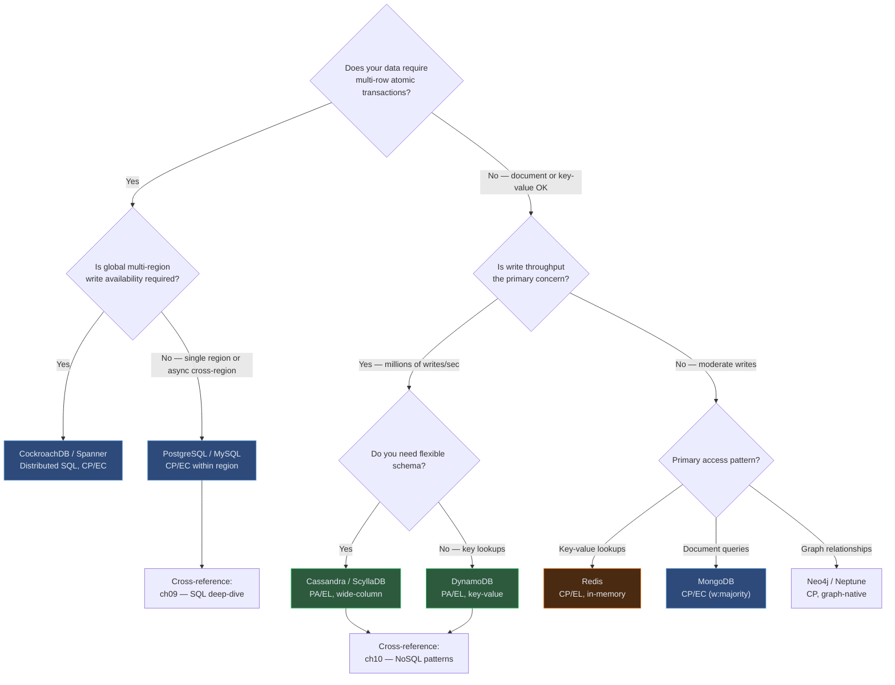

### Quick Reference: Requirements → Choice

| Requirement | CAP/PACELC Target | Recommended Systems |
|---|---|---|
| Financial transactions, strict ordering | CP / PC/EC | PostgreSQL, CockroachDB, Spanner |
| High-write global scale, tolerate stale reads | AP / PA/EL | Cassandra, DynamoDB |
| Session storage, caching | CP / PC/EL | Redis |
| Distributed coordination, leader election | CP / PC/EC | etcd, ZooKeeper |
| Flexible schema, document model | CP / PC/EC | MongoDB (w:majority) |
| Real-time analytics, time-series | AP / PA/EL | Cassandra, ClickHouse |
| Multi-region active-active writes | AP / PA/EL | DynamoDB global tables, Cassandra |

> **Cross-references:** SQL internals (isolation levels, MVCC) → [Chapter 9 — SQL Databases](../part-2-building-blocks/ch09-databases-sql). NoSQL trade-offs by data model → [Chapter 10 — NoSQL Databases](../part-2-building-blocks/ch10-databases-nosql).

---

## PACELC in Practice: Real-World Decisions

### Case 1: Cassandra — PA/EL by Design

Cassandra's tunable consistency (`ONE`, `QUORUM`, `ALL`) lets operators slide along the PACELC spectrum per operation:

| Consistency Level | P Behavior | E Behavior | Use Case |
|---|---|---|---|
| `ONE` | AP — serve from nearest node | EL — lowest latency, stale possible | User preference reads, analytics |
| `QUORUM` | CP/AP hybrid — majority confirms | EL/EC hybrid | Balanced: most application reads |
| `LOCAL_QUORUM` | Quorum within one datacenter only | Lower cross-DC latency | Multi-region with regional isolation |
| `ALL` | CP — all replicas must confirm | EC — highest consistency | Rarely used; kills availability |

**Lesson:** Even a single database can occupy different PACELC positions depending on configuration. Understand the knobs, not just the label.

### Case 2: DynamoDB — PA/EL with Optional EC

DynamoDB's default reads are eventually consistent (PA/EL). Strongly consistent reads (`ConsistentRead: true`) shift it to PA/EC — you pay 2× read capacity units and ~1–2ms higher latency for guarantee that you see the latest write.

**When to pay for strong consistency in DynamoDB:**
- Inventory checks before deduction
- Financial balance reads before debit
- Idempotency key lookups (to prevent duplicate processing)

**When to accept eventual consistency:**
- Product catalog reads (stale by minutes is acceptable)
- User profile reads (eventual convergence is fine)
- Leaderboards and counters (approximate values are acceptable)

### Case 3: CockroachDB — PC/EC for Global SQL

CockroachDB targets the PC/EC quadrant — consistency both during partitions and in normal operation. It achieves this via **Raft consensus** per range (sharded key range), adding ~2–10ms to writes depending on replica placement.

**Trade-off made explicit:** A write to a CockroachDB row in us-east1 that has replicas in eu-west1 and ap-southeast1 must wait for 2 of 3 replicas to confirm — paying cross-ocean latency for every write. In exchange, any replica can answer any read with fully consistent data. This is the right trade-off for global financial applications; it is the wrong trade-off for a high-volume social media feed.

### Connecting PACELC to Interview Answers

When asked "what database would you use for X?" in a system design interview, structure your answer around PACELC:

```
1. State the requirement: "This is a [financial/social/analytics] use case"
2. Name the trade-off: "We need [strong consistency / low latency / high availability]"
3. Pick the PACELC quadrant: "So we want a [PC/EC / PA/EL] system"
4. Name the database: "That leads us to [PostgreSQL / Cassandra / DynamoDB]"
5. Acknowledge the cost: "The trade-off we accept is [higher write latency / stale reads]"
```

This structure shows the interviewer you understand the *why* behind the database choice, not just the name.

---

## Tail Latencies & Why Averages Lie

### The Problem with Averages

Average (mean) response time is one of the most misleading metrics in systems engineering. A service
reporting "average latency: 50ms" sounds healthy — but that average can hide a small percentage of
requests that take seconds. Those slow requests represent real users having a terrible experience.

**Percentile vocabulary:**

| Percentile | Notation | Meaning | Who it describes |
|---|---|---|---|
| 50th | p50 | Half of requests are faster than this | The "typical" user — median experience |
| 90th | p90 | 90% of requests are faster than this | Most users are fine; 10% see worse |
| 95th | p95 | 95% of requests are faster than this | The SLA threshold for many APIs |
| 99th | p99 | 99% of requests are faster than this | 1 in 100 requests is at least this slow |
| 99.9th | p999 | 99.9% of requests are faster than this | 1 in 1,000 — "the worst of the worst" |

**Concrete example:** A payment service with these latency numbers:

| Percentile | Latency |
|---|---|
| p50 | 45ms |
| p90 | 120ms |
| p95 | 380ms |
| p99 | 2,100ms |
| p999 | 8,400ms |

The average is ~55ms. Dashboards look green. But 1% of users — at 10,000 requests per second, that is
100 users every second — wait over 2 seconds. At p999, one user per second waits 8.4 seconds. At payment
checkout, that is an abandoned transaction, a support ticket, or a chargeback.

> **Why this matters for SLAs:** Service-level agreements written against averages are easily gamed.
> Agreements written against p99 or p999 reflect the actual worst-case user experience. Always negotiate
> and monitor SLAs at the tail.

---

### Fan-Out Latency Amplification

Microservices and service-oriented architectures introduce a subtle but severe latency problem: when
Service A must call multiple downstream services to compose a response, the tail latency of the composite
call is determined by the **slowest** downstream — not the average.

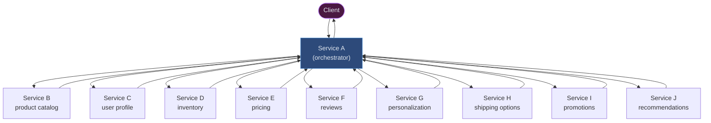

**The math:** If each downstream service has a p99 latency of 10ms, what is the probability that at
least one of the 10 services exceeds its p99 when Service A calls all 10 in parallel?

```
P(at least one slow) = 1 - P(all fast)
                     = 1 - (1 - 0.01)^N
                     = 1 - 0.99^N
```

| Fan-out (N) | Formula | P(at least one exceeds p99) |
|---|---|---|
| N = 1 | 1 - 0.99^1 | 1.0% |
| N = 5 | 1 - 0.99^5 | 4.9% |
| N = 10 | 1 - 0.99^10 | 9.6% |
| N = 20 | 1 - 0.99^20 | 18.2% |
| N = 50 | 1 - 0.99^50 | 39.5% |
| N = 100 | 1 - 0.99^100 | 63.4% |

**The implication:** A service calling 10 downstream dependencies in parallel — completely normal in
microservices — will experience p99-level latency on nearly 10% of all requests, even if every downstream
is individually healthy. Call 50 services and you hit a tail event 40% of the time. Call 100 and you
are in tail territory more often than not.

> **This is why microservices architectures see p99 blow up.** Each added dependency multiplies the
> surface area for tail events. A monolith with in-process calls has no network hops to contribute
> tail latency. A microservices system with 10 services is statistically guaranteed to surface tail
> events on nearly every tenth request.

---

### Measuring & Managing Tail Latencies

#### Accurate Measurement: HDR Histogram

Standard metrics systems (StatsD, Prometheus) often use approximate percentile algorithms that are
fast but lose precision in the tails — exactly where accuracy matters most. **HDR Histogram
(High Dynamic Range Histogram)** records latency at full precision across a wide range with constant
memory, making p99 and p999 measurements trustworthy.

- Drop-in libraries for Java, Go, Python, Rust, and others
- Captures values from 1 microsecond to 1 hour in a single data structure
- Used internally at LinkedIn, Netflix, and most high-scale systems that take tail latencies seriously

#### Hedged Requests

A hedged request sends a duplicate request to a second replica after a short timeout and uses
whichever response arrives first. This trades a small increase in system load (~5–10% extra requests)
for a dramatic reduction in tail latency.

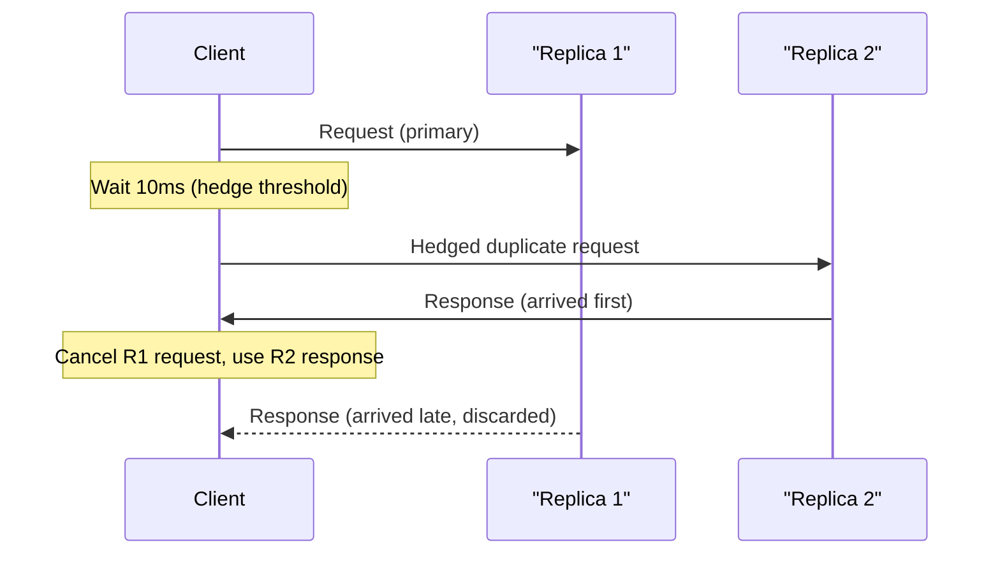

**When to use hedging:** Read-heavy workloads where idempotency is guaranteed (reads, cache lookups).
Not suitable for non-idempotent writes without careful deduplication.

**Google's finding:** Hedging at the 95th percentile threshold reduced p999 latency by up to 40× in
their large-scale storage systems (described in "The Tail at Scale", Dean & Barroso, 2013).

#### Tail-at-Scale Mitigations

| Technique | How it helps | Trade-off |
|---|---|---|
| **Hedged requests** | Duplicate request to second replica after threshold | +5–10% load; requires idempotency |
| **Request coalescing** | Merge identical concurrent requests into one upstream call | Slight latency increase for early arrivals |
| **Aggressive caching** | Serve from memory, eliminate downstream fan-out entirely | Stale data risk; cache invalidation complexity |
| **Timeout budgets** | Propagate remaining deadline via context; cancel work when budget exhausted | Requires distributed context propagation |
| **Graceful degradation** | Return partial response if non-critical services are slow | Application must handle incomplete responses |
| **Circuit breakers** | Stop calling a slow/failing service; return fallback immediately | May serve stale or empty data |
| **Load shedding** | Reject low-priority requests under heavy load to protect capacity | Requires priority classification |

---

### Queuing Theory Basics

#### Little's Law

The most important equation in capacity planning:

```
L = λ × W
```

- **L** = average number of requests in the system (queue + being processed)
- **λ** = average arrival rate (requests per second)
- **W** = average time a request spends in the system (latency)

**Example:** Your service processes 500 req/s (λ = 500). Observed average latency is 200ms (W = 0.2s).
Little's Law tells you there are L = 500 × 0.2 = **100 concurrent requests** in flight at steady state.
If your thread pool has only 80 threads, you have a problem.

**Rearranged for capacity planning:**
- To halve latency (W), either halve concurrency (L) or double processing rate (λ)
- To handle 2× traffic at the same latency, you need 2× processing capacity

#### Why Utilization Drives Latency to Infinity

As a system's utilization approaches 100%, queuing latency does not increase linearly — it explodes.
This is the fundamental result from **M/M/1 queueing theory**:

```
W_queue = (ρ / (1 - ρ)) × (1/μ)
```

Where ρ = utilization (0 to 1) and μ = service rate. As ρ → 1, W_queue → ∞.

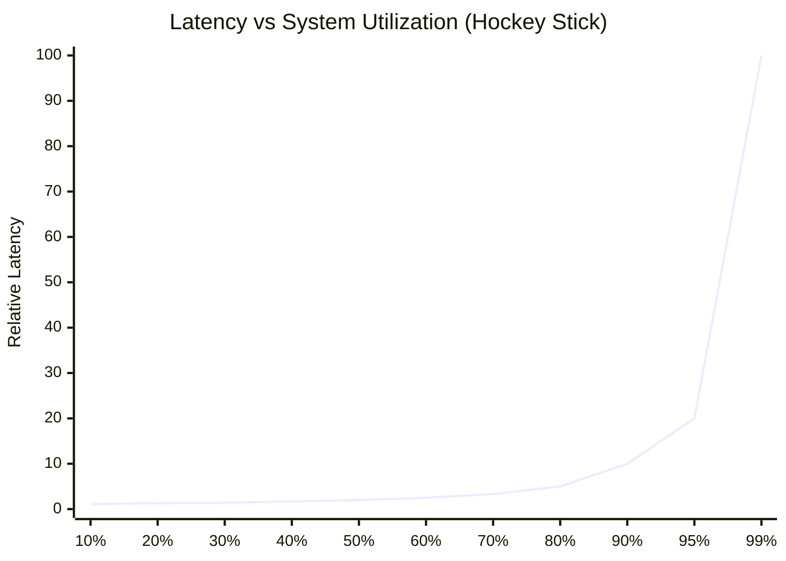

| Utilization | Relative Latency | Interpretation |
|---|---|---|
| 50% | 2× baseline | Comfortable headroom |
| 70% | 3.3× baseline | Acceptable for most systems |
| 80% | 5× baseline | Starting to feel pressure |
| 90% | 10× baseline | Danger zone — tail latency severe |
| 95% | 20× baseline | Crisis — user-visible degradation |
| 99% | 100× baseline | System effectively unusable |

> **Rule of thumb:** Keep steady-state utilization below 70% to preserve headroom for traffic spikes
> and tail latency stability. A system running at 90% utilization during normal hours will collapse
> during any traffic spike — the hockey stick curve ensures it.

**Connecting back to fan-out:** Each downstream service in your call graph has its own utilization level.
A service at 85% utilization contributes 7× baseline latency to every fan-out call that reaches it —
and with 10-service fan-out, you are nearly certain to hit one of them on every request.

---

## Related Chapters

| Chapter | Relevance |
|---------|-----------|
| [Ch09 — SQL Databases](/system-design/part-2-building-blocks/ch09-databases-sql) | PACELC/consistency models applied to SQL replication |
| [Ch10 — NoSQL Databases](/system-design/part-2-building-blocks/ch10-databases-nosql) | CAP theorem in practice: eventual vs strong consistency |
| [Ch15 — Replication & Consistency](/system-design/part-3-architecture-patterns/ch15-data-replication-consistency) | Deep dive into consistency models from trade-offs here |
| [Ch02 — Scalability](/system-design/part-1-fundamentals/ch02-scalability) | Applying trade-offs to scale decisions |

---

## Practice Questions

### Beginner

1. **CAP Analysis:** A startup is building a collaborative document editor (like Google Docs) for 1M users. During a network partition, should users be able to continue editing with their changes saved locally (risking conflicts on merge), or should editing be blocked until the partition heals? Which CAP trade-off does each option represent, and which would you choose?

   <details>
   <summary>Hint</summary>
   Blocking = CP (consistency over availability); allowing local edits = AP (availability over consistency) — consider how often partitions occur vs. how disruptive blocking the UI would be.
   </details>

2. **Consistency Models:** Your team is building a distributed counter for tracking the number of active users online (displayed in a UI as "1,234 users online"). Which consistency model would you choose — strong, causal, or eventual? Justify your answer considering both correctness requirements and the performance cost at 50M concurrent users.

   <details>
   <summary>Hint</summary>
   Ask whether being off by a few hundred users for a few seconds matters — if not, eventual consistency with a CRDT or approximate counter avoids expensive coordination.
   </details>

### Intermediate

3. **ACID vs BASE:** An e-commerce platform stores its shopping cart in DynamoDB (AP/eventual consistency) and its order processing in PostgreSQL (ACID). A customer adds an item to their cart on Node A, but their checkout request hits Node B before replication completes. Describe what happens and how you would handle this at the application layer to prevent overselling inventory.

   <details>
   <summary>Hint</summary>
   The cart read may be stale (BASE); the fix is to re-validate cart contents against the source of truth (SQL) at checkout time, not at add-to-cart time.
   </details>

4. **Availability Patterns:** A payment processing service uses active-passive failover with a 30-second health check interval. The SLA requires 99.99% uptime (~52 min downtime/year). During a recent incident, failover took 45 seconds. Calculate whether this meets the SLA, and propose a specific architecture change to reduce failover time to under 5 seconds.

   <details>
   <summary>Hint</summary>
   One 45-second outage uses 86% of the annual error budget; consider active-active with a consensus protocol (Raft/Paxos) to eliminate the detection-then-promote delay.
   </details>

### Advanced

5. **Latency vs Throughput:** You are designing an event ingestion pipeline for IoT sensors sending temperature readings every second. The system receives 100,000 sensor readings per second. Option A writes each reading to the database immediately (2ms per write). Option B batches 500 readings and writes every 500ms (50ms per batch). Calculate the throughput and per-reading latency for each option. Which would you choose for a real-time alerting system vs. a billing system, and why does the use case change the answer?

   <details>
   <summary>Hint</summary>
   Option A needs 200,000 write ops/s (100K × 2ms); Option B needs 200 ops/s at the cost of 500ms end-to-end latency — map each latency profile to the tolerance of the downstream consumer.
   </details>

---

## Further Reading

- [Chapter 1: Introduction to System Design](./ch01-introduction-to-system-design) — foundational distributed systems concepts
- [Chapter 16: Security & Reliability](../part-3-architecture-patterns/ch16-security-reliability) — CAP in practice for distributed rate limiting
- [Chapter 6: Load Balancing](../part-2-building-blocks/ch06-load-balancing) — consistency techniques for partitioned systems
- **External:** [Brewer's CAP Theorem (2000)](https://www.cs.berkeley.edu/~brewer/cs262b-2004/PODC-keynote.pdf) — original keynote
- **External:** [Dynamo: Amazon's Highly Available Key-Value Store (2007)](https://www.allthingsdistributed.com/files/amazon-dynamo-sosp2007.pdf) — AP system design in detail
- **External:** [Spanner: Google's Globally Distributed Database (2012)](https://research.google/pubs/pub39966/) — CP at planetary scale
