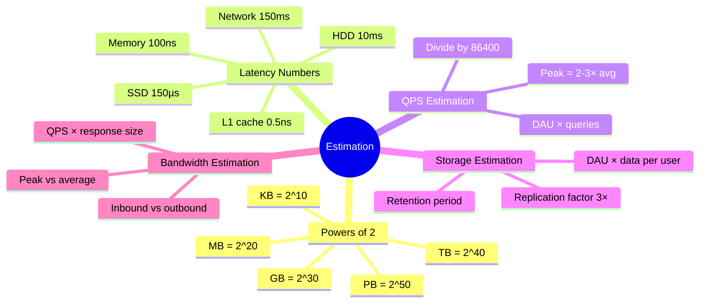
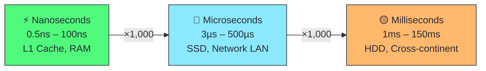
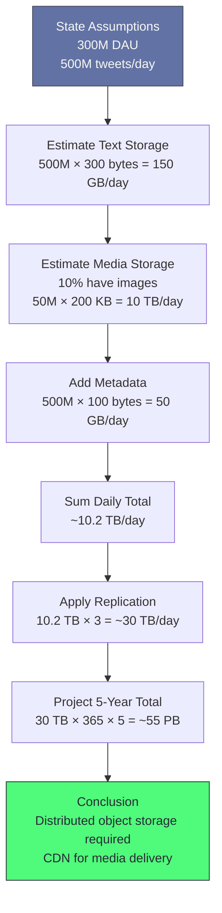
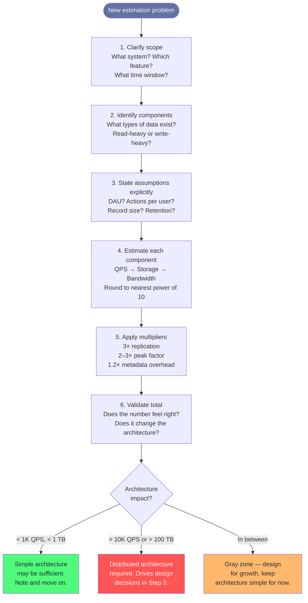
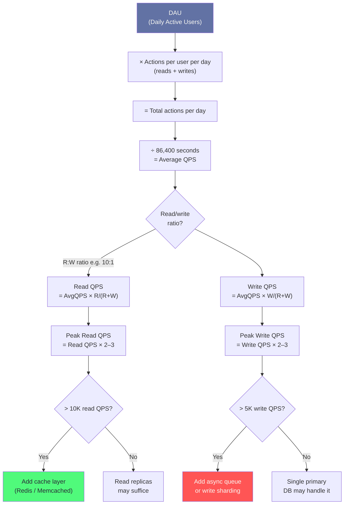
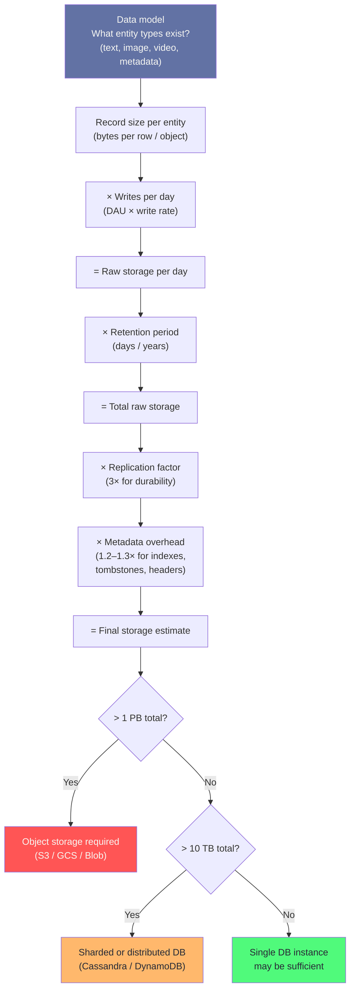
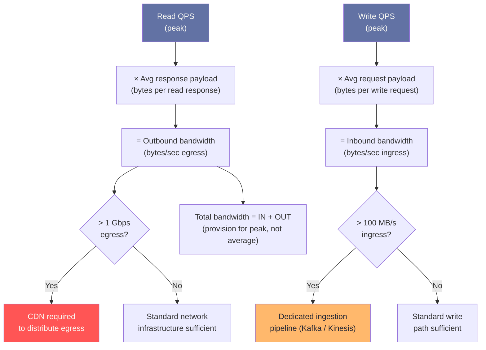

# Chapter 4: Back-of-Envelope Estimation


## Mind Map



## Overview

Back-of-envelope estimation is the art of quickly approximating the scale of a system using simple math and a handful of memorized reference numbers. Before investing hours designing a distributed database, you should spend five minutes confirming that your design is even necessary — or whether a single Postgres instance will handle the load just fine.

This chapter is a **reference chapter**. Return to it every time you start a new system design problem. The numbers here feed directly into every case study in Part 4.

As described in [Chapter 3 — Core Trade-offs](/system-design/part-1-fundamentals/ch03-core-tradeoffs), estimation is Step 2 of the interview framework: you clarify requirements, then you **estimate scale** before drawing a single box.

> **Why interviewers care:** Estimation reveals whether you think at system scale or algorithm scale. An engineer who says "we'll need about 150 TB/day of storage for media" is thinking like a systems engineer. One who says "it depends" is not.

---

## Why Estimation Matters

### 1. Validates Design Feasibility

A 30-second calculation can prevent 30 minutes of wasted design. If your estimated QPS is 50, you do not need sharding. If it is 500,000, you do.

### 2. Guides Architecture Decisions

| Estimated QPS | Implication |
|--------------|-------------|
| < 1,000 | Single server, vertical scaling |
| 1,000 – 10,000 | Load balancer + a few app servers |
| 10,000 – 100,000 | Caching layer mandatory, read replicas |
| 100,000+ | Horizontal sharding, CDN, async processing |

### 3. Prevents Over/Under-Engineering

- **Under-engineering:** Building a single-server app for a system that needs to handle 50,000 QPS — system crashes on day one.
- **Over-engineering:** Deploying a 20-node Kafka cluster for a system with 100 users/day — wasted cost and complexity.

---

## Powers of 2 — Reference Table

Everything in computing is binary. These are the numbers you must know without thinking.

| Power | Exact Value | Approximate | Storage Name |
|-------|------------|-------------|--------------|
| 2^10 | 1,024 | ~1 Thousand | 1 KB |
| 2^20 | 1,048,576 | ~1 Million | 1 MB |
| 2^30 | 1,073,741,824 | ~1 Billion | 1 GB |
| 2^40 | 1,099,511,627,776 | ~1 Trillion | 1 TB |
| 2^50 | 1,125,899,906,842,624 | ~1 Quadrillion | 1 PB |

**Practical shortcuts:**
- 1 KB = 1,000 bytes (close enough for estimates)
- 1 MB = 1,000 KB = 1 million bytes
- 1 GB = 1,000 MB = 1 billion bytes
- 1 TB = 1,000 GB = 1 trillion bytes
- 1 PB = 1,000 TB — think "Netflix stores ~1 PB of video per day"

**Memory aid:** Each step multiplies by 1,000 (roughly). Going KB → MB → GB → TB → PB is ×1,000 each time.

---

## Latency Numbers Every Programmer Should Know

Originally published by Jeff Dean (Google). These numbers are approximate but stable enough for estimates. Memorize the order of magnitude, not the exact value.

| Operation | Latency | Notes |
|-----------|---------|-------|
| L1 cache reference | 0.5 ns | Fastest memory access |
| Branch mispredict | 5 ns | CPU pipeline flush |
| L2 cache reference | 7 ns | 14× slower than L1 |
| Mutex lock/unlock | 100 ns | Contended lock cost |
| Main memory reference | 100 ns | DRAM access |
| Compress 1 KB (Snappy) | 3 µs | 3,000 ns |
| Send 1 KB over 1 Gbps network | 10 µs | Local network |
| Read 4 KB randomly from SSD | 150 µs | Random I/O is expensive |
| Read 1 MB sequentially from memory | 250 µs | Sequential is fast |
| Round trip within same datacenter | 500 µs | Intra-DC latency |
| Read 1 MB sequentially from SSD | 1 ms | 1,000 µs |
| HDD seek | 10 ms | Mechanical seek time |
| Read 1 MB sequentially from HDD | 20 ms | Sequential but slow disk |
| Send packet CA → Netherlands → CA | 150 ms | Cross-continent RTT |

### Latency Scale Visualization



### Key Takeaways from the Latency Table

1. **Memory is 200× faster than SSD** for random reads (100 ns vs 20,000 ns)
2. **SSD is 1,000× faster than HDD** for random reads (150 µs vs 10 ms HDD seek + read)
3. **Avoid network round trips** inside hot code paths — even intra-DC costs 500 µs
4. **Sequential access beats random access** by 10–100× on both SSD and HDD
5. **Cross-continent latency is irreducible** — physics sets a floor of ~100 ms

---

## QPS (Queries Per Second) Estimation

### Formula

```
Average QPS = DAU × Average Queries Per User Per Day ÷ 86,400
Peak QPS    = Average QPS × 2 to 3
```

Where:
- **DAU** = Daily Active Users
- **86,400** = seconds per day (60 × 60 × 24)
- **Peak multiplier** = 2–3× accounts for traffic spikes (evening peak, viral events)

### Worked Example: Twitter Read QPS

**Assumptions:**
- 300 million DAU
- Each user reads their timeline ~10 times per day
- Average of 20 tweets shown per timeline load

**Calculation:**
```
Timeline loads per day = 300M × 10 = 3 billion
Reads per second (avg) = 3,000,000,000 ÷ 86,400 ≈ 34,700 QPS
Peak QPS               = 34,700 × 3 ≈ 100,000 QPS
```

**What this tells us:** Twitter needs to serve ~100,000 read QPS at peak. This immediately implies caching is mandatory — no database can handle 100K QPS on live queries without a cache layer in front of it.

### Quick QPS Conversions

| Requests Per Day | Approx QPS |
|-----------------|-----------|
| 1 million/day | ~12 QPS |
| 10 million/day | ~116 QPS |
| 100 million/day | ~1,160 QPS |
| 1 billion/day | ~11,600 QPS |
| 10 billion/day | ~115,700 QPS |

**Memory shortcut:** 1 million requests/day ≈ 12 QPS. Scale linearly from there.

---

## Storage Estimation

### Formula

```
Daily Storage = DAU × Data Generated Per User Per Day
Total Storage = Daily Storage × Retention Period (days)
With Replication = Total Storage × Replication Factor (3×)
```

### Data Size Reference

| Data Type | Typical Size |
|-----------|-------------|
| Tweet / short text post | 280 chars ≈ 300 bytes |
| User metadata record | ~1 KB |
| Profile photo (thumbnail) | ~10 KB |
| Photo (compressed JPEG) | ~200 KB – 2 MB |
| Short video (1 min, 720p) | ~50 MB |
| Video (1 hour, 1080p) | ~2 GB |

### Worked Example: Instagram Photo Storage

**Assumptions:**
- 500 million DAU
- 10% of users post one photo per day = 50 million photos/day
- Average photo size after compression: 300 KB
- Thumbnails generated: 3 sizes × 20 KB = 60 KB per photo
- Metadata per photo: 1 KB

**Calculation:**
```
Photo data/day  = 50M × 300 KB  = 15,000,000,000 KB = ~15 TB/day
Thumbnail data  = 50M × 60 KB   = 3,000,000,000 KB  = ~3 TB/day
Metadata/day    = 50M × 1 KB    = 50,000,000 KB      = ~50 GB/day

Total raw/day   ≈ 18 TB/day
With 3× replication = 54 TB/day
5-year total    = 18 TB × 365 × 5 × 3 = ~100 PB
```

**What this tells us:** Instagram-scale photo storage demands dedicated object storage (S3-equivalent), not block storage. At 100 PB over 5 years, the cost alone justifies aggressive compression and tiered storage strategies.

---

## Bandwidth Estimation

### Formula

```
Outbound Bandwidth = Read QPS × Average Response Size
Inbound Bandwidth  = Write QPS × Average Request Size
```

### Worked Example: Twitter Bandwidth

**Assumptions (continuing from QPS example above):**
- Read QPS: 34,700 (average), 100,000 (peak)
- Average timeline response: 20 tweets × 300 bytes = 6,000 bytes = ~6 KB

**Calculation:**
```
Average outbound = 34,700 QPS × 6 KB  = 208,200 KB/s ≈ 200 MB/s
Peak outbound    = 100,000 QPS × 6 KB = 600,000 KB/s ≈ 600 MB/s
```

**What this tells us:** At 600 MB/s peak egress, Twitter's network infrastructure must handle ~5 Gbps of outbound traffic from timeline endpoints alone. CDN caching of popular content is essential to reduce origin server load.

---

## Worked Example: Twitter Storage Estimation (Full Walkthrough)

This step-by-step walkthrough shows how to chain assumptions into a complete estimate.

### Estimation Process



### Step-by-Step Calculation

**Step 1: State assumptions clearly**
- Daily Active Users (DAU): 300 million
- Tweets posted per day: 500 million
- Average tweet: 280 characters of text + 100 bytes metadata = ~300 bytes total
- 10% of tweets contain one image (average 200 KB after compression)
- 1% of tweets contain a video (average 2 MB for short video)
- Data retained: 5 years

**Step 2: Text storage**
```
Text per day = 500M tweets × 300 bytes
             = 150,000,000,000 bytes
             = 150 GB/day
```

**Step 3: Image storage**
```
Tweets with images = 500M × 10%  = 50 million
Image storage/day  = 50M × 200 KB = 10,000,000,000 KB
                   = 10 TB/day
```

**Step 4: Video storage**
```
Tweets with video = 500M × 1%    = 5 million
Video storage/day = 5M × 2 MB    = 10,000,000 MB
                  = 10 TB/day
```

**Step 5: Metadata (user data, indexes, etc.)**
```
Metadata overhead ≈ 20% of total = ~4 TB/day (rough)
```

**Step 6: Sum daily total**
```
Text:     0.15 TB/day
Images:   10   TB/day
Video:    10   TB/day
Metadata:  4   TB/day
─────────────────────
Total:  ~24.15 TB/day ≈ 25 TB/day
```

**Step 7: Apply replication factor**
```
Storage with 3× replication = 25 TB × 3 = 75 TB/day
```

**Step 8: Project over 5 years**
```
5-year storage = 75 TB/day × 365 days × 5 years
               = 75 × 1,825
               = 136,875 TB
               ≈ 137 PB
```

**Conclusion:** Twitter needs approximately **137 petabytes** of storage over 5 years. This demands a distributed object storage system (like S3 or HDFS), not a relational database. Media delivery via CDN is mandatory — serving 20 TB/day of media from origin servers alone is not viable.

---

## Worked Example: YouTube Bandwidth Estimation

### Assumptions

- Monthly Active Users (MAU): 2 billion
- DAU ≈ 30% of MAU = 600 million
- Average videos watched per DAU per day: 5 videos
- Average video duration: 5 minutes
- Video quality: 720p at ~3 Mbps (megabits per second)
- Upload rate: 500 hours of video uploaded every minute

### Step-by-Step Calculation

**Step 1: Daily video watch hours**
```
Video views/day    = 600M DAU × 5 videos  = 3 billion views/day
Watch minutes/day  = 3B × 5 min           = 15 billion minutes/day
Watch hours/day    = 15B ÷ 60             = 250 million hours/day
```

**Step 2: Outbound bandwidth (streaming)**
```
Bandwidth per stream  = 3 Mbps = 3,000,000 bits/s
Concurrent viewers    = 250M hours/day ÷ 24 hours
                      = ~10.4M concurrent viewers (average)

Average outbound BW   = 10.4M × 3 Mbps
                      = 31.2 Tbps (terabits per second, average)

Peak outbound BW      = avg × 3 (peak hour multiplier)
                      ≈ 93 Tbps
```

**Step 3: Inbound bandwidth (uploads)**
```
Upload rate = 500 hours of video/minute
           = 500 × 60 minutes of video/minute
           = 30,000 minutes of video/minute

At 720p = 3 Mbps per stream:
Inbound BW = 30,000 min/min × 3 Mbps
           = 90,000 Mbps
           = 90 Gbps upload ingestion bandwidth
```

**Step 4: Storage for new uploads per day**
```
New video/day    = 500 hrs/min × 60 min/hr × 24 hrs
                 = 720,000 hours of video/day

At 720p (1.35 GB/hour raw, ~500 MB compressed):
Storage/day      = 720,000 hrs × 500 MB
                 = 360,000,000 MB
                 ≈ 360 PB/day of new video
```

**Conclusion:** YouTube's bandwidth requirements (~90 Tbps peak outbound) make it one of the largest consumers of internet bandwidth globally. At this scale, YouTube must operate its own CDN infrastructure (Google Global Cache), peering directly with ISPs. No third-party CDN can handle this volume cost-effectively.

---

## Common Estimation Mistakes

### 1. Forgetting Replication

Storage estimates are for raw data. In production, you replicate data 3× (minimum) for durability.

```
Raw storage: 10 TB
With 3× replication: 30 TB  ← always use this number for cost/capacity planning
```

### 2. Ignoring Metadata Overhead

Databases, file systems, and object stores all add metadata: indexes, checksums, tombstones, headers. Add **10–30%** overhead to any storage estimate.

### 3. Confusing Peak vs Average

Average QPS is what you calculate. But you must provision for **peak QPS** (2–3× average). A system that handles average load but crashes at peak is a failed design.

### 4. Confusing Bits and Bytes

Network bandwidth is measured in bits. Storage is measured in bytes.

```
1 Gbps network  = 1 gigabit per second
                = 125 megabytes per second (MB/s)
```

**Rule:** Divide bits by 8 to get bytes. When someone says "we have a 1 Gbps pipe," they mean ~125 MB/s of actual data throughput.

### 5. Ignoring Growth Rate

A system handling 1,000 QPS today may need to handle 10,000 QPS in 18 months. Always ask: **what is the expected growth rate?** Commonly 2–3× per year for fast-growing products.

### 6. Treating All Operations as Equal

A "write" to a database is not the same cost as a "read." Writes typically require quorum confirmation across replicas, making them 5–10× more expensive. Separate your read QPS from write QPS in estimates.

---

## Estimation Cheat Sheet

### QPS Quick Reference

| Requests Per Day | QPS |
|-----------------|-----|
| 100K/day | ~1 QPS |
| 1M/day | ~12 QPS |
| 10M/day | ~115 QPS |
| 100M/day | ~1,160 QPS |
| 1B/day | ~11,574 QPS |
| 10B/day | ~115,740 QPS |

### Bandwidth Quick Reference

| QPS × Response Size | Bandwidth |
|--------------------|-----------|
| 1,000 QPS × 1 KB | 1 MB/s |
| 10,000 QPS × 1 KB | 10 MB/s |
| 10,000 QPS × 100 KB | 1 GB/s |
| 100,000 QPS × 1 KB | 100 MB/s |

### Storage Quick Reference

| Daily | Monthly | Yearly | 5-Year |
|-------|---------|--------|--------|
| 1 GB/day | ~30 GB | ~365 GB | ~1.8 TB |
| 100 GB/day | ~3 TB | ~36 TB | ~182 TB |
| 1 TB/day | ~30 TB | ~365 TB | ~1.8 PB |
| 10 TB/day | ~300 TB | ~3.6 PB | ~18 PB |

### Multiplication Shortcuts

- **×1,000** = KB → MB → GB → TB → PB
- **÷86,400** = requests/day → QPS (or use ÷100,000 for a fast rough estimate)
- **×3** = raw storage → replicated storage
- **×2–3** = average QPS → peak QPS
- **÷8** = bits → bytes (for network bandwidth)
- **×1.2–1.3** = add metadata overhead to storage

---

> **Key Takeaway:** Back-of-envelope estimation is a practiced skill, not a talent. Memorize the reference tables, internalize the formulas, and practice on real systems. The goal is not precision — it is **order-of-magnitude correctness** that guides architectural decisions.

---

## Estimation Process Diagrams

The following diagrams show the process and calculation trees for the four core estimation types. Use them as a repeatable mental model for every new problem.

### How to Approach Any Estimation Problem



### QPS Estimation Tree

Start from DAU and decompose into per-service query rates.



### Storage Estimation Tree



### Bandwidth Estimation Tree



---

## Related Chapters

| Chapter | Relevance |
|---------|-----------|
| [Ch02 — Scalability](/system-design/part-1-fundamentals/ch02-scalability) | Estimation feeds directly into scalability planning |
| [Ch25 — Interview Framework](/system-design/part-5-modern-mastery/ch25-interview-framework-cheat-sheets) | Estimation is Step 2 of the 4-step interview framework |
| [Ch18 — URL Shortener](/system-design/part-4-case-studies/ch18-url-shortener-pastebin) | Classic estimation walkthrough: QPS, storage, bandwidth |

---

## Practice Questions

Attempt each estimate before reading the hint. Write your assumptions explicitly before calculating.

### Beginner

1. **Instagram Storage Estimation:** Estimate how much new storage Instagram requires per year, given ~500M DAU. State all assumptions (posting rate, photo/video mix, average file sizes, replication factor) before calculating. What is the monthly storage growth in petabytes?

   <details>
   <summary>Hint</summary>
   Assume ~5% of DAU post daily; photos average 3 MB, videos average 50 MB; use a 3× replication factor and roughly 20/80 photo-to-video mix for posted content.
   </details>

### Intermediate

2. **Uber Peak QPS Estimation:** Estimate Uber's peak QPS for ride-related API calls during rush hour (5 PM Friday) in a major metro. Uber completes ~15M rides globally per day. Account for location updates, matching calls, and payment events per ride, then apply a realistic peak-to-average multiplier.

   <details>
   <summary>Hint</summary>
   A single ride generates ~100 API calls spread over 20 minutes; peak hour sees ~3× daily average; remember global vs. metro scope if the question narrows to one city.
   </details>

3. **WhatsApp Message Throughput:** Estimate the peak message throughput WhatsApp must handle globally. WhatsApp has ~2B MAU. State assumptions for DAU conversion rate, messages per active user per day, and delivery receipt overhead, then calculate peak QPS.

   <details>
   <summary>Hint</summary>
   Each message generates at minimum 2 events (sent + delivered receipt); apply the standard 2–3× peak multiplier over the daily average QPS.
   </details>

4. **Netflix Bandwidth Estimation:** Estimate Netflix's total outbound bandwidth during peak evening hours (~8 PM local time). ~200M subscribers globally; assume 10% concurrently streaming. Use a blended bitrate of 3 Mbps across quality tiers. Express the answer in Tbps and compare to known internet backbone capacities.

   <details>
   <summary>Hint</summary>
   20M concurrent streams × 3 Mbps = X Tbps; to sanity-check, recall that Netflix has historically been cited as ~15% of global internet traffic during peak.
   </details>

### Advanced

5. **Google Search Index Size:** Estimate the storage required for Google's web search index. The crawled web has roughly 5–10B pages. Account for compressed HTML storage, extracted inverted index structures (roughly 3× raw data), PageRank scores, and the number of historical versions and replicas Google maintains for durability and query serving.

   <details>
   <summary>Hint</summary>
   Start with raw page size (~10 KB compressed), multiply by index amplification factor and replica count; the answer should land in the tens-of-exabytes range and can be cross-checked against Google's reported data center capacity.
   </details>
