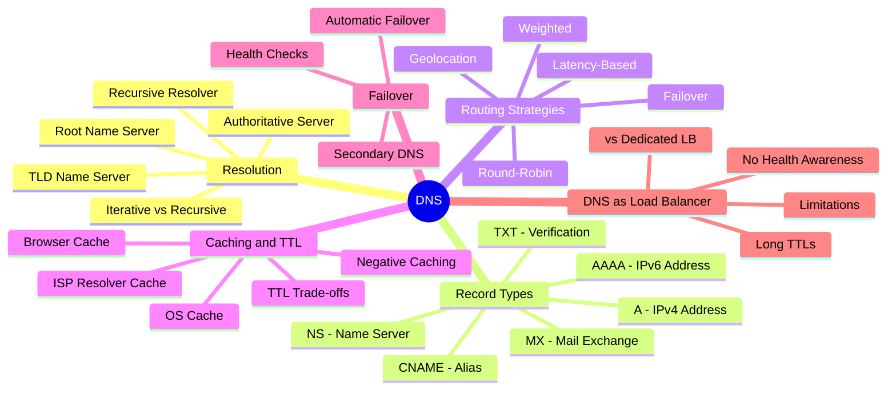
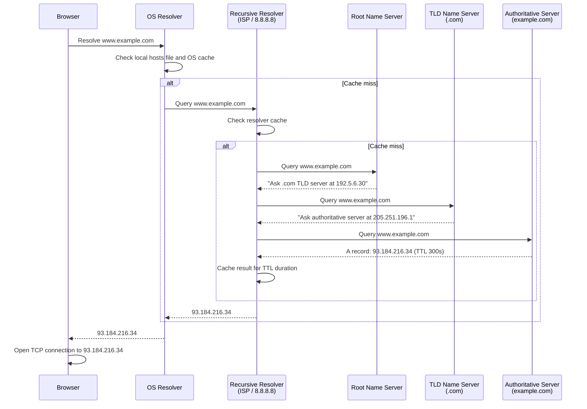
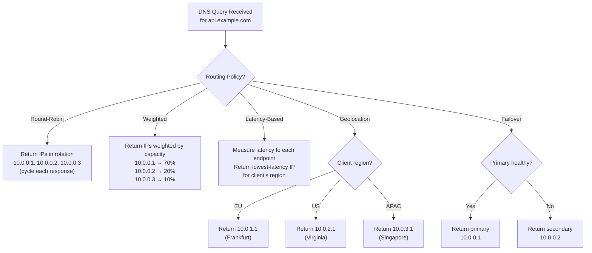
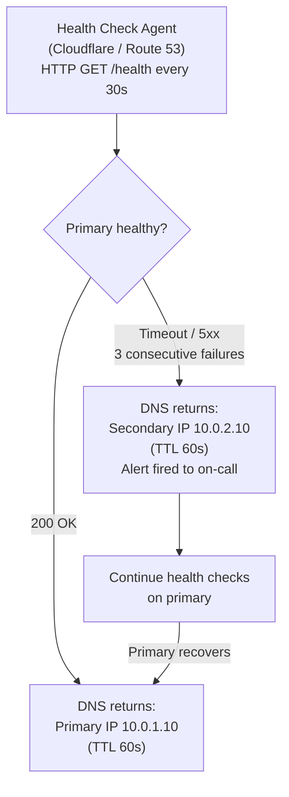

# Chapter 5: DNS


## Mind Map



## Overview

DNS (Domain Name System) is the internet's distributed phone book. It translates human-readable hostnames like `api.example.com` into machine-routable IP addresses like `93.184.216.34`. Without DNS, every user would need to memorize IP addresses for every service — impractical at internet scale.

DNS is also one of the most underappreciated load balancing and traffic routing tools in a system designer's toolkit. Every major platform — Cloudflare, AWS, Google — uses DNS routing as the first layer of global traffic management, before a single packet reaches an application server.

This chapter covers how DNS resolution works, the record types you need to know, DNS-based routing strategies, caching and TTL trade-offs, and when DNS is sufficient as a load balancer versus when you need a dedicated solution. See [Chapter 6](/system-design/part-2-building-blocks/ch06-load-balancing) for application-layer load balancing.

---

## How DNS Works

DNS resolution is a hierarchical, distributed lookup process. When a browser resolves `www.example.com` for the first time, it traverses the DNS hierarchy from root to authoritative server.



### The Four Components

**Root name servers** are the top of the DNS hierarchy. There are 13 logical root server addresses (A through M), operated by different organizations globally, with hundreds of physical instances using anycast routing. They do not know IP addresses — they only know which TLD server to ask next.

**TLD name servers** handle top-level domains (.com, .org, .io, .uk). ICANN delegates management of each TLD to a registry operator. The .com TLD is operated by Verisign and manages ~160 million domain names.

**Authoritative name servers** are the final authority for a specific domain. They hold the actual DNS records and return the final answer. When you purchase `example.com` and configure records in AWS Route 53, Route 53 becomes the authoritative server for your domain.

**Recursive resolvers** (also called caching resolvers or recursive DNS servers) do the work on behalf of the client. Your ISP provides one, and public alternatives include Google (8.8.8.8), Cloudflare (1.1.1.1), and Quad9 (9.9.9.9). The resolver queries each level of the hierarchy, caches responses according to TTL, and returns the final answer to the client.

---

## DNS Record Types

| Record | Full Name | Purpose | Example |
|---|---|---|---|
| **A** | Address | Maps hostname to IPv4 address | `api.example.com → 93.184.216.34` |
| **AAAA** | IPv6 Address | Maps hostname to IPv6 address | `api.example.com → 2606:2800:220:1:248:1893:25c8:1946` |
| **CNAME** | Canonical Name | Alias to another hostname | `www.example.com → example.com` |
| **MX** | Mail Exchange | Email routing, with priority | `example.com → mail.google.com (priority 10)` |
| **NS** | Name Server | Delegates a zone to name servers | `example.com → ns1.awsdns.com` |
| **TXT** | Text | Arbitrary text; used for domain verification, SPF, DKIM | `example.com → "v=spf1 include:_spf.google.com ~all"` |
| **PTR** | Pointer | Reverse DNS — IP to hostname | `34.216.184.93.in-addr.arpa → api.example.com` |
| **SOA** | Start of Authority | Zone metadata (serial, refresh, TTL defaults) | Present in every DNS zone |

### CNAME Constraints

CNAME records cannot coexist with other records at the same name. Most critically, you **cannot** put a CNAME on your root domain (`example.com`) because the root must have an SOA and NS record. This is why DNS providers offer proprietary extensions: Route 53 ALIAS, Cloudflare CNAME flattening — these behave like CNAMEs but resolve at the authoritative server level, making them compatible with root domains.

---

## DNS Routing Strategies

Modern authoritative DNS servers can return different answers to the same query based on configurable routing policies. This makes DNS a powerful global traffic management layer.



### Round-Robin

The simplest strategy: the DNS server rotates through a list of IP addresses, returning them in sequence. Each DNS response contains the same set of IPs but in a different order — clients typically use the first IP in the list. This distributes load across multiple servers without any knowledge of server health or capacity.

**Limitation:** DNS round-robin is client-transparent — if a server fails, the DNS server has no way to stop returning its IP until a human removes it. Clients that cached the failed IP will continue attempting connections until TTL expires.

### Weighted Routing

Assign a weight to each endpoint. Higher-weight endpoints receive a proportionally larger share of traffic. Common uses: blue-green deployments (send 5% traffic to new version before full rollout), A/B testing, or proportional allocation to data centers with different capacities.

### Latency-Based Routing

The DNS resolver measures (or estimates) network latency from the client's region to each registered endpoint and returns the IP of the lowest-latency option. AWS Route 53 latency routing uses AWS regional measurements. This is the most effective strategy for minimizing global round-trip times — users in Tokyo automatically get routed to the Tokyo endpoint without any manual geo-mapping.

### Geolocation Routing

Route based on the geographic location of the DNS resolver (which approximates the client's location). Unlike latency-based routing, this is policy-driven rather than performance-driven. Use cases: data residency compliance (EU users must be served by EU servers), content localization, regulatory restrictions.

**Accuracy limitation:** Geolocation is determined by the resolver's IP, not the client's IP. Corporate VPNs and public DNS servers (8.8.8.8) can cause misclassification — a user in Berlin using 8.8.8.8 may resolve to a US-based endpoint.

### Failover Routing

Configure a primary endpoint and one or more secondary endpoints. DNS returns the primary's IP when health checks pass; if the primary fails health checks, DNS automatically returns the secondary's IP. This is the foundation of DNS-based disaster recovery.

---

## DNS Caching and TTL

DNS responses include a Time-To-Live (TTL) value in seconds. Resolvers cache the response and serve it from cache for subsequent queries until the TTL expires.

### Cache Hierarchy

```
Client Browser Cache  →  OS DNS Cache  →  ISP/Corporate Resolver Cache  →  Authoritative Server
  (seconds to hours)      (minutes)           (up to TTL)                  (always fresh)
```

1. **Browser cache:** Modern browsers maintain their own DNS cache. Chrome's DNS cache is separate from the OS cache and has its own expiry behavior.
2. **OS cache:** The operating system resolver (e.g., `nscd` on Linux, the Windows DNS Client service) caches responses for their TTL duration.
3. **ISP recursive resolver cache:** Your ISP's or configured resolver's cache is shared across all users using that resolver. A popular domain may be cached here for thousands of simultaneous users.
4. **Authoritative server:** Always has the current record but is only queried on a cache miss.

### TTL Trade-offs

| TTL | Propagation on Change | DNS Query Load | Recommendation |
|---|---|---|---|
| **30 seconds** | Very fast (~1 min) | High (frequent re-queries) | Pre-migration, active failover |
| **300 seconds (5 min)** | Fast (~5-10 min) | Moderate | Production default for dynamic services |
| **3600 seconds (1 hr)** | Slow (~1-2 hr) | Low | Stable records (MX, NS) |
| **86400 seconds (1 day)** | Very slow (~24+ hr) | Very low | Static records unlikely to change |

**Key insight:** Lower TTLs mean faster propagation but higher query volumes hitting your authoritative DNS servers. Cloudflare, AWS Route 53, and other managed DNS providers serve authoritative DNS from globally distributed anycast networks, making high-query-volume from low TTLs affordable. For self-hosted DNS, low TTLs can create load concerns.

**Pre-migration TTL reduction:** Before any IP change, lower TTL to 60–300 seconds 24–48 hours in advance. This ensures stale cached records expire quickly after the change. After migration stabilizes, raise TTL back to production values.

### Negative Caching

When a DNS query returns NXDOMAIN (domain does not exist), the resolver caches this negative response for the Negative TTL specified in the zone's SOA record. This prevents repeated queries for non-existent names but can delay propagation of new records if a name was queried before it existed.

---

## DNS Failover Patterns

DNS failover combines health checking with automatic routing changes to implement disaster recovery without manual intervention.

### How DNS Failover Works



**Typical configuration:**
- Health check interval: 30 seconds
- Failure threshold: 3 consecutive failures before failover (90 seconds to detect failure)
- TTL: 60 seconds (maximum time clients serve stale primary IP after failover)
- Total maximum failover time: ~2.5 minutes (90s detection + 60s TTL propagation)

### Multi-Region Failover

For large-scale deployments, DNS failover can be layered: primary region → secondary region → static maintenance page, with each tier having its own health check and TTL configuration.

---

## DNS as Load Balancer

DNS round-robin is frequently used as a simple, zero-cost load balancer. Understanding when it is sufficient — and when it is not — is a core system design competency.

### DNS Load Balancing: Capabilities and Gaps

| Capability | DNS Round-Robin | Dedicated Load Balancer |
|---|---|---|
| **Traffic distribution** | Yes (coarse-grained) | Yes (request-level granularity) |
| **Health awareness** | No (unless via health-check routing) | Yes (removes unhealthy backends immediately) |
| **SSL termination** | No | Yes |
| **Session persistence (sticky sessions)** | No | Yes (cookie-based, IP-based) |
| **Request-level routing** | No | Yes (path-based, header-based) |
| **Rate limiting** | No | Yes (at L7) |
| **Zero-downtime rolling deployments** | Difficult | Yes (drain connections before removal) |
| **Client-side caching of IPs** | Yes (cannot override) | N/A |
| **Cost** | Free / low | Moderate to high |

### When DNS Load Balancing Is Sufficient

- Distributing traffic across multiple independent data centers (coarse global routing)
- Microservice internal DNS-based service discovery (Kubernetes DNS, Consul)
- Simple active-passive failover with acceptable failover time (minutes)

### When You Need a Dedicated Load Balancer

- Health-aware routing that removes failed instances within seconds
- SSL/TLS termination and certificate management
- Request routing based on URL path, HTTP headers, or content
- Session persistence requirements
- Sub-second failover on backend failure

DNS and load balancers are complementary, not competing: DNS routes traffic to the correct data center or region; the load balancer distributes traffic across servers within that region.

---

## Real-World: How Cloudflare DNS Handles Billions of Queries

Cloudflare operates the world's fastest public DNS resolver (1.1.1.1) and manages authoritative DNS for millions of customer domains. As of 2024, Cloudflare handles over 1.2 trillion DNS queries per day.

**Anycast routing:** Cloudflare's entire infrastructure uses BGP anycast. The IP address `1.1.1.1` is announced from 300+ data centers worldwide. When your device queries `1.1.1.1`, the internet's routing infrastructure automatically directs the packet to the nearest Cloudflare PoP — not a specific server, but the nearest announcement point. This ensures sub-5ms latency for most of the world's internet users.

**Privacy-first design:** Standard DNS is unencrypted UDP — ISPs and network observers can see every domain you query. Cloudflare's 1.1.1.1 supports DNS-over-HTTPS (DoH) and DNS-over-TLS (DoT), encrypting queries. Cloudflare commits to deleting all query logs within 24 hours and undergoes annual audits by KPMG to verify this.

**Authoritative at the edge:** For customers using Cloudflare's authoritative DNS, queries are answered directly at the edge PoP — the authoritative and recursive resolver are co-located, eliminating the cross-internet round-trip to a customer's origin authoritative server.

**DNSSEC:** Cloudflare supports DNSSEC (DNS Security Extensions), which adds cryptographic signatures to DNS records. This prevents cache poisoning attacks (Kaminsky attack), where a malicious actor injects fake DNS responses to redirect traffic to attacker-controlled IPs.

---

> **Key Takeaway:** DNS is not just a phone book — it is a global traffic management layer. TTL controls propagation speed vs. query load trade-offs. DNS routing strategies (latency-based, geolocation, failover) provide coarse-grained traffic direction. For fine-grained routing, health-aware failover, and SSL termination, DNS must be paired with a dedicated load balancer (see [Chapter 6](/system-design/part-2-building-blocks/ch06-load-balancing)).

---

## Practice Questions

1. Your team is planning to migrate `api.example.com` from IP `10.0.1.10` to `10.0.2.10`. The current A record TTL is 24 hours. Walk through the migration process, including what you would do 48 hours before the cutover, at cutover, and after.

2. Explain the difference between latency-based and geolocation DNS routing. A global SaaS company wants EU users served by EU servers for GDPR compliance — which strategy should they use and why?

3. A startup is using DNS round-robin across three backend servers. One server crashes at 3 AM. How long will users experience errors? What architectural change would you make to eliminate this problem?

4. Why can't you put a CNAME record on a root domain (e.g., `example.com`)? What proprietary DNS features solve this limitation, and what trade-offs do they introduce?

5. Cloudflare uses anycast routing for `1.1.1.1`. Explain how anycast works at the BGP level and why it is superior to unicast for a globally distributed DNS resolver. What happens when a Cloudflare PoP goes offline?
