# Chapter 6: Load Balancing


## Mind Map

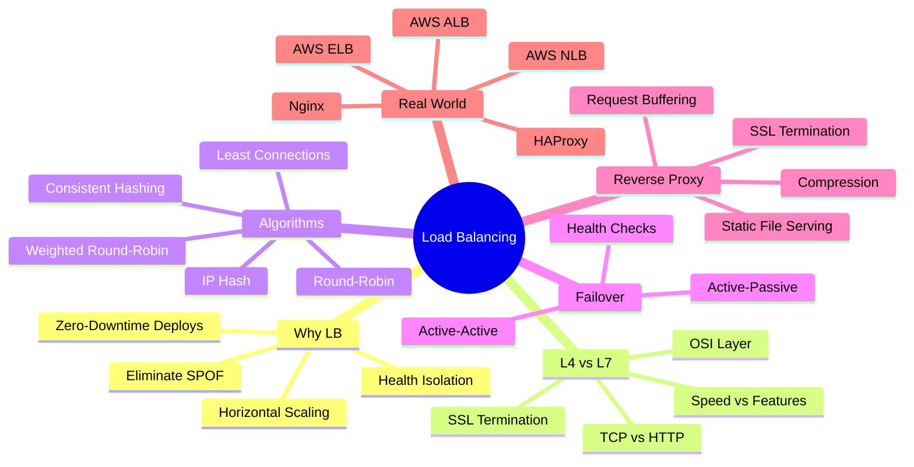

## Overview

A load balancer is the traffic director at the entry point of a distributed system. It accepts incoming connections and distributes them across a pool of backend servers, ensuring no single server is overwhelmed and that failed servers do not receive traffic.

Load balancing addresses three fundamental problems in distributed systems:

1. **Single Point of Failure (SPOF):** A single server, no matter how powerful, is one hardware failure away from a complete outage. A load balancer in front of multiple servers eliminates this SPOF at the application tier.
2. **Horizontal scalability:** Stateless application servers (see [Chapter 2: Scalability](/system-design/part-1-fundamentals/ch02-scalability)) can only be scaled horizontally if something distributes incoming requests across them.
3. **Health isolation:** Failed or degraded servers must be removed from rotation automatically. A load balancer continuously health-checks backends and drains traffic away from unhealthy instances.

Before diving in, understand the relationship between DNS and load balancers. DNS (covered in [Chapter 5](/system-design/part-2-building-blocks/ch05-dns)) handles global routing — directing users to the right data center. The load balancer handles distribution within a data center across backend servers. These are complementary, not competing layers.

---

## Why Load Balancing Matters

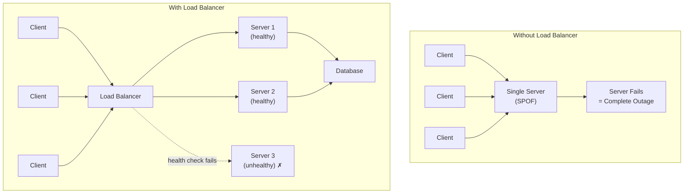

With a load balancer in front of multiple servers:

- A single server failure degrades capacity (e.g., from 3 servers to 2) but does not cause an outage
- Deployments can be rolled out one server at a time (rolling deployments) with zero downtime
- Traffic can be shifted away from a server for maintenance without client disruption
- Auto-scaling groups can add or remove servers dynamically; the load balancer automatically includes/excludes them

---

## L4 vs L7 Load Balancing

Load balancers operate at two distinct layers of the OSI model, each with different capabilities, performance characteristics, and use cases.

| Dimension | L4 (Transport Layer) | L7 (Application Layer) |
|---|---|---|
| **OSI Layer** | Layer 4 (TCP/UDP) | Layer 7 (HTTP/HTTPS) |
| **Packet inspection** | IP + port only | Full HTTP: URL, headers, cookies, body |
| **Routing decision** | TCP 4-tuple (src IP, src port, dst IP, dst port) | URL path, HTTP method, headers, host |
| **SSL termination** | Pass-through only (TLS passthrough) | Yes — offloads TLS from backends |
| **Content-based routing** | No | Yes — route `/api/*` to API servers, `/static/*` to file servers |
| **Performance** | Very fast — minimal processing per packet | Slower — must parse HTTP, buffer full request |
| **Latency** | ~microseconds overhead | ~milliseconds overhead |
| **Connection model** | One TCP connection per client-server pair | Multiplexed connections, connection pooling |
| **Sticky sessions** | IP-based only | Cookie-based or header-based |
| **Protocols** | Any TCP/UDP protocol | HTTP, HTTPS, WebSocket, HTTP/2 |
| **Example products** | AWS NLB, HAProxy TCP mode, LVS | AWS ALB, Nginx, HAProxy HTTP mode, Envoy |
| **Cost** | Lower | Higher |
| **Best for** | Low-latency, non-HTTP (gaming, databases, IoT), raw throughput | Web apps, microservices, API gateways |

### Choosing Between L4 and L7

Use L4 when:
- Protocol is not HTTP (MySQL, Redis, MQTT, custom TCP/UDP protocols)
- You need absolute minimum latency and overhead
- Backends handle their own SSL termination
- Traffic volume is massive and processing overhead is unacceptable

Use L7 when:
- You need path-based or host-based routing (microservices, multi-tenant routing)
- SSL/TLS termination should be centralized (simpler certificate management)
- You want request-level visibility for logging, rate limiting, authentication
- WebSocket or HTTP/2 multiplexing is required

---

## Load Balancing Algorithms

The algorithm determines which backend server receives each incoming request. The right choice depends on workload characteristics: request duration uniformity, server capacity differences, and session requirements.

### Round-Robin

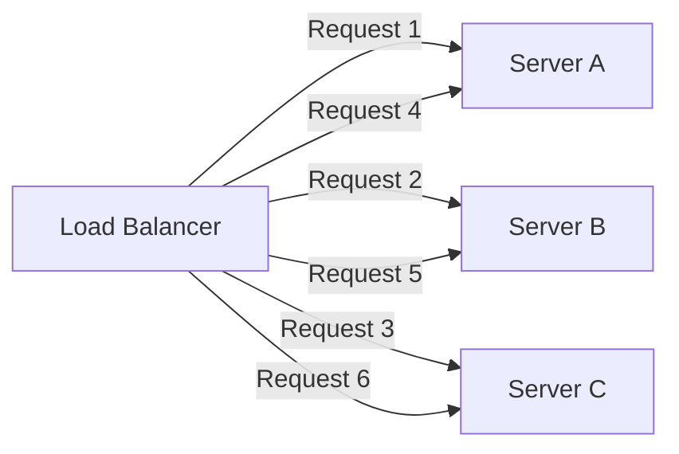

Requests are distributed in sequential rotation across all healthy servers. Server A gets request 1, Server B gets request 2, Server C gets request 3, Server A gets request 4, and so on.

**Best for:** Homogeneous servers (same hardware spec) with similar request processing times.

**Weakness:** Does not account for server load. If some requests take 100ms and others take 10 seconds (e.g., file uploads), a server processing heavy requests will accumulate a backlog while others are idle.

### Weighted Round-Robin

Each server is assigned a weight proportional to its capacity. A server with weight 3 receives three requests for every one request sent to a server with weight 1. Used when the backend pool contains servers of different hardware generations or capacities.

```
Server A (weight 3): ██████ 60% of traffic
Server B (weight 2): ████   40% of traffic
```

**Use case:** Blue-green deployments — assign new version weight 10 (10% of traffic) and old version weight 90, then gradually shift weights as confidence grows.

### Least Connections

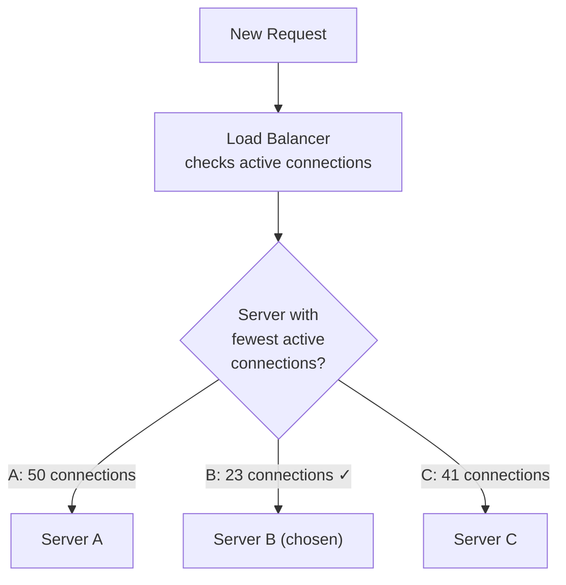

Route each new request to the server with the fewest currently active connections. This adapts dynamically to varying request durations — servers handling slow requests accumulate connections and receive fewer new ones.

**Best for:** Workloads with highly variable request processing times (file uploads, streaming, mixed API workloads).

**Variant — Least Response Time:** Route to the server with both fewest connections and lowest average response time. This is more sophisticated and accounts for server latency differences.

### IP Hash

A hash function applied to the client's source IP address determines the backend server. The same IP always maps to the same server (as long as the pool size stays constant).

```
hash(client_ip) % num_servers = server_index
```

**Use case:** Applications that require session affinity (sticky sessions) without cookie support — WebSocket connections, legacy stateful apps.

**Critical weakness:** If the server pool changes size (a server is added or removed), `num_servers` changes and every hash recomputes — nearly all clients get remapped to different servers, destroying all existing session affinity. This is solved by consistent hashing.

### Consistent Hashing

Consistent hashing places both servers and requests on a logical ring. Requests are assigned to the first server clockwise from their hash position on the ring.

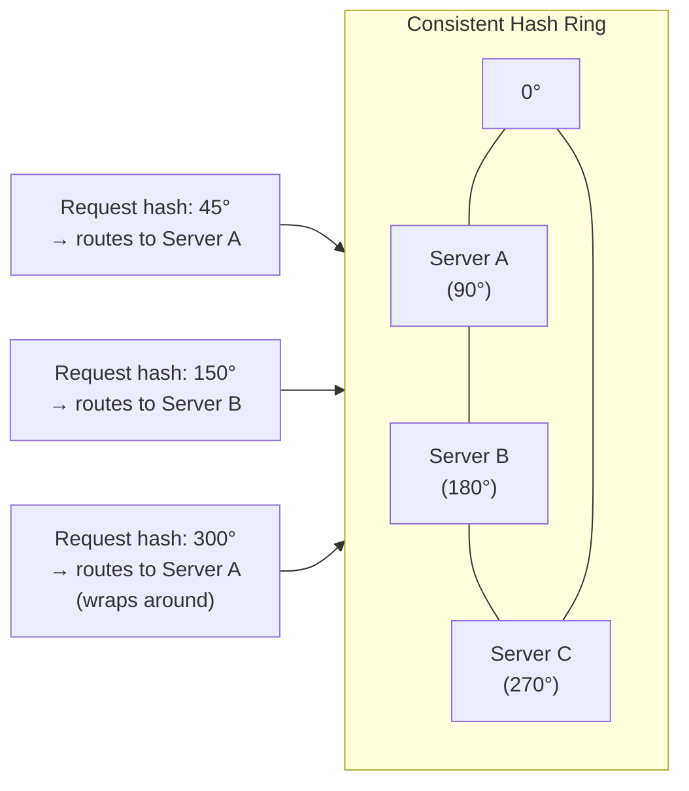

**Key property:** When a server is added or removed, only the requests that mapped to that server's ring segment are reassigned. All other request-to-server mappings remain stable. In a pool of N servers, adding or removing one server remaps approximately 1/N of traffic, not all of it.

**Virtual nodes:** To improve distribution uniformity, each physical server is represented by multiple virtual nodes on the ring (typically 100–200 per server). This prevents hot spots from uneven ring distribution.

**Use cases:** Distributed caches (memcached clusters), session stores, any system where minimizing cache invalidation on topology changes matters. Also foundational to distributed databases — Cassandra and DynamoDB use consistent hashing for partition assignment.

### Algorithm Comparison

| Algorithm | Session Affinity | Server Health Awareness | Best For |
|---|---|---|---|
| Round-Robin | No | Via health checks (removes nodes) | Uniform requests, homogeneous servers |
| Weighted Round-Robin | No | Via health checks | Mixed capacity servers, canary deployments |
| Least Connections | No | Yes (overloaded server gets fewer requests) | Variable request duration |
| IP Hash | Yes (by IP) | Partial (breaks on pool resize) | Legacy stateful apps |
| Consistent Hashing | Yes (stable) | Yes (minimal remapping on change) | Caches, session stores, microservices |

---

## Active-Passive vs Active-Active Failover

The load balancer itself can be a single point of failure. High-availability load balancer configurations eliminate this.

### Active-Passive

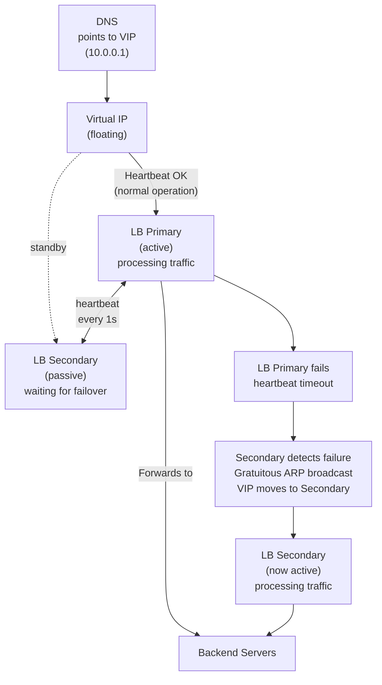

In active-passive, a Virtual IP (VIP) floats between two load balancer nodes. Only the active node processes traffic. The passive node monitors via heartbeat. On active node failure (detected within ~3–10 seconds via missed heartbeats), the passive node sends a Gratuitous ARP to announce it now owns the VIP, and traffic flows to it.

**Characteristics:**
- Simple configuration
- Passive node is idle resource (paying for capacity that processes no traffic under normal conditions)
- Failover time: seconds (heartbeat interval + ARP propagation)
- No split-brain risk from VIP design

### Active-Active

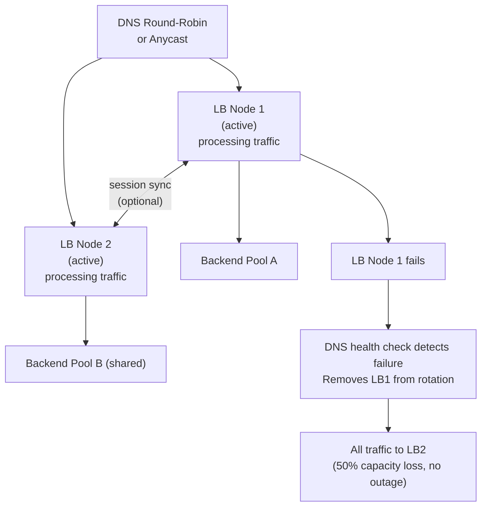

In active-active, both load balancer nodes process traffic simultaneously. DNS round-robin or BGP anycast distributes traffic across both. If one node fails, the surviving node absorbs all traffic (at increased load, but no outage).

**Characteristics:**
- Both nodes process traffic — full utilization of both
- Higher throughput ceiling (double capacity vs active-passive)
- Failover time: seconds (DNS TTL or BGP reconvergence)
- More complex: session synchronization between nodes if session affinity is needed

### Comparison

| Aspect | Active-Passive | Active-Active |
|---|---|---|
| **Traffic in normal state** | 100% on primary, 0% on secondary | 50%/50% (or other split) |
| **Resource utilization** | 50% (passive is idle) | 100% |
| **Failover time** | ~3–10 seconds (ARP takeover) | ~5–30 seconds (DNS or BGP) |
| **Capacity after failure** | No change (secondary steps in at full capacity) | Reduced (surviving node absorbs 100%) |
| **Complexity** | Lower | Higher (session sync, DNS coordination) |
| **Cost efficiency** | Lower (standby resource) | Higher |

---

## Reverse Proxy

A reverse proxy is a server that sits in front of backend servers and forwards client requests to them. All load balancers are reverse proxies, but not all reverse proxies are load balancers — a reverse proxy may forward to a single backend.

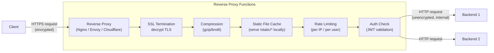

### SSL Termination

The reverse proxy accepts TLS-encrypted connections from clients, decrypts them, and forwards plaintext HTTP to backends on the internal network. Benefits:

- **Centralized certificate management:** One certificate on the reverse proxy instead of on every backend server. Renewal, rotation, and revocation happen in one place.
- **Backend simplicity:** Backend servers do not need TLS libraries or certificate files. Reduced attack surface.
- **Performance:** TLS handshake CPU cost is absorbed by the proxy (which can be hardware-accelerated). Backends receive pre-decrypted traffic.
- **HTTP/2 multiplexing:** The proxy can use HTTP/2 toward clients (multiplexed connections) and HTTP/1.1 toward backends if they do not support HTTP/2.

**Trade-off:** Traffic between the reverse proxy and backends is unencrypted. On cloud infrastructure within a VPC, this is generally acceptable. For zero-trust architectures, TLS passthrough (L4) or mTLS between proxy and backends is used instead.

### Additional Reverse Proxy Functions

**Compression:** Proxy compresses responses with gzip or brotli before sending to clients. Backends remain uncompressed, saving compute on every backend server.

**Static file serving:** The proxy serves static assets (`/static/`, `/assets/`) directly from its own file system or cache, without hitting backend servers. This is a significant load reduction for web apps — static asset requests can represent 60–80% of all HTTP requests.

**Request buffering:** The proxy fully reads the client's request body before forwarding to the backend. This protects backends from slow clients (slow loris attacks) that trickle data to keep connections open.

**Rate limiting and DDoS mitigation:** The proxy can enforce per-IP, per-user, or global rate limits before requests reach backends.

### Reverse Proxy vs Load Balancer vs API Gateway

| Tool | Primary Function | SSL | Routing | Auth | Rate Limiting | Typical Product |
|---|---|---|---|---|---|---|
| **Reverse Proxy** | Forward requests, serve static files | Yes | Simple (host-based) | Basic | Basic | Nginx, Apache, Caddy |
| **Load Balancer** | Distribute traffic across backends | Yes (L7) | Advanced (path, header) | No | No | AWS ALB, HAProxy |
| **API Gateway** | API management layer | Yes | Advanced + transformation | Yes (OAuth, JWT) | Yes (per-plan) | Kong, AWS API GW, Apigee |

In practice, the lines blur — modern products like Envoy and Nginx can serve all three roles. API gateways are covered in detail in [Chapter 13: Microservices Architecture](/system-design/part-3-architecture-patterns/ch13-microservices).

---

## Health Checks

Load balancers continuously verify that backend servers can handle traffic. Unhealthy servers are removed from the rotation automatically.

### Active Health Checks

The load balancer proactively sends synthetic requests to each backend on a schedule:

```
GET /health HTTP/1.1
Host: backend-server
```

The backend responds with `200 OK` and optionally a JSON payload indicating component health (database connectivity, cache availability, disk space). The load balancer evaluates the response:

- `200–299`: Healthy, keep in rotation
- `5xx` or timeout: Mark as unhealthy, remove from rotation
- After N consecutive failures: Quarantine (stop sending traffic)
- After M consecutive successes: Restore to rotation

Typical configuration: interval 10–30 seconds, failure threshold 2–3 consecutive failures, recovery threshold 2–3 consecutive successes.

### Passive Health Checks

The load balancer monitors real traffic responses. If a backend returns `5xx` errors or times out on a configurable percentage of real requests within a time window, it is removed from rotation. No synthetic traffic is generated.

**Active vs Passive:**

| | Active | Passive |
|---|---|---|
| **Detection speed** | Slower (depends on check interval) | Faster (immediate on real traffic failure) |
| **Backend load** | Slight overhead from synthetic requests | No overhead |
| **False positives** | Low (isolated synthetic check) | Possible (transient errors trigger removal) |
| **Detects** | Backend unreachable even without traffic | Backend failing under real load |

**Best practice:** Use both — active checks for uptime/reachability, passive checks for detecting degradation under load.

### Circuit Breaking

Circuit breaking is a pattern that prevents a load balancer from sending requests to a backend that is clearly overwhelmed or failing, giving it time to recover. Rather than queuing infinite requests, the circuit "opens" and requests fail-fast with an error.

Circuit breaking is closely related to health checks but operates at the request level rather than the server level. A full treatment is in [Chapter 13: Microservices Architecture](/system-design/part-3-architecture-patterns/ch13-microservices).

---

## Real-World: AWS Elastic Load Balancing

AWS offers three distinct load balancer products, each targeting a different use case.

| | Classic LB (CLB) | Application LB (ALB) | Network LB (NLB) |
|---|---|---|---|
| **OSI Layer** | L4 + L7 (limited) | L7 | L4 |
| **Protocol** | HTTP, HTTPS, TCP | HTTP, HTTPS, WebSocket, HTTP/2 | TCP, UDP, TLS |
| **Routing** | Port-based only | Path, host, header, query string, source IP | IP and port |
| **SSL termination** | Yes | Yes (ACM integration) | Yes (TLS passthrough option) |
| **WebSocket** | No | Yes | Yes (pass-through) |
| **Target types** | EC2 instances only | EC2, ECS, Lambda, IP addresses | EC2, ECS, IP addresses |
| **IP type** | Dynamic DNS only | Dynamic DNS | Static IP per AZ (Elastic IP support) |
| **Throughput** | Low (legacy) | High | Extreme (millions of requests/sec) |
| **Health checks** | TCP or HTTP | HTTP, HTTPS (path configurable) | TCP, HTTP, HTTPS |
| **WAF integration** | No | Yes (AWS WAF) | No |
| **gRPC support** | No | Yes | Yes (pass-through) |
| **Use case** | Legacy (avoid for new systems) | Web apps, microservices, API gateways | Low-latency, gaming, databases, IoT |
| **Pricing model** | Per-hour + per-LCU | Per-hour + per-LCU | Per-hour + per-LCU |

**Choosing between ALB and NLB:**

Choose **ALB** when:
- Routing based on URL path (microservices: `/users/*` → user service, `/orders/*` → order service)
- SSL termination and certificate management via ACM
- Integration with AWS WAF for application-layer security
- Target groups include Lambda functions or ECS tasks

Choose **NLB** when:
- Protocol is not HTTP (database connections, game servers, MQTT)
- You need a static IP address (firewall whitelisting, client-side pinning)
- Absolute minimum latency at extreme throughput
- Preserving source IP is critical (NLB preserves client IP; ALB substitutes its own IP unless X-Forwarded-For is used)

The **CLB** is AWS's first-generation load balancer from 2009. It is feature-limited and should not be used for new applications. AWS continues supporting it for backward compatibility.

---

> **Key Takeaway:** Load balancers eliminate the application-tier SPOF and enable horizontal scaling. L7 load balancers unlock content-based routing, SSL termination, and deep request inspection at the cost of latency overhead. The right algorithm — especially consistent hashing for cache affinity or least connections for variable workloads — significantly impacts system performance. Pair DNS-based global routing ([Chapter 5](/system-design/part-2-building-blocks/ch05-dns)) with in-region load balancing for production-grade traffic management.

---

## Consistent Hashing Deep Dive

The brief overview in the Algorithms section above introduced consistent hashing conceptually. This section covers the mechanics in depth: how the hash ring works, why virtual nodes are necessary, and when to choose consistent hashing over modulo hashing.

### The Problem: Modulo Hashing Is Fragile

Naive key-to-server assignment uses modulo arithmetic:

```
server_index = hash(key) % num_servers
```

This works while the server count is stable. The moment a server is added or removed, `num_servers` changes and every key remaps to a different server index. In a distributed cache with 4 servers, adding a 5th server causes ~80% of all cache keys to map to new servers — a near-total cache invalidation that triggers a thundering herd against the origin database.

| Event | Modulo Hashing | Consistent Hashing |
|-------|---------------|-------------------|
| **Normal operation** | O(1) lookup | O(log N) lookup (binary search on ring) |
| **Add 1 server (N→N+1)** | ~N/(N+1) keys remapped (most keys) | ~1/N keys remapped (only that server's segment) |
| **Remove 1 server (N→N-1)** | ~(N-1)/N keys remapped (most keys) | ~1/N keys remapped (only that server's segment) |
| **Cache invalidation on resize** | Near-total | Minimal |
| **Complexity** | Simple | Moderate |

### The Hash Ring

Consistent hashing maps both servers and keys onto a circular keyspace (e.g., 0 to 2^32-1). Each server is placed at a position on the ring determined by `hash(server_id)`. Each key is placed at `hash(key)`. A key is assigned to the first server found by walking clockwise from the key's position.

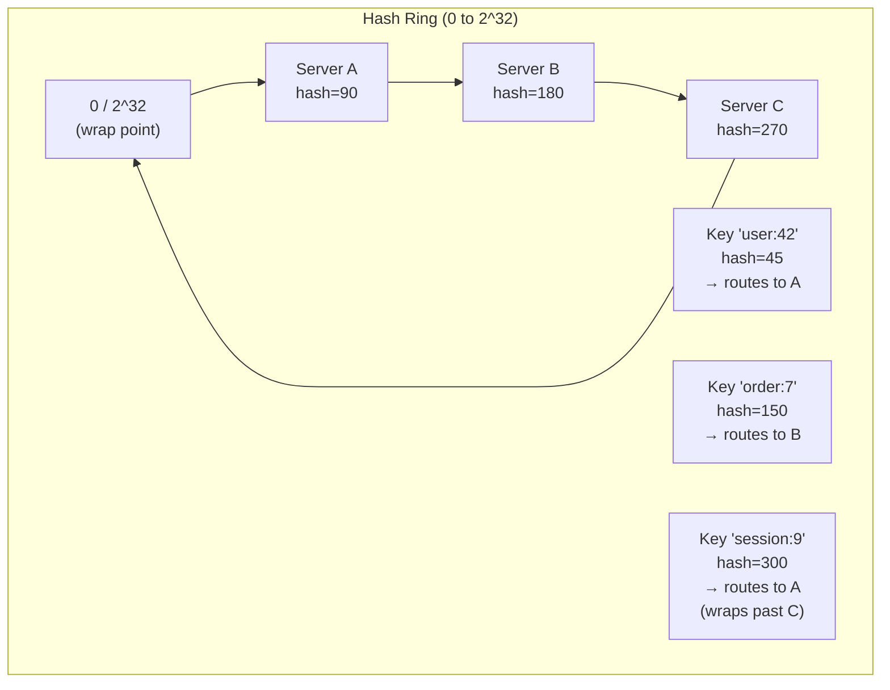

**Add Server D at position 220:** Only keys between 180° and 220° (previously going to C) now go to D. All other keys are unaffected.

**Remove Server B at position 180:** Only keys that were going to B (between 90° and 180°) now route to C. All other keys are unaffected.

### Virtual Nodes: Solving Uneven Distribution

With only 3 physical servers on the ring, the distribution of keys depends entirely on where the hash function places each server. By chance, Server A might own 60% of the ring while Server B owns 10%. This is uneven and worsens as servers have different capacities.

**Virtual nodes** solve this by placing each physical server at multiple positions on the ring — typically 100–200 virtual nodes per server. Each virtual node is hashed using a different identifier (e.g., `hash("ServerA:1")`, `hash("ServerA:2")`, ..., `hash("ServerA:150")`).

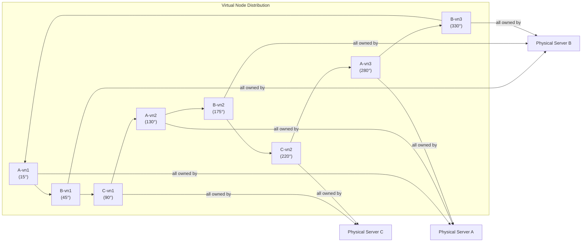

With 150 virtual nodes per server, each server owns approximately 1/N of the ring in expectation regardless of the hash function's placement — statistical averaging across many positions cancels out any clustering.

**Weighted virtual nodes:** Assign more virtual nodes to higher-capacity servers. A server with 3× the RAM gets 3× the virtual nodes and receives ~3× the keys. This allows heterogeneous hardware pools without manual key range management.

### Real-World Usage

| System | How Consistent Hashing Is Used |
|--------|-------------------------------|
| **Amazon DynamoDB** | Partitions data across storage nodes; virtual nodes per node |
| **Apache Cassandra** | Token ring with virtual nodes; each node owns token ranges |
| **Memcached (libketama)** | Client-side consistent hashing for cache shard selection |
| **Riak** | 160-bit SHA1 ring with configurable virtual nodes |
| **CDN edge routing** | Route requests for a given URL to the nearest/consistent edge PoP |
| **AWS ElastiCache** | Cluster mode uses consistent hashing for Redis shard mapping |

Cross-reference: [Chapter 7: Caching](/system-design/part-2-building-blocks/ch07-caching) covers how consistent hashing underpins distributed cache cluster topology. [Chapter 8: CDN](/system-design/part-2-building-blocks/ch08-cdn) covers edge routing.

---

## Proxy Patterns

A **proxy** is an intermediary that sits between two communicating parties. The direction of the proxy — which side it represents — determines whether it is a forward proxy or a reverse proxy. These are fundamentally different architectures with different purposes, despite sharing the word "proxy."

### Forward Proxy

A forward proxy sits on the **client side** and forwards requests on behalf of clients to external destinations. The destination server sees the proxy's IP, not the client's IP.

**Use cases:**
- **Corporate internet filtering:** Block social media, malware domains; enforce company policy
- **Geo-unblocking / VPN:** Client traffic appears to originate from the proxy's country
- **Anonymity:** Mask client IP from destination servers
- **Caching for egress:** Cache common external resources (OS updates, Docker images) to reduce egress bandwidth

### Reverse Proxy

A reverse proxy sits on the **server side** and forwards requests to backend servers on behalf of clients. The client sees the proxy's IP, not the backend server's IP.

**Use cases:**
- SSL/TLS termination
- Caching and compression
- Rate limiting and DDoS protection
- Static file serving
- Request routing to multiple backends

### Forward vs Reverse Proxy Flow

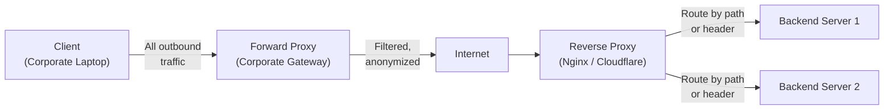

### Forward vs Reverse Proxy Comparison

| Dimension | Forward Proxy | Reverse Proxy |
|-----------|--------------|---------------|
| **Represents** | Clients | Servers |
| **Client awareness** | Client is configured to use it | Client is unaware (sees only the proxy) |
| **Server awareness** | Server sees proxy IP, not client | Server sees proxy IP, not client |
| **Protects** | Client identity from servers | Server identity and infrastructure from clients |
| **Primary use** | Access control, anonymity, caching egress | SSL termination, load balancing, caching ingress |
| **Examples** | Squid, corporate VPN, Tor exit nodes | Nginx, HAProxy, Cloudflare, AWS ALB |
| **Config location** | Client browser / OS network settings | DNS points to proxy; backend is internal |

### Reverse Proxy vs Load Balancer vs API Gateway

All three sit in front of backend servers, but they solve different scopes of problems:

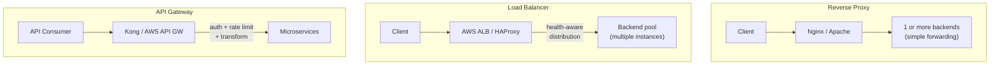

| Feature | Reverse Proxy | Load Balancer | API Gateway |
|---------|--------------|---------------|-------------|
| **SSL termination** | Yes | Yes (L7) | Yes |
| **Health-aware routing** | Basic | Yes (primary function) | Yes |
| **Path-based routing** | Basic (location blocks) | Yes | Yes |
| **Authentication** | No | No | Yes (OAuth, JWT, API keys) |
| **Rate limiting** | Basic (per IP) | No | Yes (per consumer plan) |
| **Request transformation** | No | No | Yes (header rewrite, payload transform) |
| **Analytics / developer portal** | No | No | Yes |
| **Protocol translation** | No | No | Yes (REST → gRPC, etc.) |
| **Typical product** | Nginx, Apache, Caddy | AWS ALB, AWS NLB, HAProxy | Kong, AWS API Gateway, Apigee |
| **When to use** | Single-service SSL + static files | Multi-instance traffic distribution | Multi-consumer API management |

**Decision rule:**
- Need to distribute traffic across identical backend instances? → **Load Balancer**
- Need to manage external API consumers with auth/rate limits/plans? → **API Gateway**
- Need SSL termination and simple request forwarding? → **Reverse Proxy**
- In practice, modern systems layer all three: DNS → CDN/WAF → Load Balancer → Reverse Proxy sidecar → App

Cross-reference: API Gateway patterns are covered in [Chapter 13: Microservices Architecture](/system-design/part-3-architecture-patterns/ch13-microservices).

---

## Related Chapters

| Chapter | Relevance |
|---------|-----------|
| [Ch05 — DNS](/system-design/part-2-building-blocks/ch05-dns) | DNS global routing precedes LB regional distribution |
| [Ch07 — Caching](/system-design/part-2-building-blocks/ch07-caching) | Cache-aside behind LB reduces backend load |
| [Ch08 — CDN](/system-design/part-2-building-blocks/ch08-cdn) | CDN sits in front of LB for static content offloading |
| [Ch13 — Microservices](/system-design/part-3-architecture-patterns/ch13-microservices) | API gateway as specialized LB for microservice routing |

---

## Practice Questions

### Beginner

1. **Layer 7 Routing:** You are designing the backend for a multi-tenant SaaS application. You need requests to `/api/v1/*` to go to your API cluster, `/uploads/*` to go to a file processing cluster, and all other requests to the main web cluster. What type of load balancer would you use and why? Write out the routing rules.

   <details>
   <summary>Hint</summary>
   Layer 7 (application) load balancers can inspect HTTP path, headers, and hostnames to make content-based routing decisions — Layer 4 only sees TCP/IP and cannot route by URL path.
   </details>

### Intermediate

2. **Consistent Hashing:** Explain consistent hashing. A distributed cache has 4 servers using consistent hashing. A 5th server is added. Approximately what percentage of cache keys need to be remapped? Compare this to the percentage with a simple modulo hash (`hash(key) % n`).

   <details>
   <summary>Hint</summary>
   Consistent hashing remaps only ~1/n keys (≈20%); modulo hashing remaps nearly all keys because the denominator changes — this is why consistent hashing is standard for distributed caches.
   </details>

3. **HA Strategies:** Compare active-passive and active-active load balancer high availability. A financial services firm values zero-downtime over resource efficiency. Which would you recommend, what failover time can they expect with each, and what does active-active require from the application layer?

   <details>
   <summary>Hint</summary>
   Active-active provides instant failover but requires session state to be shared (sticky sessions or a distributed session store); active-passive has a brief failover window during VIP handoff.
   </details>

4. **SSL Termination Trade-off:** Why does SSL termination at the load balancer create a trade-off between operational simplicity and internal security? For a healthcare application handling PHI (Protected Health Information) under HIPAA, how would you address this concern without sacrificing load balancer visibility?

   <details>
   <summary>Hint</summary>
   Traffic between the LB and backends is plaintext — mitigate with private network isolation plus re-encryption (SSL passthrough or re-encrypt mode) for the backend hop.
   </details>

### Advanced

5. **Algorithm Mismatch:** You have 10 backend servers behind an ALB with round-robin routing. Two servers are processing a long-running batch job and are at 95% CPU. The other 8 are at 20% CPU. What specific problem does round-robin create, and which algorithm would solve it? What are the operational trade-offs of that alternative at scale with 200+ backends?

   <details>
   <summary>Hint</summary>
   Least connections or least response time algorithms route based on real server load rather than uniform distribution — but require the LB to track per-server state, which adds overhead at very high backend counts.
   </details>
