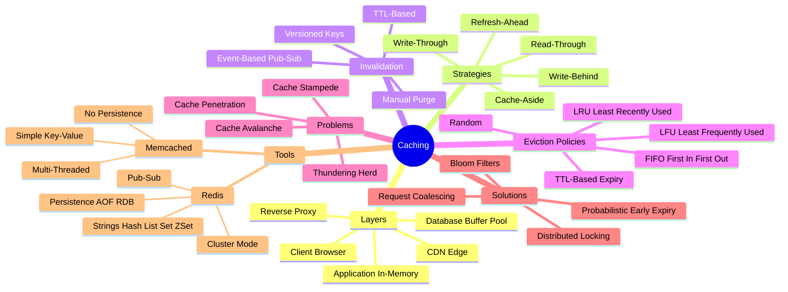
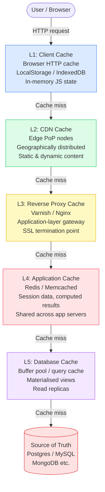
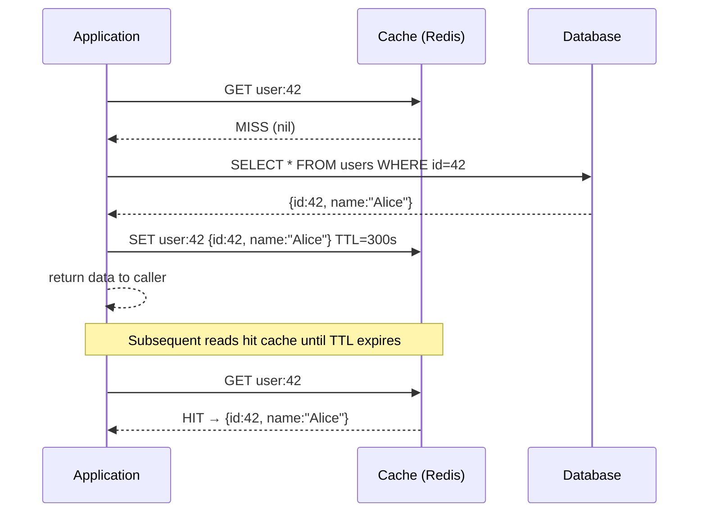
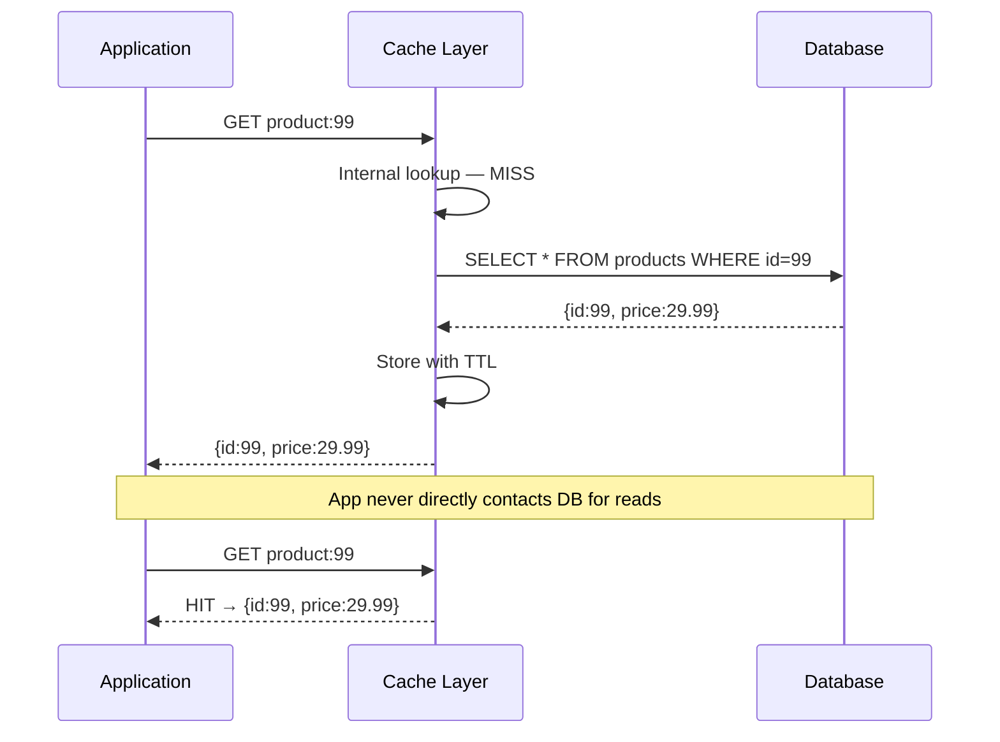
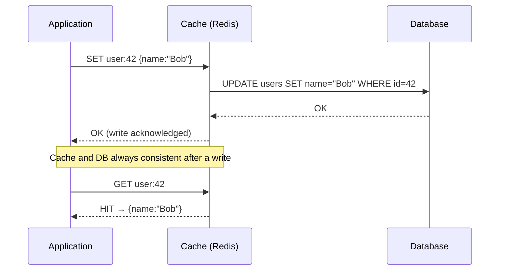
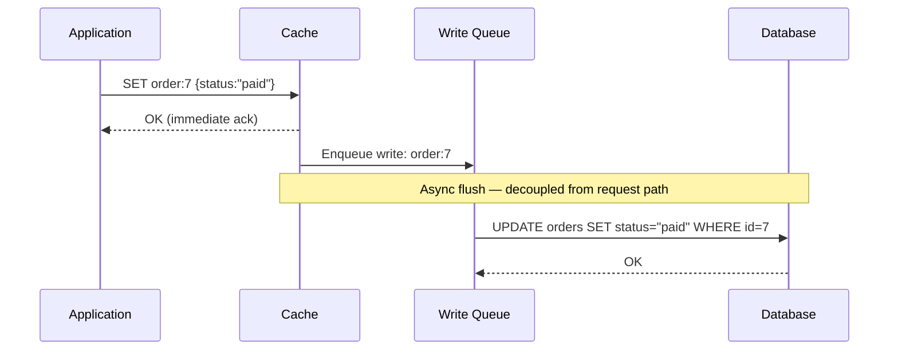
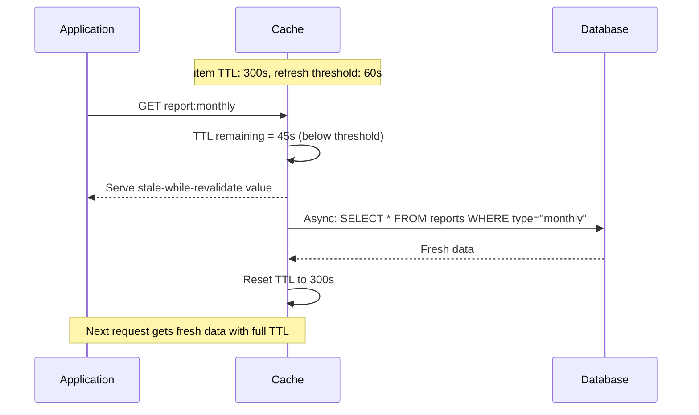
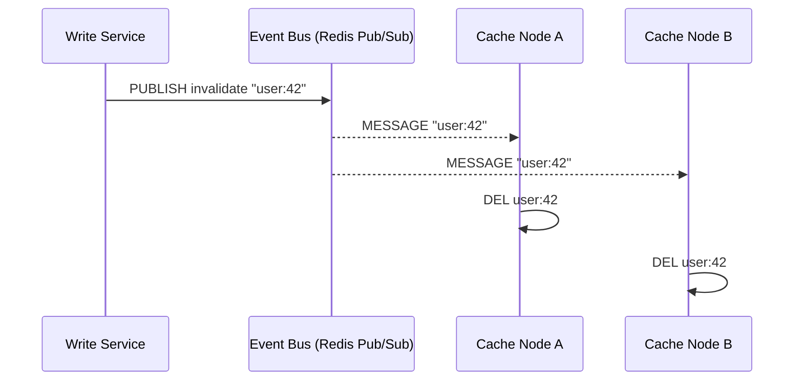
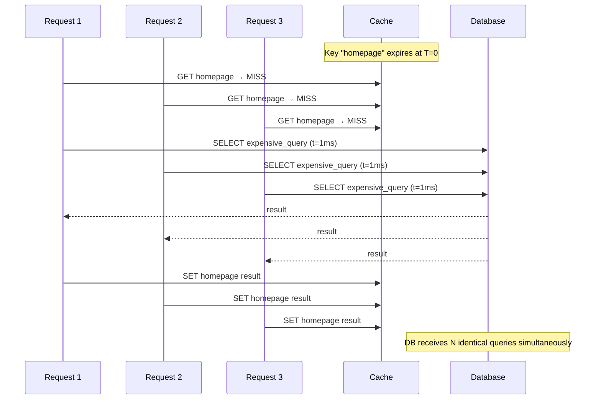
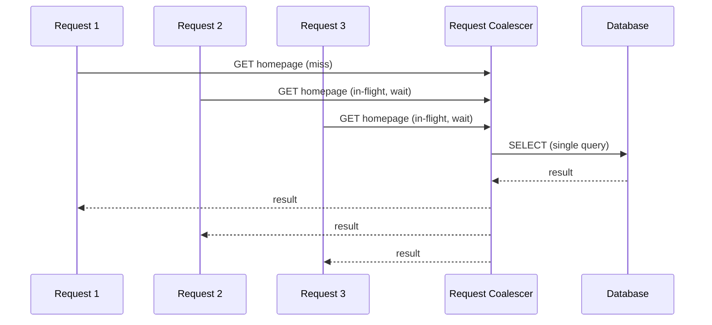

# Chapter 7: Caching


> Caching is the single highest-leverage optimization in distributed systems. A well-designed cache can reduce database load by 90%, cut latency from milliseconds to microseconds, and enable systems to scale beyond what raw compute alone could achieve.

---

## Mind Map



---

## Overview

A cache is a fast, temporary storage layer that holds a subset of data so future requests can be served without reaching the slower source of truth (typically a database or external service).

Three properties define cache value:

- **Speed** — cache reads are orders of magnitude faster than disk or network I/O
- **Cost** — CPU and RAM are cheaper per operation than database queries at high scale
- **Proximity** — edge caches reduce geographic latency that no optimization can fix

The fundamental challenge is **consistency**: how do you keep a fast local copy of data in sync with the authoritative source?

---

## Cache Hierarchy

Every modern system uses multiple cache layers. Understanding which layer to target for a given problem is a core design skill.



Each layer has different characteristics:

| Layer | Typical Latency | Capacity | Scope |
|---|---|---|---|
| Browser cache | ~0 ms | MB range | Per user |
| CDN | 1–10 ms | TB range | Global edge |
| Reverse proxy | < 1 ms | GB range | Datacenter |
| App cache (Redis) | 0.1–1 ms | GB–TB | All app instances |
| DB buffer pool | 0.5–5 ms | RAM of DB host | Single DB node |

> Cross-reference: CDN caching is explored in detail in [Chapter 8](/system-design/part-2-building-blocks/ch08-cdn). Database buffer pools and query caching are covered in [Chapter 9](/system-design/part-2-building-blocks/ch09-databases-sql).

---

## Caching Strategies

The strategy you choose determines **when** data enters the cache, **who** is responsible for populating it, and **what consistency guarantees** you get.

### Strategy 1: Cache-Aside (Lazy Loading)

The application owns all cache interactions. On a read, the app checks the cache first. On a miss, it reads from the database and populates the cache before returning.



**Characteristics:**
- Cache only contains data that was actually requested — no wasted memory
- First request always pays the DB latency cost (cold start)
- Cache and DB can diverge if DB is updated without invalidating the cache
- Application code is tightly coupled to cache logic

**Best for:** Read-heavy workloads with a predictable hot set. User profile pages, product detail pages.

---

### Strategy 2: Read-Through

The cache layer sits transparently in front of the database. The application only talks to the cache; the cache handles DB reads on misses automatically.



**Characteristics:**
- Application code is simpler — no cache miss handling logic
- Cache warms lazily on first access, same cold-start problem as cache-aside
- Cache library or proxy must implement the read-through logic (e.g., AWS ElastiCache, Ehcache)

**Best for:** When you want to abstract cache complexity from application code.

---

### Strategy 3: Write-Through

Every write goes to both the cache and the database synchronously before the write is acknowledged to the caller.



**Characteristics:**
- Cache is always consistent with the database — reads never return stale data
- Write latency doubles (cache + DB in sequence)
- Cache may hold data that is never read (write-heavy, rare-read items waste memory)
- Typically combined with read-through for complete coverage

**Best for:** Systems where read consistency is critical: financial account balances, inventory counts.

---

### Strategy 4: Write-Behind (Write-Back)

The application writes to the cache only. The cache acknowledges immediately, then asynchronously flushes the data to the database in the background.



**Characteristics:**
- Lowest write latency of all strategies — DB write is off the critical path
- Risk of data loss: if cache crashes before flush, writes are lost
- DB can be temporarily out of sync — inconsistency window exists
- Requires a durable write queue to mitigate data loss risk

**Best for:** Write-intensive workloads tolerant of eventual consistency: analytics events, counters, leaderboards, shopping carts.

---

### Strategy 5: Refresh-Ahead

The cache proactively refreshes entries before they expire, based on predicted access patterns. When an item's TTL drops below a threshold, a background refresh is triggered while still serving the current (soon-to-expire) value.



**Best for:** Expensive-to-compute data accessed frequently with predictable patterns: dashboards, aggregation reports, recommendation scores.

---

### Strategy Comparison

| Strategy | Read Latency | Write Latency | Consistency | Data Loss Risk | Complexity | Best Use Case |
|---|---|---|---|---|---|---|
| Cache-Aside | High on miss | DB only | Eventual | None | Low | Read-heavy, simple CRUD |
| Read-Through | High on miss | DB only | Eventual | None | Medium | Simplify app read logic |
| Write-Through | Low (warm) | High (sync) | Strong | None | Medium | Consistency-critical reads |
| Write-Behind | Low (warm) | Very low | Eventual | Medium | High | Write-intensive workloads |
| Refresh-Ahead | Always low | DB only | Near-real-time | None | High | Predictable hot data |

---

## Cache Invalidation

Phil Karlton's famous observation: *"There are only two hard things in Computer Science: cache invalidation and naming things."*

Invalidation is hard because you must atomically decide: **when is my cached copy no longer trustworthy?**

### TTL-Based (Time-To-Live)

Every cached entry carries an expiry timestamp. After TTL elapses, the entry is treated as absent and the next read re-fetches from the source.

```
SET user:42 <data> EX 300   # Redis: expire in 300 seconds
```

**Pros:** Simple, no coordination needed, automatic cleanup.
**Cons:** Stale window exists for the full TTL duration; choosing TTL is a trade-off between freshness and cache efficiency.

**Guideline:** Short TTL (seconds) for frequently-changing data. Long TTL (hours–days) for static or slowly-changing data.

---

### Event-Based (Pub/Sub)

When data changes, the writer publishes an invalidation event. All cache nodes subscribed to that event delete or refresh their local copy.



**Pros:** Near-instant consistency; scales to many cache nodes.
**Cons:** Adds infrastructure dependency on the event bus; message delivery is not guaranteed without at-least-once semantics.

---

### Manual Purge

An operator or deployment pipeline explicitly deletes or tags specific cache entries. Used when deploying content updates (e.g., CDN cache purge on new software release).

**Pros:** Precise control.
**Cons:** Operationally burdensome; error-prone at scale.

---

### Versioned Keys

Instead of invalidating, embed a version or content hash in the cache key. When data changes, the key changes, and the old entry is simply never accessed again (expires via TTL cleanup).

```
# Old key: user:42:v1  →  abandoned
# New key: user:42:v2  →  populated on next read
```

**Pros:** No invalidation race conditions; atomic by design.
**Cons:** Orphan keys accumulate; requires TTL to reclaim memory.

---

## Eviction Policies

When cache memory is full, the eviction policy determines which entries to remove to make room for new ones.

| Policy | Algorithm | Evicts | Pros | Cons | Ideal For |
|---|---|---|---|---|---|
| **LRU** | Least Recently Used | Entry not accessed longest | Good approximation of hot set | Higher memory overhead (access tracking) | General-purpose; most common default |
| **LFU** | Least Frequently Used | Entry with fewest accesses | Favours truly popular data | Slow to adapt after access pattern shifts | Stable, long-lived hot sets |
| **FIFO** | First In First Out | Oldest entry inserted | Simple, predictable | Ignores access frequency entirely | Time-ordered data streams |
| **Random** | Uniform random | Random entry | Zero overhead | Unpredictable; can evict hot data | When overhead matters more than hit rate |
| **TTL-based** | Shortest remaining TTL | Entry expiring soonest | Proactive memory reclaim | May evict rarely-accessed items early | When freshness > recency |

**Redis default:** `allkeys-lru`. For session caches where all keys should expire eventually, `volatile-lru` (only evict keys with TTL set) is common.

---

## Cache Stampede / Thundering Herd

### The Problem

When a popular cache entry expires (or is evicted), many concurrent requests simultaneously miss the cache, each independently query the database, and each independently write the same result back to the cache. This is a **cache stampede** — also called thundering herd.



At high traffic this amplifies into hundreds or thousands of redundant queries, potentially overloading the database.

---

### Solution 1: Distributed Locking

Only the first request that observes a cache miss acquires a lock. All other requests wait and re-read from cache once the lock is released.

```
# Pseudo-code (Redis SET NX = set if not exists)
value = cache.GET(key)
if value is nil:
    if cache.SET(lock_key, 1, NX, EX=5):   # acquired lock
        value = db.query()
        cache.SET(key, value, EX=ttl)
        cache.DEL(lock_key)
    else:
        sleep(10ms)
        value = cache.GET(key)              # re-read after lock released
```

**Trade-off:** Adds latency for waiting requests; risk of deadlock if lock holder crashes (mitigated by lock TTL).

---

### Solution 2: Probabilistic Early Expiration (PER)

Before TTL reaches zero, a probability calculation decides whether to proactively refresh. As the TTL decreases, the probability of triggering a refresh increases. Individual requests independently decide to refresh early, distributing the load.

```
# XFetch algorithm
remaining_ttl = cache.TTL(key)
# β is a tunable constant (typically 1.0)
if -β * log(random()) >= remaining_ttl:
    refresh_from_db()  # proactive refresh
```

**Trade-off:** No coordination needed; small overhead on every read. Occasional duplicate refreshes are acceptable.

---

### Solution 3: Request Coalescing

An intermediary layer (e.g., a request proxy or a fan-in goroutine) deduplicates in-flight requests for the same key. Only one backend request is issued; all waiting callers receive the same result.



**Trade-off:** Requires infrastructure support (singleflight in Go, similar libraries in other languages). Slightly increases latency for R2/R3 compared to independent queries.

---

## Redis vs Memcached

Both are widely used in-memory key-value stores. Redis has become the dominant choice for most modern systems, but Memcached retains advantages in specific high-throughput, low-complexity scenarios.

| Dimension | Redis | Memcached |
|---|---|---|
| **Data structures** | Strings, Hashes, Lists, Sets, Sorted Sets, Streams, HyperLogLog, Bitmaps | Strings (byte blobs) only |
| **Persistence** | RDB snapshots + AOF (append-only file log) | None — memory only |
| **Replication** | Master-replica replication built-in | Not built-in (requires external tooling) |
| **Clustering** | Redis Cluster (hash slot sharding, native) | Client-side sharding only |
| **Pub/Sub** | Yes — lightweight message bus | No |
| **Scripting** | Lua scripts executed atomically | No |
| **Transactions** | MULTI/EXEC (optimistic locking with WATCH) | No |
| **Threading model** | Single-threaded event loop (Redis 6+ I/O threads) | Multi-threaded |
| **Memory efficiency** | Higher overhead per key (richer metadata) | Lower overhead, more efficient for simple strings |
| **Operational maturity** | Very high — widely adopted, rich tooling | High — simpler operationally |
| **Max value size** | 512 MB | 1 MB |
| **Use case fit** | Sessions, leaderboards, pub/sub, queues, rate limiting, feature flags | Pure high-throughput object caching |

**Decision rule:**
- Need any data structure beyond strings, persistence, pub/sub, or transactions → **Redis**
- Pure cache, maximum throughput, minimal operational complexity → **Memcached**

---

## Real-World: Facebook's Memcached at Scale

Facebook's 2013 paper *"Scaling Memcache at Facebook"* (Nishtala et al.) describes one of the largest cache deployments in existence. Key lessons:

**Scale:** Hundreds of servers, tens of billions of items cached, handling millions of requests per second.

**Regional pools.** Facebook partitioned Memcached servers into regional pools. Infrequently accessed ("cold") items live in a shared pool; popular items live in dedicated pools where hot data gets more cache capacity.

**Demand-filled Windows.** To prevent stampedes, Facebook used **leases**: when a client experiences a cache miss, the cache issues a 64-bit token (lease). Only the holder of the lease may populate the cache for that key. Other clients requesting the same key during the fill window receive a "wait" signal, dramatically reducing redundant DB hits.

**Incast congestion prevention.** When a web server fans out to hundreds of Memcached servers for a single page load, the simultaneous responses create incast — a network congestion event. Facebook solved this with **sliding window** request scheduling, limiting the number of simultaneous outstanding requests per client.

**McRouter (client-side proxy).** Facebook built McRouter, a Memcached protocol-compatible proxy that handles routing, replication, deletion broadcast, and failover transparently — decoupling client libraries from topology changes.

**Thundering herd at cold start.** During cluster failovers, cold caches generate DB-killing traffic. Facebook uses **Gutter pools** — a small reserve of spare servers. When a primary Memcached server fails, cache misses are redirected to the gutter pool rather than directly to the database.

**Key takeaway from Facebook's experience:** At massive scale, the hard problems are not single-node performance but **coordination** (leases, coalescing) and **topology management** (failover, cold start).

---

## Cache Anti-Patterns to Avoid

**Cache everything naively.** Caching rarely-accessed data wastes memory and evicts actually-hot data. Measure access patterns first.

**Missing TTL on all keys.** Without TTL, caches grow unbounded and fill with stale data that is never refreshed. Always set a sensible default TTL.

**Caching by mutable state.** If a cached value encodes mutable state that multiple writers can change (without invalidation), you will serve stale data silently. Consider if write-through or event-based invalidation is needed.

**Ignoring cache penetration.** Requests for non-existent keys (e.g., `user:9999` where no user 9999 exists) always miss the cache and always hit the database. At scale, malicious or buggy clients can use this to DOS a database. Solutions: cache negative results (`SET user:9999 "NOT_FOUND" EX 60`) or use a Bloom filter to reject non-existent key lookups before they reach the DB.

**Over-relying on cache for durability.** Cache is volatile. Never use it as the sole store for data that must survive a restart.

---

## Key Takeaway

> Caching is a consistency-performance trade-off. Every caching decision is a bet that the cost of serving slightly stale data (or the complexity of perfect invalidation) is worth the latency and throughput gains. Design cache strategies deliberately — matching invalidation guarantees to the tolerance of the data being cached.

---

## Caching Comparison Tables

### Cache Eviction Policies

| Policy | How It Works | Best For | Weakness | Time Complexity |
|--------|-------------|----------|----------|-----------------|
| **LRU** (Least Recently Used) | Evicts the entry accessed least recently; maintained via doubly-linked list + hashmap | General-purpose; most workloads where recent access predicts future access | Scan-resistant — a full cache scan (e.g., batch report) thrashes the hot set | O(1) get/put |
| **LFU** (Least Frequently Used) | Evicts entry with lowest total access count; tracks frequency per key | Stable hot sets with long-lived popular keys (product catalog, config) | Slow to adapt after access pattern shifts; new popular keys evicted before counters rise | O(log N) naively; O(1) with min-heap + buckets |
| **FIFO** (First In, First Out) | Evicts oldest-inserted entry regardless of access | Time-ordered streams where oldest data is naturally stale | Ignores access frequency — evicts hot data if inserted early | O(1) via queue |
| **TTL-based** | Evicts entry with shortest remaining time-to-live | When freshness guarantees matter more than recency (auth tokens, financial data) | May evict rarely-accessed items that still have value before stale-but-hot items | O(log N) via min-heap; O(1) with lazy expiry |
| **Random** | Evicts a randomly selected entry | When overhead matters more than hit rate; simple embedded caches | Unpredictable — can evict the hottest item in the cache | O(1) |

> **Redis default:** `allkeys-lru`. Use `volatile-lru` when only TTL-bearing keys should be evicted (mixed cache + persistent data in same Redis instance).

---

### Caching Strategies Comparison

| Strategy | Read Path | Write Path | Consistency | Data Loss Risk | Best Use Case |
|----------|-----------|-----------|-------------|----------------|---------------|
| **Cache-Aside** | App checks cache; on miss reads DB and populates cache | App writes DB only; cache updated on next miss or explicit invalidation | Eventual (stale window = TTL or until invalidation) | None | Read-heavy CRUD: user profiles, product pages |
| **Read-Through** | App reads cache; cache auto-fetches DB on miss transparently | App writes DB; cache updated on next miss | Eventual | None | Simplify app read logic; cache library handles DB fallback |
| **Write-Through** | Low latency (cache always warm after first write) | App writes cache; cache synchronously writes DB before ack | Strong — cache and DB always consistent | None | Consistency-critical reads: inventory counts, account balances |
| **Write-Behind** | Low latency (cache always warm) | App writes cache only; cache asynchronously flushes to DB | Eventual — DB lags behind cache | Medium — unflushed writes lost if cache crashes | Write-intensive, eventual-consistency-tolerant: counters, analytics, leaderboards |
| **Refresh-Ahead** | Always low (stale-while-revalidate) | Background refresh before TTL expiry; no write path change | Near-real-time (refresh threshold tunable) | None | Expensive computed data with predictable access: dashboards, recommendation scores |

---

### Cache Layer Comparison

| Layer | Typical Latency | Typical Capacity | Invalidation Complexity | Typical TTL |
|-------|----------------|-----------------|------------------------|-------------|
| **Browser Cache** | ~0 ms (local disk/memory) | MB range (per user) | Hard — requires versioned URL or user action; no server-side control | Hours to 1 year (`Cache-Control: max-age`) |
| **CDN Edge** | 1–20 ms (nearest PoP) | TB range (distributed globally) | Medium — API purge propagates in seconds; TTL passive expiry | Seconds to 1 year (`s-maxage`) |
| **Application Cache (Redis)** | 0.1–1 ms (in-datacenter) | GB–TB (Redis Cluster) | Low — direct `DEL` or pub/sub invalidation broadcast | Seconds to hours |
| **Database Buffer Pool** | 0.5–5 ms (in-DB-host memory) | = RAM of DB host | Automatic — managed by DB engine transparently on write | N/A (DB-managed) |

> **Stack Overflow insight:** Their primary SQL Server has 384 GB RAM so the entire working dataset fits in the buffer pool — effectively making the DB itself the cache. This is why they serve 1.3B page views/month with ~9 web servers.

---

## Code Examples

The examples below use Go and the `go-redis` client. They illustrate the three most common patterns in production systems.

### Cache-Aside Pattern with Redis (Go)

Cache-aside is the most widely used pattern. The application owns all cache interactions — read from cache first, fall back to the database on a miss, then populate the cache before returning.

```go
// Cache-aside (lazy loading) pattern
func GetUser(ctx context.Context, rdb *redis.Client, db *sql.DB, userID string) (*User, error) {
    // 1. Try cache first
    cached, err := rdb.Get(ctx, "user:"+userID).Result()
    if err == nil {
        var user User
        json.Unmarshal([]byte(cached), &user)
        return &user, nil
    }

    // 2. Cache miss — read from DB
    user, err := queryUserFromDB(db, userID)
    if err != nil {
        return nil, err
    }

    // 3. Populate cache with TTL
    data, _ := json.Marshal(user)
    rdb.Set(ctx, "user:"+userID, data, 15*time.Minute)

    return user, nil
}
```

### Cache Invalidation on Write

When a record is updated, delete the stale cache entry rather than updating it. Writing the new value directly risks a race condition between concurrent writers.

```go
func UpdateUser(ctx context.Context, rdb *redis.Client, db *sql.DB, user *User) error {
    // 1. Update database first
    if err := updateUserInDB(db, user); err != nil {
        return err
    }
    // 2. Invalidate cache (delete, don't update)
    rdb.Del(ctx, "user:"+user.ID)
    return nil
}
```

### Write-Through Pattern

Write-through keeps the cache and database in sync on every write. Reads always hit a warm cache; the trade-off is higher write latency (cache + DB in sequence).

```go
func SetUserWriteThrough(ctx context.Context, rdb *redis.Client, db *sql.DB, user *User) error {
    // Write to both DB and cache atomically
    if err := updateUserInDB(db, user); err != nil {
        return err
    }
    data, _ := json.Marshal(user)
    return rdb.Set(ctx, "user:"+user.ID, data, 30*time.Minute).Err()
}
```

---

## Related Chapters

| Chapter | Relevance |
|---------|-----------|
| [Ch06 — Load Balancing](/system-design/part-2-building-blocks/ch06-load-balancing) | LB distributes traffic; caching reduces what reaches backends |
| [Ch08 — CDN](/system-design/part-2-building-blocks/ch08-cdn) | CDN is edge caching; shares TTL and invalidation patterns |
| [Ch09 — SQL Databases](/system-design/part-2-building-blocks/ch09-databases-sql) | DB buffer pool and query cache complement application cache |
| [Ch11 — Message Queues](/system-design/part-2-building-blocks/ch11-message-queues) | Queue-based cache invalidation for fan-out scenarios |

---

## Practice Questions

### Beginner

1. **Hot Key Caching:** You are designing a product catalog for an e-commerce site with 10 million SKUs. 1% of products account for 80% of traffic. Which caching strategy (write-through, write-behind, cache-aside) do you use, and how do you handle price updates that must be reflected within 60 seconds across all cache nodes?

   <details>
   <summary>Hint</summary>
   Cache-aside with a short TTL (60s) handles the hot-key pattern and the freshness constraint; write-through would require cache access on every write, which hurts write throughput.
   </details>

### Intermediate

2. **Cache Eviction:** Your Redis cache is running at 85% memory capacity with `noeviction` policy (returns errors when full). How do you resolve this without downtime, and which eviction policy (`allkeys-lru`, `volatile-lru`, `allkeys-lfu`) would you switch to for a product catalog workload?

   <details>
   <summary>Hint</summary>
   Scale Redis memory or add nodes first; then switch to `allkeys-lru` for a cache-aside pattern where all keys can be evicted, or `volatile-lru` if only TTL-keyed entries should be candidates.
   </details>

3. **Session Revocation Gap:** A user changes their password; your app deletes their Redis session key immediately. Twenty seconds later, they report still being logged in on another device. What is the likely cause (think multi-layer caching or CDN), and how do you fix the architecture?

   <details>
   <summary>Hint</summary>
   An upstream CDN or reverse proxy may be caching authenticated responses — check for HTTP cache headers (`Cache-Control: private`) and whether a local in-memory cache on app servers replicated the session.
   </details>

4. **Write-Behind Risk:** Your team proposes write-behind caching for an e-commerce order management system to improve checkout latency. Describe the concrete failure scenarios if the cache crashes before the async write completes. Under what conditions (workload, data type) would you accept write-behind for this use case?

   <details>
   <summary>Hint</summary>
   Write-behind risks data loss on cache failure before the deferred write; it is acceptable only when the written data is reconstructible or tolerable to lose (e.g., view counts, not financial transactions).
   </details>

### Advanced

5. **Redis Rate Limiter:** Implement a rate limiter in Redis that enforces a maximum of 100 requests per user per minute using only atomic operations (no race conditions). Describe the Redis data structure, the specific commands used, and how you handle the fixed vs. sliding window trade-off.

   <details>
   <summary>Hint</summary>
   A sliding window log uses a sorted set (`ZADD` + `ZREMRANGEBYSCORE` + `ZCARD`) in a `MULTI/EXEC` pipeline; a fixed window uses `INCR` with `EXPIRE` — compare their accuracy at window boundaries and memory usage.
   </details>

---

## References & Further Reading

- *Designing Data-Intensive Applications* by Martin Kleppmann — Chapter 3 (Storage and Retrieval)
- [Redis documentation](https://redis.io/docs/)
- "Caching at Scale" — Meta Engineering Blog
- "How Facebook Serves Billions of Requests with Memcached" — Nishtala et al.
- "Scaling Memcache at Facebook" — USENIX NSDI 2013
