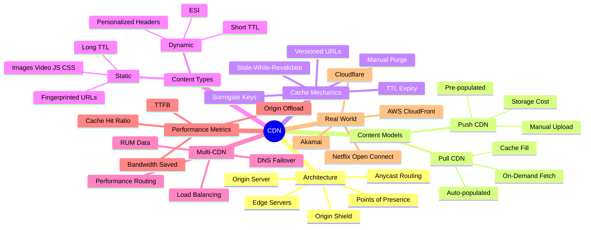
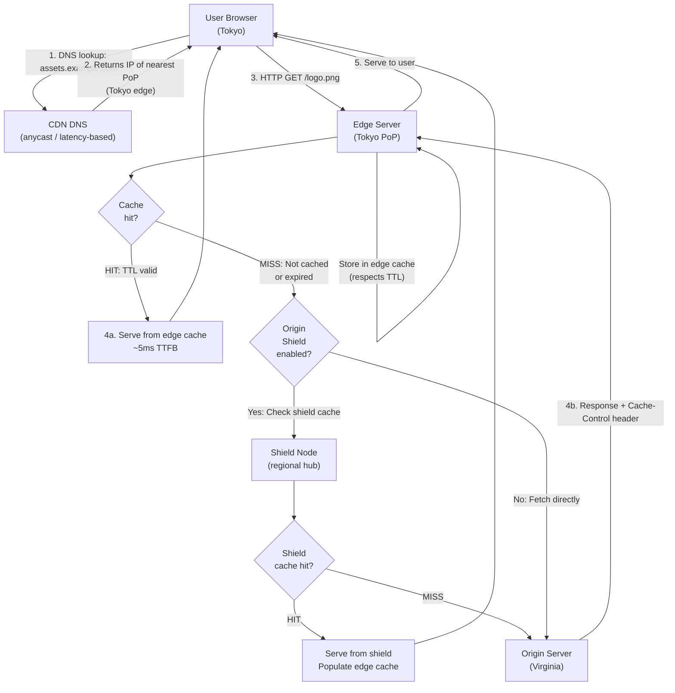
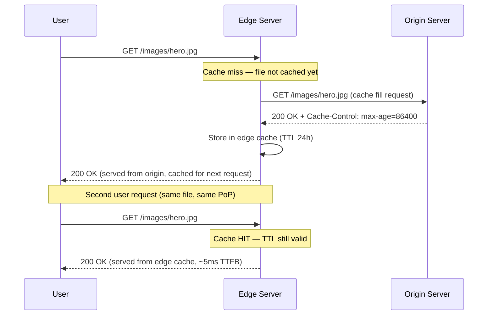
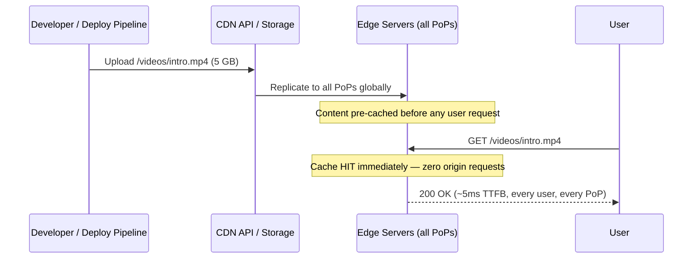
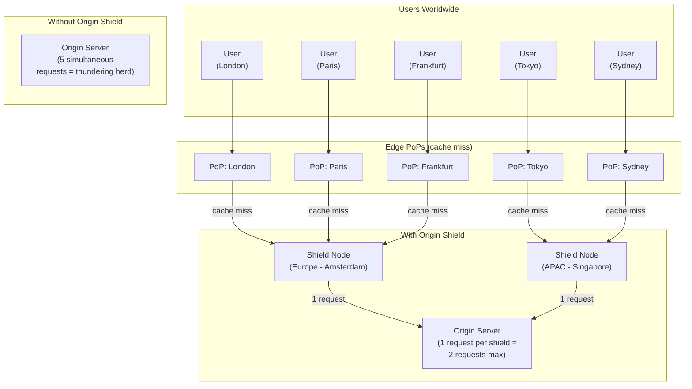
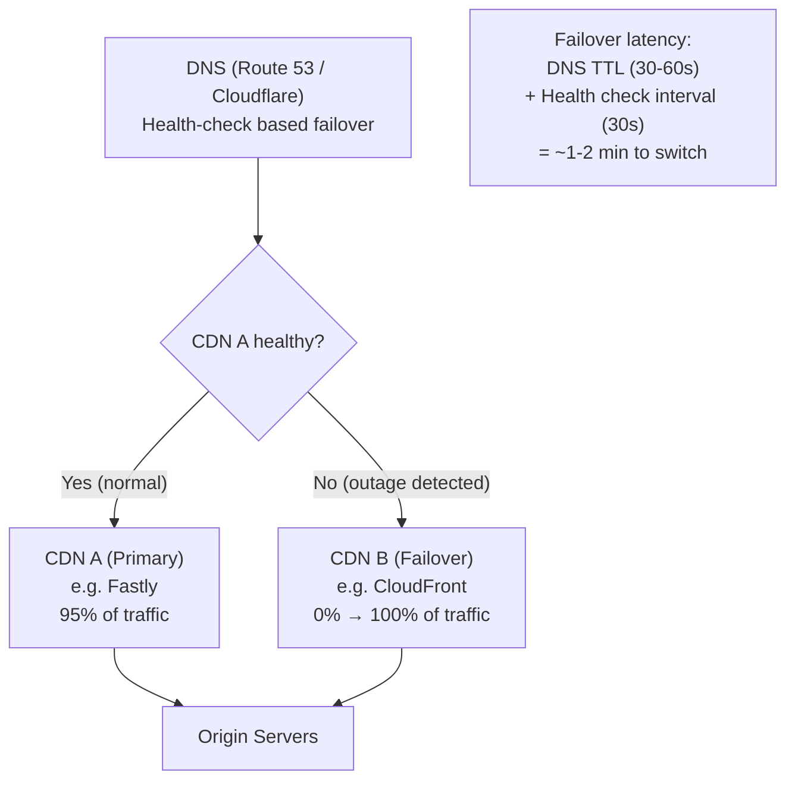
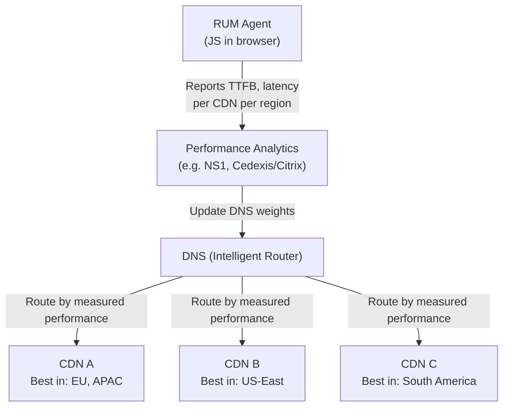

# Chapter 8: Content Delivery Networks


## Mind Map



## Overview

A Content Delivery Network (CDN) is a geographically distributed network of proxy servers — called **edge servers** — that cache and serve content from locations physically close to end users. When a user in Tokyo requests an image hosted on a server in Virginia, a CDN can serve that image from an edge node in Tokyo, cutting the round-trip distance from 14,000 km to a few kilometers.

CDNs are the outermost caching layer in the full caching hierarchy covered in [Chapter 7](/system-design/part-2-building-blocks/ch07-caching). Where application caches (Redis, Memcached) reduce load on databases, CDNs reduce load on origin servers and dramatically improve perceived latency for geographically dispersed users. DNS routing (covered in [Chapter 5](/system-design/part-2-building-blocks/ch05-dns)) determines which CDN edge node a user reaches — latency-based or geolocation DNS routing sends users to the nearest Point of Presence (PoP).

---

## How CDNs Work

Every CDN request begins with a DNS lookup. The CDN provider uses anycast routing or latency-based DNS to direct the user to the geographically closest edge server. From there, the edge either serves from its cache or fetches from origin.



### Edge Servers and Points of Presence

A **Point of Presence (PoP)** is a physical data center location in a CDN's network. Each PoP contains multiple edge servers — the actual machines that cache and serve content. Major CDN providers operate hundreds of PoPs globally:

- **Cloudflare:** 300+ PoPs in 100+ countries
- **Akamai:** 4,000+ PoPs — largest edge network
- **AWS CloudFront:** 600+ edge locations and 13 regional edge caches
- **Fastly:** 90+ PoPs with emphasis on programmable edge

The CDN uses **anycast routing**: multiple PoPs share the same IP address, and network routing automatically delivers traffic to the topologically nearest one. This is the same technique that makes Cloudflare's `1.1.1.1` DNS resolver consistently the fastest globally — requests are handled by the nearest datacenter without client-side logic.

---

## Push vs Pull CDN

The two fundamental CDN delivery models differ in how content gets onto edge servers — whether you push it proactively or the CDN pulls it on demand.

### Pull CDN — On-Demand Population



In a Pull CDN, content is fetched from origin the **first time** a user requests it. The edge caches the response and serves all subsequent requests from cache until the TTL expires. Setup is minimal — point the CDN at your origin and set Cache-Control headers.

**Trade-off:** The very first user to request any file pays the full origin latency. After that, all users at the same PoP get the cached version.

### Push CDN — Pre-populated Cache



In a Push CDN, you upload content to the CDN explicitly — typically via API or storage bucket. The CDN replicates it globally. Every user at every PoP gets immediate cache hits from the first request.

**Trade-off:** You pay storage costs at every PoP. You must manage content lifecycle (when to delete/update). Not suitable for user-generated or highly dynamic content.

### Push vs Pull Comparison

| Dimension | Pull CDN | Push CDN |
|---|---|---|
| **Setup complexity** | Low — just point to origin | High — requires upload pipeline |
| **Cold start latency** | First request hits origin | Zero — content pre-cached |
| **Storage cost** | Only caches what's requested | All content at all PoPs |
| **Origin load** | Low after warm-up | Zero (no origin fetches) |
| **Content freshness** | Controlled by Cache-Control TTL | Controlled by manual push/delete |
| **Best for** | Web assets, APIs, general content | Large files: video, software, game assets |
| **Real-world example** | Cloudflare with website assets | Netflix Open Connect video files |

**Rule of thumb:** Pull CDN for most web workloads. Push CDN when files are large, static, and access patterns are predictable.

---

## Origin Shielding

In a standard Pull CDN, a cache miss at any PoP triggers an origin request. For a global CDN with 300+ PoPs, a cache expiry or purge event can cause hundreds of simultaneous origin requests for the same file — a CDN-scale **thundering herd** problem.

**Origin shielding** inserts a designated regional hub server between the edge PoPs and the origin. Edge nodes that miss their local cache query the shield first; only the shield makes requests to origin.



**Benefits of origin shielding:**
- Reduces origin requests by 90–99% during cache misses and purge events
- Provides a second cache layer — if the shield has a cached copy, the edge gets it without hitting origin
- Protects origin from traffic spikes during viral content or deployments
- Concentrates origin access to known shield IPs, simplifying firewall rules

---

## Cache Invalidation at Edge

CDN edge caches respect `Cache-Control` headers from origin, but there are scenarios requiring immediate invalidation before TTL expiry — bug fixes, sensitive data removal, content corrections.

### Invalidation Methods

**1. TTL Expiry (passive)**

The standard approach: set `Cache-Control: max-age=N` on origin responses. Edge nodes serve cached content until TTL expires, then re-fetch from origin. Requires no CDN API calls but means stale content persists for up to TTL seconds after a change.

```
Cache-Control: max-age=3600         # 1 hour TTL
Cache-Control: max-age=86400        # 24 hour TTL
Cache-Control: s-maxage=600         # CDN TTL = 10 min, browser TTL separate
```

The `s-maxage` directive applies specifically to shared caches (CDNs, proxies), allowing you to set different TTLs for edge vs browser.

**2. Manual Purge (active)**

Issue a purge API call to the CDN to immediately invalidate a URL or path across all PoPs. Most CDNs propagate purges globally within seconds.

```bash
# Cloudflare purge single URL
curl -X POST "https://api.cloudflare.com/client/v4/zones/{zone_id}/purge_cache" \
  -H "Authorization: Bearer {token}" \
  -d '{"files": ["https://example.com/images/logo.png"]}'

# Cloudflare purge entire cache
curl -X POST ... -d '{"purge_everything": true}'
```

**Limitation:** Purging everything on every deploy is expensive and causes a thundering herd as all edges simultaneously re-fetch from origin. Prefer targeted purges.

**3. Versioned URLs (cache-busting)**

Embed a content hash or version number in the file path or query string. When content changes, the URL changes — old URL and new URL are entirely independent cache entries. Old URL automatically ages out by TTL.

```
# Old: served from edge cache
/static/app.abc123.js

# New build with changed code: different hash = different URL = cache miss + new cache entry
/static/app.def456.js
```

This is the preferred strategy for static assets (JS, CSS, images) in production. Combined with long TTLs (1 year), it gives maximum caching while guaranteeing users always get the latest build.

**4. Surrogate Keys / Cache Tags**

Advanced feature: tag cached responses with logical keys, then purge all content matching a tag in one API call. Supported by Fastly, Cloudflare Enterprise, Varnish.

```
# Origin response includes tag header
Surrogate-Key: product-123 category-shoes

# CDN API: purge all pages tagged product-123
POST /purge {"tags": ["product-123"]}
# Invalidates: product page, category page, search results — anything tagged
```

---

## Static vs Dynamic Content

CDNs were originally designed for static content but have expanded to handle dynamic, personalized, and even API responses.

### Static Content

Files that do not change per user or per request: JavaScript bundles, CSS, images, fonts, video files, software downloads.

**Best practices:**
- Use content-hashed filenames for fingerprinting (`app.a3f9c2.js`)
- Set very long TTLs: `Cache-Control: max-age=31536000, immutable` (1 year)
- The `immutable` directive tells browsers the file will never change and to skip revalidation
- Serve from CDN with `Vary: Accept-Encoding` to cache both gzip and brotli variants
- Use Push CDN for large media (video, game assets)

### Dynamic Content

Responses that vary per user, session, or request state: HTML pages, API responses, search results, personalized recommendations.

**Strategies for CDN-accelerating dynamic content:**

| Strategy | Mechanism | TTL | Use Case |
|---|---|---|---|
| **Short TTL caching** | Cache for 1–30 seconds | Very short | High-traffic landing pages with acceptable staleness |
| **Stale-while-revalidate** | Serve stale + refresh async | Flexible | API responses where slight staleness is acceptable |
| **Edge Side Includes (ESI)** | Cache page fragments separately | Per-fragment | Header/footer static, body dynamic |
| **Vary header** | Separate cache per header value | Normal | `Vary: Accept-Language` for localized pages |
| **Bypass for authenticated** | Skip cache for cookie/auth headers | N/A | Logged-in user pages never served from cache |

```
# Stale-while-revalidate: serve stale for up to 60s while refreshing in background
Cache-Control: max-age=30, stale-while-revalidate=60

# Bypass CDN cache for authenticated requests
Cache-Control: private, no-store
```

### Static vs Dynamic Comparison

| Dimension | Static Content | Dynamic Content |
|---|---|---|
| **TTL** | Hours to 1 year | Seconds to minutes (or no-cache) |
| **Cache key** | URL only | URL + headers (Accept, Cookie, Language) |
| **CDN model** | Push or Pull | Pull only |
| **Personalization** | Not applicable | Must bypass or use Vary/ESI |
| **Invalidation** | Versioned URLs (preferred) | Purge or short TTL |
| **Cache hit ratio** | 95–99%+ achievable | 30–70% typical |
| **Examples** | JS, CSS, images, video | API JSON, HTML pages, search results |

---

## Multi-CDN Strategies

Relying on a single CDN provider creates a vendor SPOF. In 2021, a Fastly outage took down large portions of the internet including Reddit, GitHub, The Guardian, and Amazon for ~1 hour. Multi-CDN architectures provide resilience and performance optimization.

### Failover Multi-CDN

The simplest approach: use CDN A as primary, CDN B as backup. DNS health checks detect CDN A degradation and automatically switch to CDN B.



**Key consideration:** Both CDNs must have warm caches (or be able to fill quickly) for failover to be seamless. A cold CDN B serves every request from origin until its cache warms, potentially overloading origin during the worst moment — an outage event.

### Performance Routing Multi-CDN

Use Real User Monitoring (RUM) data to continuously measure which CDN performs best for each geographic region and route traffic accordingly.



**Benefits:** Automatically adapts to CDN performance variations (peering issues, capacity), can achieve 10–20% TTFB improvement vs single CDN.

---

## CDN Performance Metrics

Understanding CDN performance requires tracking the right metrics. An interview answer that includes these demonstrates operational depth.

### Cache Hit Ratio

The percentage of requests served from edge cache without touching origin.

```
Cache Hit Ratio = (Cache Hits) / (Total Requests) × 100%

Example:
- 1,000,000 total requests
- 950,000 served from cache
- 50,000 fetched from origin
= 95% cache hit ratio
```

**Target:** 90%+ for static-heavy workloads. Below 80% suggests misconfigured Cache-Control headers, excessive cache variation (too many Vary header values), or high cache churn from low TTLs.

**Factors that hurt cache hit ratio:**
- Query string parameters treated as unique cache keys (`?v=1`, `?v=2`)
- Cookie-based variation caching different responses per session
- Low TTLs causing frequent cache expiry
- Long-tail URLs that are rarely re-requested

### Time to First Byte (TTFB)

The time elapsed between a user making a request and receiving the first byte of the response.

| Scenario | Typical TTFB |
|---|---|
| **Edge cache hit (same continent)** | 5–20ms |
| **Edge cache hit (same country)** | 1–10ms |
| **CDN miss → origin (intercontinental)** | 200–400ms |
| **Direct to origin (US to Asia)** | 150–300ms |
| **Direct to origin (same region)** | 20–80ms |

**TTFB target:** Under 200ms for cache hits, under 600ms for cache misses with origin shielding.

### Origin Offload

The percentage of requests handled by the CDN without reaching origin. Similar to cache hit ratio but often measured in bandwidth terms (bytes delivered from edge vs bytes fetched from origin).

```
Origin Offload = 1 - (Origin Requests / Total CDN Requests)
```

A 99% origin offload means origin handles only 1% of total traffic — the CDN absorbs 99x the traffic the origin would see without a CDN.

---

## Real-World Examples

### Netflix Open Connect

Netflix operates its own CDN — **Open Connect** — rather than relying entirely on third-party CDN providers. Key design decisions:

- **ISP partnerships:** Netflix places Open Connect Appliances (OCAs) — purpose-built storage servers — directly inside ISP data centers and internet exchange points, free of charge. The ISP benefits from reduced bandwidth costs; Netflix benefits from extremely low-latency delivery to that ISP's subscribers.
- **Push model:** OCAs are pre-populated each night during off-peak hours with the movies and shows predicted to be popular the next day, based on viewing history data. This is a pure Push CDN at the edge.
- **Scale:** Open Connect delivers 99%+ of Netflix video traffic globally. At peak, Netflix accounts for ~15% of all downstream internet traffic in North America.
- **Format strategy:** Files are transcoded into dozens of formats and bitrates, each stored as separate cached objects. Adaptive bitrate streaming means the CDN serves small video segments (~2-10 seconds each), not entire files.

### Cloudflare Network

Cloudflare operates one of the most unique CDN architectures:

- **Anycast everywhere:** All 300+ PoPs share the same IP addresses. BGP routing automatically directs users to the nearest PoP.
- **Argo Smart Routing:** Cloudflare's paid tier routes origin requests through Cloudflare's own private backbone (avoiding public internet) to reduce latency and packet loss.
- **Workers at the edge:** Cloudflare Workers allows JavaScript/WebAssembly execution at the edge — enabling dynamic content generation, A/B testing, and authentication without reaching origin. This blurs the boundary between CDN and serverless compute.
- **Cache everything:** Unlike traditional CDNs focused on static assets, Cloudflare can cache HTML and API responses with fine-grained rules, effectively CDN-accelerating full-stack dynamic applications.

---

## Key Takeaway

> A CDN is a **geographically distributed cache** that trades storage cost at the edge for dramatic reductions in latency, origin load, and bandwidth. The core design decisions are: **Push vs Pull** (pre-populate vs on-demand), **TTL vs purge** (passive expiry vs active invalidation), and **static vs dynamic** (long cache vs bypass or micro-TTL). Origin shielding concentrates the thundering herd; versioned URLs eliminate cache invalidation complexity for static assets. At scale, a well-configured CDN can absorb 95–99% of all traffic before it ever reaches your origin.

---

## CDN Comparison Tables

### CDN Provider Comparison (as of 2026)

| Provider | PoP Count | Pricing Model | DDoS Protection | Edge Compute | Best For |
|----------|-----------|--------------|----------------|--------------|----------|
| **Cloudflare** | 300+ cities, 100+ countries | Flat-rate plans (free tier available); bandwidth-based enterprise | Industry-leading — absorbs multi-Tbps attacks via anycast absorption | Cloudflare Workers (JS/WASM at edge, ~0ms cold start) | Security-first deployments, full-stack edge apps, cost-sensitive teams |
| **AWS CloudFront** | 600+ edge locations + 13 regional edge caches | Pay-per-GB + per-10K requests | AWS Shield Standard (free); Shield Advanced ($3K+/mo) | Lambda@Edge (Node.js/Python); CloudFront Functions (JS, sub-ms) | AWS-native stacks; S3/ALB integration; enterprise compliance requirements |
| **Akamai** | 4,000+ PoPs — largest edge network | Enterprise contracts; volume-based | Prolexic dedicated DDoS mitigation platform | EdgeWorkers (JS) | Largest enterprises; media delivery; regulated industries |
| **Fastly** | 90+ PoPs | Pay-per-GB; real-time billing | Standard DDoS included; Signal Sciences WAF | Compute@Edge (Rust/WASM, ultra-low cold start) | Programmable edge; real-time purge (150ms propagation); API-first teams |
| **Google Cloud CDN** | 100+ PoPs (Google backbone) | Pay-per-GB outbound; cache fill charged | Cloud Armor WAF + DDoS integration | Cloud Run at edge (preview) | GCP-native workloads; YouTube-proven infrastructure; global anycast |

> **Rule of thumb:** Cloudflare for cost + security; CloudFront for AWS-native; Akamai for largest enterprise SLAs; Fastly for programmable edge + fast purge; Google CDN for GCP-native.

---

### Push vs Pull CDN Detailed Comparison

| Dimension | Pull CDN | Push CDN |
|-----------|----------|----------|
| **Content upload** | Automatic — CDN fetches from origin on first cache miss per PoP | Manual — developer/pipeline uploads to CDN storage or API |
| **Storage cost** | Low — only caches requested content | High — content stored at every PoP regardless of access frequency |
| **Cache miss behavior** | First request per PoP pays full origin round-trip latency | Zero misses — content pre-cached before any user request |
| **TTL management** | Set via `Cache-Control` / `s-maxage` headers on origin responses | Managed explicitly; delete/replace API calls required |
| **Origin dependency** | Origin must be available for cache fills | Origin not needed after upload; fully decoupled |
| **Ideal content type** | Web assets, APIs, HTML pages, user-generated thumbnails | Large static files: video segments, software downloads, game assets |
| **Setup complexity** | Low — point DNS at CDN, set Cache-Control headers | High — requires upload pipeline + content lifecycle management |
| **Real-world example** | Cloudflare for website assets; CloudFront for REST APIs | Netflix Open Connect for video; Steam for game downloads |

---

## Related Chapters

| Chapter | Relevance |
|---------|-----------|
| [Ch05 — DNS](/system-design/part-2-building-blocks/ch05-dns) | DNS-based CDN routing and anycast selection |
| [Ch06 — Load Balancing](/system-design/part-2-building-blocks/ch06-load-balancing) | CDN sits in front of LB; origin shielding reduces LB load |
| [Ch07 — Caching](/system-design/part-2-building-blocks/ch07-caching) | CDN is a specialized cache; shares TTL and invalidation concepts |

---

## Practice Questions

### Beginner

1. **Push vs Pull CDN:** Design a CDN caching strategy for a video streaming platform serving 100M DAU across 6 continents, with a library of 50M videos (most rarely watched). How do you decide between Push and Pull CDN for this workload? How do you handle cache invalidation when a video is removed for rights violations within 1 hour?

   <details>
   <summary>Hint</summary>
   Pull CDN suits large catalogs with cold content (only cache what's requested); Push is better for small, hot content sets — rights removal requires an API-triggered purge, not waiting for TTL expiry.
   </details>

### Intermediate

2. **Low Cache Hit Ratio:** A news website achieves only a 45% CDN cache hit ratio despite serving mostly static HTML pages. Identify three likely causes and explain how you would diagnose and fix each one.

   <details>
   <summary>Hint</summary>
   Common culprits: `Cache-Control: no-store` headers set by the app framework, query string variations treated as unique cache keys, and personalized response headers (cookies) bypassing the cache.
   </details>

3. **Origin Shielding:** Explain origin shielding. Describe the request flow with and without shielding when a cache purge event fires across a CDN with 200 PoPs globally. How many origin requests does shielding prevent during the purge fill?

   <details>
   <summary>Hint</summary>
   Without shielding, each PoP independently misses on the first request after purge (up to 200 origin hits per object); with shielding, all 200 PoPs pull from one shield PoP, reducing origin load to 1 hit per object.
   </details>

4. **Partial Personalization:** An e-commerce platform has product pages that include personalized pricing for logged-in members. How would you structure CDN caching to serve the base page quickly while keeping personalized sections accurate? Consider edge-side includes (ESI) and client-side hydration as options.

   <details>
   <summary>Hint</summary>
   Cache the shell HTML at the CDN; deliver personalized data via a separate authenticated API call from the browser — or use ESI to stitch cached and non-cached fragments at the edge.
   </details>

### Advanced

5. **Cache-Busting Strategies:** Compare versioned URL cache-busting (`app.abc123.js`) versus manual CDN purge on deploy. When would you use each, and what operational failures does each strategy introduce at scale (1,000 deploys/day, 500 PoPs)?

   <details>
   <summary>Hint</summary>
   Versioned URLs never need purging (immutable by design) but require build tooling to inject hashes; manual purge is simpler to implement but introduces a propagation delay window where stale assets serve alongside new HTML.
   </details>
