# Chapter 9: Databases — SQL


> Relational databases have powered the internet for 50 years. They remain the default choice — until you have a deliberate reason to leave.

---

## Mind Map

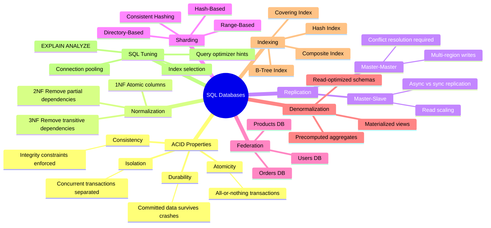

---

## RDBMS Fundamentals

A **Relational Database Management System (RDBMS)** organizes data into tables (relations) with rows and columns. Tables reference each other through foreign keys. The relational model enforces schema at write time, guarantees referential integrity, and exposes a declarative query language (SQL).

**Core concepts:**

| Concept | Description |
|---|---|
| Table | Named collection of rows sharing the same schema |
| Primary Key | Unique row identifier — enables O(1) lookups |
| Foreign Key | Column referencing a primary key in another table |
| Index | Auxiliary data structure accelerating queries |
| Transaction | Group of operations that succeed or fail together |
| View | Virtual table defined by a query |

### ACID Properties

ACID (covered in depth in [Ch03 — Core Trade-offs](/system-design/part-1-fundamentals/ch03-core-tradeoffs)) is the contract every RDBMS transaction upholds:

- **Atomicity** — A transaction either commits fully or rolls back entirely. No partial writes survive a crash.
- **Consistency** — Every transaction takes the database from one valid state to another. Constraints (NOT NULL, UNIQUE, FK) are always enforced.
- **Isolation** — Concurrent transactions execute as if they were sequential. The isolation level (READ COMMITTED, REPEATABLE READ, SERIALIZABLE) controls the trade-off between correctness and throughput.
- **Durability** — Once a commit acknowledgment is sent, data survives crashes. Achieved via write-ahead log (WAL) and fsync.

### Normalization

Normalization removes redundancy to improve data integrity and reduce write anomalies:

| Normal Form | Rule | Benefit |
|---|---|---|
| 1NF | All column values are atomic; no repeating groups | Enables relational operations |
| 2NF | No partial dependency on a composite key | Eliminates redundant data per partial key |
| 3NF | No transitive dependency (non-key → non-key) | Each fact stored in exactly one place |

**When to denormalize:** When read performance outweighs write simplicity. See the [Denormalization](#denormalization) section.

---

## Indexing

An index is a separate data structure maintained by the database that speeds up row lookups at the cost of additional storage and slower writes.

### B-Tree Index

The default index type in PostgreSQL and MySQL. A balanced tree where every leaf node is at the same depth.

```
                    [30 | 70]
                   /    |    \
           [10|20]   [40|60]   [80|90]
           /  |  \   /  | \   /  |  \
         [10][15][20][40][55][60][80][85][90]
              (leaf nodes with row pointers)
```

- **Reads:** O(log n) for equality, range, prefix queries
- **Writes:** O(log n) with page splits on insert
- **Best for:** `WHERE id = ?`, `WHERE created_at BETWEEN ?`, `ORDER BY` columns

### Hash Index

A hash map mapping column values to row locations.

- **Reads:** O(1) average for equality queries
- **Writes:** O(1) average
- **Limitation:** Cannot support range queries or ordering — only `=` comparisons
- **Best for:** `WHERE session_id = ?` (exact match only)

### Index Strategies

| Index Type | Use Case | Trade-off |
|---|---|---|
| Single column | Simple equality/range on one column | Minimal overhead |
| Composite | Multi-column `WHERE` + `ORDER BY` | Column order matters — leftmost prefix rule |
| Covering | All query columns in index (no heap lookup) | Large index, huge read speedup |
| Partial | Index only rows matching a condition | Smaller index for sparse predicates |
| Expression | Index on `LOWER(email)` or computed value | Useful for case-insensitive lookups |

**The leftmost prefix rule:** A composite index on `(a, b, c)` can accelerate queries on `(a)`, `(a, b)`, or `(a, b, c)` — but not `(b)` or `(c)` alone.

---

## Replication

Replication copies data across multiple database servers to achieve:
- **Read scaling** — distribute read queries across replicas
- **High availability** — failover if primary fails
- **Geographic distribution** — read from nearby replica

### Master-Slave Replication

One primary (master) accepts all writes. One or more replicas (slaves) receive those writes asynchronously and serve read queries.

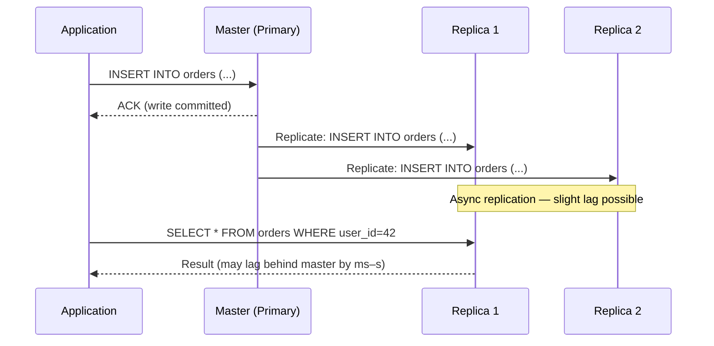

**Replication lag** is the key weakness. If a replica is behind by 500ms and a user reads immediately after writing, they may see stale data — a form of eventual consistency.

**Synchronous replication** eliminates lag at the cost of write latency: master waits for at least one replica to confirm before acknowledging the client. PostgreSQL supports this via `synchronous_standby_names`.

### Master-Master Replication

Both nodes accept reads and writes. Each node replicates to the other.

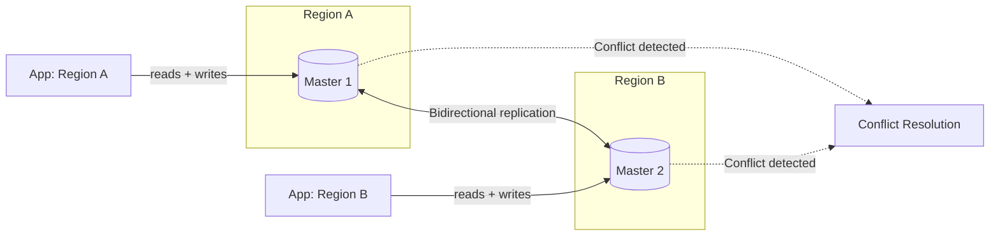

**Write conflicts** arise when two masters modify the same row simultaneously. Resolution strategies:

1. **Last-write-wins (LWW)** — timestamp determines winner; simple but lossy
2. **Application-level merge** — business logic merges conflicting versions
3. **Optimistic locking** — version counter; retry on conflict

### Replication Comparison

| Property | Master-Slave | Master-Master |
|---|---|---|
| Write throughput | Single writer (bottleneck) | Distributed writes |
| Read throughput | All replicas serve reads | Both nodes serve reads |
| Consistency | Strong on master, eventual on replicas | Eventual (conflict risk) |
| Failover | Manual or automatic promotion | Automatic (other master takes over) |
| Complexity | Low | High (conflict resolution required) |
| Best for | Read-heavy, single-region | Multi-region active-active writes |

---

## Sharding (Horizontal Partitioning)

Sharding splits one large table across multiple independent database servers (shards). Each shard holds a subset of rows and can be on different hardware. Unlike replication (copies), sharding divides data.

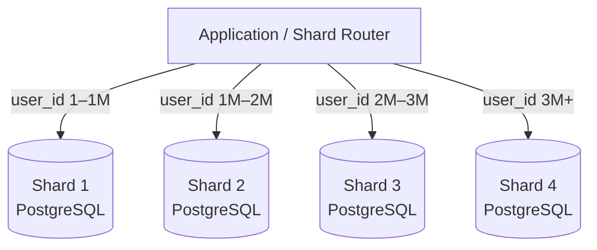

### Sharding Strategies

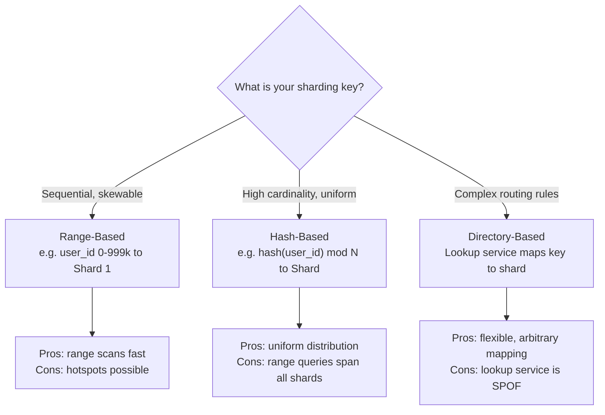

| Strategy | How It Works | Pros | Cons |
|---|---|---|---|
| Range-based | Shard by value range (`id` 0–999K → Shard 1) | Range queries on shard key are fast | Hotspots if values concentrate (e.g., new users) |
| Hash-based | `shard = hash(key) % num_shards` | Uniform distribution | Range queries require scatter-gather across all shards |
| Directory-based | Lookup table maps key → shard | Flexible; supports arbitrary layouts | Lookup service becomes bottleneck / SPOF |

### Consistent Hashing for Resharding

Hash-based sharding has a critical flaw: when you add or remove a shard, `hash(key) % N` changes for almost every key, causing a massive data migration.

**Consistent hashing** (covered in detail in [Ch06 — Load Balancing](/system-design/part-2-building-blocks/ch06-load-balancing)) places both keys and shards on a ring. Adding/removing a shard only remaps keys adjacent to that shard — typically `1/N` of all keys.

### Sharding Challenges

| Challenge | Description | Mitigation |
|---|---|---|
| Cross-shard joins | SQL JOIN across shards requires application-side merge | Denormalize, or use federation to avoid cross-shard queries |
| Cross-shard transactions | ACID across shards requires 2-phase commit (2PC) | Avoid distributed transactions; design shard key to contain transactions |
| Hotspots | One shard receives disproportionate traffic | Hash key or add shard prefix to spread load |
| Resharding | Adding shards requires data migration | Consistent hashing, virtual nodes, or range splitting |
| Schema changes | DDL must run on all shards | Automated migration tooling (gh-ost, pt-online-schema-change) |

---

## Federation (Functional Partitioning)

Federation splits the database by **function** rather than by row count. Instead of one monolithic database handling everything, you have separate databases per domain:

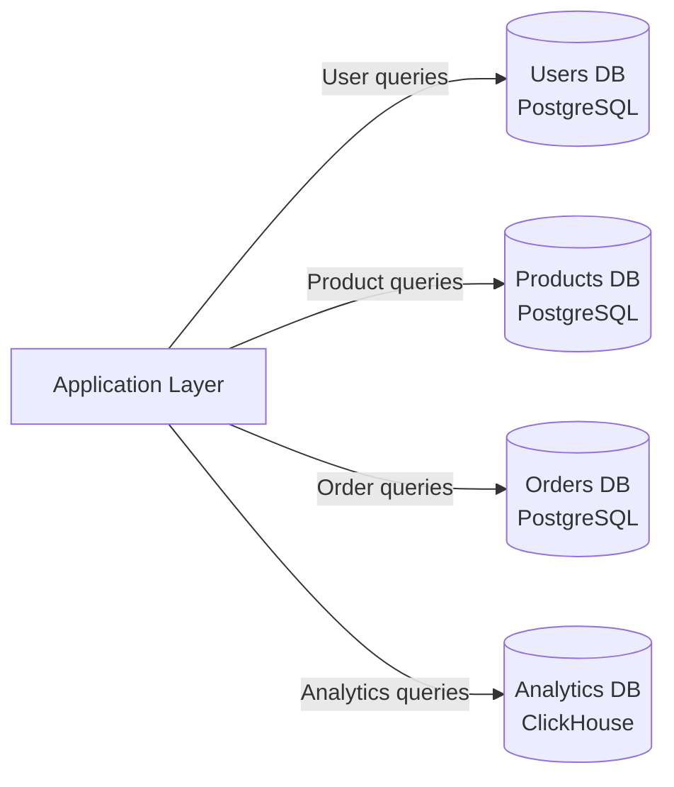

**Benefits:**
- Each database is smaller → fits in memory → faster queries
- Independent scaling: the Orders DB can be sharded separately from Users DB
- Independent schema evolution: Products team owns their schema
- Fault isolation: a broken Analytics DB does not affect Order processing

**Trade-offs:**
- Cross-domain joins require application-level merges (e.g., "get orders with user names")
- More database connections to manage
- Referential integrity across databases must be handled at application level
- Increases operational complexity (backups, migrations, monitoring × N databases)

**Federation vs Sharding:** Federation splits by **domain** (vertical cut); sharding splits by **row range** (horizontal cut). They are complementary — a federated Orders DB can itself be sharded across multiple servers.

---

## Denormalization

Normalization stores each fact exactly once, which is great for writes but can require expensive multi-table JOINs for reads. **Denormalization** deliberately introduces redundancy to optimize read performance.

### Common Denormalization Patterns

| Pattern | Description | Example |
|---|---|---|
| Duplicate columns | Copy a column from a referenced table | Store `user_name` in `orders` to avoid JOIN |
| Pre-joined tables | Flatten a frequently joined view | `order_details` merges `orders + products` |
| Materialized views | Precomputed query result stored as a table | Daily sales totals refreshed every hour |
| Precomputed aggregates | Store `comment_count` on `posts` table | Avoid `SELECT COUNT(*)` on every page load |
| Derived columns | Store computed value alongside source | Store `full_name = first_name + last_name` |

### When to Denormalize

Denormalize when:
- Read throughput is critical and JOINs are the bottleneck
- Data is read much more often than written (read:write ratio > 10:1)
- The JOIN tables are large and the query is in the hot path
- The denormalized data changes infrequently (low sync overhead)

**Do not denormalize when:**
- Write volume is high (maintaining redundant copies is expensive)
- Data changes frequently (stale denormalized data is hard to avoid)
- You have not first confirmed the JOIN is the actual bottleneck (profile first)

### Write Complexity Trade-off

Every denormalized copy must be updated on every write. If `user_name` is stored in 5 tables, a user rename requires 5 UPDATE statements — ideally in a single transaction.

---

## SQL Tuning

### EXPLAIN ANALYZE

Before optimizing, measure. Use `EXPLAIN ANALYZE` (PostgreSQL) or `EXPLAIN` (MySQL) to show the query execution plan:

```sql
EXPLAIN ANALYZE
SELECT o.id, u.name, p.title
FROM orders o
JOIN users u ON o.user_id = u.id
JOIN products p ON o.product_id = p.id
WHERE o.created_at > NOW() - INTERVAL '7 days';
```

The output reveals: sequential scans vs index scans, estimated vs actual row counts, and which JOIN algorithm was chosen (nested loop, hash join, merge join).

### Tuning Checklist

| Technique | Description |
|---|---|
| Add indexes on filter columns | `WHERE`, `JOIN ON`, `ORDER BY` columns are index candidates |
| Avoid `SELECT *` | Fetch only needed columns; enables covering indexes |
| Avoid functions on indexed columns | `WHERE LOWER(email) = ?` prevents index use — use expression index instead |
| Limit result sets | Always use `LIMIT` with `OFFSET` for pagination |
| Use connection pooling | PgBouncer (PostgreSQL) or ProxySQL (MySQL) — reuse DB connections |
| Vacuum / ANALYZE | PostgreSQL requires `VACUUM` to reclaim dead tuples and update statistics |
| Partition large tables | PostgreSQL table partitioning for time-series data (monthly partitions) |
| Read replicas for analytics | Route `SELECT` aggregations to replica, not primary |

---

## When to Use SQL

| Criterion | Use SQL When... |
|---|---|
| Data relationships | Complex relationships between entities (e.g., users → orders → products) |
| Transaction requirements | Multi-row, multi-table atomicity is required |
| Query patterns | Ad-hoc queries; analytics; JOIN-heavy reporting |
| Schema | Schema is known upfront and relatively stable |
| Compliance | Financial, healthcare, or audit requirements demand ACID guarantees |
| Team familiarity | SQL expertise is more common than NoSQL expertise on your team |

---

## Real-World Examples

### Instagram: PostgreSQL → Sharding at Scale

Instagram started with a single PostgreSQL server. As it grew to 100M+ users, they implemented **horizontal sharding** using PostgreSQL:

- Split `media`, `users`, `follows`, and `likes` into separate databases (federation)
- Each federated database further sharded: 512 logical shards per database cluster
- Logical shards are remappable to physical servers without application changes
- Used consistent hashing to distribute user data across shards
- Result: 100+ physical PostgreSQL servers, all hidden behind a routing layer

**Key insight:** Start monolithic. Federate first. Shard within each federated domain. Never shard prematurely.

### MySQL at Facebook

Facebook runs MySQL at massive scale for their social graph storage:

- Deployed thousands of MySQL shards partitioned by user ID
- Built custom tools: **MHA** (Master High Availability) for automatic failover
- Use semi-synchronous replication to reduce data loss window
- Route reads to replicas; writes to master; cross-shard queries are minimized by design
- Separate read and write paths at application layer via Tao (their graph layer)

---

## Key Takeaway

> SQL databases are the workhorse of the industry. Master replication before sharding, shard by a key that distributes writes evenly, federate by domain to keep each database small, and denormalize only after profiling proves the JOIN is the bottleneck. ACID guarantees are worth the complexity for data where correctness is non-negotiable.

---

## Transaction Isolation Levels

ACID's "I" (Isolation) is not binary — there is a configurable spectrum. Higher isolation prevents more anomalies but reduces concurrency. Every major RDBMS defaults to something in the middle.

### Isolation Anomalies

| Anomaly | Description | Example |
|---|---|---|
| **Dirty Read** | Transaction reads uncommitted data from another transaction | Read a balance update that was later rolled back |
| **Non-repeatable Read** | Reading the same row twice in one transaction yields different values | Row updated by concurrent transaction between your two reads |
| **Phantom Read** | A range query returns different rows on re-execution | New row inserted by concurrent transaction matches your WHERE clause |

### Isolation Levels Matrix

| Isolation Level | Dirty Read | Non-repeatable Read | Phantom Read | Performance | Default In |
|---|---|---|---|---|---|
| **Read Uncommitted** | Possible | Possible | Possible | Highest | Rarely used |
| **Read Committed** | Prevented | Possible | Possible | High | PostgreSQL, Oracle |
| **Repeatable Read** | Prevented | Prevented | Possible* | Medium | MySQL InnoDB |
| **Serializable** | Prevented | Prevented | Prevented | Lowest | CockroachDB, Spanner |

*InnoDB prevents phantoms at Repeatable Read via gap locks; PostgreSQL uses MVCC snapshot isolation instead.

### Dirty Read Scenario

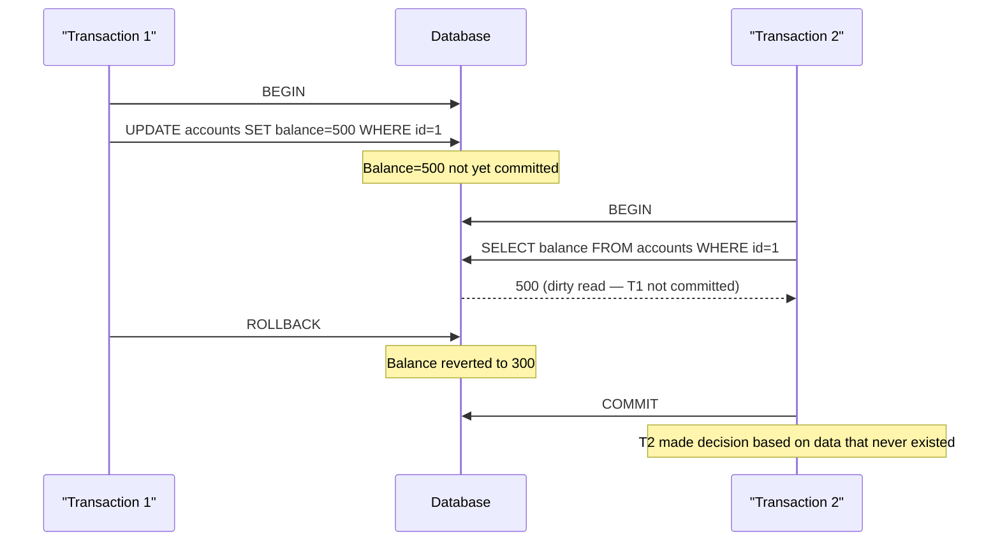

**When isolation levels matter in practice:**

- **Read Committed** (default in PostgreSQL): Safe for most OLTP workloads. Allows non-repeatable reads — acceptable if you do not re-read rows within a transaction.
- **Repeatable Read**: Use when a transaction reads the same data multiple times and must see consistent values — e.g., generating a report that spans multiple queries.
- **Serializable**: Use for financial transfers, inventory deductions, or any operation where phantom reads could cause correctness failures.

---

## Multi-Version Concurrency Control (MVCC)

Traditional locking blocks readers when writers are active. MVCC eliminates this by keeping multiple versions of each row, allowing readers and writers to proceed concurrently without blocking.

### How PostgreSQL Implements MVCC

Every row in PostgreSQL has two hidden system columns:
- `xmin` — the transaction ID that created this row version
- `xmax` — the transaction ID that deleted/updated this row (0 if still live)

When a transaction updates a row, it does **not** overwrite the old version. Instead it:
1. Marks the old row with `xmax = current_txid`
2. Inserts a new row version with `xmin = current_txid`

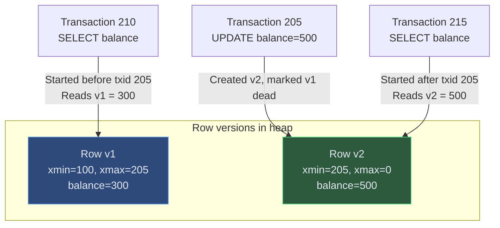

### MVCC vs Traditional Locking

| Property | MVCC | Traditional Locking |
|---|---|---|
| **Reader blocks writer** | Never | Yes (shared lock) |
| **Writer blocks reader** | Never | Yes (exclusive lock) |
| **Writer blocks writer** | Yes (conflict on same row) | Yes |
| **Storage overhead** | Dead tuples accumulate — need VACUUM | No dead tuples |
| **Snapshot isolation** | Natural — each transaction sees a snapshot | Requires range locks |
| **Used by** | PostgreSQL, Oracle, MySQL InnoDB | SQL Server (page locking mode) |

**VACUUM**: PostgreSQL periodically runs `VACUUM` to reclaim storage from dead row versions. Without it, tables grow unboundedly. `autovacuum` handles this automatically but must be tuned for write-heavy tables.

> **Cross-reference:** MVCC is the mechanism enabling PostgreSQL's Read Committed and Repeatable Read isolation levels. For how this interacts with distributed systems, see [Ch03 — PACELC](/system-design/part-1-fundamentals/ch03-core-tradeoffs).

---

## B-Tree vs LSM-Tree Storage Engines

The storage engine determines how data is physically laid out on disk — which directly governs read vs. write performance characteristics.

### B-Tree (Read-Optimized)

B-Trees organize data in a balanced tree where every update is an **in-place write** to a specific page on disk.

```
Write path: locate page → load page from disk → modify in memory → write back
Read path:  traverse tree (O(log n)) → load leaf page → return row
```

**Used by:** PostgreSQL heap storage, MySQL InnoDB, SQLite, most traditional RDBMS.

### LSM-Tree (Write-Optimized)

Log-Structured Merge Trees append all writes to an in-memory buffer (MemTable), flush to disk as immutable sorted files (SSTables), and merge (compact) those files in the background.

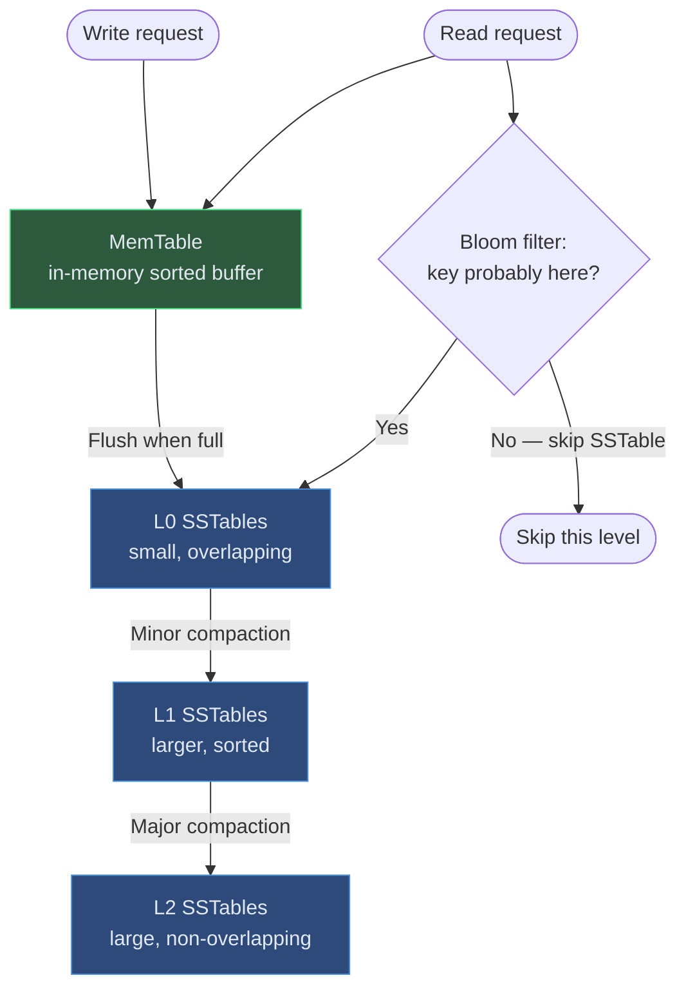

**Used by:** RocksDB, LevelDB, Cassandra, HBase, ScyllaDB, InfluxDB.

### B-Tree vs LSM-Tree Comparison

| Property | B-Tree | LSM-Tree |
|---|---|---|
| **Write performance** | Medium — in-place page writes, random I/O | High — sequential append, batch flush |
| **Read performance** | High — direct tree traversal | Medium — may check multiple SSTables + bloom filters |
| **Write amplification** | Low (~1×) | High (compaction rewrites data multiple times, 10–30×) |
| **Read amplification** | Low (O(log n) pages) | Medium (check MemTable + multiple SSTable levels) |
| **Space amplification** | Low | Medium (tombstones + not-yet-compacted duplicates) |
| **Update semantics** | In-place overwrite | Append new version; old version removed at compaction |
| **Compression** | Per-page | Per-SSTable (better compression ratios) |
| **Best use case** | Read-heavy OLTP (dashboards, reporting) | Write-heavy workloads (IoT, logging, time-series) |
| **Example databases** | PostgreSQL, MySQL, SQLite | RocksDB, Cassandra, HBase |

**Rule of thumb:** If writes dominate (>70% of operations), LSM-Tree is likely faster. If reads dominate or you need predictable read latency, B-Tree wins.

---

## Database Locking Strategies

When multiple transactions access the same data, the database must coordinate to prevent anomalies. Two fundamental approaches:

### Pessimistic Locking

Assume conflict will happen — acquire a lock before reading or writing.

```sql
-- Pessimistic: lock the row for the entire transaction
BEGIN;
SELECT balance FROM accounts WHERE id = 1 FOR UPDATE;  -- acquires exclusive lock
UPDATE accounts SET balance = balance - 100 WHERE id = 1;
COMMIT;  -- lock released
```

### Optimistic Locking

Assume conflict is rare — proceed without locks, but check for conflicts at commit time using a version counter.

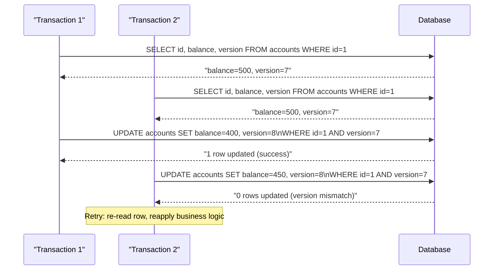

### Locking Strategy Comparison

| Property | Pessimistic | Optimistic |
|---|---|---|
| **Conflict assumption** | High contention expected | Low contention expected |
| **Lock duration** | Entire transaction | No lock held (check at commit) |
| **Throughput under low contention** | Lower — unnecessary locking overhead | Higher — no blocking |
| **Throughput under high contention** | Better — avoids retry storms | Lower — many retries |
| **Deadlock risk** | Yes — two transactions can deadlock | No — no locks held |
| **Implementation** | `SELECT FOR UPDATE`, `LOCK TABLE` | Version column + conditional UPDATE |
| **Best for** | Inventory deductions, seat booking, money transfer | User profile updates, shopping cart changes |

**Deadlock example with pessimistic locking:**

```
T1 locks Row A, waits for Row B
T2 locks Row B, waits for Row A
→ Deadlock detected by DB → one transaction rolled back → retry
```

Prevention: always acquire locks in the **same order** across transactions.

---

## Advanced Index Types

Beyond standard B-Tree and Hash indexes, modern databases offer specialized index types that can dramatically improve performance for specific access patterns.

| Index Type | How It Works | Best For | Overhead | Example |
|---|---|---|---|---|
| **Covering Index** | Includes all columns needed by a query — no heap lookup | High-frequency SELECT with known column set | Larger index size | `CREATE INDEX ON orders (user_id) INCLUDE (status, total)` |
| **Partial Index** | Indexes only rows matching a WHERE condition | Sparse predicates (e.g., only active users) | Smaller — indexes a subset | `CREATE INDEX ON users (email) WHERE active = true` |
| **Expression Index** | Indexes a computed expression, not a raw column | Case-insensitive lookups, derived values | Recomputed on every write | `CREATE INDEX ON users (LOWER(email))` |
| **GIN (Generalized Inverted)** | Inverted index over composite values (arrays, JSONB, tsvector) | Full-text search, JSONB key queries, array `@>` | Slower writes, large index | `CREATE INDEX ON posts USING GIN (search_vector)` |
| **GiST (Generalized Search Tree)** | Pluggable tree for non-scalar types | Geometric data, range types, nearest-neighbor | Complex — depends on operator class | `CREATE INDEX ON locations USING GIST (coordinates)` |
| **BRIN (Block Range Index)** | Stores min/max per block range, not per row | Huge append-only tables with natural ordering | Tiny — 1 entry per block range | `CREATE INDEX ON events USING BRIN (created_at)` |

### When to Use Each

```
Query: WHERE LOWER(email) = ?        → Expression index on LOWER(email)
Query: WHERE tags @> ARRAY['golang'] → GIN index on tags
Query: WHERE location <-> point ...  → GiST index on geometry column
Query: WHERE created_at > last_month → BRIN on append-only time-series table
Query: SELECT id, status FROM orders WHERE user_id = ?  → Covering index (user_id) INCLUDE (status)
```

**Index bloat:** Unused indexes slow down writes without helping reads. Periodically query `pg_stat_user_indexes` to identify zero-scan indexes and drop them.

> **Cross-references:** Index storage engines (B-Tree internals) are covered in the section above. For how NoSQL databases handle indexing differently, see [Ch10 — NoSQL](/system-design/part-2-building-blocks/ch10-databases-nosql). For replication and consistency trade-offs, see [Ch03 — PACELC](/system-design/part-1-fundamentals/ch03-core-tradeoffs) and [Ch15 — Replication](/system-design/part-3-architecture-patterns/ch15-data-replication-consistency).

---

## Case Study: Figma's PostgreSQL Scaling Journey

Figma is a browser-based collaborative design tool. By 2020 their user base was doubling annually — and their single PostgreSQL instance was reaching connection saturation, replication lag spikes, and slow query times on analytics workloads.

### Context and Challenges

| Challenge | Root Cause | Symptoms |
|---|---|---|
| Connection exhaustion | Each web server opens its own PG connection; PG process-per-connection model limits ~500 concurrent | `FATAL: remaining connection slots reserved` errors under load |
| Replication lag | Heavy write workload on a single primary; replicas couldn't keep up | Analytics queries reading stale data; delayed dashboards |
| Partition growth | A single `documents` table grew to hundreds of millions of rows | Query planner choosing sequential scans despite indexes |
| Cross-team query coupling | All teams queried the same DB; a bad analytics query starved OLTP | Latency spikes on the design canvas during batch reports |

### Solution Architecture

Figma addressed each challenge in layers rather than a single "big bang" migration:

**Step 1 — PgBouncer for connection pooling**

Instead of each app server holding a dedicated PostgreSQL connection, all connections first go through PgBouncer, which maintains a smaller pool of actual backend connections and multiplexes thousands of client connections onto them.

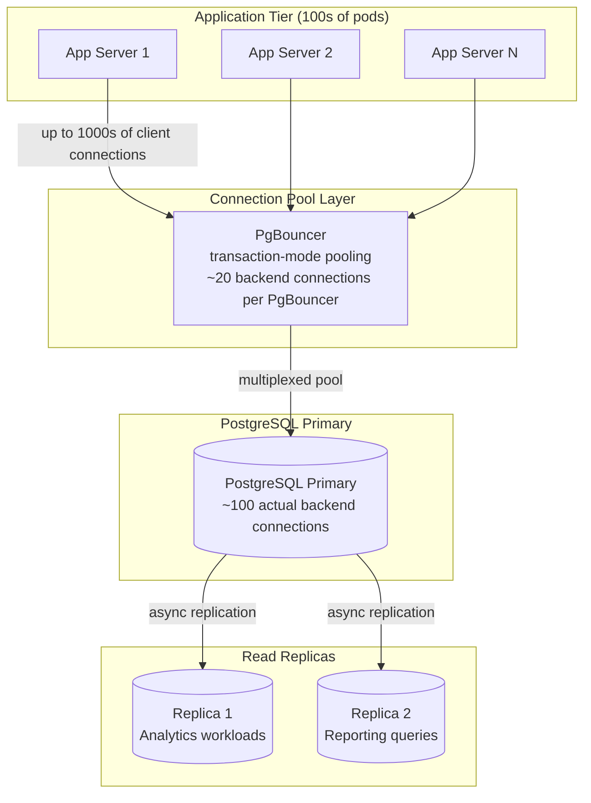

**Step 2 — Read replicas for analytics isolation**

Analytics and reporting queries were routed to dedicated read replicas, removing them from the primary's query queue entirely. This reduced replication lag on the primary because it was no longer competing with heavy read workloads.

**Step 3 — Horizontal sharding by organization ID**

For the largest tables (documents, files, comments), Figma sharded by `organization_id` — a natural boundary because most queries are scoped to a single organization. This keeps cross-shard queries rare.

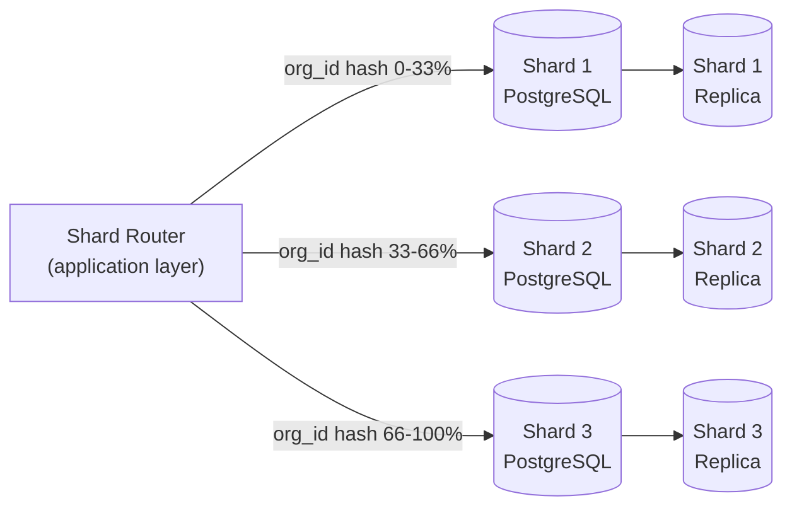

### Trade-offs and Decisions

| Decision | Benefit | Trade-off Accepted |
|---|---|---|
| PgBouncer transaction-mode pooling | Handles thousands of clients with small backend pool | Prepared statements and session-level variables not preserved across transactions |
| Shard key = `organization_id` | Cross-shard queries are rare; most work stays in one shard | Large enterprise orgs land on one shard — requires shard-level capacity planning |
| Read replicas for analytics | Primary fully dedicated to OLTP writes and reads | Replication lag means analytics may be seconds behind; acceptable for dashboards |
| Stay on PostgreSQL (not migrate to NoSQL) | ACID guarantees; complex queries via SQL; team familiarity | More operational complexity than managed NoSQL; requires sharding discipline |

### Key Takeaways

1. **Connection pooling is not optional at scale.** PostgreSQL's process-per-connection model caps at ~500-1000 connections; PgBouncer is the standard solution.
2. **Separate read workloads early.** Analytics queries on the primary cause replication lag that affects OLTP responsiveness. Route to replicas before you feel the pain.
3. **Shard by your natural access boundary.** `organization_id` was Figma's natural isolation unit — most queries never needed to cross it. Sharding along this boundary eliminated 95%+ of cross-shard joins.
4. **Relational DBs CAN scale horizontally.** With sharding, connection pooling, and replica routing, PostgreSQL handled Figma's scale without migrating to NoSQL.

> **Cross-references:** Connection pooling is mentioned in the SQL Tuning section above. For how shard routing interacts with consistency, see [Ch03 — PACELC](/system-design/part-1-fundamentals/ch03-core-tradeoffs). For replication mechanics, see [Ch15 — Replication](/system-design/part-3-architecture-patterns/ch15-data-replication-consistency).

---

## Related Chapters

| Chapter | Relevance |
|---------|-----------|
| [Ch03 — Core Trade-offs](/system-design/part-1-fundamentals/ch03-core-tradeoffs) | PACELC model underpins SQL consistency choices |
| [Ch10 — NoSQL Databases](/system-design/part-2-building-blocks/ch10-databases-nosql) | Compare SQL vs NoSQL trade-offs for data model decisions |
| [Ch15 — Replication & Consistency](/system-design/part-3-architecture-patterns/ch15-data-replication-consistency) | Replication mechanics for read replicas and failover |
| [Ch14 — Event-Driven Architecture](/system-design/part-3-architecture-patterns/ch14-event-driven-architecture) | Distributed transactions (2PC, Saga) across SQL databases |

---

## Practice Questions

### Beginner

1. **Replication Lag:** A user updates their profile picture, then immediately loads their profile page and sees the old picture. Explain the root cause (read replica lag) and describe two architectural fixes at different layers of the stack.

   <details>
   <summary>Hint</summary>
   The read was routed to a replica that hasn't received the write yet — fix either by reading from the primary for the user's own profile, or by using read-your-writes consistency via session-sticky routing.
   </details>

2. **Denormalization Decision:** An e-commerce site stores `product_price` in the `order_line_items` table (a denormalized copy from `products`). A junior engineer says this is wrong because prices are duplicated. Is it wrong? Defend your answer with reference to what the data represents.

   <details>
   <summary>Hint</summary>
   Order line items record the price *at time of purchase* — denormalization is intentional here because the historical order must not change if the product price is later updated.
   </details>

### Intermediate

3. **Sharding Key Selection:** You are sharding a `messages` table across 8 shards. Your options are: shard by `sender_id`, `receiver_id`, or `conversation_id`. Which do you choose, what queries does your choice enable, and what queries become expensive or impossible?

   <details>
   <summary>Hint</summary>
   Shard by `conversation_id` to keep all messages for a conversation on one shard, enabling efficient history queries; sharding by sender or receiver scatters a conversation across shards.
   </details>

4. **Federation Trade-off:** An order service needs to display "orders with customer names." The orders DB and users DB are federated into separate databases. How do you handle the JOIN efficiently without cross-database queries, and what consistency guarantees does your approach make?

   <details>
   <summary>Hint</summary>
   Denormalize `customer_name` into the orders table at write time, or perform the join at the application layer with a batch lookup — both avoid cross-database JOINs at the cost of some consistency.
   </details>

### Advanced

5. **Resharding Migration:** Your hash-based sharding uses `hash(id) % 4` across 4 shards. You need to add a 5th shard without downtime. Describe the full migration challenge (what percentage of rows must move), how consistent hashing reduces that percentage, and what double-write strategy you would use during the transition window.

   <details>
   <summary>Hint</summary>
   Modulo resharding moves ~80% of rows; consistent hashing moves ~20% — use a shadow write to the new shard topology while reads still go to the old, then cut over after backfill validation.
   </details>

---

*Next: [Chapter 10 — Databases: NoSQL →](/system-design/part-2-building-blocks/ch10-databases-nosql)*
*Previous: [Chapter 08 — CDN ←](/system-design/part-2-building-blocks/ch08-cdn)*
