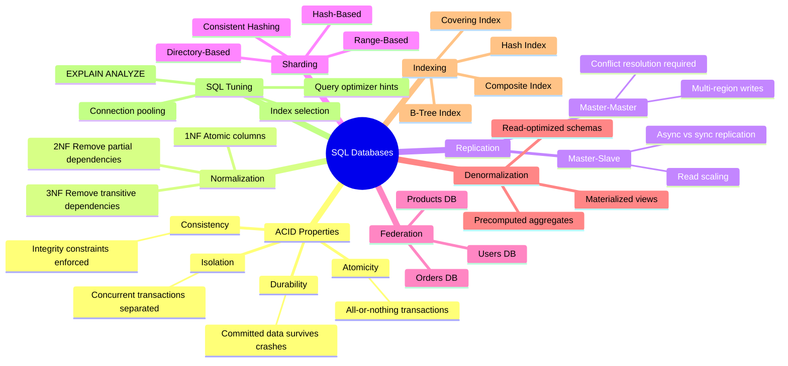
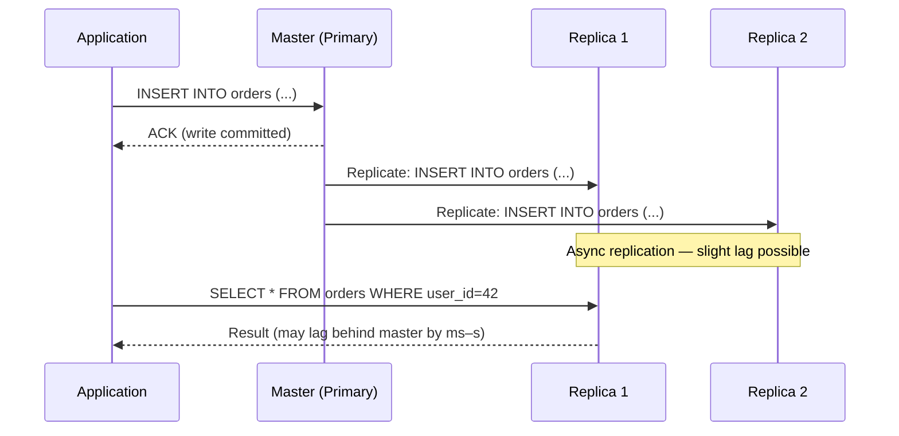
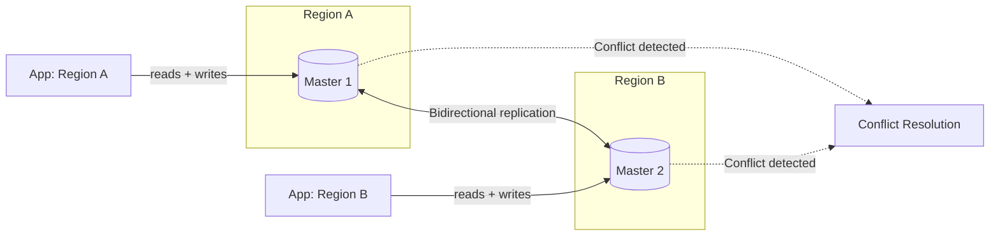
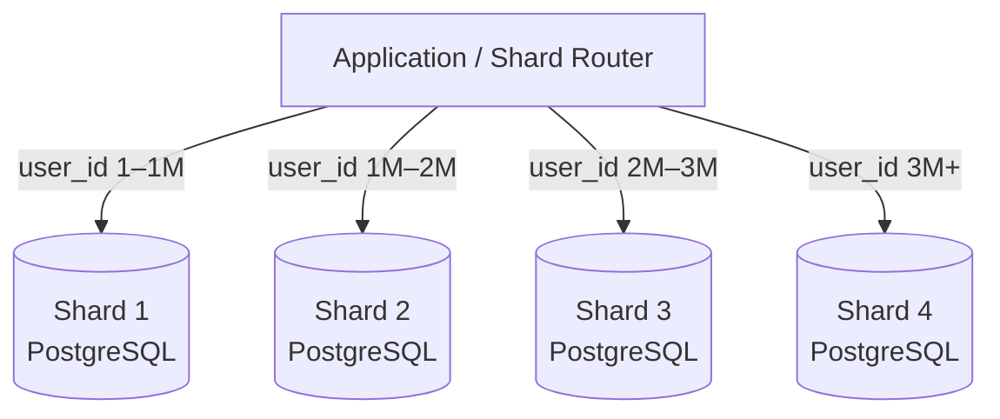
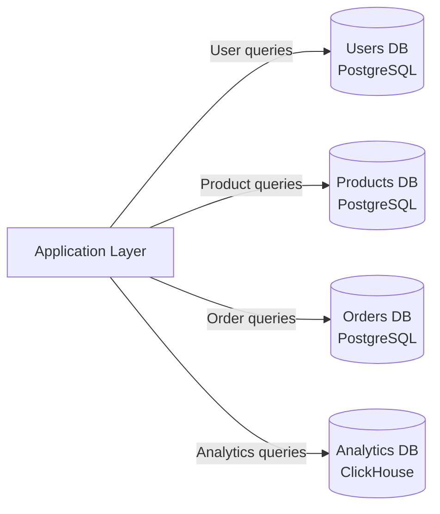

# Chapter 9: Databases — SQL


> Relational databases have powered the internet for 50 years. They remain the default choice — until you have a deliberate reason to leave.

---

## Mind Map



---

## RDBMS Fundamentals

A **Relational Database Management System (RDBMS)** organizes data into tables (relations) with rows and columns. Tables reference each other through foreign keys. The relational model enforces schema at write time, guarantees referential integrity, and exposes a declarative query language (SQL).

**Core concepts:**

| Concept | Description |
|---|---|
| Table | Named collection of rows sharing the same schema |
| Primary Key | Unique row identifier — enables O(1) lookups |
| Foreign Key | Column referencing a primary key in another table |
| Index | Auxiliary data structure accelerating queries |
| Transaction | Group of operations that succeed or fail together |
| View | Virtual table defined by a query |

### ACID Properties

ACID (covered in depth in [Ch03 — Core Trade-offs](/system-design/part-1-fundamentals/ch03-core-tradeoffs)) is the contract every RDBMS transaction upholds:

- **Atomicity** — A transaction either commits fully or rolls back entirely. No partial writes survive a crash.
- **Consistency** — Every transaction takes the database from one valid state to another. Constraints (NOT NULL, UNIQUE, FK) are always enforced.
- **Isolation** — Concurrent transactions execute as if they were sequential. The isolation level (READ COMMITTED, REPEATABLE READ, SERIALIZABLE) controls the trade-off between correctness and throughput.
- **Durability** — Once a commit acknowledgment is sent, data survives crashes. Achieved via write-ahead log (WAL) and fsync.

### Normalization

Normalization removes redundancy to improve data integrity and reduce write anomalies:

| Normal Form | Rule | Benefit |
|---|---|---|
| 1NF | All column values are atomic; no repeating groups | Enables relational operations |
| 2NF | No partial dependency on a composite key | Eliminates redundant data per partial key |
| 3NF | No transitive dependency (non-key → non-key) | Each fact stored in exactly one place |

**When to denormalize:** When read performance outweighs write simplicity. See the [Denormalization](#denormalization) section.

---

## Indexing

An index is a separate data structure maintained by the database that speeds up row lookups at the cost of additional storage and slower writes.

### B-Tree Index

The default index type in PostgreSQL and MySQL. A balanced tree where every leaf node is at the same depth.

```
                    [30 | 70]
                   /    |    \
           [10|20]   [40|60]   [80|90]
           /  |  \   /  | \   /  |  \
         [10][15][20][40][55][60][80][85][90]
              (leaf nodes with row pointers)
```

- **Reads:** O(log n) for equality, range, prefix queries
- **Writes:** O(log n) with page splits on insert
- **Best for:** `WHERE id = ?`, `WHERE created_at BETWEEN ?`, `ORDER BY` columns

### Hash Index

A hash map mapping column values to row locations.

- **Reads:** O(1) average for equality queries
- **Writes:** O(1) average
- **Limitation:** Cannot support range queries or ordering — only `=` comparisons
- **Best for:** `WHERE session_id = ?` (exact match only)

### Index Strategies

| Index Type | Use Case | Trade-off |
|---|---|---|
| Single column | Simple equality/range on one column | Minimal overhead |
| Composite | Multi-column `WHERE` + `ORDER BY` | Column order matters — leftmost prefix rule |
| Covering | All query columns in index (no heap lookup) | Large index, huge read speedup |
| Partial | Index only rows matching a condition | Smaller index for sparse predicates |
| Expression | Index on `LOWER(email)` or computed value | Useful for case-insensitive lookups |

**The leftmost prefix rule:** A composite index on `(a, b, c)` can accelerate queries on `(a)`, `(a, b)`, or `(a, b, c)` — but not `(b)` or `(c)` alone.

---

## Replication

Replication copies data across multiple database servers to achieve:
- **Read scaling** — distribute read queries across replicas
- **High availability** — failover if primary fails
- **Geographic distribution** — read from nearby replica

### Master-Slave Replication

One primary (master) accepts all writes. One or more replicas (slaves) receive those writes asynchronously and serve read queries.



**Replication lag** is the key weakness. If a replica is behind by 500ms and a user reads immediately after writing, they may see stale data — a form of eventual consistency.

**Synchronous replication** eliminates lag at the cost of write latency: master waits for at least one replica to confirm before acknowledging the client. PostgreSQL supports this via `synchronous_standby_names`.

### Master-Master Replication

Both nodes accept reads and writes. Each node replicates to the other.



**Write conflicts** arise when two masters modify the same row simultaneously. Resolution strategies:

1. **Last-write-wins (LWW)** — timestamp determines winner; simple but lossy
2. **Application-level merge** — business logic merges conflicting versions
3. **Optimistic locking** — version counter; retry on conflict

### Replication Comparison

| Property | Master-Slave | Master-Master |
|---|---|---|
| Write throughput | Single writer (bottleneck) | Distributed writes |
| Read throughput | All replicas serve reads | Both nodes serve reads |
| Consistency | Strong on master, eventual on replicas | Eventual (conflict risk) |
| Failover | Manual or automatic promotion | Automatic (other master takes over) |
| Complexity | Low | High (conflict resolution required) |
| Best for | Read-heavy, single-region | Multi-region active-active writes |

---

## Sharding (Horizontal Partitioning)

Sharding splits one large table across multiple independent database servers (shards). Each shard holds a subset of rows and can be on different hardware. Unlike replication (copies), sharding divides data.



### Sharding Strategies

```mermaid
flowchart TD
    Q{What is your sharding key?}
    Q -->|Sequential, skewable| RB[Range-Based\ne.g. user_id 0–999k → Shard 1]
    Q -->|High cardinality, uniform| HB[Hash-Based\ne.g. hash(user_id) mod N → Shard]
    Q -->|Complex routing rules| DB[Directory-Based\nLookup service maps key → shard]

    RB --> RP[Pros: range scans fast\nCons: hotspots possible]
    HB --> HP[Pros: uniform distribution\nCons: range queries span all shards]
    DB --> DP[Pros: flexible, arbitrary mapping\nCons: lookup service is SPOF]
```

| Strategy | How It Works | Pros | Cons |
|---|---|---|---|
| Range-based | Shard by value range (`id` 0–999K → Shard 1) | Range queries on shard key are fast | Hotspots if values concentrate (e.g., new users) |
| Hash-based | `shard = hash(key) % num_shards` | Uniform distribution | Range queries require scatter-gather across all shards |
| Directory-based | Lookup table maps key → shard | Flexible; supports arbitrary layouts | Lookup service becomes bottleneck / SPOF |

### Consistent Hashing for Resharding

Hash-based sharding has a critical flaw: when you add or remove a shard, `hash(key) % N` changes for almost every key, causing a massive data migration.

**Consistent hashing** (covered in detail in [Ch06 — Load Balancing](/system-design/part-2-building-blocks/ch06-load-balancing)) places both keys and shards on a ring. Adding/removing a shard only remaps keys adjacent to that shard — typically `1/N` of all keys.

### Sharding Challenges

| Challenge | Description | Mitigation |
|---|---|---|
| Cross-shard joins | SQL JOIN across shards requires application-side merge | Denormalize, or use federation to avoid cross-shard queries |
| Cross-shard transactions | ACID across shards requires 2-phase commit (2PC) | Avoid distributed transactions; design shard key to contain transactions |
| Hotspots | One shard receives disproportionate traffic | Hash key or add shard prefix to spread load |
| Resharding | Adding shards requires data migration | Consistent hashing, virtual nodes, or range splitting |
| Schema changes | DDL must run on all shards | Automated migration tooling (gh-ost, pt-online-schema-change) |

---

## Federation (Functional Partitioning)

Federation splits the database by **function** rather than by row count. Instead of one monolithic database handling everything, you have separate databases per domain:



**Benefits:**
- Each database is smaller → fits in memory → faster queries
- Independent scaling: the Orders DB can be sharded separately from Users DB
- Independent schema evolution: Products team owns their schema
- Fault isolation: a broken Analytics DB does not affect Order processing

**Trade-offs:**
- Cross-domain joins require application-level merges (e.g., "get orders with user names")
- More database connections to manage
- Referential integrity across databases must be handled at application level
- Increases operational complexity (backups, migrations, monitoring × N databases)

**Federation vs Sharding:** Federation splits by **domain** (vertical cut); sharding splits by **row range** (horizontal cut). They are complementary — a federated Orders DB can itself be sharded across multiple servers.

---

## Denormalization

Normalization stores each fact exactly once, which is great for writes but can require expensive multi-table JOINs for reads. **Denormalization** deliberately introduces redundancy to optimize read performance.

### Common Denormalization Patterns

| Pattern | Description | Example |
|---|---|---|
| Duplicate columns | Copy a column from a referenced table | Store `user_name` in `orders` to avoid JOIN |
| Pre-joined tables | Flatten a frequently joined view | `order_details` merges `orders + products` |
| Materialized views | Precomputed query result stored as a table | Daily sales totals refreshed every hour |
| Precomputed aggregates | Store `comment_count` on `posts` table | Avoid `SELECT COUNT(*)` on every page load |
| Derived columns | Store computed value alongside source | Store `full_name = first_name + last_name` |

### When to Denormalize

Denormalize when:
- Read throughput is critical and JOINs are the bottleneck
- Data is read much more often than written (read:write ratio > 10:1)
- The JOIN tables are large and the query is in the hot path
- The denormalized data changes infrequently (low sync overhead)

**Do not denormalize when:**
- Write volume is high (maintaining redundant copies is expensive)
- Data changes frequently (stale denormalized data is hard to avoid)
- You have not first confirmed the JOIN is the actual bottleneck (profile first)

### Write Complexity Trade-off

Every denormalized copy must be updated on every write. If `user_name` is stored in 5 tables, a user rename requires 5 UPDATE statements — ideally in a single transaction.

---

## SQL Tuning

### EXPLAIN ANALYZE

Before optimizing, measure. Use `EXPLAIN ANALYZE` (PostgreSQL) or `EXPLAIN` (MySQL) to show the query execution plan:

```sql
EXPLAIN ANALYZE
SELECT o.id, u.name, p.title
FROM orders o
JOIN users u ON o.user_id = u.id
JOIN products p ON o.product_id = p.id
WHERE o.created_at > NOW() - INTERVAL '7 days';
```

The output reveals: sequential scans vs index scans, estimated vs actual row counts, and which JOIN algorithm was chosen (nested loop, hash join, merge join).

### Tuning Checklist

| Technique | Description |
|---|---|
| Add indexes on filter columns | `WHERE`, `JOIN ON`, `ORDER BY` columns are index candidates |
| Avoid `SELECT *` | Fetch only needed columns; enables covering indexes |
| Avoid functions on indexed columns | `WHERE LOWER(email) = ?` prevents index use — use expression index instead |
| Limit result sets | Always use `LIMIT` with `OFFSET` for pagination |
| Use connection pooling | PgBouncer (PostgreSQL) or ProxySQL (MySQL) — reuse DB connections |
| Vacuum / ANALYZE | PostgreSQL requires `VACUUM` to reclaim dead tuples and update statistics |
| Partition large tables | PostgreSQL table partitioning for time-series data (monthly partitions) |
| Read replicas for analytics | Route `SELECT` aggregations to replica, not primary |

---

## When to Use SQL

| Criterion | Use SQL When... |
|---|---|
| Data relationships | Complex relationships between entities (e.g., users → orders → products) |
| Transaction requirements | Multi-row, multi-table atomicity is required |
| Query patterns | Ad-hoc queries; analytics; JOIN-heavy reporting |
| Schema | Schema is known upfront and relatively stable |
| Compliance | Financial, healthcare, or audit requirements demand ACID guarantees |
| Team familiarity | SQL expertise is more common than NoSQL expertise on your team |

---

## Real-World Examples

### Instagram: PostgreSQL → Sharding at Scale

Instagram started with a single PostgreSQL server. As it grew to 100M+ users, they implemented **horizontal sharding** using PostgreSQL:

- Split `media`, `users`, `follows`, and `likes` into separate databases (federation)
- Each federated database further sharded: 512 logical shards per database cluster
- Logical shards are remappable to physical servers without application changes
- Used consistent hashing to distribute user data across shards
- Result: 100+ physical PostgreSQL servers, all hidden behind a routing layer

**Key insight:** Start monolithic. Federate first. Shard within each federated domain. Never shard prematurely.

### MySQL at Facebook

Facebook runs MySQL at massive scale for their social graph storage:

- Deployed thousands of MySQL shards partitioned by user ID
- Built custom tools: **MHA** (Master High Availability) for automatic failover
- Use semi-synchronous replication to reduce data loss window
- Route reads to replicas; writes to master; cross-shard queries are minimized by design
- Separate read and write paths at application layer via Tao (their graph layer)

---

## Key Takeaway

> SQL databases are the workhorse of the industry. Master replication before sharding, shard by a key that distributes writes evenly, federate by domain to keep each database small, and denormalize only after profiling proves the JOIN is the bottleneck. ACID guarantees are worth the complexity for data where correctness is non-negotiable.

---

## Practice Questions

1. **Replication lag:** A user updates their profile picture, then immediately loads their profile and sees the old picture. What caused this and how would you fix it?

2. **Sharding key selection:** You are sharding a `messages` table. Your options are: shard by `sender_id`, `receiver_id`, or `conversation_id`. Which do you choose and why?

3. **Federation trade-off:** An order service needs to display "orders with customer names." The orders DB and users DB are federated. How do you handle this JOIN efficiently?

4. **Resharding:** Your hash-based sharding uses `hash(id) % 4` across 4 shards. You need to add a 5th shard. Describe the migration challenge and how consistent hashing solves it.

5. **Denormalization decision:** An e-commerce site stores `product_price` in the `order_line_items` table (denormalized copy from `products`). A junior engineer says this is wrong because prices are duplicated. Is it wrong? Defend your answer.

---

*Next: [Chapter 10 — Databases: NoSQL →](/system-design/part-2-building-blocks/ch10-databases-nosql)*
*Previous: [Chapter 08 — CDN ←](/system-design/part-2-building-blocks/ch08-cdn)*
