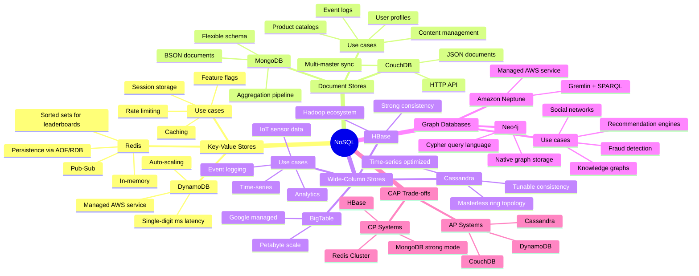
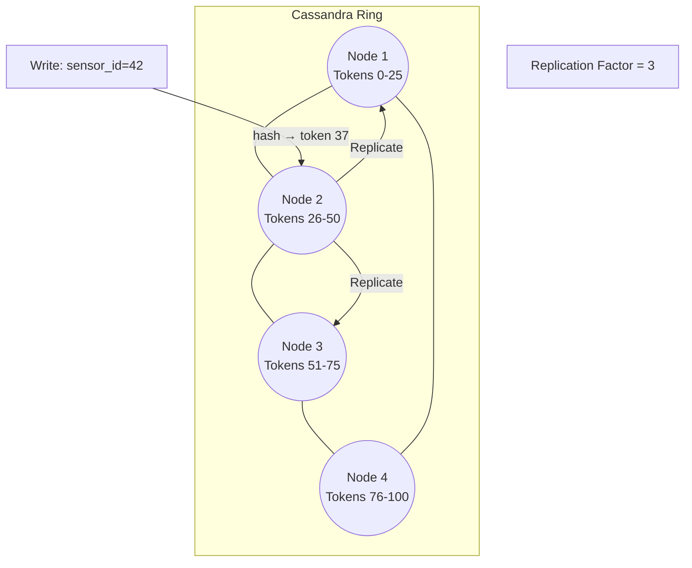
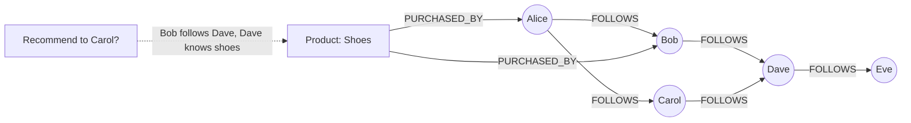
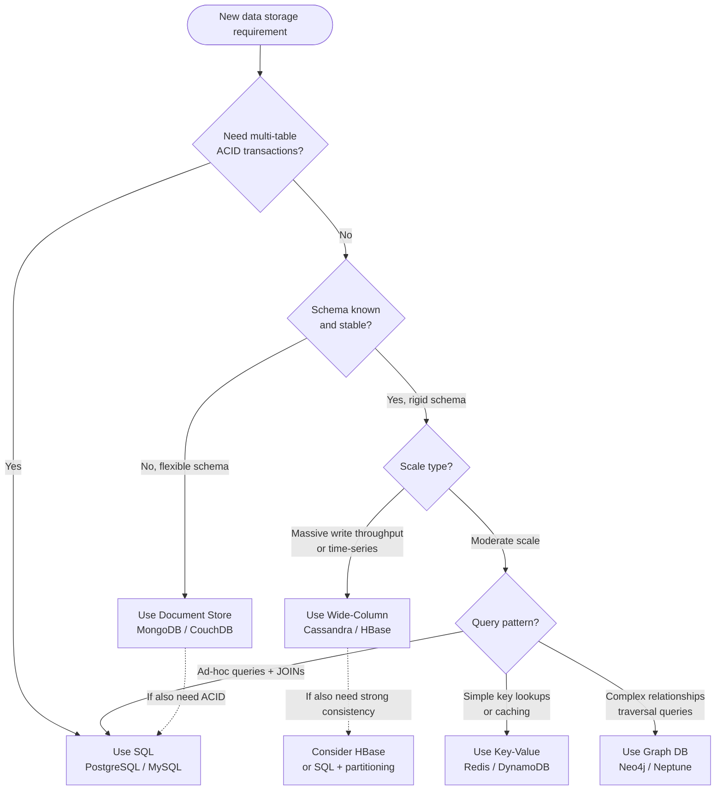
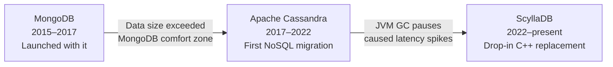

# Chapter 10: Databases — NoSQL


> NoSQL does not mean "no structure." It means "no rigid schema imposed at write time." The right NoSQL store matches its data model to your access pattern — not the other way around.

---

## Mind Map



---

## Why NoSQL Exists

Relational databases ([Ch09](/system-design/part-2-building-blocks/ch09-databases-sql)) excel at structured data with complex relationships and strict ACID requirements. But several use cases expose their limits:

| Pressure | Problem with SQL | NoSQL Response |
|---|---|---|
| Schema evolution | ALTER TABLE on 500M rows causes downtime | Schema-flexible documents; add fields without migration |
| Horizontal write scaling | Single-master replication bottlenecks writes | Masterless, multi-writer topologies (Cassandra) |
| Massive throughput | Connection limits, lock contention at scale | Purpose-built for millions of ops/sec |
| Sparse data | NULL-heavy tables waste space | Documents omit absent fields |
| Graph traversal | Recursive JOINs are expensive | Native graph traversal in O(depth), not O(n²) |
| Time-series ingest | Row-per-event at high frequency overwhelms OLTP indexes | Column families optimized for append-heavy workloads |

NoSQL is not a replacement for SQL — it is a set of specialized tools, each optimized for a specific data model and access pattern.

---

## Key-Value Stores

The simplest NoSQL model: a distributed hash map. Every value is addressed by an opaque key. The database does not interpret the value.

**Operations:** `SET key value`, `GET key`, `DEL key`, `EXPIRE key seconds`

**Complexity:** O(1) for all operations (hash table under the hood)

```mermaid
graph LR
    App[Application]
    App -->|SET session:abc123 {...}| KV[(Key-Value Store\nRedis / DynamoDB)]
    App -->|GET session:abc123| KV
    KV -->|{user_id: 42, role: admin}| App
```

### Redis

Redis keeps the entire dataset in memory with optional disk persistence:

- **Persistence:** RDB snapshots (point-in-time) or AOF (append-only log of every write)
- **Data structures:** Strings, Lists, Sets, Sorted Sets, Hashes, Streams, Bitmaps, HyperLogLog
- **Sorted sets** enable leaderboards: `ZADD leaderboard 9500 "alice"`, `ZREVRANGE leaderboard 0 9`
- **Pub/Sub:** lightweight message fanout for real-time notifications
- **Atomic operations:** `INCR counter`, `SETNX` (set if not exists) for distributed locks

Redis is the backbone of the caching layer described in [Ch07 — Caching](/system-design/part-2-building-blocks/ch07-caching).

### DynamoDB

AWS's fully managed key-value (and document) store:

- **Primary key:** Partition key alone, or partition key + sort key (composite)
- **Sort key** enables range queries within a partition: `query(partition="user#42", sort BETWEEN "2024-01" AND "2024-12")`
- **Consistent hashing** distributes partitions across storage nodes automatically
- **Throughput:** Provisioned (RCU/WCU) or on-demand autoscaling
- **Global Tables:** multi-region active-active with last-write-wins conflict resolution

### Key-Value Use Cases

| Use Case | Why Key-Value Fits |
|---|---|
| Session storage | User session is retrieved by session ID — single key lookup |
| Caching | Wrap expensive DB queries; TTL-based invalidation |
| Rate limiting | `INCR user:42:req_count` + `EXPIRE` per window |
| Feature flags | `GET feature:dark_mode:user:42` → enabled/disabled |
| Leaderboards | Redis Sorted Sets with `ZADD`/`ZREVRANGE` |
| Distributed locks | `SET lock:resource NX EX 30` (atomic set-if-not-exists) |

---

## Document Stores

Document stores extend key-value by making the value a **structured document** (typically JSON or BSON). The database can index and query fields inside the document without requiring a fixed schema.

**Data model:** Collection of documents. Each document is a self-contained JSON object.

```json
// MongoDB document in "users" collection
{
  "_id": "ObjectId(abc123)",
  "name": "Alice Chen",
  "email": "alice@example.com",
  "preferences": {
    "theme": "dark",
    "notifications": ["email", "push"]
  },
  "tags": ["premium", "beta-tester"],
  "created_at": "2024-01-15T10:30:00Z"
}
```

No schema migration needed to add the `tags` array — existing documents simply lack the field.

### MongoDB

- **Flexible schema:** Documents in the same collection can have different fields
- **Aggregation pipeline:** Multi-stage transformations (`$match`, `$group`, `$lookup`, `$unwind`)
- **Horizontal scaling:** Native sharding with configurable shard keys
- **Replication:** Replica sets with automatic primary election
- **`$lookup`:** Left-outer join between collections (use sparingly — document stores are designed to avoid joins)

```mermaid
graph TD
    App[Application]
    App -->|db.users.find({tags: "premium"})| Mongo[(MongoDB)]
    Mongo -->|Index scan on tags array| Idx[Array Index]
    Idx -->|Matching documents| App
```

### Document Store Use Cases

| Use Case | Why Document Fits |
|---|---|
| User profiles | Nested preferences, variable attributes per user |
| Product catalogs | Electronics have specs; clothing has sizes — variable schemas |
| Content management | Articles, blog posts — each with different metadata fields |
| Event logs | Each event type has different payload shape |
| E-commerce orders | Embed order lines in order document — read in one query |

---

## Wide-Column Stores

Wide-column stores organize data into **column families** — a table where each row can have a different set of columns. Optimized for write-heavy, append-heavy, time-series workloads.

**Mental model:** Think of it as a nested sorted map: `table[row_key][column_family][column][timestamp] = value`

### Cassandra Data Model

Cassandra uses a **masterless ring topology** with consistent hashing. Every node is equal — there is no primary.



**Table example for IoT sensor data:**

```sql
CREATE TABLE sensor_readings (
    sensor_id  UUID,
    recorded_at TIMESTAMP,
    temperature FLOAT,
    humidity    FLOAT,
    PRIMARY KEY (sensor_id, recorded_at)
) WITH CLUSTERING ORDER BY (recorded_at DESC);
```

- **Partition key** (`sensor_id`) determines which node stores the row
- **Clustering key** (`recorded_at`) sorts rows within a partition — enables fast time-range queries
- Queries must include the partition key: `WHERE sensor_id = ? AND recorded_at > ?`

### Tunable Consistency

Cassandra's **quorum** model lets you trade consistency for availability per query:

| Consistency Level | Write | Read | Trade-off |
|---|---|---|---|
| ONE | Write to 1 node | Read from 1 node | Fastest, lowest durability |
| QUORUM | Write to N/2+1 nodes | Read from N/2+1 nodes | Balanced (default for most workloads) |
| ALL | Write to all nodes | Read from all nodes | Slowest, strongest consistency |
| LOCAL_QUORUM | Quorum within local datacenter | Local DC quorum | Multi-region with local consistency |

This directly maps to the CAP theorem trade-offs discussed in [Ch03 — Core Trade-offs](/system-design/part-1-fundamentals/ch03-core-tradeoffs). Cassandra defaults to AP — it chooses availability over strict consistency.

### Wide-Column Use Cases

| Use Case | Why Wide-Column Fits |
|---|---|
| IoT sensor telemetry | High write throughput; time-ordered queries by device |
| Event logging | Append-only; query by event source + time range |
| Time-series metrics | Infrastructure monitoring; partition by metric name |
| User activity feeds | Partition by user; query recent N events |
| Messaging inbox | Partition by user; cluster by conversation + timestamp |

---

## Graph Databases

Graph databases store data as **nodes** (entities), **edges** (relationships), and **properties** (attributes on both). Traversal — following edges from node to node — is a first-class operation performed in O(depth), independent of total dataset size.

**When SQL breaks down:** A 6-degree-of-separation query in SQL requires 6 self-joins on a `friendships` table. At 100M rows, this is prohibitively expensive. In a graph database, it is a single traversal query.



### Neo4j and Cypher

Neo4j uses the **Cypher** query language:

```cypher
// Find products purchased by people Alice follows (collaborative filtering)
MATCH (alice:User {name: "Alice"})-[:FOLLOWS]->(friend:User)
      -[:PURCHASED]->(product:Product)
WHERE NOT (alice)-[:PURCHASED]->(product)
RETURN product.name, COUNT(friend) AS mutual_purchases
ORDER BY mutual_purchases DESC
LIMIT 10
```

This query would require multiple self-joins and subqueries in SQL.

### Graph Database Use Cases

| Use Case | Why Graph Fits |
|---|---|
| Social networks | Followers, friends, mutual connections |
| Recommendation engines | Collaborative filtering via relationship traversal |
| Fraud detection | Ring fraud patterns — accounts connected through shared devices/cards |
| Knowledge graphs | Entity relationships; semantic search |
| Access control | Role hierarchies; permission inheritance |
| Supply chain | Multi-hop dependency tracing |

---

## Comprehensive Comparison Table

| Property | Key-Value | Document | Wide-Column | Graph | SQL (RDBMS) |
|---|---|---|---|---|---|
| **Data model** | Opaque value by key | JSON/BSON document | Column families | Nodes + edges | Rows + columns |
| **Schema** | None | Flexible per document | Flexible per row | Semi-structured | Fixed (DDL enforced) |
| **Query power** | Key lookup only | Field queries + aggregation | Partition + range queries | Traversal + pattern match | Full SQL (JOINs, aggregations) |
| **Horizontal scale** | Excellent | Good (sharding) | Excellent (built-in) | Limited | Difficult (manual sharding) |
| **Consistency** | Configurable | Configurable | Tunable (quorum) | Strong (single server) | Strong (ACID) |
| **Latency** | Sub-ms (in-memory) | Low ms | Low ms | Low ms (shallow traversal) | Low ms (indexed) |
| **Transactions** | Limited (Redis Lua) | Multi-doc (MongoDB 4+) | Light-weight (LWT) | ACID (Neo4j) | Full ACID |
| **Best for** | Caching, sessions | Profiles, catalogs | Time-series, events | Relationships, graphs | Financials, reporting |
| **Examples** | Redis, DynamoDB | MongoDB, CouchDB | Cassandra, HBase | Neo4j, Neptune | PostgreSQL, MySQL |

---

## SQL vs NoSQL Decision Guide



### Quick Decision Rules

| Scenario | Recommended |
|---|---|
| Financial transactions, invoices, orders | SQL (ACID mandatory) |
| User profiles with variable attributes | Document (MongoDB) |
| Session and auth tokens | Key-Value (Redis) |
| IoT sensor readings, metrics | Wide-Column (Cassandra) |
| Social graph, recommendations | Graph (Neo4j) |
| Real-time leaderboard | Key-Value (Redis Sorted Sets) |
| Product catalog with varied specs | Document (MongoDB) |
| Audit log / event sourcing | Wide-Column (Cassandra) |
| Fraud detection network | Graph (Neo4j / Neptune) |
| Multi-tenant SaaS with reporting | SQL (PostgreSQL) |

---

## CAP Trade-offs in Practice

The CAP theorem ([Ch03 — Core Trade-offs](/system-design/part-1-fundamentals/ch03-core-tradeoffs)) states that a distributed system can guarantee only 2 of 3: **Consistency**, **Availability**, **Partition Tolerance**. Since partition tolerance is required in any real distributed system, the real choice is between C and A.

| Database | CAP Posture | Behavior Under Partition |
|---|---|---|
| PostgreSQL (single node) | CA (no partition tolerance) | Not distributed; no partition scenario |
| MongoDB (default) | CP | Refuses writes until primary is elected |
| HBase | CP | Blocks until ZooKeeper quorum restores |
| Redis Cluster | CP | Slots without quorum reject writes |
| Cassandra | AP | Accepts writes to any available node; reconciles later |
| DynamoDB | AP | Continues serving reads/writes; eventual consistency |
| CouchDB | AP | Multi-master; merges conflicts on sync |

**PACELC extension:** CAP only describes behavior during a network partition. PACELC adds the trade-off during normal operation: even without a partition, you choose between **latency (L)** and **consistency (C)**. DynamoDB is AP/EL — it favors availability and low latency over consistency.

---

## Real-World Examples

### DynamoDB at Amazon

Amazon's e-commerce platform uses DynamoDB for shopping cart and session state:

- **Requirement:** Single-digit millisecond reads at any scale — even during Prime Day traffic spikes
- **Design:** Items stored as documents keyed by `customer_id`. Cart operations are atomic item-level updates (`UpdateItem` with `ADD` expressions)
- **Scale:** Tens of millions of requests per second, automatically scaled
- **Global Tables:** Active-active replication across 5 AWS regions for <10ms latency globally
- **Result:** Zero downtime during Black Friday; auto-scaling absorbs 10x traffic spikes

The 2007 Amazon Dynamo paper directly inspired DynamoDB's consistent hashing and quorum design.

### Cassandra at Netflix

Netflix uses Apache Cassandra for their viewing history and recommendations pipeline:

- **Requirement:** 100M+ subscribers; viewing events arrive at millions per second
- **Data model:** `viewing_history` partitioned by `user_id`, clustered by `watched_at DESC`
- **Scale:** Hundreds of Cassandra nodes across 3 AWS regions
- **Consistency:** `LOCAL_QUORUM` — guarantees consistency within each region; async replication across regions
- **Why not SQL:** At Netflix's write volume, a SQL primary would saturate; Cassandra's masterless topology absorbs writes linearly
- **Caching layer:** Redis ([Ch07](/system-design/part-2-building-blocks/ch07-caching)) sits in front of Cassandra for recently-watched queries

---

## Key Takeaway

> There is no single best database. Match the data model to the access pattern: key-value for O(1) lookups, documents for flexible schemas, wide-column for time-series and high-throughput writes, and graph for traversal-heavy relationship queries. Start with SQL unless you have a specific, measured reason to choose otherwise — and when you do choose NoSQL, pick the type whose data model fits your queries, not the one that is fashionable.

---

## Case Study: Discord's Message Storage Migration

Discord is a real-time chat platform that grew from a gaming community tool to over 500 million registered users sending billions of messages per day. Their message storage history is one of the most cited real-world NoSQL migration stories.

### Migration Timeline



### Phase 1: MongoDB (2015–2017)

Discord launched on MongoDB, which was a reasonable default for a startup: flexible schema for evolving message payloads, fast development velocity, and familiar to the team.

**Why it stopped working:**
- By late 2015, the primary MongoDB cluster was storing ~100 million messages
- MongoDB B-Tree indexes for the messages collection no longer fit in RAM
- Random I/O on cold data caused disk seeks — read latency climbed as data grew
- MongoDB's data-size-per-node scaling model did not match Discord's write volume

### Phase 2: Apache Cassandra (2017–2022)

Cassandra fit Discord's access pattern: messages are written once, read in time order by channel. Its LSM-Tree storage engine is optimized for sequential writes; its partition model maps naturally to `(channel_id, message_id)`.

**Why they chose Cassandra:**
- Masterless ring topology — no single-writer bottleneck
- Write throughput scales linearly with nodes
- Time-ordered clustering key (`message_id` as Snowflake ID encodes timestamp) enables fast range reads

**Why it eventually caused problems:**
- Cassandra runs on the JVM. At Discord's write volume, the JVM garbage collector caused **GC pause latency spikes** — brief but unpredictable freezes during compaction that showed up as tail latency in message delivery
- Compaction pressure was high: Discord's hotspot channels (large gaming servers) created dense partitions that triggered frequent major compactions
- Operational burden: JVM tuning (`-XX:+UseG1GC`, heap sizing) required constant adjustment

### Phase 3: ScyllaDB (2022–present)

ScyllaDB is a **Cassandra-compatible** database rewritten in C++ (not Java). It exposes the exact same CQL query language and data model, so Discord could migrate without changing application code.

**Why ScyllaDB solved the problems:**
- No JVM, no garbage collector — C++ with per-core shard architecture eliminates GC pauses entirely
- Better tail latency consistency (p99 latency dropped significantly)
- Higher throughput per node → fewer nodes needed for the same load

### Database Comparison Table

| Database | Era | Why Chosen | Core Pain Point | When Migrated Away |
|---|---|---|---|---|
| **MongoDB** | 2015–2017 | Flexible schema, fast prototyping, team familiarity | Random I/O as index outgrew RAM; poor write scaling | 2017 — data volume exceeded sweet spot |
| **Apache Cassandra** | 2017–2022 | Masterless writes, LSM-Tree efficiency, linear scale | JVM GC pause latency spikes; compaction pressure on hotspot partitions | 2022 — tail latency unacceptable at scale |
| **ScyllaDB** | 2022–present | Cassandra-compatible CQL; C++ (no GC); per-core sharding | Still evaluating operational maturity | Still in use |

### Data Model

The core insight: Discord's query pattern is **"give me the last N messages in channel X"** — a time-ordered range read within a single channel partition.

```sql
-- ScyllaDB / Cassandra CQL
CREATE TABLE messages (
    channel_id   BIGINT,       -- partition key: all messages for a channel are co-located
    message_id   BIGINT,       -- clustering key: Snowflake ID encodes creation timestamp
    author_id    BIGINT,
    content      TEXT,
    attachments  LIST<TEXT>,
    PRIMARY KEY (channel_id, message_id)
) WITH CLUSTERING ORDER BY (message_id DESC);
```

**Why Snowflake IDs as clustering key:**
- Snowflake IDs are time-sortable 64-bit integers (timestamp in high bits)
- Sorting by `message_id DESC` gives chronological ordering for free
- Cursor-based pagination: `WHERE channel_id = ? AND message_id < :last_seen_id LIMIT 50`
- No `ALLOW FILTERING` needed — the query is a partition key lookup + clustering range scan

See [Ch18 — Unique ID Generation](/system-design/part-4-case-studies/ch18-url-shortener-pastebin) for Snowflake ID internals.

### Key Takeaways

1. **Database choice is not permanent.** What works at 10M users (MongoDB) fails at 200M. Architect for migration, not just for today's scale.
2. **Match storage engine to access pattern.** Discord's append-heavy, time-ordered reads are exactly what LSM-Tree (Cassandra/ScyllaDB) is optimized for. B-Tree (MongoDB) was wrong shape for the workload.
3. **Runtime matters, not just the data model.** Cassandra's CQL model was correct; its JVM runtime caused tail latency. ScyllaDB kept the model and replaced the runtime.
4. **Partition key = unit of co-location.** Partitioning messages by `channel_id` ensures one node owns all messages for a channel — single-node reads, no scatter-gather.

> **Cross-references:** Compare with [Ch09 — SQL](/system-design/part-2-building-blocks/ch09-databases-sql) for why Discord avoided relational DB at this write volume. Snowflake ID generation is covered in [Ch18](/system-design/part-4-case-studies/ch18-url-shortener-pastebin). The full chat system design is in [Ch20](/system-design/part-4-case-studies/ch20-chat-messaging-system).

---

## Practice Questions

1. **Data model design:** Design the Cassandra schema for a ride-sharing app's trip history. What is your partition key and clustering key? What queries does this enable and what does it prevent?

2. **CAP trade-off:** Your startup's chat app uses MongoDB. During a network partition, MongoDB refuses writes. A customer complains they cannot send messages. How would you redesign using a different store to prioritize availability over consistency?

3. **Key-value limits:** You store user profiles in Redis as JSON strings. A product manager wants to "find all users who signed up in January 2024." Why is this query problematic for a key-value store? What should you use instead?

4. **Graph vs SQL:** You have a fraud detection requirement: "Find all accounts connected within 3 hops via shared phone numbers or devices." Write the conceptual SQL (with JOINs) vs the conceptual Cypher query. What is the performance difference at 100M accounts?

5. **Hybrid architecture:** A fintech company needs: (a) ACID transactions for fund transfers, (b) sub-millisecond session lookups, (c) fraud graph analysis, (d) audit log retention for 7 years. How many different database technologies would you use and why?

---

*Next: [Chapter 11 — Message Queues →](/system-design/part-2-building-blocks/ch11-message-queues)*
*Previous: [Chapter 09 — Databases: SQL ←](/system-design/part-2-building-blocks/ch09-databases-sql)*
