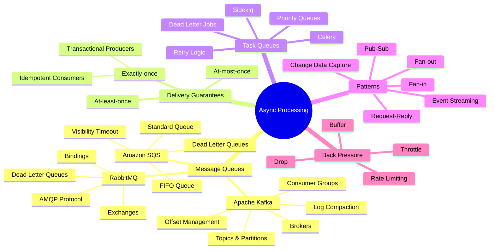
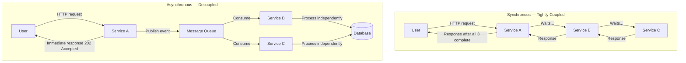
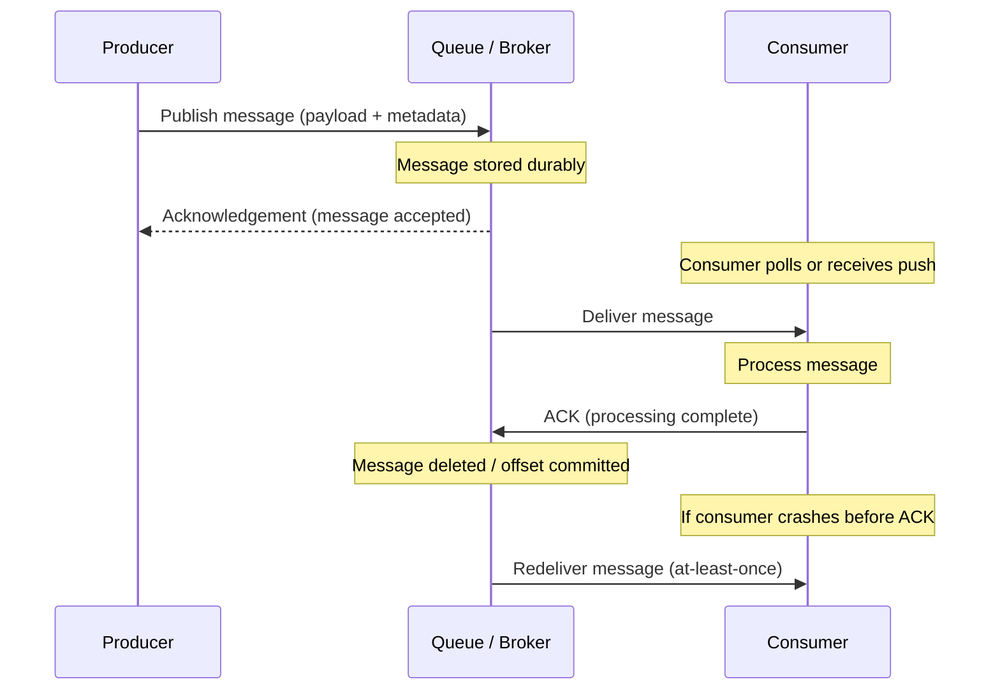
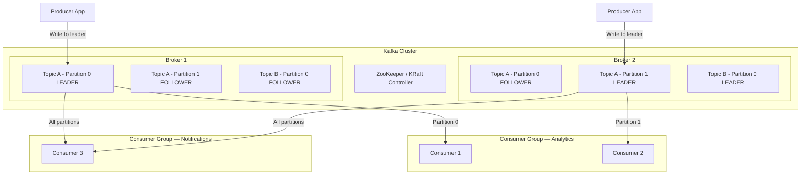
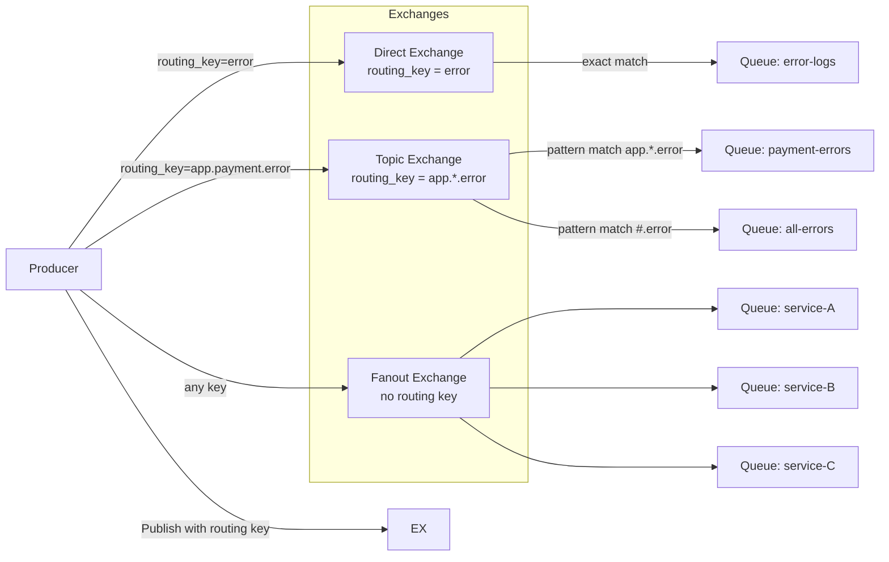
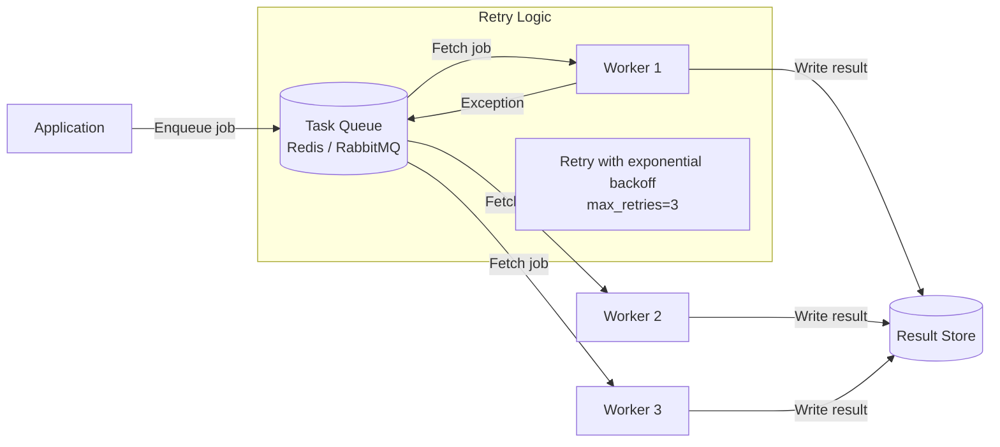
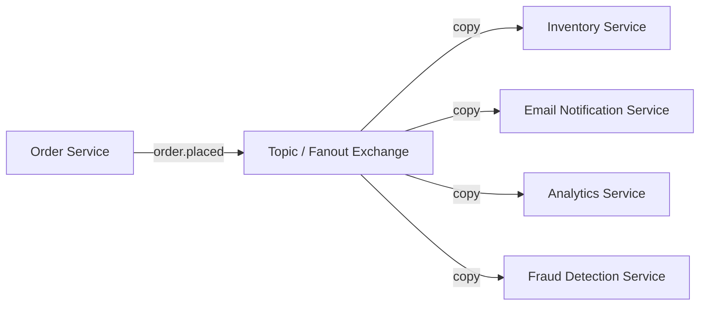
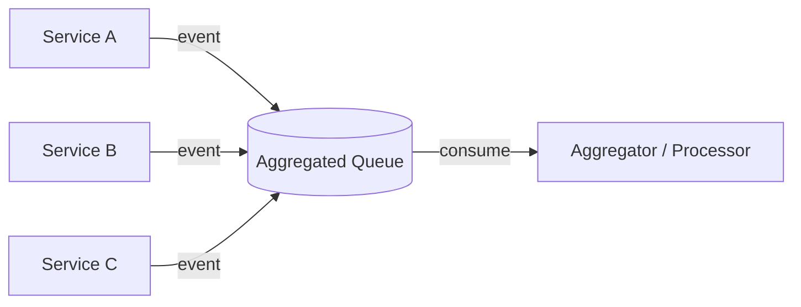
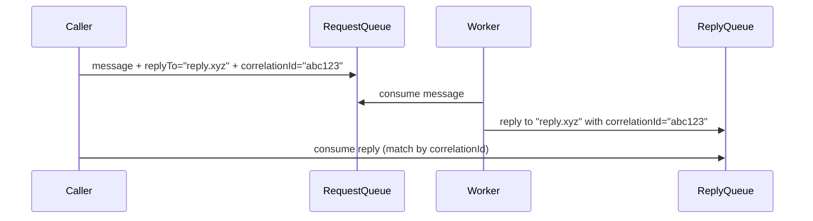

# Chapter 11: Message Queues & Async Processing


> Synchronous systems are fragile. Asynchronous systems are resilient. A message queue is the contract between the two — it lets producers and consumers evolve, scale, and fail independently without ever blocking each other.

---

## Mind Map



---

## Why Async Processing

Synchronous request-response works fine for simple CRUD. It breaks down when:

- A downstream service is slow or temporarily unavailable
- A burst of traffic hits faster than consumers can handle
- Multiple services need to react to the same event
- Work is too expensive to complete within an HTTP request timeout

### Synchronous vs Asynchronous Architecture



**Key benefits:**

| Benefit | Explanation |
|---------|-------------|
| **Decoupling** | Producer doesn't know or care about consumers — they can be added or removed without touching the producer |
| **Traffic spike absorption** | Queue acts as a buffer; producers publish at peak rate, consumers process at sustainable rate |
| **Reliability** | If a consumer crashes, messages stay in the queue and are reprocessed when it recovers |
| **Independent scaling** | Scale consumers horizontally without changing producers |
| **Temporal decoupling** | Producer and consumer don't need to be online at the same time |

---

## Message Queue Fundamentals

The core pattern: **Producer → Queue → Consumer**



**Message anatomy:**

- **Payload** — the actual data (JSON, Avro, Protobuf)
- **Key** — used for partitioning/routing (Kafka) or routing key (RabbitMQ)
- **Headers / Metadata** — timestamp, message ID, content type, correlation ID
- **TTL** — how long the message lives in the queue before expiry

---

## Delivery Guarantees

How a system handles failures during message delivery determines its correctness guarantees.

### The Three Levels

| Guarantee | How it works | Risk | Typical Use Case |
|-----------|-------------|------|-----------------|
| **At-most-once** | Fire and forget. No retries. ACK before processing. | Messages can be lost | Metrics, logs — loss is acceptable |
| **At-least-once** | ACK after processing. Retry on failure. | Messages can be **duplicated** | Most business systems — duplicates are handled |
| **Exactly-once** | Idempotent consumer + transactional producer + at-least-once delivery | Complexity, lower throughput | Payments, inventory — correctness critical |

### How Exactly-Once Is Achieved

Exactly-once is not a single mechanism — it is a combination:

1. **Idempotent producer** (Kafka) — assigns sequence numbers so the broker deduplicates retried sends from the same producer session
2. **Transactional producer** (Kafka Transactions) — writes to multiple partitions atomically; either all succeed or none are visible
3. **Idempotent consumer** — the application assigns a deduplication key to each operation (e.g., `order_id`), checks whether it was already applied, and skips if so

```
Exactly-once = At-least-once delivery + Idempotent consumer
```

In practice, true end-to-end exactly-once requires both the broker **and** the downstream storage to participate in the transaction. Kafka Streams achieves this internally; external sinks require careful design.

---

## Apache Kafka Deep Dive

Kafka is a **distributed commit log** designed for high-throughput, durable, replayable event streaming.

### Architecture



### Core Concepts

**Broker** — a single Kafka server. A cluster has multiple brokers for redundancy and parallelism.

**Topic** — a named, ordered, append-only log. Topics are split into partitions.

**Partition** — the unit of parallelism. Each partition is an ordered, immutable sequence of messages with monotonically increasing **offsets**. Partitions are replicated across brokers.

**Consumer Group** — a set of consumers sharing a group ID. Each partition is consumed by exactly one consumer within a group, enabling horizontal scaling. Multiple groups can read the same topic independently (pub/sub semantics).

**Offset** — the position of a message within a partition. Consumers commit offsets to track progress. Restarting a consumer replays from the last committed offset.

### Offset Management

| Strategy | Commit Timing | Risk |
|----------|--------------|------|
| Auto-commit (every 5s) | Periodic, automatic | Can lose uncommitted work on crash |
| Manual commit after process | After successful processing | At-least-once; safe for most cases |
| Manual commit before process | Before processing | At-most-once; fast but lossy |
| Transactional | Atomic with downstream write | Exactly-once; complex |

### Log Compaction

Normal Kafka topics are **retention-based** — old messages are deleted after a time or size limit. **Log compaction** keeps only the latest message per key, making the log act like a changelog or snapshot:

- Useful for materializing state (e.g., latest user profile per `user_id`)
- Enables new consumers to rebuild full state by replaying the compacted log
- Used extensively for Kafka Streams state stores and database change data capture (CDC)

### Kafka Use Cases

- **Event streaming** — real-time clickstream, IoT sensor data
- **Log aggregation** — centralize application logs from hundreds of services
- **Change Data Capture (CDC)** — Debezium captures database changes as Kafka events
- **Stream processing** — Kafka Streams / ksqlDB for real-time transformations
- **Event sourcing** — durable, replayable record of all state changes

---

## RabbitMQ

RabbitMQ implements the **AMQP 0-9-1** protocol. Unlike Kafka's pull-based log, RabbitMQ uses a **push-based broker** model: the broker routes messages to queues via exchanges, then pushes them to subscribed consumers.

### Exchange Routing



**Exchange types:**

| Type | Routing Logic | Use Case |
|------|--------------|----------|
| **Direct** | Exact match on routing key | Error routing, task dispatch |
| **Topic** | Wildcard pattern (`*` = one word, `#` = zero or more) | Categorized events |
| **Fanout** | Broadcast to all bound queues | Notifications, cache invalidation |
| **Headers** | Match on message header attributes | Complex routing rules |

**RabbitMQ strengths:**
- Complex routing logic without consumer-side filtering
- Per-message acknowledgement and TTL
- Dead letter exchanges (DLX) for failed messages
- Plugin ecosystem (delayed messages, priority queues)

---

## Amazon SQS

SQS is AWS's fully managed message queue — no brokers to provision, patch, or scale.

**Standard Queue:**
- Near-unlimited throughput
- At-least-once delivery (a message may be delivered more than once)
- Best-effort ordering (not guaranteed)
- **Visibility timeout** — after delivery, message becomes invisible to other consumers for a configurable period; if not deleted within that window, it reappears

**FIFO Queue:**
- Exactly-once processing (within the 5-minute deduplication window)
- Strict ordering per `MessageGroupId`
- Max 3,000 messages/second with batching

**Dead Letter Queue (DLQ):**
After `maxReceiveCount` failed delivery attempts, the message is moved to a DLQ for inspection and replay without blocking the main queue.

---

## Kafka vs RabbitMQ vs SQS

| Dimension | Apache Kafka | RabbitMQ | Amazon SQS |
|-----------|-------------|----------|------------|
| **Throughput** | Millions of msg/sec | ~50k msg/sec | Near-unlimited (Standard) |
| **Message Ordering** | Per partition | Per queue | No guarantee (Standard) / per group (FIFO) |
| **Message Retention** | Days to forever (configurable) | Until ACKed (default) | 4 days default, up to 14 days |
| **Message Replay** | Yes — rewind offset | No — consumed = deleted | No |
| **Protocol** | Custom TCP binary | AMQP 0-9-1 | HTTPS / AWS SDK |
| **Push vs Pull** | Pull (consumer polls) | Push (broker delivers) | Pull (long polling) |
| **Routing** | Topic + partition key | Exchanges + binding keys | Queue URL (single destination) |
| **Delivery Guarantee** | At-least-once; exactly-once with transactions | At-least-once | At-least-once; exactly-once (FIFO) |
| **Scaling Model** | Add partitions + consumers | Add consumers or cluster nodes | Fully managed, auto-scales |
| **Ops Overhead** | High (ZooKeeper/KRaft, tuning) | Medium (cluster management) | None (managed service) |
| **Latency** | ~5–15 ms (batching) | Sub-millisecond | ~1–20 ms |
| **Primary Use Case** | Event streaming, CDC, log aggregation | Task dispatch, complex routing | Simple async decoupling on AWS |

**Decision guide:**
- Need **replay** or **event sourcing** → Kafka
- Need **complex routing** or **per-message TTL** → RabbitMQ
- On **AWS** and want zero ops → SQS
- Need **high throughput with ordering** → Kafka + partition by key

---

## Task Queues

Task queues are higher-level abstractions on top of message queues, designed for **job dispatch** rather than raw event streaming.

### Worker Pattern



**Celery (Python)** — uses Redis or RabbitMQ as broker; supports chaining, groups, chords, canvas for complex workflows.

**Sidekiq (Ruby)** — Redis-backed; uses threads for concurrency; built-in retry with exponential backoff.

### Priority Queues

Tasks with higher priority jump ahead in the queue. Implemented by:
- Multiple queues with polling priority (Sidekiq: poll high → default → low)
- Broker-native priority (RabbitMQ priority queues, max 255 levels)

### Retry Logic Best Practices

- **Exponential backoff with jitter** — `delay = min(cap, base * 2^attempt) + random_jitter`
- **Max retries** — set a limit; after exhaustion, move to Dead Letter Queue
- **Idempotency** — retried jobs must produce the same result as the first run
- **Alerting on DLQ depth** — monitor for jobs that never succeed

---

## Back Pressure

Back pressure is the mechanism by which a consumer signals to the producer that it cannot keep up. Without it, queues grow unbounded until memory is exhausted or latency becomes unacceptable.

### The Problem

```
Producer: 10,000 msg/sec  →  Queue fills up  →  Consumer: 1,000 msg/sec
```

### Strategies

| Strategy | Mechanism | Trade-off |
|----------|-----------|-----------|
| **Drop** | Discard new messages when queue is full | Fast; loses data — acceptable for metrics/logs |
| **Buffer** | Expand in-memory queue | Temporary relief; risks OOM on sustained overload |
| **Throttle** | Slow down the producer (rate limit) | Preserves data; requires producer cooperation |
| **Block** | Producer blocks until queue has capacity | Simple; can cause cascading slowdown upstream |
| **Reject + retry** | Return 429 to producer; let it retry later | Decouples pacing; requires producer to handle 429 |

**Reactive Streams** (RxJava, Akka Streams, Project Reactor) formalize back pressure in code: a consumer requests `N` items from the producer, preventing the producer from overwhelming it.

In Kafka, consumers naturally control pace because **they** poll the broker. The queue depth (consumer lag) is a key metric — when lag grows, scale out consumers.

---

## Patterns

### Fan-out: One Message to Many Consumers

One producer publishes a single event; multiple independent consumers each receive a copy.



Kafka: multiple consumer groups on the same topic, each maintaining their own offset.
RabbitMQ: fanout exchange bound to N queues.

### Fan-in: Many Producers to One Consumer

Multiple producers emit events into a single queue; one consumer (or consumer group) processes all of them.



Use case: centralised audit log, combined metrics ingestion.

### Request-Reply over Queues

Asynchronous request-reply decouples caller from callee while still allowing the caller to get a result.



The caller creates a temporary reply queue (or uses a shared one with `correlationId` filtering). Used in RPC-over-MQ patterns.

---

## Real-World Cases

### LinkedIn — Kafka at 7 Trillion Messages per Day

LinkedIn built Kafka in 2010 specifically because no existing system could handle their activity feed requirements. Today:
- **7 trillion messages/day** across their Kafka clusters
- Single largest Kafka deployment in the world
- Used for activity tracking, metrics, log aggregation, and stream processing with Samza
- Key insight: treating logs as first-class data streams unlocked entirely new product capabilities (who viewed your profile, trending posts)

### Uber — Async Processing for Reliability

Uber's ride dispatch, surge pricing, and notification systems all rely heavily on async queues:
- **Cherami** (Uber's internal queue) was built when SQS latency was too high and Kafka's model didn't fit task-queue semantics
- **microtransactions** — each step of the ride lifecycle (request, match, pickup, complete) publishes an event; downstream services (billing, driver payments, analytics) react asynchronously
- **Resilience pattern**: if the notification service is down during a ride, the events buffer in the queue; once service recovers, all notifications are delivered in order

See also: [Chapter 14 — Event-Driven Architecture](/system-design/part-3-architecture-patterns/ch14-event-driven-architecture) for how these patterns compose into full system designs.

For async cache invalidation patterns (where message queues propagate cache eviction events), see [Chapter 7 — Caching](/system-design/part-2-building-blocks/ch07-caching).

---

## Key Takeaway

> Message queues transform brittle synchronous chains into resilient, independently scalable systems. The choice of broker matters far less than the discipline of designing idempotent consumers, monitoring queue depth, and handling back pressure gracefully. A queue is only as reliable as the consumer that processes it.

---

## Practice Questions

1. **Design an order processing system** where placing an order triggers inventory reservation, payment processing, and email notification — all asynchronously. What queues, topics, and failure handling do you need?

2. **Exactly-once vs at-least-once**: Your payment service charges a credit card in response to a Kafka message. The consumer crashes after charging but before committing the offset. How do you prevent double-charging?

3. **Back pressure scenario**: Your email notification service consumes from a queue at 500 emails/second. Marketing sends a campaign that generates 50,000 messages in 10 seconds. Walk through three different back pressure strategies and their trade-offs.

4. **Kafka partition design**: You're designing a Kafka topic for user activity events (clicks, views, purchases). Users must see their own events in order, but global ordering across all users is not required. How do you partition the topic? What happens when you add partitions later?

5. **Fan-out vs fan-in**: An e-commerce platform needs to (a) send a receipt email, (b) update inventory, (c) trigger loyalty points, and (d) log to analytics — all when an order is placed. Compare implementing this with fan-out (one topic, many consumers) vs fan-in (many queues feeding one processor). When would you choose each?
