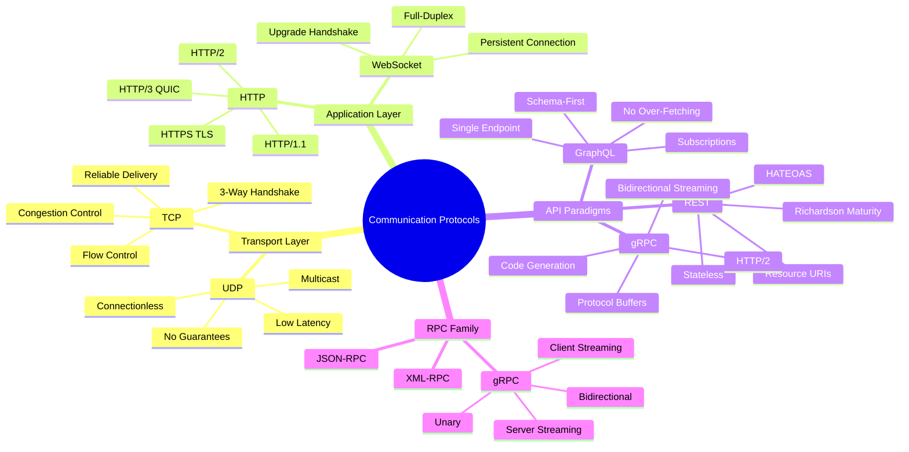
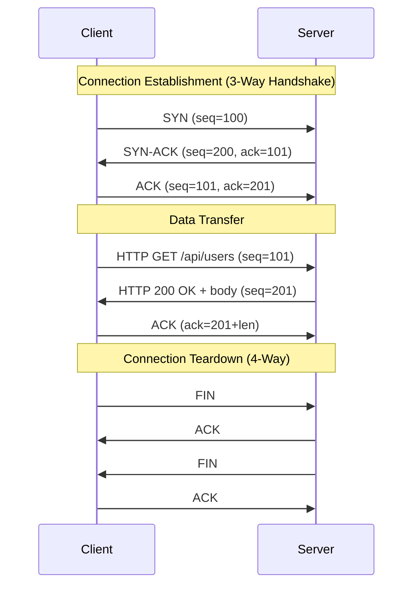
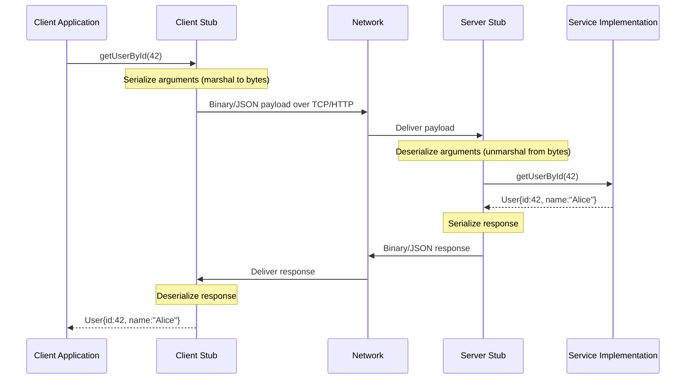
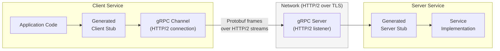
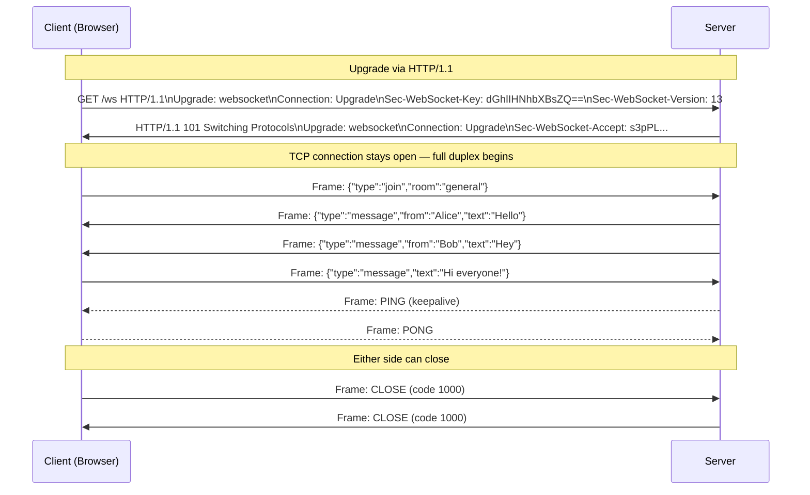
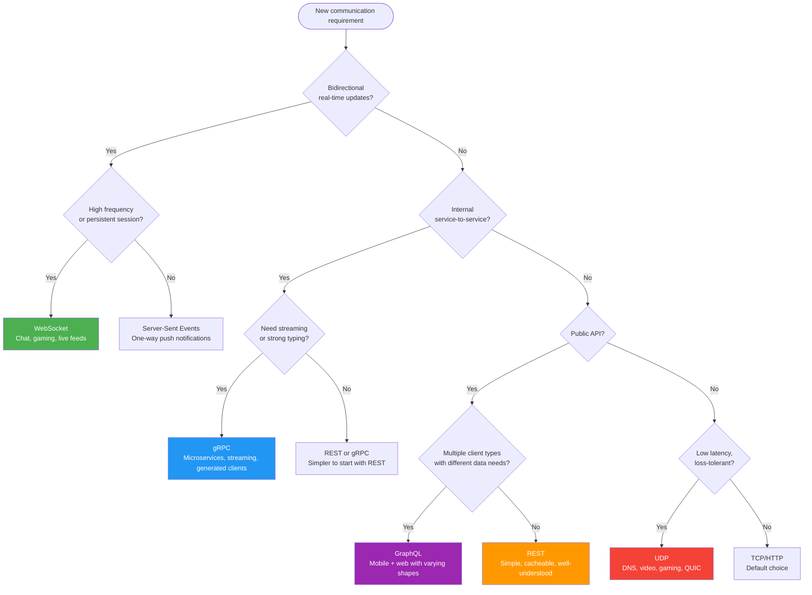

# Chapter 12: Communication Protocols


## Mind Map



---

## OSI Model Quick Reference

Each protocol covered in this chapter maps to a specific layer in the OSI model. Understanding the layer tells you what guarantees the protocol provides and what it delegates downward.

| Layer | Name | Protocols Covered Here | Responsibility |
|-------|------|------------------------|----------------|
| 7 | Application | HTTP, REST, GraphQL, gRPC, WebSocket | Business logic framing, data semantics |
| 6 | Presentation | TLS/SSL (HTTPS) | Encryption, encoding, compression |
| 5 | Session | WebSocket (session management) | Session establishment, maintenance |
| 4 | Transport | TCP, UDP | End-to-end delivery, ports, reliability |

> Layers 1–3 (Physical, Data Link, Network) handle raw bit transmission, framing, and IP routing — below the scope of this chapter but assumed by everything above.

---

## TCP vs UDP

TCP and UDP are the two dominant Layer 4 protocols. Every application-layer protocol (HTTP, WebSocket, gRPC) rides on one of them. Choosing the right one shapes the latency, reliability, and complexity of your system.

### TCP: Connection-Oriented Reliability

TCP guarantees ordered, reliable byte-stream delivery through a connection established by the **three-way handshake** before any data flows.



The handshake adds **1.5 RTT of latency** before the first byte of data. For HTTPS over TCP, TLS adds another 1–2 RTTs on top. This overhead is acceptable for most request-response workloads but becomes painful for latency-sensitive or short-lived connections.

**TCP key mechanisms:**
- **Sequence numbers** — detect lost, reordered, or duplicated segments
- **Sliding window** — flow control prevents the sender from overwhelming the receiver
- **Congestion control** — CUBIC/BBR algorithms back off when packet loss is detected
- **Retransmission** — lost segments trigger retransmit with exponential backoff

### UDP: Connectionless Speed

UDP sends datagrams with no handshake, no acknowledgment, no ordering, and no retransmission. The sender fires and forgets. This minimizes latency at the cost of reliability.

**UDP key properties:**
- No connection setup — first packet arrives in 0.5 RTT
- No head-of-line blocking — each datagram is independent
- Applications must implement their own error handling if needed
- Supports broadcast and multicast (TCP cannot)

### Comparison Table

| Dimension | TCP | UDP |
|-----------|-----|-----|
| Connection | Connection-oriented (handshake required) | Connectionless (no handshake) |
| Reliability | Guaranteed delivery via ACKs + retransmit | Best-effort — packets may be lost |
| Ordering | Guaranteed in-order delivery | No ordering guarantee |
| Error detection | Checksum + retransmission | Checksum only (no recovery) |
| Speed / Latency | Higher latency (handshake + ACK overhead) | Lower latency (fire-and-forget) |
| Overhead | 20-byte header + window/ACK fields | 8-byte header |
| Flow control | Built-in (sliding window) | None (application responsibility) |
| Congestion control | Built-in (CUBIC, BBR, Reno) | None |
| Head-of-line blocking | Yes — one lost segment blocks stream | No — datagrams are independent |
| Broadcast/Multicast | No | Yes |
| Typical use cases | HTTP, email, file transfer, SSH, databases | DNS, VoIP, video streaming, gaming, QUIC |

> **Rule of thumb:** If losing data means the application breaks (financial transactions, file uploads), use TCP. If delivering stale data is worse than delivering no data (live video frame, game position update), use UDP.

---

## HTTP and HTTPS

HTTP is the foundation of data exchange on the web. It operates as a request-response protocol over TCP (or QUIC for HTTP/3).

### Request/Response Model

Every HTTP exchange follows the same shape:

```
Client → Request (Method + URI + Headers + Body)
Server → Response (Status Code + Headers + Body)
```

**HTTP verbs and their semantics:**

| Verb | Idempotent | Safe | Purpose |
|------|-----------|------|---------|
| GET | Yes | Yes | Retrieve resource |
| HEAD | Yes | Yes | Retrieve headers only |
| POST | No | No | Create resource or trigger action |
| PUT | Yes | No | Replace resource entirely |
| PATCH | No | No | Partial update |
| DELETE | Yes | No | Remove resource |
| OPTIONS | Yes | Yes | Describe communication options |

**Idempotent** = calling N times produces the same result as calling once. **Safe** = no side effects on the server.

### HTTP/1.1 vs HTTP/2 vs HTTP/3

| Feature | HTTP/1.1 | HTTP/2 | HTTP/3 |
|---------|----------|--------|--------|
| Transport | TCP | TCP | QUIC (UDP) |
| Multiplexing | No (one request per connection, or pipelining) | Yes — multiple streams over one connection | Yes — independent streams |
| Head-of-line blocking | Yes (at application layer) | Partially (TCP level HoL remains) | No (QUIC streams are independent) |
| Header compression | None | HPACK | QPACK |
| Server push | No | Yes | Yes |
| Connection setup | 1.5 RTT (TCP) + TLS | 1.5 RTT + TLS | 1 RTT or 0-RTT (QUIC + TLS 1.3) |
| Binary protocol | No (text) | Yes | Yes |
| Typical adoption | Legacy/fallback | Dominant (95%+ servers) | Growing (major CDNs, browsers) |

**Key HTTP/2 improvements explained:**

- **Multiplexing** — multiple request/response pairs share a single TCP connection via numbered streams. Eliminates the need for connection pooling hacks.
- **Header compression (HPACK)** — repeated headers (e.g., `Cookie`, `Authorization`) are sent as indexed references, reducing overhead by 85–95%.
- **Keep-alive** — HTTP/1.1 introduced persistent connections (keep-alive), but HTTP/2 makes this the default and adds multiplexing on top.

**HTTP/3 and QUIC:**

HTTP/3 replaces TCP with QUIC, a transport protocol built on UDP. QUIC integrates TLS 1.3, providing 0-RTT reconnection for returning clients and eliminating TCP's head-of-line blocking at the transport layer — the last bottleneck HTTP/2 could not address.

---

## REST

REST (Representational State Transfer) is an architectural style for designing networked APIs, not a protocol. It runs over HTTP but imposes constraints that make APIs predictable and scalable.

### Core Constraints

1. **Client-Server** — UI and data storage are separated; clients don't know about server internals
2. **Stateless** — each request contains all information needed; no server-side session state
3. **Cacheable** — responses explicitly declare whether they are cacheable
4. **Uniform Interface** — resource-based URIs, standard HTTP verbs, self-descriptive messages
5. **Layered System** — clients cannot tell if they are connected directly to the origin server
6. **HATEOAS** — responses include links to related actions (rarely implemented in practice)

### Resource-Based URI Design

```
# Good: noun-based, hierarchical
GET  /users/42              → fetch user 42
GET  /users/42/orders       → fetch user 42's orders
POST /users                 → create new user
PUT  /users/42              → replace user 42
DELETE /users/42/orders/7   → delete order 7 of user 42

# Bad: verb-based (RPC-style)
POST /getUser
POST /deleteOrder
GET  /createUser
```

### Richardson Maturity Model

The Richardson Maturity Model grades REST API quality from 0 to 3:

| Level | Name | Description | Example |
|-------|------|-------------|---------|
| 0 | Swamp of POX | Single URI, single verb | `POST /api` with all operations |
| 1 | Resources | Multiple URIs for resources | `GET /users/42` |
| 2 | HTTP Verbs | Correct use of GET, POST, PUT, DELETE | Standard REST |
| 3 | Hypermedia (HATEOAS) | Responses include links to next actions | `{"user": {...}, "links": {"orders": "/users/42/orders"}}` |

Most production APIs operate at Level 2. Level 3 (HATEOAS) is theoretically ideal but rarely warranted — the link-following overhead adds complexity without proportional benefit for most clients.

### REST Best Practices and Common Mistakes

**Best practices:**
- Use plural nouns for collections (`/users`, not `/user`)
- Return appropriate HTTP status codes (200, 201, 400, 404, 409, 422, 500)
- Version your API (`/v1/users`) or via `Accept` header
- Use query parameters for filtering/sorting (`GET /users?role=admin&sort=name`)
- Return a consistent error envelope: `{"error": {"code": "USER_NOT_FOUND", "message": "..."}}`

**Common mistakes:**
- Using `GET` for operations with side effects (breaks caching and idempotency)
- Ignoring HTTP status codes (always returning 200 with error in body)
- Deeply nested URIs beyond 2–3 levels (`/companies/1/departments/5/teams/3/members/9`)
- Exposing internal IDs or database schema in URLs
- Not paginating large collection responses

---

## RPC (Remote Procedure Call)

RPC abstracts the network call to look like a local function call. The calling code invokes a function — the serialization, network transport, and deserialization are handled by generated stubs.

### How RPC Works



The generated stubs handle all marshaling. From the developer's perspective, calling a remote service looks identical to a local function call — with the important caveat that network calls can fail in ways local calls cannot (timeouts, partial failures, retries).

### gRPC: Modern RPC with Protocol Buffers

gRPC is Google's open-source RPC framework. It uses **Protocol Buffers (protobuf)** for serialization and runs over **HTTP/2**, unlocking streaming, multiplexing, and header compression.

**Defining a service with protobuf:**

```protobuf
syntax = "proto3";

service UserService {
  rpc GetUser (GetUserRequest) returns (User);
  rpc ListUsers (ListUsersRequest) returns (stream User);
  rpc CreateUser (stream CreateUserRequest) returns (CreateUserResponse);
  rpc Chat (stream ChatMessage) returns (stream ChatMessage);
}

message GetUserRequest { int64 user_id = 1; }
message User {
  int64 id = 1;
  string name = 2;
  string email = 3;
}
```

The `.proto` file is the source of truth — `protoc` generates type-safe client and server stubs in 10+ languages.

### gRPC Architecture



**gRPC streaming modes:**

| Mode | Direction | Use Case |
|------|-----------|----------|
| Unary | Client → Server, one response | Standard request-response (GetUser) |
| Server streaming | Client → Server, N responses | Large result sets, live feeds (ListUsers stream) |
| Client streaming | N messages → Server, one response | File upload, batch ingestion |
| Bidirectional streaming | N messages ↔ N messages | Chat, real-time collaboration |

**gRPC advantages over REST:**
- **~7x smaller payload** — protobuf binary vs JSON text
- **~10x faster serialization** — protobuf encoding/decoding is significantly faster
- **Strongly typed contract** — `.proto` file acts as an API contract, breaking changes are caught at compile time
- **Native streaming** — no polling or chunked transfer hacks needed
- **Built-in deadlines and cancellation** — propagated across service boundaries

---

## GraphQL

GraphQL is a query language and runtime for APIs, developed by Facebook (2012, open-sourced 2015). Unlike REST's resource-based model, GraphQL exposes a **typed schema** and lets clients declare exactly what data they need.

### Core Concepts

**Single endpoint:** All operations go through `POST /graphql`. The operation type (query, mutation, subscription) is declared in the request body.

**Client-driven queries — no over-fetching or under-fetching:**

```graphql
# REST: GET /users/42 returns ALL user fields (over-fetching)
# GraphQL: ask for exactly what you need
query {
  user(id: 42) {
    name
    email
    orders(last: 3) {
      id
      total
      status
    }
  }
}
```

**Schema-first design:**

```graphql
type User {
  id: ID!
  name: String!
  email: String!
  orders(last: Int): [Order!]!
}

type Order {
  id: ID!
  total: Float!
  status: OrderStatus!
}

type Query {
  user(id: ID!): User
  users(role: String): [User!]!
}

type Mutation {
  createUser(input: CreateUserInput!): User!
}

type Subscription {
  orderUpdated(userId: ID!): Order!
}
```

### Advantages

- **No over-fetching** — clients get exactly the fields they request
- **No under-fetching** — multiple related resources in a single round-trip
- **Strong typing** — the schema is a living contract; introspection enables auto-generated docs
- **Subscriptions** — real-time updates over WebSocket using the same schema

### When to Use GraphQL vs REST

| Situation | Recommendation |
|-----------|---------------|
| Public API consumed by unknown clients | REST (simpler, better CDN caching) |
| Mobile app with bandwidth constraints | GraphQL (precise field selection) |
| Dashboard aggregating many data sources | GraphQL (single round-trip joins) |
| Multiple client types with different data needs | GraphQL (BFF pattern) |
| Simple CRUD with uniform data shapes | REST (lower overhead) |
| Need aggressive HTTP caching | REST (GET-based, cache-friendly) |
| Rapidly evolving schema, many frontend teams | GraphQL (no versioning needed) |

**Real-world:** GitHub migrated their public API to GraphQL (v4) — clients can fetch a PR with its reviews, comments, and CI status in a single query that previously required 5–10 REST calls.

---

## WebSockets

HTTP's request-response model requires the client to initiate every exchange. For real-time applications — chat, live dashboards, multiplayer games — polling is wasteful and slow. WebSockets solve this with a **persistent, full-duplex TCP connection** where either side can send messages at any time.

### WebSocket Upgrade Handshake

WebSockets reuse the HTTP port (80/443) and begin with an HTTP upgrade request, ensuring compatibility with existing proxies and firewalls.



The `Sec-WebSocket-Key` / `Sec-WebSocket-Accept` exchange prevents cache poisoning by ensuring the server genuinely understands the WebSocket protocol.

### WebSocket Message Framing

WebSocket messages are sent as **frames** — a lightweight binary envelope (2–14 byte header) wrapping the payload. Frames can carry text (UTF-8) or binary data. Large messages are split into multiple frames and reassembled.

### Use Cases

| Use Case | Why WebSocket fits |
|----------|--------------------|
| Chat applications | Server pushes messages to all clients instantly |
| Live sports / financial tickers | High-frequency server-to-client updates |
| Collaborative editing | Bi-directional, low-latency document sync |
| Multiplayer gaming | Sub-100ms position/state updates |
| Live notifications | Push events without polling |
| IoT device telemetry | Persistent connection for sensor data |

**Cross-reference:** The chat system design in [Chapter 20](/system-design/part-4-case-studies/ch20-chat-messaging-system) is built on WebSockets — this chapter explains the underlying mechanics.

### WebSocket vs Server-Sent Events (SSE)

If you only need **server-to-client** push (live dashboard, notifications), **SSE** is simpler — it's plain HTTP/1.1 with `text/event-stream`. Use WebSocket when you need bidirectional communication.

---

## Protocol Selection Guide



**Quick heuristics:**

1. **Microservices talking to microservices** → gRPC. Strongly typed, efficient, streaming-native. See [Chapter 13](/system-design/part-3-architecture-patterns/ch13-microservices) for how gRPC fits the microservices architecture.
2. **Public-facing API** → REST first, migrate to GraphQL if clients have divergent data needs.
3. **Real-time two-way communication** → WebSocket. Not HTTP polling.
4. **Video streaming, DNS, gaming** → UDP (or QUIC/HTTP/3 which builds UDP-based reliability).
5. **File transfer, email, database connections** → TCP. Reliability is mandatory.

---

## Comprehensive Protocol Comparison

| Aspect | REST | gRPC | GraphQL | WebSocket |
|--------|------|------|---------|-----------|
| Underlying protocol | HTTP/1.1 or HTTP/2 | HTTP/2 | HTTP/1.1 or HTTP/2 | TCP (via HTTP upgrade) |
| Data format | JSON (typically) | Protocol Buffers (binary) | JSON | Any (text or binary) |
| Communication direction | Request-Response | Unary + Bidirectional streaming | Request-Response + Subscriptions | Full-duplex bidirectional |
| Schema / Contract | OpenAPI (optional) | `.proto` file (required) | GraphQL SDL (required) | None (application-defined) |
| Type safety | No (runtime) | Yes (compile time) | Yes (schema-validated) | No |
| Caching | Excellent (HTTP GET cache) | Limited (POST-based) | Limited (complex) | None |
| Browser support | Native | Via gRPC-Web proxy | Native | Native |
| Payload efficiency | Medium (JSON) | High (protobuf ~7x smaller) | Medium (JSON, but precise) | Low overhead (framing) |
| Learning curve | Low | Medium | Medium | Low |
| Versioning | URL path or Accept header | Package versions in `.proto` | Schema evolution (additive) | N/A |
| Connection overhead | Per-request (or keep-alive) | Single persistent HTTP/2 conn | Per-request | Single persistent TCP |
| Best for | Public APIs, CRUD | Internal microservices | Mobile/frontend BFF | Chat, gaming, real-time |
| Real-world examples | Twitter API, Stripe | Google internal, Kubernetes | GitHub API v4, Shopify | Slack, Discord, trading apps |

---

## Real-World Examples

### gRPC at Google

Google uses gRPC as the backbone for internal service-to-service communication across their entire infrastructure — Search, Ads, Maps, and beyond. Before gRPC, teams used Stubby, Google's internal RPC system. gRPC was designed as Stubby's open-source successor.

Key benefits Google realized:
- **Single IDL** (`.proto`) replaces ad-hoc API documentation across thousands of services
- **Code generation** eliminates hand-written serialization bugs
- **Bidirectional streaming** enables real-time feeds without polling
- **Deadline propagation** — a deadline set at the edge propagates through every downstream call, preventing cascading timeouts

### GraphQL at GitHub API v4

GitHub's v3 REST API required multiple round-trips to gather data for a single page. Loading a PR required: `GET /repos/{owner}/{repo}/pulls/{num}`, then separate calls for reviews, comments, CI statuses, and labels.

GitHub's GraphQL API v4 collapses this into a single operation:

```graphql
query {
  repository(owner: "facebook", name: "react") {
    pullRequest(number: 26000) {
      title
      author { login }
      reviews(first: 5) { nodes { state author { login } } }
      commits(last: 1) { nodes { commit { statusCheckRollup { state } } } }
    }
  }
}
```

Result: fewer round-trips, reduced bandwidth (especially for mobile clients), and a type-safe contract that prevents breaking changes through schema evolution rather than versioning.

---

## Key Takeaway

> **Protocol choice is an architectural decision, not a preference.** TCP when reliability is non-negotiable. UDP when latency beats correctness. REST for public APIs that need caching and simplicity. gRPC for internal microservices that need type safety and efficiency. GraphQL when multiple clients have divergent data requirements. WebSocket when the server needs to push data to clients without being asked. The wrong protocol doesn't just create technical debt — it creates operational ceilings you'll hit under load.

---

## Practice Questions

1. **TCP Handshake Cost:** A user in Sydney connects to a server in London (RTT ≈ 280ms). Calculate the total latency before the first byte of HTTP/1.1 data is received, accounting for TCP + TLS 1.2 setup. How does HTTP/3 (QUIC + TLS 1.3) change this?

2. **Protocol Selection:** You are designing a stock trading platform. The frontend needs: (a) real-time price ticks for 50 symbols, (b) submitting orders, (c) fetching historical charts. Which protocol(s) would you use for each requirement and why?

3. **gRPC vs REST Trade-offs:** Your team is building a new internal payments microservice. A junior engineer proposes REST because "everyone knows it." Make the case for gRPC, and identify one legitimate reason to stick with REST anyway.

4. **GraphQL N+1 Problem:** A GraphQL query fetches 100 users, and each user resolver fetches their orders separately. Explain the N+1 query problem this creates and describe two solutions (DataLoader pattern and server-side query planning).

5. **WebSocket Scaling:** A live chat application runs a single WebSocket server handling 10,000 concurrent connections. You need to scale to 500,000 connections. What architectural changes are needed? Consider connection state, message routing between servers, and sticky sessions.
