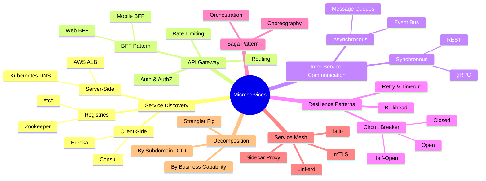
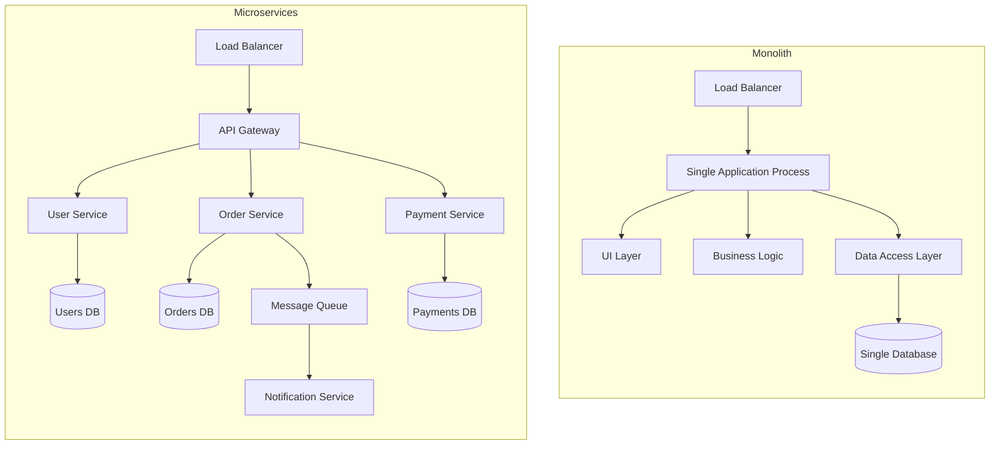
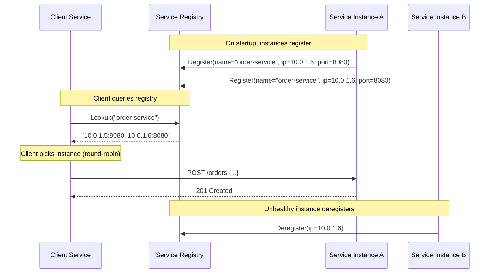
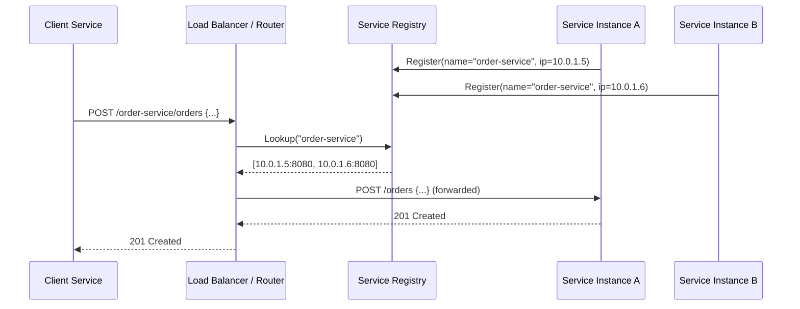
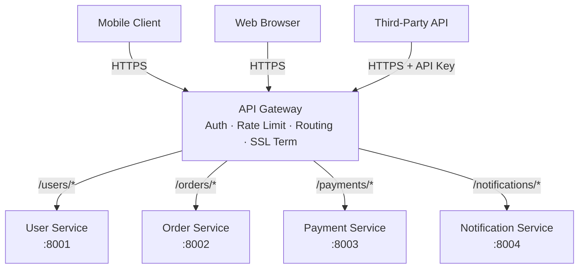
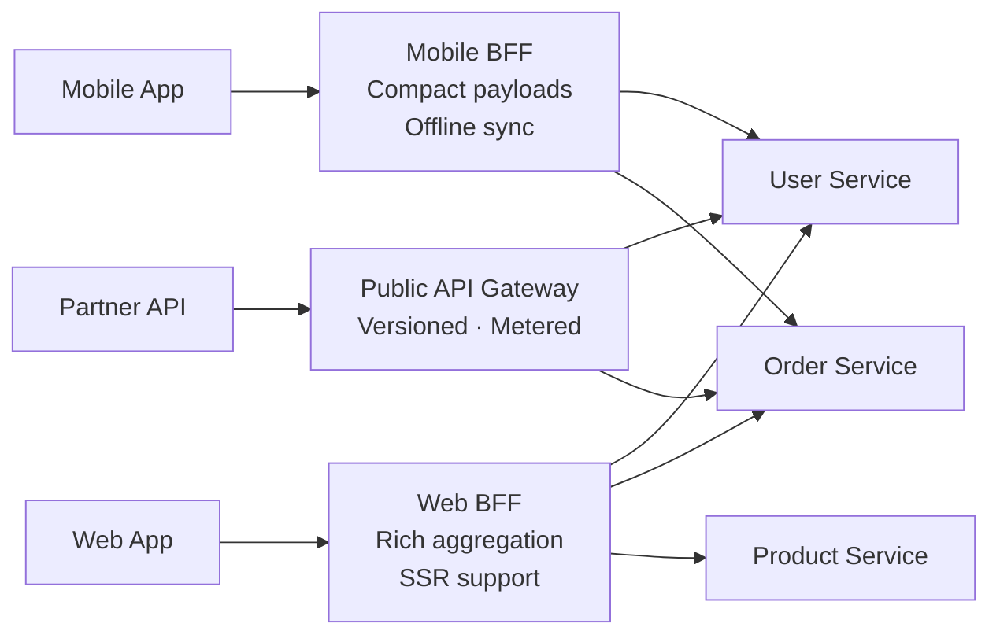
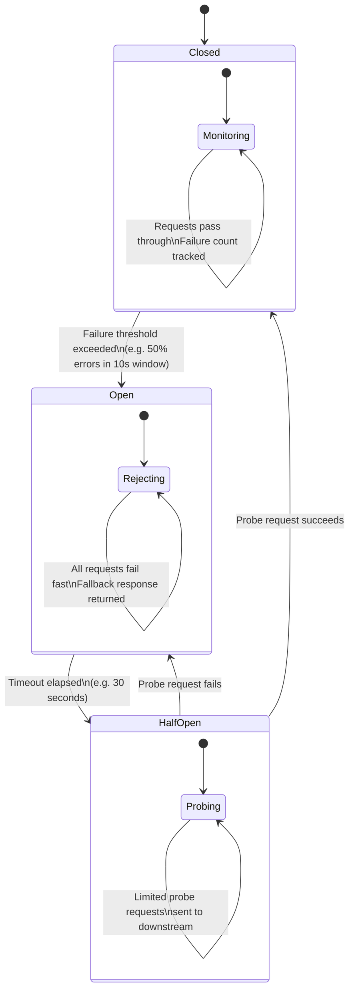
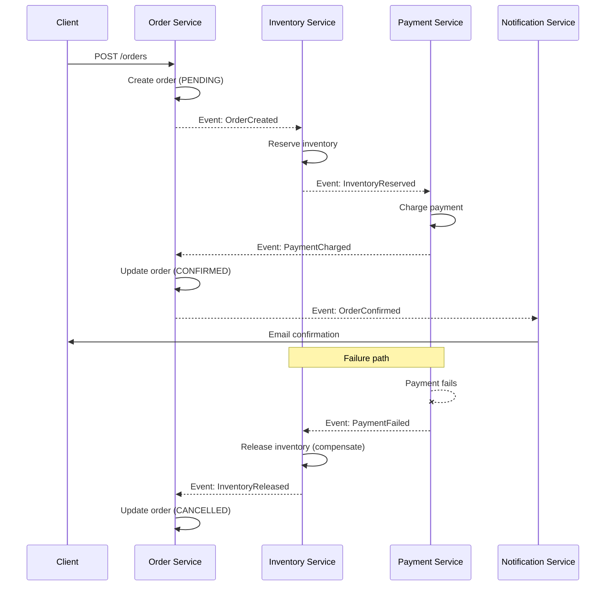
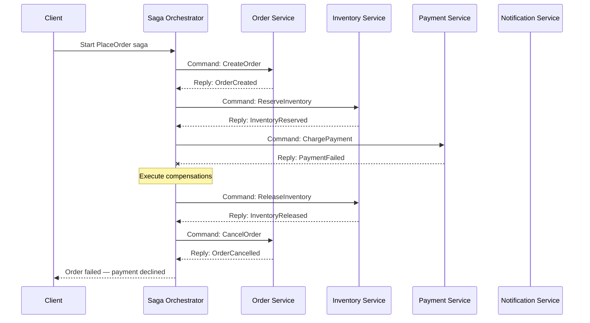
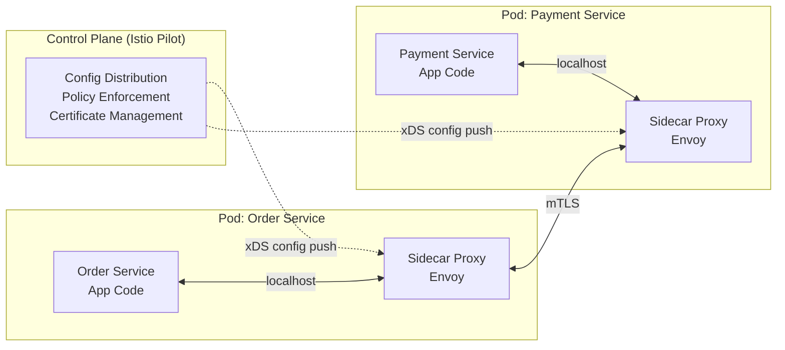

# Chapter 13: Microservices Architecture


> The goal of microservices is not to make systems more complex — it is to make complexity manageable by assigning clear ownership. A well-designed microservices system is harder to build than a monolith, but far easier to evolve.

---

## Mind Map



---

## Monolith vs Microservices

Before choosing microservices, you must understand what you are trading away — and what you gain. Neither architecture is universally correct; the right choice depends on team size, deployment velocity requirements, and domain complexity.

### Architecture Comparison



### Comparison Table

| Dimension | Monolith | Microservices |
|---|---|---|
| **Deployment** | Single unit — all-or-nothing releases | Independent — each service deploys separately |
| **Scaling** | Scale entire app even for one bottleneck | Scale individual services to demand |
| **Complexity** | Simple locally, complex as codebase grows | High operational complexity from day one |
| **Team Autonomy** | Shared codebase creates coordination overhead | Teams own their services end-to-end |
| **Data Ownership** | Shared database — easy joins, tight coupling | Each service owns its data — loose coupling |
| **Testing** | Straightforward integration testing | Service mocking, contract testing required |
| **Latency** | In-process calls (nanoseconds) | Network calls (milliseconds) per hop |
| **Fault Isolation** | One bug can crash the entire application | Failures are contained to individual services |
| **Time to Market** | Fast for small teams; slows with scale | Slower initial setup; faster long-term velocity |
| **Observability** | Single log stream, simpler tracing | Distributed tracing required (see [Chapter 17](/system-design/part-3-architecture-patterns/ch17-monitoring-observability)) |

**Rule of thumb:** Start with a well-structured monolith. Migrate to microservices when team size, deployment frequency, or scaling requirements genuinely justify the operational overhead. Amazon's rule: if a single team can't be fed with two pizzas, the service is too large.

---

## Service Discovery

In a microservices system, service instances start and stop dynamically — containers are rescheduled, pods restart, and IP addresses change constantly. **Service discovery** solves the problem of how services find each other without hardcoded addresses.

### Client-Side Discovery

The client is responsible for querying the service registry and selecting an instance using a load-balancing strategy (round-robin, least-connections, etc.).



**Tools:** Netflix Eureka, HashiCorp Consul, Apache Zookeeper

**Tradeoff:** Client gains control over load-balancing logic but must embed discovery logic in every service. Client libraries become a coupling point.

### Server-Side Discovery

The client sends requests to a load balancer or router. The router queries the service registry and forwards the request to the appropriate instance. The client knows nothing about discovery.



**Tools:** AWS ALB with ECS service discovery, Kubernetes DNS + kube-proxy, NGINX Plus

**Tradeoff:** Simpler clients, but the load balancer becomes a critical path component. Kubernetes uses this model natively — a `Service` object gets a stable DNS name (`order-service.default.svc.cluster.local`) that resolves to the active pods.

### Service Registry Tools

| Tool | Model | Consensus | Best For |
|---|---|---|---|
| **Consul** | CP (strong consistency) | Raft | Multi-datacenter, health checking, KV store |
| **etcd** | CP | Raft | Kubernetes backing store, configuration |
| **Zookeeper** | CP | ZAB | Legacy Hadoop/Kafka ecosystems |
| **Kubernetes DNS** | DNS-based | N/A (backed by etcd) | Native Kubernetes workloads |
| **Eureka** | AP (availability-first) | None | Netflix OSS stack, eventual consistency acceptable |

---

## API Gateway

An **API Gateway** is the single entry point for all client traffic. Instead of exposing dozens of service URLs to clients, the gateway presents a unified facade and handles cross-cutting concerns so individual services don't have to.

### Responsibilities

- **Routing** — maps public paths to internal service endpoints
- **Authentication & Authorization** — validates JWTs, API keys, OAuth tokens before traffic reaches services
- **Rate Limiting** — protects services from traffic spikes (see [Chapter 16](/system-design/part-3-architecture-patterns/ch16-security-reliability))
- **Request Aggregation** — fan-out to multiple services and compose a single response
- **Protocol Translation** — converts external REST calls to internal gRPC calls
- **SSL Termination** — decrypts HTTPS at the gateway; internal traffic uses plain HTTP or mTLS via service mesh

### Gateway Traffic Flow



**Tools:** AWS API Gateway, Kong, NGINX, Envoy, Traefik, Spring Cloud Gateway

### Backend for Frontend (BFF) Pattern

A single API Gateway serving both mobile and web clients creates tension — mobile needs compact payloads, web needs richer data. The **BFF pattern** creates a dedicated gateway per client type, allowing each to evolve independently.



**Real-world:** Netflix maintains separate BFFs for TV, mobile, and web — each optimized for its device's screen size, network conditions, and interaction model.

---

## Inter-Service Communication

Services must communicate. The choice between synchronous and asynchronous communication affects latency, coupling, and fault tolerance.

### Synchronous Communication

The caller blocks and waits for a response. Simple to reason about but creates temporal coupling — if the downstream service is slow or unavailable, the caller is affected.

- **REST over HTTP/1.1 or HTTP/2** — widely understood, good tooling, cache-friendly. Best for CRUD-style interactions with external or public-facing services. See [Chapter 12](/system-design/part-2-building-blocks/ch12-communication-protocols) for HTTP deep-dive.
- **gRPC** — Protocol Buffers + HTTP/2. Strongly typed, efficient binary serialization, supports streaming. Best for internal service-to-service calls where performance matters. See [Chapter 12](/system-design/part-2-building-blocks/ch12-communication-protocols) for gRPC deep-dive.

### Asynchronous Communication

The caller publishes an event or message and continues execution. The downstream service processes the message independently. Decouples services in time and increases resilience.

- **Message queues (point-to-point)** — one producer, one consumer. Durable delivery. Best for task delegation (e.g., send email, process image). See [Chapter 11](/system-design/part-2-building-blocks/ch11-message-queues) for message queue deep-dive.
- **Event bus (pub/sub)** — one producer, many consumers. Best for broadcasting domain events to multiple subscribers. See [Chapter 14](/system-design/part-3-architecture-patterns/ch14-event-driven-architecture) for event-driven patterns.

### Communication Comparison Table

| Dimension | REST | gRPC | Message Queue | Event Bus |
|---|---|---|---|---|
| **Coupling** | Temporal + interface | Temporal + strict types | Decoupled | Fully decoupled |
| **Latency** | Low (ms) | Very low (ms, binary) | Higher (async) | Higher (async) |
| **Payload** | JSON (human-readable) | Protobuf (binary, compact) | Any format | Any format |
| **Type Safety** | Optional (OpenAPI) | Strong (`.proto` schema) | Schema optional | Schema optional |
| **Streaming** | Limited (chunked transfer) | Native (4 modes) | Pull-based | Push-based |
| **Error Handling** | HTTP status codes | gRPC status codes | Dead-letter queues | Event replay |
| **Use Case** | Public APIs, CRUD | Internal high-perf calls | Task queues | Domain events |

---

## Circuit Breaker Pattern

When Service A calls Service B synchronously, a slow or failing Service B will cause Service A's threads to pile up waiting for responses. Under load, this cascades — Service A's connection pool exhausts, its own latency rises, and the failure propagates upstream. The **circuit breaker** prevents this cascade.

### States



**Closed:** Normal operation. Requests pass through. Failures are counted in a rolling window.

**Open:** Failure threshold exceeded. Requests are rejected immediately (fail fast) without calling the downstream service. A fallback response (cached data, default value, error) is returned. The downstream service gets time to recover.

**Half-Open:** After a configurable timeout, a small number of probe requests are allowed through. If they succeed, the circuit closes. If they fail, the circuit reopens.

### Implementation

```
// Pseudocode: Circuit Breaker logic
function callWithCircuitBreaker(serviceCall, circuitBreaker):
    if circuitBreaker.state == OPEN:
        if circuitBreaker.timeoutElapsed():
            circuitBreaker.state = HALF_OPEN
        else:
            return fallbackResponse()  // fail fast

    try:
        response = serviceCall()
        circuitBreaker.recordSuccess()
        if circuitBreaker.state == HALF_OPEN:
            circuitBreaker.state = CLOSED
        return response
    catch Exception:
        circuitBreaker.recordFailure()
        if circuitBreaker.failureRateExceeds(threshold):
            circuitBreaker.state = OPEN
        throw
```

**Libraries:** Netflix Hystrix (now in maintenance), Resilience4j (JVM), Polly (.NET), `circuitbreaker` package (Go), `pybreaker` (Python).

**Real-world:** Netflix's Hystrix was born from a real incident — a single downstream service's degradation caused their entire API to become unresponsive. By wrapping every external call in a circuit breaker, Netflix guarantees that no single service failure can take down the API tier.

---

## Saga Pattern for Distributed Transactions

In a monolith with a shared database, a multi-step operation (place order → reserve inventory → charge payment → send confirmation) can be wrapped in a single ACID transaction. In microservices, each service owns its own database — there is no distributed ACID transaction.

The **Saga pattern** breaks a distributed transaction into a sequence of local transactions. Each step publishes an event or sends a command to trigger the next step. If a step fails, **compensating transactions** are executed in reverse to undo completed steps.

### Choreography-Based Saga

No central coordinator. Each service listens for events and decides what to do next. Services are fully decoupled.



**Advantages:** No single point of failure, fully decoupled, easy to add new participants.
**Disadvantages:** Hard to track overall transaction state; debugging requires tracing events across multiple services.

### Orchestration-Based Saga

A central **Saga Orchestrator** drives the process by sending commands to each service and waiting for responses.



### Choreography vs Orchestration

| Dimension | Choreography | Orchestration |
|---|---|---|
| **Coordination** | Implicit via events | Explicit — central orchestrator |
| **Coupling** | Low — services only know events | Medium — services know orchestrator protocol |
| **Visibility** | Low — state distributed across services | High — orchestrator holds full state |
| **Debugging** | Hard — must trace events across logs | Easier — orchestrator logs full saga state |
| **Single Point of Failure** | None | Orchestrator (mitigate with high availability) |
| **Best For** | Simple, stable flows with few participants | Complex flows, many compensations, regulatory audit requirements |

**Cross-reference:** Choreography-based sagas rely on event-driven patterns covered in [Chapter 14](/system-design/part-3-architecture-patterns/ch14-event-driven-architecture).

---

## Service Mesh

As the number of microservices grows, cross-cutting networking concerns — mutual TLS, retries, timeouts, circuit breaking, observability — are duplicated in every service. A **service mesh** externalizes these concerns from application code into a dedicated infrastructure layer.

### Sidecar Proxy Pattern

Every service instance gets a co-located **sidecar proxy** (e.g., Envoy). All inbound and outbound network traffic flows through the proxy, not directly to the service. The application code is unaware of the mesh.



### What a Service Mesh Handles

| Concern | Without Mesh | With Mesh |
|---|---|---|
| **mTLS encryption** | Each service implements TLS | Sidecar handles cert rotation automatically |
| **Retries & timeouts** | Embedded in each service's HTTP client | Configured in mesh policy, applied uniformly |
| **Circuit breaking** | Each service integrates Resilience4j | Configured once in mesh, applied to all |
| **Load balancing** | Client-side or DNS round-robin | Sidecar uses L7 policies (least-request, zone-aware) |
| **Distributed tracing** | Manual instrumentation per service | Automatic trace propagation via headers |
| **Traffic splitting** | Custom code or feature flags | Mesh policy (e.g., 10% canary, 90% stable) |
| **Observability** | Each service emits metrics manually | Golden signals (latency, errors, saturation) auto-generated |

**Tools:** Istio (most feature-rich, higher complexity), Linkerd (lightweight, simpler operational model), Consul Connect, AWS App Mesh.

**When to use a service mesh:** Justified at 10+ services when operational burden of per-service networking logic exceeds the complexity of running the mesh itself. Avoid premature adoption — the control plane adds real operational overhead.

---

## Decomposition Strategies

Deciding where to draw service boundaries is the hardest part of microservices design. Poor boundaries create chatty, tightly-coupled services worse than the monolith they replaced.

### Decompose by Business Capability

Organize services around what the business does, not how the technology is structured.

A typical e-commerce system decomposed by business capability:

```
├── Catalog Service      (product listing, search, pricing)
├── Order Service        (order placement, order history)
├── Inventory Service    (stock levels, reservations)
├── Payment Service      (charging, refunds, fraud detection)
├── Shipping Service     (fulfillment, tracking)
├── Notification Service (email, SMS, push)
└── Identity Service     (auth, user profiles)
```

Each service maps to a business function owned by a single team. The team controls the full stack: schema, code, deployment, on-call rotation.

### Decompose by Subdomain (Domain-Driven Design)

DDD introduces **Bounded Contexts** — explicit boundaries around a domain model. Within a bounded context, terms have precise meanings. Across boundaries, models are translated via **anti-corruption layers**.

A "Customer" in the Order subdomain (name, shipping address, loyalty tier) is different from a "Customer" in the Billing subdomain (billing address, payment methods, credit limit). DDD makes these differences explicit and prevents one team's model from leaking into another's.

**Bounded context = natural service boundary.**

### Strangler Fig Pattern

Migrating a large monolith to microservices all at once is high-risk. The **Strangler Fig** pattern migrates incrementally:

1. Place a routing layer (API gateway or reverse proxy) in front of the monolith
2. Identify a bounded context to extract first (choose low-risk, high-change-frequency)
3. Implement the new microservice in parallel
4. Route traffic for that domain to the new service
5. Delete the corresponding code from the monolith
6. Repeat until the monolith is empty — or small enough to keep

```mermaid
flowchart LR
    Client --> GW[API Gateway / Proxy]

    subgraph New["New Microservices (growing)"]
        NS[Notification Service]
        IS[Identity Service]
    end

    subgraph Legacy["Monolith (shrinking)"]
        MON[Monolith\nOrders · Payments · Catalog]
    end

    GW -->|/notifications| NS
    GW -->|/auth| IS
    GW -->|/* (remaining)| MON
```

The strangler fig — a tropical plant that grows around a host tree, eventually replacing it — is the namesake of this pattern. Amazon, LinkedIn, and Airbnb all used variants of this approach.

---

## Real-World Examples

### Netflix: 600+ Microservices

Netflix operates one of the most cited microservices deployments in the industry. Starting as a DVD rental monolith, Netflix began its cloud migration in 2008 and completed it by 2016. Today:

- **600+ microservices** handle video streaming, recommendations, billing, and device management
- Each team owns 2–5 services end-to-end (deploy, operate, on-call)
- **Eureka** handles service discovery across multiple AWS regions
- **Hystrix** circuit breakers (now largely replaced by Resilience4j) isolate failures
- **Zuul** and later **Spring Cloud Gateway** serve as the API gateway layer
- Custom chaos engineering tooling (Chaos Monkey) randomly terminates production services to prove resilience

Key lesson: Netflix's microservices investment paid off in deployment velocity — teams deploy hundreds of times per day with independent release cycles — but required massive investment in tooling, observability, and operational culture.

### Amazon: The Two-Pizza Team Rule

Amazon's CEO Jeff Bezos mandated in the early 2000s that every team must be small enough to be fed by two pizzas (~6–8 people). This rule drove the decomposition of Amazon's monolith into services that later became AWS primitives.

Every team owns its service like a product: API contract, data store, deployment pipeline, SLA. Teams communicate only through APIs — no shared databases, no shared libraries beyond approved utilities.

The result: Amazon can deploy to production every 11.6 seconds on average, with thousands of teams operating independently.

---

## Key Takeaway

> **Microservices trade operational complexity for organizational scalability.** A monolith is simpler to build and run at small scale; microservices become necessary when independent deployability, team autonomy, and fault isolation justify the overhead of distributed systems. Get service boundaries right by following business capabilities and DDD bounded contexts — wrong boundaries create a distributed monolith that has all the costs and none of the benefits. Invest in the platform (service discovery, API gateway, observability, circuit breakers) before you invest in splitting services.

---

## Practice Questions

1. **Boundary Design:** An e-commerce startup wants to decompose their monolith into microservices. They have a single `users` table joined in 15 places across the codebase. Describe the strangler fig migration strategy step by step. What service do you extract first, and why?

2. **Circuit Breaker Tuning:** Your payment service has a circuit breaker configured with a 50% failure threshold over a 10-second window and a 30-second open timeout. Under a flash sale, the payment processor becomes slow (P99 = 8s) but not failing. Explain why the circuit breaker may not trip, and what additional resilience mechanism you would add.

3. **Saga Trade-offs:** You are building a travel booking system that must atomically book a flight, hotel, and car rental across three external APIs. Compare choreography-based and orchestration-based sagas for this use case. Which would you choose and why? How do you handle the case where the car rental is unavailable after the flight and hotel are already confirmed?

4. **Service Mesh Justification:** Your team runs 8 microservices. A senior engineer proposes adopting Istio. A skeptical teammate says "that's too much complexity for our scale." What criteria would you evaluate to decide? At what point does a service mesh pay for itself?

5. **API Gateway vs BFF:** A fintech company has three client types: a web dashboard (data-heavy, many charts), a mobile app (bandwidth-constrained), and a partner API (versioned, metered). Design the gateway layer. Would you use a single API gateway or the BFF pattern? Justify your choice and describe what each BFF would do differently.
