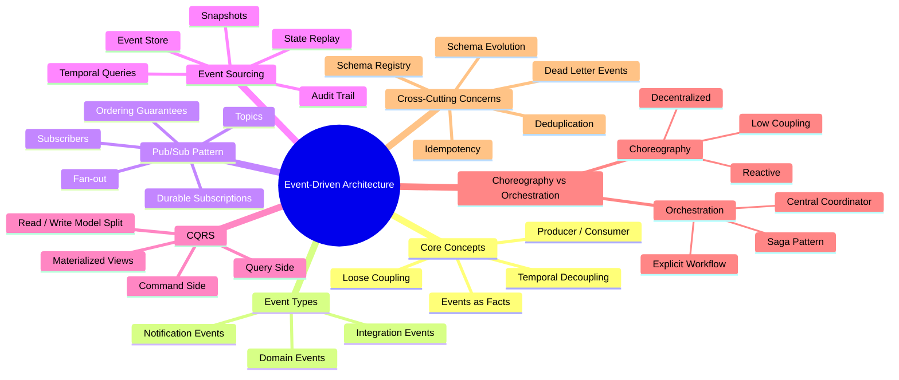
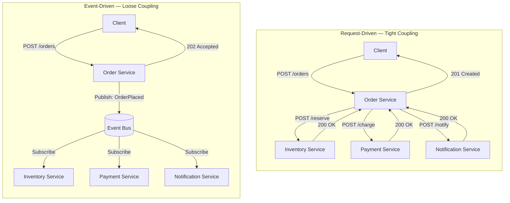
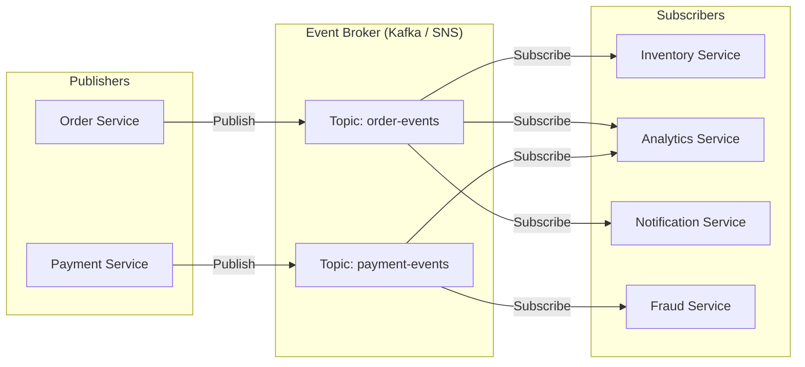
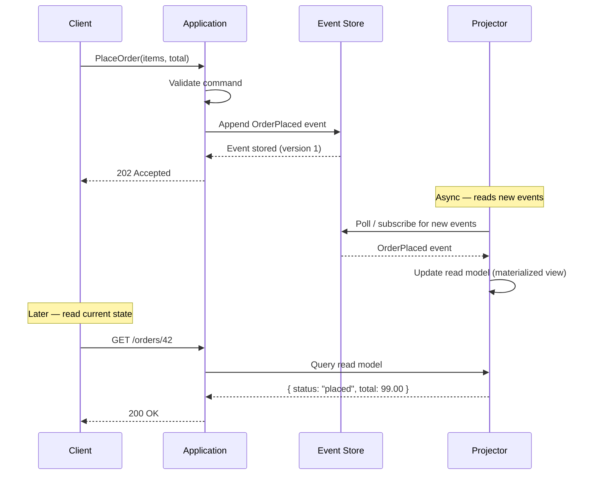
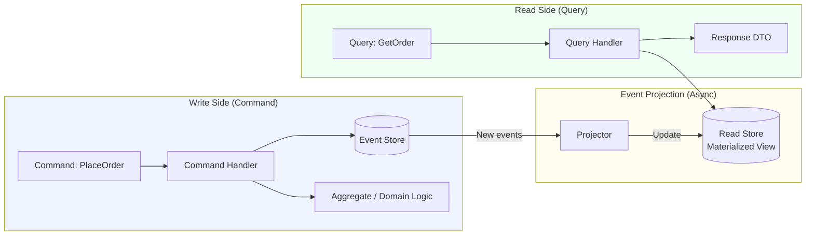
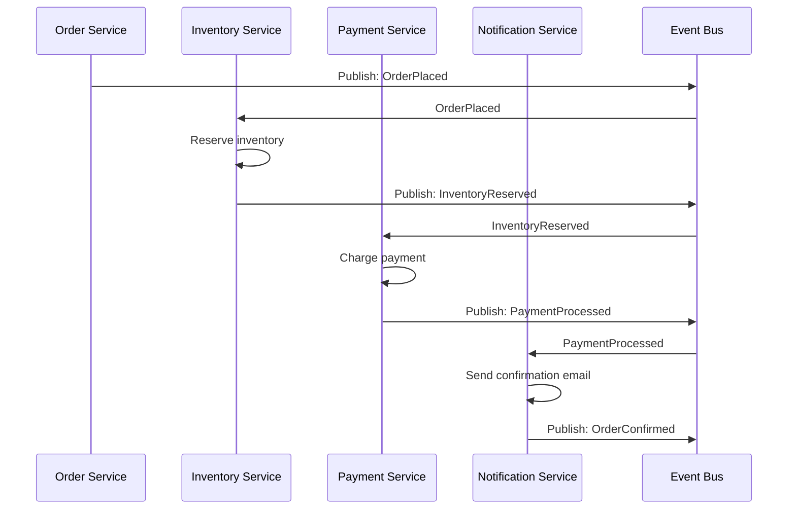
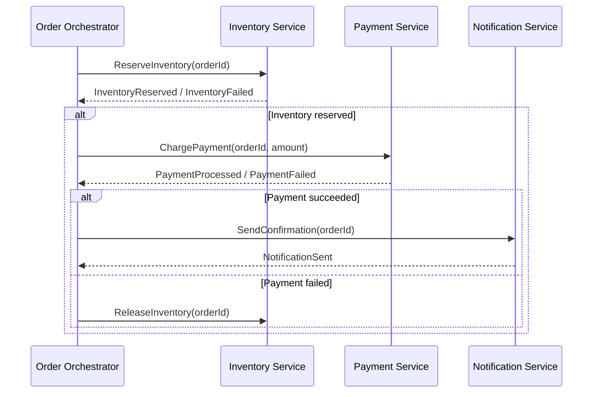

# Chapter 14: Event-Driven Architecture


> In a request-driven world, services talk to each other. In an event-driven world, services talk about what happened — and any interested party can listen. That shift from commands to facts is the foundation of resilient, loosely coupled distributed systems.

---

## Mind Map



---

## What Is Event-Driven Architecture?

An **event** is an immutable record of something that happened: `OrderPlaced`, `PaymentProcessed`, `UserSignedUp`. Event-driven architecture (EDA) is a design paradigm where services communicate by publishing and consuming events rather than calling each other directly.

The fundamental model:

- **Producer** — a service that detects a state change and publishes an event
- **Event bus / broker** — the infrastructure that routes events (Kafka, SNS, EventBridge)
- **Consumer** — a service that subscribes to events and reacts to them

The defining property is **loose coupling**: the producer does not know who will consume its event, and the consumer does not know (or care) which service produced it.

### Request-Driven vs Event-Driven



**Comparison:**

| Property | Request-Driven | Event-Driven |
|---|---|---|
| **Coupling** | Tight — caller knows all receivers | Loose — publisher unaware of consumers |
| **Latency** | Total = sum of all downstream calls | Near-zero for publisher; async for consumers |
| **Resilience** | One slow/down service blocks the chain | Consumers fail independently; events buffer |
| **Discoverability** | Explicit call graph | Implicit — new consumers subscribe without changing producers |
| **Complexity** | Simple to trace and debug | Harder to trace; requires distributed observability |

---

## Event Types

Not all events serve the same purpose. Distinguishing them prevents design confusion.

| Type | Purpose | Scope | Example |
|---|---|---|---|
| **Domain Event** | Records a business fact within a bounded context | Internal | `OrderConfirmed`, `ItemShipped` |
| **Integration Event** | Crosses bounded context or service boundary | Cross-service | `OrderPlacedEvent` published to external consumers |
| **Notification Event** | Lightweight signal; receiver fetches full state separately | Cross-service | `UserProfileUpdated { userId }` — no payload, just a ping |

**Domain events** are owned by a single domain and carry full context. **Integration events** are the public contract between services — treat them like API contracts: version them carefully, evolve them with backward compatibility. **Notification events** are useful when the payload would be large or frequently changing; the consumer calls back to fetch current state.

---

## Pub/Sub Pattern

Publish/Subscribe is the most common EDA transport pattern. Publishers write to a **topic**; any number of subscribers independently consume from that topic.



### Key Pub/Sub Properties

**Fan-out** — a single published event is delivered to all active subscribers simultaneously. Adding a new consumer requires zero changes to the publisher.

**Ordering guarantees** — most brokers provide ordering within a partition/shard but not across them. Kafka guarantees order within a partition; SNS/SQS Standard does not guarantee order globally. If strict ordering matters (e.g., order lifecycle events), partition by the natural key (e.g., `orderId`).

**Durable subscriptions** — subscribers can be offline; the broker retains events for a configurable retention window. Consumers replay missed events on restart. This is a core advantage over point-to-point HTTP calls.

> **Cross-reference:** Kafka's topic/partition model, consumer groups, and offset management are covered in depth in [Chapter 11 — Message Queues](/system-design/part-2-building-blocks/ch11-message-queues). This chapter focuses on the architectural patterns built on top of that infrastructure.

---

## Event Sourcing

### The Core Idea

Traditional systems store **current state**: the `orders` table holds the latest snapshot of each order. Event sourcing inverts this: store the **sequence of events** that led to the current state. Current state is derived by replaying the event log.

```
Traditional:  DB row = { orderId: 42, status: "shipped", total: 99.00 }

Event Sourced: Event log for orderId 42:
  1. OrderPlaced     { total: 99.00, items: [...] }
  2. PaymentReceived { amount: 99.00, method: "card" }
  3. OrderPicked     { warehouseId: "W-7" }
  4. OrderShipped    { trackingId: "UPS-123", carrier: "UPS" }
```

### Write and Read Flow



### Pros and Cons

| Aspect | CRUD (State Storage) | Event Sourcing |
|---|---|---|
| **Storage model** | Current state only | Full event history |
| **Audit trail** | Requires separate audit log | Built-in — every change is an event |
| **Temporal queries** | Hard — requires history table | Native — replay to any point in time |
| **Debugging** | Query current state | Replay events to reproduce exact past state |
| **Complexity** | Low | High — projections, snapshots, schema evolution |
| **Read performance** | Fast — direct query | Requires projection/read model (eventual consistency) |
| **Write performance** | Update in place | Append-only (fast writes, no contention) |
| **Storage cost** | Low — only current state | High — full history grows unbounded |
| **Onboarding** | Familiar to most engineers | Steep learning curve |

**When event sourcing is worth the cost:**

- You need a complete, tamper-proof audit trail (financial systems, compliance)
- You need temporal queries ("what was the state of this account at 2PM yesterday?")
- Multiple independent projections need to derive different read models from the same facts
- The domain is complex enough that replaying business rules over events adds value

**Snapshot optimization** — replaying thousands of events on every read is expensive. Periodically store a snapshot of current state at a known version; on read, load the latest snapshot then replay only newer events.

---

## CQRS — Command Query Responsibility Segregation

### The Pattern

CQRS separates the write path (commands that mutate state) from the read path (queries that retrieve state). They use different models, different data stores if needed, and scale independently.



**Write side** — receives commands, validates them against domain logic (aggregates), and appends events to the event store. Optimized for consistency and correctness.

**Read side** — queries a pre-built materialized view that is updated asynchronously by projectors. Optimized for query performance. The read model can be shaped exactly to the UI's needs (denormalized, pre-joined).

### When to Use CQRS

CQRS adds significant complexity. Apply it selectively:

| Scenario | Use CQRS? | Reason |
|---|---|---|
| Simple CRUD with low traffic | No | Overhead exceeds benefit |
| Complex domain with many business rules | Yes | Write model enforces invariants cleanly |
| Read/write ratio heavily skewed (e.g., 100:1 reads) | Yes | Independent scaling of read replicas |
| Multiple UI views need differently shaped data | Yes | Separate projections per view |
| Audit trail / regulatory compliance required | Yes | Combine with event sourcing |
| Small team, single service | No | KISS — premature optimization |

> **Note:** CQRS does not require event sourcing, and event sourcing does not require CQRS. They compose well together but are independent patterns.

---

## Choreography vs Orchestration

When multiple services must collaborate to complete a business process, you have two coordination models.

### Choreography — Decentralized Reaction

Each service listens for events and reacts independently. No central coordinator exists. The workflow emerges from the interactions.



### Orchestration — Centralized Coordination

A dedicated orchestrator (saga coordinator) explicitly directs each step, waits for responses, and handles failures.



### Comparison

| Property | Choreography | Orchestration |
|---|---|---|
| **Coupling** | Low — services only know the event schema | Medium — orchestrator knows all participants |
| **Visibility** | Low — workflow is implicit, hard to see end-to-end | High — orchestrator holds the full state machine |
| **Complexity** | Grows with number of services (emergent behavior) | Localized in orchestrator (explicit, testable) |
| **Failure handling** | Each service must publish compensating events independently | Orchestrator drives compensating transactions centrally |
| **Scalability** | Each service scales independently | Orchestrator can become a bottleneck |
| **Debugging** | Requires distributed tracing to reconstruct flow | Orchestrator state is queryable |
| **Best for** | Simple, stable workflows with few services | Complex workflows requiring rollback, retries, human steps |

> **Cross-reference:** The saga pattern — the standard approach for distributed transactions using orchestration — is detailed in [Chapter 13 — Microservices](/system-design/part-3-architecture-patterns/ch13-microservices), including compensating transactions and the outbox pattern for reliable event publishing.

---

## Event Schema Evolution

Events are the public API between services. Once published, consumers depend on them. Schema evolution is one of the hardest operational problems in EDA.

**Backward compatibility** — new consumers can read events written by older producers. Achieved by: only adding optional fields, never removing fields, never changing field semantics.

**Forward compatibility** — old consumers can read events written by newer producers. Achieved by: consumers ignore unknown fields (use schema-flexible formats like Avro/Protobuf with default values, or JSON with additive-only changes).

**Schema Registry** — a central service (e.g., Confluent Schema Registry, AWS Glue Schema Registry) that:

1. Stores versioned schemas for every topic
2. Validates that new schemas are compatible before publishing
3. Provides schema IDs embedded in message headers so consumers deserialize correctly
4. Enforces compatibility rules (BACKWARD, FORWARD, FULL) per topic

**Versioning strategy:**

- For minor additions: add optional fields, bump minor version
- For breaking changes: publish to a new topic (`order-events-v2`), run both topics in parallel during migration, retire the old topic once all consumers are migrated

---

## Idempotency

### Why Events Are Delivered More Than Once

In any reliable messaging system using at-least-once delivery (which includes Kafka, SQS, SNS, and most brokers in practice), a consumer may process the same event multiple times:

- Consumer crashes after processing but before committing the offset
- Network timeout causes the broker to assume the consumer failed and redeliver
- Manual reprocessing during incident recovery replays past events

### How to Handle Duplicates

**Idempotency key** — every event carries a unique identifier (`eventId`, `correlationId`). Before processing, the consumer checks a deduplication store (Redis, a DB table with a unique constraint) whether this event was already processed.

```
Process(event):
  if dedup_store.exists(event.eventId):
    return  # Already processed — skip

  process_business_logic(event)
  dedup_store.set(event.eventId, TTL=7_days)
  commit_offset()
```

**Idempotent operations** — design business operations to produce the same result when applied multiple times. Setting a field to a value is idempotent; incrementing a counter is not. Where possible, use `SET status = 'shipped'` rather than `UPDATE shipped_count = shipped_count + 1`.

**Natural idempotency** — database upserts (`INSERT ... ON CONFLICT DO UPDATE`) make many operations naturally safe to retry without explicit deduplication tracking.

> **Cross-reference:** Exactly-once semantics using Kafka's idempotent producers and transactional API are covered in [Chapter 11 — Message Queues](/system-design/part-2-building-blocks/ch11-message-queues).

---

## Real-World Cases

### Uber — Event-Driven Dispatch

Uber's dispatch system coordinates drivers, riders, GPS pings, pricing, and payments across tens of millions of concurrent events. The event-driven approach emerged from necessity: synchronous coordination at that scale would require impossibly low latency across many dependent services.

- Each ride lifecycle step (`RideRequested`, `DriverMatched`, `RideStarted`, `RideCompleted`) is an event published to their internal streaming platform (originally Cherami, later migrated to Kafka-compatible infrastructure)
- **Pricing service** subscribes to location and demand events to recalculate surge pricing in near-real-time without blocking the ride request path
- **Driver supply service** independently consumes `RideCompleted` and `DriverGoesOnline` events to update availability — no direct coupling to the dispatch service
- **Billing service** processes `RideCompleted` events asynchronously; if it lags, it doesn't affect ride availability
- Key insight from Uber's engineering blog: decoupling the payment pipeline from the ride completion event eliminated a class of cascading failures where slow payment processing would delay driver availability

### Netflix — Event Pipeline for Personalization

Netflix's recommendation engine, encoding pipeline, and A/B testing infrastructure are all event-driven.

- **Watch event pipeline**: Every play, pause, seek, and completion fires an event. These flow through a Kafka-based pipeline into multiple consumers: real-time recommendation updates, analytics aggregation, content popularity scoring, and billing.
- **Encoding pipeline**: When a new video is ingested, a `VideoUploaded` event triggers a choreography-based workflow — thumbnail generation, encoding at multiple bitrates, DRM packaging, CDN distribution — each as independent consumers. The ingestion service publishes once; dozens of workers react in parallel.
- **Schema evolution in practice**: Netflix runs thousands of event types. Their internal schema registry enforces that every change to a high-volume event schema is backward-compatible before deployment. Engineers cannot publish to a production topic without schema validation passing.
- Scale: Netflix processes **500 billion events per day** through their pipeline (primarily on Apache Kafka), demonstrating that EDA at extreme scale requires disciplined schema governance, not just the right broker.

---

## Key Takeaway

> Event-driven architecture trades the simplicity of direct service calls for the resilience and scalability of asynchronous fact-sharing. The benefits — loose coupling, independent scaling, natural audit trails — are real, but so are the costs: eventual consistency, invisible workflows, and the operational burden of schema governance and idempotency. Apply EDA where the coupling costs of synchronous calls are genuinely painful, not as a default pattern for every interaction.

---

## Practice Questions

1. **Order fulfillment workflow**: Design an order fulfillment system using event-driven architecture. An order must trigger inventory reservation, payment charging, and shipping label creation — but if payment fails, inventory must be released. Model this with both choreography and orchestration. Which would you choose and why?

2. **Event sourcing trade-offs**: Your team proposes event sourcing for a high-traffic e-commerce catalog (10,000 product updates/day, 1 million reads/day). The argument is "we get audit history for free." Walk through the costs and benefits. Would you use event sourcing here? What read model strategy would you apply?

3. **CQRS scaling**: A social platform's feed query is slow because it joins users, follows, and posts tables. Propose a CQRS design where the write side remains relational but the read side is a materialized feed per user. What events trigger feed updates? How do you handle eventual consistency when a user posts and immediately refreshes their own feed?

4. **Schema evolution scenario**: You publish an `OrderPlaced` event with fields `{ orderId, userId, total }`. Six months later you need to add `{ discountCode, itemCount }` and rename `total` to `subtotal`. Describe your migration strategy. Which changes are safe? Which require a new topic version?

5. **Idempotency challenge**: Your notification service consumes `OrderShipped` events and sends an SMS. Due to a Kafka partition rebalance, the same event is delivered twice within 30 seconds. Describe three different mechanisms to prevent duplicate SMS messages, and compare their complexity, latency impact, and failure modes.

