# Chapter 15: Data Replication & Consistency


> *Replication is not a backup strategy — it is a latency, availability, and fault-tolerance strategy. The moment you have two copies of data, you have a consistency problem.*

---

## Mind Map

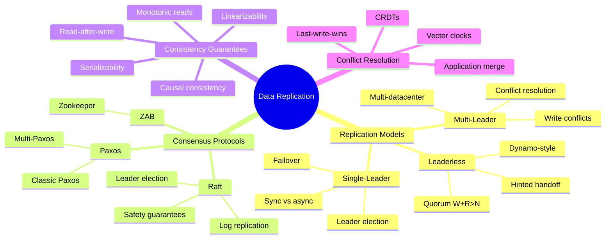

---

## Why Replication?

Before examining the how, understand the why. Every replication strategy is a different answer to the same four goals:

| Goal | Problem Solved | Example |
|------|---------------|---------|
| **Availability** | If one node dies, others serve traffic | Primary fails, replica takes over |
| **Fault tolerance** | Hardware failures, network partitions | Survive AZ outage with 3-replica setup |
| **Read scaling** | Distribute read load across replicas | 10 read replicas behind a load balancer |
| **Geographic latency** | Place data close to users | EU replica for European users, US replica for American users |

The core tension: **keeping replicas in sync costs latency; letting them diverge risks inconsistency**. Every replication model in this chapter is a different point on that spectrum.

> Cross-reference: [ch03](/system-design/part-1-fundamentals/ch03-core-tradeoffs) introduced CAP Theorem — the theoretical foundation. This chapter is the practical application: how real systems navigate the C vs A trade-off.

---

## Single-Leader Replication

### How It Works

All writes go to exactly one node — the **leader** (also called master or primary). The leader writes to its local storage, then replicates changes to **followers** (replicas, standbys). Clients may read from any follower or the leader.

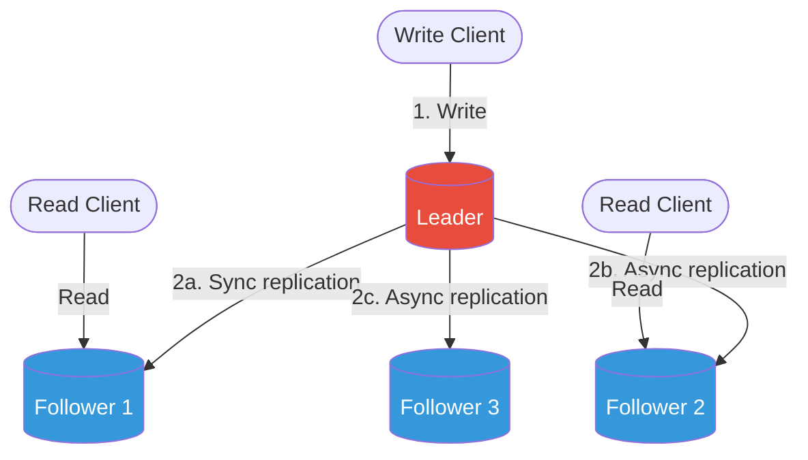

### Sync vs Async Replication

The most critical configuration decision in single-leader replication:

| Aspect | Synchronous | Asynchronous |
|--------|------------|--------------|
| **Durability** | Write confirmed only after all sync replicas acknowledge | Leader acknowledges immediately; replicas catch up later |
| **Write latency** | Higher — waits for replica network RTT | Low — no waiting |
| **Data loss on leader crash** | Zero (for sync replicas) | Up to replication lag behind |
| **Availability** | Lower — leader blocked if sync replica is down | High — leader accepts writes regardless of replica state |
| **Typical use** | Financial systems, metadata stores | Social feeds, analytics, logs |
| **Semi-sync hybrid** | One sync replica, rest async (MySQL default) | Balances durability and performance |

**In practice:** PostgreSQL streaming replication defaults to async. MySQL supports semi-synchronous. Most cloud-managed databases (RDS, Cloud SQL) offer tunable durability levels.

### Replication Lag

Async replication creates **replication lag** — the window between a write being committed on the leader and becoming visible on followers. This lag causes:

- **Read-your-own-writes violation**: User posts a comment, reads from a lagged replica, sees old state
- **Monotonic read violation**: User reads new data, then reads from a more-lagged replica, sees older data
- **Causality violations**: Two events ordered on leader appear reversed on follower

See [Consistency Guarantees](#consistency-guarantees) for mitigation strategies.

### Failover: Leader Election

When a leader fails, the system must elect a new leader. This is deceptively hard:

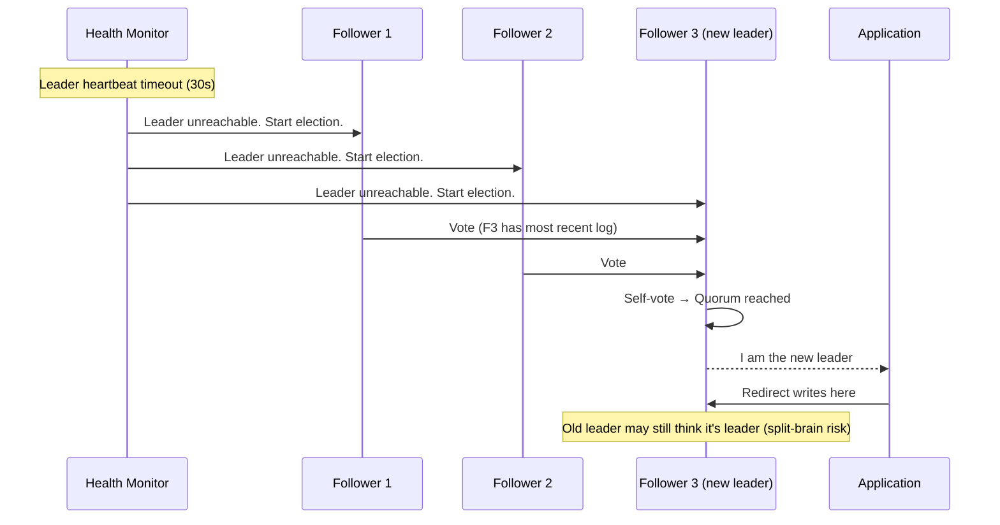

**Split-brain risk**: If the old leader was merely network-partitioned (not crashed), two nodes may simultaneously believe they are the leader. Mitigation: **STONITH** (Shoot The Other Node In The Head) — one leader must be fenced before the other is promoted.

**Used by**: PostgreSQL with Patroni/pg_auto_failover, MySQL with Orchestrator, Redis Sentinel.

---

## Multi-Leader Replication

### How It Works

Multiple nodes (typically one per datacenter) each accept writes and replicate to one another. Used when single-leader replication would route all writes through one geographic location, adding unacceptable latency.

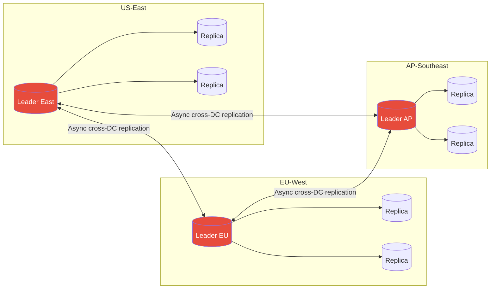

### Write Conflicts

Multi-leader replication introduces **write conflicts** — the central problem the model must solve.

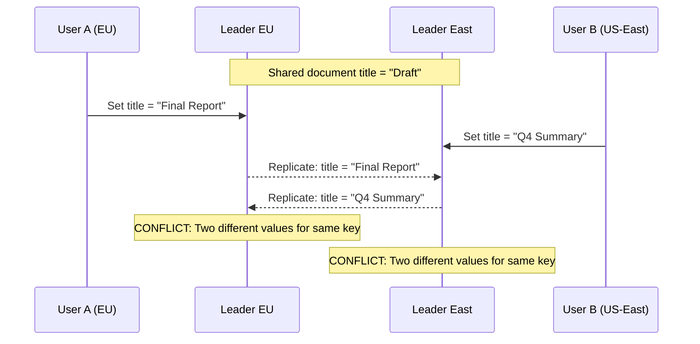

### Conflict Resolution Strategies

| Strategy | How It Works | Pros | Cons |
|----------|-------------|------|------|
| **Last-Write-Wins (LWW)** | Each write gets a timestamp; highest timestamp wins | Simple, always resolves | Data loss — the "losing" write is silently dropped |
| **Merge by union** | For sets, union both values | No data loss for set types | Only works for specific data types |
| **Custom application logic** | App receives both versions, decides | Maximum control | Complexity pushed to application layer |
| **On-write detection** | Detect conflict at write time, abort one | Clean | Requires coordination, reduces availability |
| **CRDTs** | Data structures that merge deterministically | Automatic, no data loss | Limited to CRDT-compatible data models |

**LWW caveat**: Clock skew between nodes makes timestamps unreliable. Two writes milliseconds apart with skewed clocks can silently discard the "later" one. Vector clocks solve this.

**Used by**: CouchDB (multi-master with custom resolution), MySQL Group Replication, Cassandra (multi-leader topology).

---

## Leaderless Replication (Dynamo-Style)

### How It Works

No single node has special write authority. Clients (or a coordinator) send writes and reads to **multiple nodes simultaneously**. Introduced by Amazon Dynamo (2007); adopted by Cassandra, Riak, Voldemort.

### Quorum Reads and Writes

The consistency guarantee is expressed via three values:

- **N** — total number of replicas
- **W** — number of replicas that must acknowledge a write
- **R** — number of replicas that must respond to a read

**Rule:** `W + R > N` guarantees at least one node in the read set has the latest write.

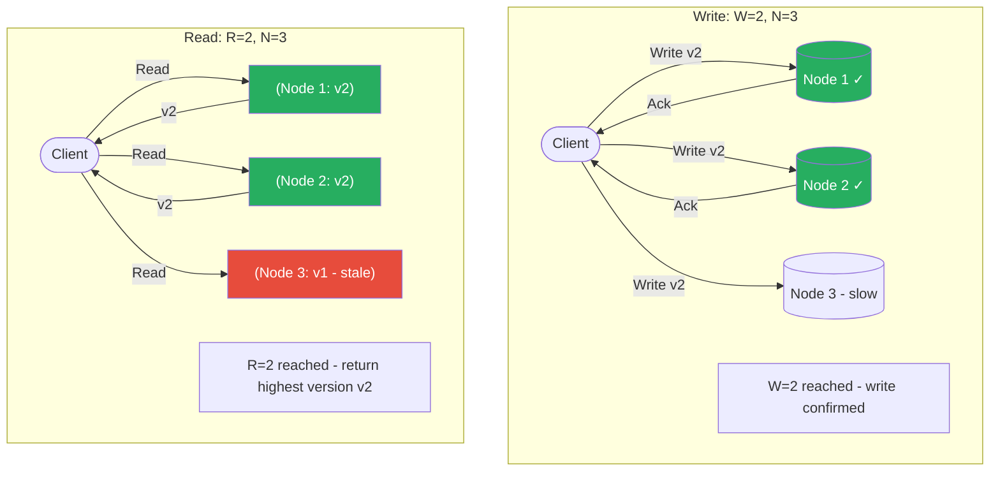

**Common quorum configurations** (N=3):

| W | R | Guarantee | Trade-off |
|---|---|-----------|-----------|
| 3 | 1 | Strong (W+R=4>3) | Slow writes |
| 1 | 3 | Strong (W+R=4>3) | Slow reads |
| 2 | 2 | Strong (W+R=4>3) | Balanced |
| 1 | 1 | None (W+R=2, not >3) | Maximum performance, eventual consistency |

### Handling Node Failures: Sloppy Quorum & Hinted Handoff

When a node in the write set is temporarily unavailable, the coordinator uses a **sloppy quorum** — it writes to a different available node temporarily, tagging the write with a hint indicating the intended destination. When the failed node recovers, the temporary node **hands off** the hinted write (hinted handoff).

### Anti-Entropy

Background process that compares replicas and copies missing data. Uses **Merkle trees** (hash trees) to efficiently detect divergence — each node maintains a tree of hashes over its key ranges; comparing root hashes identifies which subtrees differ without transferring all data.

**Comparison:**

| Mechanism | Trigger | Latency | Use |
|-----------|---------|---------|-----|
| Read repair | On read, if stale replica found | Zero extra | Hot data |
| Hinted handoff | On write to unavailable node | On recovery | Recent writes |
| Anti-entropy | Background continuous | Minutes/hours | All data |

---

## Replication Model Comparison

| Aspect | Single-Leader | Multi-Leader | Leaderless |
|--------|--------------|--------------|------------|
| **Write conflicts** | None (one writer) | Possible | Possible |
| **Write throughput** | Bottlenecked at leader | High (per-DC leader) | Highest (any node) |
| **Write latency** | Low (local leader) | Low (local DC) | Low (parallel writes) |
| **Read scalability** | High (many replicas) | High | High |
| **Consistency** | Strong (sync) or eventual (async) | Eventual | Tunable via quorum |
| **Failover complexity** | Medium (leader election) | Low (other DCs continue) | Low (no leader to elect) |
| **Conflict handling** | Not needed | Required | Required |
| **Data loss risk** | Low (sync) / possible (async) | Possible | Low (high W) / possible (low W) |
| **Example systems** | PostgreSQL, MySQL, MongoDB | CouchDB, MySQL Group Replication | Cassandra, DynamoDB, Riak |

---

## Consensus Protocols

Distributed consensus solves: **how do N nodes agree on a single value, even when some nodes fail?** This is the foundation for leader election, distributed locks, and coordinated config changes.

### Raft

Raft (2014, Ongaro & Ousterhout) was designed for understandability. It decomposes consensus into three sub-problems: leader election, log replication, and safety.

**Leader Election:**

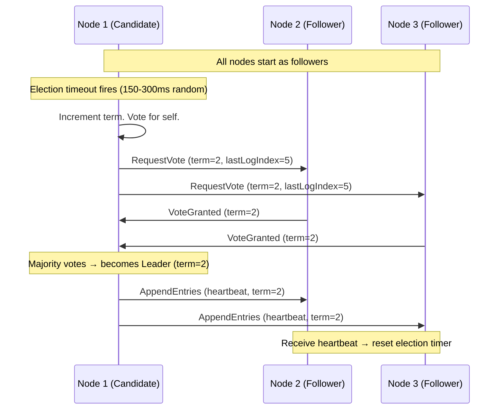

**Log Replication:**

The leader receives client commands, appends them to its log, and replicates to followers. An entry is **committed** when a majority of nodes have written it. The leader then applies the entry to its state machine and returns the result.

**Raft Safety Guarantee:** A leader can only be elected if it has all committed log entries. A node votes for a candidate only if the candidate's log is at least as up-to-date as the voter's log. This prevents data loss on election.

**Used by:** etcd (Kubernetes control plane), CockroachDB, TiKV, Consul.

### Paxos

Paxos (Lamport, 1998) is the original consensus algorithm. Two phases:

1. **Prepare/Promise**: Proposer sends a proposal number `n`. Acceptors promise not to accept proposals numbered less than `n`, and return any value they have already accepted.
2. **Accept/Accepted**: Proposer sends the value (either its own or the highest-numbered already accepted). Acceptors accept if they have not promised to a higher number.

**Multi-Paxos** adds leader optimization: a stable leader skips the Prepare phase for subsequent proposals, reducing message rounds.

| Aspect | Raft | Paxos |
|--------|------|-------|
| **Understandability** | Designed for clarity | Notoriously difficult |
| **Leader** | Explicit, single | Implicit in Multi-Paxos |
| **Log ordering** | Strong (leader enforces) | Requires additional mechanism |
| **Adoption** | Growing (etcd, CockroachDB) | Wide (Spanner, Chubby) |

**Used by:** Google Spanner (Multi-Paxos), Apache Zookeeper (ZAB — Zookeeper Atomic Broadcast, Paxos-inspired).

---

## Consistency Guarantees

> Cross-reference: [ch03](/system-design/part-1-fundamentals/ch03-core-tradeoffs) covers CAP Theorem and the ACID vs BASE spectrum. This section goes deeper on specific consistency models.

Consistency guarantees form a spectrum from strongest to weakest:

### Linearizability (Strongest)

Every operation appears to take effect **instantaneously** at some point between its invocation and completion. The system appears as a single copy of the data.

- Once a write completes, all subsequent reads (from any node) see the new value
- No two clients can observe operations in different orders
- **Cost**: High latency, low availability (requires coordination)
- **Requires**: Consensus protocols (Raft/Paxos) or synchronous replication
- **Used by**: etcd, ZooKeeper, CockroachDB serializable transactions

### Serializability

Concurrent transactions produce the same result as if they were executed **sequentially** in some order. Applies to transactions, not individual operations.

- Linearizability + serializability = **strict serializability** (strongest guarantee)
- Serializability alone does not guarantee real-time ordering

### Read-After-Write Consistency

A user always reads their own writes. Weaker than linearizability — only guarantees causality from a single user's perspective.

**Implementation strategies:**
- Route reads for data the user recently wrote to the leader
- Track write timestamp; follower reads must be from replica at least as fresh
- Replicate to same datacenter as user

### Monotonic Reads

A user never observes data "going back in time" — if they read version V, subsequent reads return V or newer.

**Implementation:** Route a specific user's reads to the same replica consistently (e.g., hash user ID to replica). If that replica fails, reroute but risk a one-time monotonicity violation.

### Causal Consistency

Writes that are causally related appear in causal order to all nodes. Concurrent (causally unrelated) writes may appear in different orders to different nodes.

- Weaker than linearizability, stronger than eventual consistency
- Captured by **vector clocks** or **hybrid logical clocks**
- Used by CockroachDB, DynamoDB (within a partition), MongoDB (sessions)

### Summary: Consistency Spectrum

| Model | Guarantee | Performance | Used When |
|-------|-----------|-------------|-----------|
| **Linearizability** | Single-copy illusion, real-time | Highest cost | Leader election, distributed locks, config |
| **Serializability** | Transaction isolation | High cost | Financial transactions |
| **Read-after-write** | User sees own writes | Low cost | User profiles, settings |
| **Monotonic reads** | No time-travel reads | Low cost | Social feeds, activity streams |
| **Causal consistency** | Cause-before-effect | Medium cost | Collaborative editing, messaging |
| **Eventual consistency** | Converges eventually | Lowest cost | DNS, shopping carts, counters |

---

## Conflict Resolution Strategies

| Strategy | Mechanism | Data Loss | Complexity | Best For |
|----------|-----------|-----------|------------|---------|
| **Last-Write-Wins (LWW)** | Highest wall-clock timestamp wins | Yes (concurrent writes) | Low | Caches, idempotent updates |
| **First-Write-Wins** | Lowest timestamp wins | Yes | Low | Reservations, seat locks |
| **Vector clocks** | Causal version vectors detect concurrent writes | No (surfaced to app) | Medium | Document stores (Riak) |
| **CRDTs** | Conflict-free replicated data types (G-Counter, OR-Set, LWW-Register) | No | Low (for app) | Counters, sets, presence |
| **Operational transforms** | Transform concurrent ops for commutativity | No | High | Collaborative text editing (Google Docs) |
| **Application-level merge** | Custom merge function, both values preserved | No | High (app owns it) | Domain-specific business logic |

**Vector clock example**: Node A sets key=1 at `{A:1}`. Node B concurrently sets key=2 at `{B:1}`. When these replicate, the system detects `{A:1}` and `{B:1}` are concurrent (neither dominates). Both values are surfaced to the application for resolution.

**CRDTs in practice:**
- **G-Counter** (grow-only): each node increments its own slot; merge = max per slot → sum. Used for "likes" counts.
- **OR-Set** (observed-remove set): add wins over remove for concurrent ops. Used for shopping carts.
- **LWW-Register**: single value with timestamp, LWW semantics but modeled explicitly.

---

## Real-World Systems

### Google Spanner

Spanner achieves external consistency (strict serializability) across globally distributed datacenters using:

- **TrueTime API**: Atomic clocks + GPS receivers in every datacenter give bounded clock uncertainty (typically <7ms). Spanner uses the uncertainty interval to order transactions: a commit waits until the uncertainty window closes before returning, ensuring no future transaction can be assigned an earlier timestamp.
- **Multi-Paxos groups**: Each shard is a Paxos group with one leader. Cross-shard transactions use two-phase commit coordinated by Paxos leaders.
- **Result**: Globally linearizable reads and serializable transactions with ~10ms global write latency.

> Cross-reference: [ch09](/system-design/part-2-building-blocks/ch09-databases-sql) covers SQL replication; Spanner extends this to a globally distributed SQL system.

### CockroachDB

Open-source Spanner-inspired distributed SQL:

- **Raft per range**: Data is divided into 64MB ranges; each range has a 3-node Raft group.
- **Hybrid logical clocks (HLC)**: Combines physical and logical time to detect causality without TrueTime hardware.
- **Serializable isolation by default**: Achieves global serializability using distributed two-phase commit.
- **Geo-partitioning**: Pin Raft leaders for a key range to a specific region, reducing cross-region latency for localized workloads.

### DynamoDB

Amazon's leaderless, Dynamo-style system (production evolution of the 2007 paper):

- **N=3 by default**: 3 replicas across 3 AZs in a region.
- **Eventually consistent reads** (R=1, W=1): lowest latency.
- **Strongly consistent reads** (R=2, effectively): opt-in, higher latency.
- **DynamoDB Streams + Global Tables**: Multi-region active-active replication with LWW conflict resolution (last-writer wins by timestamp).
- **Single-shard linearizability**: Writes to the same partition key are serialized by the partition leader.

> Cross-reference: [ch10](/system-design/part-2-building-blocks/ch10-databases-nosql) covers NoSQL replication models; DynamoDB is the flagship leaderless system.

---

## Go Implementation Example

The following implements **vector clocks** — the mechanism behind causal consistency and conflict detection in systems like Riak and DynamoDB. When last-write-wins is not safe, vector clocks tell you whether two writes are causally ordered or concurrent.

```go
package main

import "fmt"

// VectorClock tracks the logical time seen by each node.
// Key = node ID (e.g. "A", "B"), Value = event count on that node.
type VectorClock map[string]int

// Increment records a new event on nodeID.
func (vc VectorClock) Increment(nodeID string) {
	vc[nodeID]++
}

// Merge updates vc to the element-wise maximum of vc and other.
// Called when a node receives a message: it adopts the sender's knowledge.
func (vc VectorClock) Merge(other VectorClock) {
	for node, t := range other {
		if t > vc[node] {
			vc[node] = t
		}
	}
}

// Relation describes the causal relationship between two clocks.
type Relation string

const (
	HappensBefore Relation = "happens-before" // vc < other
	HappensAfter  Relation = "happens-after"  // vc > other
	Concurrent    Relation = "concurrent"     // neither dominates — conflict!
	Identical     Relation = "identical"
)

// Compare returns the causal relationship of vc relative to other.
func (vc VectorClock) Compare(other VectorClock) Relation {
	lessOrEqual, greaterOrEqual := true, true
	for node := range merge(vc, other) {
		a, b := vc[node], other[node]
		if a > b {
			lessOrEqual = false
		}
		if a < b {
			greaterOrEqual = false
		}
	}
	switch {
	case lessOrEqual && greaterOrEqual:
		return Identical
	case lessOrEqual:
		return HappensBefore
	case greaterOrEqual:
		return HappensAfter
	default:
		return Concurrent // neither ≤ the other → conflict
	}
}

func merge(a, b VectorClock) VectorClock {
	result := make(VectorClock)
	for k, v := range a {
		result[k] = v
	}
	for k, v := range b {
		if v > result[k] {
			result[k] = v
		}
	}
	return result
}

func main() {
	// Node A writes, sends to Node B — causal ordering
	clockA := VectorClock{"A": 1, "B": 0}
	clockB := VectorClock{"A": 0, "B": 1}
	clockB.Merge(clockA) // B receives A's message
	clockB.Increment("B")
	fmt.Printf("After merge: B clock = %v\n", clockB) // {A:1, B:2}
	fmt.Printf("A→B relation: %s\n", clockA.Compare(clockB)) // happens-before

	// Concurrent writes on two nodes — neither received the other's event
	concA := VectorClock{"A": 2, "B": 1}
	concB := VectorClock{"A": 1, "B": 2}
	fmt.Printf("Concurrent writes relation: %s\n", concA.Compare(concB)) // concurrent → conflict!
	// A system detecting "concurrent" must surface both versions to the application
	// (like Riak's siblings) or apply a deterministic merge (CRDT).
}
```

Key patterns illustrated:
- `Increment` advances the local logical clock — called before every write
- `Merge` advances the clock to the element-wise maximum — called on every message receive (this is how causal knowledge propagates)
- `Concurrent` result means neither write happened before the other — the system cannot automatically pick a winner without data loss; this is when LWW silently loses data

---

## Key Takeaway

> **Replication buys availability and scale; consistency is what you pay for it.** Single-leader systems are simple but bottleneck at the leader. Multi-leader and leaderless systems scale writes globally but require explicit conflict resolution. Consensus protocols (Raft, Paxos) provide the strongest guarantees at the cost of coordination overhead. Choose your replication model by answering three questions: *Can you tolerate data loss on failure? Can you tolerate seeing stale data on reads? Can your application resolve write conflicts?*

---

## Raft Consensus Algorithm — Deep Dive

The existing section introduced Raft's leader election and log replication. This section provides the complete state machine, sequence diagrams, and safety guarantees needed to reason about production Raft-based systems (etcd, CockroachDB, Consul).

### Node State Machine

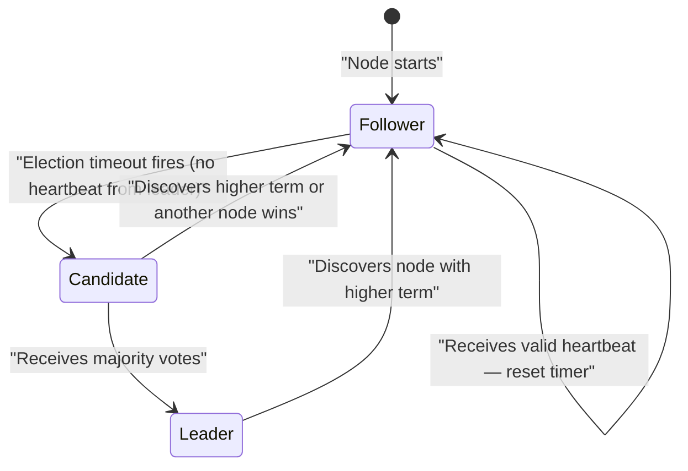

**Election timeout** is randomized (150–300ms in etcd) to prevent all followers from starting an election simultaneously. The first follower to time out becomes a candidate and usually wins before others wake up.

### Leader Election — Full Sequence

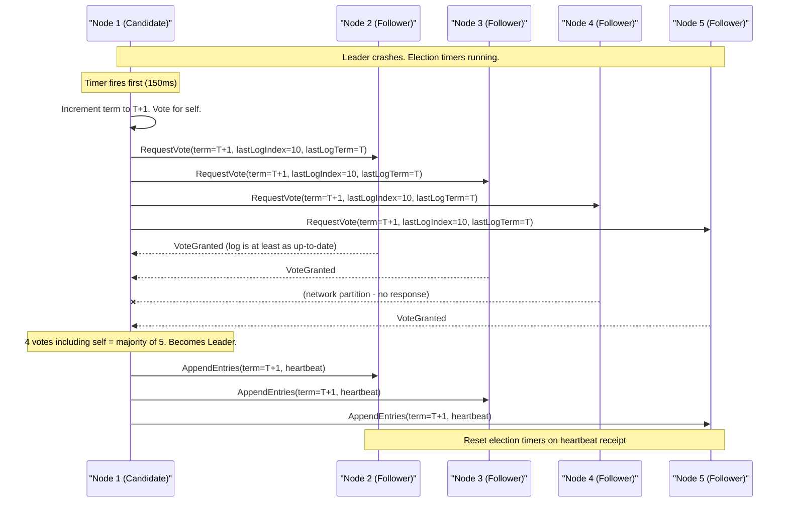

**Vote grant condition:** A voter grants a vote only if:
1. The candidate's term ≥ voter's current term
2. The voter has not yet voted in this term
3. The candidate's log is at least as up-to-date (higher last log term, or same term + longer log)

Condition 3 is the **election safety** guarantee — it prevents a node missing committed entries from becoming leader.

### Log Replication

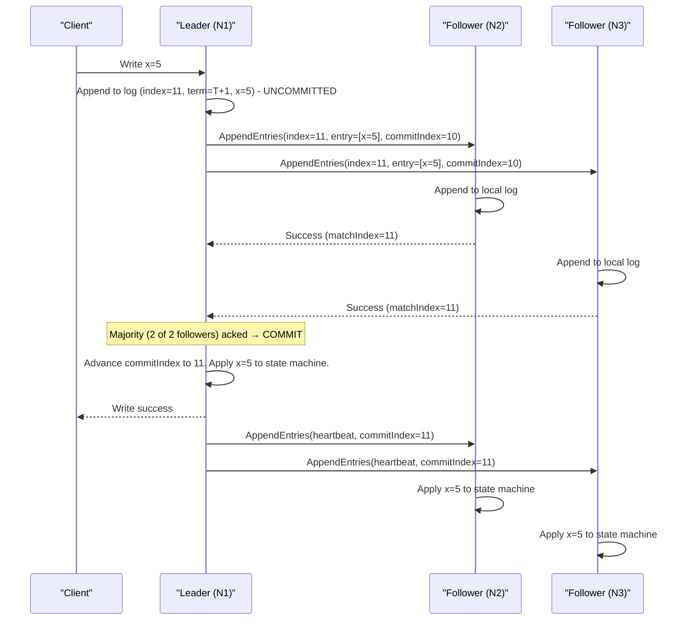

**Commit rule:** An entry is committed when stored on a majority of nodes. Committed entries are guaranteed to survive any future leader election (election safety + log matching property together ensure this).

### Raft Safety Guarantees

| Property | Guarantee |
|----------|-----------|
| **Election Safety** | At most one leader per term |
| **Leader Append-Only** | Leader never overwrites or deletes its log entries |
| **Log Matching** | If two logs contain an entry with the same index and term, they are identical up to that index |
| **Leader Completeness** | If an entry is committed in a term, it is present in all future leaders' logs |
| **State Machine Safety** | If a server applies an entry at index i, no other server applies a different entry at index i |

### Raft vs Paxos

| Dimension | Raft | Paxos (Multi-Paxos) |
|-----------|------|---------------------|
| **Understandability** | Designed for clarity; strong leader simplifies reasoning | Notoriously hard to understand and implement correctly |
| **Leader model** | Explicit, single leader per term | Implicit leader in Multi-Paxos (requires extra mechanism) |
| **Log ordering** | Leader enforces strict ordering | Requires careful implementation to maintain ordering |
| **Membership changes** | Joint consensus (two-phase config changes) | Complex; implementation-specific |
| **Implementations** | etcd, CockroachDB, TiKV, Consul | Google Spanner (Multi-Paxos), Apache ZooKeeper (ZAB) |
| **Paper** | 2014 (Ongaro & Ousterhout) | 1998 (Lamport) |

**Why Raft won adoption:** Ongaro's dissertation explicitly decomposed consensus into understandable sub-problems. Engineers implementing etcd and CockroachDB chose Raft specifically because they could reason about correctness. Paxos's gap between paper and complete protocol made production implementations error-prone.

> Cross-reference: [Chapter 3 — Core Trade-offs](/system-design/part-1-fundamentals/ch03-core-tradeoffs) covers CAP Theorem; Raft is a CP system — it sacrifices availability during leader election to maintain consistency. [Chapter 14 — Event-Driven Architecture](/system-design/part-3-architecture-patterns/ch14-event-driven-architecture) covers distributed transactions (2PC/Saga) that rely on consensus for coordination.

---

## Distributed Locks

Distributed locks prevent concurrent access to a shared resource across multiple nodes or processes. Unlike single-process mutexes, distributed locks must handle network failures, process crashes, and clock skew.

**Why locks are hard in distributed systems:** A lock holder can crash after acquiring the lock but before releasing it. The lock must expire automatically (TTL-based) to avoid permanent deadlock — but TTL expiry while the holder is still processing causes the "stale lock" problem.

### Redis-Based Locking (Redlock)

Single-node Redis lock: acquire with `SET key value NX PX ttl`. Fast but fails if the Redis node crashes — the lock is lost.

**Redlock** extends this to N independent Redis nodes (N=5 recommended) to tolerate single-node failures:

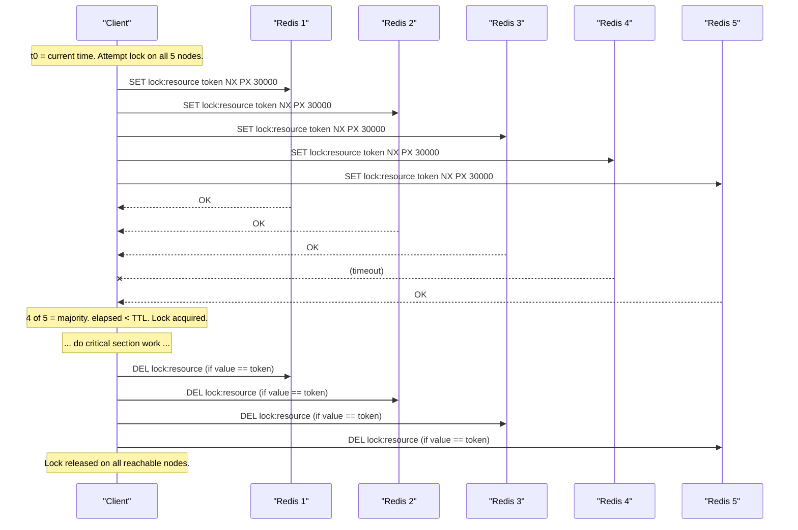

**Lock validity:** `validity_time = TTL - elapsed_acquisition_time - clock_drift`. If validity_time ≤ 0, the lock was not acquired fast enough — release all and retry with backoff.

**Redlock controversy:** Martin Kleppmann argued that Redlock is unsafe under process pauses (GC, swapping) — a lock holder can be paused past TTL, another client acquires the lock, and both believe they hold it. The solution: **fencing tokens** (see below).

### ZooKeeper-Based Locking

ZooKeeper uses **ephemeral sequential znodes** for distributed locking. An ephemeral znode is automatically deleted when the client session ends (crash, disconnect) — eliminating the TTL problem.

**Acquire:**
1. Create `EPHEMERAL_SEQUENTIAL` node at `/locks/resource-000001`
2. List children. If you have the lowest number → you hold the lock.
3. Otherwise, watch the node with the next-lowest number (not all nodes — avoids herd effect).

**Release:** Delete your znode. ZooKeeper notifies the next-in-line watcher.

**Advantage over Redlock:** Ephemeral znodes guarantee automatic release on crash without TTL expiry races. ZooKeeper's CP model ensures consistency — all clients see the same lock state.

### etcd-Based Locking

etcd uses **leases** with TTL. The lock holder must periodically renew the lease (keep-alive). If the holder crashes, the lease expires and the lock is released.

```
# Acquire
lease_id = etcd.lease(ttl=30)         # create 30s lease
etcd.put(key="/locks/resource",
         value=token,
         lease=lease_id)               # atomically associate

# Hold - renew in background
start_background_keepalive(lease_id)

# Release
etcd.delete(key="/locks/resource")
etcd.revoke(lease_id)
```

### Distributed Lock Comparison

| Implementation | Availability | Safety | Auto-release on Crash | Complexity | Best For |
|----------------|-------------|--------|----------------------|------------|---------|
| **Redlock (Redis)** | High (AP topology) | Weak without fencing | Via TTL (race window) | Low | Best-effort locks, cache coordination |
| **ZooKeeper** | Medium (CP, leader required) | Strong (ephemeral znodes) | Instant (session expiry) | Medium | Strong safety guarantees, existing ZK infra |
| **etcd** | High (CP via Raft) | Strong (lease-based) | Via lease TTL + keepalive | Low | Kubernetes-native; modern CP systems |

### Fencing Tokens

A fencing token is a **monotonically increasing number** returned by the lock service when a lock is granted. Every operation on the protected resource must include the fencing token. The resource rejects requests with a token lower than the last seen.

```
Client A acquires lock → token=33
Client A pauses (GC, slow network)
Lock expires. Client B acquires lock → token=34
Client B writes to resource with token=34 → accepted

Client A resumes. Sends write with token=33
Resource rejects: "token 33 < last seen 34"
```

**Why fencing is necessary:** TTL-based locks (Redlock, etcd leases) have a race window where a slow lock holder resumes after TTL expiry but before it knows the lock is gone. Without fencing, both the old and new holder can corrupt the resource. With fencing, the resource enforces the ordering.

**Fencing token sources:** etcd's revision number (monotonically increasing per key), ZooKeeper's zxid, or a custom sequence number from the lock service.

### Lock Failure Modes and Mitigations

| Failure Mode | Description | Mitigation |
|-------------|-------------|-----------|
| **Lock holder crash** | Process dies while holding lock; resource stays locked | TTL-based expiry (Redis, etcd lease) or ephemeral znode (ZooKeeper) |
| **GC pause past TTL** | JVM GC pauses holder for > TTL; another client acquires lock; both now "hold" it | Fencing tokens; short TTL + keepalive in separate thread |
| **Network partition** | Lock holder cannot renew lease; lock expires; holder resumes unaware lock is gone | Fencing tokens; resource-side validation |
| **Clock skew (Redlock)** | System clock jumps forward on lock node; TTL expires prematurely | Use monotonic clock for elapsed time; avoid wall-clock-based TTL math |
| **Split-brain (Redlock)** | Majority Redis nodes see different state after partition | Require majority (N/2 + 1) for acquire AND release; quorum-strict mode |

### Choosing a Lock Implementation

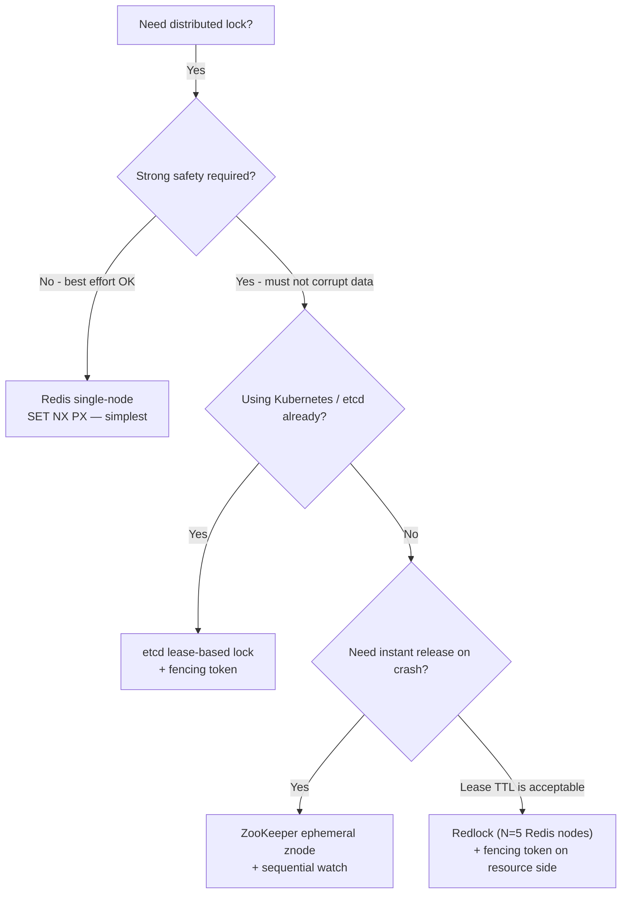

> Cross-reference: [Chapter 9 — Databases: SQL](/system-design/part-2-building-blocks/ch09-databases-sql) covers row-level database locks and advisory locks as single-node alternatives when a shared database is available. [Chapter 14 — Event-Driven Architecture](/system-design/part-3-architecture-patterns/ch14-event-driven-architecture) covers distributed transaction patterns (2PC, Saga) that rely on distributed locking at the protocol level.

---

## Related Chapters

| Chapter | Relevance |
|---------|-----------|
| [Ch03 — Core Trade-offs](/system-design/part-1-fundamentals/ch03-core-tradeoffs) | CAP/PACELC theoretical foundations for consistency models |
| [Ch09 — SQL Databases](/system-design/part-2-building-blocks/ch09-databases-sql) | SQL replication: leader-follower, synchronous vs async |
| [Ch14 — Event-Driven Architecture](/system-design/part-3-architecture-patterns/ch14-event-driven-architecture) | Distributed transactions requiring replication guarantees |
| [Ch13 — Microservices](/system-design/part-3-architecture-patterns/ch13-microservices) | Per-service DB consistency in distributed system design |

---

## Practice Questions

### Beginner

1. **Quorum Math:** A Cassandra cluster has N=5 replicas. You configure W=3, R=2. Does W+R>N hold, making this a valid quorum? What is the minimum number of nodes that can be down before reads may return stale data? What would happen if you changed to W=1, R=1?

   <details>
   <summary>Hint</summary>
   W+R=5 > N=5 is false (5 > 5 is false) — this is not a strict quorum; change to W=3, R=3 (or W=2, R=4) for W+R>N; with W=3, R=2, one node failure could break quorum if it's one of the three write nodes.
   </details>

### Intermediate

2. **Multi-Leader Conflict:** Two users simultaneously update a shared Google Doc title — one connecting to a Tokyo leader, one to a London leader. The leaders are different. Describe the full conflict lifecycle: how it's detected, how it's represented in the system, and three distinct resolution strategies with their trade-offs.

   <details>
   <summary>Hint</summary>
   Detection happens during replication when vector clocks diverge; strategies include last-write-wins (simple but loses data), merge (safe for CRDTs), and explicit user resolution (correct but disruptive) — choose based on data sensitivity.
   </details>

3. **Raft vs Async Replication:** A startup uses PostgreSQL with one leader and two async followers. The leader crashes with 500ms of replication lag. How much data is lost? How does switching to synchronous replication (or a Raft-based system like CockroachDB) change the durability story, and what is the performance trade-off?

   <details>
   <summary>Hint</summary>
   500ms of lag = all writes in the last 500ms are lost; synchronous replication ensures zero data loss but adds one network round trip to every write (higher latency, lower throughput).
   </details>

4. **Consistency Model Selection:** You are designing a collaborative note-taking app (like Notion). Users in the same team need to see each other's changes within seconds. The ordering of operations matters (a section delete must not appear before the section's creation). Which consistency model fits — linearizability, causal consistency, or eventual consistency? Justify with specific guarantees.

   <details>
   <summary>Hint</summary>
   Causal consistency is the right fit: it preserves cause-before-effect ordering (delete after create) without the coordination overhead of linearizability, which would require global consensus for every edit.
   </details>

### Advanced

5. **TrueTime and External Consistency:** Google Spanner uses TrueTime to achieve external consistency. If TrueTime reports an uncertainty interval of [t-ε, t+ε], why must Spanner wait until t+ε before releasing the commit timestamp? What happens if two transactions' uncertainty windows overlap, and how does Spanner resolve the ordering?

   <details>
   <summary>Hint</summary>
   Waiting until t+ε ensures no future transaction can be assigned a timestamp earlier than the current transaction's commit time, preserving global ordering — Spanner uses GPS and atomic clocks to keep ε under 7ms.
   </details>

---

## References & Further Reading

- "Designing Data-Intensive Applications" — Chapters 5, 7, 9 (Replication, Transactions, Consistency)
- "In Search of an Understandable Consensus Algorithm" — Ongaro & Ousterhout (Raft paper)
- Jepsen — https://jepsen.io/ (distributed systems testing)
- "Paxos Made Simple" — Leslie Lamport
