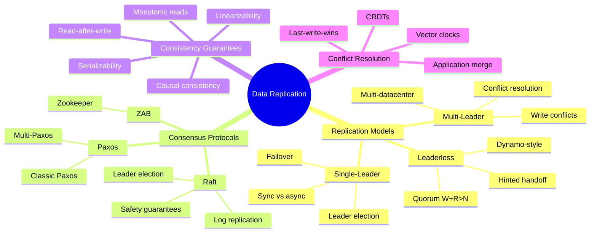
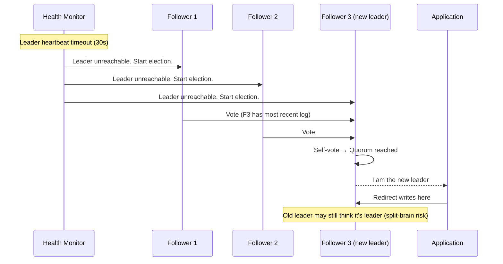
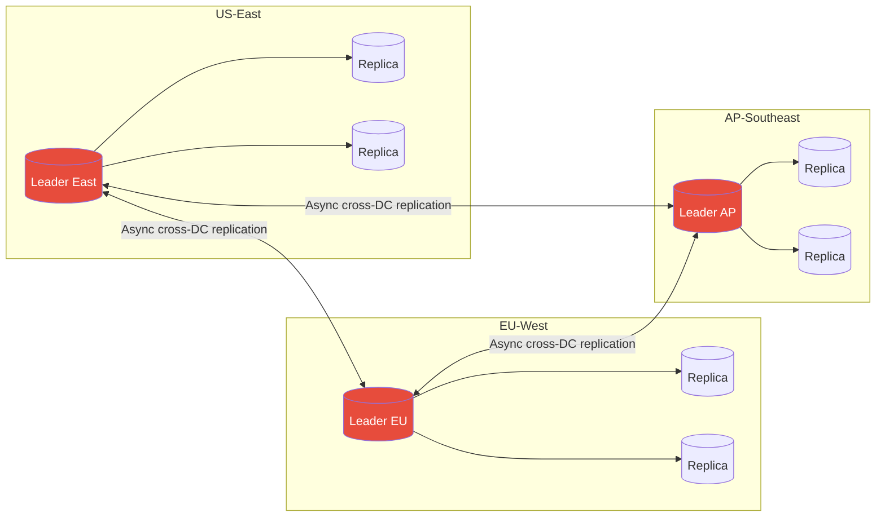
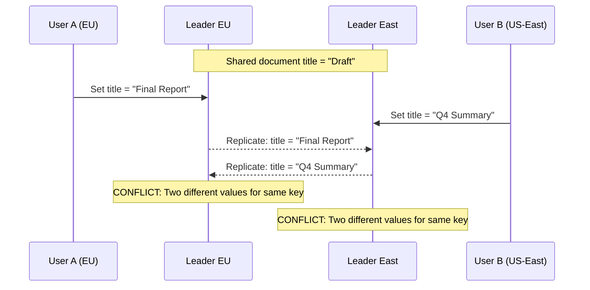
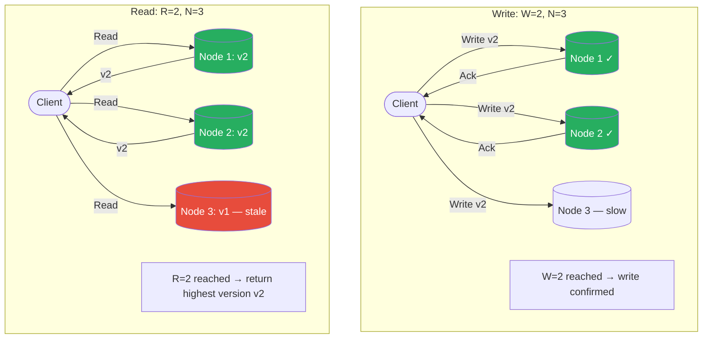
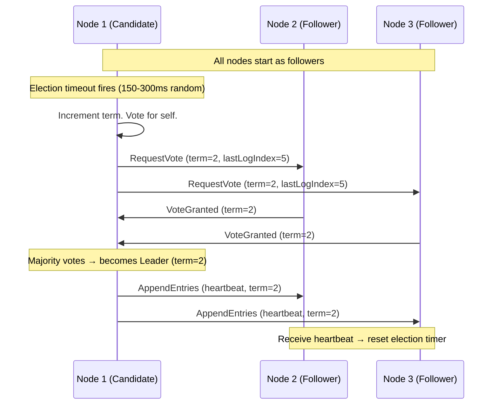

# Chapter 15: Data Replication & Consistency

> *Replication is not a backup strategy — it is a latency, availability, and fault-tolerance strategy. The moment you have two copies of data, you have a consistency problem.*

---

## Mind Map

---

## Why Replication?

Before examining the how, understand the why. Every replication strategy is a different answer to the same four goals:

| Goal | Problem Solved | Example |
|------|---------------|---------|
| **Availability** | If one node dies, others serve traffic | Primary fails, replica takes over |
| **Fault tolerance** | Hardware failures, network partitions | Survive AZ outage with 3-replica setup |
| **Read scaling** | Distribute read load across replicas | 10 read replicas behind a load balancer |
| **Geographic latency** | Place data close to users | EU replica for European users, US replica for American users |

The core tension: **keeping replicas in sync costs latency; letting them diverge risks inconsistency**. Every replication model in this chapter is a different point on that spectrum.

> Cross-reference: [ch03](/system-design/part-1-fundamentals/ch03-core-tradeoffs) introduced CAP Theorem — the theoretical foundation. This chapter is the practical application: how real systems navigate the C vs A trade-off.

---

## Single-Leader Replication

### How It Works

All writes go to exactly one node — the **leader** (also called master or primary). The leader writes to its local storage, then replicates changes to **followers** (replicas, standbys). Clients may read from any follower or the leader.

### Sync vs Async Replication

The most critical configuration decision in single-leader replication:

| Aspect | Synchronous | Asynchronous |
|--------|------------|--------------|
| **Durability** | Write confirmed only after all sync replicas acknowledge | Leader acknowledges immediately; replicas catch up later |
| **Write latency** | Higher — waits for replica network RTT | Low — no waiting |
| **Data loss on leader crash** | Zero (for sync replicas) | Up to replication lag behind |
| **Availability** | Lower — leader blocked if sync replica is down | High — leader accepts writes regardless of replica state |
| **Typical use** | Financial systems, metadata stores | Social feeds, analytics, logs |
| **Semi-sync hybrid** | One sync replica, rest async (MySQL default) | Balances durability and performance |

**In practice:** PostgreSQL streaming replication defaults to async. MySQL supports semi-synchronous. Most cloud-managed databases (RDS, Cloud SQL) offer tunable durability levels.

### Replication Lag

Async replication creates **replication lag** — the window between a write being committed on the leader and becoming visible on followers. This lag causes:

- **Read-your-own-writes violation**: User posts a comment, reads from a lagged replica, sees old state
- **Monotonic read violation**: User reads new data, then reads from a more-lagged replica, sees older data
- **Causality violations**: Two events ordered on leader appear reversed on follower

See [Consistency Guarantees](#consistency-guarantees) for mitigation strategies.

### Failover: Leader Election

When a leader fails, the system must elect a new leader. This is deceptively hard:

**Split-brain risk**: If the old leader was merely network-partitioned (not crashed), two nodes may simultaneously believe they are the leader. Mitigation: **STONITH** (Shoot The Other Node In The Head) — one leader must be fenced before the other is promoted.

**Used by**: PostgreSQL with Patroni/pg_auto_failover, MySQL with Orchestrator, Redis Sentinel.

---

## Multi-Leader Replication

### How It Works

Multiple nodes (typically one per datacenter) each accept writes and replicate to one another. Used when single-leader replication would route all writes through one geographic location, adding unacceptable latency.

### Write Conflicts

Multi-leader replication introduces **write conflicts** — the central problem the model must solve.

### Conflict Resolution Strategies

| Strategy | How It Works | Pros | Cons |
|----------|-------------|------|------|
| **Last-Write-Wins (LWW)** | Each write gets a timestamp; highest timestamp wins | Simple, always resolves | Data loss — the "losing" write is silently dropped |
| **Merge by union** | For sets, union both values | No data loss for set types | Only works for specific data types |
| **Custom application logic** | App receives both versions, decides | Maximum control | Complexity pushed to application layer |
| **On-write detection** | Detect conflict at write time, abort one | Clean | Requires coordination, reduces availability |
| **CRDTs** | Data structures that merge deterministically | Automatic, no data loss | Limited to CRDT-compatible data models |

**LWW caveat**: Clock skew between nodes makes timestamps unreliable. Two writes milliseconds apart with skewed clocks can silently discard the "later" one. Vector clocks solve this.

**Used by**: CouchDB (multi-master with custom resolution), MySQL Group Replication, Cassandra (multi-leader topology).

---

## Leaderless Replication (Dynamo-Style)

### How It Works

No single node has special write authority. Clients (or a coordinator) send writes and reads to **multiple nodes simultaneously**. Introduced by Amazon Dynamo (2007); adopted by Cassandra, Riak, Voldemort.

### Quorum Reads and Writes

The consistency guarantee is expressed via three values:

- **N** — total number of replicas
- **W** — number of replicas that must acknowledge a write
- **R** — number of replicas that must respond to a read

**Rule:** `W + R > N` guarantees at least one node in the read set has the latest write.

**Common quorum configurations** (N=3):

| W | R | Guarantee | Trade-off |
|---|---|-----------|-----------|
| 3 | 1 | Strong (W+R=4>3) | Slow writes |
| 1 | 3 | Strong (W+R=4>3) | Slow reads |
| 2 | 2 | Strong (W+R=4>3) | Balanced |
| 1 | 1 | None (W+R=2, not >3) | Maximum performance, eventual consistency |

### Handling Node Failures: Sloppy Quorum & Hinted Handoff

When a node in the write set is temporarily unavailable, the coordinator uses a **sloppy quorum** — it writes to a different available node temporarily, tagging the write with a hint indicating the intended destination. When the failed node recovers, the temporary node **hands off** the hinted write (hinted handoff).

### Anti-Entropy

Background process that compares replicas and copies missing data. Uses **Merkle trees** (hash trees) to efficiently detect divergence — each node maintains a tree of hashes over its key ranges; comparing root hashes identifies which subtrees differ without transferring all data.

**Comparison:**

| Mechanism | Trigger | Latency | Use |
|-----------|---------|---------|-----|
| Read repair | On read, if stale replica found | Zero extra | Hot data |
| Hinted handoff | On write to unavailable node | On recovery | Recent writes |
| Anti-entropy | Background continuous | Minutes/hours | All data |

---

## Replication Model Comparison

| Aspect | Single-Leader | Multi-Leader | Leaderless |
|--------|--------------|--------------|------------|
| **Write conflicts** | None (one writer) | Possible | Possible |
| **Write throughput** | Bottlenecked at leader | High (per-DC leader) | Highest (any node) |
| **Write latency** | Low (local leader) | Low (local DC) | Low (parallel writes) |
| **Read scalability** | High (many replicas) | High | High |
| **Consistency** | Strong (sync) or eventual (async) | Eventual | Tunable via quorum |
| **Failover complexity** | Medium (leader election) | Low (other DCs continue) | Low (no leader to elect) |
| **Conflict handling** | Not needed | Required | Required |
| **Data loss risk** | Low (sync) / possible (async) | Possible | Low (high W) / possible (low W) |
| **Example systems** | PostgreSQL, MySQL, MongoDB | CouchDB, MySQL Group Replication | Cassandra, DynamoDB, Riak |

---

## Consensus Protocols

Distributed consensus solves: **how do N nodes agree on a single value, even when some nodes fail?** This is the foundation for leader election, distributed locks, and coordinated config changes.

### Raft

Raft (2014, Ongaro & Ousterhout) was designed for understandability. It decomposes consensus into three sub-problems: leader election, log replication, and safety.

**Leader Election:**

**Log Replication:**

The leader receives client commands, appends them to its log, and replicates to followers. An entry is **committed** when a majority of nodes have written it. The leader then applies the entry to its state machine and returns the result.

**Raft Safety Guarantee:** A leader can only be elected if it has all committed log entries. A node votes for a candidate only if the candidate's log is at least as up-to-date as the voter's log. This prevents data loss on election.

**Used by:** etcd (Kubernetes control plane), CockroachDB, TiKV, Consul.

### Paxos

Paxos (Lamport, 1998) is the original consensus algorithm. Two phases:

1. **Prepare/Promise**: Proposer sends a proposal number `n`. Acceptors promise not to accept proposals numbered less than `n`, and return any value they have already accepted.
2. **Accept/Accepted**: Proposer sends the value (either its own or the highest-numbered already accepted). Acceptors accept if they have not promised to a higher number.

**Multi-Paxos** adds leader optimization: a stable leader skips the Prepare phase for subsequent proposals, reducing message rounds.

| Aspect | Raft | Paxos |
|--------|------|-------|
| **Understandability** | Designed for clarity | Notoriously difficult |
| **Leader** | Explicit, single | Implicit in Multi-Paxos |
| **Log ordering** | Strong (leader enforces) | Requires additional mechanism |
| **Adoption** | Growing (etcd, CockroachDB) | Wide (Spanner, Chubby) |

**Used by:** Google Spanner (Multi-Paxos), Apache Zookeeper (ZAB — Zookeeper Atomic Broadcast, Paxos-inspired).

---

## Consistency Guarantees

> Cross-reference: [ch03](/system-design/part-1-fundamentals/ch03-core-tradeoffs) covers CAP Theorem and the ACID vs BASE spectrum. This section goes deeper on specific consistency models.

Consistency guarantees form a spectrum from strongest to weakest:

### Linearizability (Strongest)

Every operation appears to take effect **instantaneously** at some point between its invocation and completion. The system appears as a single copy of the data.

- Once a write completes, all subsequent reads (from any node) see the new value
- No two clients can observe operations in different orders
- **Cost**: High latency, low availability (requires coordination)
- **Requires**: Consensus protocols (Raft/Paxos) or synchronous replication
- **Used by**: etcd, ZooKeeper, CockroachDB serializable transactions

### Serializability

Concurrent transactions produce the same result as if they were executed **sequentially** in some order. Applies to transactions, not individual operations.

- Linearizability + serializability = **strict serializability** (strongest guarantee)
- Serializability alone does not guarantee real-time ordering

### Read-After-Write Consistency

A user always reads their own writes. Weaker than linearizability — only guarantees causality from a single user's perspective.

**Implementation strategies:**
- Route reads for data the user recently wrote to the leader
- Track write timestamp; follower reads must be from replica at least as fresh
- Replicate to same datacenter as user

### Monotonic Reads

A user never observes data "going back in time" — if they read version V, subsequent reads return V or newer.

**Implementation:** Route a specific user's reads to the same replica consistently (e.g., hash user ID to replica). If that replica fails, reroute but risk a one-time monotonicity violation.

### Causal Consistency

Writes that are causally related appear in causal order to all nodes. Concurrent (causally unrelated) writes may appear in different orders to different nodes.

- Weaker than linearizability, stronger than eventual consistency
- Captured by **vector clocks** or **hybrid logical clocks**
- Used by CockroachDB, DynamoDB (within a partition), MongoDB (sessions)

### Summary: Consistency Spectrum

| Model | Guarantee | Performance | Used When |
|-------|-----------|-------------|-----------|
| **Linearizability** | Single-copy illusion, real-time | Highest cost | Leader election, distributed locks, config |
| **Serializability** | Transaction isolation | High cost | Financial transactions |
| **Read-after-write** | User sees own writes | Low cost | User profiles, settings |
| **Monotonic reads** | No time-travel reads | Low cost | Social feeds, activity streams |
| **Causal consistency** | Cause-before-effect | Medium cost | Collaborative editing, messaging |
| **Eventual consistency** | Converges eventually | Lowest cost | DNS, shopping carts, counters |

---

## Conflict Resolution Strategies

| Strategy | Mechanism | Data Loss | Complexity | Best For |
|----------|-----------|-----------|------------|---------|
| **Last-Write-Wins (LWW)** | Highest wall-clock timestamp wins | Yes (concurrent writes) | Low | Caches, idempotent updates |
| **First-Write-Wins** | Lowest timestamp wins | Yes | Low | Reservations, seat locks |
| **Vector clocks** | Causal version vectors detect concurrent writes | No (surfaced to app) | Medium | Document stores (Riak) |
| **CRDTs** | Conflict-free replicated data types (G-Counter, OR-Set, LWW-Register) | No | Low (for app) | Counters, sets, presence |
| **Operational transforms** | Transform concurrent ops for commutativity | No | High | Collaborative text editing (Google Docs) |
| **Application-level merge** | Custom merge function, both values preserved | No | High (app owns it) | Domain-specific business logic |

**Vector clock example**: Node A sets key=1 at `{A:1}`. Node B concurrently sets key=2 at `{B:1}`. When these replicate, the system detects `{A:1}` and `{B:1}` are concurrent (neither dominates). Both values are surfaced to the application for resolution.

**CRDTs in practice:**
- **G-Counter** (grow-only): each node increments its own slot; merge = max per slot → sum. Used for "likes" counts.
- **OR-Set** (observed-remove set): add wins over remove for concurrent ops. Used for shopping carts.
- **LWW-Register**: single value with timestamp, LWW semantics but modeled explicitly.

---

## Real-World Systems

### Google Spanner

Spanner achieves external consistency (strict serializability) across globally distributed datacenters using:

- **TrueTime API**: Atomic clocks + GPS receivers in every datacenter give bounded clock uncertainty (typically <7ms). Spanner uses the uncertainty interval to order transactions: a commit waits until the uncertainty window closes before returning, ensuring no future transaction can be assigned an earlier timestamp.
- **Multi-Paxos groups**: Each shard is a Paxos group with one leader. Cross-shard transactions use two-phase commit coordinated by Paxos leaders.
- **Result**: Globally linearizable reads and serializable transactions with ~10ms global write latency.

> Cross-reference: [ch09](/system-design/part-2-building-blocks/ch09-databases-sql) covers SQL replication; Spanner extends this to a globally distributed SQL system.

### CockroachDB

Open-source Spanner-inspired distributed SQL:

- **Raft per range**: Data is divided into 64MB ranges; each range has a 3-node Raft group.
- **Hybrid logical clocks (HLC)**: Combines physical and logical time to detect causality without TrueTime hardware.
- **Serializable isolation by default**: Achieves global serializability using distributed two-phase commit.
- **Geo-partitioning**: Pin Raft leaders for a key range to a specific region, reducing cross-region latency for localized workloads.

### DynamoDB

Amazon's leaderless, Dynamo-style system (production evolution of the 2007 paper):

- **N=3 by default**: 3 replicas across 3 AZs in a region.
- **Eventually consistent reads** (R=1, W=1): lowest latency.
- **Strongly consistent reads** (R=2, effectively): opt-in, higher latency.
- **DynamoDB Streams + Global Tables**: Multi-region active-active replication with LWW conflict resolution (last-writer wins by timestamp).
- **Single-shard linearizability**: Writes to the same partition key are serialized by the partition leader.

> Cross-reference: [ch10](/system-design/part-2-building-blocks/ch10-databases-nosql) covers NoSQL replication models; DynamoDB is the flagship leaderless system.

---

## Key Takeaway

> **Replication buys availability and scale; consistency is what you pay for it.** Single-leader systems are simple but bottleneck at the leader. Multi-leader and leaderless systems scale writes globally but require explicit conflict resolution. Consensus protocols (Raft, Paxos) provide the strongest guarantees at the cost of coordination overhead. Choose your replication model by answering three questions: *Can you tolerate data loss on failure? Can you tolerate seeing stale data on reads? Can your application resolve write conflicts?*

---

## Practice Questions

1. **Quorum math**: A Cassandra cluster has N=5 replicas. You configure W=3, R=2. Is this a valid quorum? Does W+R>N hold? What is the minimum number of nodes that can be down before reads may return stale data?

2. **Conflict scenario**: Two users simultaneously update a shared Google Doc title — one in Tokyo (multi-leader EU node), one in London (multi-leader EU node). The leaders are different. Describe the full conflict lifecycle: detection, representation, and three distinct resolution strategies with their trade-offs.

3. **Raft vs async replication**: A startup uses PostgreSQL with one leader and two async followers. They experience a leader crash with 500ms of replication lag. What data is lost? How would switching to Raft-based consensus (e.g., etcd or CockroachDB) change the durability story, and at what cost?

4. **Consistency model selection**: You are designing a collaborative note-taking app (like Notion). Users in the same team need to see each other's changes quickly. Ordering of operations matters (a delete of a section should not appear before the section was created). Which consistency model fits best — linearizability, causal consistency, or eventual consistency? Justify your choice with specific guarantees needed.

5. **TrueTime deep dive**: Google Spanner uses TrueTime to achieve external consistency. If TrueTime reports an uncertainty interval of [t-ε, t+ε], and a transaction commits at physical time t, why must Spanner wait until t+ε before releasing the commit timestamp? What happens if two transactions overlap in their uncertainty windows?
