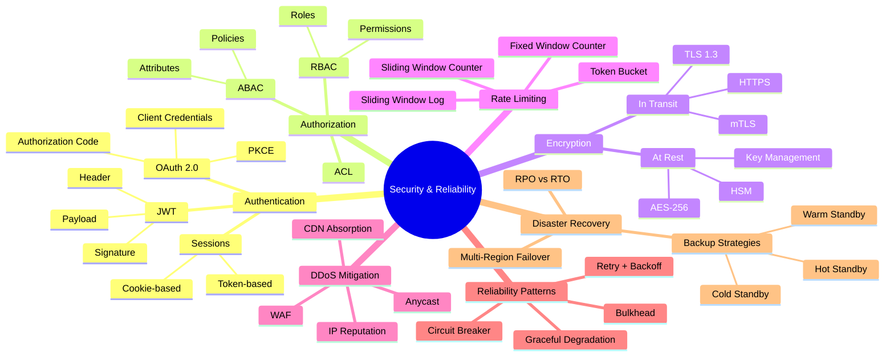
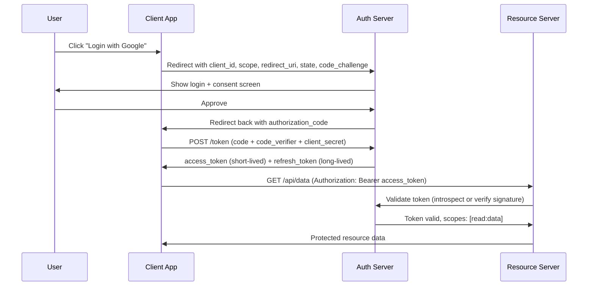
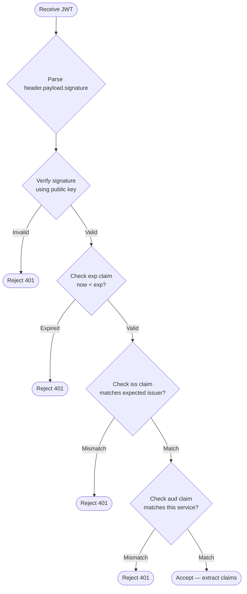
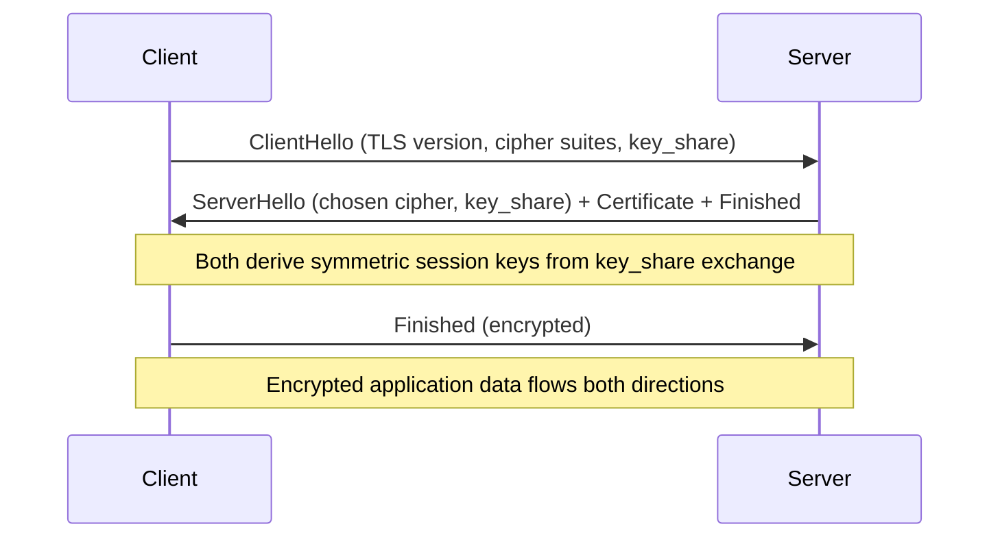
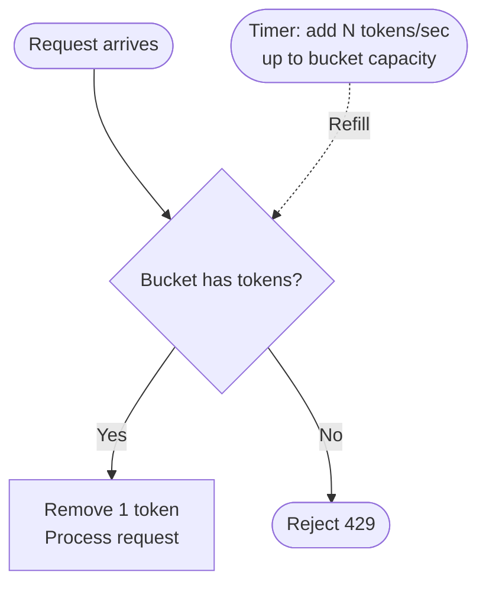
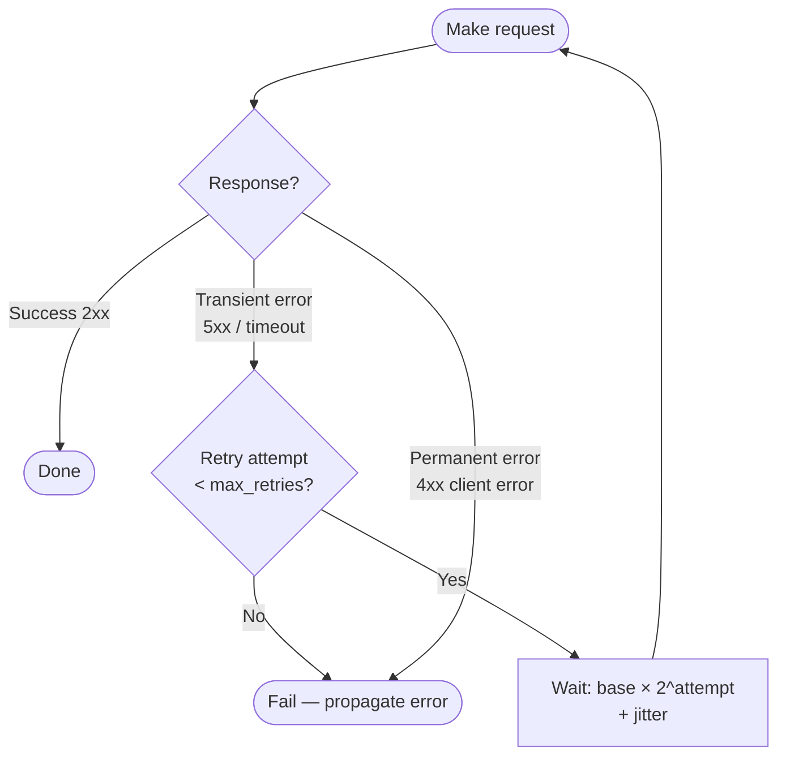
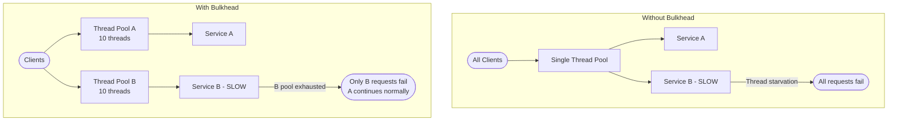
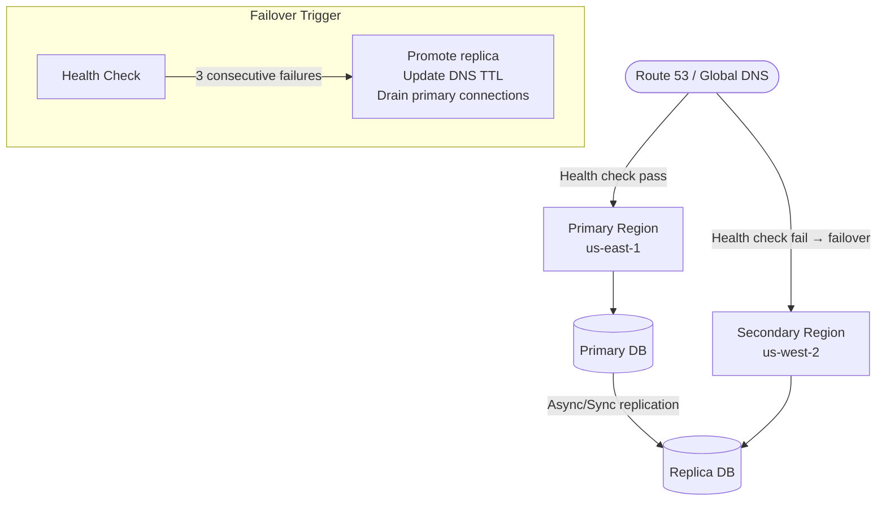

# Chapter 16: Security & Reliability


> *Security is not a feature you add at the end — it is a property you design in from the start. The same is true of reliability: systems that survive failure are built to expect it.*

---

## Mind Map



---

## Authentication vs Authorization

These two concepts are consistently confused in interviews and in code. They are distinct concerns with different scopes:

| Concept | Question Answered | Example | Enforcement Point |
|---------|-------------------|---------|-------------------|
| **Authentication (AuthN)** | *Who are you?* | Verifying username + password | Login endpoint, API gateway |
| **Authorization (AuthZ)** | *What can you do?* | Can this user delete this resource? | Business logic, middleware |

Authentication always precedes authorization. A system cannot determine what an identity is allowed to do before confirming that identity. However, authorization decisions can change without re-authenticating — a user's role may be revoked while their session remains active, which is why token expiry and revocation matter.

---

## OAuth 2.0 Authorization Code Flow

OAuth 2.0 is an **authorization framework** (not an authentication protocol). It delegates access without sharing credentials. The most secure grant type for user-facing applications is the **Authorization Code grant with PKCE**.



**Key security properties:**
- `state` parameter prevents CSRF on the redirect
- `code_challenge` / `code_verifier` (PKCE) prevents authorization code interception
- `access_token` is short-lived (15 min) to limit blast radius of leaks
- `refresh_token` is long-lived but must be stored securely (httpOnly cookie, not localStorage)

---

## JWT: Structure and Validation

A JSON Web Token is a **self-contained credential** — the resource server can verify it without calling the auth server on every request.

**Structure:** `base64url(header).base64url(payload).base64url(signature)`

```
eyJhbGciOiJSUzI1NiIsInR5cCI6IkpXVCJ9    ← Header
.
eyJzdWIiOiJ1c2VyXzEyMyIsInJvbGUiOiJhZG1pbiIsImV4cCI6MTcwMDAwMDAwMH0   ← Payload
.
[RSASSA-PKCS1-v1_5 signature]             ← Signature
```

**Header** (algorithm + type):
```json
{ "alg": "RS256", "typ": "JWT" }
```

**Payload** (claims — never put secrets here, it is base64-encoded not encrypted):
```json
{
  "sub": "user_123",
  "role": "admin",
  "iat": 1700000000,
  "exp": 1700000900
}
```

**Validation flow a resource server must execute:**



**Refresh token rotation:** When an access token expires, the client sends the refresh token to receive a new access token (and optionally a new refresh token). If a refresh token is stolen and used, the original holder's next use detects the double-use, triggering revocation of the entire token family.

---

## Encryption

### TLS 1.3 Handshake (Simplified)

TLS establishes an encrypted channel before any application data is transmitted. TLS 1.3 reduced the handshake from 2 round trips (TLS 1.2) to 1 round trip:



The `key_share` uses **Ephemeral Diffie-Hellman** — the session key is never transmitted, it is derived independently on both sides. This provides **Forward Secrecy**: compromising the server's private key later does not decrypt past sessions.

### At-Rest Encryption

| Layer | Mechanism | Who Manages Keys |
|-------|-----------|-----------------|
| **Full disk** | AES-256 (dm-crypt, FileVault) | OS / cloud provider |
| **Database column** | Application-level AES-256 | Application + KMS |
| **Object storage** | SSE-S3 / SSE-KMS | Cloud provider |
| **Secrets** | Vault, AWS Secrets Manager | Dedicated secrets service |

**Key management** is the hard part. Keys encrypted by other keys must stop somewhere — a Hardware Security Module (HSM) or cloud-managed key material is the root of trust.

---

## Rate Limiting Algorithms

Rate limiting protects services from overload, abuse, and cost runaway. Four common algorithms each have different trade-offs:

### 1. Token Bucket



Tokens refill at a fixed rate. Burst traffic up to bucket capacity is allowed. Used by AWS API Gateway, Stripe.

### 2. Fixed Window Counter


Simple but has a **boundary burst problem**: 100 req/min allows 100 at 0:59 and 100 at 1:00 — effectively 200 in 2 seconds.

### 3. Sliding Window Log

Maintains a timestamped log of each request. On each request, purge entries older than the window, count remaining entries.

- **Pros:** Perfectly accurate
- **Cons:** Memory grows with request volume — stores every timestamp

### 4. Sliding Window Counter

Approximation that combines fixed window simplicity with sliding accuracy:

`estimated_count = prev_window_count × (1 − elapsed_fraction) + current_window_count`

**Algorithm Comparison:**

| Algorithm | Accuracy | Memory | Burst Handling | Complexity |
|-----------|----------|--------|----------------|------------|
| Token Bucket | High | O(1) | Allows bursts up to capacity | Low |
| Fixed Window | Low (boundary burst) | O(1) | Hard cutoff at boundary | Lowest |
| Sliding Window Log | Exact | O(requests) | Smooth enforcement | Medium |
| Sliding Window Counter | High (~0.003% error) | O(1) | Smooth, approximate | Low |

**Distributed rate limiting** requires a shared store (Redis with atomic `INCR` + `EXPIRE`). Per-node counters are simpler but allow N×limit burst across N nodes.

---

## DDoS Mitigation

A Distributed Denial of Service attack exhausts resources (bandwidth, CPU, connections) to make a service unavailable. Defense is layered:

| Strategy | Layer | How It Helps | Example |
|----------|-------|-------------|---------|
| **CDN absorption** | L3/L4/L7 | Anycast distributes attack traffic across PoPs | Cloudflare absorbs 100 Tbps |
| **Rate limiting** | L7 | Caps requests per IP / ASN | Drop IPs > 1000 req/min |
| **WAF rules** | L7 | Block malformed HTTP, known attack signatures | AWS WAF, ModSecurity |
| **IP reputation** | L3/L4 | Block known botnet/scanner IPs | MaxMind, AbuseIPDB feeds |
| **Anycast routing** | L3 | Spread volumetric traffic across global PoPs | BGP anycast |
| **SYN cookies** | L4 | Defend TCP SYN flood without state | Linux kernel default |
| **Connection limits** | L4 | Cap concurrent connections per source | nginx `limit_conn` |

**Real-World — Cloudflare DDoS Mitigation:** Cloudflare operates 300+ PoPs using anycast. A volumetric attack targeting a single origin is distributed across the network — each PoP absorbs a fraction. Layer 7 attacks are filtered by their WAF and machine-learning-based bot detection. The 2023 largest-ever HTTP DDoS (71M req/sec) was mitigated automatically.

---

## Input Validation

Never trust user input. Validate, sanitize, and parameterize at every boundary.

### XSS (Cross-Site Scripting)

**Attack:** Injecting script into content rendered by other users' browsers.

**Prevention checklist:**
- [ ] HTML-encode all user-supplied output (`<` → `&lt;`)
- [ ] Use Content-Security-Policy header to restrict script sources
- [ ] Use `httpOnly` cookie flag (JavaScript cannot read cookies)
- [ ] Avoid `innerHTML`; use `textContent` or framework templating

### SQL Injection

**Attack:** Embedding SQL syntax in user input to manipulate queries.

**Prevention checklist:**
- [ ] Use parameterized queries / prepared statements — **never string-concatenate SQL**
- [ ] Use an ORM (Hibernate, SQLAlchemy, Prisma) that parameterizes by default
- [ ] Apply least-privilege DB users (app user cannot `DROP TABLE`)
- [ ] Validate input type and length before it reaches the database layer

### CSRF (Cross-Site Request Forgery)

**Attack:** Tricking an authenticated user's browser into making unintended requests.

**Prevention checklist:**
- [ ] Use CSRF tokens (unpredictable, tied to session, validated server-side)
- [ ] Use `SameSite=Strict` or `SameSite=Lax` cookie attribute
- [ ] Validate `Origin` / `Referer` headers on state-changing requests
- [ ] Require re-authentication for high-impact actions (fund transfers, email change)

---

## Reliability Patterns

### Retry with Exponential Backoff and Jitter

Retrying failed requests immediately causes thundering-herd. Exponential backoff with jitter spreads retries over time:

```
wait = min(cap, base × 2^attempt) + random(0, base)
```



**Do not retry on:** 4xx errors (client mistakes), non-idempotent operations without idempotency keys.

### Circuit Breaker

See [Chapter 13](/system-design/part-3-architecture-patterns/ch13-microservices) for the full circuit breaker pattern (Closed → Open → Half-Open state machine). In the context of security and reliability: a circuit breaker prevents a failing downstream dependency from cascading failures into your service, maintaining availability degraded rather than failed.

### Bulkhead Pattern

Named after ship hull partitions that prevent one flooded compartment from sinking the entire ship.



Apply bulkheads at: connection pools per downstream service, thread pools per request type, CPU/memory limits per container (via cgroups/Kubernetes resource limits).

### Graceful Degradation Strategies

| Scenario | Degraded Behavior | User Experience |
|----------|-------------------|-----------------|
| Recommendation service down | Return empty recommendations | Page loads without "You may also like" |
| Search service slow | Return cached results | Stale results shown with banner |
| Payment processor timeout | Queue for async retry | "We're processing your payment" |
| Auth service flapping | Serve cached session | User remains logged in temporarily |
| Image service down | Show placeholder | Broken image replaced with fallback |

The key principle: **identify which features are critical-path (cannot be degraded) vs. non-critical (can return defaults or be hidden)** and design accordingly.

---

## Disaster Recovery

### RPO vs RTO

| Metric | Definition | Question It Answers | Typical Target |
|--------|-----------|---------------------|----------------|
| **RPO** (Recovery Point Objective) | Max acceptable data loss | "How much data can we lose?" | 0s (sync replication) to 24h |
| **RTO** (Recovery Time Objective) | Max acceptable downtime | "How long can we be down?" | Seconds (active-active) to hours |

Lower RPO and RTO require more expensive infrastructure. The relationship is roughly exponential: going from RTO=1h to RTO=1min may cost 10× more.

### Backup Strategies

| Strategy | Description | RTO | RPO | Cost |
|----------|-------------|-----|-----|------|
| **Hot standby** | Active replica in sync, traffic switchable in seconds | Seconds | Near-zero | Highest (~2× infrastructure) |
| **Warm standby** | Replica running, data lagging, needs promotion | Minutes | Minutes | Medium (~1.5×) |
| **Cold standby** | Backups stored, no running replica, restore on failure | Hours | Hours | Lowest |
| **Pilot light** | Minimal infrastructure pre-provisioned, scales on activation | 10–30 min | Minutes | Low-medium |

### Multi-Region Failover



**Failover checklist:**
- [ ] DNS TTL set low (30–60s) before planned failover; low TTL costs more DNS queries normally
- [ ] Replica is caught up (check replication lag) before promoting
- [ ] Application connection strings use DNS names, not hardcoded IPs
- [ ] Run failover drills quarterly — untested DR is not DR

**Real-World — Netflix Chaos Engineering:** Netflix runs Chaos Monkey in production, randomly terminating EC2 instances. Chaos Kong kills entire AWS regions. The philosophy: if failures happen regularly during business hours when engineers are alert, you are forced to build genuine resilience rather than relying on MTTR.

---

## Trade-offs & Comparisons

| Approach | Benefit | Cost | When to Choose |
|----------|---------|------|----------------|
| Sync replication (RPO=0) | No data loss on failover | Higher write latency | Financial transactions |
| Async replication (low cost) | Low write latency | Potential data loss | Analytics, content delivery |
| Active-active multi-region | RTO < 5s | Conflict resolution complexity | Global, revenue-critical |
| JWT (stateless tokens) | No server-side session store | Cannot revoke without token rotation | Scalable APIs |
| Session cookies (stateful) | Instant revocation | Session store becomes critical dependency | Traditional web apps |
| Sliding window rate limit | Smooth, accurate | Slightly more complex than fixed window | Production APIs |

---

> **Key Takeaway:** Security and reliability are not features to bolt on — they emerge from deliberate design choices: short-lived tokens, layered input validation, isolated failure domains via bulkheads, and tested recovery procedures. The most dangerous assumption in system design is that your dependencies will stay up.

---

## Practice Questions

1. A user complains they were logged out even though their session "should still be valid." Walk through the JWT validation steps that could cause a rejection — which claims matter and why?

2. Your API is being hit by a DDoS attack generating 500,000 requests/second from 50,000 different IP addresses. Rate limiting per IP is ineffective. What additional mitigation strategies would you layer on, and in what order?

3. Your payment service depends on three downstream services: fraud detection, currency conversion, and ledger. If any one of these becomes slow, all payment requests hang. Design a reliability architecture using bulkheads and circuit breakers to isolate these dependencies.

4. A startup is choosing between RPO=1h (daily backups, cold standby) and RPO=1min (continuous replication, warm standby). The cost difference is $8,000/month. What questions do you ask to help them decide?

5. You are designing rate limiting for a public REST API. Compare the token bucket and sliding window counter algorithms across: accuracy, memory usage, implementation complexity, and burst handling. Which would you choose for a payment API vs. a social media feed API?
