# Chapter 16: Security & Reliability


> *Security is not a feature you add at the end — it is a property you design in from the start. The same is true of reliability: systems that survive failure are built to expect it.*

---

## Mind Map

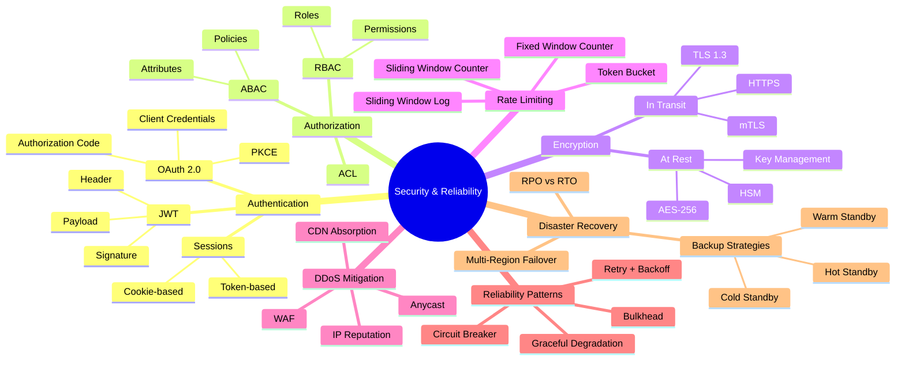

---

## Authentication vs Authorization

These two concepts are consistently confused in interviews and in code. They are distinct concerns with different scopes:

| Concept | Question Answered | Example | Enforcement Point |
|---------|-------------------|---------|-------------------|
| **Authentication (AuthN)** | *Who are you?* | Verifying username + password | Login endpoint, API gateway |
| **Authorization (AuthZ)** | *What can you do?* | Can this user delete this resource? | Business logic, middleware |

Authentication always precedes authorization. A system cannot determine what an identity is allowed to do before confirming that identity. However, authorization decisions can change without re-authenticating — a user's role may be revoked while their session remains active, which is why token expiry and revocation matter.

---

## OAuth 2.0 Authorization Code Flow

OAuth 2.0 is an **authorization framework** (not an authentication protocol). It delegates access without sharing credentials. The most secure grant type for user-facing applications is the **Authorization Code grant with PKCE**.

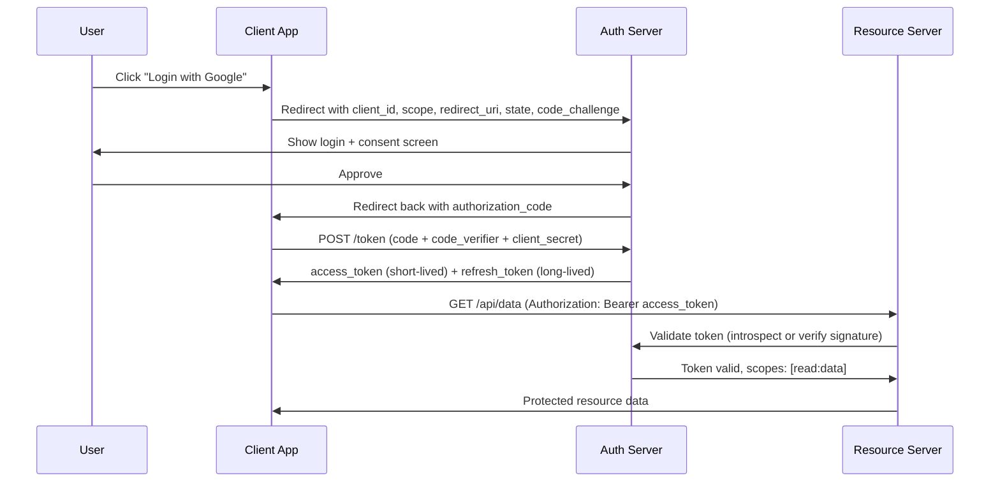

**Key security properties:**
- `state` parameter prevents CSRF on the redirect
- `code_challenge` / `code_verifier` (PKCE) prevents authorization code interception
- `access_token` is short-lived (15 min) to limit blast radius of leaks
- `refresh_token` is long-lived but must be stored securely (httpOnly cookie, not localStorage)

---

## JWT: Structure and Validation

A JSON Web Token is a **self-contained credential** — the resource server can verify it without calling the auth server on every request.

**Structure:** `base64url(header).base64url(payload).base64url(signature)`

```
eyJhbGciOiJSUzI1NiIsInR5cCI6IkpXVCJ9    ← Header
.
eyJzdWIiOiJ1c2VyXzEyMyIsInJvbGUiOiJhZG1pbiIsImV4cCI6MTcwMDAwMDAwMH0   ← Payload
.
[RSASSA-PKCS1-v1_5 signature]             ← Signature
```

**Header** (algorithm + type):
```json
{ "alg": "RS256", "typ": "JWT" }
```

**Payload** (claims — never put secrets here, it is base64-encoded not encrypted):
```json
{
  "sub": "user_123",
  "role": "admin",
  "iat": 1700000000,
  "exp": 1700000900
}
```

**Validation flow a resource server must execute:**


**Refresh token rotation:** When an access token expires, the client sends the refresh token to receive a new access token (and optionally a new refresh token). If a refresh token is stolen and used, the original holder's next use detects the double-use, triggering revocation of the entire token family.

---

## Encryption

### TLS 1.3 Handshake (Simplified)

TLS establishes an encrypted channel before any application data is transmitted. TLS 1.3 reduced the handshake from 2 round trips (TLS 1.2) to 1 round trip:

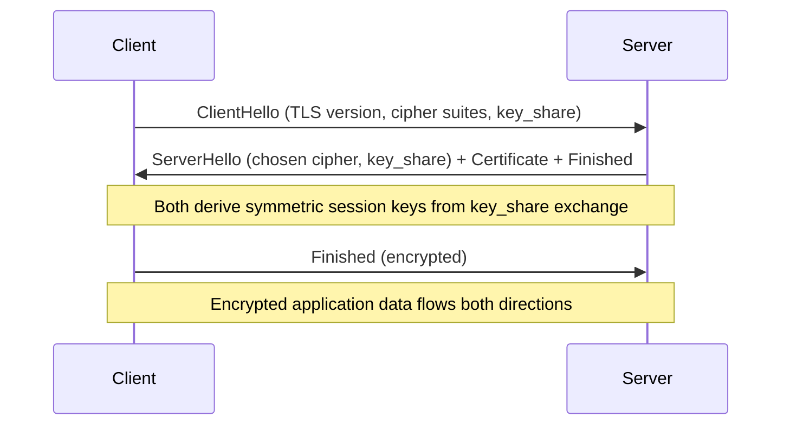

The `key_share` uses **Ephemeral Diffie-Hellman** — the session key is never transmitted, it is derived independently on both sides. This provides **Forward Secrecy**: compromising the server's private key later does not decrypt past sessions.

### At-Rest Encryption

| Layer | Mechanism | Who Manages Keys |
|-------|-----------|-----------------|
| **Full disk** | AES-256 (dm-crypt, FileVault) | OS / cloud provider |
| **Database column** | Application-level AES-256 | Application + KMS |
| **Object storage** | SSE-S3 / SSE-KMS | Cloud provider |
| **Secrets** | Vault, AWS Secrets Manager | Dedicated secrets service |

**Key management** is the hard part. Keys encrypted by other keys must stop somewhere — a Hardware Security Module (HSM) or cloud-managed key material is the root of trust.

---

## Rate Limiting Algorithms

Rate limiting protects services from overload, abuse, and cost runaway. Four common algorithms each have different trade-offs:

### 1. Token Bucket


Tokens refill at a fixed rate. Burst traffic up to bucket capacity is allowed. Used by AWS API Gateway, Stripe.

### 2. Fixed Window Counter

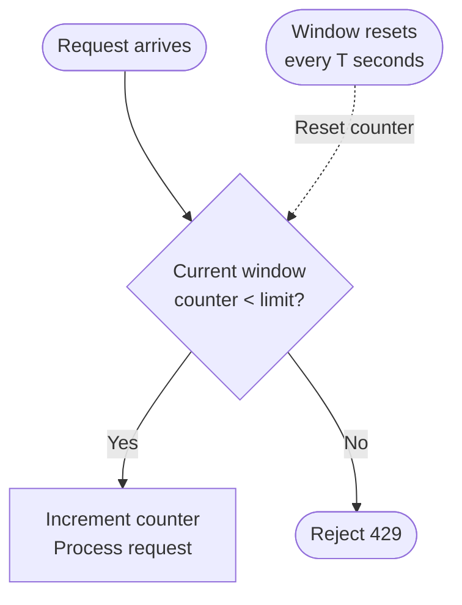

Simple but has a **boundary burst problem**: 100 req/min allows 100 at 0:59 and 100 at 1:00 — effectively 200 in 2 seconds.

### 3. Sliding Window Log

Maintains a timestamped log of each request. On each request, purge entries older than the window, count remaining entries.

- **Pros:** Perfectly accurate
- **Cons:** Memory grows with request volume — stores every timestamp

### 4. Sliding Window Counter

Approximation that combines fixed window simplicity with sliding accuracy:

`estimated_count = prev_window_count × (1 − elapsed_fraction) + current_window_count`

**Algorithm Comparison:**

| Algorithm | Accuracy | Memory | Burst Handling | Complexity |
|-----------|----------|--------|----------------|------------|
| Token Bucket | High | O(1) | Allows bursts up to capacity | Low |
| Fixed Window | Low (boundary burst) | O(1) | Hard cutoff at boundary | Lowest |
| Sliding Window Log | Exact | O(requests) | Smooth enforcement | Medium |
| Sliding Window Counter | High (~0.003% error) | O(1) | Smooth, approximate | Low |

**Distributed rate limiting** requires a shared store (Redis with atomic `INCR` + `EXPIRE`). Per-node counters are simpler but allow N×limit burst across N nodes.

---

## DDoS Mitigation

A Distributed Denial of Service attack exhausts resources (bandwidth, CPU, connections) to make a service unavailable. Defense is layered:

| Strategy | Layer | How It Helps | Example |
|----------|-------|-------------|---------|
| **CDN absorption** | L3/L4/L7 | Anycast distributes attack traffic across PoPs | Cloudflare absorbs 100 Tbps |
| **Rate limiting** | L7 | Caps requests per IP / ASN | Drop IPs > 1000 req/min |
| **WAF rules** | L7 | Block malformed HTTP, known attack signatures | AWS WAF, ModSecurity |
| **IP reputation** | L3/L4 | Block known botnet/scanner IPs | MaxMind, AbuseIPDB feeds |
| **Anycast routing** | L3 | Spread volumetric traffic across global PoPs | BGP anycast |
| **SYN cookies** | L4 | Defend TCP SYN flood without state | Linux kernel default |
| **Connection limits** | L4 | Cap concurrent connections per source | nginx `limit_conn` |

**Real-World — Cloudflare DDoS Mitigation:** Cloudflare operates 300+ PoPs using anycast. A volumetric attack targeting a single origin is distributed across the network — each PoP absorbs a fraction. Layer 7 attacks are filtered by their WAF and machine-learning-based bot detection. The 2023 largest-ever HTTP DDoS (71M req/sec) was mitigated automatically.

---

## Input Validation

Never trust user input. Validate, sanitize, and parameterize at every boundary.

### XSS (Cross-Site Scripting)

**Attack:** Injecting script into content rendered by other users' browsers.

**Prevention checklist:**
- [ ] HTML-encode all user-supplied output (`<` → `&lt;`)
- [ ] Use Content-Security-Policy header to restrict script sources
- [ ] Use `httpOnly` cookie flag (JavaScript cannot read cookies)
- [ ] Avoid `innerHTML`; use `textContent` or framework templating

### SQL Injection

**Attack:** Embedding SQL syntax in user input to manipulate queries.

**Prevention checklist:**
- [ ] Use parameterized queries / prepared statements — **never string-concatenate SQL**
- [ ] Use an ORM (Hibernate, SQLAlchemy, Prisma) that parameterizes by default
- [ ] Apply least-privilege DB users (app user cannot `DROP TABLE`)
- [ ] Validate input type and length before it reaches the database layer

### CSRF (Cross-Site Request Forgery)

**Attack:** Tricking an authenticated user's browser into making unintended requests.

**Prevention checklist:**
- [ ] Use CSRF tokens (unpredictable, tied to session, validated server-side)
- [ ] Use `SameSite=Strict` or `SameSite=Lax` cookie attribute
- [ ] Validate `Origin` / `Referer` headers on state-changing requests
- [ ] Require re-authentication for high-impact actions (fund transfers, email change)

---

## Reliability Patterns

### Retry with Exponential Backoff and Jitter

Retrying failed requests immediately causes thundering-herd. Exponential backoff with jitter spreads retries over time:

```
wait = min(cap, base × 2^attempt) + random(0, base)
```


**Do not retry on:** 4xx errors (client mistakes), non-idempotent operations without idempotency keys.

### Circuit Breaker

See [Chapter 13](/system-design/part-3-architecture-patterns/ch13-microservices) for the full circuit breaker pattern (Closed → Open → Half-Open state machine). In the context of security and reliability: a circuit breaker prevents a failing downstream dependency from cascading failures into your service, maintaining availability degraded rather than failed.

### Bulkhead Pattern

Named after ship hull partitions that prevent one flooded compartment from sinking the entire ship.

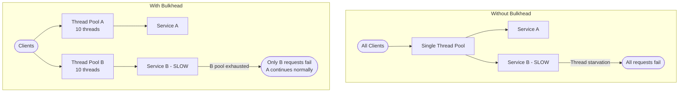

Apply bulkheads at: connection pools per downstream service, thread pools per request type, CPU/memory limits per container (via cgroups/Kubernetes resource limits).

### Graceful Degradation Strategies

| Scenario | Degraded Behavior | User Experience |
|----------|-------------------|-----------------|
| Recommendation service down | Return empty recommendations | Page loads without "You may also like" |
| Search service slow | Return cached results | Stale results shown with banner |
| Payment processor timeout | Queue for async retry | "We're processing your payment" |
| Auth service flapping | Serve cached session | User remains logged in temporarily |
| Image service down | Show placeholder | Broken image replaced with fallback |

The key principle: **identify which features are critical-path (cannot be degraded) vs. non-critical (can return defaults or be hidden)** and design accordingly.

---

## Disaster Recovery

### RPO vs RTO

| Metric | Definition | Question It Answers | Typical Target |
|--------|-----------|---------------------|----------------|
| **RPO** (Recovery Point Objective) | Max acceptable data loss | "How much data can we lose?" | 0s (sync replication) to 24h |
| **RTO** (Recovery Time Objective) | Max acceptable downtime | "How long can we be down?" | Seconds (active-active) to hours |

Lower RPO and RTO require more expensive infrastructure. The relationship is roughly exponential: going from RTO=1h to RTO=1min may cost 10× more.

### Backup Strategies

| Strategy | Description | RTO | RPO | Cost |
|----------|-------------|-----|-----|------|
| **Hot standby** | Active replica in sync, traffic switchable in seconds | Seconds | Near-zero | Highest (~2× infrastructure) |
| **Warm standby** | Replica running, data lagging, needs promotion | Minutes | Minutes | Medium (~1.5×) |
| **Cold standby** | Backups stored, no running replica, restore on failure | Hours | Hours | Lowest |
| **Pilot light** | Minimal infrastructure pre-provisioned, scales on activation | 10–30 min | Minutes | Low-medium |

### Multi-Region Failover


**Failover checklist:**
- [ ] DNS TTL set low (30–60s) before planned failover; low TTL costs more DNS queries normally
- [ ] Replica is caught up (check replication lag) before promoting
- [ ] Application connection strings use DNS names, not hardcoded IPs
- [ ] Run failover drills quarterly — untested DR is not DR

**Real-World — Netflix Chaos Engineering:** Netflix runs Chaos Monkey in production, randomly terminating EC2 instances. Chaos Kong kills entire AWS regions. The philosophy: if failures happen regularly during business hours when engineers are alert, you are forced to build genuine resilience rather than relying on MTTR.

---

## OAuth 2.0 Authorization Flows

OAuth 2.0 defines several "grant types" — each optimized for a different client context. The existing section covers the Authorization Code + PKCE flow. This section maps all major flows and when to use each.

### Flow Comparison

| Flow | Best For | Token Location | Security Level | Client Secret Required |
|---|---|---|---|---|
| **Authorization Code + PKCE** | Web apps, mobile, SPA | Server-side or httpOnly cookie | Highest | No (PKCE replaces it) |
| **Authorization Code** (no PKCE) | Traditional server-side web apps | Server-side session | High | Yes |
| **Client Credentials** | Machine-to-machine, background services | Server memory / secrets manager | High (no user) | Yes |
| **Device Code** | Smart TVs, CLI tools, limited-input devices | Server-side | Medium | No |
| **Implicit** (deprecated) | Legacy SPA | URL fragment (insecure) | Low — do not use | No |

### Authorization Code + PKCE Flow (Web / Mobile)

This is the flow shown in the existing section above. PKCE (Proof Key for Code Exchange) replaces the client secret for public clients that cannot store secrets securely (e.g., single-page apps, mobile apps).

**PKCE mechanics:**
1. Client generates a random `code_verifier` (43–128 chars)
2. Client computes `code_challenge = BASE64URL(SHA256(code_verifier))`
3. Authorization request includes `code_challenge` and `code_challenge_method=S256`
4. Token request includes `code_verifier` — server re-hashes and compares

Even if an attacker intercepts the `authorization_code`, they cannot exchange it without the original `code_verifier`.

### Client Credentials Flow (Machine-to-Machine)

No user is involved. A backend service authenticates directly as itself.

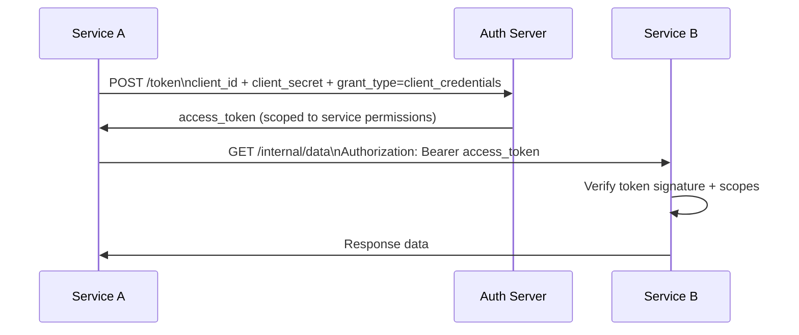

**Use case:** Microservice A calling Microservice B, scheduled jobs calling APIs, CI/CD pipelines accessing deployment APIs.

**Security note:** `client_secret` must be stored in a secrets manager (AWS Secrets Manager, HashiCorp Vault) — never in source code or environment variables committed to git.

### Device Code Flow (Input-Constrained Devices)

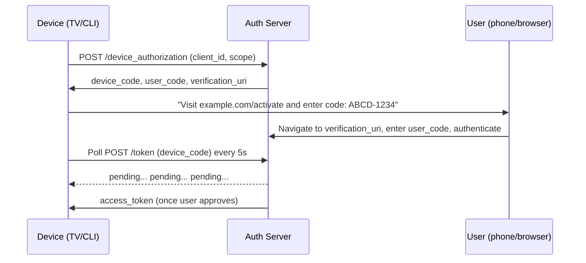

**Use case:** Logging into Netflix on a smart TV, GitHub CLI authentication, IoT device provisioning.

---

## JWT Deep-Dive

The existing section covers JWT structure and validation. This section adds claim semantics, session vs token comparison, and security pitfalls.

### Standard Claims Reference

| Claim | Full Name | Purpose | Example Value |
|---|---|---|---|
| `iss` | Issuer | Who created the token | `"https://auth.example.com"` |
| `sub` | Subject | Who the token represents (user ID) | `"user_abc123"` |
| `aud` | Audience | Which service(s) should accept this token | `"api.example.com"` |
| `exp` | Expiration | Unix timestamp after which token is invalid | `1700000900` |
| `iat` | Issued At | Unix timestamp when token was created | `1700000000` |
| `nbf` | Not Before | Token not valid before this timestamp | `1700000000` |
| `jti` | JWT ID | Unique token ID — enables revocation tracking | `"abc-def-123"` |

**Custom claims** (application-specific):
```json
{
  "sub": "user_123",
  "role": "admin",
  "org_id": "org_456",
  "permissions": ["read:reports", "write:settings"],
  "exp": 1700000900
}
```

### JWT Algorithm Selection

| Algorithm | Type | Key Type | Use Case |
|---|---|---|---|
| `HS256` | Symmetric HMAC | Single shared secret | Internal services (all share same secret) |
| `RS256` | Asymmetric RSA | Private key signs, public key verifies | Cross-service (distribute public key only) |
| `ES256` | Asymmetric ECDSA | Private key signs, public key verifies | Same as RS256 but smaller tokens |

**Rule:** Use `RS256` or `ES256` for any token that crosses a trust boundary. `HS256` is fine for internal service-to-service when all parties share the secret.

### Session-Based vs Token-Based Auth

| Property | Session (Cookie) | Token (JWT) |
|---|---|---|
| **Server state** | Session stored server-side (DB/Redis) | Stateless — no server state |
| **Revocation** | Instant — delete session from store | Hard — token valid until expiry |
| **Scalability** | Session store becomes hot dependency | Scales easily — no shared state |
| **Token size** | Cookie: ~100 bytes (session ID only) | JWT: ~500–2000 bytes in headers |
| **Cross-domain** | Cookies limited to same origin / CORS | Bearer token works cross-domain |
| **Mobile/API clients** | Awkward — cookie handling varies | Natural — Authorization header |
| **Best for** | Traditional web apps, instant logout critical | APIs, microservices, mobile apps |

### JWT Security Pitfalls

| Pitfall | Risk | Mitigation |
|---|---|---|
| **`alg: none` attack** | Attacker removes signature, claims any identity | Always explicitly specify allowed algorithms in validation |
| **Weak `HS256` secret** | Brute-forceable secret → forge any token | Minimum 256-bit random secret; prefer `RS256` |
| **No `aud` validation** | Token for Service A accepted by Service B | Always validate `aud` claim matches current service |
| **Long expiry** | Stolen token usable for hours/days | Access tokens: 5–15 min; use refresh tokens for long sessions |
| **JWT in localStorage** | Readable by any JavaScript (XSS risk) | Store in `httpOnly` cookie; if localStorage, accept XSS risk explicitly |
| **No `jti` tracking** | Cannot revoke individual tokens before expiry | Track `jti` in Redis for high-security actions; accept cost |

---

## Rate Limiting Algorithms — Full Comparison

The existing section covers four algorithms. This section adds **Leaky Bucket** and provides deeper implementation guidance.

### Token Bucket (Detailed)

Tokens accumulate up to a `capacity`. Each request consumes one token. Tokens refill at `rate` per second.

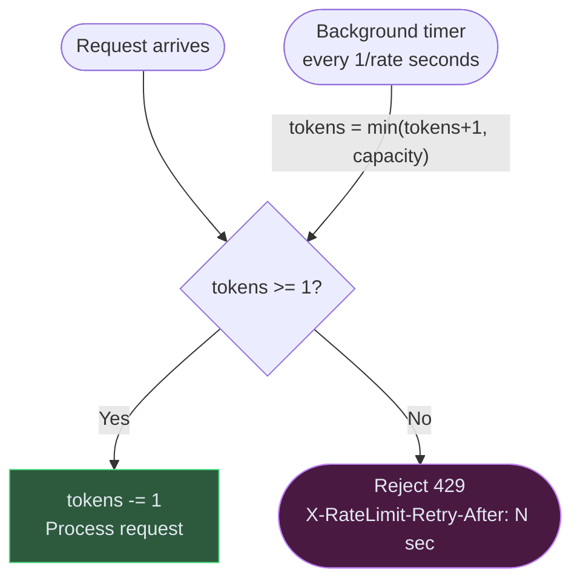

**Key properties:**
- Burst of up to `capacity` requests is immediately allowed
- Long-term rate enforced by refill speed
- Implementation: `(last_tokens + (now - last_refill) * rate)` — no timer needed, calculate on each request

### Leaky Bucket

Requests enter a fixed-size queue. A worker processes (drains) the queue at a constant rate. If the queue is full, the request is dropped.

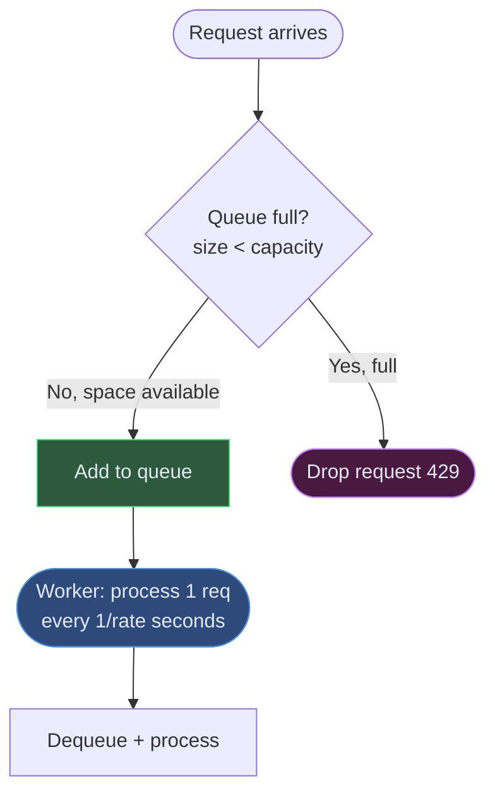

**Key difference from Token Bucket:** Leaky Bucket produces a smooth, constant output rate regardless of input burst pattern. Token Bucket allows bursts to pass through immediately.

### Fixed Window Counter

```
Window: [0s—60s] counter=0 → increments to 100 → resets at 60s → [60s—120s] counter=0
```

**Boundary burst problem:**
```
[0:59] 100 requests → allowed (window 1, counter=100)
[1:00] 100 requests → allowed (window 2 starts, counter=0 → 100)
Result: 200 requests in 2 seconds despite "100/min" limit
```

### Sliding Window Log

Stores a timestamp for every request in the current window. On each request:
1. Remove entries older than `window_size`
2. Count remaining entries
3. If count < limit → allow and add new timestamp; else → reject

```
Redis sorted set: ZADD key timestamp "requestID"
                  ZREMRANGEBYSCORE key 0 (now - window_ms)
                  count = ZCARD key
```

**Exact accuracy** but memory grows with request volume — `O(requests_per_window)` per user.

### Sliding Window Counter (Hybrid)

Estimates the count using weighted average between current and previous window:

```
estimated = prev_count × (1 − elapsed/window_size) + curr_count
```

**Example:** Window=60s, prev_count=80, curr_count=10, elapsed=15s into current window:
```
estimated = 80 × (1 − 15/60) + 10 = 80 × 0.75 + 10 = 60 + 10 = 70
```

Memory: O(1) per user — only store two counters per window.

### Algorithm Comparison

| Algorithm | Burst Handling | Memory | Accuracy | Smoothness | Complexity | Best For |
|---|---|---|---|---|---|---|
| **Token Bucket** | Allows bursts up to capacity | O(1) | High | Bursty output | Low | APIs allowing short bursts (Stripe, AWS) |
| **Leaky Bucket** | Absorbs bursts, constant output | O(queue) | High | Smooth output | Low-Medium | Protecting downstream at constant rate |
| **Fixed Window** | Hard cutoff (boundary burst risk) | O(1) | Low | Not smooth | Lowest | Simple internal quotas |
| **Sliding Window Log** | Perfectly smooth | O(requests) | Exact | Smooth | Medium | Low-volume, exact enforcement |
| **Sliding Window Counter** | Smooth, approximate | O(1) | ~99.997% | Smooth | Low | Production APIs (Cloudflare, Kong) |

### Distributed Rate Limiting with Redis

Single-node rate limiting is insufficient for multi-instance services. Use Redis atomic operations:

```
-- Token Bucket in Redis (Lua script for atomicity)
local tokens = tonumber(redis.call('GET', key) or capacity)
local now = tonumber(ARGV[1])
local last = tonumber(redis.call('GET', key..':ts') or now)
local refill = math.min(capacity, tokens + (now - last) * rate)
if refill >= 1 then
    redis.call('SET', key, refill - 1)
    redis.call('SET', key..':ts', now)
    return 1  -- allowed
else
    return 0  -- rejected
end
```

**Per-node vs centralized trade-off:**

| Approach | Accuracy | Latency | Failure Mode |
|---|---|---|---|
| Per-node counter | Allows N×limit burst (N = node count) | Zero (local) | Node failure loses counter |
| Redis centralized | Accurate | +1–2ms per request | Redis outage = no rate limiting |
| Redis + local fallback | Approximate (slightly over) | +1–2ms normally, 0ms on Redis failure | Graceful degradation |

> **Cross-references:** Rate limiting at the API gateway layer → [Ch13 — Microservices](/system-design/part-3-architecture-patterns/ch13-microservices). Load balancer traffic shaping → [Ch06 — Load Balancing](/system-design/part-2-building-blocks/ch06-load-balancing).

---

## Trade-offs & Comparisons

| Approach | Benefit | Cost | When to Choose |
|----------|---------|------|----------------|
| Sync replication (RPO=0) | No data loss on failover | Higher write latency | Financial transactions |
| Async replication (low cost) | Low write latency | Potential data loss | Analytics, content delivery |
| Active-active multi-region | RTO < 5s | Conflict resolution complexity | Global, revenue-critical |
| JWT (stateless tokens) | No server-side session store | Cannot revoke without token rotation | Scalable APIs |
| Session cookies (stateful) | Instant revocation | Session store becomes critical dependency | Traditional web apps |
| Sliding window rate limit | Smooth, accurate | Slightly more complex than fixed window | Production APIs |

---

> **Key Takeaway:** Security and reliability are not features to bolt on — they emerge from deliberate design choices: short-lived tokens, layered input validation, isolated failure domains via bulkheads, and tested recovery procedures. The most dangerous assumption in system design is that your dependencies will stay up.

---

## Case Study: Shopify's Payment Resilience

Shopify processes hundreds of billions of dollars in Gross Merchandise Volume annually. For a merchant, a failed or duplicated payment is existential — it means lost revenue or angry customers demanding refunds. This case study maps the reliability patterns in this chapter to Shopify's actual payment architecture.

### Context and Challenges

| Challenge | Consequence if Ignored | Scale |
|---|---|---|
| **Payment gateway failures** | Lost sales during checkout | Shopify integrates 100+ payment providers |
| **Double-charge prevention** | Duplicate charges, chargebacks, merchant liability | Any retry without idempotency → duplicate charge |
| **Partial failures** | Payment debited but order not created | Distributed transaction across services |
| **Reconciliation drift** | Internal ledger disagrees with Stripe/Braintree | Discovered only at end-of-month audit |

### Pattern 1: Idempotency Keys

Every payment request is tagged with a globally unique idempotency key generated by the client before the first attempt. If the network fails mid-request, the client retries with the **same key** — the payment provider de-duplicates based on the key and returns the original result without re-processing the charge.

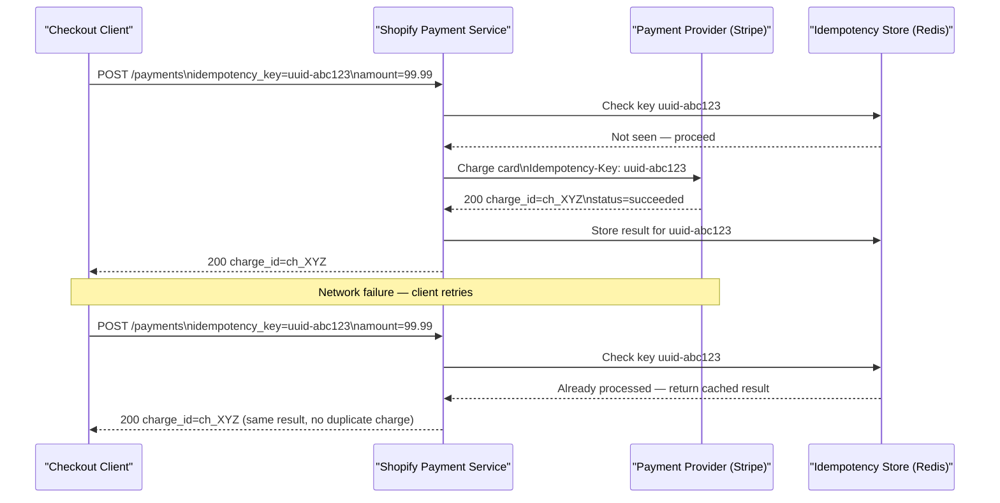

**Key design rules for idempotency keys:**
- Generated client-side (not server-side) so the key survives server crashes
- Stored with TTL (e.g., 24h) — long enough to cover retries, short enough to reclaim memory
- Associated with the full response, not just a success flag — lets clients recover partial state

### Pattern 2: Circuit Breakers on Payment Providers

Shopify integrates multiple payment providers (Stripe, Braintree, Adyen, etc.). If one provider degrades, a circuit breaker isolates that provider and routes new requests to alternatives — maintaining checkout availability even when a provider has an incident.

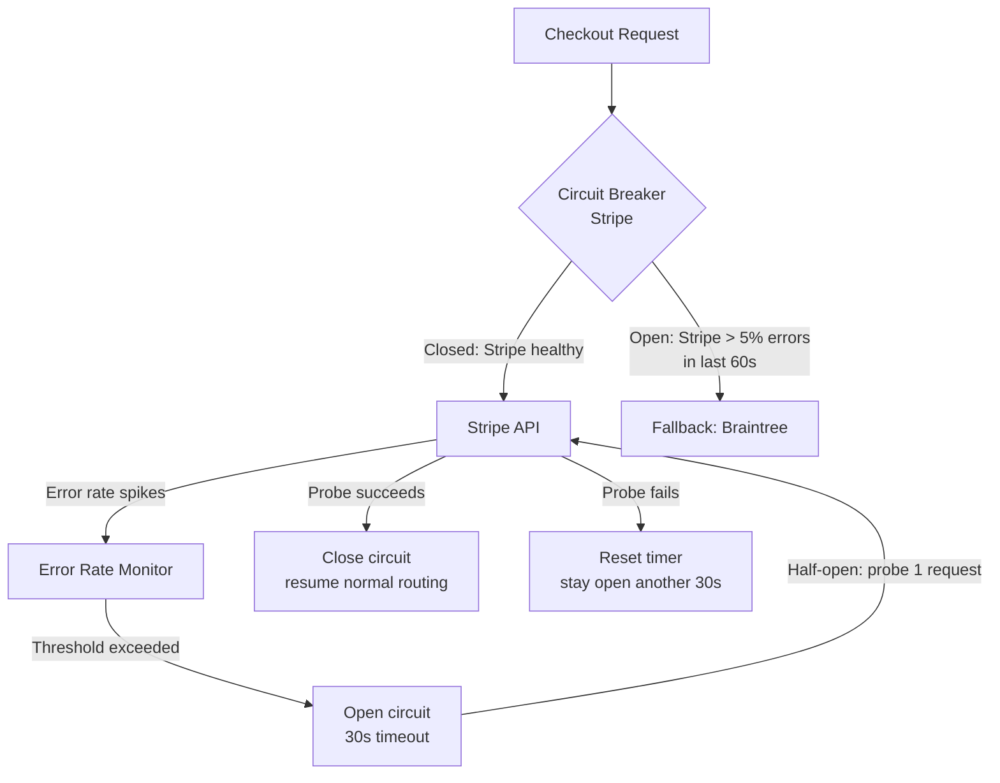

The state machine is identical to the circuit breaker pattern in [Chapter 13](/system-design/part-3-architecture-patterns/ch13-microservices). The Shopify-specific addition: when the circuit opens, the load balancer weight for that provider drops to 0 rather than returning errors to users.

### Pattern 3: Async Payment Processing

Not all payment operations are synchronous. Subscription renewals, delayed captures, and refunds are processed asynchronously through a queue. This isolates the checkout path from batch operations and provides guaranteed delivery even when downstream services are slow.

Architecture (see [Chapter 11 — Message Queues](/system-design/part-2-building-blocks/ch11-message-queues) for queue patterns):
- Checkout → publishes `payment.capture_requested` event to durable queue
- Payment worker consumes the event, calls provider, emits `payment.succeeded` or `payment.failed`
- Order service subscribes to `payment.succeeded` to fulfill the order
- Dead-letter queue captures failed messages after 3 retries for manual inspection

**Why async for subscriptions specifically:** Shopify processes millions of subscription renewals in a daily batch window. Processing them synchronously would require holding millions of open connections to payment providers. The queue decouples ingestion rate from processing rate, smoothing load across the window.

### Pattern 4: Reconciliation Jobs

Even with idempotency keys and circuit breakers, state mismatches occur: network timeouts after a provider charges but before Shopify receives confirmation, provider-side corrections, partial refunds. Reconciliation jobs run on a schedule (hourly for high-value merchants, daily for standard) to detect and fix mismatches.

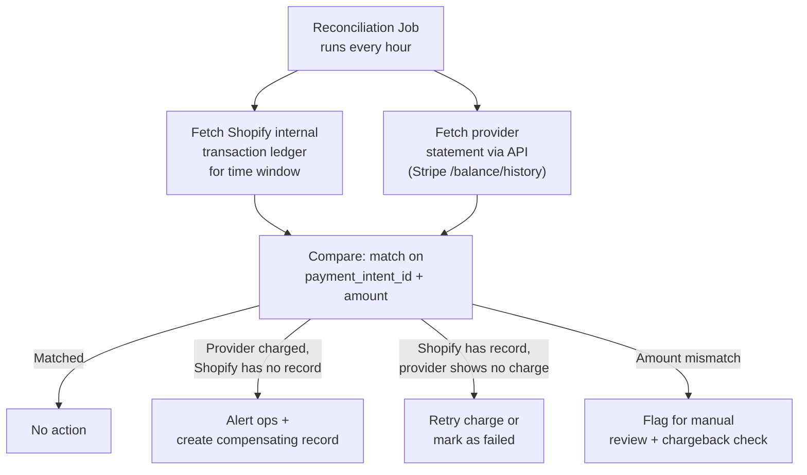

Reconciliation is the safety net that catches everything the online path missed. See [Chapter 14 — Event-Driven Architecture](/system-design/part-3-architecture-patterns/ch14-event-driven-architecture) for the event sourcing approach that makes reconciliation audits tractable: each state transition is a logged event, so the full history is reconstructable.

### Pattern Comparison

| Pattern | Problem Solved | Implementation | Trade-off |
|---|---|---|---|
| **Idempotency keys** | Duplicate charges on retry | Client-generated UUID + Redis lookup | Key storage cost; TTL must outlast retry window |
| **Circuit breaker** | Gateway outage kills checkout | Per-provider error rate threshold → open/half-open/close | False opens under transient spikes; needs careful tuning |
| **Async queue** | Checkout blocked by slow provider | Durable queue + worker pool | Eventual consistency; UX must handle "payment processing" state |
| **Reconciliation** | Silent mismatches between systems | Periodic batch compare of internal vs external ledger | Latency: mismatches detected hours later, not instantly |

### Key Takeaway

Financial systems require **defense-in-depth**: no single pattern prevents all failure modes. Idempotency prevents duplicates but not gateway outages. Circuit breakers prevent cascading failures but not data mismatches. Async queues decouple services but introduce eventual consistency. Reconciliation catches everything the online path missed but only after the fact. The complete system requires all four layers.

---

## Practice Questions

1. A user complains they were logged out even though their session "should still be valid." Walk through the JWT validation steps that could cause a rejection — which claims matter and why?

2. Your API is being hit by a DDoS attack generating 500,000 requests/second from 50,000 different IP addresses. Rate limiting per IP is ineffective. What additional mitigation strategies would you layer on, and in what order?

3. Your payment service depends on three downstream services: fraud detection, currency conversion, and ledger. If any one of these becomes slow, all payment requests hang. Design a reliability architecture using bulkheads and circuit breakers to isolate these dependencies.

4. A startup is choosing between RPO=1h (daily backups, cold standby) and RPO=1min (continuous replication, warm standby). The cost difference is $8,000/month. What questions do you ask to help them decide?

5. You are designing rate limiting for a public REST API. Compare the token bucket and sliding window counter algorithms across: accuracy, memory usage, implementation complexity, and burst handling. Which would you choose for a payment API vs. a social media feed API?
