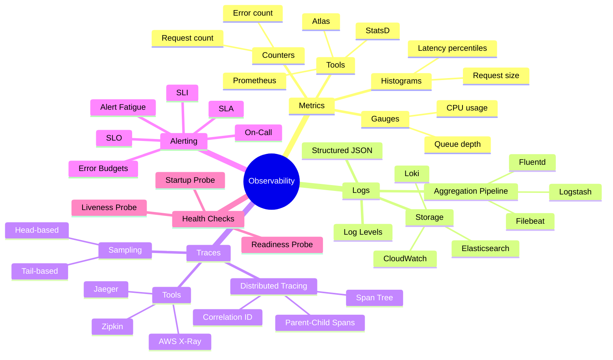
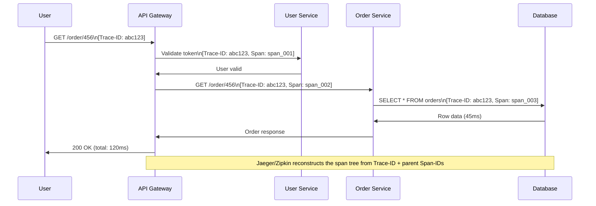
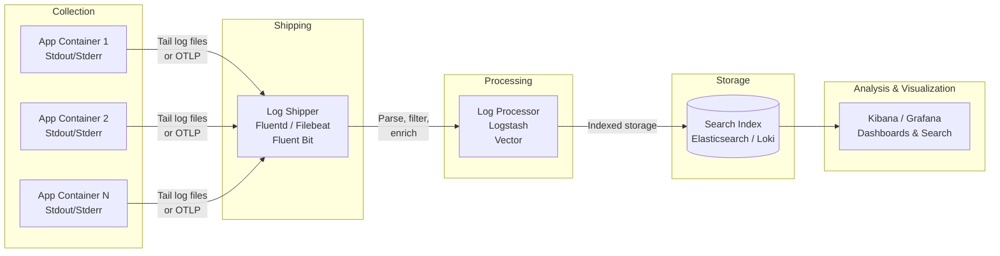
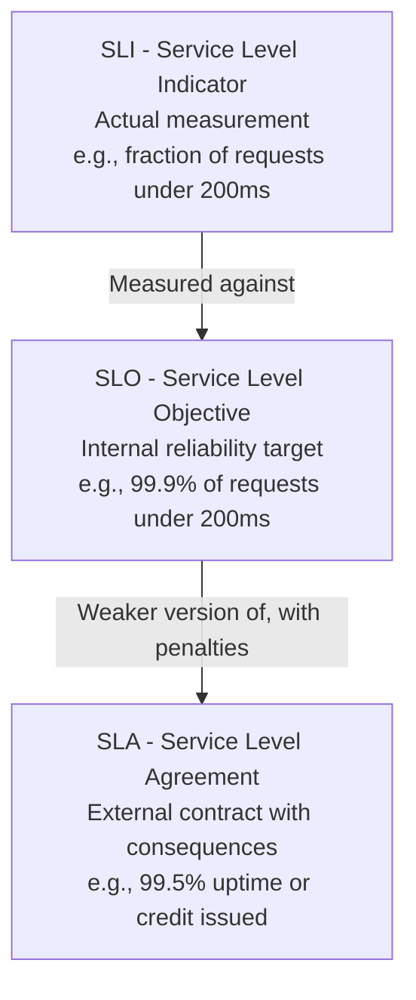
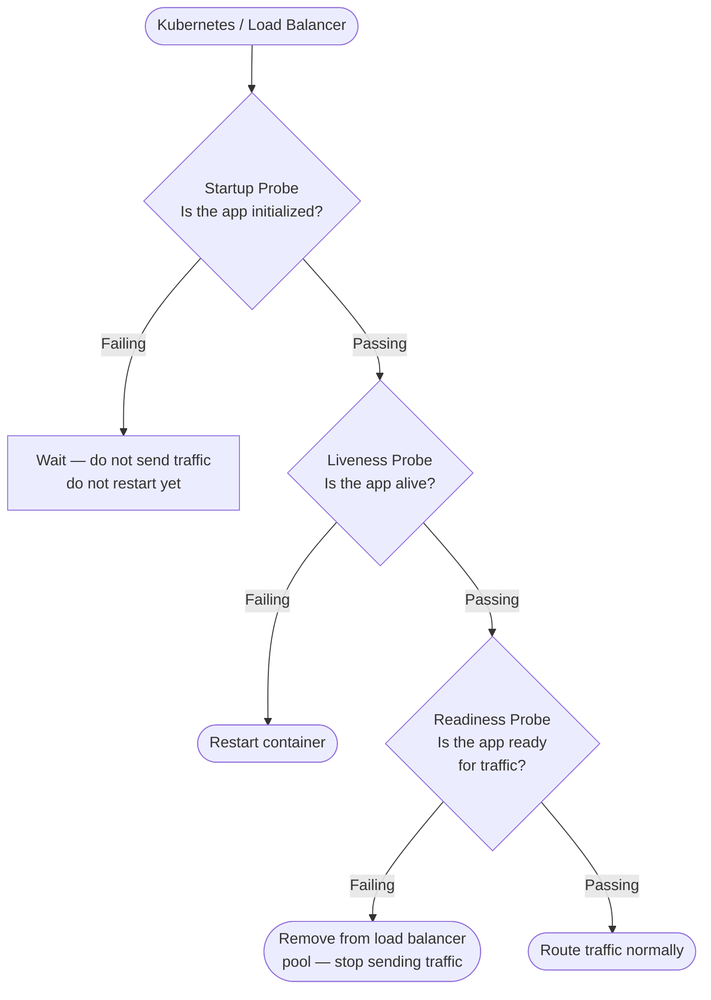

# Chapter 17: Monitoring & Observability


> *Monitoring tells you when something is wrong. Observability tells you why. The difference is whether your system was built to be questioned.*

---

## Mind Map



---

## The Three Pillars of Observability

Observability is built on three complementary signal types. Each answers different questions:

| Dimension | Metrics | Logs | Traces |
|-----------|---------|------|--------|
| **What is it?** | Numeric measurements over time | Timestamped text/structured records | Request journey across services |
| **Granularity** | Aggregated (not per-request) | Per-event | Per-request, cross-service |
| **Best for** | Dashboards, alerting, trends | Debugging specific events | Latency attribution, dependency mapping |
| **When to use** | "Is something wrong?" | "What happened at 14:03:22?" | "Which service added 800ms?" |
| **Cost** | Low (aggregates) | Medium (storage scales with volume) | High (sampling required at scale) |
| **Common tools** | Prometheus, Datadog, Atlas | ELK Stack, Loki, CloudWatch | Jaeger, Zipkin, AWS X-Ray |
| **Retention** | Weeks–months | Days–weeks | Hours–days (sampled) |
| **Cardinality risk** | High (too many labels = explosion) | Low | Medium |

You need all three. Metrics alone tell you latency spiked; logs tell you which user was affected; traces tell you which service in the call chain caused it.

---

## Metrics Types

Prometheus and most metrics systems define three fundamental types:

| Type | Definition | Example Use Cases | Example Values |
|------|-----------|-------------------|----------------|
| **Counter** | Monotonically increasing integer, only goes up (resets on restart) | Total HTTP requests, total errors, total bytes sent | `http_requests_total{method="GET", status="200"} 10482` |
| **Gauge** | Arbitrary value that can go up or down | CPU %, active connections, queue depth, memory usage | `queue_depth{queue="payments"} 42` |
| **Histogram** | Samples observations into configurable buckets, exposes `_count`, `_sum`, `_bucket` | Request latency distribution, request size | `http_duration_seconds_bucket{le="0.1"} 8234` |

### Why Histograms Matter: Percentiles vs. Averages

Averages hide tail latency. A p99 latency of 2s means 1% of your users wait 2 seconds — that can be thousands of users. Always alert on percentiles (p95, p99, p999) for latency metrics.

```
p50 = 50ms  ← Typical user
p95 = 200ms ← Most users
p99 = 800ms ← Tail (worst 1%)
```

Prometheus computes percentiles from histograms server-side using `histogram_quantile(0.99, ...)`.

---

## Distributed Tracing

In a microservices system, a single user request may fan out to 10+ services. Traditional logging — per-service — cannot answer "which service is slow." Distributed tracing reconstructs the full call tree.

### Core Concepts

- **Trace:** The complete journey of one request, from entry point to all leaf calls
- **Span:** One unit of work within a trace (e.g., one service call, one DB query)
- **Correlation ID / Trace ID:** A unique ID injected at the entry point and propagated via HTTP headers (`X-Trace-ID`) to every downstream call
- **Parent-child spans:** Each span records its parent span ID, enabling tree reconstruction

### Trace Sequence Example



### Span Tree Visualization

```
abc123 [120ms total]
├── span_001: Auth (User Service)  [15ms]
└── span_002: Order Service        [98ms]
    └── span_003: DB Query         [45ms]
```

This immediately surfaces that the DB query and Order Service overhead account for 98ms, making optimization target obvious.

### Sampling Strategies

At 10,000 req/sec, storing every trace is prohibitively expensive. Two approaches:

| Strategy | How It Works | Pros | Cons |
|----------|-------------|------|------|
| **Head-based** | Decide at trace start (random %) | Low overhead, simple | Misses rare errors |
| **Tail-based** | Buffer full trace, decide after completion based on outcome | Captures all errors/slow requests | Higher memory/processing cost |

Production recommendation: sample 1% normally, 100% of errors and traces > p99 latency threshold.

---

## Log Aggregation Pipeline

Individual service logs are useless if you cannot search them across all instances. A log aggregation pipeline centralizes logs from every container, VM, and serverless function:



**Structured logging** (JSON over plaintext) is essential for the search step. A structured log line:
```json
{
  "timestamp": "2026-03-12T00:40:00Z",
  "level": "ERROR",
  "service": "order-service",
  "trace_id": "abc123",
  "user_id": "user_789",
  "message": "Payment timeout after 5000ms",
  "duration_ms": 5000
}
```

This allows queries like: `level:ERROR AND service:order-service AND duration_ms:>3000`.

---

## SLI / SLO / SLA

Google's Site Reliability Engineering introduced the SLI → SLO → SLA hierarchy as a way to make reliability quantitative and contractual:



| Concept | Owner | Consequence of breach | Example |
|---------|-------|-----------------------|---------|
| **SLI** | Engineering | None — it is a measurement | 99.92% of requests succeeded this month |
| **SLO** | Engineering | Internal alert, error budget consumed | Target: 99.9% success rate |
| **SLA** | Business/Legal | Financial penalty, contract clause | Guarantee: 99.5% or credit issued |

### Error Budgets

An error budget is the allowable unreliability within an SLO period:

```
Error budget = 1 − SLO target
99.9% SLO → 0.1% budget → 43.8 minutes/month of allowed downtime
99.99% SLO → 0.01% budget → 4.38 minutes/month
```

**Error budget policy:** When the budget is exhausted, new feature deployments halt and reliability work takes priority. This creates a natural feedback loop: engineering teams that want to ship features are incentivized to keep the service reliable.

**Real-World — Google SRE:** Google's SRE teams hold joint ownership of error budgets with product teams. If a service exhausts its error budget, the SRE team can unilaterally halt launches. This removes the "reliability vs. velocity" organizational conflict by making reliability a shared engineering metric.

---

## Alerting Strategies

### Alert Fatigue

The biggest failure mode in alerting is **alert fatigue** — too many low-signal alerts cause engineers to ignore them, including critical ones. Symptoms:
- On-call engineers acknowledge without investigating
- Alert volume exceeds 10/day on average
- Many alerts resolve without human action

**Solution:** Every alert must be actionable. If an alert fires and no action is required, delete or demote it.

### Severity Levels

| Severity | Definition | Response SLA | Example |
|----------|-----------|-------------|---------|
| **P1 / Critical** | Service down, revenue impact | Wake on-call immediately, < 5 min | Payment API returning 500 |
| **P2 / High** | Degraded, SLO at risk | Alert on-call during business hours, < 30 min | p99 latency > 2s |
| **P3 / Medium** | Anomaly, no immediate user impact | Ticket, fix in sprint | Disk > 80% on non-critical host |
| **P4 / Low** | Informational | Review weekly | Dependency approaching end of support |

### On-Call Best Practices

- Rotate on-call weekly to distribute burden and knowledge
- Keep runbooks for every P1/P2 alert — reduce MTTR with documented steps
- Conduct blameless post-mortems within 48 hours of incidents
- Track Mean Time To Detect (MTTD) and Mean Time To Resolve (MTTR) as team metrics
- Alert on symptoms (user-visible impact) not causes (CPU high) where possible

---

## Health Checks

Health checks allow orchestrators (Kubernetes, load balancers) to route traffic away from unhealthy instances automatically. Three probe types:



| Probe | Question | Failure Action | Example Endpoint |
|-------|---------|----------------|-----------------|
| **Startup** | Has the app finished initializing? | Wait (don't kill yet) | `/health/startup` — checks migrations complete |
| **Liveness** | Is the process alive and not deadlocked? | Restart the container | `/health/live` — returns 200 if process is responsive |
| **Readiness** | Can the app serve traffic right now? | Remove from LB pool | `/health/ready` — checks DB connection, cache connection |

**Cross-reference:** [Chapter 6](/system-design/part-2-building-blocks/ch06-load-balancing) covers how load balancers use health checks to remove unhealthy backends from rotation.

**Readiness check design:** Be conservative. If your app cannot reach its database, it should fail readiness — sending traffic that will fail is worse than not sending traffic at all. However, a slow downstream service should not fail readiness if the app can degrade gracefully.

---

## Tools Comparison

| Tool | Category | What It Does | Deployment | Strengths | Weaknesses | Cost |
|------|----------|-------------|------------|-----------|------------|------|
| **Prometheus** | Metrics | Pull-based metrics collection, storage, PromQL | Self-hosted | CNCF standard, powerful query language | No long-term storage built-in, cardinality limits | Free |
| **Grafana** | Visualization | Dashboards for metrics, logs, traces from many sources | Self-hosted / Cloud | Universal frontend, supports 50+ data sources | Requires data source backends | Free / Paid |
| **Elasticsearch** | Log storage | Distributed search and analytics engine | Self-hosted / Cloud | Full-text search, flexible schema | Resource-intensive, complex to operate | Free / Paid |
| **Logstash** | Log processing | ETL pipeline for logs — parse, filter, enrich | Self-hosted | Powerful filter plugins | Heavy JVM resource usage |  Free |
| **Jaeger** | Tracing | Distributed trace collection, storage, UI | Self-hosted | CNCF, OpenTelemetry compatible | No metrics, no logs | Free |
| **Datadog** | All-in-one APM | Metrics + logs + traces + APM + alerting | SaaS | Low operational overhead, fast setup | Expensive at scale | Per-host pricing |
| **New Relic** | All-in-one APM | Full-stack observability, error tracking | SaaS | Good out-of-box instrumentation | Cost scales with data ingest | Per-GB ingest |
| **AWS CloudWatch** | Cloud-native | Metrics + logs for AWS resources | SaaS (AWS) | Zero setup for AWS services | Vendor lock-in, limited query capability | Per metric/log |

**Practical guidance:**
- **Startups:** Datadog or New Relic for speed of setup
- **Mid-size, cost-conscious:** Prometheus + Grafana + ELK + Jaeger (more ops burden, much cheaper)
- **AWS-native:** CloudWatch + X-Ray + managed Prometheus/Grafana
- **OpenTelemetry:** Use the vendor-neutral OTLP standard for instrumentation — swap backends without re-instrumenting code

**Real-World — Netflix Atlas:** Netflix built Atlas, their internal metrics platform, to handle billions of time series from thousands of services. Atlas uses in-memory storage optimized for real-time dashboards and pattern-matching queries across tag dimensions. Netflix open-sourced Atlas; its design influenced Prometheus's label model.

---

## Trade-offs & Comparisons

| Decision | Option A | Option B | Recommendation |
|----------|---------|---------|----------------|
| **Metrics storage** | Prometheus (self-hosted) | Datadog (SaaS) | SaaS if <$5K/month matters less than ops cost |
| **Log sampling** | Store all logs | Sample + retain errors | Sample at high volume (>10GB/day) |
| **Trace sampling** | Head-based (simple) | Tail-based (smart) | Tail-based if budget allows — captures all errors |
| **SLO target** | 99.9% (43 min/month budget) | 99.99% (4 min/month budget) | Higher SLO = higher infra cost, diminishing returns |
| **Alert strategy** | Alert on causes (high CPU) | Alert on symptoms (error rate) | Symptom-based reduces noise |

---

> **Key Takeaway:** Observability is the foundation of reliability. You cannot improve what you cannot measure, and you cannot debug what you cannot trace. Instrument before you need it — adding tracing during an incident is too late. The three pillars (metrics, logs, traces) are complements, not substitutes.

---

## Practice Questions

1. A microservices request takes 3 seconds end-to-end, but each individual service logs less than 100ms of processing time. How would you use distributed tracing to find the missing ~2.7 seconds?

2. Your team's SLO is 99.9% availability. After a 2-hour outage, the SRE lead says you have "used 2.7× your monthly error budget in one incident." What does this mean, and what are the operational consequences?

3. You are designing a readiness probe for a service that connects to PostgreSQL, Redis, and calls a third-party payment API. The payment API is sometimes slow (2–5s). How do you design the readiness check so that a slow payment API does not pull your service out of the load balancer rotation?

4. Compare Prometheus + Grafana (self-hosted) vs. Datadog (SaaS) for a team of 5 engineers running 50 microservices. What are the real hidden costs on each side that rarely appear in vendor comparisons?

5. Your on-call engineer receives 200 alerts in one week. 180 resolve automatically within 10 minutes, 15 require investigation but no action, and 5 require actual fixes. Design an alert restructuring plan to reduce noise while ensuring no critical alert is missed.
