# Chapter 18: URL Shortener & Pastebin


> *The URL shortener is the "Hello World" of system design interviews — deceptively simple on the surface, hiding consistent hashing, cache stampedes, ID generation races, and petabyte-scale storage problems underneath. Master this, and you have a template for every case study that follows.*

---

## Mind Map

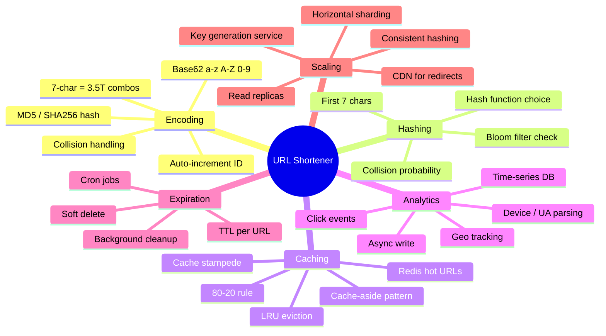

---

## Overview — Why This Is the #1 Interview Question

The URL shortener appears in nearly every system design interview loop. It is not popular because it is glamorous. It is popular because it forces you to think about:

- **ID generation at scale** — how do you create a globally unique 7-character key without race conditions?
- **Read-heavy optimization** — 10:1 read:write ratio means caching is not optional, it is the entire system
- **Redirect semantics** — 301 vs 302 is a business decision disguised as an HTTP detail
- **Data model simplicity vs feature creep** — analytics, custom aliases, expiration, and abuse prevention each add non-trivial complexity
- **Pastebin generalization** — once you understand URL shortening, Pastebin is the same system with blob storage replacing the redirect target

By the end of this chapter you will have a complete, production-caliber design and a mental framework for the 45-minute interview version.

---

## Step 1 — Requirements & Constraints

### Functional Requirements

Before drawing a single diagram, clarify scope. In an interview, ask these questions explicitly.

| Feature | Decision | Notes |
|---------|----------|-------|
| Shorten a long URL | Yes, core | POST `/shorten` |
| Redirect short URL | Yes, core | GET `/{shortCode}` → 301/302 |
| Custom aliases | Yes | User-provided slug, e.g. `bit.ly/my-campaign` |
| Expiration / TTL | Yes | URLs expire after N days; default 2 years |
| Analytics | Yes, basic | Click count, geo, device, referrer |
| User accounts | Out of scope | Simplifies auth, focus on core |
| Edit / delete URLs | Yes, owner only | Soft delete, not hard |
| Rate limiting | Yes | Prevent abuse — see [Chapter 16 — Rate Limiting](/system-design/part-3-architecture-patterns/ch16-security-reliability) |

### Non-Functional Requirements

| Property | Target | Reasoning |
|----------|--------|-----------|
| Redirect latency | P99 < 100ms | User-visible; slower feels broken |
| Availability | 99.99% | ≈ 52 min downtime/year; redirects must always work |
| Durability | 99.9999% | Lost URL mapping = broken link forever |
| Consistency | Eventual OK for analytics | Strong consistency required for URL existence check |
| Write throughput | 1,200 URLs/s peak | From estimation below |
| Read throughput | 12,000 redirects/s peak | 10:1 read:write ratio |

### Pastebin Differences

Pastebin is URL shortening with one substitution: instead of redirecting to another URL, the short code maps to a **text blob stored in object storage**. The key generation, caching, and analytics subsystems are identical. The differences are:

- Store content in S3/GCS instead of a DB URL column
- Return content directly vs HTTP redirect
- Add size limit (e.g., 10 MB per paste)
- Syntax highlighting metadata alongside the blob

---

## Step 2 — Capacity Estimation

Applying the techniques from [Chapter 4 — Back-of-Envelope Estimation](/system-design/part-1-fundamentals/ch04-estimation), we size each dimension before touching the design.

### Assumptions

- **100 million new URLs shortened per day**
- 10:1 read-to-write ratio → **1 billion redirects per day**
- Average URL size: 500 bytes (long URL + metadata)
- Hot URL cache: top 20% of URLs serve 80% of traffic (Pareto principle)
- Retention: 5 years

### QPS Estimation

```
Write QPS (average) = 100,000,000 / 86,400 ≈ 1,160 ≈ 1,200/s
Read QPS  (average) = 1,000,000,000 / 86,400 ≈ 11,600 ≈ 12,000/s

Peak = 3× average (traffic spikes from viral links)
Peak write = 3,600/s
Peak read  = 36,000/s
```

At 36,000 read QPS, a single Redis node (handles ~100K ops/s) is sufficient for the cache layer, but we need multiple app server replicas and read replicas for the DB.

### Storage Estimation

```
Per URL record = 500 bytes
Daily new records = 100M
Daily storage = 100M × 500 bytes = 50 GB/day
Annual storage = 50 GB × 365 = 18.25 TB/year
5-year storage = 18.25 × 5 ≈ 91 TB (before replication)
With 3× replication = 91 × 3 ≈ 273 TB
```

273 TB is well within a managed PostgreSQL or Cassandra cluster. No exotic storage strategy required.

### Bandwidth Estimation

```
Write bandwidth = 1,200 requests/s × 500 bytes = 600 KB/s inbound
Read bandwidth  = 12,000 requests/s × 500 bytes = 6 MB/s outbound
                  (redirects return small 301 responses, not full URL content)
```

Bandwidth is trivial. This is a latency and throughput problem, not a bandwidth problem.

### Cache Memory Estimation

```
Daily read requests = 1 billion
20% of URLs = 80% of traffic
URLs to cache = 20% of 100M = 20M URLs/day
Memory per URL in cache = 500 bytes
Cache needed = 20M × 500 bytes = 10 GB/day
```

A single Redis node with 32 GB RAM holds roughly 3 days of hot URLs. Use LRU eviction to keep the hottest entries. For more on cache sizing, see [Chapter 7 — Caching](/system-design/part-2-building-blocks/ch07-caching).

### Estimation Summary Table

| Metric | Value |
|--------|-------|
| Write QPS (avg / peak) | 1,200 / 3,600 /s |
| Read QPS (avg / peak) | 12,000 / 36,000 /s |
| Storage (5yr + 3× replication) | ~273 TB |
| Cache memory needed | ~10 GB/day |
| Inbound bandwidth | ~600 KB/s |
| Outbound bandwidth | ~6 MB/s |

---

## Step 3 — High-Level Design

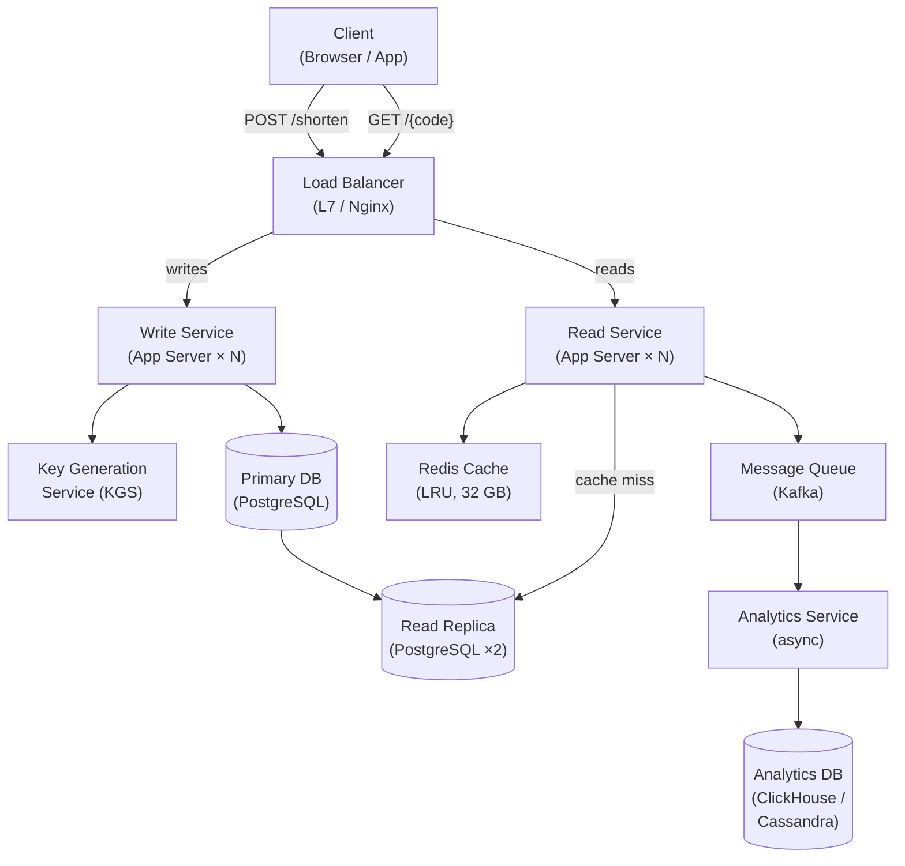

**Key design decisions at this level:**

- **Separate read and write paths** — different scaling needs; read path is stateless and cache-heavy
- **Key Generation Service (KGS)** — centralizes ID generation to prevent duplicates across app servers
- **Async analytics** — click events go to Kafka; analytics DB is decoupled from redirect latency
- **Read replicas** — absorb cache-miss DB queries without touching the primary

---

## Step 4 — Detailed Design

### 4.1 URL Encoding — How to Generate the Short Code

The short code must be:
- **Unique** across all URLs (no collisions)
- **7 characters** in base62 (sufficient namespace)
- **URL-safe** (no special characters)
- **Not guessable** (prevents enumeration attacks)

#### Base62 Alphabet

```
Characters: a-z (26) + A-Z (26) + 0-9 (10) = 62 characters
7-character code: 62^7 = 3,521,614,606,208 ≈ 3.5 trillion combinations
```

At 100M URLs/day, 3.5 trillion combinations gives us **35,000 days ≈ 96 years** before exhaustion. Base62 is the right choice.

#### Encoding Approach Comparison

| Approach | How It Works | Pros | Cons |
|----------|-------------|------|------|
| **MD5 + truncate** | Hash(long URL) → take first 7 chars | Simple, no state | Hash collisions possible; same URL always same code |
| **SHA256 + truncate** | SHA256(long URL) → first 7 chars | Stronger hash | Same collision risk; deterministic |
| **Auto-increment ID + base62** | DB auto-increment → convert to base62 | Simple, no collision | DB is bottleneck; IDs are sequential (guessable) |
| **KGS pre-generated keys** | Generate keys offline, store in DB | Fast, no collision on use | Requires KGS infrastructure; complexity |
| **UUID + base62** | UUID v4 → base62 encode first 7 chars | Distributed, no coordination | Longer source; slight collision risk at 7 chars |

**Recommended approach for interviews: KGS (Key Generation Service)** for production, MD5 truncation for simplicity discussions.

#### MD5 / Hash Approach — Collision Handling

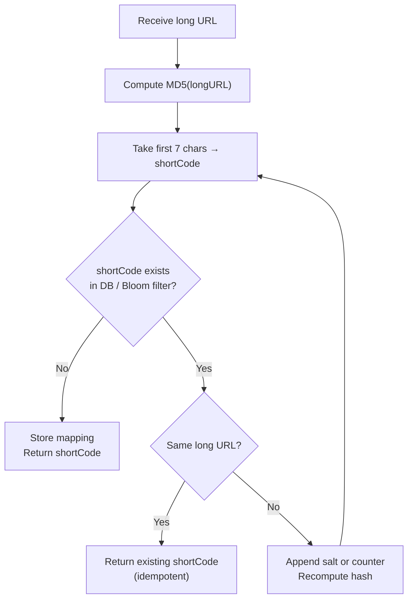

A **Bloom filter** (probabilistic set membership) dramatically speeds up the collision check. If the Bloom filter says "not present," we skip the DB lookup entirely. False positives (Bloom says present when not) cause an unnecessary DB lookup but never a wrong response.

#### Auto-Increment + Base62 Conversion

```python
# Base62 encoding: convert integer ID to 7-char string
CHARS = "abcdefghijklmnopqrstuvwxyzABCDEFGHIJKLMNOPQRSTUVWXYZ0123456789"

def encode_base62(num: int, length: int = 7) -> str:
    result = []
    while num:
        result.append(CHARS[num % 62])
        num //= 62
    return "".join(reversed(result)).zfill(length)

# ID 1 → "aaaaaab", ID 1000000 → "aaabmOc"
```

The weakness: sequential IDs mean sequential short codes — an attacker can enumerate all URLs by incrementing. Mitigate with ID obfuscation (XOR with a secret constant) or use the KGS approach.

### 4.2 Key Generation Service (KGS)

KGS is a dedicated microservice that pre-generates short codes and stores them in two tables:

- `unused_keys` — available short codes
- `used_keys` — assigned codes (moved atomically on assignment)

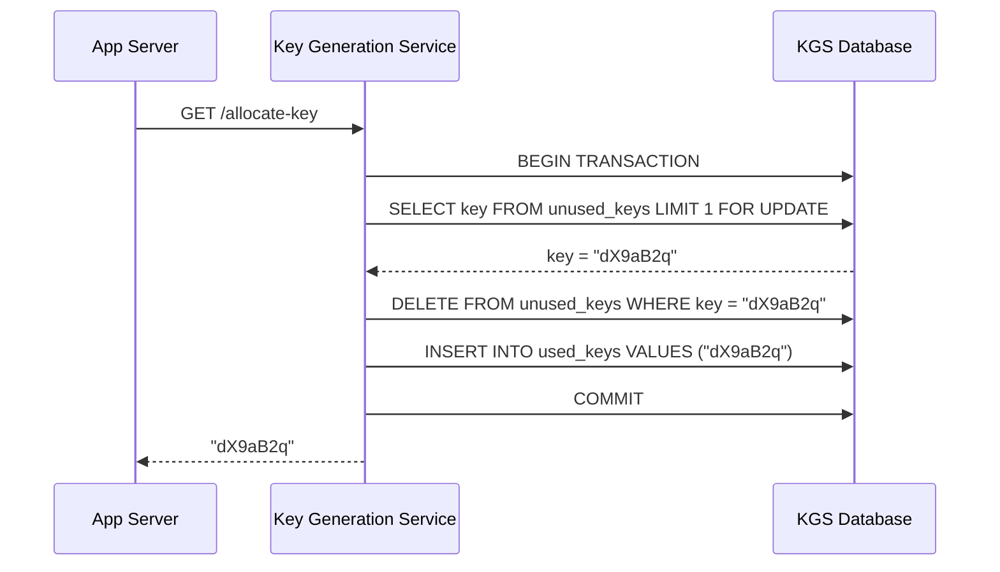

**KGS keeps a small in-memory pool** (e.g., 1,000 keys) to avoid a DB call per URL creation. If the KGS crashes, those in-memory keys are lost — but at 3.5 trillion total keys, losing 1,000 is acceptable.

**KGS is a potential SPOF** — run two instances in active-passive mode. The standby takes over within seconds via heartbeat monitoring.

### 4.3 Database Schema

#### Primary Mapping Table

```sql
CREATE TABLE url_mappings (
    short_code   CHAR(7)      PRIMARY KEY,
    long_url     TEXT         NOT NULL,
    created_at   TIMESTAMPTZ  NOT NULL DEFAULT NOW(),
    expires_at   TIMESTAMPTZ,
    owner_id     BIGINT,                          -- NULL for anonymous
    custom_alias BOOLEAN      NOT NULL DEFAULT FALSE,
    is_deleted   BOOLEAN      NOT NULL DEFAULT FALSE,
    click_count  BIGINT       NOT NULL DEFAULT 0   -- denormalized for fast reads
);

CREATE INDEX idx_url_mappings_owner ON url_mappings(owner_id);
CREATE INDEX idx_url_mappings_expires ON url_mappings(expires_at)
    WHERE expires_at IS NOT NULL AND is_deleted = FALSE;
```

#### Key-Value vs Relational — Comparison

| Dimension | Key-Value (Cassandra / DynamoDB) | Relational (PostgreSQL) |
|-----------|----------------------------------|------------------------|
| Read pattern | Perfect — single key lookup | Excellent — PK lookup |
| Write pattern | High write throughput, eventual | ACID, lower throughput |
| Analytics queries | Difficult — no aggregation | Easy with SQL |
| Custom alias uniqueness | Application-enforced | DB-enforced (UNIQUE) |
| Schema evolution | Flexible | Migration required |
| Operational simplicity | More complex ops | Well-understood tooling |

**Recommendation:** Start with PostgreSQL. The read pattern (PK lookup) is equally fast in both. Move to Cassandra only if write throughput exceeds 50K/s — which requires 4× our projected peak.

### 4.4 Read Path — Redirect Flow

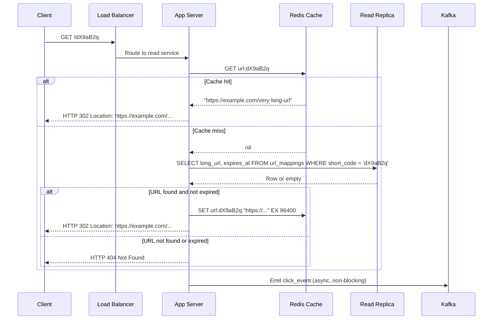

#### 301 vs 302 Redirect — Business Decision

| Redirect | Meaning | Browser Behavior | Analytics Impact |
|----------|---------|-----------------|-----------------|
| **301 Permanent** | URL has moved permanently | Browser caches, skips shortener on repeat visits | Clicks not counted after first visit |
| **302 Temporary** | URL may change | Browser always asks shortener | Every click tracked |

Use **302** for analytics. Use **301** to reduce server load when analytics are not needed.

### 4.5 Write Path — URL Creation Flow

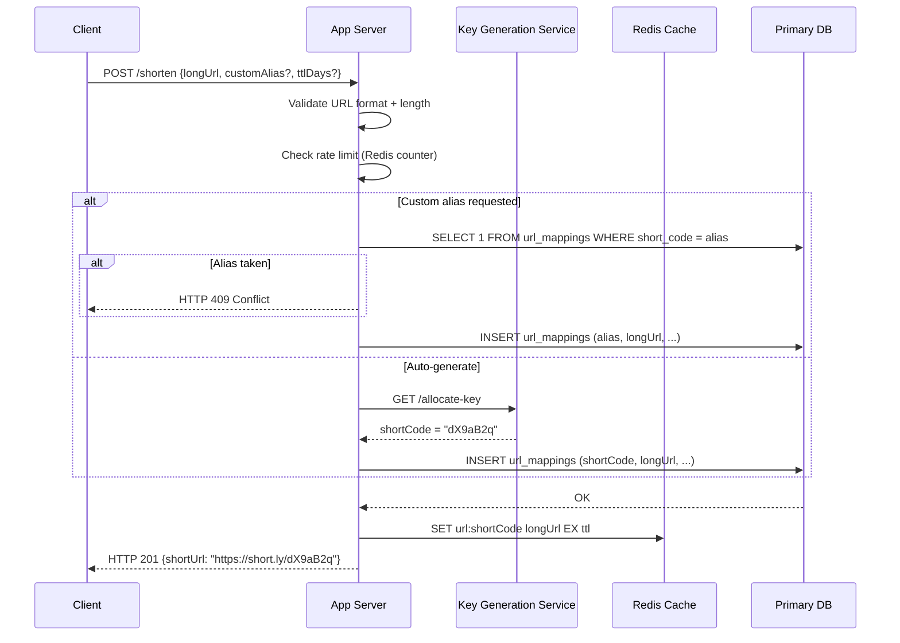

### 4.6 Caching Layer

The cache is the entire read path performance story. Key design decisions:

**Cache key:** `url:{shortCode}` → stores the long URL string

**Eviction policy:** LRU (Least Recently Used) — viral links stay hot; old links expire naturally. For more detail see [Chapter 7 — Caching](/system-design/part-2-building-blocks/ch07-caching).

**TTL on cache entries:** Set to URL's `expires_at` minus now, or 24 hours, whichever is smaller. This ensures expired URLs do not get served from cache.

**Cache stampede prevention:** When a viral link goes from zero to millions of requests in seconds, all requests may miss cache simultaneously and hammer the DB. Solutions:

1. **Mutex lock** — first thread fetches from DB and populates cache; others wait
2. **Probabilistic early expiry** — refresh cache before TTL expires using `random() < β * (now - fetch_time) / ttl`
3. **Redis `SETNX`** — atomic "set if not exists" to implement distributed lock

---

## Step 5 — Deep Dives

### 5.1 Distributed Key Generation — Consistent Hashing Approach

As the system scales to multiple app server regions, we need globally unique keys without a single KGS becoming a bottleneck. Two strategies:

**Strategy A: Partitioned ID ranges**
- KGS assigns each app server a range: Server A gets IDs 1–1M, Server B gets 1M–2M
- No coordination needed within a range
- Risk: range exhaustion is hard to predict

**Strategy B: Consistent hashing on key space**
- Divide the base62 keyspace into virtual nodes using consistent hashing
- Each app server "owns" a portion of the keyspace
- Node joins/leaves remap only a fraction of keys

Consistent hashing is covered in detail in [Chapter 6 — Load Balancing](/system-design/part-2-building-blocks/ch06-load-balancing). The same ring concept applies: instead of distributing HTTP requests, we distribute ID generation responsibility.

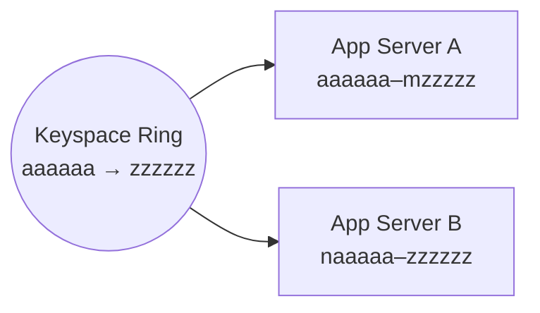

### 5.2 URL Expiration & Cleanup

URLs have optional TTL. Handling expiration requires two components:

**At read time:** Check `expires_at < NOW()` before serving. Return 410 Gone (not 404 — 410 means "intentionally removed").

**Background cleanup job (Cron):**

```
Schedule: daily at 2 AM UTC (low-traffic window)
Query: SELECT short_code FROM url_mappings
       WHERE expires_at < NOW() AND is_deleted = FALSE
       LIMIT 10000
Action: Soft-delete (set is_deleted = TRUE)
        Evict from Redis cache
        Archive to cold storage if analytics required
Repeat: Until no more expired rows
```

**Why soft delete?** Analytics data references `short_code`. Hard deleting breaks foreign key integrity in the analytics DB. Soft deletes preserve the audit trail.

**Lazy cleanup vs proactive cleanup:** Both are needed. Lazy (check at read time) handles correctness. Proactive (cron job) reclaims storage and prevents stale data accumulation.

### 5.3 Analytics — Click Tracking

Analytics must not slow down redirects. The architecture is fully async:

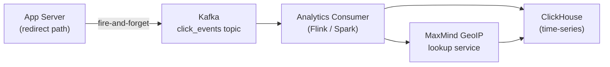

**Click event schema:**

```json
{
  "short_code": "dX9aB2q",
  "timestamp": "2026-03-12T00:40:00Z",
  "ip_hash": "sha256(ip + salt)",
  "user_agent": "Mozilla/5.0...",
  "referrer": "https://twitter.com",
  "country": "US",
  "device_type": "mobile"
}
```

**Privacy:** Never store raw IPs. Hash with a daily rotating salt for fraud detection without tracking individuals.

**Counters in primary DB:** The `click_count` column in `url_mappings` is updated by a periodic batch job (not per-click write) to avoid write amplification on the primary DB.

### 5.4 Rate Limiting — Abuse Prevention

Without rate limiting, malicious users can:
- Enumerate all short codes (sequential ID exposure)
- Create millions of spam URLs pointing to phishing sites
- Trigger cache stampedes via coordinated curl bombardment

Rate limiting implementation using Redis counters:

```
Per-IP write limit:    10 URL creations per minute
Per-IP read limit:     1,000 redirects per minute
Per-user write limit:  1,000 URL creations per day (authenticated)
```

See [Chapter 16 — Rate Limiting](/system-design/part-3-architecture-patterns/ch16-security-reliability) for token bucket vs sliding window implementations.

Additionally, run new long URLs through a **malicious URL detection service** (Google Safe Browsing API or internal ML classifier) before shortening. Reject URLs on known blocklists.

---

## Production Considerations

### Monitoring & Alerting

| Metric | Tool | Alert Threshold |
|--------|------|----------------|
| Redirect P99 latency | Prometheus + Grafana | > 100ms |
| Cache hit ratio | Redis INFO stats | < 85% |
| Write error rate | Application metrics | > 0.1% |
| KGS key pool depth | Custom gauge | < 10,000 remaining |
| DB replication lag | pg_stat_replication | > 5 seconds |
| Expired URL cleanup lag | Job metrics | > 24 hours behind |

**Dashboard structure:**
1. **Golden signals**: latency, traffic, errors, saturation
2. **Cache health**: hit ratio, eviction rate, memory usage
3. **Key generation**: pool depth, allocation rate, KGS error rate
4. **Analytics pipeline**: Kafka consumer lag, processing latency

### Failure Modes & Mitigations

| Failure | Impact | Mitigation |
|---------|--------|-----------|
| Primary DB down | Cannot create new URLs | Pre-generated key pool in KGS survives; writes queue in Kafka |
| Read replica down | Cache misses fall through to primary | Route cache-miss reads to primary temporarily; auto-heal via replica promotion |
| Redis cache down | All reads hit DB | DB read replicas absorb traffic; circuit breaker prevents cascade |
| KGS down | Cannot generate new keys | Passive standby KGS takes over; in-flight keys in app memory survive for minutes |
| Kafka consumer lag | Analytics delayed | Backfill from Kafka offset on consumer restart; no user-visible impact |
| Cache stampede on viral link | DB overloaded | Mutex lock + probabilistic refresh; CDN caching of 301 responses for anonymous traffic |

### Cost Model

```
Storage (273 TB over 5 years):
  AWS S3 at $0.023/GB = $6,279/month
  PostgreSQL RDS Multi-AZ (db.r6g.4xlarge) = ~$2,000/month

Compute (app servers):
  10× c6g.xlarge instances = ~$1,200/month

Cache:
  Redis ElastiCache (r6g.2xlarge) = ~$400/month

Analytics:
  ClickHouse on 3× r6g.4xlarge = ~$600/month

Total estimated: ~$10,500/month at 100M URLs/day scale
```

Cost optimization levers:
- CDN-cache permanent redirects (301) to eliminate app server involvement on repeat visits
- Tiered storage: move URLs older than 90 days to S3 Glacier (10× cheaper)
- Reserved instances: 40–60% discount for 1-year commitment

### Security Considerations

- **Malicious URL scanning:** Check against Google Safe Browsing, PhishTank before storing
- **Custom alias squatting:** Reserve brand names (`apple`, `google`, `login`) in a blocklist
- **Analytics privacy:** Hash IPs with rotating salt; comply with GDPR right-to-deletion
- **Authenticated endpoints:** URL deletion and analytics require owner authentication (JWT)
- **SSRF prevention:** Validate that long URLs are not internal service addresses (e.g., `169.254.x.x`, `10.x.x.x`)

---

## Architecture Diagram — Complete System

```mermaid
graph TB
    subgraph Clients
        B["Browser"]
        M["Mobile App"]
        API["API Consumer"]
    end

    subgraph Edge
        CDN["CDN\n(CloudFront)"]
        WAF["WAF + Rate Limiter"]
        LB["L7 Load Balancer\n(Nginx / ALB)"]
    end

    subgraph Application
        WS["Write Service\n(×3 replicas)"]
        RS["Read Service\n(×5 replicas)"]
        KGS["Key Generation\nService (active/passive)"]
    end

    subgraph Data
        Redis["Redis Cluster\n(LRU cache)"]
        PG[("PostgreSQL Primary")]
        PGR[("Read Replicas ×2")]
        Kafka["Kafka\n(click_events)"]
    end

    subgraph Analytics
        Consumer["Flink Consumer"]
        CH[("ClickHouse\nAnalytics DB")]
        Geo["GeoIP Service"]
    end

    subgraph Jobs
        Cron["Expiry Cleanup\nCron Job"]
        Bloom["Bloom Filter\nRefresh Job"]
    end

    B & M & API --> CDN
    CDN -->|cache miss| WAF
    WAF --> LB
    LB -->|POST /shorten| WS
    LB -->|GET /{code}| RS

    WS --> KGS
    WS --> PG
    WS --> Redis

    RS --> Redis
    RS -->|miss| PGR
    RS --> Kafka

    PG --> PGR
    Kafka --> Consumer
    Consumer --> Geo --> CH
    Consumer --> CH

    Cron --> PG
    Cron --> Redis
    Bloom --> PGR
```

---

## Key Takeaway

> **The URL shortener is not a trivial CRUD app — it is a study in read-heavy optimization, collision-proof ID generation, and analytics decoupling. Every interview answer that does not mention caching strategy, redirect semantics (301 vs 302), and key generation race conditions is incomplete. Every production deployment that does not monitor cache hit ratio and KGS key pool depth will fail at scale.**

---

## Unique ID Generation Strategies

The URL shortener's short code is a globally unique identifier. The strategy you choose for generating it affects throughput, collision probability, sortability, and operational complexity. Five production-proven strategies cover the design space.

### UUID v4

A **Universally Unique Identifier** (version 4) is a randomly generated 128-bit value expressed as 32 hex characters (`550e8400-e29b-41d4-a716-446655440000`). No coordination required — any server generates one independently.

- **128 bits** of randomness → collision probability is astronomically low (~1 in 10³⁸ per pair)
- **Not sortable** — random distribution means no time ordering
- **Long** — 36 characters as a string; even encoded as base62 yields 22 characters (too long for a 7-char short code without truncation, which reintroduces collision risk)
- **Use case:** unique object IDs in distributed systems where sortability is not needed

### Snowflake ID (Twitter / X)

Twitter's **Snowflake** generates 64-bit integers that are time-ordered and globally unique across datacenters and machines — with no coordination between machines at generation time.

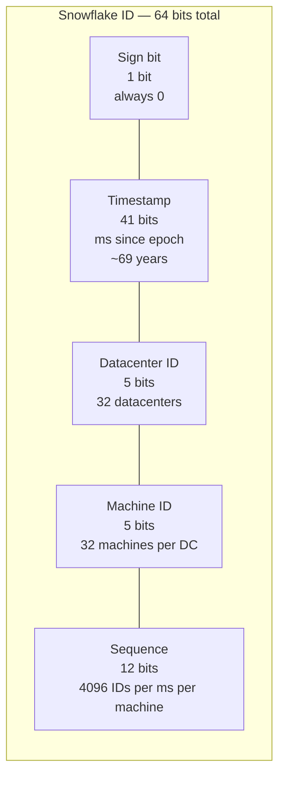

**Throughput:** `32 DCs × 32 machines × 4,096 seq/ms = 4,194,304 IDs/ms` — far exceeding any realistic URL shortener write rate.

**Sortable:** IDs increase monotonically with time. You can extract the creation timestamp from any ID without a DB lookup.

**No coordination:** Each machine is pre-assigned a datacenter ID + machine ID. Generation is pure arithmetic — no locks, no network calls.

**Used by:** Twitter, Instagram (variant), Discord, LinkedIn (variant).

### ULID — Universally Unique Lexicographically Sortable Identifier

**ULID** (`01ARZ3NDEKTSV4RRFFQ69G5FAV`) is a 128-bit ID with a 48-bit millisecond timestamp prefix and 80 bits of randomness. It is designed to be encoded in 26 base32 characters and to sort lexicographically in creation order.

- **Sortable** as a string — no special parsing required; standard string sort gives time order
- **Monotonic** within the same millisecond — the random component increments to guarantee ordering
- **No coordination** — random component eliminates machine ID requirement
- **URL-safe** — base32 encoding uses only uppercase letters and digits
- **Use case:** event IDs, log entries, database primary keys where string-sort == time-sort

### Database Auto-Increment

The database assigns IDs sequentially: 1, 2, 3, … The application converts the integer to base62 for the short code.

- **Simple** — zero infrastructure beyond the primary DB
- **No collision** — DB enforces uniqueness atomically
- **Sequential** — IDs (and short codes) are predictable; an attacker can enumerate all URLs by trying `aaaaaa1`, `aaaaaa2`, etc.
- **Single point of failure** — the DB is the only ID source; it becomes a write bottleneck at high throughput
- **Mitigation:** XOR the integer with a secret constant before base62 encoding to obfuscate sequential patterns

### Database Ticket Server (Flickr Pattern)

Flickr's approach: a dedicated MySQL database whose sole purpose is to generate globally unique auto-increment IDs via `REPLACE INTO Tickets64 (stub) VALUES ('a')`.

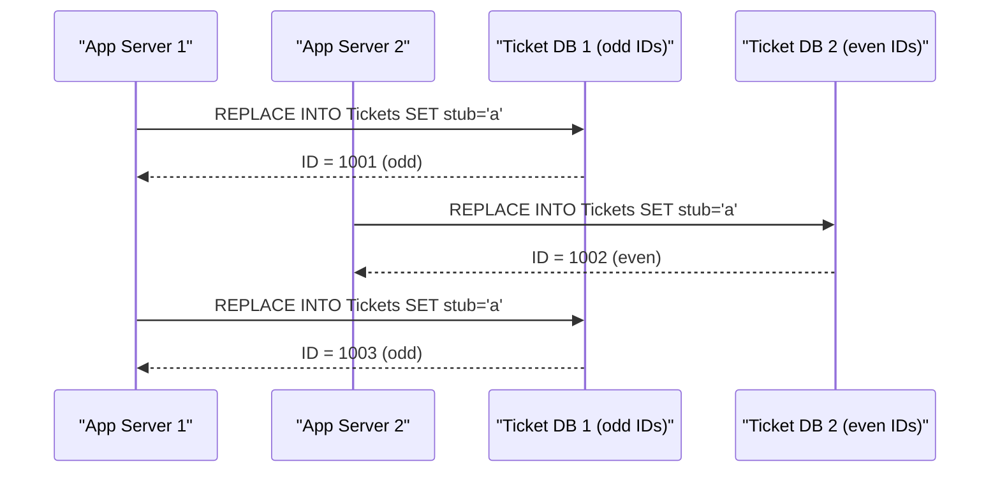

Two ticket DBs with alternating auto-increment offsets (`auto_increment_increment=2`, `auto_increment_offset=1` for DB1, `offset=2` for DB2) eliminate the SPOF. Each DB generates only odd or only even IDs — globally unique, never colliding.

- **Centralized coordination** with high availability
- **Sequential** (same enumeration risk as auto-increment)
- **Simple operational model** — just MySQL
- **Used by:** Flickr, early Pinterest

### Comparison Table

| Strategy | Sortable | Size | Coordination Needed | Collision Risk | Throughput | Best For |
|---|---|---|---|---|---|---|
| **UUID v4** | No | 128-bit / 22 chars base62 | None | Negligible | Unlimited | Distributed object IDs |
| **Snowflake** | Yes (time-ordered) | 64-bit / 11 chars base62 | Machine ID assignment | None | 4M+/ms | High-throughput, sortable IDs |
| **ULID** | Yes (lex sort) | 128-bit / 26 chars base32 | None | Negligible | Unlimited | Sortable string IDs |
| **Auto-increment** | Yes (sequential) | 64-bit / 11 chars base62 | DB lock | None | DB write limit | Simple, low-scale systems |
| **Ticket Server** | Yes (sequential) | 64-bit | Ticket DB (HA pair) | None | ~10K/s per DB | Medium-scale, avoid SPOF |

---

## Choosing an ID Strategy

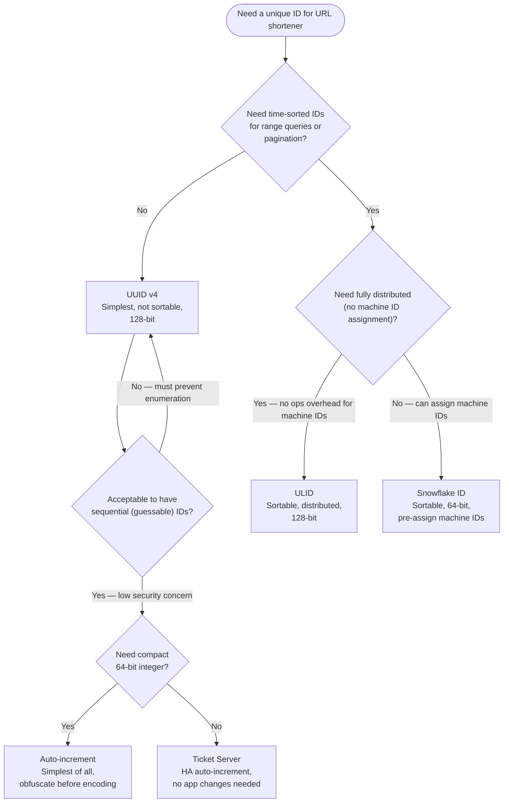

### Real-World Adoption

| Company | Strategy | Notes |
|---|---|---|
| **Twitter / X** | Snowflake | Original inventors; open-sourced the design |
| **Instagram** | Snowflake variant | Postgres-generated, 64-bit, shard-aware |
| **Discord** | Snowflake | Uses epoch of 2015-01-01 instead of Twitter epoch |
| **Flickr** | Ticket Server | Two MySQL DBs, alternating odd/even IDs |
| **Stripe** | Random prefix + UUID | `ch_` prefix for charges, `cus_` for customers |
| **MongoDB** | ObjectID | 12-byte: timestamp(4) + machineID(3) + pid(2) + seq(3) |

**For a URL shortener at interview scale (100M URLs/day = 1,200 writes/s):** Snowflake is the correct answer. It eliminates collision risk, is sortable for analytics, needs no coordination at generation time (only at machine ID assignment), and compresses to an 11-character base62 string — shorter than the 7-character short code requirement, meaning you use only the lower bits for the short code namespace.

**Cross-reference:** The KGS approach in Section 4.2 is effectively a ticket server variant. For distributed ID generation without a centralized key store, replace KGS with a Snowflake implementation on each app server. See [Chapter 15 — Distributed Coordination](/system-design/part-3-architecture-patterns/ch15-data-replication-consistency) for leader election and coordination patterns.

---

## Practice Questions

1. **ID Generation:** You have 10 app servers generating short codes using MD5 truncation. Two servers simultaneously hash different long URLs that produce the same 7-character prefix. Walk through exactly how your system detects and resolves this collision without serving the wrong redirect.

2. **Cache Stampede:** A tweet from a 100M-follower account contains your short URL. Within 30 seconds, 500,000 requests hit your system. The URL was not previously cached. Describe exactly what happens to your Redis cache and PostgreSQL DB, and how your system survives.

3. **301 vs 302 Trade-off:** Your product manager asks you to switch all redirects from 302 to 301 to reduce server costs. What are the analytics implications? Under what conditions is this acceptable? How would you implement a per-URL setting for redirect type?

4. **Expiration at Scale:** You have 50 billion stored URLs and need to expire 1 billion of them tonight (a policy change). Your background job normally deletes 10,000 rows/minute. How do you accomplish this without impacting redirect latency or triggering DB lock contention?

5. **Pastebin Extension:** Extend the URL shortener design to support Pastebin (storing text blobs up to 10 MB). What changes in the data model, read path, write path, and caching strategy? How does content-addressable storage (deduplication by content hash) change the key generation approach?
