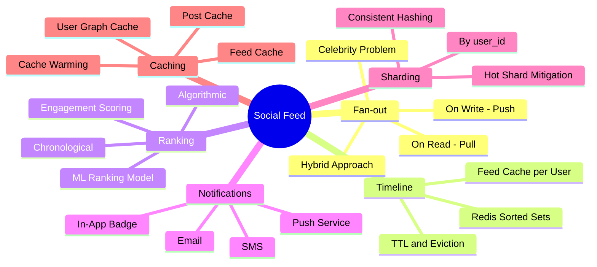
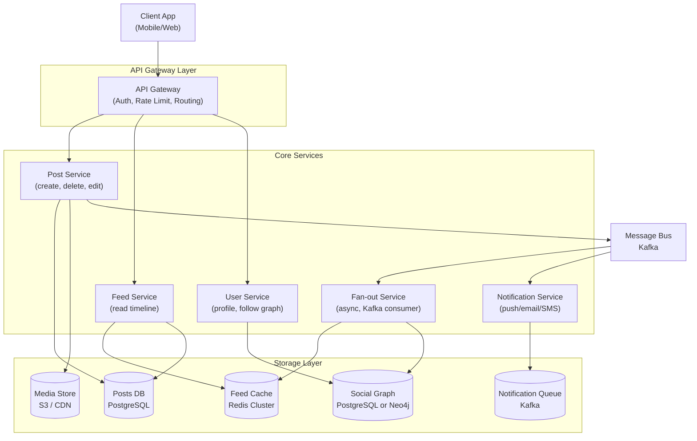
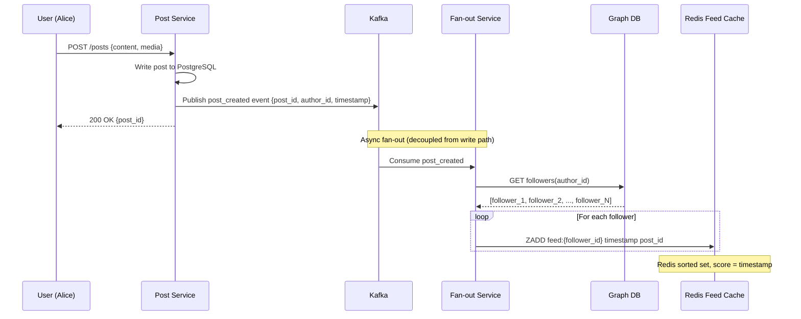
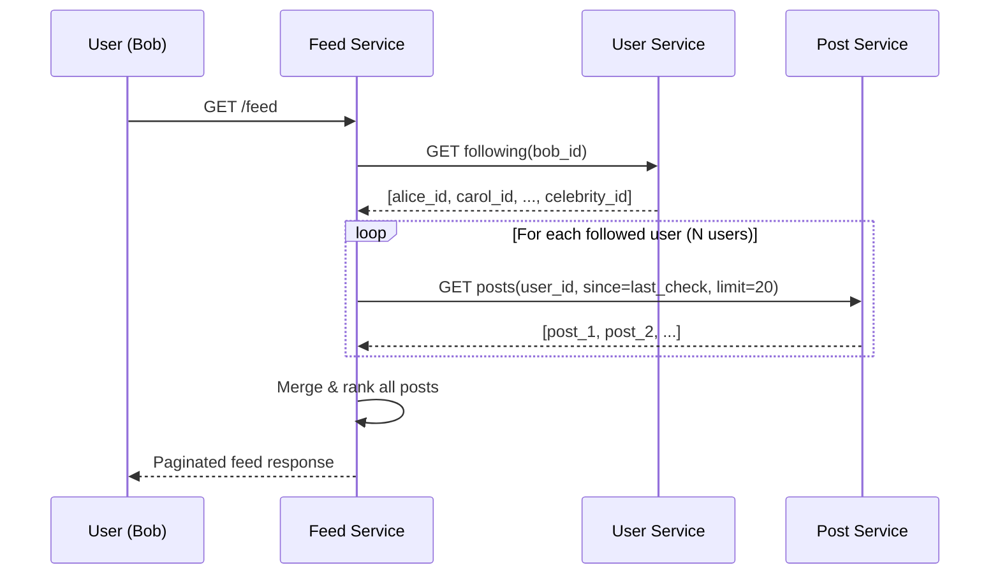
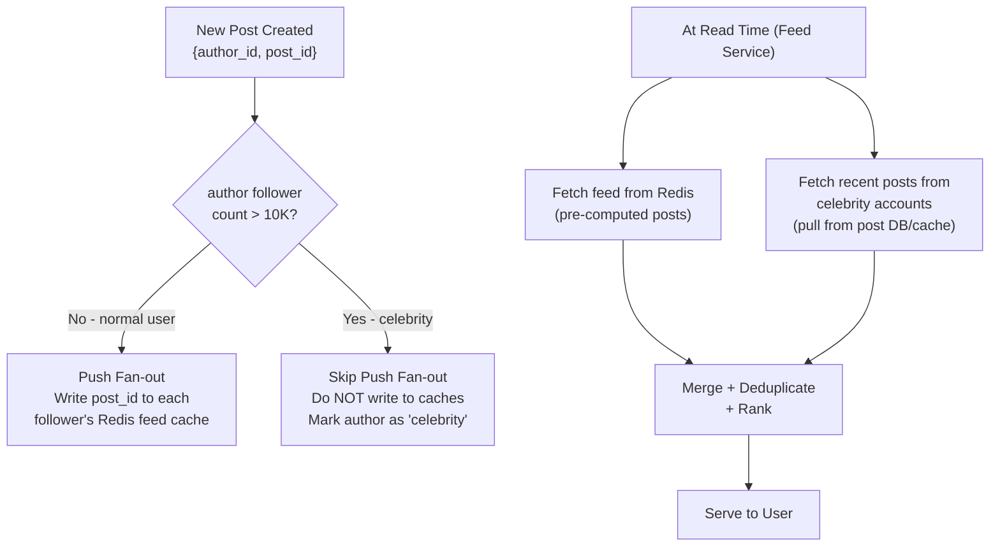
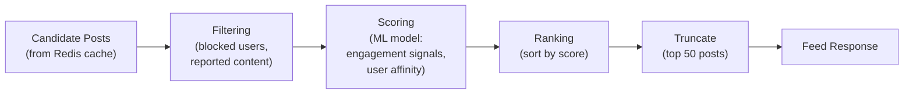
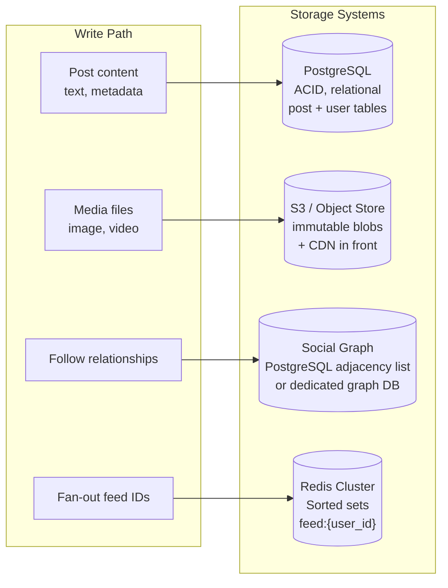
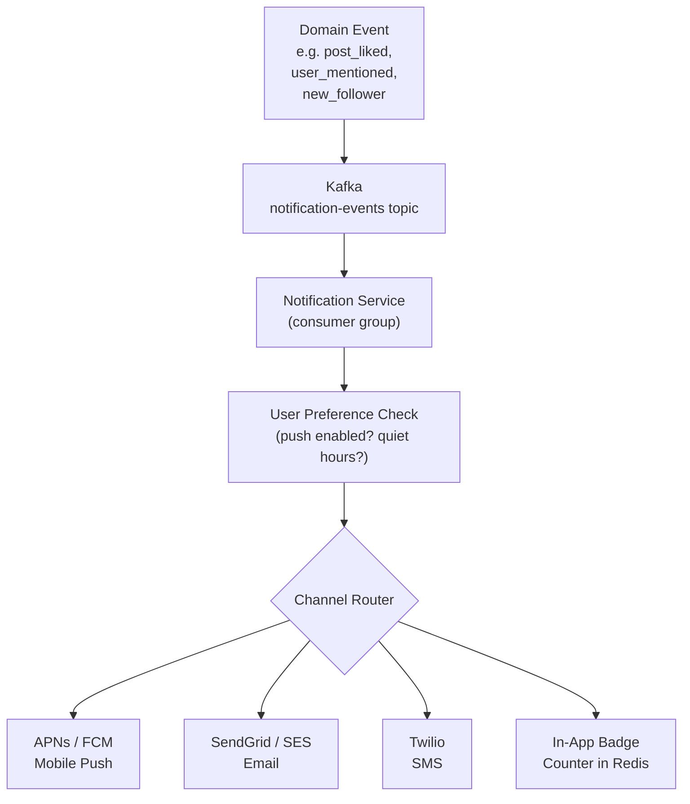

# Chapter 19: Social Media Feed


> The news feed is the heartbeat of every social platform. Design it wrong and you either melt your database on every celebrity tweet or make users wait seconds for stale content. Design it right and 500 million people see a fresh, ranked timeline in under 200ms.

---

## Mind Map



---

## Overview

The social media feed — Twitter's timeline, Instagram's home feed, Facebook's news feed — is arguably the #2 most common system design interview question (behind URL shortener). It combines read-heavy access patterns, complex fan-out mechanics, ranking algorithms, and real-time notification delivery at massive scale.

**What makes it hard:**
- The "celebrity problem": a post from a user with 50M followers must fan-out to 50M caches in milliseconds
- Feed reads must complete in <200ms globally despite fetching, merging, and ranking dozens of posts
- Delete and edit propagation must retroactively update precomputed caches
- Social graphs grow unboundedly — following relationships cannot live in one database

**Real-world examples:** Twitter (now X), Instagram, Facebook, TikTok, LinkedIn all face these exact tradeoffs. Twitter open-sourced their fan-out architecture. Instagram's early feed was pure pull; they moved to hybrid after scale issues.

**Cross-references:**
- Capacity estimation methodology → [Chapter 4](/system-design/part-1-fundamentals/ch04-estimation)
- Redis caching patterns → [Chapter 7](/system-design/part-2-building-blocks/ch07-caching)
- SQL post storage → [Chapter 9](/system-design/part-2-building-blocks/ch09-databases-sql)
- Graph/NoSQL for social graph → [Chapter 10](/system-design/part-2-building-blocks/ch10-databases-nosql)
- Kafka async fan-out pipeline → [Chapter 11](/system-design/part-2-building-blocks/ch11-message-queues)

---

## Step 1: Requirements & Constraints

### Functional Requirements

| # | Requirement | Notes |
|---|-------------|-------|
| F1 | Create a post (text, images, videos) | Up to 280 chars text + optional media |
| F2 | Follow / unfollow users | Asymmetric (Twitter-style) |
| F3 | News feed timeline — see posts from followed users | Sorted by relevance or recency |
| F4 | Like, repost, comment on posts | Engagement signals for ranking |
| F5 | Real-time push notifications for mentions, likes, new posts | Push + in-app |
| F6 | Search posts and users | Out of scope for this chapter |

### Non-Functional Requirements

| Attribute | Target | Rationale |
|-----------|--------|-----------|
| Scale | 500M DAU, 1B posts/day | Twitter-tier |
| Feed load latency | < 200ms P99 | UX expectation |
| Post write latency | < 500ms | Perceived immediacy |
| Availability | 99.99% | Core product feature |
| Consistency | Eventual OK | Feed staleness < 5s acceptable |
| Fan-out followers | Avg 200, max 100M+ (celebrities) | Drives hybrid design |

### Out of Scope

- Video transcoding pipeline (see Chapter 21)
- Full-text search indexing
- Ads insertion and auction system
- Content moderation ML pipeline (mentioned in production section)

---

## Step 2: Capacity Estimation

> Full methodology in [Chapter 4](/system-design/part-1-fundamentals/ch04-estimation). These are back-of-envelope figures.

### QPS Estimates

```
DAU = 500M users

Feed reads:
  500M users × 10 feed views/day = 5B reads/day
  5B ÷ 86,400s = ~58,000 reads/s (58K RPS)
  Peak (2× avg) = ~116K RPS

Post writes:
  1B posts/day ÷ 86,400s = ~11,600 writes/s
  Peak = ~25K WPS

Fan-out writes (push model):
  11,600 posts/s × 200 avg followers = ~2.3M feed writes/s
  (This is why naive push fan-out is dangerous)
```

### Storage Estimates

```
Post storage (SQL):
  1B posts/day × 1KB avg = 1 TB/day
  1 year = ~365 TB of post data

Media storage (object storage):
  ~10% of posts contain images (100M images/day)
  avg image 200KB → 20 TB/day in S3
  avg video 5MB, 1% of posts → 50 TB/day in S3

Feed cache (Redis):
  Per user: 20 post IDs × 8 bytes = 160 bytes
  500M users × 160 bytes = 80 GB
  In practice store 200 post IDs → 800 GB
  (Fits in a Redis cluster — well within budget)

Social graph:
  500M users × 200 avg follows × 8 bytes = 800 GB
  Use sharded adjacency list or graph DB
```

### Fanout Factor

```
Normal user: avg 200 followers → 200 cache writes per post
Power user:  10K followers → 10K cache writes
Celebrity:   50M followers → 50M cache writes (AVOID push model)

At 11.6K posts/s with avg 200 followers:
  Fan-out write rate = 2.3M cache writes/s — manageable with Redis pipeline
```

---

## Step 3: High-Level Design



**Data flow summary:**
1. User creates post → Post Service writes to PostgreSQL + publishes event to Kafka
2. Fan-out Service consumes event → reads follower list from Graph DB → writes post ID to each follower's feed cache in Redis
3. Feed Service serves reads → fetches post IDs from Redis → hydrates with post content from PostgreSQL or post cache
4. Notification Service consumes event → sends push notifications to mentioned/following users

---

## Step 4: Detailed Design

### 4.1 Fan-out on Write (Push Model)

When a user posts, precompute and push the post ID into every follower's feed cache.



**Pros:**
- Feed reads are O(1) — just read from Redis sorted set
- No computation at read time
- P99 feed latency easily <50ms

**Cons:**
- Writes amplified by follower count (celebrity problem)
- Wasted work if follower never opens the app
- Deletes/edits require retroactive cache invalidation across N caches

**Celebrity problem:** A post from an account with 50M followers requires 50M Redis `ZADD` operations. At ~100μs per Redis write, that's 5,000 seconds serially — impossible.

---

### 4.2 Fan-out on Read (Pull Model)

When a user opens their feed, dynamically pull recent posts from every followed user, merge, and rank.



**Pros:**
- No fan-out writes — post write is lightweight
- Celebrities treated same as normal users
- No wasted computation for inactive users

**Cons:**
- N database reads per feed request (N = number of followings)
- Feed load latency scales with follow count — users following 2000 accounts see slow feeds
- Thundering herd: same celebrity's posts fetched independently by every follower

---

### 4.3 Hybrid Approach (Production Choice)

Push for normal users, pull for celebrities. Define "celebrity" as users with >10K followers.



**How it works at read time:**
1. Read pre-computed feed from Redis (normal users' posts already fanned-out)
2. Identify celebrities the user follows (from a small celebrity set in a separate cache)
3. Fetch recent posts from those celebrities directly from post cache
4. Merge all posts, deduplicate by post_id, apply ranking, paginate

---

### 4.4 Comparison Table

| Dimension | Push (Fan-out on Write) | Pull (Fan-out on Read) | Hybrid |
|-----------|------------------------|----------------------|--------|
| Feed read latency | Very low (cache hit) | High (N DB reads) | Low |
| Write amplification | High (follower count) | None | Low-medium |
| Celebrity problem | Severe | None | Handled separately |
| Storage cost | High (Redis per user) | Low | Medium |
| Complexity | Medium | Low | High |
| Inactive user waste | Yes | No | Minimal |
| Delete/edit propagation | Hard (N caches) | Easy (source of truth) | Medium |
| **Production use** | Normal users | Never alone at scale | **Twitter, Instagram** |

---

### 4.5 Feed Ranking

#### Chronological (Simple)

Sort by `post.created_at DESC`. Predictable, transparent, zero ML complexity. Suitable for MVP and interview answers.

#### Algorithmic (Production)

Score each candidate post by an engagement model:

```
score(post) = w1 × recency_score
            + w2 × like_rate
            + w3 × comment_rate
            + w4 × repost_rate
            + w5 × user_affinity(viewer, author)
            + w6 × content_type_boost   # video > image > text
```

**Practical implementation:**
- Pre-rank in fan-out service at write time (store score as Redis sorted set score instead of timestamp)
- Re-rank at read time using a lightweight ML model (ONNX runtime, <5ms latency budget)
- A/B test ranking models per user cohort

**Feed ranking pipeline:**



---

### 4.6 Database Choices



**Why these choices:**

| Store | Technology | Reason |
|-------|-----------|--------|
| Posts | PostgreSQL | ACID writes, complex queries, familiar ops tooling. See [Ch 9](/system-design/part-2-building-blocks/ch09-databases-sql) |
| Media | S3 + CloudFront | Immutable blob, CDN offloads bandwidth |
| Social graph | PostgreSQL (adjacency list at <1B edges) or Neo4j | For most companies, a `follows(follower_id, followee_id)` table suffices. See [Ch 10](/system-design/part-2-building-blocks/ch10-databases-nosql) |
| Feed timeline | Redis sorted sets | `ZADD feed:{uid} score post_id`, `ZREVRANGE` for reads. O(log N) insert, O(M) reads |
| Post cache | Redis string / Memcached | Avoid repeat PostgreSQL hits for hydration |

**Redis sorted set feed schema:**

```
Key:   feed:{user_id}
Score: unix timestamp (or ranking score)
Value: post_id

ZADD feed:user123 1710000000 post456
ZREVRANGE feed:user123 0 49   → top 50 posts by recency
```

---

### 4.7 Notification System



**Key design decisions:**
- Notifications are fire-and-forget — lose one notification, do not crash the feed
- User preferences stored in Redis (O(1) read per notification)
- Deduplication: if Alice likes 5 of Bob's posts in 10 minutes, batch into "Alice liked 5 of your posts" — use a time-windowed aggregation buffer in the notification service
- Rate limiting: max 10 push notifications per user per hour to prevent spam

---

## Step 5: Deep Dives

### 5.1 Sharding User Data

Posts table and feed cache must be sharded as they grow beyond single-node limits.

**Sharding strategy: by `user_id` using consistent hashing**

```
shard = hash(user_id) % num_shards

For PostgreSQL:
  users 0-999K   → shard 0 (postgres-0)
  users 1M-1.99M → shard 1 (postgres-1)
  ...

For Redis feed cache:
  Redis Cluster handles this automatically via hash slots
  Key: feed:{user_id} → hash slot from user_id portion
```

**Hotspot mitigation:**
- Celebrity users on their own shard (manual override)
- Read replicas absorb read traffic for popular shards
- Post cache in front of PostgreSQL eliminates most direct DB reads

**Cross-shard feed reads:**
- Feed Service reads fan-out cache from Redis (single shard per user)
- Post hydration may span shards — use async parallel fetches, join in application layer

---

### 5.2 Feed Generation Pipeline (Kafka-based)

> Full Kafka patterns in [Chapter 11](/system-design/part-2-building-blocks/ch11-message-queues).

```mermaid
sequenceDiagram
    participant PS as Post Service
    participant K as Kafka (post_created)
    participant FOS as Fan-out Workers (×10)
    participant GDB as Graph DB Read Replica
    participant RC as Redis Cluster

    PS->>K: Publish {post_id, author_id, timestamp, score}
    Note over K: Partitioned by author_id for ordering

    par Fan-out Worker Pool
        K->>FOS: Worker 1 picks up message
        FOS->>GDB: GET followers(author_id) LIMIT 5000 OFFSET 0
        FOS->>RC: PIPELINE: ZADD feed:{f1} score post_id; ZADD feed:{f2} ...
        Note over FOS: Batch Redis writes — 1000 ZADD per pipeline call
    and
        K->>FOS: Worker 2 (next batch of followers)
        FOS->>GDB: GET followers(author_id) LIMIT 5000 OFFSET 5000
        FOS->>RC: PIPELINE: ZADD ...
    end
    Note over RC: Fan-out complete in <5s for 1M follower account
```

**Kafka partition key:** `author_id` ensures all events for one author go to the same partition, maintaining ordering. Fan-out workers use consumer groups — multiple workers share the partition load.

**Back-pressure handling:**
- If fan-out lag grows (Kafka consumer lag metric), spin up additional fan-out worker replicas
- Prioritize active users (last login < 24h) — skip feed writes for dormant accounts

---

### 5.3 Cache Warming for Popular Users

New deployment or Redis node failure means cold caches. Strategy:

1. **Warm on first read:** Feed Service detects cache miss → triggers async warm job → returns slightly slower first response → subsequent reads are fast
2. **Pre-warm on login:** When user authenticates, enqueue a background warm job
3. **Celebrity post burst:** When a verified celebrity posts, fan-out service pre-warms top 1% most-active followers synchronously before async bulk fan-out completes

---

### 5.4 Handling Deletes and Edits

Post deletions are hard with fan-out because the post_id lives in potentially millions of caches.

**Delete strategy:**
1. Soft-delete the post in PostgreSQL (`deleted_at = now()`)
2. Publish `post_deleted` event to Kafka
3. Fan-out service consumes event → `ZREM feed:{follower_id} post_id` for each follower's cache
4. Feed Service also checks soft-delete flag during post hydration — belt-and-suspenders

**Edit strategy:**
1. Update post in PostgreSQL (keep edit history in `post_edits` table)
2. Invalidate post from post cache: `DEL post:{post_id}`
3. No need to touch feed caches — they store post IDs, not content
4. Next hydration fetch will get updated content from PostgreSQL

**Key insight:** Store only post IDs in feed caches (not serialized post content). This makes edits trivial — the content is fetched fresh from the post cache/DB on every feed load.

---

## Production Considerations

### Monitoring

| Metric | Alert Threshold | What It Indicates |
|--------|----------------|-------------------|
| Feed read P99 latency | > 200ms | Redis cache miss rate high, or post hydration slow |
| Fan-out consumer lag (Kafka) | > 30s | Fan-out workers overwhelmed, need scaling |
| Redis memory utilization | > 70% | Feed cache eviction starting, extend TTL strategy |
| Cache hit ratio (feed) | < 90% | Cold cache problem, warm-on-login needed |
| Post write error rate | > 0.1% | PostgreSQL issues |
| Notification delivery rate | < 99% | APNs/FCM integration issues |

### Failure Modes

**Fan-out service down:**
- Kafka accumulates messages (no data loss — see [Ch 11](/system-design/part-2-building-blocks/ch11-message-queues))
- Users see stale feeds until service recovers
- Feed Service falls back to pull model for all users temporarily
- Recovery: service restarts, processes Kafka backlog, caches repopulate

**Redis cluster node failure:**
- Redis Cluster automatic failover (<30s with replica promotion)
- Affected users' feeds are cold — Feed Service falls back to pull from PostgreSQL
- Cache warms on next read
- Impact: elevated latency for <0.01% of users for ~30 seconds

**Database (PostgreSQL) overload:**
- Read replicas absorb 95%+ of traffic (post hydration reads)
- Circuit breaker in Feed Service: if DB latency >500ms, serve cached-only feed with stale data
- Write path (post creation) has separate connection pool — isolated from read failures

### Cost Analysis

**Redis memory at scale:**
- 500M users × 200 post IDs × 8 bytes = 800 GB
- Redis cluster: ~8× r7g.2xlarge nodes at ~$0.60/hr each = ~$4,300/month
- Trade-off: saves ~58K QPS of PostgreSQL reads

**Kafka throughput:**
- 2.3M fan-out writes/s → ~3 Kafka partitions per topic sufficient for fan-out events
- Cost: ~$500/month on managed Confluent Cloud at this scale

**Total rough infra cost estimate (Twitter-tier):**
- Redis: ~$50K/month
- PostgreSQL (sharded, replicated): ~$100K/month
- S3 + CDN: ~$200K/month (media-heavy)
- Kafka: ~$10K/month
- Compute (services): ~$80K/month
- **Total: ~$440K/month** — consistent with public estimates for mid-size social platforms

### Content Moderation Pipeline

Production social feeds require async content moderation before posts become visible:

```
Post created → [async] → Image/Text ML classifier → {SAFE | REVIEW | BLOCK}
                                                        ↓         ↓        ↓
                                                   Fan-out   Human queue  Delete
```

- Safe posts: immediate fan-out (optimistic)
- Flagged posts: held from fan-out, routed to human review queue
- Blocked posts: soft-deleted before any fan-out occurs
- False positive recovery: if human reviewer clears a held post, trigger delayed fan-out

---

## Key Takeaway

> The social media feed is a study in making trade-offs explicit. Push fan-out gives fast reads but creates the celebrity problem. Pull fan-out eliminates write amplification but makes reads expensive. The hybrid approach — push for normal users, pull for celebrities at read time — is what every major platform settled on. Redis sorted sets are the canonical tool for per-user feed caches. Kafka decouples the fan-out pipeline from the write path, enabling horizontal scaling without blocking the user. And storing post IDs (not content) in feed caches keeps deletes and edits manageable.

---

## Practice Questions

1. **Celebrity threshold:** At what follower count does the hybrid model switch from push to pull? How would you measure the right threshold for your workload?

2. **Feed consistency:** A user follows 500 people. The system uses push fan-out. The user opens their app — what's the worst-case feed staleness and why?

3. **Delete propagation:** You have 500M users and a post from a user with 10K followers is reported and removed. Walk through every system that needs to be updated and in what order.

4. **Redis failure:** Your Redis feed cache cluster loses 20% of its nodes in a network partition. What happens to feed reads? Describe your fallback strategy step by step.

5. **Ranking signals:** Design a feed ranking system that incorporates user affinity (how often Alice engages with Bob's posts). Where do you store affinity scores, how do you update them, and how do you incorporate them into the ranking pipeline without blowing your 200ms latency budget?

---

*Next: [Chapter 20 — Chat & Messaging System](/system-design/part-4-case-studies/ch20-chat-messaging-system)*
