# Chapter 20: Chat & Messaging System


> Real-time messaging is deceptively simple on the surface — two people exchange text. Under the hood it demands persistent bidirectional connections, sub-100ms delivery, guaranteed ordering, and presence tracking for 500 million simultaneous users. Get the connection model wrong and your infrastructure collapses under idle TCP keep-alives. Get message delivery wrong and users lose trust in your product permanently.

---

## Mind Map

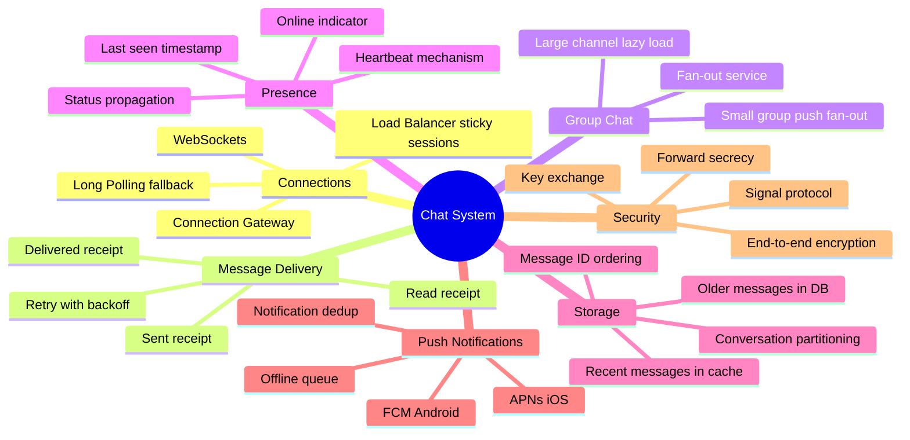

---

## Overview

WhatsApp delivers over 100 billion messages per day. Slack serves 32 million daily active users with sub-second delivery. Discord supports 500,000 concurrent users in a single voice + text channel. These systems share a core architecture challenge: HTTP request-response is fundamentally wrong for real-time messaging — you cannot have the server push to a client over a stateless HTTP connection.

**What makes it hard:**
- Persistent connections at scale: 500M DAU × ~1 open connection each = 500M concurrent TCP connections
- Message ordering: messages sent milliseconds apart must arrive in the correct sequence
- Delivery guarantees: users must know whether their message was received, even if the recipient is offline
- Group chat fan-out: a message to a 500-person channel triggers 499 delivery operations
- Online presence: showing whether someone is online without hammering the server with status polls

**Real-world examples:**
- WhatsApp (Meta): Erlang-based, Ejabberd XMPP core, ~100B messages/day on surprisingly few servers
- Slack: Initially PHP monolith, evolved to microservices, uses Kafka for message fan-out
- Discord: Elixir for real-time presence, Cassandra for message storage, ScyllaDB migration
- iMessage: Apple's server-side infrastructure with end-to-end encryption by default

**Cross-references:**
- WebSocket protocol details → [Chapter 12](/system-design/part-2-building-blocks/ch12-communication-protocols)
- Redis caching patterns → [Chapter 7](/system-design/part-2-building-blocks/ch07-caching)
- Cassandra/NoSQL for message storage → [Chapter 10](/system-design/part-2-building-blocks/ch10-databases-nosql)
- Kafka async fan-out → [Chapter 11](/system-design/part-2-building-blocks/ch11-message-queues)
- Capacity estimation methodology → [Chapter 4](/system-design/part-1-fundamentals/ch04-estimation)

---

## Step 1: Requirements & Constraints

### Functional Requirements

| # | Requirement | Notes |
|---|-------------|-------|
| F1 | One-to-one messaging | Text, images, files, voice notes |
| F2 | Group chat (up to 500 members) | Create group, add/remove members, send messages |
| F3 | Message delivery receipts | Sent (✓), delivered (✓✓), read (✓✓ blue) |
| F4 | Online presence indicator | Show if user is online or last seen time |
| F5 | Message history and search | Retrieve past messages, paginated |
| F6 | Push notifications for offline users | APNs (iOS) + FCM (Android) |
| F7 | Media sharing | Images, videos, documents |

### Non-Functional Requirements

| Attribute | Target | Rationale |
|-----------|--------|-----------|
| Scale | 500M DAU | WhatsApp-tier |
| Message delivery latency | < 100ms P99 | Perceived real-time |
| Availability | 99.99% | Core product — downtime = user churn |
| Consistency | Strong within conversation | Messages must not arrive out of order |
| Concurrent connections | ~500M persistent WebSockets | 1 per active user |
| Group size | Up to 500 members | Large channels handled differently |
| Message retention | 7 years (regulatory) | Financial/legal requirements |

### Out of Scope

- Voice and video calls (WebRTC-based, separate system)
- Message search full-text indexing (Elasticsearch pipeline)
- Content moderation ML pipeline
- Bot and integration platform (Slack-style apps)

---

## Step 2: Capacity Estimation

> Full methodology in [Chapter 4](/system-design/part-1-fundamentals/ch04-estimation). These are back-of-envelope figures.

### QPS Estimates

```
DAU = 500M users

Message volume:
  Each user sends avg 40 messages/day
  500M × 40 = 20B messages/day
  20B ÷ 86,400s = ~231,000 messages/second
  Peak (2× avg)  = ~462,000 messages/second

WebSocket connections:
  Assume 50% of DAU are online simultaneously
  250M concurrent WebSocket connections

Presence updates:
  Heartbeat every 30s per connected user
  250M ÷ 30 = ~8.3M heartbeats/second
  (This is why presence is hard — it dwarfs message volume)

Push notifications (offline delivery):
  Assume 30% of messages sent to offline users
  231,000 × 0.3 = ~70,000 push notifications/second
```

### Storage Estimates

```
Message storage:
  20B messages/day × avg 100 bytes = 2 TB/day raw text
  7-year retention = ~5.1 PB total text data
  (Cassandra cluster: manageable with time-series partitioning)

Media storage:
  ~10% of messages include media
  20B × 0.10 = 2B media messages/day
  avg image: 100KB compressed → 200 TB/day
  avg video: 5MB → too large to store uncompressed (transcode + compress)
  Store in S3 + CDN; message stores only the S3 URL

Recent message cache:
  Cache last 100 messages per conversation
  Assume 10B active conversations
  100 messages × 100 bytes × 10B conversations = 100 TB
  (Too large for Redis alone — hybrid: Redis for hot conversations, Cassandra for warm)

Presence data:
  500M users × ~50 bytes (user_id, status, last_seen) = 25 GB
  Fits comfortably in Redis cluster
```

### Connection Server Sizing

```
250M concurrent WebSocket connections
Each connection: ~10KB kernel memory + TLS state
Total memory: 250M × 10KB = 2.5 TB across connection servers

Per server (c5.4xlarge, 32GB RAM, 65K connections/node):
  250M ÷ 65K ≈ 3,850 connection servers
  (In practice ~4,000 WebSocket gateway servers)

Horizontal scaling: auto-scale based on active connection count
```

---

## Step 3: High-Level Design

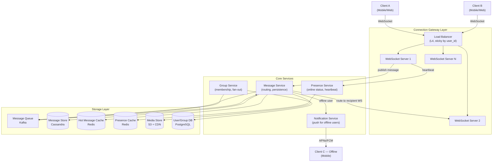

**Data flow summary:**
1. Client A opens a WebSocket to the connection gateway (sticky to WebSocket Server 1)
2. Client A sends a message → WebSocket Server 1 forwards to Message Service
3. Message Service persists to Cassandra + publishes to Kafka
4. If recipient (Client B) is online: Message Service routes to Client B's WebSocket server → delivered over WebSocket
5. If recipient (Client C) is offline: Notification Service sends push via APNs/FCM
6. Delivery acknowledgments flow back through the same WebSocket path

---

## Step 4: Detailed Design

### 4.1 WebSocket Connection Management

Why WebSockets over HTTP polling? HTTP long-polling wastes a server thread per waiting client and adds 100-500ms latency per message round-trip. WebSockets maintain a persistent full-duplex TCP connection — the server can push at will with no poll overhead.

> See [Chapter 12](/system-design/part-2-building-blocks/ch12-communication-protocols) for WebSocket protocol fundamentals.

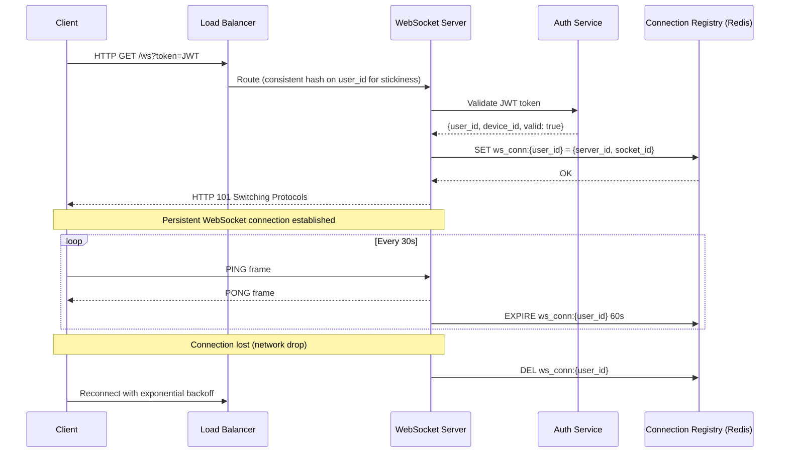

**Connection Registry (Redis):**

```
Key:   ws_conn:{user_id}
Value: {server_id: "ws-server-42", socket_id: "abc123", device: "mobile"}
TTL:   60s (refreshed by heartbeat every 30s)

Lookup: O(1) Redis GET to find which server a user is connected to
```

**Why sticky sessions?** The load balancer must route all WebSocket traffic for a given user to the same server instance where their TCP connection lives. Consistent hashing on `user_id` achieves this. If a server dies, affected clients reconnect (reconnect with exponential backoff, 1s → 2s → 4s → max 30s).

---

### 4.2 Message Delivery Sequence

A complete one-to-one message flow from sender to recipient acknowledgment:

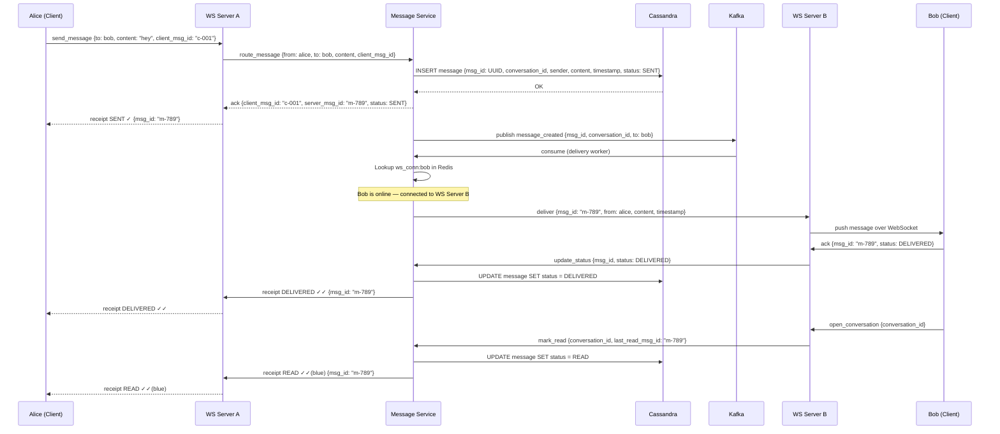

**Offline delivery path:**

When Bob is offline (not in connection registry):
1. Message Service persists message to Cassandra with status `SENT`
2. Notification Service sends push notification via APNs/FCM
3. Push payload contains `conversation_id` and preview text
4. When Bob comes online and opens the app, client fetches unread messages from Message Service
5. Bob's client sends `DELIVERED` ACK → `READ` ACK as messages are seen

---

### 4.3 Message Delivery Status State Machine

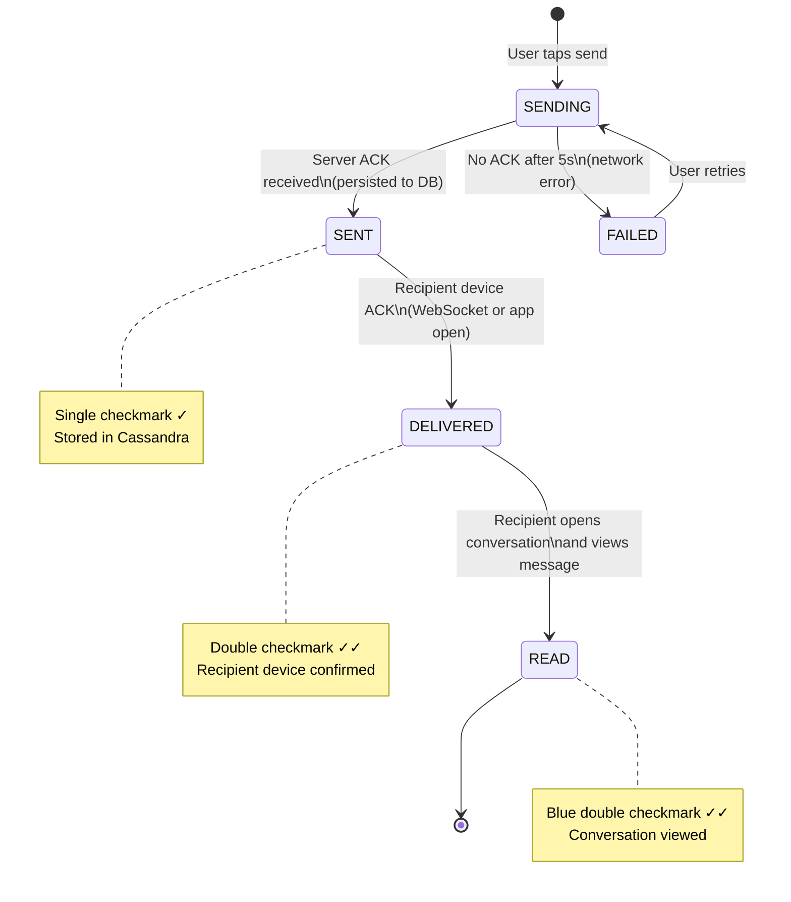

**Idempotency:** Each message has a `client_msg_id` generated by the sender. If the sender resends (retry after timeout), the server deduplicates by `client_msg_id` — no duplicate messages.

---

### 4.4 Group Chat Fan-out

Two distinct strategies based on group size:

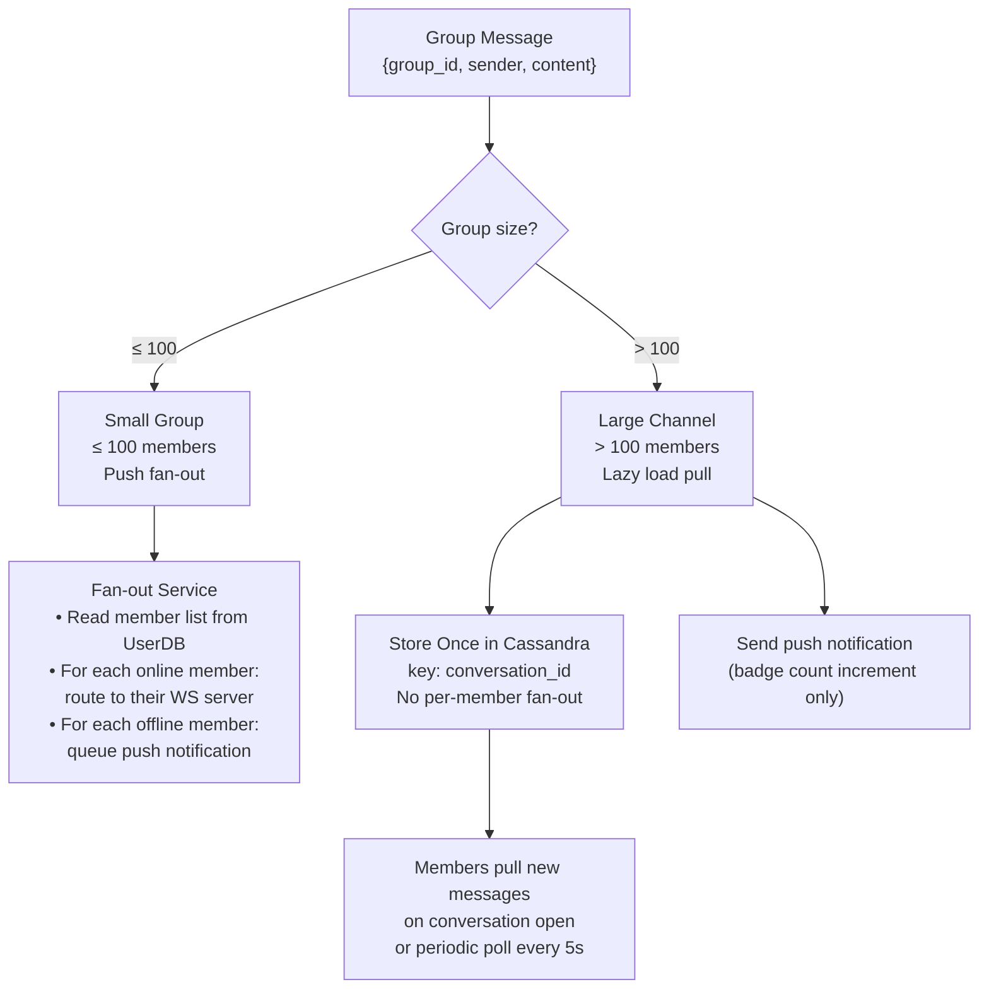

**Small group (push fan-out):**
- Fan-out Service reads group membership (cached in Redis, TTL 5 min)
- For each of N members: look up WebSocket server, deliver message
- At 100 members this means up to 100 WebSocket pushes per message
- Latency: ~10-30ms at this scale (parallel fan-out, not sequential)

**Large channel (pull model):**
- Store message once — no fan-out at all at write time
- Members subscribe to `conversation_id` topic; new message triggers a lightweight notification
- Clients poll (or use long-poll) for new messages in open conversations
- Rationale: a 500-member channel with 1 message/second = 500 WS pushes/second just for that channel. Multiplied across millions of active channels, push fan-out is unworkable.

**Fan-out via Kafka:**

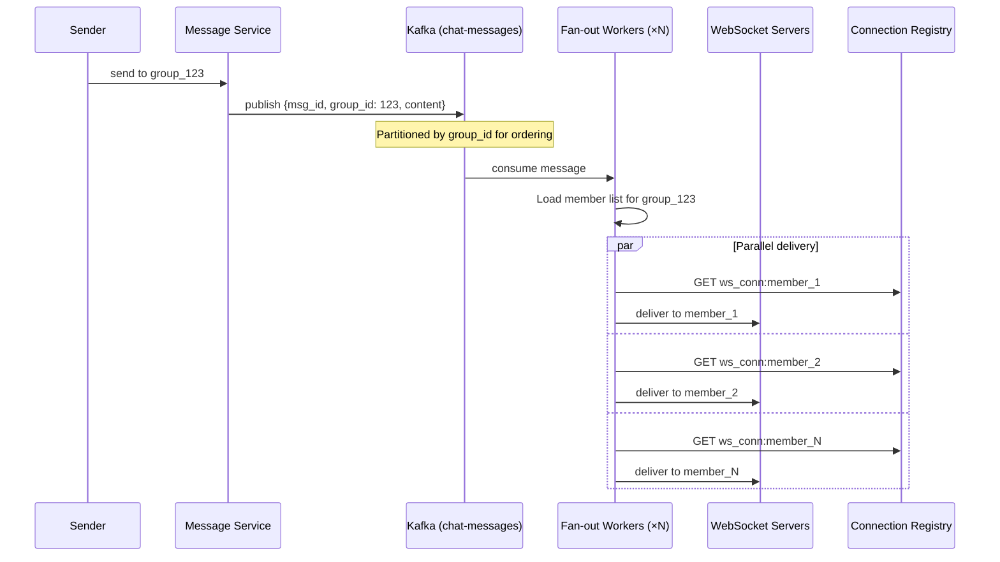

---

### 4.5 Online Presence System

Presence tracking is one of the hardest scalability problems in chat — 250M users each sending a heartbeat every 30 seconds is 8.3M operations/second, just for presence.

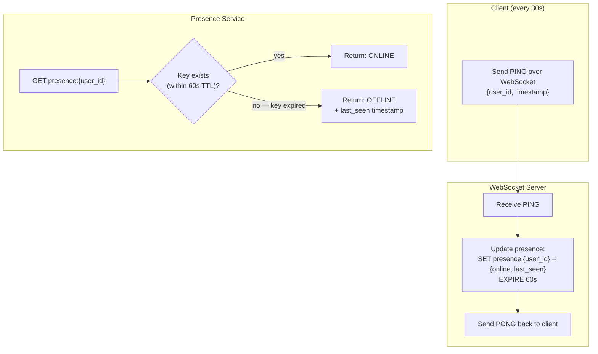

**Redis presence schema:**

```
Key:   presence:{user_id}
Value: {status: "online", last_seen: 1710000000, device: "mobile"}
TTL:   60s (set on every heartbeat; expires if client disconnects without explicit logout)

Lookup: O(1) GET
Bulk:   MGET presence:user1 presence:user2 ... (pipeline for group member presence)
```

**"Last seen" privacy:** Many apps (WhatsApp, Telegram) allow users to hide their exact last-seen time. The Presence Service checks user privacy settings before returning a precise timestamp — returning "last seen recently" (within 24h), "last seen within a week", etc.

**Presence broadcast:** When Alice comes online, should all her contacts be notified? Only if they have an open conversation with Alice. Architecture:
1. Alice connects → Presence Service publishes `user_online` event to Kafka
2. Fan-out Service identifies Alice's contacts who currently have Alice's conversation open
3. Push presence update only to those active conversations (not all contacts)
4. This reduces presence broadcast volume by ~99%

---

### 4.6 Message Storage Design

Chat workloads are write-heavy and have specific access patterns: write once, read sequentially (recent first), rarely update. This is a perfect fit for Cassandra.

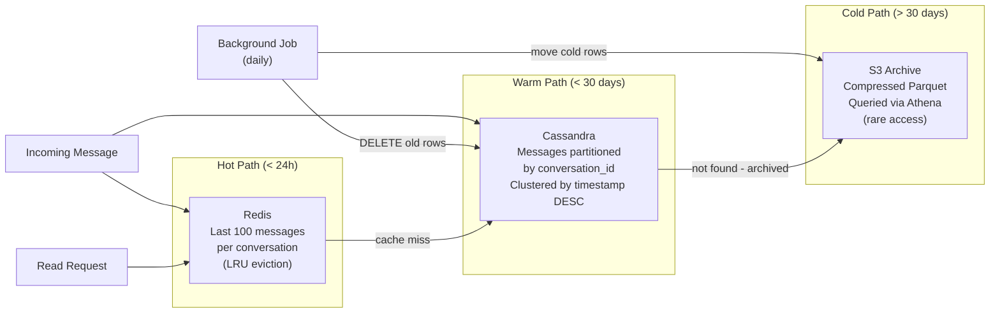

**Cassandra schema:**

```sql
CREATE TABLE messages (
    conversation_id  UUID,
    message_id       TIMEUUID,       -- TimeUUID encodes timestamp + ordering
    sender_id        UUID,
    content          TEXT,
    media_url        TEXT,
    status           TEXT,           -- SENT | DELIVERED | READ
    deleted_at       TIMESTAMP,      -- soft delete
    PRIMARY KEY (conversation_id, message_id)
) WITH CLUSTERING ORDER BY (message_id DESC)
  AND default_time_to_live = 2592000  -- 30-day TTL, archive job moves to S3
  AND compaction = {'class': 'TimeWindowCompactionStrategy', 'compaction_window_size': '1', 'compaction_window_unit': 'DAYS'};
```

**Why Cassandra:**
- Partition key `conversation_id` collocates all messages for a conversation on one node
- TimeUUID as clustering key guarantees strict ordering within a partition
- Append-only writes match Cassandra's LSM-tree strength
- Linear horizontal scaling: add nodes to handle 20B writes/day
- See [Chapter 10](/system-design/part-2-building-blocks/ch10-databases-nosql) for Cassandra internals

**Message ID ordering problem:** Two users send messages simultaneously within the same millisecond. `TIMESTAMP` alone does not guarantee order. `TIMEUUID` (UUID v1) embeds a monotonic counter in the node bits, resolving collisions at microsecond granularity.

---

### 4.7 Push Notifications for Offline Users

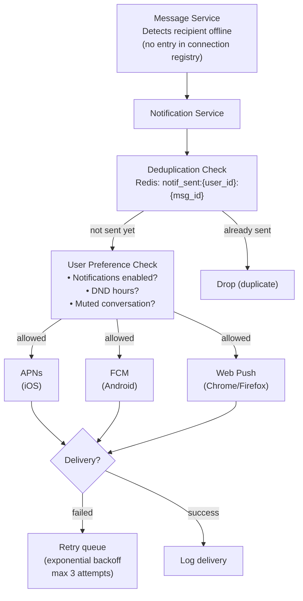

**Push payload design:**

```json
{
  "aps": {
    "alert": {
      "title": "Alice",
      "body": "hey"
    },
    "badge": 3,
    "sound": "default",
    "mutable-content": 1
  },
  "conversation_id": "conv-uuid-here",
  "message_id": "msg-uuid-here"
}
```

**Security:** Push payloads should contain only metadata (`conversation_id`, `message_id`), not message content. The client fetches the actual message from the server after receiving the push, decrypting it locally with its private key. This is mandatory for E2E-encrypted messages.

---

### 4.8 End-to-End Encryption (E2E)

At its core, E2E encryption means the server never sees plaintext. Only the sender and recipient can decrypt. WhatsApp, Signal, iMessage all use variants of the Signal Protocol.

**Key concepts:**

| Term | What It Is |
|------|-----------|
| Identity Key | Long-term asymmetric keypair, generated on device at registration |
| Signed PreKey | Medium-term key, rotated ~weekly, signed with identity key |
| One-Time PreKey | Single-use keys, batch-uploaded to server (~100 at a time) |
| Session Keys | Ephemeral keys derived via X3DH key exchange for each conversation |
| Double Ratchet | Algorithm that derives a new encryption key for every single message |

**X3DH Key Exchange (Signal Protocol):**

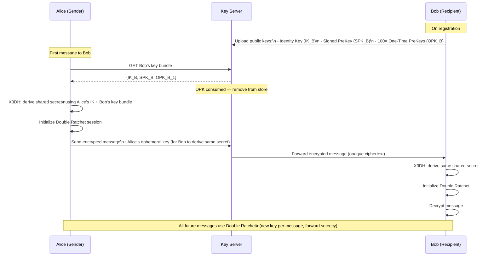

**Why this matters for system design:**
- Server stores encrypted blobs only — cannot read message content
- Each message has a unique encryption key (Double Ratchet) — compromise of one key does not expose past or future messages (forward secrecy)
- The server must store public keys reliably — if key store is corrupted, users lose their conversation history
- Key verification: users can compare "safety numbers" (fingerprints of identity keys) out-of-band to prevent man-in-the-middle attacks via the server

**What the server still knows:**
- Metadata: who messaged whom, when, how often, message sizes
- This metadata is still sensitive (traffic analysis) — solutions like Sealed Sender (Signal) address this, but are beyond interview scope

---

## Step 5: Deep Dives

### 5.1 Handling Millions of Concurrent WebSocket Connections

The naive approach of one thread per connection exhausts memory at tens of thousands of connections. Production systems use event-driven, non-blocking I/O:

| Approach | Technology | Connections/Server | Memory/Conn |
|----------|-----------|-------------------|-------------|
| Thread-per-connection | Java threads | ~10K | ~512KB stack |
| Event loop (single-threaded) | Node.js, Nginx | ~65K | ~10KB |
| Actor model | Erlang/Elixir | 1M+ | ~300 bytes |
| Async I/O | Rust (Tokio), Go | 500K+ | ~2KB |

**WhatsApp's choice:** Erlang's actor model (Ejabberd). Each Erlang process (lightweight actor, not OS thread) handles one connection. The BEAM VM can schedule millions of these actors across CPU cores. WhatsApp achieved 2 million concurrent connections on a single server using this approach.

**Connection gateway architecture:**

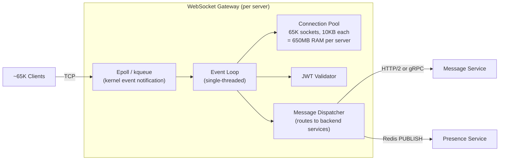

**Scaling to 250M connections:**
```
250M connections ÷ 65K per server = ~3,850 WebSocket gateway servers
With 2× redundancy = ~8,000 servers

AWS c5.2xlarge (8 vCPU, 16GB):
  ~65K connections per server
  ~$0.34/hr × 8,000 = $2,720/hr = ~$2M/month

Cost optimization: use c5n.18xlarge (high network bandwidth),
pack more connections per server → ~200K connections → 1,250 servers
```

**Connection recovery and backfill:**

When a client reconnects after a disconnect, it needs messages it missed. The client sends its last-seen `message_id` in the reconnect request. The Message Service queries Cassandra for all messages in the conversation with a timestamp after that `message_id` and delivers them in order.

---

### 5.2 Message Ordering Across Multiple Devices

A user may have multiple devices (phone + laptop + tablet). Each device has its own WebSocket connection. When they send a message from phone, the laptop must also show it.

**Multi-device fan-out:**

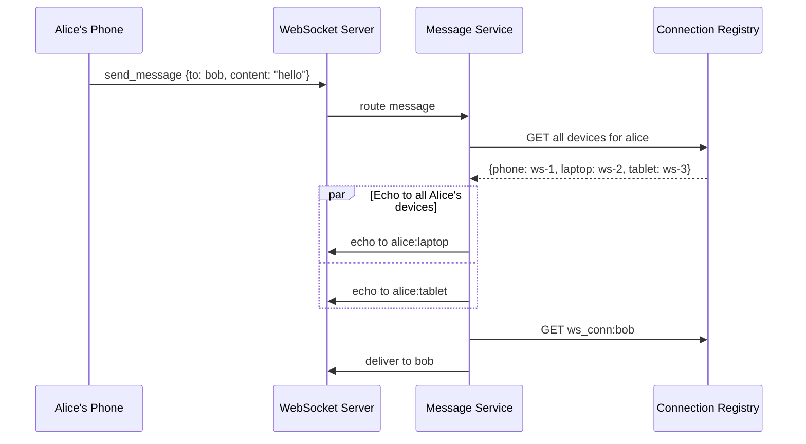

**Connection registry key:** Store per device, not per user:

```
ws_conn:{user_id}:{device_id} = {server_id, socket_id, platform}

To get all connections for a user:
  KEYS ws_conn:{user_id}:*   (use SCAN in production, not KEYS)
```

---

### 5.3 Real-World: How WhatsApp Handles 100B Messages/Day

WhatsApp's architecture is notable for achieving massive scale with a remarkably small team and infrastructure:

**Core architectural choices:**

| Decision | What | Why |
|----------|------|-----|
| Language | Erlang (BEAM VM) | Actor model — 1M+ lightweight processes |
| Protocol | Custom binary over WebSocket (formerly XMPP) | Lower overhead than JSON/HTTP |
| Message store | Ejabberd + offline queue | Messages delivered immediately; offline queue for delivery when user reconnects |
| Media | S3 with expiring URLs | Sender uploads to S3, sends URL in message, server never stores media |
| E2E encryption | Signal Protocol (added 2016) | End-to-end by default, server sees only ciphertext |
| Infrastructure | ~50 servers in 2012 for 450M users | Erlang's efficiency is extraordinary |

**Key insight:** WhatsApp does not store messages on the server after delivery. Once Bob downloads a message, it is deleted from the server. This design:
- Eliminates the message storage scalability problem entirely
- Reduces regulatory liability (no message history to subpoena)
- Simplifies E2E encryption (no key escrow)
- Forces clients to manage their own message history locally

**Why this works for WhatsApp but not Slack:**
- Slack is a workplace tool — message history search is a core feature, requiring persistent storage
- WhatsApp is personal messaging — users backup locally to iCloud/Google Drive
- Different product requirements → different storage architectures

---

### 5.4 Comparison: Polling vs Long-Polling vs WebSockets vs SSE

| Technique | Mechanism | Latency | Server Load | Use Case |
|-----------|-----------|---------|-------------|----------|
| Short Polling | Client polls every N seconds | High (up to N seconds) | Very high (N× requests) | Simple status checks |
| Long Polling | Server holds request until data available | Low (~100ms) | High (held connections) | Chat fallback, simple notifications |
| Server-Sent Events (SSE) | One-way server push over HTTP | Low | Medium | News feeds, live scores |
| WebSocket | Full-duplex persistent connection | Very low (<10ms) | Low per connection | Chat, live collab, gaming |

**For chat, WebSocket wins decisively** — bidirectional, lowest latency, lowest overhead once connection is established. Long-polling is a viable fallback for restrictive corporate proxies that block WebSocket upgrades.

---

## Production Considerations

### Monitoring

| Metric | Alert Threshold | What It Indicates |
|--------|----------------|-------------------|
| WebSocket connection count | > 80% server capacity | Need to scale out gateway |
| Message delivery latency P99 | > 100ms | Backend routing bottleneck |
| Message ACK rate | < 99.9% | Message loss or delivery failures |
| Presence heartbeat failures | > 1% | Network issues or server overload |
| Push notification success rate | < 95% | APNs/FCM token expiry or quota |
| Cassandra write latency P99 | > 50ms | Cluster needs tuning or expansion |
| Kafka consumer lag (chat-messages) | > 10,000 messages | Fan-out workers overwhelmed |
| Redis memory utilization | > 75% | Presence or connection cache evicting |

### Failure Modes

**WebSocket server failure:**
- Load balancer detects unhealthy instance via health check (<10s)
- Affected clients get connection error, backoff-reconnect to healthy instance
- Connection registry entries expire (60s TTL) — no stale entries accumulating
- Messages in flight: Kafka retains them, redelivered on reconnect

**Cassandra node failure:**
- Cassandra RF=3 (replication factor): 1 node can fail with no data loss
- Writes with `QUORUM` consistency: require 2/3 nodes to acknowledge — tolerates 1 failure
- Reads with `LOCAL_QUORUM`: served from surviving replicas
- Impact: elevated latency during node replacement (~30 min)

**Kafka cluster failure:**
- Message Service buffers messages in local queue (in-process, bounded)
- If Kafka is down >buffer timeout, Message Service returns error to sender
- Sender client retries (idempotent by client_msg_id)
- Recovery: Kafka restarts, consumers resume from last committed offset

**Redis connection registry failure:**
- Message Service cannot look up recipient's WebSocket server
- Fallback: store message in Cassandra, send push notification to all recipient devices
- Devices fetch missed messages on next connection using last_seen cursor
- This is the offline delivery path — same code handles both offline and Redis-failure cases

### Multi-Region Architecture

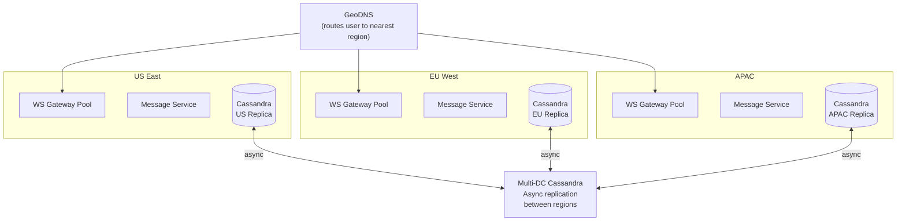

**Cross-region messaging:** Alice (US) messages Bob (EU). Alice's client connects to US gateway. Message Service in US needs to deliver to Bob's EU WebSocket connection. Options:
1. **Global connection registry** (single Redis with global replication — expensive)
2. **Message forwarding**: US Message Service publishes to a global Kafka topic → EU Message Service picks up and delivers to Bob's local connection (adds ~50ms cross-region latency — acceptable)

Option 2 is preferred: keeps regional services autonomous, uses Kafka for cross-region message handoff.

---

## Key Takeaway

> Chat systems live and die by their connection model. HTTP was built for request-response; real-time messaging needs persistent bidirectional connections — WebSockets are the right primitive. The connection registry in Redis is the routing brain of the entire system: every message delivery starts with a lookup of which server holds the recipient's connection. Store messages in Cassandra partitioned by conversation_id for natural locality and linear write scaling. Split group chat strategies by group size — push fan-out for small groups, pull-on-demand for large channels. And remember: the presence system often has higher throughput than message delivery itself (heartbeats from 250M users dwarf message writes) — design it independently with aggressive TTL-based expiry rather than explicit logout tracking.

---

### Code Example: WebSocket Connection Manager (Go)

```go
type Hub struct {
    mu      sync.RWMutex
    clients map[string]*Client  // userID -> client
    rooms   map[string]map[string]*Client  // roomID -> userID -> client
}

type Client struct {
    UserID string
    Conn   *websocket.Conn
    Send   chan []byte
}

func (h *Hub) HandleConnection(w http.ResponseWriter, r *http.Request) {
    conn, err := upgrader.Upgrade(w, r, nil)
    if err != nil {
        return
    }

    userID := r.URL.Query().Get("user_id")
    client := &Client{UserID: userID, Conn: conn, Send: make(chan []byte, 256)}

    h.mu.Lock()
    h.clients[userID] = client
    h.mu.Unlock()

    go client.writePump()
    go client.readPump(h)
}

func (h *Hub) SendToRoom(roomID string, message []byte, senderID string) {
    h.mu.RLock()
    defer h.mu.RUnlock()

    for userID, client := range h.rooms[roomID] {
        if userID != senderID {
            select {
            case client.Send <- message:
            default:
                close(client.Send)
                delete(h.rooms[roomID], userID)
            }
        }
    }
}
```

## Related Chapters

| Chapter | Relevance |
|---------|-----------|
| [Ch11 — Message Queues](/system-design/part-2-building-blocks/ch11-message-queues) | Kafka for offline message delivery and fan-out |
| [Ch12 — Communication Protocols](/system-design/part-2-building-blocks/ch12-communication-protocols) | WebSocket protocol for persistent bidirectional connections |
| [Ch10 — NoSQL Databases](/system-design/part-2-building-blocks/ch10-databases-nosql) | Cassandra as message storage (partitioned by conversation_id) |
| [Ch15 — Replication & Consistency](/system-design/part-3-architecture-patterns/ch15-data-replication-consistency) | Message ordering and at-least-once delivery guarantees |

---

## Practice Questions

### Beginner

1. **Message Ordering:** Alice sends three messages to Bob in rapid succession: "Hey", "Are you there?", "Hello??". A network hiccup causes message 2 to arrive at the server before message 1. How do you guarantee Bob sees them in Alice's original order? Describe your message ID scheme and any server-side buffering needed.

   <details>
   <summary>Hint</summary>
   Assign monotonically increasing sequence numbers per conversation at the server (not the client); clients hold messages in a buffer until they receive the expected sequence number, requesting any gaps via a fetch API.
   </details>

### Intermediate

2. **Connection Scaling:** Your chat service has 250M concurrent WebSocket connections across 4,000 servers. A data center failure suddenly takes out 500 servers. Walk through exactly what happens to the 30M+ affected users' connections and in-flight messages. What recovery mechanisms fire, in what order?

   <details>
   <summary>Hint</summary>
   Client WebSockets drop and reconnect (exponential backoff with jitter); the load balancer routes reconnections to surviving servers; in-flight messages are recovered from the message store (Kafka/Cassandra) on reconnect since they were persisted before delivery.
   </details>

3. **Large Channel Fan-out:** Your platform introduces public channels with 100,000 members (Discord-style). The existing push fan-out model creates 100K writes per message. Redesign the message delivery path. What does the client do differently, and how do you handle the unread count badge without fan-out?

   <details>
   <summary>Hint</summary>
   Switch to pull-on-open (clients poll for new messages when the channel is opened); store a single message in the channel's append-only log; for unread counts, store a per-user last-read pointer and compute the count on read rather than maintaining a counter via fan-out.
   </details>

4. **Presence at Scale:** Calculate the presence update rate for a market with 50M DAU where users cycle online/offline 3 times/hour. Is your heartbeat-based Redis design (one write per heartbeat every 30s) still viable? What optimization reduces write amplification while maintaining accurate presence?

   <details>
   <summary>Hint</summary>
   50M × 3 transitions/hr × 2 events (on+off) = 300M presence events/hr = ~83K events/sec; optimize by batching heartbeats, reducing heartbeat frequency for low-activity users, or using a hierarchical presence system that aggregates by region.
   </details>

### Advanced

5. **E2E Encryption + Compliance:** A business customer requires 90-day searchable message history for compliance AND end-to-end encryption between employees. These goals appear contradictory. Design a system that satisfies both, specifying the trust model, key management architecture, and what the compliance search index looks like.

   <details>
   <summary>Hint</summary>
   Use a key escrow model: messages are E2E encrypted between users, but the organization's compliance key can decrypt the message-level encryption key (stored separately); the search index stores encrypted keywords that the compliance system can query without decrypting full messages.
   </details>

---

## References & Further Reading

- [Designing Data-Intensive Applications](https://dataintensive.net/) — Martin Kleppmann, Chapter 11
- [WhatsApp Architecture — Facebook Engineering](https://www.infoq.com/presentations/whatsapp-architecture/)
- [How Discord Stores Trillions of Messages](https://discord.com/blog/how-discord-stores-trillions-of-messages) — Discord Engineering
- [Signal Protocol Specification](https://signal.org/docs/)
- [WebSocket RFC 6455](https://datatracker.ietf.org/doc/html/rfc6455)

*Next: [Chapter 21 — Video Streaming Platform](/system-design/part-4-case-studies/ch21-video-streaming-platform)*
