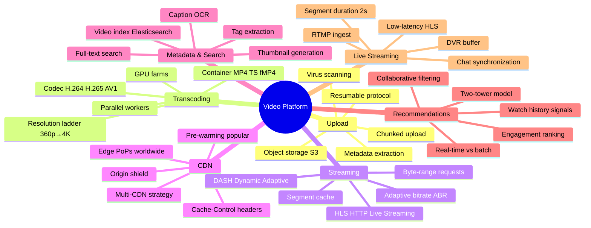
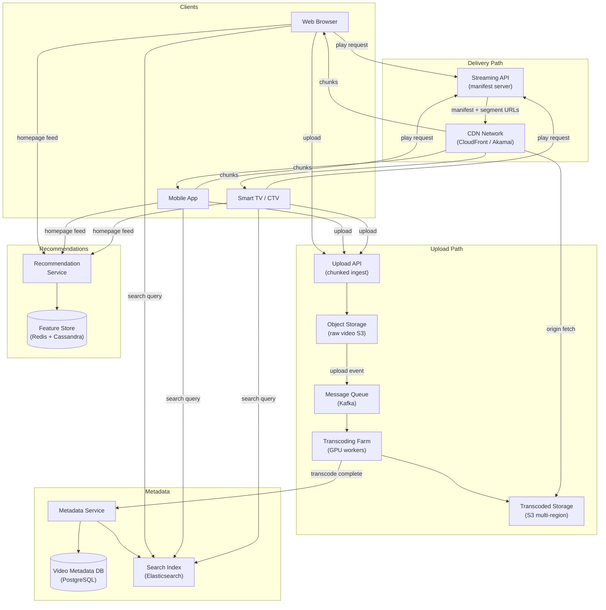
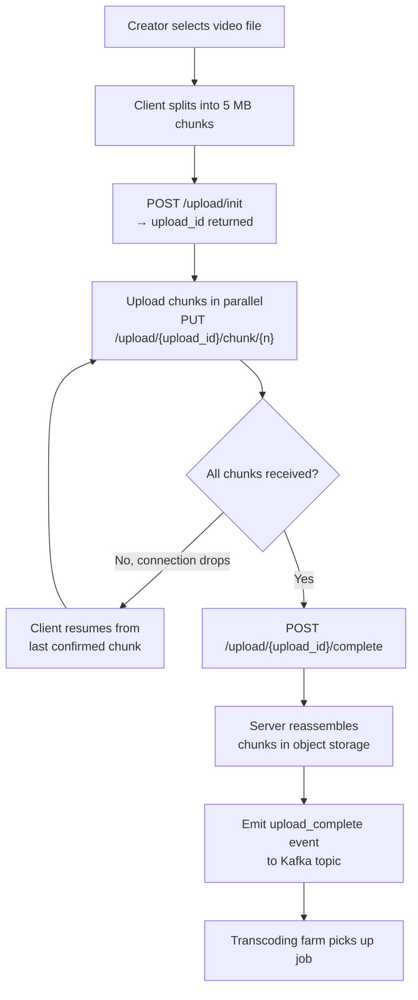
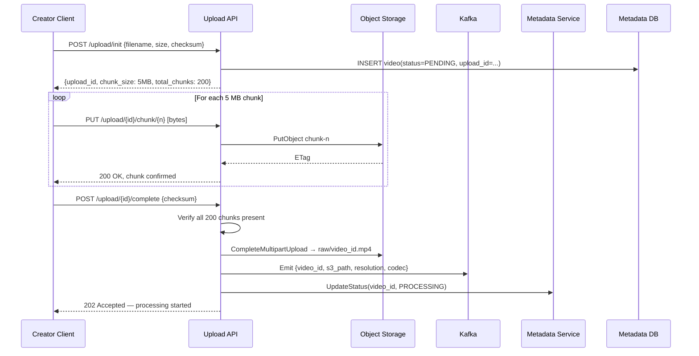
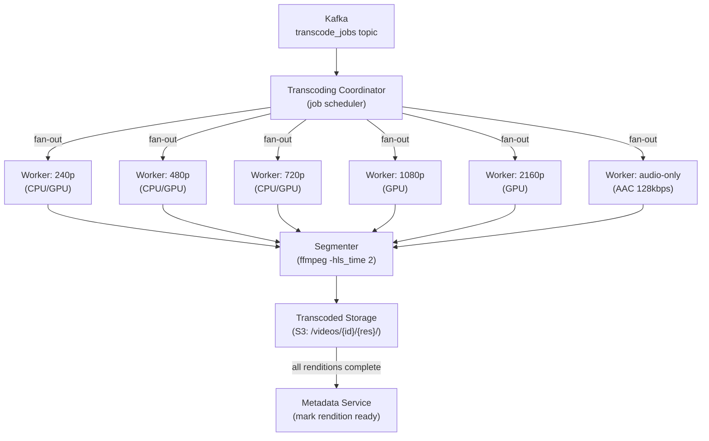
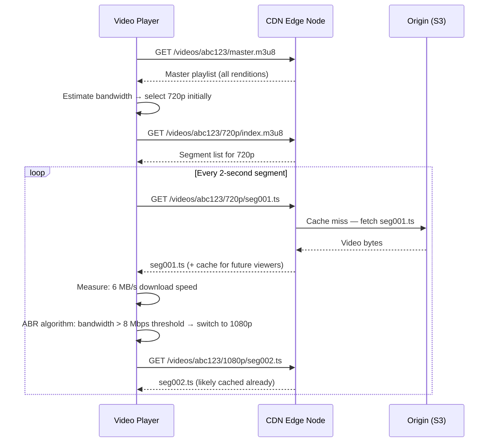
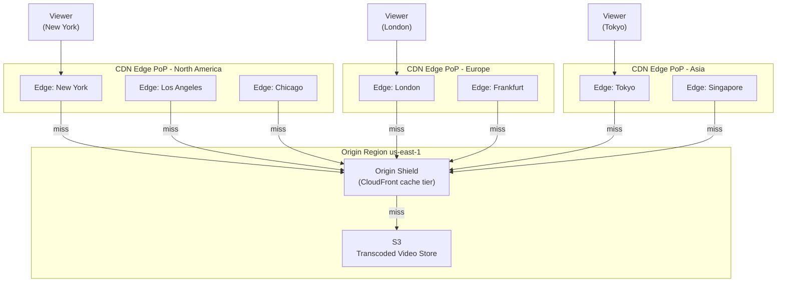
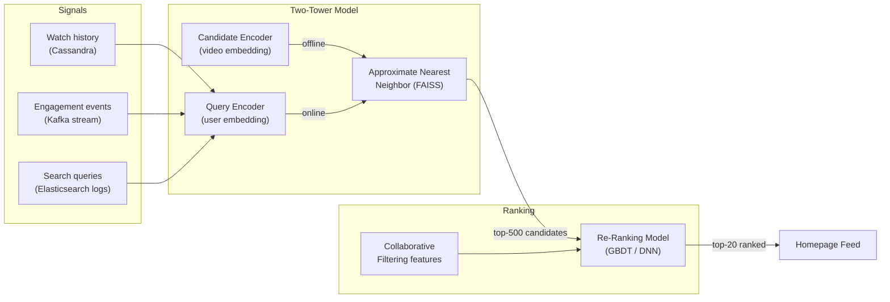
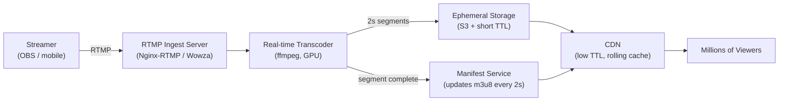
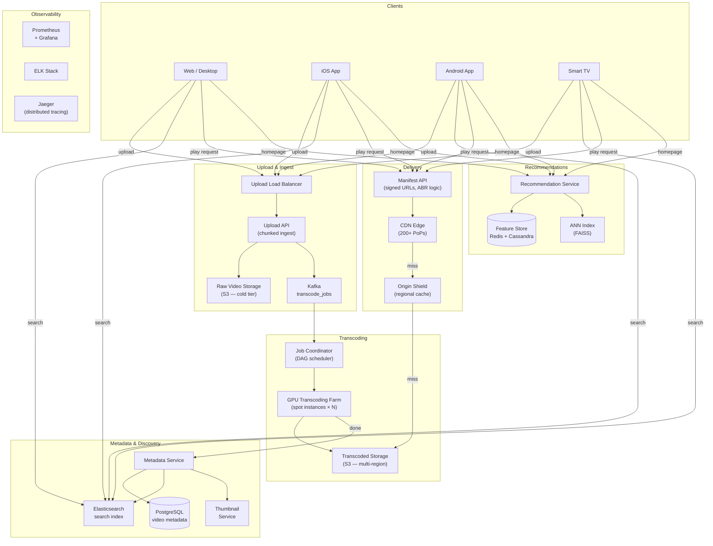

# Chapter 21: Video Streaming Platform


> *Every second, 500 hours of video are uploaded to YouTube. Every minute, Netflix streams 1 petabyte of data. The "play button" you tap is backed by upload pipelines, transcoding farms, adaptive bitrate algorithms, and multi-tier CDN networks — all invisible when they work and catastrophically visible when they do not.*

---

## Mind Map



---

## Overview — Why This Is a Top-5 Interview Topic

Video streaming platforms combine nearly every distributed systems concept into a single, tangible product everyone has used:

- **Write-heavy ingest** — chunked upload with resumability against unreliable connections
- **CPU-intensive processing** — transcoding a 4K video to six output resolutions takes 10–50 minutes per video-hour
- **Read-at-planetary-scale** — Netflix serves 700+ billion minutes of video per quarter
- **Adaptive delivery** — a viewer on 5G should get 4K; the same viewer on a train should gracefully drop to 480p without rebuffering
- **Content delivery economics** — bandwidth is the biggest cost; CDN strategy is a multi-million-dollar architectural decision

By the end of this chapter you will be able to design a YouTube-scale video platform end-to-end and answer follow-up questions on any single subsystem.

---

## Step 1 — Requirements & Constraints

### Functional Requirements

| Feature | In Scope | Notes |
|---------|----------|-------|
| Video upload | Yes | Up to 10 GB per file, raw format |
| Transcoding | Yes | Multiple resolutions + codecs automatically |
| Video playback | Yes | Adaptive bitrate, seeking, pause/resume |
| Video search | Yes | By title, tags, transcript |
| Recommendations | Yes, overview only | Homepage + "up next" feed |
| Live streaming | Yes, overview | RTMP ingest → HLS distribution |
| Comments & likes | Out of scope | Social graph; separate chapter |
| DRM / piracy protection | Out of scope | Real system needs Widevine/FairPlay |
| Creator monetization | Out of scope | Ad insertion pipeline is a separate design |

### Non-Functional Requirements

| Property | Target | Reasoning |
|----------|--------|-----------|
| Upload availability | 99.9% | Creators need reliable ingest |
| Playback availability | 99.99% | ≈ 52 min downtime/year; every outage is front-page news |
| Playback start latency | < 2 seconds | Industry benchmark; > 3s causes 10% viewer abandonment |
| Rebuffer rate | < 0.1% | Each rebuffer event increases churn probability by 40% |
| Upload processing time | < 30 min | Video visible to viewers within 30 min of upload |
| Scale | 1 billion videos, 100M DAU | YouTube-class scale |

---

## Step 2 — Capacity Estimation

Applying techniques from [Chapter 4 — Back-of-Envelope Estimation](/system-design/part-1-fundamentals/ch04-estimation).

### Assumptions

- **500 hours of video uploaded per minute**
- Average raw video: 1 GB per hour of 1080p (H.264 source)
- Average transcoded set per video: 6 resolutions, total ~2 GB stored per uploaded video-hour
- **100 million daily active viewers**
- Average watch time: 60 minutes per DAU per day
- Average streaming bitrate: 2 Mbps (mix of 480p, 1080p, 4K)

### Upload & Transcoding QPS

```
Raw upload volume = 500 hours/min × 1 GB/hour = 500 GB/min ≈ 8.3 GB/s inbound
Transcoding jobs  = 500 video-hours/min (each job fans out to 6 workers)
```

### Storage Estimation

```
Per video-hour stored (transcoded): 2 GB
New content per day:  500 hours/min × 60 min/hr × 24 hr = 720,000 video-hours/day
New storage per day:  720,000 × 2 GB = 1.44 PB/day
Annual storage:       1.44 PB × 365 ≈ 526 PB/year

With original files retained (1 GB/hr source):
  Additional source storage = 720,000 × 1 GB = 720 TB/day
  (Store source in cold tier: Glacier / Coldline)
```

### Bandwidth Estimation

```
Playback bandwidth = 100M DAU × 60 min/day × 2 Mbps / 86,400 sec
                   = 100M × 3600s × 2 Mbps / 86,400
                   = 100M × 2 Mbps × (3600/86400)
                   = 100M × 0.0833 Mbps
                   ≈ 8.3 Tbps average outbound

Peak = 3× average ≈ 25 Tbps peak outbound
```

This is why CDN is not optional — no single origin cluster handles 25 Tbps.

### Estimation Summary

| Metric | Value |
|--------|-------|
| Upload ingest | 8.3 GB/s |
| Transcoding jobs | 500 video-hours/min |
| Transcoded storage growth | 1.44 PB/day |
| Average playback bandwidth | 8.3 Tbps |
| Peak playback bandwidth | ~25 Tbps |
| DAU | 100 million |

---

## Step 3 — High-Level Design



**Key design decisions:**

- **Separate upload and streaming paths** — ingest is bursty and CPU-heavy; playback is continuous and bandwidth-heavy
- **Message queue between storage and transcoding** — decouples upload speed from transcoding capacity; allows retry on failure
- **CDN-first delivery** — streaming API serves only manifests; all video bytes flow through CDN edge nodes
- **Metadata service owns video lifecycle** — single source of truth for status, visibility, resolution availability

---

## Step 4 — Detailed Design

### 4.1 Video Upload Pipeline

Uploading a multi-GB video over a consumer internet connection requires resilience against disconnection. The industry standard is **chunked, resumable upload**.



**Chunk size trade-offs:**

| Chunk Size | Pros | Cons |
|-----------|------|------|
| 1 MB | Faster retry on failure | More HTTP overhead; more small objects in S3 |
| 5 MB | Good balance; S3 multipart minimum | ~20 chunks per 100 MB |
| 50 MB | Fewer requests | Long retry window if chunk fails |

**Recommended: 5–10 MB chunks.** This matches AWS S3 multipart upload minimum part size and provides reasonable retry granularity.

**Upload completeness check:** The server tracks received chunk numbers in Redis (`SET upload:{id}:chunks {bitmap}`). On `/complete`, it verifies all expected chunks are present before triggering transcoding.

### 4.2 Upload Pipeline — Sequence Diagram



### 4.3 Transcoding Architecture

Raw video must be converted into multiple formats for different devices, bandwidths, and players. This is the most computationally expensive part of the system.

#### Resolution Ladder

```
Source (raw) → 6 output renditions:
  2160p (4K)   — 15 Mbps  — for high-bandwidth desktop / 4K TV
  1080p (FHD)  — 8 Mbps   — standard HD
  720p  (HD)   — 5 Mbps   — mobile HD, lower-bandwidth broadband
  480p  (SD)   — 2.5 Mbps — mobile data, developing markets
  360p         — 1 Mbps   — very low bandwidth
  240p         — 500 Kbps — emergency fallback
```

Each rendition is split into **2-second segments** for adaptive streaming.

#### Codec Comparison

| Codec | Compression | Browser Support | GPU Encoding | Use Case |
|-------|------------|----------------|-------------|----------|
| H.264 (AVC) | Baseline | Universal | Excellent | Default; max compatibility |
| H.265 (HEVC) | 2× better than H.264 | Partial (Safari, Edge) | Good | 4K, mobile data savings |
| AV1 | 30% better than H.265 | Growing (Chrome, Firefox) | Emerging | Next-gen; YouTube default |
| VP9 | 50% better than H.264 | Chrome, Firefox | Moderate | YouTube legacy |

**Recommended strategy:** Encode H.264 for all resolutions (guaranteed compatibility), AV1 for 1080p+ for modern clients. Serve based on Accept header / MIME type negotiation.

#### Transcoding Architecture Diagram



**DAG-based transcoding:** A directed acyclic graph (DAG) orchestrates the pipeline — lower-resolution jobs can start immediately (fast to encode), while 4K jobs run in parallel. Videos become streamable at 360p within minutes of upload, with higher resolutions materializing progressively.

**Spot/preemptible instances:** Transcoding is embarrassingly parallel and fault-tolerant (any job can restart). Running on AWS Spot or GCP Preemptible instances reduces transcoding cost by 60–80%.

### 4.4 Adaptive Bitrate Streaming — HLS / DASH

**HLS (HTTP Live Streaming)** and **DASH (Dynamic Adaptive Streaming over HTTP)** both work on the same principle:

1. Each rendition is pre-segmented into small time-aligned chunks (2–6 seconds)
2. A **manifest file** lists all available renditions and their segment URLs
3. The video player downloads the manifest, picks an initial rendition, and fetches segments
4. Based on measured download speed, the player switches renditions between segments

#### HLS Manifest Structure

```
# Master Playlist (index.m3u8)
#EXTM3U
#EXT-X-STREAM-INF:BANDWIDTH=500000,RESOLUTION=426x240
/videos/abc123/240p/index.m3u8

#EXT-X-STREAM-INF:BANDWIDTH=1000000,RESOLUTION=640x360
/videos/abc123/360p/index.m3u8

#EXT-X-STREAM-INF:BANDWIDTH=2500000,RESOLUTION=854x480
/videos/abc123/480p/index.m3u8

#EXT-X-STREAM-INF:BANDWIDTH=5000000,RESOLUTION=1280x720
/videos/abc123/720p/index.m3u8

#EXT-X-STREAM-INF:BANDWIDTH=8000000,RESOLUTION=1920x1080
/videos/abc123/1080p/index.m3u8
```

Each per-rendition playlist lists individual `.ts` or `.fmp4` segment files with durations.

#### Adaptive Bitrate Sequence



**ABR algorithm choices:**

| Algorithm | Strategy | Strength | Weakness |
|-----------|----------|----------|----------|
| Throughput-based | Pick highest rendition below measured bandwidth | Simple, responsive | Oscillates on variable networks |
| Buffer-based (BBA) | Switch based on player buffer occupancy | Stable, fewer switches | Slow to react to sudden bandwidth increase |
| BOLA (buffer-occupancy + Lyapunov) | Optimize QoE utility function | Near-optimal | Complex; patent-encumbered |
| Netflix BOLA + ML | Hybrid with predicted bandwidth | Best quality | Requires client-side ML model |

**Netflix uses a hybrid approach:** bandwidth prediction via harmonic mean of last N segments, combined with buffer level to prevent panic switches.

---

## Step 5 — Deep Dives

### 5.1 CDN Distribution Strategy



**Origin Shield** is a regional CDN caching tier placed in front of the S3 origin. Without it, each of 200+ edge PoPs misses independently and hammers origin. With Origin Shield, all cache misses consolidate to a single regional request. For a popular video, this reduces origin fetch rate by 99%.

**Cache-Control strategy:**

```
Segments (.ts / .fmp4):  Cache-Control: public, max-age=31536000, immutable
  (Segments are content-addressed — same filename = same bytes)

Manifests (.m3u8):        Cache-Control: public, max-age=5
  (Manifests for VOD change rarely; live manifests must be near-real-time)

Thumbnails (.jpg):        Cache-Control: public, max-age=86400
```

**Multi-CDN strategy:** Large platforms use 2–3 CDN providers simultaneously (e.g., Akamai + CloudFront + Fastly). The streaming API performs CDN health checks and routes manifests to the healthiest CDN per-region. This eliminates single-CDN outage risk and enables cost-based routing.

### 5.2 Video Metadata Service & Search

Every video has associated metadata stored and indexed for discovery.

#### Data Model

```sql
CREATE TABLE videos (
    video_id      UUID         PRIMARY KEY,
    creator_id    BIGINT       NOT NULL,
    title         TEXT         NOT NULL,
    description   TEXT,
    tags          TEXT[],
    duration_sec  INTEGER,
    status        TEXT         NOT NULL,  -- PENDING | PROCESSING | READY | FAILED
    visibility    TEXT         NOT NULL,  -- PUBLIC | UNLISTED | PRIVATE
    upload_time   TIMESTAMPTZ  NOT NULL DEFAULT NOW(),
    publish_time  TIMESTAMPTZ,
    view_count    BIGINT       NOT NULL DEFAULT 0,
    renditions    JSONB,       -- {"1080p": "s3://...", "720p": "s3://...", ...}
    thumbnail_url TEXT
);

CREATE INDEX idx_videos_creator ON videos(creator_id);
CREATE INDEX idx_videos_status  ON videos(status) WHERE status != 'READY';
```

#### Search Index (Elasticsearch)

Video search requires full-text relevance ranking, not just key-value lookup:

```json
{
  "video_id": "abc123",
  "title": "Advanced Kubernetes networking tutorial",
  "description": "Deep dive into CNI plugins, network policies...",
  "tags": ["kubernetes", "networking", "devops"],
  "transcript_excerpt": "...today we will look at Calico vs Cilium...",
  "view_count": 250000,
  "publish_time": "2026-01-15T10:00:00Z",
  "creator_name": "TechWithPriya"
}
```

**Ranking signals:** Elasticsearch scores by BM25 relevance, then re-ranks using engagement signals (view count, watch-through rate, recency). A two-phase approach: candidate retrieval via full-text search, then ML re-ranking by a gradient boosted model.

**Thumbnail generation:** Automatically extract 3 frames at 25%, 50%, 75% of video duration. Use a computer vision model (ResNet classifier) to select the most visually appealing frame. YouTube A/B tests custom thumbnails vs auto-generated to optimize CTR.

### 5.3 Recommendation System Overview

Recommendations drive 70% of YouTube watch time. A brief architectural overview:



**Collaborative filtering intuition:** "Users who watched A, B, C also watched D" — user embedding captures taste; video embedding captures content profile. ANN search finds the 500 most similar videos to a user's embedding in milliseconds.

**Freshness trade-off:** Embeddings are recomputed hourly for active users. New videos get a "freshness boost" for the first 24 hours to escape the cold-start problem.

### 5.4 Live Streaming vs VOD

| Dimension | VOD (Video On Demand) | Live Streaming |
|-----------|----------------------|---------------|
| Ingest protocol | HTTP multipart upload | RTMP / SRT / WebRTC WHIP |
| Processing | Offline transcoding (minutes) | Real-time transcoding (< 2s latency) |
| Segment duration | 2–6 seconds | 1–2 seconds (low-latency HLS) |
| CDN caching | Segments cached indefinitely | Segments expire after 30–60 seconds |
| Manifest refresh | Static (VOD) | Every 1–2 seconds (live) |
| DVR / rewind | Full seek anywhere | Rolling 4-hour window |
| Failure recovery | Retry from S3 | Re-ingest; viewer sees buffering |
| Storage | Permanent | Ephemeral during live; archived after |

**Live streaming architecture:**



**Low-latency HLS (LL-HLS):** Apple's extension reduces latency to 1–3 seconds by allowing partial segment delivery and server-sent events for manifest updates — compared to 15–30 second latency with standard HLS.

### 5.5 Real-World: How Netflix Processes 8 Million Hours of Video

Netflix's video processing pipeline, called **Cosmos**, is a microservices workflow engine:

**Key architectural choices:**

1. **Per-title encoding:** Netflix does not use a fixed bitrate ladder. A static animation (low complexity) gets different bitrate targets than a high-motion action film. Their machine learning model analyzes each scene and picks the optimal encode parameters — reducing file size by 20% at the same visual quality.

2. **Open Connect CDN:** Netflix owns their ISP-embedded CDN appliances (Open Connect Appliances, or OCAs) deployed in major ISPs worldwide. 95% of Netflix traffic is served directly from these boxes, not from AWS. This eliminates egress costs from cloud and reduces latency dramatically.

3. **Chaos Engineering:** Netflix's Simian Army regularly terminates production EC2 instances randomly — the origin pipeline must survive arbitrary worker deaths. Transcoding jobs are fully idempotent and re-playable from Kafka offsets.

4. **Pre-positioning:** Netflix pre-caches titles on OCA appliances during off-peak hours (2–5 AM local time) based on predicted demand. By the time subscribers click play, the video is already on the nearest appliance.

5. **Tiered encoding:** New releases get encoded in all formats immediately. Content with declining viewership gets demoted — rare resolutions (4K HDR) are encoded only on-demand when the first viewer at that quality requests them.

| Netflix Scale Stat | Value |
|-------------------|-------|
| Content library | 36,000+ titles |
| Countries served | 190 |
| Peak streaming bandwidth | ~700 Gbps (estimated) |
| OCA deployments | 1,000+ ISP locations |
| Encoding compute | 1M+ CPU-hours per major release |
| Per-title encodes per title | 120+ (resolution × codec × HDR variants) |

---

## Architecture Diagram — Complete System



---

## Failure Modes & Mitigations

| Failure | Impact | Mitigation |
|---------|--------|-----------|
| Upload API down | Creators cannot upload | Multi-AZ deployment; health checks reroute in < 30s |
| S3 region outage | Cannot fetch source for transcode | Store raw video in 2 regions; failover in coordinator |
| Transcoding worker crash | Job stuck | Kafka consumer offset not committed; job re-picked in 30s |
| CDN PoP outage | Regional viewers rebuffer | Multi-CDN routing; fallback to alternate CDN or origin |
| Manifest service overload | All players rebuffering | CDN caches manifests (5s TTL); autoscale manifest pods |
| Elasticsearch slow | Search results delayed | Search is non-critical path; timeout at 2s; degrade to tag lookup |
| Recommendation model stale | Worse recommendations | Serve cached user feed; model refresh is async and non-blocking |

---

## Monitoring & Alerting

| Metric | Tool | Alert Threshold |
|--------|------|----------------|
| Playback start time P95 | Client telemetry → Kafka → Grafana | > 3 seconds |
| Rebuffer rate | Client-side player metrics | > 0.5% |
| Transcoding queue depth | Kafka consumer lag | > 10,000 jobs |
| CDN cache hit ratio | CDN analytics API | < 95% for popular segments |
| Upload failure rate | Upload API error rate | > 1% |
| Manifest error rate | HTTP 5xx on ManifestSvc | > 0.1% |
| Elasticsearch query latency | ES monitoring | P99 > 500ms |

**Client-side playback instrumentation** is critical: the server cannot observe rebuffering. Every video player emits a heartbeat event every 5 seconds with: current rendition, buffer level, playback state, rebuffer count, and bandwidth estimate.

---

## Key Takeaway

> **A video streaming platform is five systems in one: a chunked ingest pipeline that survives unreliable connections, a transcoding farm that converts one raw file into 30+ format variants, an adaptive bitrate delivery system that picks the right variant second-by-second, a CDN that absorbs petabytes of traffic at the edge, and a recommendation engine that decides what you watch next. Every interview answer that does not address adaptive bitrate streaming and CDN distribution has missed the two subsystems that define playback quality. Every production deployment that does not instrument client-side player telemetry is flying blind.**

---

## Related Chapters

| Chapter | Relevance |
|---------|-----------|
| [Ch08 — CDN](/system-design/part-2-building-blocks/ch08-cdn) | CDN is the primary delivery layer absorbing petabytes of traffic |
| [Ch07 — Caching](/system-design/part-2-building-blocks/ch07-caching) | Metadata and manifest caching for playback start latency |
| [Ch11 — Message Queues](/system-design/part-2-building-blocks/ch11-message-queues) | Transcoding job queue for parallel video processing |
| [Ch06 — Load Balancing](/system-design/part-2-building-blocks/ch06-load-balancing) | Load balancing across transcoding workers and upload servers |

---

## Practice Questions

### Beginner

1. **Chunked Upload Resumability:** A creator is uploading a 10 GB raw video. At chunk 847 of 2,000, their laptop loses connectivity and reconnects 6 hours later. Walk through exactly how your system supports resuming from chunk 848 — what state is stored server-side, where, and what happens if the upload session expires before they reconnect?

   <details>
   <summary>Hint</summary>
   Store an upload manifest (upload_id, chunks_received bitmap, expiry timestamp) in Redis or S3; on reconnect, the client queries for the last confirmed chunk; if the session has expired, restart the upload from chunk 0 with a new upload_id.
   </details>

### Intermediate

2. **ABR Oscillation:** A viewer's home internet fluctuates between 2 Mbps and 20 Mbps every 30 seconds. Your throughput-based ABR algorithm switches between 480p and 1080p on every segment boundary, causing jarring quality changes. Describe two ABR strategies that stabilize rendition selection and explain the quality-vs-stability trade-off each makes.

   <details>
   <summary>Hint</summary>
   Buffer-based ABR (selects quality based on buffer level, not instantaneous throughput) adds stability by absorbing short bandwidth drops; BOLA (buffer occupancy based) uses a utility function — both sacrifice peak quality during brief spikes to avoid oscillation.
   </details>

3. **Cold Content Tiering:** Your platform has 50 billion videos. The bottom 90% by view count represent 85% of storage costs but <1% of traffic. Design a tiered storage strategy (hot/warm/cold) that reduces costs without degrading experience for the rare viewer of cold content. What is an acceptable first-play latency for a video last watched 3 years ago?

   <details>
   <summary>Hint</summary>
   Store hot content on SSD-backed object storage (instant access), warm on standard S3, cold in S3 Glacier (retrieval in minutes); restore cold videos to warm tier on first access and cache for 30 days before moving back — 5–15 minute first-play latency is acceptable for archival content.
   </details>

4. **Live Stream CDN Scaling:** A major sports event starts in 10 minutes and you expect 5M concurrent viewers. Your CDN has 200 edge PoPs. The live stream generates one 2-second segment every 2 seconds. Estimate total CDN requests/second. How does push (pre-populate edge) vs pull (fetch on request) CDN architecture change this number?

   <details>
   <summary>Hint</summary>
   5M viewers × 1 segment request / 2 seconds = 2.5M req/s total; with pull CDN, each PoP independently fetches the segment from origin on first miss (up to 200 origin requests per segment); with push, origin pushes each segment to all PoPs proactively (1 origin push per segment regardless of viewer count).
   </details>

### Advanced

5. **Lazy Transcoding Economics:** Your transcoding farm costs $2M/month. An engineer proposes: only transcode 480p and 1080p on upload; generate 240p, 720p, and 4K lazily on first request. Analyze the latency, UX, and infrastructure implications. What signals (view count trajectory, device distribution) would you use to decide which resolutions to pre-transcode vs generate lazily?

   <details>
   <summary>Hint</summary>
   Lazy transcoding saves upfront compute cost but creates a first-viewer latency spike (the transcoding job must run before the first playback); use a hybrid: pre-transcode the most common resolutions (480p, 720p, 1080p) immediately; generate 240p and 4K lazily, with a 30-second timeout fallback to the nearest available rendition.
   </details>
