# Chapter 22: Ride-Sharing & Geospatial Systems


> *A ride-sharing platform is the most spatially demanding system you will ever design in an interview. It fuses real-time location streams, geospatial indexing, matching algorithms, dynamic pricing, and financial transactions into a single coherent product. The geospatial layer alone — how you find the nearest available driver in milliseconds — separates a passing answer from a great one.*

---

## Mind Map

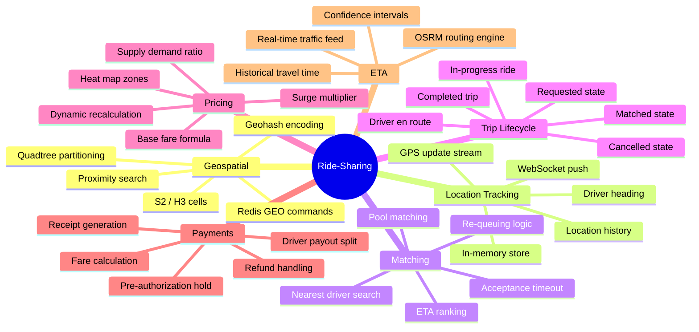

---

## Overview — Why Ride-Sharing Is a Landmark Interview Topic

Ride-sharing sits at the intersection of five distinct engineering disciplines:

- **Geospatial indexing** — finding entities by geographic proximity at millions of queries per second
- **Real-time streaming** — continuous GPS ingestion from millions of mobile devices
- **Matching algorithms** — assigning supply to demand under latency constraints
- **Dynamic pricing** — algorithmic price discovery based on supply/demand imbalance
- **Financial transactions** — pre-authorization, capture, and split payments

Most system design problems optimize one or two of these. Ride-sharing requires all five to work together coherently. By the end of this chapter you will understand the architecture behind Uber, Lyft, Grab, and DiDi, and be able to explain the geospatial indexing decision — the question that separates good candidates from great ones.

---

## Step 1 — Requirements & Constraints

### Functional Requirements

| Feature | In Scope | Notes |
|---------|----------|-------|
| Request a ride | Yes | Rider sets pickup and dropoff; system finds driver |
| Driver matching | Yes | Nearest available driver by ETA, not just distance |
| Real-time tracking | Yes | Rider sees driver move on map; driver sees route |
| Trip lifecycle management | Yes | State machine: requested → matched → en route → in-progress → completed |
| Fare calculation | Yes | Base fare + time + distance + surge multiplier |
| Surge pricing | Yes | Dynamic multiplier based on supply/demand ratio per zone |
| Driver location updates | Yes | Driver app sends GPS every 4 seconds |
| Payment processing | Yes | Pre-auth on request; capture on completion |
| Driver payout | Yes | Split fare: driver share after platform commission |
| Ride history | Yes | Rider and driver can review past trips |
| Ride cancellation | Yes | By rider pre-pickup or driver; cancellation fee logic |
| Pool / shared rides | Out of scope | Simplifies matching; add as extension |
| Scheduled rides | Out of scope | Focus on on-demand |

### Non-Functional Requirements

| Property | Target | Reasoning |
|----------|--------|-----------|
| Matching latency | < 5 seconds from request to matched driver | User experience — longer feels broken |
| Location update ingestion | 99.9th percentile < 500ms | GPS updates must stay fresh for matching |
| Driver position staleness | < 8 seconds | Two missed updates before position is stale |
| System availability | 99.99% | Downtime = lost rides = revenue loss |
| Geospatial query latency | P99 < 50ms | Proximity search must not dominate matching time |
| Trip tracking update rate | Every 3–5 seconds on rider screen | Perceived smoothness without network overload |
| Payment success rate | 99.95% | Failed payments require costly manual recovery |
| Concurrent drivers tracked | 5M worldwide | Peak: urban rush hours across multiple cities |

---

## Step 2 — Capacity Estimation

Applying back-of-envelope techniques from [Chapter 4 — Back-of-Envelope Estimation](/system-design/part-1-fundamentals/ch04-estimation).

### Assumptions

- **100 million registered riders**, **5 million registered drivers**
- **10 million rides per day** (global)
- **1 million drivers online at peak** (20% of 5M total)
- Driver sends GPS update every **4 seconds** while active
- Average trip duration: **20 minutes**
- Average trip distance: **8 km**

### QPS Estimation

```
GPS updates from drivers:
  1,000,000 active drivers × (1 update / 4s) = 250,000 location updates/second

Ride requests:
  10,000,000 rides/day / 86,400s = ~116 ride requests/second
  Peak = 5× average = ~580 ride requests/second

Location queries for matching:
  Each ride request triggers ~5 proximity queries (fan-out, retry)
  580 × 5 = ~2,900 geospatial queries/second
```

The dominant load is **location update ingestion: 250,000 writes/second**. This drives the entire storage and streaming architecture.

### Storage Estimation

```
Driver location record = 64 bytes
  (driver_id: 8B, lat: 8B, lng: 8B, heading: 4B, speed: 4B,
   timestamp: 8B, status: 4B, geohash: 12B, padding: 8B)

In-memory active driver store:
  1,000,000 drivers × 64 bytes = 64 MB   ← fits in a single Redis node

Trip records:
  1 trip = ~500 bytes (IDs, coordinates, timestamps, fare)
  10M trips/day × 500 bytes = 5 GB/day
  Annual = 5 GB × 365 = 1.825 TB/year

Location history (retained 30 days for disputes):
  250,000 updates/s × 64 bytes × 86,400s × 30 days = ~41 TB/month
  → Sample to 1 update/30s for history → 1/7.5 of full rate → ~5.5 TB/month
```

### Bandwidth Estimation

```
Inbound GPS stream:
  250,000 updates/s × 64 bytes = 16 MB/s inbound

Outbound tracking to rider apps:
  10M active rides at peak × 1 update/5s × 64 bytes = 128 MB/s outbound
```

### Summary Table

| Metric | Value |
|--------|-------|
| Active drivers tracked | 1M peak |
| GPS update rate | 250,000 /s |
| Geospatial query rate | ~3,000 /s |
| Ride request rate | ~580 /s peak |
| In-memory driver store | ~64 MB |
| Trip data growth | ~5 GB/day |
| Inbound GPS bandwidth | ~16 MB/s |

---

## Step 3 — High-Level Design

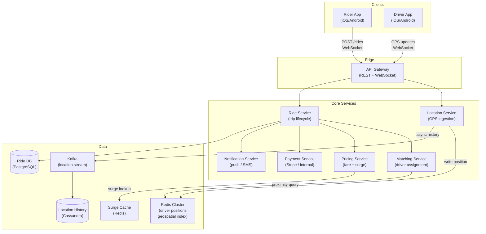

**Key design decisions at this level:**

- **Location Service is a write-heavy, read-heavy hot path** — GPS updates land in Redis (in-memory) first, then fan out to Kafka for history persistence
- **Matching Service reads from Redis** — geospatial proximity queries run against the in-memory store, never against disk
- **Ride Service owns state** — the trip state machine lives in PostgreSQL; Redis holds ephemeral position data
- **Surge pricing is precomputed** — a background job recalculates multipliers every 30 seconds per zone; Matching Service reads from a cache

---

## Step 4 — Detailed Design

### 4.1 Geospatial Indexing — The Core Technical Challenge

Finding the nearest available driver is the central algorithmic problem. Three approaches dominate:

#### Geospatial Indexing Comparison

| Approach | How It Works | Strengths | Weaknesses | Used By |
|----------|-------------|-----------|------------|---------|
| **Geohash** | Encode lat/lng into a base32 string; nearby cells share a prefix | Simple, string-based, Redis native | Edge distortion at cell boundaries; non-uniform cell sizes | Lyft (legacy), many Redis-based systems |
| **Quadtree** | Recursively divide 2D space into four quadrants; leaves hold entities | Adaptive density — more cells in dense urban areas | Complex to implement; tree rebalancing overhead | Custom in-memory implementations |
| **S2 Cells** (Google) | Sphere projected via Hilbert curve; hierarchical cell IDs | Globally uniform area; excellent hierarchy for multi-scale | More complex than geohash; requires S2 library | Google Maps, many modern systems |
| **H3 Hexagonal Grid** (Uber) | Earth divided into hexagons at multiple resolutions | Uniform neighbor distance (hexagons touch at edges, not corners); ideal for density heatmaps | Proprietary initially; hexagons do not tile perfectly at all resolutions | Uber (production since 2018) |

**Recommendation for interviews: Lead with geohash** (simplest to explain and reason about), then mention H3 as the production-grade alternative Uber uses. Both Redis GEOADD/GEORADIUS and S2 are worth knowing.

#### Geohash Deep Dive

Geohash divides the Earth into a grid. Each character added to the hash increases precision by a factor of ~32.

```
Precision levels:
  4 chars = ±20 km   (city level)
  5 chars = ±2.4 km  (neighborhood)
  6 chars = ±0.6 km  (block)
  7 chars = ±76 m    (building)
  8 chars = ±19 m    (precise GPS)

Example: Uber HQ, San Francisco
  Coordinates: 37.7751, -122.4193
  Geohash (6): 9q8yy9
  Geohash (7): 9q8yy9k
```

**Proximity search using geohash:**

```
1. Encode rider's pickup location to geohash precision 6: "9q8yy9"
2. Compute the 8 neighboring cells: "9q8yy3", "9q8yy6", "9q8yy7",
   "9q8yyd", "9q8yye", "9q8yyf", "9q8yys", "9q8yyt"
3. Query Redis: GEORADIUS or scan all 9 cells for available drivers
4. Return drivers sorted by distance
```

**The boundary problem:** A driver 100m away but in an adjacent geohash cell has a different prefix. Querying only the rider's cell misses them. Solution: always query the **9-cell neighborhood** (current cell + 8 neighbors). This is standard practice.

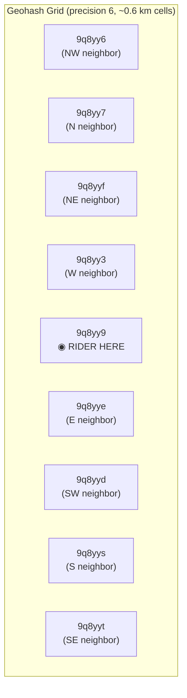

#### Redis Geospatial Commands

Redis provides first-class geospatial support via its sorted set internals (geohash encoded as score):

```
# Driver app sends update
GEOADD drivers:available <lng> <lat> "driver_id_7831"

# Matching service finds drivers near pickup
GEORADIUS drivers:available <pickup_lng> <pickup_lat> 3 km
          ASC COUNT 20 WITHCOORD WITHDIST

# Driver goes offline or accepts ride — remove from available set
ZREM drivers:available "driver_id_7831"
```

Redis `GEORADIUS` runs in O(N+log M) where N is elements in the radius and M is total elements in the sorted set. At 1M drivers across all sets and typical urban density of a few hundred per cell, queries return in microseconds.

### 4.2 Driver Location Service

The Location Service is the highest-throughput component: 250,000 GPS updates per second.

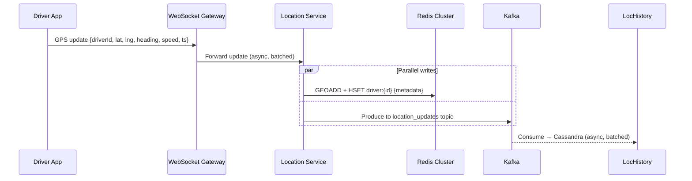

**Batching strategy:** The Location Service does not write each GPS update individually to Redis. It batches updates in 100ms windows and uses Redis pipelines to send 25,000 updates per batch (250,000/s × 0.1s). This reduces network round-trips from 250,000/s to 10/s per Location Service instance.

**Driver metadata in Redis Hash:**

```
HSET driver:7831
    status      "available"     # available | on_trip | offline
    lat         37.7751
    lng         -122.4193
    heading     245             # degrees
    speed       28              # km/h
    updated_at  1710201600      # Unix timestamp
    vehicle     "sedan"
    rating      4.87
```

**Stale driver detection:** A background sweeper runs every 10 seconds, scanning drivers whose `updated_at` is more than 15 seconds old (3.75 missed updates). It sets their status to "offline" and removes them from `drivers:available`. This prevents matching with drivers who have lost connectivity.

### 4.3 Matching Algorithm

The matching algorithm finds the best available driver for a ride request. "Best" means lowest ETA to pickup, not shortest distance — a driver 2 km away in light traffic beats a driver 1.5 km away in gridlock.

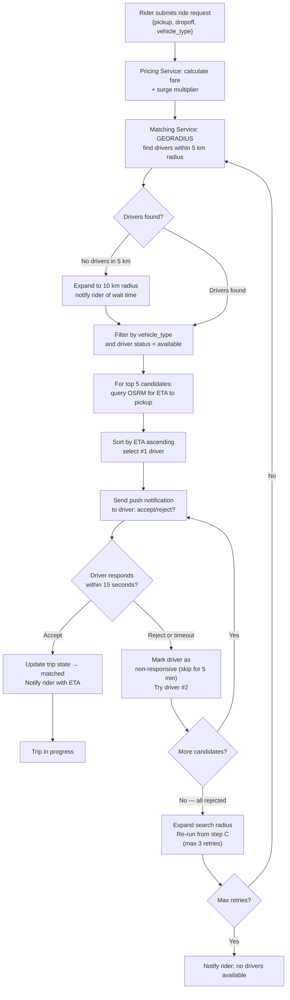

**Key matching decisions:**

- **ETA over distance** — OSRM (Open Source Routing Machine) or Google Maps Distance Matrix API provides driving ETAs for the top-5 candidates. Querying more than 5 is wasteful; the nearest-by-radius candidates are almost always the best by ETA too.
- **Sequential offer, not simultaneous** — offering to multiple drivers simultaneously creates race conditions and degrades driver experience. Sequential offer with 15-second timeout is standard.
- **Acceptance timeout tracking** — drivers who repeatedly timeout have their priority reduced in future matching rounds.

### 4.4 Trip State Machine

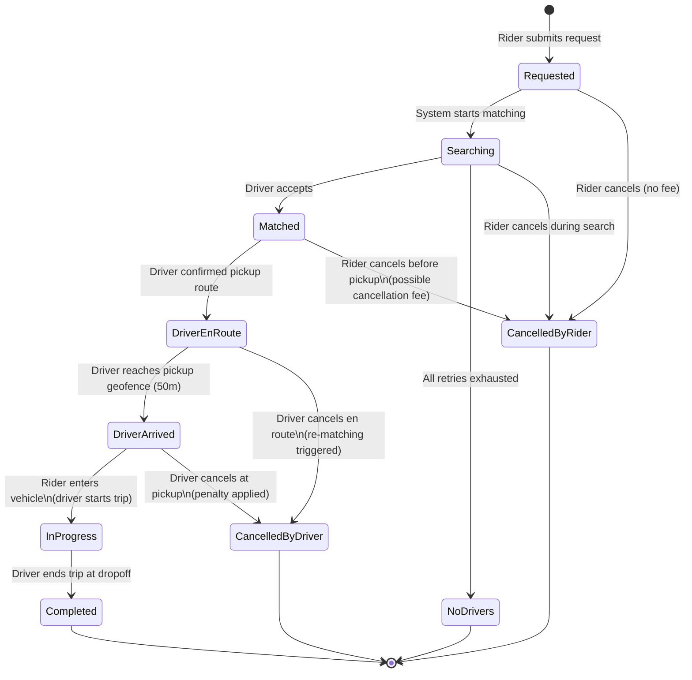

**State persistence:** The canonical trip state lives in PostgreSQL (`trips` table). Redis caches the current state for fast lookups by the tracking service. On state transition, the Ride Service writes to PostgreSQL first (durable), then updates Redis (cache).

**Geofencing for DriverArrived:** The system detects arrival automatically when the driver's GPS position is within 50 meters of the pickup point. This triggers an "arrived" push to the rider without the driver having to press a button — reducing driver distraction.

### 4.5 Real-Time Location Streaming to Rider

Once a trip is matched, the rider's app displays the driver moving on a map. This is a different problem from GPS ingestion — it is server-to-client push.

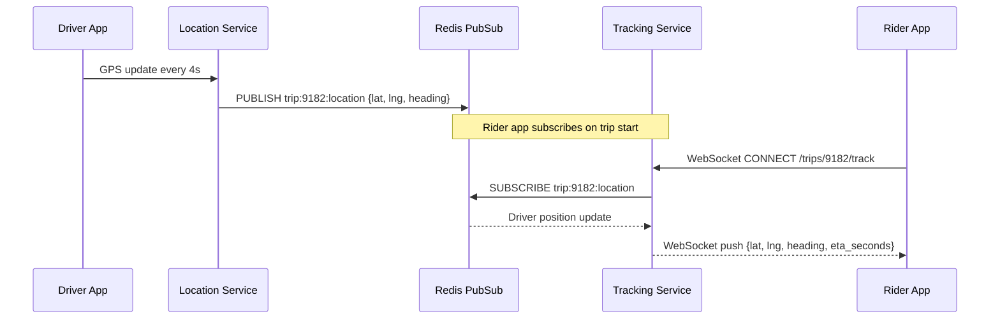

**WebSocket connection management:**
- Each active trip maintains one WebSocket connection per rider
- Connection established on trip match; torn down on trip completion or cancellation
- If rider loses connection, they reconnect and get the latest cached position from Redis
- See [Chapter 12 — Communication Protocols](/system-design/part-2-building-blocks/ch12-communication-protocols) for connection lifecycle details

**Heading interpolation:** The driver app sends position every 4 seconds, but the rider sees smooth movement. The client-side app interpolates between GPS positions using the heading and speed values, creating apparent real-time movement from 4-second samples.

### 4.6 Surge Pricing

Surge pricing adjusts fares upward when driver supply is insufficient to meet rider demand in a geographic zone.

**Surge zones:** Each city is divided into fixed geographic zones (e.g., using geohash precision 5, giving ~2.4 km × 2.4 km cells). A background service recalculates surge for each zone every 30 seconds.

**Surge multiplier formula:**

```
demand_rate     = ride_requests_in_zone / last_5_minutes
supply_rate     = available_drivers_in_zone / last_5_minutes

demand_supply_ratio = demand_rate / max(supply_rate, 1)

surge_multiplier =
    if ratio < 0.5:  1.0   (no surge — oversupplied)
    if ratio < 1.0:  1.0   (no surge — balanced)
    if ratio < 1.5:  1.2×  (light surge)
    if ratio < 2.0:  1.5×  (moderate surge)
    if ratio < 3.0:  1.8×  (high surge)
    if ratio >= 3.0: 2.0×  (cap at 2× to avoid PR issues in most markets)
```

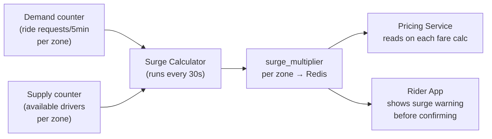

**Surge display UX:** Before the rider confirms a surge-priced ride, the app shows the multiplier explicitly and requires confirmation. This is both a legal requirement (in many jurisdictions) and a product design pattern to manage rider expectations.

**Surge decay:** After supply catches up (drivers move into the zone attracted by higher fares), the surge multiplier decays on the next 30-second recalculation cycle. The system naturally self-regulates.

### 4.7 Fare Calculation

```
base_fare     = flat rate per vehicle type (e.g., $2.00 for UberX)
distance_fare = distance_km × per_km_rate (e.g., $0.90/km)
time_fare     = duration_minutes × per_min_rate (e.g., $0.15/min)
subtotal      = base_fare + distance_fare + time_fare
surge_fare    = subtotal × surge_multiplier

final_fare    = max(surge_fare, minimum_fare)  # e.g., minimum $5.00

platform_fee  = final_fare × 0.25             # 25% commission
driver_payout = final_fare - platform_fee
```

**GPS-based metering:** In-progress trip distance is computed by integrating the driver's GPS positions using the Haversine formula. This requires the location history to be reliable and low-latency — another reason GPS updates cannot be dropped during the trip.

### 4.8 Payment Flow

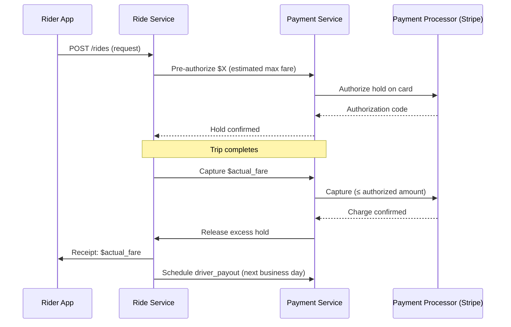

**Pre-authorization strategy:** The system pre-authorizes the estimated fare + 20% buffer at request time. This protects against card declines mid-trip. On completion, only the actual fare is captured; the remaining hold is released automatically.

---

## Step 5 — Deep Dives

### 5.1 Handling 250,000 Location Updates Per Second

The GPS ingestion pipeline is the highest-throughput component. A naive implementation — one Redis write per GPS update — creates a write amplification problem.

**Architecture for scale:**

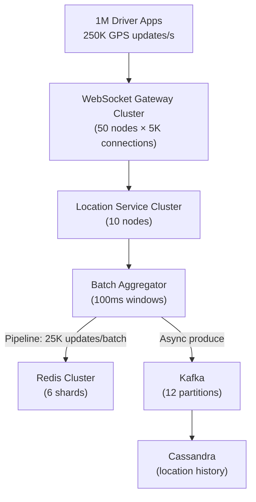

**Sharding the Redis geospatial index:**

A single Redis `GEOADD` key called `drivers:available` would hold 1M entries. With 250K updates/second, even Redis (capable of ~100K ops/s for simple gets) would be overwhelmed.

Solution: **Shard by city or geohash prefix:**

```
drivers:available:nyc         → New York City drivers (~50K drivers)
drivers:available:sf          → San Francisco drivers (~8K drivers)
drivers:available:la          → Los Angeles drivers (~30K drivers)
drivers:available:9q8         → Geohash prefix-based shard
```

Each shard fits on a dedicated Redis node. GEORADIUS queries route to the correct shard based on pickup location. With 6 shards averaging ~166K drivers each, write throughput per shard drops to ~40K updates/second — well within a single Redis node's capacity.

**Kafka for durability and fanout:**

GPS updates also flow to Kafka for:
1. **Location history** (Cassandra consumer) — needed for trip dispute resolution and route playback
2. **Analytics** (Spark consumer) — aggregate movement patterns for city planning, demand prediction
3. **Surge pricing** (surge calculator consumer) — real-time supply counting per zone
4. **ETA service** (traffic model consumer) — actual vs predicted travel times

### 5.2 ETA Estimation

ETA is displayed to the rider before matching (estimated pickup time) and during the trip (estimated arrival at dropoff).

**ETA pipeline:**

```
1. Routing engine (OSRM / Valhalla) computes base route + time
   using road network graph (OpenStreetMap or HERE Maps data)

2. Traffic layer adjusts base time:
   adjusted_eta = base_eta × traffic_factor(hour, day, segment)

   traffic_factor from:
   - Real-time GPS probe data (aggregate driver speeds per road segment)
   - Historical travel times (P50 for same segment, same hour of week)
   - Incident reports (accidents, closures) from third-party feed

3. Driver-specific adjustment:
   driver_eta = adjusted_eta × driver_speed_factor
   (derived from driver's historical on-time performance)

4. Confidence interval:
   Display range: P25–P75 of historical samples
   "Arriving in 8–12 minutes"
```

**ETA accuracy at Uber:** Uber uses deep learning models that incorporate hundreds of features (time of day, weather, day of week, local events, road segment congestion). The system achieves median ETA error of ~90 seconds for pickup ETAs. For interviews, the OSRM + traffic factor approach is sufficient.

### 5.3 Real-World: Uber's H3 Hexagonal Grid

Uber open-sourced H3 in 2018 as a replacement for their earlier geohash-based indexing. Understanding why illuminates the tradeoffs.

**Why hexagons over squares?**

```
Square grid: A cell has 8 neighbors.
             Corner neighbors are √2 × farther than edge neighbors.
             This creates directional bias in proximity calculations.

Hexagonal grid: A cell has exactly 6 neighbors.
                All neighbors are equidistant from the center.
                No directional bias — critical for fair surge pricing.
```

If surge pricing uses square zones, a driver at the corner of three zones is "closer" to two of them than the third — even if physically equidistant. Hexagonal zones eliminate this.

**H3 resolution levels:**

| Resolution | Cell diameter | Typical use |
|------------|---------------|-------------|
| 7 | ~1.2 km | City-wide demand heatmaps |
| 8 | ~461 m | Surge pricing zones |
| 9 | ~174 m | Pickup zone precision |
| 10 | ~65 m | Driver-to-rider matching |
| 11 | ~24 m | Precise geofencing |

**H3 in driver matching at Uber:**

```python
import h3

# Driver sends GPS update
driver_lat, driver_lng = 37.7751, -122.4193
resolution = 9  # ~174m cells for matching

# Encode driver position
h3_cell = h3.geo_to_h3(driver_lat, driver_lng, resolution)
# → "8928308280fffff"

# Matching: find drivers in rider's cell + 1-ring neighbors
rider_cell = h3.geo_to_h3(rider_lat, rider_lng, resolution)
search_cells = h3.k_ring(rider_cell, k=1)  # center + 6 neighbors = 7 cells
# No boundary problem: hexagonal k-ring is symmetric by definition
```

The H3 hexagonal k-ring eliminates the 8-neighbor-query complexity of geohash and produces geometrically consistent search areas regardless of direction.

**Production deployment:** Uber stores H3 cell IDs as keys in Redis hashes. Each cell maps to a set of driver IDs. Updates are O(1) hash operations. The hexagonal grid also powers surge pricing heatmaps, ETAs, and demand forecasting — all on a single unified spatial index.

---

## Architecture Diagram — Complete System

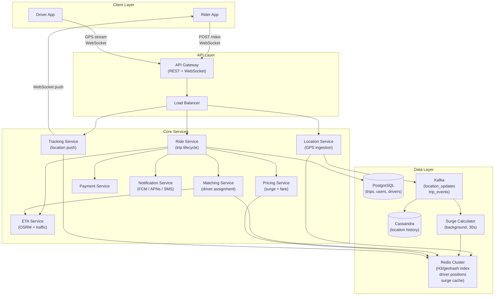

---

## Key Takeaway

> **Ride-sharing is a masterclass in multi-dimensional systems design: the geospatial layer (geohash or H3) makes proximity search possible at millisecond latency; the location service must ingest 250,000+ GPS updates per second without dropping any; matching must optimize for ETA, not raw distance; and surge pricing requires a spatial aggregation pipeline that runs every 30 seconds. Any interview answer that does not address geospatial indexing, GPS update throughput, and the matching algorithm independently has missed the three core technical challenges. Uber's switch from geohash to H3 is a real-world case study in why hexagonal geometry produces fairer, more accurate proximity queries than rectangular grids.**

---

## Practice Questions

1. **Geospatial Indexing Trade-offs:** Your city deployment has a dense downtown core (50,000 drivers in 5 km²) and sparse suburbs (500 drivers in 50 km²). A fixed geohash precision 6 gives you ~0.6 km cells. Explain why this is suboptimal for both zones. How does a quadtree adaptive index address this? What are its operational complexity trade-offs vs. a fixed-precision geohash?

2. **Location Update Thundering Herd:** Your Location Service cluster receives 250,000 GPS updates per second normally. At 5:00 PM on a Friday, all 1 million active drivers simultaneously accelerate — their apps send a burst of 400,000 updates in a single second. Your Redis pipeline batch size is 25,000 over 100ms windows. Walk through exactly what happens to your pipeline, what queues fill up, what latency increases, and how you detect and mitigate this spike without dropping updates.

3. **Driver Matching Consistency:** A rider submits a request. The Matching Service queries Redis and finds driver A as the best candidate. Before the offer is sent, driver A accepts another ride from a different city instance that also queried the same Redis and also selected driver A. Both Ride Service instances now believe driver A is assigned to their respective trips. Describe the race condition in detail and design a solution using Redis atomic operations that prevents double-assignment.

4. **Surge Pricing Fairness:** Your surge pricing algorithm recalculates every 30 seconds. A major concert ends at 10 PM — 20,000 people request rides simultaneously in a 1 km² area. Your surge calculator has 30 seconds of lag before it detects the demand spike. During those 30 seconds, thousands of riders book at non-surge prices while supply is severely constrained. Design a system that detects demand spikes within 5 seconds and applies temporary surge pricing, without creating false surges from normal traffic variation.

5. **Trip Dispute Resolution:** A rider claims the trip distance was 8 km but the fare was calculated for 15 km. Your location history in Cassandra has GPS samples every 30 seconds for cost reasons (not every 4 seconds). How do you calculate the actual trip distance from sparse samples? What is the maximum possible error from 30-second sampling at typical urban speeds? Design a dispute resolution data model that gives customer support the tools to adjudicate the claim accurately.
