# Chapter 23: Cloud-Native & Serverless


> Infrastructure is no longer something you buy — it is something you declare. Cloud-native systems treat every resource as ephemeral, every configuration as code, and every failure as expected. The teams that master this shift spend less time managing machines and more time shipping value.

---

## Mind Map

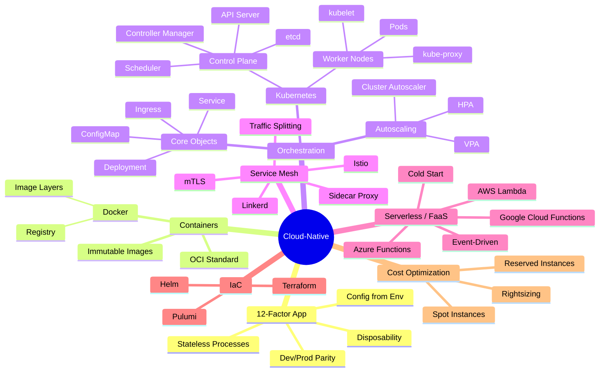

---

## What Cloud-Native Means

**Cloud-native** is not simply "running on a cloud provider." It is a design philosophy: build applications that exploit the dynamic, distributed nature of modern infrastructure rather than fighting it. The Cloud Native Computing Foundation (CNCF) defines cloud-native systems as those that use containers, microservices, immutable infrastructure, and declarative APIs to enable loosely-coupled, resilient, and observable workloads.

Four pillars underpin every cloud-native system:

1. **Containers** — Package code and dependencies together so the environment is reproducible everywhere
2. **Orchestration** — Automate deployment, scaling, and self-healing across fleets of machines
3. **Dynamic configuration** — Separate config from code; change behavior without rebuilding images
4. **Observable by default** — Emit metrics, traces, and logs as a first-class output of every service

---

## The 12-Factor App

The [12-Factor App](https://12factor.net/) methodology (originally authored by Heroku engineers) defines the practices that make a service portable, scalable, and operable in cloud environments. It predates Kubernetes but remains the foundation of cloud-native application design.

| Factor | Name | Principle |
|---|---|---|
| **I** | Codebase | One codebase tracked in version control; many deploys |
| **II** | Dependencies | Explicitly declare and isolate all dependencies |
| **III** | Config | Store config in the environment (not in code) |
| **IV** | Backing Services | Treat databases, queues, SMTP as attached resources |
| **V** | Build, Release, Run | Strictly separate build and run stages |
| **VI** | Processes | Execute the app as one or more stateless processes |
| **VII** | Port Binding | Export services via port binding |
| **VIII** | Concurrency | Scale out via the process model |
| **IX** | Disposability | Fast startup and graceful shutdown |
| **X** | Dev/Prod Parity | Keep development, staging, and production as similar as possible |
| **XI** | Logs | Treat logs as event streams; never manage log files |
| **XII** | Admin Processes | Run admin/management tasks as one-off processes |

**Critical factors in practice:** Config from environment (Factor III) is violated most frequently — teams hardcode database URLs or API keys in source code, breaking portability. Disposability (Factor IX) is the most impactful — services that start in under 5 seconds can be killed and rescheduled without impacting availability, which is the foundation of Kubernetes rolling deployments.

---

## Containers: Docker and the Image Layer Model

A **container** is a lightweight, isolated process that shares the host OS kernel but has its own filesystem, network namespace, and process tree. Unlike virtual machines, containers do not include a full OS — they share the kernel, making them fast to start (milliseconds) and small (megabytes).

### Docker Image Layers

Docker images are built as a stack of read-only layers. Each instruction in a `Dockerfile` creates a new layer. When a container runs, a thin writable layer is added on top. Layers are content-addressed and cached — if a layer has not changed, Docker reuses it from cache.

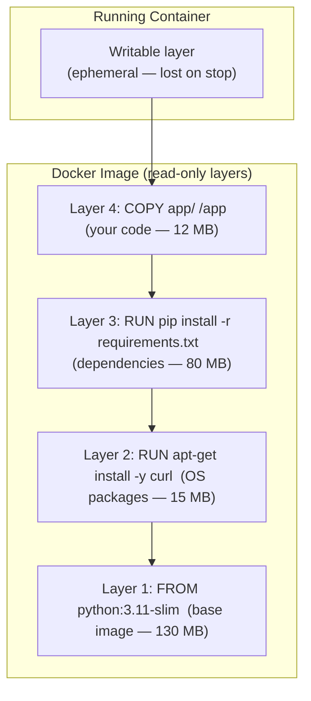

**Why layers matter for system design:**

- **Layer caching:** Build pipelines reuse unchanged layers. Put `COPY requirements.txt` and `RUN pip install` before `COPY app/` so dependency installation is cached until `requirements.txt` changes.
- **Layer sharing:** Two containers based on the same base image share those layers on disk. A host running 50 Python services shares the `python:3.11-slim` layer once.
- **Immutability:** Images never change after build. Upgrades are new images, not patches to running containers. This makes rollback trivial: redeploy the previous image tag.

### Container vs Virtual Machine

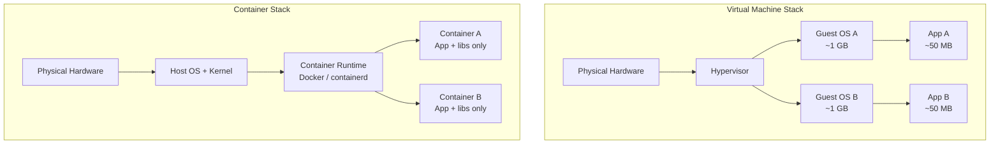

| Dimension | Virtual Machine | Container |
|---|---|---|
| **Startup time** | 30–90 seconds | < 1 second |
| **Image size** | 1–10 GB (includes full OS) | 10–500 MB (app + libs) |
| **Isolation** | Full hardware virtualization | OS-level namespaces |
| **Density** | 10s per host | 100s per host |
| **Security boundary** | Hypervisor (strong) | Kernel namespaces (weaker) |
| **Overhead** | 5–15% CPU/memory | < 2% |
| **Portability** | Hypervisor-dependent | Runs anywhere with container runtime |

---

## Kubernetes Architecture

**Kubernetes (K8s)** is the de facto standard for container orchestration. It abstracts a fleet of machines into a single compute pool and handles scheduling, scaling, self-healing, and service discovery declaratively — you describe the desired state, and Kubernetes continuously works to achieve it.

### Control Plane + Worker Node Architecture

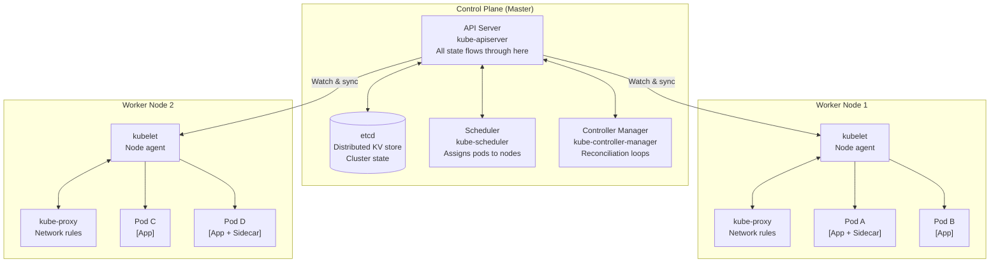

**Control Plane components:**

- **API Server** — The single source of truth. Every kubectl command, every controller, every node agent communicates exclusively through the API server. It validates and persists state to etcd.
- **etcd** — A distributed, strongly-consistent key-value store. The only stateful component in the control plane. All cluster state lives here. Losing etcd without a backup means losing the cluster.
- **Scheduler** — Watches for new pods with no assigned node. Selects the best node based on resource requests, affinity rules, taints/tolerations, and topology constraints.
- **Controller Manager** — Runs reconciliation loops for built-in controllers: ReplicaSet controller ensures the correct number of pod replicas exist; Node controller monitors node health; Deployment controller manages rolling updates.

**Worker Node components:**

- **kubelet** — The node agent. Receives pod specs from the API server and ensures the described containers are running via the container runtime (containerd or CRI-O).
- **kube-proxy** — Maintains iptables/IPVS rules that implement Kubernetes Service routing. When a service receives traffic, kube-proxy forwards it to one of the backing pods.

### Kubernetes Core Objects

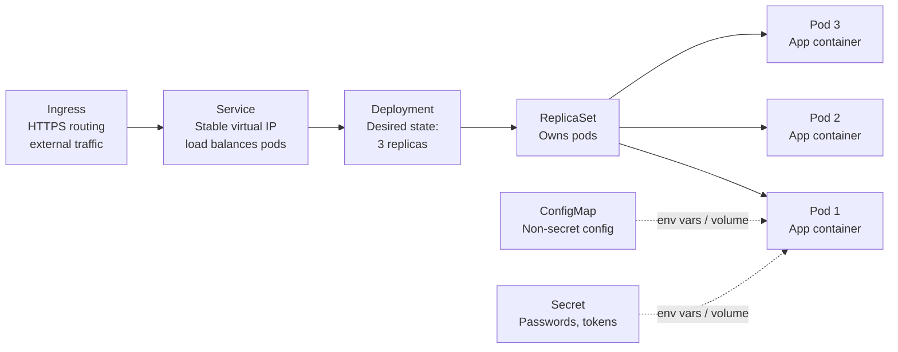

| Object | Purpose | Example |
|---|---|---|
| **Pod** | Smallest deployable unit; one or more containers sharing network + storage | `app` + `envoy` sidecar |
| **Deployment** | Declares desired state for stateless workloads; manages rolling updates and rollbacks | `replicas: 3`, `image: api:v2.1` |
| **Service** | Stable virtual IP + DNS name in front of a pod set; load balances traffic | `order-service.default.svc.cluster.local` |
| **Ingress** | HTTP/HTTPS routing from outside the cluster to internal services | `api.example.com → api-service:443` |
| **ConfigMap** | Non-sensitive key-value config injected as env vars or files | `DATABASE_HOST=postgres.internal` |
| **Secret** | Base64-encoded sensitive config; backed by etcd encryption at rest | `DB_PASSWORD=<encrypted>` |
| **StatefulSet** | Like Deployment but for stateful workloads; stable pod identity + ordered scaling | Kafka, Postgres, Zookeeper |
| **HorizontalPodAutoscaler** | Scales replicas based on CPU, memory, or custom metrics | `targetCPUUtilization: 70%` |

---

## Kubernetes Autoscaling Deep Dive

Kubernetes offers three layers of autoscaling that work together to match capacity to demand.

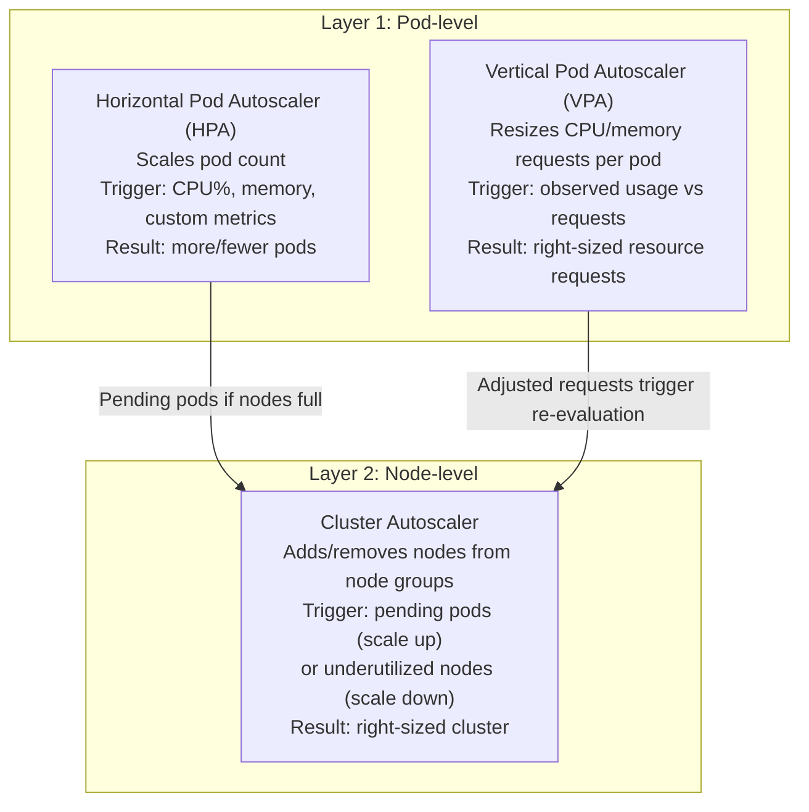

**How they interact in practice:**

1. Traffic spikes → CPU utilization rises above HPA threshold
2. HPA increases replica count: 3 → 8 pods
3. New pods have `Pending` status — no nodes have capacity
4. Cluster Autoscaler detects pending pods → provisions new nodes from the cloud provider's node group
5. Pods schedule onto new nodes → CPU drops → system stabilizes

**HPA configuration example:**

```yaml
apiVersion: autoscaling/v2
kind: HorizontalPodAutoscaler
metadata:
  name: api-service-hpa
spec:
  scaleTargetRef:
    apiVersion: apps/v1
    kind: Deployment
    name: api-service
  minReplicas: 3
  maxReplicas: 50
  metrics:
    - type: Resource
      resource:
        name: cpu
        target:
          type: Utilization
          averageUtilization: 70
    - type: Pods
      pods:
        metric:
          name: http_requests_per_second
        target:
          type: AverageValue
          averageValue: "1000"
```

**VPA vs HPA trade-off:** HPA scales horizontally (more pods) and is best for stateless services where horizontal scaling is cheap. VPA scales vertically (bigger pods) and is better for stateful workloads or services that cannot be parallelized. They should not both manage CPU/memory for the same deployment simultaneously — VPA's resource changes cause pod restarts, which conflicts with HPA's scaling actions.

---

## Service Mesh: Sidecar Proxy Pattern

As covered in [Chapter 13](/system-design/part-3-architecture-patterns/ch13-microservices), a service mesh externalizes networking concerns from application code. Here the focus is on the **data plane mechanics** — how the sidecar intercepts traffic and what it enables.

### Sidecar Injection and Traffic Interception

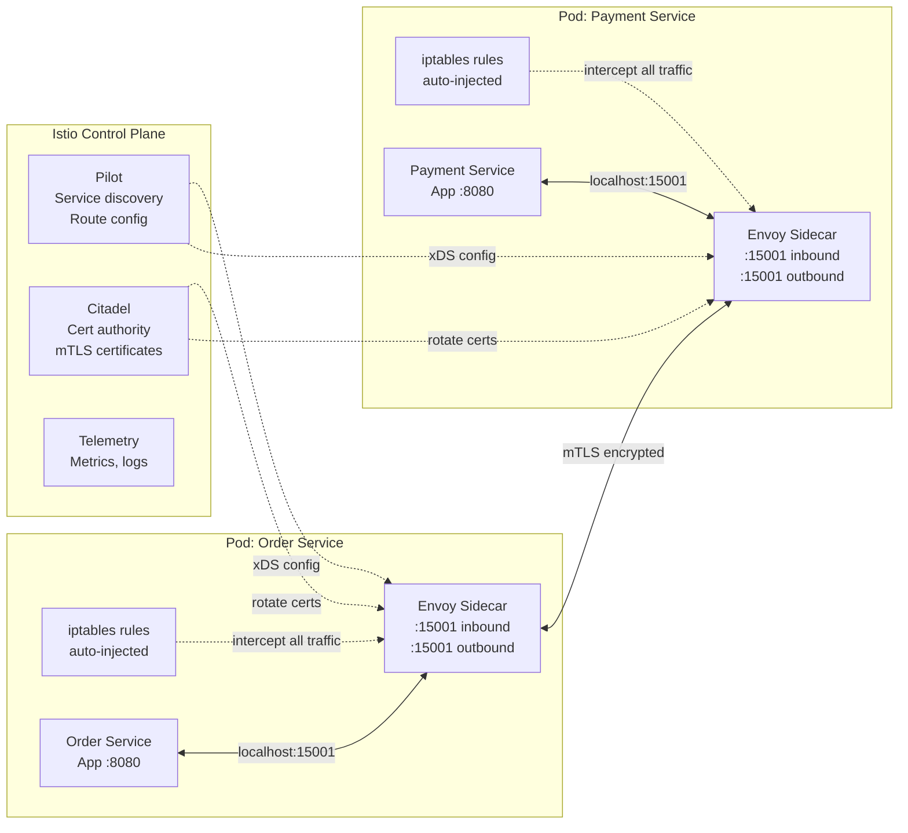

**Key capability: mTLS everywhere.** Without a service mesh, enforcing mutual TLS between all services requires every team to correctly configure TLS in their HTTP client and server. With a mesh, the sidecar handles certificate rotation and mTLS negotiation transparently — the application code uses plain HTTP on localhost, and the mesh upgrades it to mTLS on the wire.

**Key capability: traffic splitting for canary releases.** A mesh policy routes 5% of traffic to `api:v2` and 95% to `api:v1` based on a weight rule, not DNS. This enables progressive delivery without DNS TTL delays or dual-deployment routing hacks.

---

## Serverless / FaaS

**Serverless** (more precisely, **Function as a Service / FaaS**) eliminates infrastructure management entirely. You deploy a function — a single handler — and the cloud provider handles provisioning, scaling, patching, and availability. You pay only for the compute time consumed, measured in 100ms increments.

### Lambda Request Lifecycle

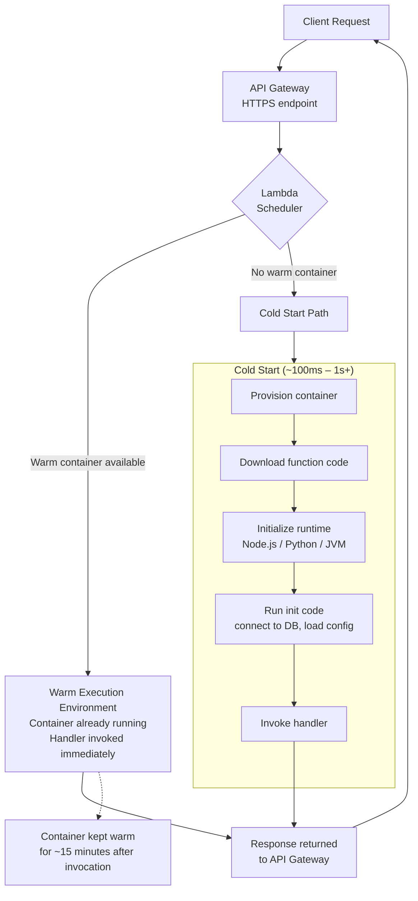

### Serverless Event-Driven Patterns

Serverless functions are not just for HTTP — they shine in event-driven pipelines:

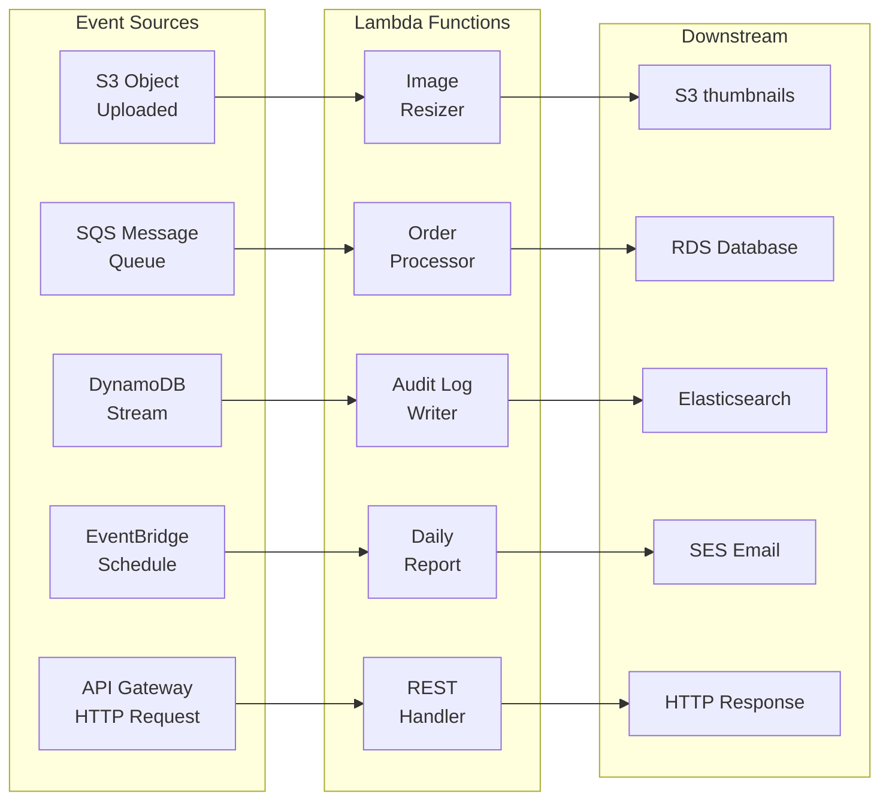

---

## The Cold Start Problem

Cold starts are the primary performance challenge of serverless. When no warm execution environment exists for a function, the cloud provider must provision a container, download the deployment package, initialize the runtime, and run initialization code — before the handler even executes.

### Cold Start Causes and Mitigations

| Cause | Impact | Mitigation |
|---|---|---|
| **No warm container available** | 100ms – 3s delay | Provisioned concurrency (pre-warm N containers) |
| **Large deployment package** | Slower download | Keep packages lean; use Lambda Layers for shared deps |
| **Heavy JVM / .NET runtime** | 500ms – 2s init | Prefer Node.js or Python runtimes; use GraalVM native image for JVM |
| **Expensive init code** | Adds directly to cold start | Move DB connections and config loading outside handler function |
| **Low invocation frequency** | More cold starts | Scheduled pings every 5 min; Provisioned Concurrency |
| **VPC attachment** | +1–3s for ENI provisioning | Use VPC Lambda only when necessary; pre-warm ENIs |
| **First deploy after update** | All instances cold | Blue/green Lambda deployments with traffic shifting |

**Provisioned Concurrency** is AWS Lambda's solution: you pay for N pre-warmed instances to be perpetually ready, eliminating cold starts for predictable baseline traffic. Above provisioned concurrency, normal on-demand scaling applies.

**Init code optimization example:**

```python
# WRONG: Database connection created inside handler (every cold start AND warm start)
def handler(event, context):
    conn = create_db_connection()  # expensive
    return query(conn, event)

# CORRECT: Connection created once at module level (only on cold start)
conn = create_db_connection()  # runs once per container lifetime

def handler(event, context):
    return query(conn, event)   # reuses existing connection
```

---

## Compute Model Comparison

| Dimension | EC2 (Reserved) | EC2 (Spot) | ECS / Fargate | AWS Lambda |
|---|---|---|---|---|
| **Unit of billing** | Per hour (1 or 3 yr commitment) | Per hour (interruptible) | Per vCPU-second + GB-second | Per 100ms + requests |
| **Cold start** | None (always on) | None (always on) | 5–30s (container start) | 100ms – 3s (runtime init) |
| **Idle cost** | Full price | Full price | Per-task billing | Zero |
| **Max duration** | Unlimited | Unlimited | Unlimited | 15 minutes |
| **Scaling speed** | Minutes (new instance) | Minutes | 30–60s | Seconds (burst) |
| **Operational overhead** | High (OS patches, sizing) | High + spot interruptions | Medium (no OS, but cluster config) | Very low |
| **Max concurrency** | Depends on app | Depends on app | Depends on cluster | 1,000 default (increase by request) |
| **Best for** | Long-running, predictable load | Batch workloads, fault-tolerant jobs | Containerized APIs, background workers | Event-driven, spiky, short-duration |
| **Cost vs Lambda** | Cheaper at sustained >70% utilization | Cheapest for batch (60–90% discount) | Middle ground | Cheapest for spiky/low-traffic workloads |

**Rule of thumb for cost optimization:**

- Sustained high traffic (>70% CPU utilization) → Reserved EC2 or Reserved Fargate
- Batch jobs with flexible timing → Spot instances (70–90% cheaper, accept 2-min interruption warning)
- APIs and event processors with variable traffic → Lambda (pay only for what you use)
- Mix: use Reserved for baseline, Spot for burst capacity, Lambda for event processing

---

## When to Use Serverless vs Containers

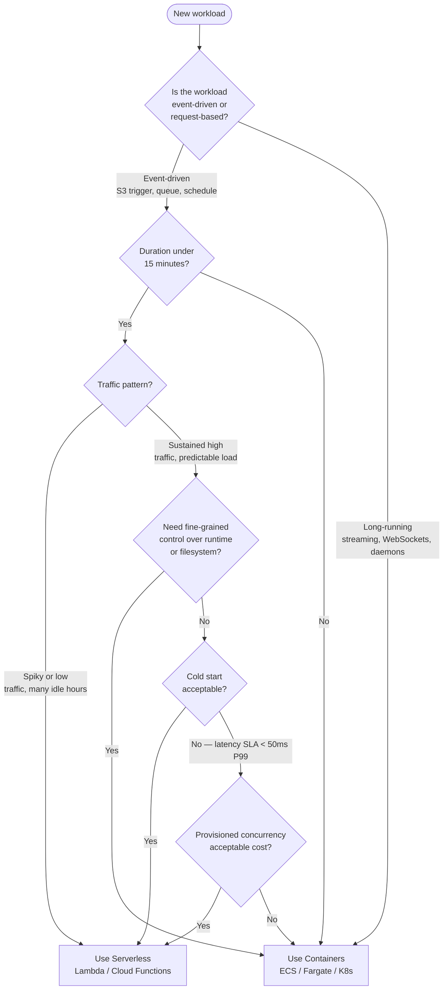

---

## Infrastructure as Code

**Infrastructure as Code (IaC)** applies software engineering practices — version control, code review, testing — to infrastructure provisioning. The cloud state is declared in files, not configured via console clicks that are impossible to audit or reproduce.

### Terraform Workflow

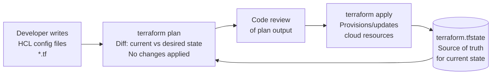

**Example: Kubernetes cluster + Lambda in the same Terraform config:**

```hcl
# EKS cluster for long-running services
resource "aws_eks_cluster" "main" {
  name     = "production"
  role_arn = aws_iam_role.eks.arn
  version  = "1.29"
}

# Lambda for event processing
resource "aws_lambda_function" "image_processor" {
  function_name = "image-processor"
  runtime       = "python3.11"
  handler       = "handler.process"
  memory_size   = 512
  timeout       = 30
  filename      = "image_processor.zip"
}
```

**IaC tools comparison:**

| Tool | Language | State Backend | Best For |
|---|---|---|---|
| **Terraform** | HCL (declarative) | Remote (S3 + DynamoDB lock) | Multi-cloud, large teams, mature ecosystem |
| **Pulumi** | TypeScript / Python / Go | Pulumi Cloud or self-hosted | Teams preferring real programming languages |
| **AWS CDK** | TypeScript / Python / Java | CloudFormation | AWS-only, developer-friendly |
| **Helm** | YAML + Go templates | Kubernetes cluster | Kubernetes application packaging |
| **Ansible** | YAML (imperative) | Agentless push | Configuration management, OS-level |

---

## Real-World: Airbnb's Migration to Kubernetes

Airbnb operated a large Rails monolith on manually managed EC2 instances for years. By 2018, their engineering challenges were well-known: deployment took 30+ minutes, scaling was manual, and environment inconsistencies caused "works on my machine" failures.

### The Migration Journey

**Phase 1: Containerize (2018)**
Airbnb began Dockerizing their services without changing deployment infrastructure. This exposed the "it works in Docker locally but fails on EC2" class of bugs — forcing environment parity. Outcome: 30-minute deployments shrank to 12 minutes.

**Phase 2: Kubernetes on AWS (2019)**
Airbnb moved workloads to Kubernetes (EKS). The first services migrated were stateless API services — lowest risk. They built internal tooling (`Deployboard`) to give engineers a UI over `kubectl apply`.

**Phase 3: Autoscaling and cost optimization (2020–2021)**
With HPA and Cluster Autoscaler in place, Airbnb's infrastructure automatically shrank during off-peak hours (nights, COVID-19 travel collapse in 2020). The Cluster Autoscaler was responsible for significant cost savings during the pandemic — cluster size reduced from hundreds to dozens of nodes automatically, with no manual intervention.

**Phase 4: Standardized service platform (2022–present)**
Airbnb built `OneTouch`, an internal developer platform abstracting Kubernetes complexity. Engineers define a service in a YAML manifest (name, language, resources, dependencies) and the platform handles Kubernetes Deployment, Service, HPA, Ingress, and monitoring configuration automatically.

### Key Outcomes

| Metric | Before K8s | After K8s |
|---|---|---|
| Deployment time | 30+ minutes | < 5 minutes |
| Environment parity issues | Frequent | Near-zero |
| Infrastructure cost (2020 dip) | Manual scaling required | Auto-scaled down 80% |
| Developer time on infra config | Hours per service | Minutes (platform abstraction) |
| Rollback time | 20–40 minutes (re-deploy) | < 2 minutes (image tag revert) |

**Lessons applicable to any migration:**
1. Containerize first — separate the "wrap in Docker" step from the "move to K8s" step
2. Migrate stateless services first — reduce blast radius of early mistakes
3. Build developer tooling — raw `kubectl` is not a developer experience; wrap it
4. Use Cluster Autoscaler from day one — the cost savings justify K8s overhead alone

---

## Key Takeaway

> **Cloud-native is an operational philosophy, not a technology checklist.** Containers give you reproducibility, Kubernetes gives you resilience and scale, service meshes give you network control without code changes, and serverless gives you zero-idle-cost event processing. The right architecture combines all four based on workload characteristics: use containers for long-running, stateful, latency-sensitive services; use serverless for event-driven, short-duration, spiky workloads; use IaC to make every infrastructure decision auditable, reproducible, and reviewable. The teams that win at cloud-native are not the ones running the most sophisticated tooling — they are the ones with the clearest deployment abstractions, the fastest feedback loops, and the discipline to treat infrastructure as code.

---

## Practice Questions

1. **Container Optimization:** A team's Docker image for their Python API is 1.4 GB and takes 4 minutes to build in CI. Describe three specific changes to the Dockerfile and build process that would reduce both image size and build time. Explain why each change helps, referencing the layer caching model.

2. **Kubernetes Autoscaling:** Your e-commerce API is deployed on Kubernetes with HPA configured at 70% CPU target, min 3 replicas, max 20 replicas. During a flash sale, traffic spikes 10x in 30 seconds, but you observe a 2-minute gap before new pods come online, causing 503 errors. Diagnose the likely bottleneck (HPA, Cluster Autoscaler, container startup) and describe how you would eliminate or reduce the gap.

3. **Serverless Trade-offs:** A startup is building a document processing pipeline: users upload PDFs, the system extracts text, runs ML inference, and stores results. Documents vary from 10KB to 500MB. Processing time ranges from 2 seconds to 25 minutes. Design the compute architecture. Would you use Lambda, Fargate, EC2, or a combination? Justify the boundary between serverless and containerized components, and explain how you handle the 15-minute Lambda timeout constraint.

4. **Service Mesh Decision:** Your platform runs 15 microservices. Security requires mTLS between all services and full audit logs of all inter-service calls. A junior engineer suggests implementing mTLS in each service's HTTP client. A senior engineer proposes Istio. Evaluate both approaches on four dimensions: implementation effort, operational overhead, security guarantees, and observability. Make a recommendation with justification.

5. **Cost Architecture:** Your analytics platform runs 24/7 and processes events in two modes: real-time dashboard queries (P99 < 200ms, up to 5,000 req/s during business hours, near-zero at night) and batch aggregations (run at 2 AM, take 45 minutes, require 64 cores). Design the compute architecture to minimize cost while meeting SLAs. Specify which workload uses Reserved EC2, Spot, Fargate, or Lambda, and explain the cost reasoning for each choice.
