# Chapter 24: ML Systems & AI Infrastructure


> Machine learning systems are software systems with an additional dimension of complexity: the behavior of the system is determined not only by code, but by data and model weights that evolve over time. Building reliable ML systems requires applying the full discipline of software engineering — versioning, testing, monitoring, deployment automation — to artifacts that most software engineers have never had to version before: datasets, feature pipelines, and trained model files.

---

## Mind Map

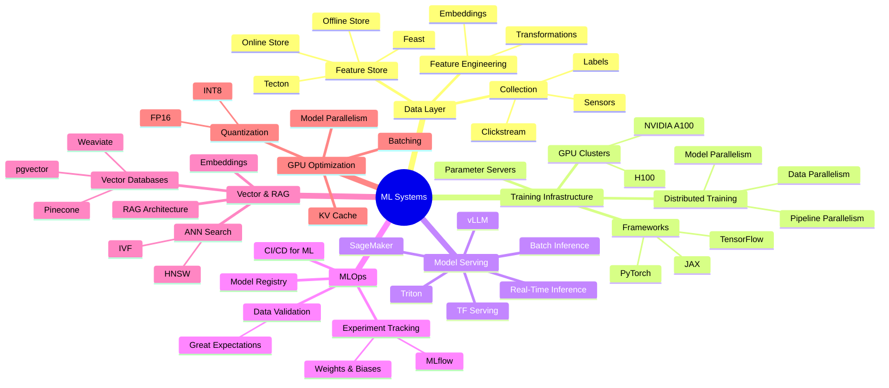

---

## The ML System Landscape

A production ML system is not a Jupyter notebook deployed as a Flask app. It is a complex sociotechnical system spanning data engineering, distributed computing, model development, and operational infrastructure. Google's landmark paper "Machine Learning: The High-Interest Credit Card of Technical Debt" identified the core challenge: ML code is typically a small fraction of a production ML system — the surrounding infrastructure for data collection, feature computation, model serving, monitoring, and configuration management is far larger and harder to maintain.

The five phases of every ML pipeline:

1. **Data Collection** — Ingest raw signals: user events, sensor readings, labels from human annotators
2. **Feature Engineering** — Transform raw data into numerical representations suitable for models
3. **Training** — Optimize model weights on historical data; potentially distributed across many Graphics Processing Units (GPUs)
4. **Evaluation** — Validate model quality on held-out data; run A/B tests in production
5. **Serving** — Deploy the model to make predictions on live traffic; batch or real-time

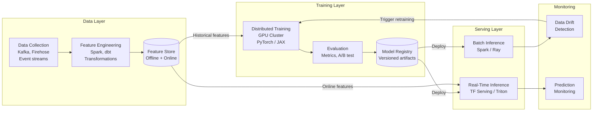

---

## Feature Stores

### Why Feature Stores Exist

The central problem feature stores solve is the **training-serving skew**: features computed during training must be computed identically during serving. Without a shared abstraction, ML teams reimplement the same feature logic in Python (training) and Java or Go (serving) — two codebases that inevitably diverge, silently degrading model accuracy.

A second problem is **feature reuse**. Across a large organization, dozens of teams independently compute "user's average purchase amount over the last 30 days." Without a shared store, each team writes, tests, and maintains their own version, often with subtle differences.

The third problem is **point-in-time correctness**. Training data must reflect the feature values that existed at the moment a label was generated — not the current values. A feature store with time-travel semantics prevents **data leakage**, where future information contaminates training labels.

### Feature Store Architecture

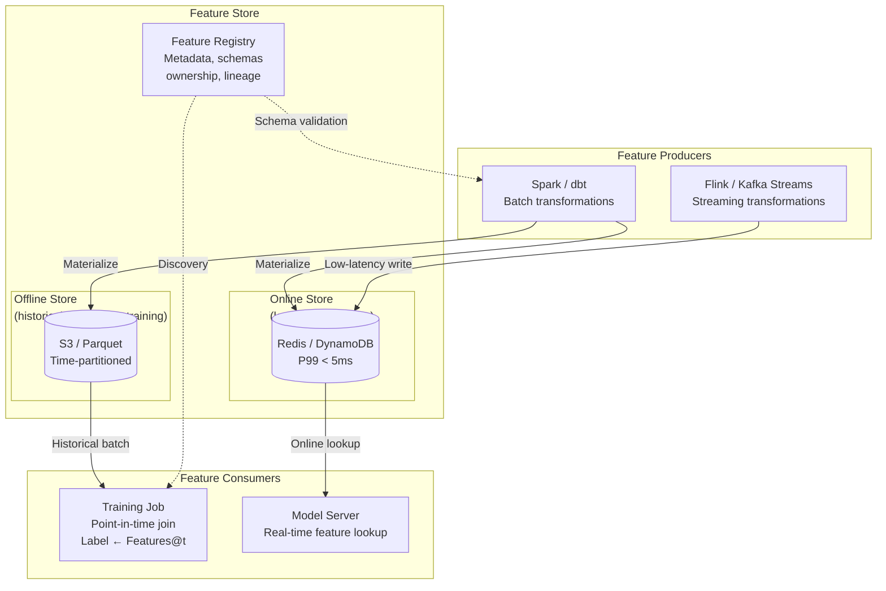

### Feast vs Tecton

| Dimension | Feast | Tecton |
|---|---|---|
| **Type** | Open-source | Managed SaaS |
| **Deployment** | Self-hosted on any cloud | [AWS, GCP, Databricks](https://www.tecton.ai/product/) — managed by Tecton |
| **Online store** | Redis, DynamoDB, Bigtable | Tecton-managed DynamoDB |
| **Offline store** | S3, GCS, BigQuery, Snowflake | S3, Snowflake, Databricks |
| **Streaming support** | Via Kafka + custom jobs | Native Spark Streaming, Kinesis |
| **Point-in-time joins** | Yes (offline only) | Yes (offline + backfills) |
| **Transformation engine** | External (user brings Spark/dbt) | Built-in Spark + managed pipelines |
| **Best for** | Teams wanting full control, budget-conscious | Large enterprises, managed infra preferred |
| **Operational overhead** | High — you run Redis, Spark, registry | Low — Tecton manages the stack |

**Design rule:** Use a feature store when: (a) more than one model uses the same feature, (b) features are expensive to compute (aggregations over billions of rows), or (c) the training-serving gap has caused accuracy regressions in production. For a single-model prototype, a feature store is premature.

---

## Training Infrastructure

### Distributed Training Strategies

Single-GPU training hits a wall on two dimensions: memory (a model must fit in GPU VRAM) and throughput (one GPU can only process so many examples per second). Distributed training solves both by spreading computation across many GPUs, often across many machines.

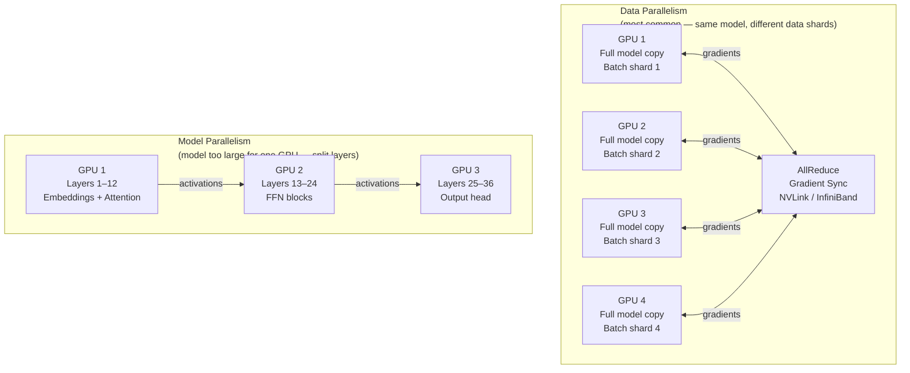

**Three parallelism strategies:**

| Strategy | What is split | When to use | Communication overhead |
|---|---|---|---|
| **Data parallelism** | Mini-batch split across GPUs; each GPU has full model copy | Model fits in one GPU; need throughput | AllReduce gradient sync each step — O(params) |
| **Model parallelism** | Model layers split across GPUs | Model too large for one GPU (LLMs, >7B params) | Activation tensors passed between GPUs each layer |
| **Pipeline parallelism** | Layers split; mini-batches pipelined through stages | LLMs + large batch sizes | Micro-batch bubbles between stages |
| **Tensor parallelism** | Individual weight matrices split across GPUs | Very large transformer layers | Requires high-bandwidth interconnect (NVLink) |

### GPU Cluster Architecture

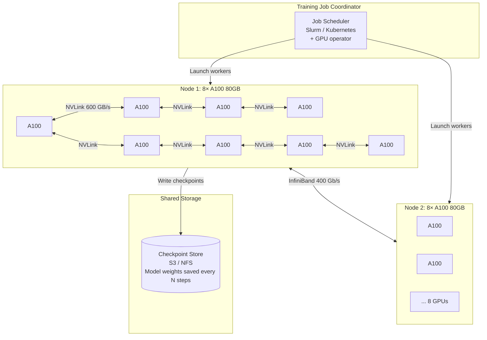

**Within-node vs. across-node communication is a critical design constraint.** NVLink between GPUs on the same node is ~600 GB/s. InfiniBand between nodes is ~400 Gb/s (50 GB/s) — roughly 12x slower. Training frameworks (PyTorch FSDP, DeepSpeed) are designed to minimize cross-node gradient communication by preferring data locality.

**Parameter servers** (an older pattern) used a centralized server to aggregate gradients. Modern training uses **AllReduce** (ring-based or tree-based) to aggregate gradients peer-to-peer without a bottleneck server. NCCL (NVIDIA Collective Communications Library) implements AllReduce optimized for GPU interconnects.

---

## Model Serving: Batch vs Real-Time

Serving is where the model generates business value. The serving architecture — batch or real-time — is determined by latency requirements, throughput, and the nature of the use case.

| Dimension | Batch Inference | Real-Time Inference |
|---|---|---|
| **Latency** | Hours to days (scheduled jobs) | Milliseconds (P99 < 100ms typical) |
| **Throughput** | Millions to billions of examples per run | Hundreds to thousands of QPS |
| **Trigger** | Schedule (nightly), event (bulk upload) | User request |
| **Infrastructure** | Spark, Ray, Kubernetes Jobs | TF Serving, Triton, vLLM, SageMaker |
| **GPU utilization** | Near 100% (large batches maximize GPU efficiency) | Often 20–60% (small batches from live traffic) |
| **Cost** | Low cost/prediction (high utilization) | Higher cost/prediction (idle capacity needed for latency SLA) |
| **Feature freshness** | Features from offline store (hours old) | Features from online store (seconds old) |
| **Error handling** | Retry job; re-run failed partitions | Fallback model, default value, circuit breaker |
| **Use cases** | Recommendation pre-computation, churn scoring, fraud scoring on past transactions | Search ranking, fraud detection on live payment, NLP response generation |
| **Output storage** | Written back to data warehouse / KV store | Returned in API response |

**Decision rule:** When you can pre-compute predictions for a known set of entities (all users, all products), batch inference is cheaper and simpler. When the prediction must incorporate events that just happened (user's last click, real-time transaction amount), real-time inference is required.

---

## Model Serving Architectures

### Overview

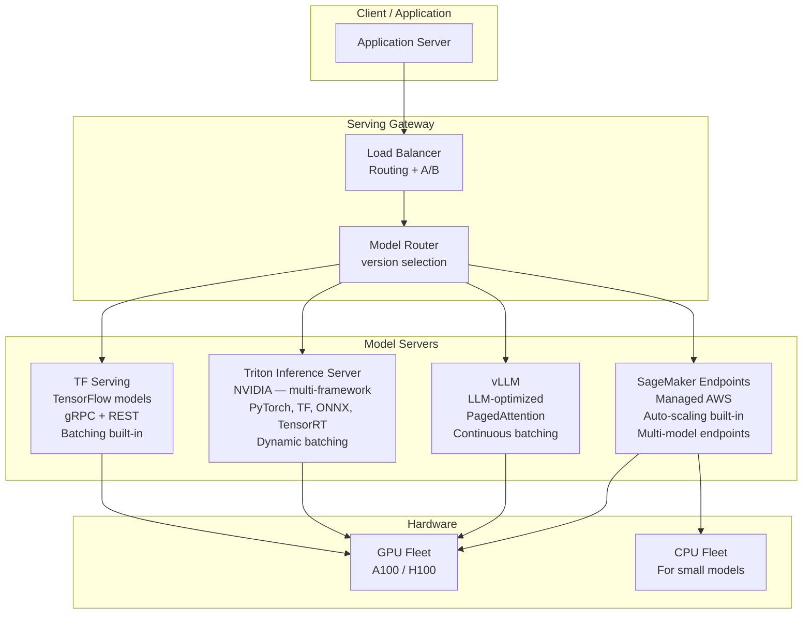

**TF Serving** is Google's production server for TensorFlow SavedModels. It supports server-side request batching (accumulates requests for up to N milliseconds and processes them as a single batch, increasing GPU utilization), model versioning with hot-swap (load a new model version without restart), and REST + gRPC protocols.

**Triton Inference Server** (NVIDIA) is framework-agnostic: it serves TensorFlow, PyTorch, ONNX, and TensorRT models from the same binary. Its key differentiator is the **backend plugin system** — custom backends can handle arbitrary computation. Triton's dynamic batching scheduler automatically combines concurrent requests into a single GPU call.

**vLLM** is purpose-built for large language models. Its breakthrough innovation is **PagedAttention**: KV cache memory is managed in fixed-size pages (like OS virtual memory paging), enabling serving many more concurrent requests than naive per-request KV cache allocation allows. It also implements **continuous batching** — new requests join a running batch as soon as a slot frees, rather than waiting for the entire batch to complete.

**SageMaker Endpoints** abstract all infrastructure: you upload a model artifact to S3, define an endpoint configuration (instance type, auto-scaling policy), and AWS manages model loading, health checks, traffic routing, and scaling. The trade-off is less control and higher cost per inference versus self-hosted Triton.

---

## MLOps: The ML Development Lifecycle

MLOps applies DevOps principles to machine learning: version everything, automate everything, monitor everything. The three pillars are experiment tracking, model registry, and Continuous Integration/Continuous Deployment (CI/CD) for ML.

### Experiment Tracking

Every training run should be reproducible. Experiment trackers record the complete provenance of a model: hyperparameters, dataset version, code commit, environment, and resulting metrics.

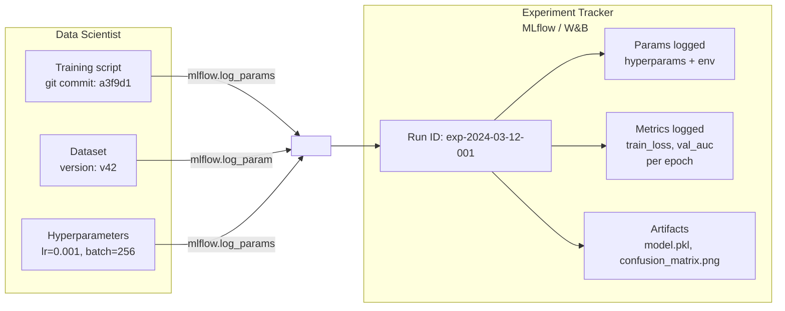

**MLflow** is the open-source standard: `mlflow.log_param()`, `mlflow.log_metric()`, `mlflow.log_artifact()` instrument any Python training script. The MLflow UI shows runs side-by-side for comparison. **Weights & Biases (W&B)** is the managed alternative with richer visualization, team collaboration features, and deeper integration with PyTorch training loops.

### Model Registry

A model registry is the deployment gatekeeper — it stores versioned model artifacts with metadata (metrics, dataset lineage, training config) and manages the promotion workflow from experimentation to production.

```mermaid
stateDiagram-v2
    [*] --> Staging : Data scientist registers model\nafter passing offline eval
    Staging --> Production : ML engineer approves\nafter shadow mode testing
    Production --> Archived : New version promotes;\nold version retired
    Staging --> Archived : Failed eval; not promoted
    Production --> Staging : Rollback triggered\nby monitoring alert
```

**Promotion checklist before Production:**
- Offline metrics exceed baseline (AUC, F1, RMSE depending on task)
- Shadow mode test: model runs in parallel without affecting users; predictions compared to production model
- Latency profiling: P99 < serving SLA under realistic concurrency
- Data validation: input feature distributions match training distribution

### CI/CD for ML

Standard software CI/CD runs build + unit test + deploy. ML CI/CD adds data validation, model training, and model evaluation as pipeline stages.

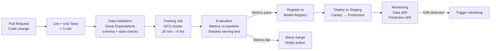

**Critical difference from software CI/CD:** The "test" in ML CI is non-deterministic — two identical training runs on the same data can produce slightly different models due to random initialization, dropout, and floating-point nondeterminism. ML pipelines use **relative evaluation** (is this model better than the current production model?) rather than absolute assertions.

---

## RAG: Retrieval-Augmented Generation

Large language models are trained on static data and lack knowledge of: (1) events after their training cutoff, (2) private organizational data, (3) information not seen during pretraining. Retrieval-Augmented Generation (RAG) solves this by retrieving relevant documents at inference time and injecting them into the prompt context.

### RAG Architecture

```mermaid
flowchart TB
    subgraph Offline["Offline: Document Ingestion Pipeline"]
        DOCS[Documents\nPDFs, wikis, code, emails]
        CHUNK[Chunker\nSplit into 512-token segments]
        EMBED_OFF[Embedding Model\ntext-embedding-3-large\nOpenAI / local]
        VSTORE[(Vector Database\nPinecone / Weaviate / pgvector\nEmbedding index)]
        DOCS --> CHUNK --> EMBED_OFF --> VSTORE
    end

    subgraph Online["Online: Query Processing"]
        USER[User Query\n"What is our Q3 revenue?"]
        EMBED_Q[Query Embedding\nSame model as ingestion]
        ANN[ANN Search\nTop-K similar chunks\nHNSW / IVF index]
        RERANK[Reranker\nCross-encoder\nRefine top-K results]
        CONTEXT[Context Assembly\nSystem prompt +\nretrieved chunks +\nuser query]
        LLM[LLM\nGPT-4 / Claude / Llama\nGenerates grounded answer]
        ANSWER[Answer with citations]

        USER --> EMBED_Q
        EMBED_Q -->|Query vector| ANN
        VSTORE -->|K nearest neighbors| ANN
        ANN --> RERANK
        RERANK --> CONTEXT
        USER --> CONTEXT
        CONTEXT --> LLM
        LLM --> ANSWER
    end
```

**Two-stage retrieval is a best practice for accuracy:**

1. **Stage 1 — ANN search (recall):** Fast approximate nearest neighbor search retrieves top-50 candidates using vector similarity. This is high-recall but moderate precision.
2. **Stage 2 — Reranking (precision):** A cross-encoder model (e.g., `cross-encoder/ms-marco-MiniLM`) scores each candidate against the query more accurately than cosine similarity, because it sees both query and document jointly. Top-5 results after reranking are passed to the LLM.

**Chunking strategy is critical.** Chunks too small lose context (a sentence is meaningless without its paragraph). Chunks too large waste context window and dilute retrieval precision. Common strategies: fixed 512-token chunks with 50-token overlap; recursive character splitter respecting sentence boundaries; document-structure-aware splitting (split on headers, not mid-paragraph).

---

## Vector Databases

Vector databases store high-dimensional embedding vectors and support **Approximate Nearest Neighbor (ANN) search** — finding the K vectors most similar to a query vector by cosine similarity or Euclidean distance. The "approximate" is intentional: exact nearest neighbor in high dimensions requires scanning all vectors, which is too slow at scale. ANN algorithms (HNSW, IVF) trade a small recall drop for orders-of-magnitude speed improvement.

### How HNSW Works

Hierarchical Navigable Small World (HNSW) builds a multi-layer graph where each node is a vector. Upper layers are sparse (long-range connections), lower layers are dense (short-range). Search starts at the top layer, greedily navigates to the approximate region, then descends to the bottom layer for precise local search.

### Vector Database Comparison

| Dimension | Pinecone | Weaviate | pgvector |
|---|---|---|---|
| **Type** | Managed SaaS | Open-source + managed | Postgres extension |
| **ANN algorithms** | Proprietary (HNSW-based) | HNSW, flat | IVFFlat, HNSW |
| **Deployment** | Fully managed (no infra) | Self-hosted or Weaviate Cloud | Runs inside Postgres |
| **Hybrid search** | Metadata filters + vector | Vector + keyword (BM25) + filters | Vector + full SQL |
| **Max scale** | Billions of vectors | Billions (self-hosted) | Millions (Postgres limits) |
| **Latency (10M vectors)** | ~10ms P99 | ~15ms P99 (self-hosted) | ~50–200ms (depends on memory) |
| **Multi-tenancy** | Namespaces | Multi-tenancy built-in | Schema separation |
| **Cost** | [Usage-based](https://www.pinecone.io/pricing/) (free starter, paid from ~$25/month) | Infra cost + managed fees | Postgres instance cost |
| **Best for** | Production RAG, fast start | Open-source preference, hybrid search | Teams already on Postgres; <10M vectors |
| **Weakness** | Vendor lock-in; no raw index access | Operational complexity if self-hosted | Not designed for vector-first workloads |

**Decision framework:**

- Already on Postgres with < 5M vectors → **pgvector** (zero new infrastructure)
- Need open-source with hybrid BM25 + vector search → **Weaviate**
- Need managed, fast time-to-production, > 100M vectors → **Pinecone**

---

## GPU Optimization Techniques

GPU utilization in serving is often shockingly low — 20–40% is common for naive deployments. Three techniques dramatically improve throughput and reduce cost per inference.

### Request Batching

A GPU's throughput is maximized when it processes many examples simultaneously (matrix multiplication efficiency scales with batch size). Real-time serving receives one request at a time, leaving GPU idle between requests.

**Static batching:** Wait up to N milliseconds for more requests to arrive, then process as a batch. Simple but adds fixed latency.

**Continuous batching (for LLMs):** Instead of waiting for all sequences in a batch to finish before accepting new requests, new requests are inserted into the batch dynamically as old sequences complete their generation. This is the breakthrough in vLLM: GPU utilization rises from ~30% to ~80%.

```mermaid
gantt
    title Continuous Batching vs Static Batching (4 GPU slots)
    dateFormat X
    axisFormat %s

    section Static Batching
    Req A (len 8)     :done, 0, 8
    Req B (len 4)     :done, 0, 4
    Req C (len 6)     :done, 0, 6
    GPU IDLE (wait for A) :crit, 4, 8

    section Continuous Batching
    Req A (len 8)     :done, 0, 8
    Req B (len 4)     :done, 0, 4
    Req D inserted    :active, 4, 9
    Req C (len 6)     :done, 0, 6
    Req E inserted    :active, 6, 11
```

### Quantization

Neural network weights are typically stored as 32-bit floats (FP32). Quantization reduces precision:

| Format | Bits | Memory reduction | Accuracy impact | Use case |
|---|---|---|---|---|
| **FP32** | 32 | 1× (baseline) | None | Training (full precision) |
| **BF16** | 16 | 2× | Minimal (<0.1% quality drop) | Training + serving on A100/H100 |
| **FP16** | 16 | 2× | Minimal | Serving on older GPUs (V100) |
| **INT8** | 8 | 4× | Small (0.5–2% accuracy drop) | High-throughput serving, cost-sensitive |
| **INT4** | 4 | 8× | Moderate (2–5% for most tasks) | Edge devices, extreme cost savings |
| **GPTQ / AWQ** | 4-bit | 8× | Smaller than naive INT4 | LLM serving — calibrated quantization |

A 70B parameter LLM in FP32 requires 280 GB of GPU memory (70B × 4 bytes). In INT4, it requires 35 GB — fitting on a single 40GB A100. This is why quantization is essential for LLM deployment.

### Model Parallelism for LLM Serving

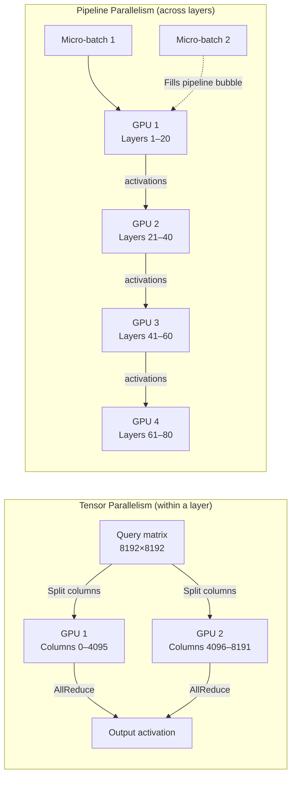

**KV Cache** is a critical LLM inference optimization. During autoregressive text generation, each token's Key and Value matrices from the attention mechanism are cached so they don't need to be recomputed for subsequent tokens. Without KV cache, generating a 1000-token response requires recomputing attention over all previous tokens at every step — O(n²) computation. With KV cache, it is O(n). The cost: KV cache consumes significant GPU memory (vLLM's PagedAttention addresses this with virtual memory paging).

---

## Deep Dive: How Netflix Serves ML Recommendations at Scale

Netflix generates hundreds of millions of personalized rankings daily — homepage rows, search results, notification targeting, and more. Their ML infrastructure represents one of the most sophisticated production ML systems publicly documented.

### Scale

- ~300 million members, each with a unique ranking
- Hundreds of ML models in production simultaneously
- Billions of model predictions generated daily
- Latency SLA: homepage recommendations must load in under 200ms end-to-end

### The Recommendation Architecture

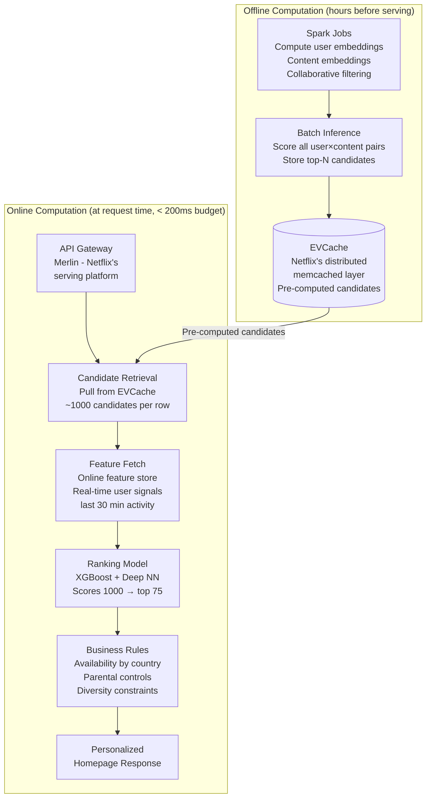

### The Two-Tower Model

Netflix uses a **two-tower neural network** architecture for candidate retrieval. One tower encodes the user (user embedding), the other encodes content (content embedding). Both produce vectors in the same embedding space. Candidate retrieval is then an ANN search: find the content embeddings nearest to the user embedding.

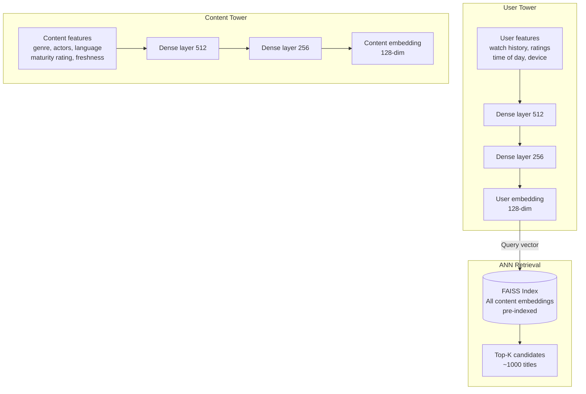

### Key Engineering Decisions

**Hybrid batch + real-time serving:** Netflix precomputes candidate sets overnight (batch, cheap) but applies real-time ranking at request time (uses last-minute signals like "user just watched horror movie"). This separates the expensive retrieval problem (scale: all content × all users) from the latency-sensitive ranking problem (scale: 1000 candidates × current user).

**EVCache for pre-computed candidates:** Netflix built EVCache (Ephemeral Volatile Cache), a distributed memcached layer across AWS regions. Pre-computed candidate sets are written to EVCache after batch inference. At serving time, candidate retrieval is a single cache lookup with < 5ms P99 latency — no model inference required.

**Paved road ML platform (Metaflow):** Netflix open-sourced Metaflow, their Python framework for ML pipelines. It handles: versioned artifacts, compute resource allocation (local, AWS Batch, or Kubernetes), data access abstraction, and experiment reproducibility. Every Netflix ML model is built on Metaflow, so all models benefit from platform improvements automatically.

**A/B testing infrastructure:** Every new model is tested in an A/B experiment before promotion. Netflix's experimentation platform (XP) runs thousands of concurrent A/B tests. Model metrics (click-through rate, play rate, watch time) are computed in near-real-time using Flink streaming pipelines, enabling fast feedback on model quality.

| Metric | Detail |
|---|---|
| Members | ~300M globally |
| Candidate retrieval latency | < 5ms (EVCache hit) |
| End-to-end recommendation latency | < 200ms |
| Models in production | Hundreds simultaneously |
| Daily predictions | Billions |
| Retraining frequency | Daily for most models; hourly for some trend models |
| A/B tests running | Thousands concurrently |

---

## Key Takeaway

> **Building ML systems is 10% model training and 90% data, infrastructure, and operations.** The model is the easy part — PyTorch and pretrained foundations have democratized training. The hard parts are: ensuring training and serving features are computed identically, maintaining reproducibility across hundreds of experiments, deploying models reliably with validation gates, detecting when models degrade silently as data distribution shifts, and serving predictions at millisecond latency under production traffic. Teams that invest in feature stores, experiment tracking, model registries, and monitoring infrastructure will iterate 10x faster than teams that treat each model as a one-off script. And for LLMs, the new primitives — vector databases for RAG, quantization for cost, continuous batching for throughput — are not optional optimizations but necessary foundations for production viability.

---

## Related Chapters

| Chapter | Relevance |
|---------|-----------|
| [Ch11 — Message Queues](/system-design/part-2-building-blocks/ch11-message-queues) | Streaming data pipelines for real-time feature ingestion |
| [Ch09 — SQL Databases](/system-design/part-2-building-blocks/ch09-databases-sql) | Feature store backed by SQL for training data retrieval |
| [Ch23 — Cloud-Native](/system-design/part-5-modern-mastery/ch23-cloud-native-serverless) | Kubernetes for GPU workloads and model serving infrastructure |
| [Ch07 — Caching](/system-design/part-2-building-blocks/ch07-caching) | Model prediction caching to reduce inference latency |

---

## Practice Questions

### Beginner

1. **Training-Serving Skew:** Your fraud detection model achieves 0.92 AUC offline but only 0.78 AUC in production. Describe the three most likely causes of this gap (focusing on feature computation differences), and explain how a feature store would have prevented or detected each issue.

   <details>
   <summary>Hint</summary>
   The three main causes: features computed differently at training time vs serving time, training data includes future information not available at inference (data leakage), and the production distribution has drifted from the training distribution — a feature store enforces identical computation for both.
   </details>

### Intermediate

2. **RAG vs Fine-tuning:** A legal tech company needs their LLM to answer questions over 500K internal case documents updated weekly. Compare RAG vs fine-tuning on: cost to build, cost to update when new cases are added, factual accuracy, hallucination risk, and query latency. Under what conditions would you recommend each approach?

   <details>
   <summary>Hint</summary>
   Fine-tuning bakes knowledge into weights (expensive to update when documents change weekly); RAG retrieves from an index (cheap updates, add new docs to the vector store) but accuracy depends on retrieval quality — for frequently updated factual knowledge bases, RAG is almost always the right choice.
   </details>

3. **Vector Database Selection:** You are building a knowledge management system for a 10,000-person enterprise with 50M document chunks. Requirements: vector similarity search, full-text keyword search, department/date filtering, and real-time updates. Your team already uses RDS Postgres extensively. Evaluate pgvector, Weaviate, and Pinecone for this use case and make a justified recommendation.

   <details>
   <summary>Hint</summary>
   pgvector is the pragmatic choice for an existing Postgres shop (no new infrastructure, ACID guarantees, SQL filtering); its limitation is ANN performance at 50M vectors — acceptable if you accept slightly lower recall vs purpose-built vector DBs.
   </details>

4. **Distributed Training Design:** Your team needs to train a 65B parameter transformer. A single H100 has 80GB VRAM; 65B params in BF16 requires 130GB. You have 16 nodes × 8 H100s. Specify which combination of data parallelism, tensor parallelism, and pipeline parallelism you would use, and identify the critical bottleneck in your design.

   <details>
   <summary>Hint</summary>
   Use tensor parallelism within a node (split layers across 8 GPUs on shared NVLink) and pipeline parallelism across nodes (partition layers across nodes on InfiniBand); data parallelism across node groups — the critical bottleneck is inter-node bandwidth during gradient synchronization.
   </details>

### Advanced

5. **LLM Serving Cost Optimization:** Your customer support chatbot uses a 7B LLM: 4× A100 40GB (FP32), static batching, P99 800ms, 12 req/s throughput, $8K/month GPU cost. You need to cut cost by 60% while keeping P99 < 500ms and throughput > 30 req/s. Describe your optimization plan across quantization, batching strategy, and infrastructure. Estimate the impact of each change and verify all three constraints are met.

   <details>
   <summary>Hint</summary>
   INT8 quantization halves GPU memory (can run on 2× A100 or smaller GPUs, -50% cost); continuous batching (vs static) increases GPU utilization and throughput 2–4×; switch to continuous batching framework (vLLM) — together these changes can achieve 60% cost reduction while improving throughput.
   </details>

---

## References & Further Reading

- "Designing Machine Learning Systems" — Chip Huyen
- "Hidden Technical Debt in Machine Learning Systems" — Google (NeurIPS 2015)
- [MLflow documentation](https://mlflow.org/)
- "Scaling Machine Learning at Uber" — Uber Engineering Blog
