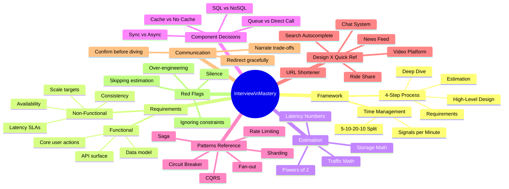
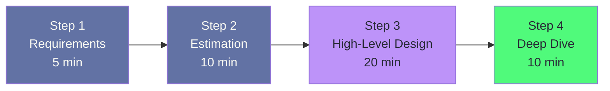
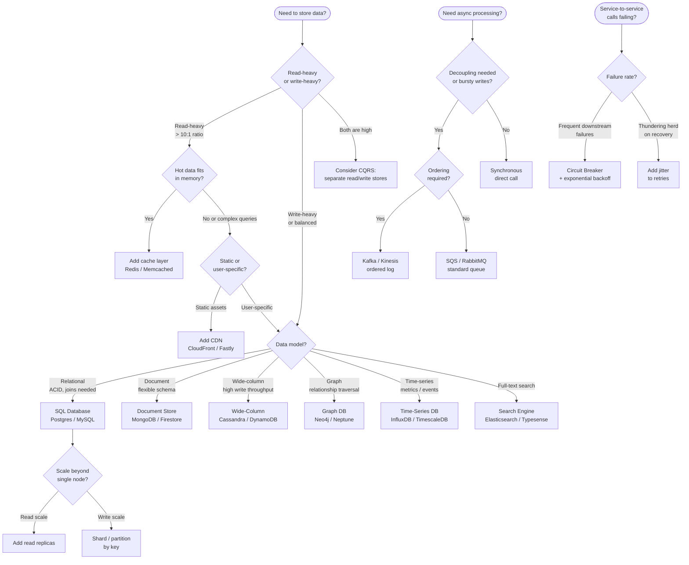

# Chapter 25: Interview Framework & Cheat Sheets


> A system design interview is not a test of whether you know the right answer — there is no single right answer. It is a test of whether you think like an engineer who has shipped systems at scale: someone who asks the right questions first, reasons about trade-offs out loud, and communicates a coherent design under time pressure. The framework in this chapter is the repeatable scaffold every strong candidate uses, consciously or not.

---

## Mind Map



---

## The 4-Step Interview Framework

Every strong system design interview follows the same four phases regardless of the question asked. Internalizing this structure removes the cognitive overhead of "what do I do next?" and lets you focus entirely on the technical reasoning.



### Step 1 — Requirements (5 minutes)

Before drawing a single box, ask clarifying questions. The goal is to narrow an ambiguous prompt into a concrete, bounded problem. Interviewers deliberately leave questions vague to see if you will dive in recklessly or slow down and build shared understanding.

**Functional requirements** define what the system does:
- Who are the primary users and what are their core actions?
- What is the most critical user journey? (the happy path)
- What features are in scope for this design? Which are explicitly out of scope?
- What does the API surface look like at a high level? (read? write? both?)
- Does the system need real-time behavior or is eventual consistency acceptable?

**Non-functional requirements** define how well the system does it:
- What is the target scale? (DAU, requests per second, data volume)
- What are the latency SLAs? (P50? P99? Are there hard real-time requirements?)
- What availability target? (99.9% = 8.7h downtime/year; 99.99% = 52min/year)
- What consistency model is required? (strong vs eventual — see [Chapter 3](/system-design/part-1-fundamentals/ch03-core-tradeoffs))
- Is the system read-heavy, write-heavy, or balanced?
- What are the geographic requirements? (single region? global?)
- Are there regulatory or compliance constraints? (GDPR, HIPAA)

**End of Step 1:** Summarize back to the interviewer: *"So I understand we're building X with these key constraints: Y DAU, Z ms P99 latency, and we're prioritizing availability over strict consistency. Out of scope are A and B. Does that match your expectations?"* This confirmation step prevents wasted design effort and demonstrates professional communication habits.

---

### Step 2 — Estimation (10 minutes)

Estimation grounds your design in reality. It reveals the scale characteristics that drive architectural decisions: whether you need a single database or sharding, whether a single cache node suffices or you need a distributed cache, whether you can use a simple queue or need a distributed log.

**Key estimation formula categories:**

| Category | What to Calculate | Why It Matters |
|---|---|---|
| **Traffic** | Requests per second (read + write) | Determines server count, load balancer capacity |
| **Storage** | Data per day × retention period | Determines DB sharding strategy, cost |
| **Bandwidth** | Bytes per request × RPS | Determines CDN need, network costs |
| **Cache size** | Hot data × working set ratio | Determines cache tier sizing |
| **Memory per server** | Concurrent connections × state size | Determines vertical vs horizontal scaling |

**Estimation discipline:** State your assumptions explicitly and keep math simple. Round aggressively. An estimate within 10× is useful; spending 5 minutes on precision arithmetic is not. The interviewer is evaluating your reasoning process, not arithmetic accuracy.

---

### Step 3 — High-Level Design (20 minutes)

This is the core of the interview. Draw the major components and their interactions. Start with the simplest design that satisfies the requirements, then evolve it.

**The pattern for Step 3:**

1. Identify the primary read and write paths
2. Draw the client → API layer → service layer → storage layer skeleton
3. Walk through the critical user journey end-to-end
4. Identify bottlenecks or failure points in the naive design
5. Introduce components to address each bottleneck (cache, queue, CDN, etc.)
6. Briefly justify each component you add

**Common mistake:** Drawing components you don't need. Every box you draw invites a deep-dive question. Only add components you can justify.

---

### Step 4 — Deep Dive (10 minutes)

The interviewer will direct this phase toward areas of interest or concern. Common targets:

- **Bottleneck component:** "Walk me through how your cache works under a cache miss storm"
- **Failure scenario:** "What happens when your message broker goes down?"
- **Scale scenario:** "How does this design change at 10× the traffic you estimated?"
- **Specific trade-off:** "Why did you choose Cassandra over PostgreSQL here?"

**The right posture for deep dives:** You do not need to have everything designed in advance. It is acceptable — and signals maturity — to say: *"I deliberately left the sharding strategy as a detail to discuss. Here is how I would approach it and the trade-offs involved."*

---

## Time Management: The 5-10-20-10 Split

A 45-minute system design interview contains roughly 40 minutes of usable time (5 minutes for logistics and wrap-up). Use the 5-10-20-10 allocation as a forcing function — not a rigid timer, but a mental checkpoint.

```mermaid
gantt
    title 45-Minute Interview Timeline
    dateFormat mm
    axisFormat %M min

    section Step 1
    Requirements & Clarification :active, a1, 00, 5m

    section Step 2
    Estimation & Scale Analysis :a2, after a1, 10m

    section Step 3
    High-Level Design :crit, a3, after a2, 20m

    section Step 4
    Deep Dive :a4, after a3, 10m
```



**Warning signs you are off track:**

| Time Elapsed | Warning Sign | Correction |
|---|---|---|
| 15 min | Still gathering requirements | Commit to assumptions and move forward |
| 20 min | Still doing estimation | Wrap up with "ballpark ~X RPS" and proceed |
| 35 min | No high-level design drawn yet | Rapid-sketch the core architecture immediately |
| 40 min | Deep dive consuming all time | Signal to interviewer: "I want to make sure I've covered breadth — should we continue here or step back?" |

---

## Requirements Gathering Checklist

Print this and drill it until the questions are automatic.

### Functional Checklist

- [ ] What is the primary user action? (the one thing this system must do)
- [ ] What are the secondary features? (which are in scope?)
- [ ] What does the write path look like? (what data does the user submit?)
- [ ] What does the read path look like? (what does the user need to retrieve?)
- [ ] Are there real-time requirements? (streaming, push notifications, live updates)
- [ ] Are there content types beyond text? (images, video, binary blobs)
- [ ] Is search required? (full-text, filters, ranking)
- [ ] Are there user relationships? (social graph, follows, permissions)
- [ ] What are the data lifecycle rules? (retention, deletion, archival)

### Non-Functional Checklist

- [ ] Daily Active Users (DAU) and Monthly Active Users (MAU)
- [ ] Peak RPS (read) and peak RPS (write)
- [ ] P50 / P99 latency SLA (read) and latency SLA (write)
- [ ] Availability target (99.9% / 99.99% / 99.999%)
- [ ] Consistency requirement (strong / eventual / read-your-writes)
- [ ] Data durability requirement (what data loss is tolerable? RPO?)
- [ ] Geographic scope (single region / multi-region / global)
- [ ] Data volume: size per record × records per day × retention
- [ ] Security / compliance constraints (auth model, encryption, GDPR)
- [ ] Budget / cost sensitivity (relevant for architecture choices)

---

## Estimation Cheat Sheet

### Powers of 2 — Memory Reference

| Power | Exact | Approximate | Common Use |
|---|---|---|---|
| 2^10 | 1,024 | ~1 thousand | KB |
| 2^20 | 1,048,576 | ~1 million | MB |
| 2^30 | 1,073,741,824 | ~1 billion | GB |
| 2^40 | ~1 trillion | ~1 trillion | TB |
| 2^50 | ~1 quadrillion | ~1 quadrillion | PB |

### Latency Numbers Every Engineer Should Know

These numbers (popularized by Jeff Dean, updated for modern hardware) anchor every performance discussion. Memorize the order of magnitude, not the exact value.

| Operation | Latency | Relative to L1 cache |
|---|---|---|
| L1 cache hit | 1 ns | 1× |
| L2 cache hit | 4 ns | 4× |
| L3 cache hit | 40 ns | 40× |
| RAM access | 100 ns | 100× |
| SSD random read (NVMe) | 100 µs | 100,000× |
| HDD random read | 10 ms | 10,000,000× |
| Network: same datacenter | 500 µs | 500,000× |
| Network: cross-region (US) | 40–80 ms | ~50,000,000× |
| Network: trans-Pacific | 100–200 ms | ~100,000,000× |
| Mutex lock/unlock | 25 ns | 25× |
| Compress 1 KB (Snappy) | 3 µs | 3,000× |
| Send 1 KB over 1 Gbps | 10 µs | 10,000× |

**Interview insight:** The gap between RAM (100 ns) and SSD (100 µs) is 1,000×. This is why caching hot data in memory is so impactful. The gap between SSD and HDD (10 ms) is 100×. This is why all modern systems use SSDs.

### Traffic Estimation Template

```
DAU = D users
Read/write ratio = R:1
Reads per user per day = R_u
Writes per user per day = W_u

Write RPS = (D × W_u) / 86,400 sec
Read RPS  = Write RPS × R

Peak multiplier = ~2–3× average for most systems

Storage per day = D × W_u × avg_record_size
Storage total   = Storage per day × retention_days
```

### Common System Size Benchmarks

| System Type | Typical DAU | Write RPS | Read RPS | Data/day |
|---|---|---|---|---|
| Small startup | 10K | < 1 | ~5 | < 1 GB |
| Mid-size app | 1M | ~10 | ~100 | ~10 GB |
| Large consumer app | 100M | ~1,000 | ~10,000 | ~1 TB |
| Ultra-scale (Twitter/YouTube) | 500M+ | ~5,000+ | ~50,000+ | ~10 TB+ |

### Quick Conversion Reference

| Unit | Value |
|---|---|
| 1 day in seconds | 86,400 ≈ 100K |
| 1 month in seconds | ~2.5M |
| 1 year in seconds | ~31.5M |
| 1 million bytes | ~1 MB |
| 1 billion bytes | ~1 GB |
| Average tweet | ~300 bytes |
| Average image (thumbnail) | ~200 KB |
| Average HD photo | ~3 MB |
| Average HD video (1 min) | ~100 MB |
| 1 Gbps bandwidth | ~125 MB/s |

---

## Component Decision Tree

Use this flowchart when deciding which component to add to your design. Justify every component you include.



### Component Selection Quick Reference

| Situation | Add This | Why |
|---|---|---|
| Read RPS > 10× write RPS | Cache (Redis) | Serve reads from memory, offload DB |
| Write RPS > DB can handle | Message queue | Buffer and process asynchronously |
| Users in multiple regions | CDN | Serve static content from edge |
| Different read/write load shapes | CQRS | Optimize each path independently |
| Downstream service is flaky | Circuit breaker | Prevent cascade failures |
| Traffic spikes unpredictably | Queue + async workers | Absorb spikes without dropping requests |
| Need full-text search | Search index (Elasticsearch) | B-tree indexes cannot rank by relevance |
| Coordinate distributed transaction | Saga pattern | Avoid distributed ACID — use compensations |
| Rate limit per user | Token bucket + Redis | Atomic increment with TTL |

---

## Common Patterns Reference Table

These patterns appear repeatedly across system design problems. Know what each solves, when to apply it, and the trade-off you accept.

| Pattern | Problem It Solves | Trade-off You Accept | Chapter Reference |
|---|---|---|---|
| **Read replica** | Read scaling beyond single DB node | Eventual consistency on replicas | [Ch 9](/system-design/part-2-building-blocks/ch09-databases-sql) |
| **Horizontal sharding** | Write scaling beyond single DB node | Cross-shard queries become expensive | [Ch 9](/system-design/part-2-building-blocks/ch09-databases-sql) |
| **Cache aside** | Reduce DB read load | Cache invalidation complexity; stale reads | [Ch 7](/system-design/part-2-building-blocks/ch07-caching) |
| **Write-through cache** | Keep cache always warm | Higher write latency | [Ch 7](/system-design/part-2-building-blocks/ch07-caching) |
| **Fan-out on write** | Low-latency feed reads | High write amplification for viral users | [Ch 19](/system-design/part-4-case-studies/ch19-social-media-feed) |
| **Fan-out on read** | Low write amplification | Higher read latency (merge at read time) | [Ch 19](/system-design/part-4-case-studies/ch19-social-media-feed) |
| **CQRS** | Different read/write scaling needs | Two models to keep in sync | [Ch 13](/system-design/part-3-architecture-patterns/ch13-microservices) |
| **Event sourcing** | Full audit log; temporal queries | Replay cost; eventual consistency | [Ch 14](/system-design/part-3-architecture-patterns/ch14-event-driven-architecture) |
| **Saga** | Distributed transactions without 2PC | Compensating transactions needed | [Ch 13](/system-design/part-3-architecture-patterns/ch13-microservices) |
| **Circuit breaker** | Prevent cascade failure | Must tune thresholds carefully | [Ch 16](/system-design/part-3-architecture-patterns/ch16-security-reliability) |
| **Consistent hashing** | Minimize rehashing when nodes change | Hotspot risk without virtual nodes | [Ch 6](/system-design/part-2-building-blocks/ch06-load-balancing) |
| **Bloom filter** | Avoid unnecessary DB lookups | False positive rate (tunable) | [Ch 7](/system-design/part-2-building-blocks/ch07-caching) |
| **Rate limiting (token bucket)** | Protect APIs from abuse | Burst allowed up to bucket size | [Ch 16](/system-design/part-3-architecture-patterns/ch16-security-reliability) |
| **Idempotency key** | Safe retries for payments/writes | Client must generate and store key | [Ch 12](/system-design/part-2-building-blocks/ch12-communication-protocols) |
| **Outbox pattern** | Atomic DB write + event publish | Extra table; polling or CDC overhead | [Ch 14](/system-design/part-3-architecture-patterns/ch14-event-driven-architecture) |
| **Bulkhead** | Isolate failure to one subsystem | Resource underutilization per bulkhead | [Ch 16](/system-design/part-3-architecture-patterns/ch16-security-reliability) |
| **Two-phase commit (2PC)** | Atomic writes across services | Blocking protocol; coordinator SPOF | [Ch 15](/system-design/part-3-architecture-patterns/ch15-data-replication-consistency) |

---

## Red Flags to Avoid

These are behaviors and statements that signal weak system design thinking to interviewers. Recognize and eliminate them from your responses.

### Design Red Flags

**Over-engineering from the start**
Adding Kafka, a service mesh, multi-region replication, and a Bloom filter to a system that serves 10,000 users signals poor judgment. Start simple. Add complexity only when justified by scale or failure scenario.

**Under-specifying storage**
"I'll use a database" is not a design decision. Name the database, justify the choice, and explain how it handles the scale you estimated.

**Ignoring the non-functional requirements**
Designing a system with 99.9% uptime requirements using a single server with no redundancy is a fundamental miss. Every major architectural decision should trace back to an NFR.

**Treating every component as infinitely scalable**
Queues fill up. Caches evict. Leader nodes become bottlenecks. Strong candidates acknowledge the limits of every component they introduce and explain how they handle those limits.

**Not addressing failure modes**
Every distributed system fails. If your design has no mention of what happens when the database is unavailable, the message queue is full, or a service is slow, the design is incomplete.

### Communication Red Flags

**Silence**
Long pauses with no narration signal that you are stuck. Narrate your thought process even when uncertain: *"I'm weighing two options here — let me think through the trade-offs."*

**Jumping to implementation details too early**
Describing the exact Redis cluster configuration before establishing why you need a cache at all is a sign of poor structure. Complete each step before moving to the next.

**Never asking questions**
Proceeding through the entire design without any clarifying questions signals either overconfidence or a failure to understand that requirements shape architecture.

**Ignoring the interviewer's hints**
Interviewers often embed hints in their follow-up questions: *"What if the cache goes down?"* means they want you to discuss cache failure handling. Respond to the subtext, not just the surface question.

**Defending a bad decision when challenged**
If an interviewer challenges your choice, the right response is to engage with the trade-off, not to double down. *"You're right that adds complexity — here's when I'd consider that trade-off acceptable and when I wouldn't."*

---

## Communication Tips for Whiteboard Interviews

### Before You Draw

1. Restate the problem in your own words
2. List your assumptions explicitly — on the whiteboard
3. Confirm scope with the interviewer before designing

### While Designing

1. **Narrate your trade-offs**, not just your decisions: *"I'm choosing eventual consistency here because the latency benefit outweighs the risk of slightly stale reads for this use case."*
2. **Label everything** — every box, every arrow, every data store. Unlabeled diagrams signal vague thinking.
3. **Think in terms of data flow** — trace the request from client to storage and back. This reveals missing components naturally.
4. **State constraints explicitly** — when you add a component, say what problem it solves and what new constraint it introduces.

### Managing Uncertainty

- *"I'm not certain of the exact API for X, but the design principle I'm using is..."*
- *"I can go deeper on the sharding strategy — want me to explore that, or should I keep moving forward?"*
- *"There are two approaches here: A trades X for Y, B trades Y for X. Given our requirements, I'd lean toward A because..."*

### At the End

Summarize your design in 2–3 sentences. Identify the one or two decisions you consider most critical and why. Mention what you would revisit if given more time.

---

## Quick Reference: "Design X" → Key Components

This table synthesizes the most common interview questions into their essential components. Use it to verify you are not missing a major piece during your design.

| System | Core Storage | Cache Layer | Async | Key Challenge | Chapter |
|---|---|---|---|---|---|
| **URL Shortener** | SQL or NoSQL (id → url) | Redis (hot URLs) | None required | Collision-free ID generation, redirect latency | [Ch 18](/system-design/part-4-case-studies/ch18-url-shortener-pastebin) |
| **Chat System** | Message log (Cassandra) | Redis (online presence, sessions) | WebSocket push | Message ordering, delivery guarantees, fan-out | [Ch 20](/system-design/part-4-case-studies/ch20-chat-messaging-system) |
| **News Feed** | Posts DB (SQL) + Feed store (Redis) | Pre-computed feeds in Redis | Kafka (fan-out workers) | Fan-out at scale, celebrity problem, ranking | [Ch 19](/system-design/part-4-case-studies/ch19-social-media-feed) |
| **Video Platform** | Blob storage (S3) + metadata (SQL) | CDN (video segments), Redis (views) | Transcoding pipeline (queues) | Transcoding at scale, ABR streaming, storage cost | [Ch 21](/system-design/part-4-case-studies/ch21-video-streaming-platform) |
| **Search Autocomplete** | Trie or inverted index (Elasticsearch) | Redis (top-K suggestions) | Offline index build | Prefix matching speed, freshness, personalization | [Ch 25](/system-design/part-5-modern-mastery/ch25-interview-framework-cheat-sheets) |
| **Ride Share** | SQL (trips/users) + geospatial index | Redis (driver locations) | Location broadcast queue | Real-time location matching, surge pricing | — |
| **Notification Service** | SQL (subscriptions) + delivery log | Redis (rate limit per user) | Kafka → push workers | At-least-once delivery, per-user rate limiting | [Ch 14](/system-design/part-3-architecture-patterns/ch14-event-driven-architecture) |
| **Rate Limiter** | Redis (counters) | Redis is the store | None | Atomic counters, distributed sync, sliding window | [Ch 16](/system-design/part-3-architecture-patterns/ch16-security-reliability) |
| **Web Crawler** | URL frontier (queue + DB) | Bloom filter (seen URLs) | Distributed crawl workers | Politeness, deduplication, scale | — |
| **Payment System** | SQL with ACID (idempotency keys) | None (correctness > speed) | Async settlement queue | Exactly-once processing, reconciliation | — |
| **Distributed Cache** | In-memory (sharded) | Self (it is the cache) | Gossip protocol | Consistent hashing, eviction, replication | [Ch 7](/system-design/part-2-building-blocks/ch07-caching) |
| **File Storage (S3-like)** | Object store + metadata DB | CDN for reads | Async replication | Large object upload (multipart), durability (replication) | — |

### Design Pattern Quick-Match

| If the interviewer says... | The key design tension is... | Lead with... |
|---|---|---|
| "Design a system that handles 1M writes/sec" | Write scalability | Sharding strategy + async queue |
| "Design a globally available system" | Multi-region latency vs consistency | CDN + regional replicas + consistency model |
| "Design a system that must never lose data" | Durability vs availability | WAL, synchronous replication, backup strategy |
| "Design a real-time feature" | Latency vs throughput | WebSockets / SSE, in-memory state |
| "Design a recommendation engine" | ML serving + freshness | Feature store + precomputed vs on-demand |
| "Make this cheaper to operate" | Cost optimization | Tiered storage, caching, serverless for spiky load |

---

## Practice Scenarios with Time-Boxed Walkthroughs

Work through each scenario using the 5-10-20-10 framework. The goal is not to produce a perfect design — it is to produce a coherent design under time pressure.

### Scenario A: Design a Distributed Job Scheduler

**The prompt:** Design a system that runs scheduled tasks (cron-like) for 10,000 tenants. Each tenant can define up to 1,000 jobs. Jobs run from every minute to monthly. The system must not miss jobs and must provide a UI to view job history.

**Step 1 — Requirements (5 min):**
- Functional: job registration (cron expression + webhook URL), job execution (HTTP call to tenant endpoint), job history (last N executions, status, output)
- Non-functional: 10,000 tenants × 1,000 jobs = 10M job definitions. At 1 job/min average, ~10M triggers/day. Each trigger = HTTP call. Must guarantee at-least-once delivery. History retention: 90 days.

**Step 2 — Estimation (10 min):**
- 10M triggers/day ÷ 86,400 sec ≈ 115 triggers/sec average; peak ≈ 300/sec (jobs scheduled at :00 of every minute)
- Job definition storage: 10M jobs × 500 bytes = 5 GB — fits in a single SQL DB
- History storage: 10M executions/day × 1 KB ≈ 10 GB/day × 90 days = 900 GB — needs tiered storage or time-series partitioning

**Step 3 — High-Level Design (20 min):**
- **Scheduler service:** polls DB for jobs due in the next N seconds, publishes to queue
- **Execution workers:** pull from queue, make HTTP call, record result in history DB
- **Challenges:** at-2:00 AM, all "daily" jobs fire simultaneously — thundering herd. Solution: add jitter (randomize execution time within a 60-second window for non-strict jobs)
- **Deduplication:** use idempotency key (job_id + scheduled_time) to prevent double execution if scheduler fails and retries
- **History storage:** partition by `tenant_id + month` — allows efficient per-tenant queries and old partition drops

**Step 4 — Deep Dive (10 min):**
- Focus: what happens if a scheduler node crashes mid-cycle? Use leader election (ZooKeeper / Etcd) — only one scheduler runs at a time. Alternatively: use distributed lock per job (Redis SET NX with TTL) so any worker can claim a job exactly once.

---

### Scenario B: Design a Real-Time Leaderboard

**The prompt:** Design a leaderboard for a gaming platform with 5M DAU. Players earn scores continuously. The leaderboard must show global top 100 and each player's rank in near-real-time (< 5 second lag). Support both global and per-game leaderboards.

**Step 1 — Requirements (5 min):**
- Functional: submit score event, read top-100 list, read my rank, support multiple games
- Non-functional: 5M DAU → ~1,000 score submissions/sec peak. Top-100 read: high frequency (dashboard polling). Rank query must be fast. "Near-real-time" = 5s lag acceptable.

**Step 2 — Estimation (10 min):**
- Score events: 5M DAU × 50 scores/day ÷ 86,400 = ~3,000 writes/sec
- Leaderboard reads: top-100 read by millions — heavy read traffic, needs caching
- Sorted set per game: 5M players × 8 bytes score + 8 bytes ID = ~80 MB per game — fits in Redis sorted set

**Step 3 — High-Level Design (20 min):**
- **Score ingestion:** API → Kafka topic per game → consumer updates Redis sorted set (`ZADD game:{id}:leaderboard score player_id`)
- **Top-100 read:** `ZREVRANGE game:{id}:leaderboard 0 99 WITHSCORES` — O(log N + 100), cached with 5-second TTL
- **My rank:** `ZREVRANK game:{id}:leaderboard player_id` — O(log N), no cache needed (personalized)
- **Persistence:** async writer persists leaderboard snapshots to Postgres for history; Redis is source of truth for current rankings
- **Per-game isolation:** separate sorted set keys per game_id — no cross-game interference

**Step 4 — Deep Dive (10 min):**
- Challenge: Redis sorted set max memory. At 5M players × 50 games = 250M entries. 250M × 16 bytes = 4 GB — manageable on a single Redis node with enough RAM. For 500 games × 50M players: 500 × 800 MB = 400 GB → shard by game_id across Redis cluster.

---

### Scenario C: Design a Configuration Management Service

**The prompt:** Design a service that stores and serves application configuration (feature flags, tuning parameters) to 500 microservices, each with 10–100 instances. Config changes must propagate within 10 seconds. Services must continue working if the config service is unavailable.

**Step 1 — Requirements (5 min):**
- Functional: set/get/update config values, per-service namespaces, versioning, rollback
- Non-functional: 500 services × 50 instances = 25,000 clients. Read-heavy (every service reads config at startup + polls). 10-second propagation SLA. Must tolerate config service downtime (availability over consistency).

**Step 2 — Estimation (10 min):**
- Config reads: 25,000 clients × 1 poll/10s = 2,500 reads/sec. Config size: 10 KB per service → 500 services = 5 MB total. Entirely cacheable.
- Writes: rare (operator changes) — 1–10/day

**Step 3 — High-Level Design (20 min):**
- **Config store:** Postgres (versioned rows, strong consistency for writes)
- **Propagation:** publish change events to Kafka; all config service replicas consume and update local cache; push to connected clients via long-poll or SSE
- **Client SDK:** local in-process cache with 30-second TTL. On TTL expiry: request from nearest config service replica. On config service unavailable: serve stale cache (last known good).
- **Durability:** client writes config to local disk on first fetch — survives process restarts even without config service
- **10-second SLA:** Kafka propagation latency < 1s + push to client < 1s → well within SLA

**Step 4 — Deep Dive (10 min):**
- Challenge: how do you roll out a config change to 10% of instances for canary testing? Add `rollout_percentage` field to config entry. Client SDK hashes `service_instance_id` and enables the new value only if hash mod 100 < rollout_percentage. This is deterministic — same instance always gets same value — and requires no central coordination.

---

## Key Takeaway

> **The framework is not the goal — it is the scaffolding.** Strong candidates use the 4-step process to demonstrate that they think like engineers who build real systems: they clarify before they commit, they let scale drive architecture, they justify every component they add, and they communicate trade-offs instead of claiming their design is "the best." The cheat sheets in this chapter are mnemonics for patterns you should already understand from first principles. If you can explain *why* Redis sorted sets are the right structure for a leaderboard, *why* fan-out on write breaks down for celebrities, and *why* you need idempotency keys for payment systems — not just *that* they are the answer — you are ready. The goal is not to memorize designs. The goal is to internalize the reasoning process so deeply that you can derive any design from constraints alone.

---

## Practice Questions

1. **Framework Application:** You are asked to "Design Instagram." Walk through all four steps of the framework for this system. For Step 2, produce a concrete estimate for storage requirements given 500M DAU, 100M photos uploaded per day, and 10-year retention. For Step 3, identify the three most critical architectural decisions and justify each. For Step 4, choose one component and describe two failure scenarios with mitigations.

2. **Trade-off Reasoning:** An interviewer asks you to design a notification system and then follows up: "What if a downstream push notification provider (APNs, FCM) goes down for 20 minutes?" Walk through how your design handles this scenario. What changes if the SLA requires notifications to be delivered within 60 seconds of the triggering event vs within 24 hours?

3. **Estimation Under Pressure:** Without a calculator, estimate: how many servers are needed to serve YouTube at 1 billion video views per day, assuming each view streams 50 MB of data over 10 minutes, and each server can sustain 1 Gbps of outbound bandwidth? Show all steps. What would change if 90% of traffic is served by CDN?

4. **Pattern Selection Defense:** You are designing a social media feed and propose fan-out on write (pre-compute feeds in Redis). The interviewer asks: "A user has 10 million followers and posts 5 times a day. How does your system handle that?" Describe the problem, explain why fan-out on write breaks at that scale, and propose a hybrid approach. Justify the threshold at which you switch strategies.

5. **Red Flag Recovery:** Midway through a design interview, you realize your initial architecture cannot support the write throughput you estimated in Step 2 — you designed for 100 writes/sec but your estimation shows 10,000 writes/sec. How do you handle this moment in the interview? What do you say, what architectural changes do you make, and how do you demonstrate that discovering and correcting mistakes mid-interview is actually a signal of strength?
